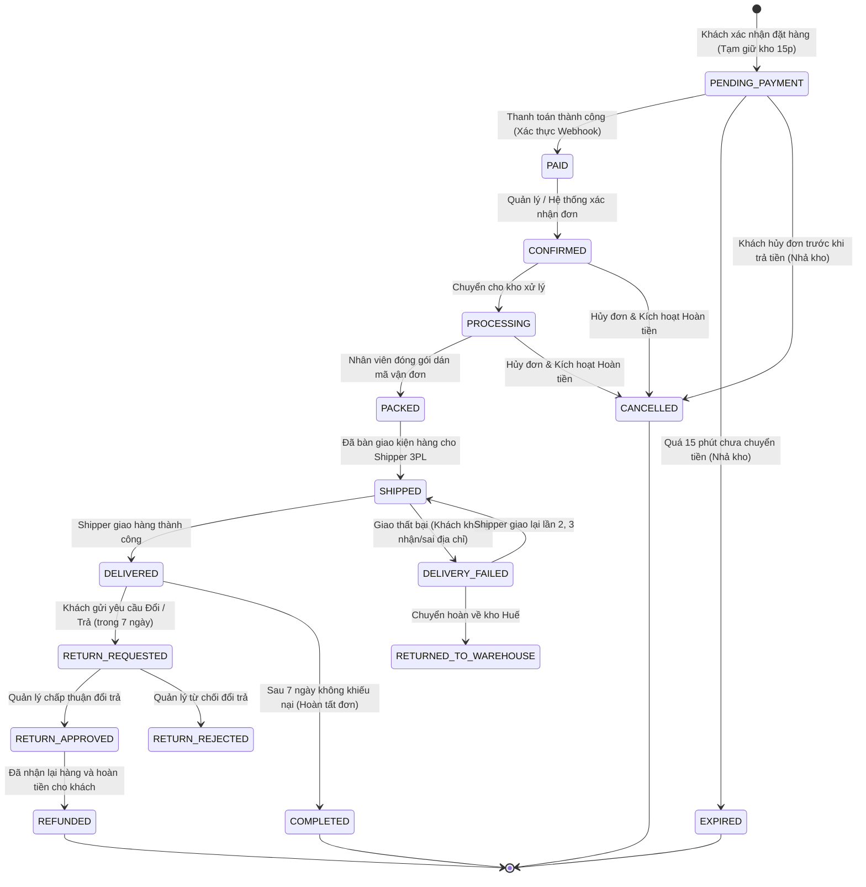

# TÀI LIỆU ĐẶC TẢ USER STORIES & YÊU CẦU NGHIỆP VỤ HỆ THỐNG TOÀN DIỆN
## DỰ ÁN: HỆ SINH THÁI THƯƠNG MẠI ĐIỆN TỬ ĐA KÊNH & HỆ THỐNG PHÂN TÍCH HỖ TRỢ QUYẾT ĐỊNH CHIẾN LƯỢC CHO NÔNG ĐẶC SẢN OCOP HUẾ (MÈ XỬNG O MẠ)
### PHIÊN BẢN CHUẨN HÓA KỸ NGHỆ PHẦN MỀM: 18 EPICS, BUSINESS RULES & 60+ USER STORIES

---

## MỤC LỤC TÀI LIỆU
1. [1. TỔNG QUAN HỆ THỐNG & KHUNG PHÂN TÁCH YÊU CẦU](#1-tổng-quan-hệ-thống--khung-phân-tách-yêu-cầu)
2. [2. MÔ HÌNH HÓA TÁC NHÂN (ACTORS IDENTIFICATION)](#2-mô-hình-hóa-tác-nhân-actors-identification)
3. [3. CHÂN DUNG NGƯỜI DÙNG ĐIỂN HÌNH (PERSONAS)](#3-chân-dung-người-dùng-điển-hình-personas)
4. [4. QUY TẮC NGHIỆP VỤ CỐT LÕI (CORE BUSINESS RULES - BRs)](#4-quy-tắc-nghiệp-vụ-cốt-lõi-core-business-rules---brs)
5. [5. MÁY TRẠNG THÁI VÒNG ĐỜI ĐƠN HÀNG (ORDER STATE MACHINE)](#5-máy-trạng-thái-vòng-đời-đơn-hàng-order-state-machine)
6. [6. BẢN ĐỒ USER STORY TỔNG THỂ (USER STORY MAP - 18 EPICS)](#6-bản-đồ-user-story-tổng-thể-user-story-map---18-epics)
7. [7. ĐẶC TẢ CHI TIẾT USER STORIES THEO TỪNG EPIC](#7-đặc-tả-chi-tiết-user-stories-theo-từng-epic)
   - [EPIC 01 — Authentication, Guest Checkout & Conversion](#epic-01--authentication-guest-checkout--conversion)
   - [EPIC 02 — Product Discovery & Navigation](#epic-02--product-discovery--navigation)
   - [EPIC 03 — Product Detail, Variants & SKU Selection](#epic-03--product-detail-variants--sku-selection)
   - [EPIC 04 — Shopping Cart Management](#epic-04--shopping-cart-management)
   - [EPIC 05 — Checkout Workflow & Inventory Reservation](#epic-05--checkout-workflow--inventory-reservation)
   - [EPIC 06 — Payment Processing](#epic-06--payment-processing)
   - [EPIC 07 — Order Lifecycle Management](#epic-07--order-lifecycle-management)
   - [EPIC 08 — Shipping, Tracking & Logistics 3PL](#epic-08--shipping-tracking--logistics-3pl)
   - [EPIC 09 — Cancellation, Return & Refund](#epic-09--cancellation-return--refund)
   - [EPIC 10 — Verified Product Reviews & Ratings](#epic-10--verified-product-reviews--ratings)
   - [EPIC 11 — Customer Support & Ticket Management](#epic-11--customer-support--ticket-management)
   - [EPIC 12 — Promotion Engine, Coupons & Combos](#epic-12--promotion-engine-coupons--combos)
   - [EPIC 13 — Loyalty Program, Points & Reorder](#epic-13--loyalty-program-points--reorder)
   - [EPIC 14 — Gift Ordering & Personal Message](#epic-14--gift-ordering--personal-message)
   - [EPIC 15 — B2B Corporate Gifting & Bulk Orders](#epic-15--b2b-corporate-gifting--bulk-orders)
   - [EPIC 16 — Product Traceability & OCOP Heritage Story](#epic-16--product-traceability--ocop-heritage-story)
   - [EPIC 17 — Store Operations, Management & Administration](#epic-17--store-operations-management--administration)
   - [EPIC 18 — Business Intelligence & Strategic Decision Support (DSS)](#epic-18--business-intelligence--strategic-decision-support-dss)
8. [8. BẢNG TỔNG HỢP USER STORIES (AGILE TRACEABILITY MATRIX)](#8-bảng-tổng-hợp-user-stories-agile-traceability-matrix)
9. [9. DANH MỤC YÊU CẦU CHỨC NĂNG (FUNCTIONAL REQUIREMENTS)](#9-danh-mục-yêu-cầu-chức-năng-functional-requirements)
10. [10. DANH MỤC YÊU CẦU PHI CHỨC NĂNG (NON-FUNCTIONAL USER NEEDS)](#10-danh-mục-yêu-cầu-phi-chức-năng-non-functional-user-needs)
11. [11. KẾ HOẠCH PHÂN KỲ PHÁT TRIỂN (MVP / PHASE 2 / PHASE 3)](#11-kế-hoạch-phân-kỳ-phát-triển-mvp--phase-2--phase-3)

---

## 1. TỔNG QUAN HỆ THỐNG & KHUNG PHÂN TÁCH YÊU CẦU

Hệ thống Thương mại Điện tử Nông đặc sản OCOP **"Mè Xửng O Mạ"** được thiết kế nhằm mục tiêu kết nối trực tiếp văn hóa ẩm thực Cố Đô Huế đến người tiêu dùng toàn quốc qua kênh số D2C, chuẩn hóa quy trình bán lẻ và bán buôn quà tặng doanh nghiệp B2B, đồng thời cung cấp nền tảng phân tích hỗ trợ ra quyết định chiến lược cho ban điều hành.

### Nguyên Lý Phân Tách Yêu Cầu Chuẩn Kỹ Nghệ Phần Mềm (Separation of Concerns):
Tài liệu này tuyệt đối **không đưa tên công nghệ hoặc chi tiết cài đặt** (như Redis, SAGA, Microservices, JWT, WebSocket...) vào nội dung User Story. Các thuật ngữ công nghệ chỉ xuất hiện ở các bước thiết kế kiến trúc kỹ thuật sau này.

```
USER STORY               BUSINESS RULES           ACCEPTANCE CRITERIA           USE CASE & SYSTEM DESIGN
┌────────────────┐      ┌─────────────────┐      ┌─────────────────────┐      ┌───────────────────────────┐
│ Nhu cầu &      │ ───► │ Ràng buộc       │ ───► │ Tiêu chuẩn kiểm thử │ ───► │ Sơ đồ tương tác, Mô hình  │
│ Mục tiêu Actor │      │ Nghiệp vụ       │      │ logic (Given-When)  │      │ CSDL, Phân tầng Kỹ thuật  │
└────────────────┘      └─────────────────┘      └─────────────────────┘      └───────────────────────────┘
```

---

## 2. MÔ HÌNH HÓA TÁC NHÂN (ACTORS IDENTIFICATION)

Hệ thống phân định rành mạch giữa **7 Tác nhân Con người** và **3 Tác nhân Ngoại vi**:

```
                                      HỆ SINH THÁI MÈ XỬNG O MẠ
                                                  │
                ┌─────────────────────────────────┼─────────────────────────────────┐
                │                                 │                                 │
         KHÁCH HÀNG LẺ (B2C)              KHÁCH DOANH NGHIỆP (B2B)            NỘI BỘ DOANH NGHIỆP
                │                                 │                                 │
        ┌───────┴───────┐                         │                 ┌───────┬───────┴───────┬───────┐
        │               │                         │                 │       │               │       │
    ACT-01          ACT-02                    ACT-03            ACT-04  ACT-05          ACT-06  ACT-07
     Guest        Registered                 Corporate        Operations  Store       Executive  System
    Visitor        Customer                   Client            Staff    Manager        Admin     Admin
```

### 2.1. Phân Định Trách Nhiệm Tác Nhân Con Người (Human Actors)

| Mã Actor | Tên Tác Nhân | Phạm Vi Ứng Dụng | Nhu Cầu & Quyền Hạn Cốt Lõi |
| :---: | :--- | :---: | :--- |
| **ACT-01** | **Khách Vãng Lai (Guest / Visitor)** | Web / Mobile | Duyệt sản phẩm OCOP, tìm kiếm, xem câu chuyện di sản, xem QR Story, thêm vào giỏ hàng và **cho phép đặt hàng nhanh không cần tài khoản (Guest Checkout)**. |
| **ACT-02** | **Khách Hàng Thành Viên (Registered Customer)** | Web / Mobile | Khách hàng mua lẻ chính; quản lý sổ địa chỉ, thanh toán VietQR, theo dõi trạng thái đơn hàng, mua lại, đánh giá có xác thực mua hàng, tích điểm và đặt quà tặng gửi người thân. |
| **ACT-03** | **Khách Hàng Doanh Nghiệp (B2B Customer)** | Web D2C | Mua sỉ số lượng lớn (50 - 500 hộp); duyệt set quà biếu gỗ, gửi yêu cầu báo giá theo số lượng, tải logo công ty yêu cầu in bao bì, duyệt báo giá, đặt đơn sỉ và nhận hóa đơn VAT. |
| **ACT-04** | **Nhân Viên Vận Hành (Operations Staff)** | Web Admin | Xem danh sách đơn cần đóng gói, kiểm tra tồn kho khả dụng, điều chỉnh xuất nhập kho, in phiếu đóng gói, bàn giao shipper 3PL và tiếp nhận yêu cầu khiếu nại đổi trả. |
| **ACT-05** | **Quản Lý Cửa Hàng (Store Manager)** | Web Admin | Quản lý kinh doanh hàng ngày; quản lý danh mục/sản phẩm/biến thể SKU, quản lý kho an toàn, duyệt đơn, tạo chương trình khuyến mãi/mã giảm giá/combo, đăng bài viết di sản. *(Không can thiệp cấu hình hệ thống)*. |
| **ACT-06** | **Ban Giám Đốc (Executive Leader)** | Web Admin | Hoạch định chiến lược; theo dõi Dashboard doanh thu tổng quan đa kênh, xem phân khúc khách hàng (RFM), dự báo nhu cầu sản xuất làng nghề và nhận khuyến nghị chiến lược thông minh. *(Không làm CRUD sản phẩm/đơn hàng)*. |
| **ACT-07** | **Quản Trị Hệ Thống (System Administrator)** | Web Admin | Quản lý người dùng nội bộ, phân quyền vai trò (RBAC), kiểm tra nhật ký thao tác (Audit Logs) và cấu hình tham số hệ thống. |

### 2.2. Tác Nhân Hệ Thống Ngoại Vi (External System Actors)

| Mã Actor | Tên Tác Nhân Ngoại Vi | Mục Đích Tương Tác Nghiệp Vụ |
| :---: | :--- | :--- |
| **EXT-01** | **Cổng Thanh Toán (Payment Gateway)** | Tiếp nhận yêu cầu thanh toán, sinh mã VietQR chuyển khoản và gửi tín hiệu xác nhận thanh toán hợp lệ. |
| **EXT-02** | **Đơn Vị Giao Vận 3PL (Logistics Provider)** | Tiếp nhận vận đơn, tính toán phí giao hàng theo khoảng cách/trọng lượng, cung cấp mã tracking và cập nhật trạng thái lộ trình shipper. |
| **EXT-03** | **Cổng Thông Báo (Notification Hub)** | Chuyển phát tin nhắn xác nhận đơn, thông báo biến động trạng thái đơn qua Email, Push Notification và Zalo. |

---

## 3. CHÂN DUNG NGƯỜI DÙNG ĐIỂN HÌNH (PERSONAS)

```
┌───────────────────────────────────────┐   ┌───────────────────────────────────────┐   ┌───────────────────────────────────────┐
│ PERSONA 1: KHÁCH HÀNG TRẺ             │   │ PERSONA 2: NGƯỜI HUẾ XA QUÊ           │   │ PERSONA 3: ĐẠI DIỆN DOANH NGHIỆP      │
├───────────────────────────────────────┤   ├───────────────────────────────────────┤   ├───────────────────────────────────────┤
│ • Họ tên: Trần Minh Thảo (26 tuổi)    │   │ • Họ tên: Nguyễn Hoàng Nam (43 tuổi)  │   │ • Họ tên: Lê Thanh Hà (35 tuổi)       │
│ • Vị trí: Nhân viên văn phòng (TP.HCM)│   │ • Vị trí: Kỹ sư xây dựng (Hà Nội)     │   │ • Vị trí: Trưởng phòng HC-NS (Đà Nẵng)│
│ • Hành vi: Mua sắm 100% qua Mobile App│   │ • Hành vi: Mua định kỳ ăn cùng gia đình│  │ • Hành vi: Mua quà biếu Tết số lượng lớn│
│ • Nhu cầu: Thích mua nhanh (Guest     │   │ • Nhu cầu: Chuẩn vị gia truyền, sao   │   │ • Nhu cầu: Báo giá sỉ theo số lượng,  │
│   Checkout), quét QR lẹ, bao bì đẹp.  │   │   OCOP rõ ràng, tính năng Mua Lại lẹ. │   │   in logo công ty, xuất hóa đơn VAT.  │
└───────────────────────────────────────┘   └───────────────────────────────────────┘   └───────────────────────────────────────┘
```

---

## 4. QUY TẮC NGHIỆP VỤ CỐT LÕI (CORE BUSINESS RULES - BRs)

Các quy tắc nghiệp vụ bất biến điều phối toàn bộ luồng xử lý của hệ sinh thái:

```
┌────────────────────────────────────────────────────────────────────────────────────────────────────────┐
│                                 DANH MỤC QUY TẮC NGHIỆP VỤ BẮT BIẾN (BRs)                              │
├───────────────┬────────────────────────────────────────────────────────────────────────────────────────┤
│ Mã Quy Tắc    │ Nội Dung Ràng Buộc Nghiệp Vụ                                                           │
├───────────────┼────────────────────────────────────────────────────────────────────────────────────────┤
│ **BR-AUTH-01**│ Cho phép khách vãng lai đặt hàng nhanh; cho phép liên kết đơn hàng vào tài khoản sau.  │
├───────────────┼────────────────────────────────────────────────────────────────────────────────────────┤
│ **BR-VAR-01** │ Giá bán, tồn kho và trọng lượng phải gắn theo từng Biến thể (Variant/SKU), không gắn   │
│               │ trực tiếp trên Sản phẩm cha.                                                           │
├───────────────┼────────────────────────────────────────────────────────────────────────────────────────┤
│ **BR-INV-01** │ Khi khách hàng bắt đầu thanh toán, số lượng sản phẩm phải được tạm giữ trong tối đa   │
│               │ 15 phút. Không cho phép tạo đơn nếu số lượng tồn kho khả dụng không đủ.                │
├───────────────┼────────────────────────────────────────────────────────────────────────────────────────┤
│ **BR-ORDER-01**│ Đơn hàng chỉ được chuyển sang trạng thái "ĐÃ THANH TOÁN (PAID)" khi nhận được xác nhận │
│               │ giao dịch hợp lệ từ Ngân hàng / Cổng thanh toán.                                       │
├───────────────┼────────────────────────────────────────────────────────────────────────────────────────┤
│ **BR-ORDER-02**│ Khách hàng chỉ được tự hủy đơn khi đơn hàng chưa chuyển sang bước đóng gói xử lý.      │
├───────────────┼────────────────────────────────────────────────────────────────────────────────────────┤
│ **BR-RETURN-01**│ Khách hàng chỉ được gửi yêu cầu đổi/trả trong vòng 7 ngày kể từ khi đơn hàng giao     │
│               │ thành công và bắt buộc đính kèm hình ảnh minh chứng hàng lỗi/hư hỏng.                  │
├───────────────┼────────────────────────────────────────────────────────────────────────────────────────┤
│ **BR-REV-01** │ Chỉ những khách hàng đã mua và nhận hàng thành công mới được viết đánh giá xác thực    │
│               │ (Verified Purchase Review).                                                           │
├───────────────┼────────────────────────────────────────────────────────────────────────────────────────┤
│ **BR-PROMO-01**│ Một mã giảm giá chỉ được áp dụng khi đơn hàng thỏa mãn giá trị tối thiểu, trong thời   │
│               │ hạn hiệu lực và chưa vượt quá tổng số lượt sử dụng tối đa.                             │
├───────────────┼────────────────────────────────────────────────────────────────────────────────────────┤
│ **BR-B2B-01** │ Đơn hàng quà tặng có số lượng từ 50 hộp trở lên phải chuyển qua quy trình Báo giá sỉ. │
└───────────────┴────────────────────────────────────────────────────────────────────────────────────────┘
```

---

## 5. MÁY TRẠNG THÁI VÒNG ĐỜI ĐƠN HÀNG (ORDER STATE MACHINE)



---

## 6. BẢN ĐỒ USER STORY TỔNG THỂ (USER STORY MAP - 18 EPICS)

```
┌────────────────────────────────────────────────────────────────────────────────────────────────────────────────────────┐
│                                       USER STORY MAP TOÀN DIỆN - 18 EPICS                                              │
├─────────────────┬──────────────────┬─────────────────┬─────────────────┬──────────────────┬────────────────────────────┤
│ 1. TÀI KHOẢN &  │ 2. KHÁM PHÁ &    │ 3. GIỎ HÀNG,    │ 4. THANH TOÁN & │ 5. VẬN HÀNH &    │ 6. QUÀ TẶNG, DI SẢN        │
│    GUEST        │    BIẾN THỂ      │    ĐẶT HÀNG     │    GIAO VẬN     │    ĐỔI TRẢ       │    & CHIẾN LƯỢC BI         │
├─────────────────┼──────────────────┼─────────────────┼─────────────────┼──────────────────┼────────────────────────────┤
│ • EPIC 01 (Auth)│ • EPIC 02 (Disc) │ • EPIC 04 (Cart)│ • EPIC 06 (Pay) │ • EPIC 08 (Ship) │ • EPIC 14 (Gift Order)     │
│ • EPIC 08 (Addr)│ • EPIC 03 (Var)  │ • EPIC 05 (Chk) │ • EPIC 07 (Ord) │ • EPIC 09 (Ret)  │ • EPIC 15 (B2B Bulk)       │
│                 │                  │ • EPIC 12 (Pro) │                 │ • EPIC 10 (Rev)  │ • EPIC 16 (OCOP Story)     │
│                 │                  │                 │                 │ • EPIC 11 (Sup)  │ • EPIC 17 (Operations)    │
│                 │                  │                 │                 │ • EPIC 13 (Loy)  │ • EPIC 18 (Strategic DSS)  │
└─────────────────┴──────────────────┴─────────────────┴─────────────────┴──────────────────┴────────────────────────────┘
```

---

## 7. ĐẶC TẢ CHI TIẾT USER STORIES THEO TỪNG EPIC

---

### EPIC 01 — Authentication, Guest Checkout & Conversion
*Tác nhân: Khách vãng lai (ACT-01), Khách thành viên (ACT-02)*

#### US-AUTH-01: Đặt Hàng Nhanh Không Cần Tạo Tài Khoản (Guest Checkout)
- **User Story**: *Là một Khách vãng lai (ACT-01), Tôi muốn có thể tiến hành đặt hàng ngay chỉ với số điện thoại và địa chỉ nhận hàng mà không bị bắt buộc phải tạo tài khoản, Để tôi có thể mua sản phẩm nhanh chóng.*
- **Độ ưu tiên**: Must Have | **Điểm ước lượng**: 3 SP | **Phân kỳ**: MVP
- **Acceptance Criteria (Gherkin)**:
  ```gherkin
  Scenario: Đặt hàng nhanh với tư cách khách vãng lai
    Given Khách hàng có sản phẩm trong giỏ và chưa đăng nhập
    When Nhấn "Tiến hành thanh toán" và chọn "Mua hàng không cần đăng ký"
    And Nhập Họ tên, Số điện thoại, Địa chỉ nhận hàng
    Then Hệ thống cho phép tiếp tục sang bước thanh toán và tạo đơn hàng gắn với phiên khách vãng lai
  ```

#### US-AUTH-02: Chuyển Đổi & Liên Kết Đơn Hàng Cũ Khi Đăng Ký Tài Khoản
- **User Story**: *Là một Khách hàng đã mua hàng với tư cách khách vãng lai (ACT-01), Tôi muốn khi tạo tài khoản mới bằng cùng số điện thoại/email thì hệ thống sẽ tự động liên kết các đơn hàng cũ vào tài khoản, Để tôi theo dõi toàn bộ lịch sử mua sắm.*
- **Độ ưu tiên**: Should Have | **Điểm ước lượng**: 3 SP | **Phân kỳ**: MVP
- **Acceptance Criteria (Gherkin)**:
  ```gherkin
  Scenario: Tự động liên kết đơn hàng cũ khi đăng ký tài khoản
    Given Khách hàng từng đặt đơn OM-001 bằng email "thao@gmail.com" ở chế độ khách vãng lai
    When Khách hàng tạo tài khoản mới với email "thao@gmail.com"
    Then Khi vào mục "Lịch sử đơn hàng", đơn OM-001 tự động xuất hiện trong danh sách
  ```

#### US-AUTH-03: Đăng Ký & Đăng Nhập Tài Khoản Thành Viên
- **User Story**: *Là một Khách hàng (ACT-02), Tôi muốn đăng ký tài khoản và đăng nhập an toàn, Để lưu trữ thông tin cá nhân và tích lũy điểm thưởng khi mua hàng.*
- **Độ ưu tiên**: Must Have | **Điểm ước lượng**: 3 SP | **Phân kỳ**: MVP
- **Acceptance Criteria (Gherkin)**:
  ```gherkin
  Scenario: Đăng nhập thành công
    Given Người dùng nhập đúng thông tin tài khoản và mật khẩu
    When Nhấn nút "Đăng nhập"
    Then Đăng nhập thành công, hiển thị tên tài khoản và giỏ hàng của người dùng
  ```

#### US-AUTH-04: Quản Lý Quyền Riêng Tư & Đồng Ý Nhận Thông Tin Tiếp Thị (Marketing Consent)
- **User Story**: *Là một Khách hàng (ACT-02), Tôi muốn có thể lựa chọn đồng ý hoặc từ chối nhận email/tin nhắn thông báo khuyến mãi, Để bảo vệ quyền riêng tư cá nhân theo quy định.*
- **Độ ưu tiên**: Should Have | **Điểm ước lượng**: 2 SP | **Phân kỳ**: MVP
- **Acceptance Criteria (Gherkin)**:
  ```gherkin
  Scenario: Bật/Tắt nhận tin khuyến mãi
    Given Khách hàng ở mục "Cài đặt quyền riêng tư"
    When Bỏ chọn mục "Nhận thông báo ưu đãi và khuyến mãi qua Email/Zalo"
    Then Hệ thống lưu trạng thái và không gửi các chiến dịch marketing tới khách hàng này
  ```

---

### EPIC 02 — Product Discovery & Navigation
*Tác nhân: Khách vãng lai (ACT-01), Khách thành viên (ACT-02)*

#### US-DISC-01: Duyệt Danh Mục & Danh Sách Đặc Sản OCOP
- **User Story**: *Là một Khách hàng (ACT-01/02), Tôi muốn xem danh mục sản phẩm được phân loại theo hương vị truyền thống (Mè dẻo, Mè giòn, Mè đen, Kẹo gương, Hộp quà biếu), Để tôi dễ dàng tìm đúng dòng sản phẩm yêu thích.*
- **Độ ưu tiên**: Must Have | **Điểm ước lượng**: 3 SP | **Phân kỳ**: MVP

#### US-DISC-02: Tìm Kiếm Sản Phẩm Nâng Cao Theo Nhiều Tiêu Chí
- **User Story**: *Là một Khách hàng (ACT-01/02), Tôi muốn tìm kiếm sản phẩm theo từ khóa, lọc theo mức giá, khối lượng, số sao OCOP và tình trạng còn hàng, Để nhanh chóng chọn được sản phẩm phù hợp ngân sách.*
- **Độ ưu tiên**: Must Have | **Điểm ước lượng**: 3 SP | **Phân kỳ**: MVP
- **Acceptance Criteria (Gherkin)**:
  ```gherkin
  Scenario: Lọc sản phẩm theo tiêu chí OCOP 4 Sao và Giá dưới 100k
    Given Khách hàng ở trang danh mục sản phẩm
    When Chọn bộ lọc: "OCOP 4 Sao" và mức giá "Dưới 100.000đ"
    Then Danh sách cập nhật tức thì chỉ hiển thị các sản phẩm thỏa mãn đồng thời cả 2 điều kiện
  ```

---

### EPIC 03 — Product Detail, Variants & SKU Selection
*Tác nhân: Khách vãng lai (ACT-01), Khách thành viên (ACT-02)*

#### US-VAR-01: Lựa Chọn Hương Vị & Quy Cách Đóng Gói (Biến Thể Sản Phẩm)
- **User Story**: *Là một Khách hàng (ACT-01/02), Tôi muốn lựa chọn loại bao bì (Hộp nhựa hút chân không, Hộp giấy quà tặng, Hộp gỗ cao cấp) và khối lượng (250g, 500g, 1kg) trên trang chi tiết sản phẩm, Để mua đúng quy cách mong muốn.*
- **Độ ưu tiên**: Must Have | **Điểm ước lượng**: 3 SP | **Phân kỳ**: MVP
- **Acceptance Criteria (Gherkin)**:
  ```gherkin
  Scenario: Chuyển đổi giữa các biến thể sản phẩm
    Given Khách hàng đang ở trang sản phẩm "Mè Xửng Dẻo O Mạ"
    When Nhấp chọn biến thể "Hộp Quà Gỗ 500g"
    Then Giá bán tự động cập nhật tương ứng, hình ảnh hiển thị đúng mẫu hộp gỗ và hiển thị số lượng tồn kho của biến thể này
  ```

#### US-VAR-02: Xem Thông Tin Dinh Dưỡng, Hạn Dùng & Hướng Dẫn Thưởng Trà
- **User Story**: *Là một Khách hàng (ACT-01/02), Tôi muốn xem thành phần nguyên liệu, ngày sản xuất, hạn sử dụng và hướng dẫn cách ăn mè xửng thưởng trà chuẩn vị Huế, Để có trải nghiệm thưởng thức trọn vẹn nhất.*
- **Độ ưu tiên**: Should Have | **Điểm ước lượng**: 2 SP | **Phân kỳ**: MVP

---

### EPIC 04 — Shopping Cart Management
*Tác nhân: Khách vãng lai (ACT-01), Khách thành viên (ACT-02)*

#### US-CART-01: Thêm Biến Thể Vào Giỏ & Tự Động Tính Tiền
- **User Story**: *Là một Khách hàng (ACT-01/02), Tôi muốn thêm biến thể đã chọn với số lượng mong muốn vào giỏ hàng và xem tổng tiền tạm tính, Để chuẩn bị cho bước thanh toán.*
- **Độ ưu tiên**: Must Have | **Điểm ước lượng**: 2 SP | **Phân kỳ**: MVP

#### US-CART-02: Cập Nhật Số Lượng & Xóa Sản Phẩm Khỏi Giỏ
- **User Story**: *Là một Khách hàng (ACT-01/02), Tôi muốn tăng giảm số lượng hoặc xóa bỏ sản phẩm khỏi giỏ hàng, Để giỏ hàng luôn đúng với dự định mua sắm của tôi.*
- **Độ ưu tiên**: Must Have | **Điểm ước lượng**: 2 SP | **Phân kỳ**: MVP

---

### EPIC 05 — Checkout Workflow & Inventory Reservation
*Tác nhân: Khách hàng (ACT-01/02)*

#### US-CHK-01: Tạm Giữ Tồn Kho Trong Thời Gian Thanh Toán (Inventory Reservation)
- **User Story**: *Là một Khách hàng (ACT-01/02), Tôi muốn hệ thống tạm giữ số lượng sản phẩm trong giỏ hàng trong 15 phút kể từ khi tôi nhấn đặt hàng, Để sản phẩm không bị người khác mua mất trong lúc tôi chuyển khoản.*
- **Độ ưu tiên**: Must Have | **Điểm ước lượng**: 5 SP | **Phân kỳ**: MVP
- **Acceptance Criteria (Gherkin)**:
  ```gherkin
  Scenario: Tạm giữ tồn kho thành công khi đặt đơn
    Given Sản phẩm "Hộp Mè Xửng Gỗ" chỉ còn 1 hộp duy nhất trong kho
    When Khách hàng A bấm xác nhận đặt đơn
    Then Hệ thống tạm giữ 1 hộp này cho khách hàng A trong 15 phút
    And Nếu khách hàng B đặt cùng sản phẩm trong lúc này, hệ thống thông báo "Sản phẩm đang được giữ hàng bởi người mua khác"
  ```

#### US-CHK-02: Quản Lý Sổ Địa Chỉ Giao Hàng Chi Tiết
- **User Story**: *Là một Khách hàng (ACT-02), Tôi muốn lưu nhiều địa chỉ nhận hàng (Họ tên, SĐT, Tỉnh/Thành, Quận/Huyện, Phường/Xã, Địa chỉ chi tiết) và đặt 1 địa chỉ mặc định, Để tiết kiệm thời gian điền form khi mua sắm.*
- **Độ ưu tiên**: Should Have | **Điểm ước lượng**: 3 SP | **Phân kỳ**: MVP

#### US-CHK-03: Xem Phí Vận Chuyển Dự Kiến Trước Khi Chốt Đơn
- **User Story**: *Là một Khách hàng (ACT-01/02), Tôi muốn biết chính xác chi phí vận chuyển dựa trên địa chỉ nhận và trọng lượng bánh trước khi bấm thanh toán, Để nắm rõ tổng số tiền phải trả.*
- **Độ ưu tiên**: Must Have | **Điểm ước lượng**: 3 SP | **Phân kỳ**: MVP

---

### EPIC 06 — Payment Processing
*Tác nhân: Khách hàng (ACT-01/02), Cổng thanh toán (EXT-01)*

#### US-PAY-01: Thanh Toán Chuyển Khoản Mã QR Động
- **User Story**: *Là một Khách hàng (ACT-01/02), Tôi muốn quét mã QR hiển thị sẵn số tiền và mã đơn hàng trên ứng dụng ngân hàng, Để thanh toán chính xác và đơn được xác nhận tự động trong vòng vài giây.*
- **Độ ưu tiên**: Must Have | **Điểm ước lượng**: 5 SP | **Phân kỳ**: MVP
- **Acceptance Criteria (Gherkin)**:
  ```gherkin
  Scenario: Thanh toán quét mã QR thành công
    Given Đơn hàng OM-001 có số tiền là 150.000đ
    When Khách hàng quét mã QR và chuyển khoản thành công
    Then Màn hình tự động cập nhật trạng thái "Đã thanh toán thành công" và gửi thông báo xác nhận
  ```

#### US-PAY-02: Lựa Chọn Thanh Toán Khi Nhận Hàng (COD)
- **User Story**: *Là một Khách hàng (ACT-01/02), Tôi muốn chọn phương thức trả tiền mặt khi nhận hàng (COD), Để có thể kiểm tra bưu kiện trước khi trả tiền.*
- **Độ ưu tiên**: Must Have | **Điểm ước lượng**: 2 SP | **Phân kỳ**: MVP

---

### EPIC 07 — Order Lifecycle Management
*Tác nhân: Khách hàng (ACT-01/02), Quản lý (ACT-05)*

#### US-ORD-01: Xem & Theo Dõi Trạng Thái Đơn Hàng Theo Thời Gian Thực
- **User Story**: *Là một Khách hàng (ACT-01/02), Tôi muốn xem trạng thái hiện tại của đơn hàng (Chờ thanh toán, Đã thanh toán, Đang đóng gói, Đang giao, Đã nhận hàng), Để biết đơn hàng đang ở công đoạn nào.*
- **Độ ưu tiên**: Must Have | **Điểm ước lượng**: 3 SP | **Phân kỳ**: MVP

#### US-ORD-02: Tùy Chọn Nhận Thông Báo Biến Động Đơn Hàng
- **User Story**: *Là một Khách hàng (ACT-02), Tôi muốn nhận thông báo qua Email/Tin nhắn Zalo/Push App mỗi khi đơn hàng chuyển sang trạng thái mới, Để chủ động sắp xếp thời gian nhận hàng.*
- **Độ ưu tiên**: Should Have | **Điểm ước lượng**: 3 SP | **Phân kỳ**: Phase 2

---

### EPIC 08 — Shipping, Tracking & Logistics 3PL
*Tác nhân: Khách hàng (ACT-01/02), Nhân viên kho (ACT-04), Đơn vị 3PL (EXT-02)*

#### US-LOG-01: Tạo Vận Đơn & Bàn Giao Cho Đơn Vị Giao Vận
- **User Story**: *Là một Nhân viên Vận hành (ACT-04), Tôi muốn tạo mã vận đơn tự động và in phiếu giao hàng dán lên thùng bánh, Để bàn giao kiện hàng cho đơn vị vận chuyển (GHN/GHTK).*
- **Độ ưu tiên**: Must Have | **Điểm ước lượng**: 3 SP | **Phân kỳ**: MVP

#### US-LOG-02: Tra Cứu Hành Trình Vận Chuyển Chi Tiết (Tracking)
- **User Story**: *Là một Khách hàng (ACT-01/02), Tôi muốn xem chi tiết lộ trình vận chuyển từ kho Huế đến bưu cục gần nhất, Để biết thời điểm shipper sẽ giao hàng.*
- **Độ ưu tiên**: Should Have | **Điểm ước lượng**: 3 SP | **Phân kỳ**: Phase 2

---

### EPIC 09 — Cancellation, Return & Refund
*Tác nhân: Khách hàng (ACT-02), Quản lý cửa hàng (ACT-05)*

#### US-RET-01: Hủy Đơn Hàng Trước Khi Đóng Gói (Order Cancellation)
- **User Story**: *Là một Khách hàng (ACT-02), Tôi muốn tự hủy đơn hàng khi đơn chưa chuyển sang bước đóng gói, Để không bị giao món hàng khi tôi đổi ý.*
- **Độ ưu tiên**: Must Have | **Điểm ước lượng**: 3 SP | **Phân kỳ**: MVP

#### US-RET-02: Gửi Yêu Cầu Đổi / Trả Hàng Kèm Bằng Chứng Hình Ảnh (Return Request)
- **User Story**: *Là một Khách hàng đã nhận hàng (ACT-02), Tôi muốn gửi yêu cầu đổi/trả trong 7 ngày nếu bánh bị vỡ nát hoặc chảy đường do vận chuyển, Để bảo vệ quyền lợi chính đáng của mình.*
- **Độ ưu tiên**: Should Have | **Điểm ước lượng**: 3 SP | **Phân kỳ**: Phase 2
- **Acceptance Criteria (Gherkin)**:
  ```gherkin
  Scenario: Gửi yêu cầu trả hàng hợp lệ
    Given Đơn hàng đã giao thành công cách đây 3 ngày
    When Khách hàng chọn "Yêu cầu đổi trả", chọn lý do "Hàng bị vỡ móp" và đính kèm 2 ảnh chụp thực tế
    Then Hệ thống tạo phiếu yêu cầu đổi trả và gửi thông báo cho Quản lý cửa hàng xem xét
  ```

#### US-RET-03: Xử Lý Duyệt Hoàn Tiền (Refund Management)
- **User Story**: *Là một Quản lý Cửa hàng (ACT-05), Tôi muốn kiểm tra bằng chứng và duyệt hoàn tiền vào tài khoản cho khách hàng khi hàng lỗi, Để xử lý thỏa đáng khiếu nại.*
- **Độ ưu tiên**: Should Have | **Điểm ước lượng**: 3 SP | **Phân kỳ**: Phase 2

---

### EPIC 10 — Verified Product Reviews & Ratings
*Tác nhân: Khách hàng (ACT-02)*

#### US-REV-01: Viết Đánh Giá Xác Thực Kèm Hình Ảnh Thực Tế
- **User Story**: *Là một Khách hàng đã mua sản phẩm thành công (ACT-02), Tôi muốn chấm điểm sao, viết nhận xét và đăng ảnh mở hộp thực tế, Để chia sẻ trải nghiệm chân thực cho những người mua sau.*
- **Độ ưu tiên**: Should Have | **Điểm ước lượng**: 3 SP | **Phân kỳ**: Phase 2

#### US-REV-02: Nhãn "Đã Mua Hàng" (Verified Purchase Badge) Trên Đánh Giá
- **User Story**: *Là một Khách hàng (ACT-01/02), Tôi muốn nhìn thấy huy hiệu "Đã mua hàng chính hãng" trên các bài đánh giá, Để tôi phân biệt được đánh giá thật với nhận xét ảo.*
- **Độ ưu tiên**: Should Have | **Điểm ước lượng**: 2 SP | **Phân kỳ**: Phase 2

---

### EPIC 11 — Customer Support & Ticket Management
*Tác nhân: Khách hàng (ACT-02), Nhân viên CSKH (ACT-04)*

#### US-SUP-01: Gửi Phiếu Yêu Cầu Hỗ Trợ Kỹ Thuật / Tư Vấn
- **User Story**: *Là một Khách hàng (ACT-02), Tôi muốn gửi câu hỏi hoặc thắc mắc về đơn hàng, Để được nhân viên hỗ trợ giải đáp trực tiếp.*
- **Độ ưu tiên**: Should Have | **Điểm ước lượng**: 3 SP | **Phân kỳ**: Phase 2

---

### EPIC 12 — Promotion Engine, Coupons & Combos
*Tác nhân: Khách hàng (ACT-01/02), Quản lý cửa hàng (ACT-05)*

#### US-PROMO-01: Áp Dụng Mã Giảm Giá Đa Điều Kiện (Coupon)
- **User Story**: *Là một Khách hàng (ACT-01/02), Tôi muốn nhập mã giảm giá (Giảm % theo đơn, Giảm số tiền cố định, Miễn phí ship) khi thanh toán, Để được hưởng ưu đãi đúng quy định.*
- **Độ ưu tiên**: Should Have | **Điểm ước lượng**: 3 SP | **Phân kỳ**: Phase 2

#### US-PROMO-02: Mua Gói Sản Phẩm Ghép Đôi (Combo / Bundle) Ưu Đãi
- **User Story**: *Là một Khách hàng (ACT-01/02), Tôi muốn mua gói Combo (Ví dụ: Set Mè Xửng Dẻo + Trà Cung Đình) với giá rẻ hơn mua lẻ từng món, Để tiết kiệm tiền và thưởng thức trọn bộ đặc sản.*
- **Độ ưu tiên**: Should Have | **Điểm ước lượng**: 3 SP | **Phân kỳ**: Phase 2

#### US-PROMO-03: Thiết Lập Chương Trình Khuyến Mãi & Combo
- **User Story**: *Là một Quản lý Cửa hàng (ACT-05), Tôi muốn tạo mã giảm giá có điều kiện và tạo các gói Combo sản phẩm trên trang quản trị, Để thúc đẩy doanh số bán hàng trong các dịp lễ.*
- **Độ ưu tiên**: Should Have | **Điểm ước lượng**: 5 SP | **Phân kỳ**: Phase 2

---

### EPIC 13 — Loyalty Program, Points & Reorder
*Tác nhân: Khách hàng thành viên (ACT-02)*

#### US-LOY-01: Tích Điểm Thưởng & Đổi Ưu Đãi Thành Viên
- **User Story**: *Là một Khách hàng thân thiết (ACT-02), Tôi muốn được tích điểm sau mỗi đơn hàng hoàn tất và dùng điểm đổi lấy mã giảm giá, Để gắn bó lâu dài với thương hiệu.*
- **Độ ưu tiên**: Could Have | **Điểm ước lượng**: 3 SP | **Phân kỳ**: Phase 2

#### US-LOY-02: Đặt Lại Nhanh Từ Đơn Hàng Cũ (1-Click Reorder)
- **User Story**: *Là một Khách hàng quen thuộc (ACT-02), Tôi muốn bấm nút "Đặt lại đơn này" từ lịch sử mua hàng, Để toàn bộ sản phẩm cũ được thêm vào giỏ mà không cần tìm lại từng món.*
- **Độ ưu tiên**: Could Have | **Điểm ước lượng**: 2 SP | **Phân kỳ**: Phase 2

---

### EPIC 14 — Gift Ordering & Personal Message
*Tác nhân: Khách hàng mua tặng (ACT-02)*

#### US-GIFT-01: Đặt Hàng Gửi Tặng Người Thân Kèm Lời Chúc (Gift Order)
- **User Story**: *Là một Người mua quà tặng (ACT-02), Tôi muốn nhập thông tin người nhận khác với thông tin người thanh toán, đính kèm thiệp lời chúc mừng và yêu cầu không in bảng giá lên hóa đơn giao hàng, Để gửi tặng món quà văn hóa ý nghĩa cho bạn bè/người thân.*
- **Độ ưu tiên**: Should Have | **Điểm ước lượng**: 5 SP | **Phân kỳ**: Phase 2
- **Acceptance Criteria (Gherkin)**:
  ```gherkin
  Scenario: Đặt đơn hàng làm quà tặng
    Given Khách hàng tích chọn "Đơn hàng gửi làm quà tặng"
    When Nhập thông tin người nhận: "Bà Nguyễn Thị Mai - Hà Nội"
    And Nhập lời chúc: "Con kính chúc Bác sức khỏe và an khang!"
    Then Phiếu giao hàng in ra kèm thiệp chúc mừng và tự động ẩn giá trị tiền hàng
  ```

---

### EPIC 15 — B2B Corporate Gifting & Bulk Orders
*Tác nhân: Khách hàng doanh nghiệp (ACT-03), Quản lý bán hàng (ACT-05)*

#### US-B2B-01: Gửi Yêu Cầu Báo Giá Sỉ & Tải Logo Doanh Nghiệp In Lên Hộp Quà
- **User Story**: *Là một Khách hàng Doanh nghiệp (ACT-03), Tôi muốn gửi yêu cầu đặt sỉ (> 50 hộp), tải lên file logo công ty và yêu cầu in khắc logo lên hộp gỗ, Để nhận được bảng báo giá chiết khấu và duyệt market thiết kế.*
- **Độ ưu tiên**: Should Have | **Điểm ước lượng**: 5 SP | **Phân kỳ**: Phase 2
- **Acceptance Criteria (Gherkin)**:
  ```gherkin
  Scenario: Gửi yêu cầu báo giá sỉ quà tặng B2B
    Given Đại diện công ty chọn set quà "Hộp Gỗ Di Sản", nhập số lượng "150 hộp", tải file logo công ty
    When Nhấn "Gửi yêu cầu báo giá sỉ"
    Then Hệ thống tính toán mức chiết khấu sỉ 18% và gửi bảng dự toán sơ bộ qua email
  ```

#### US-B2B-02: Duyệt Báo Giá & Xuất Hóa Đơn VAT Điện Tử
- **User Story**: *Là một Khách hàng Doanh nghiệp (ACT-03), Tôi muốn xác nhận đồng ý báo giá trên hệ thống và điền thông tin Mã số thuế công ty, Để nhận được hóa đơn điện tử VAT hợp lệ.*
- **Độ ưu tiên**: Should Have | **Điểm ước lượng**: 3 SP | **Phân kỳ**: Phase 2

---

### EPIC 16 — Product Traceability & OCOP Heritage Story
*Tác nhân: Khách hàng (ACT-01/02), Quản trị viên nội dung (ACT-05)*

#### US-OCOP-01: Quét Mã QR Truy Xuất Nguồn Gốc & Nghệ Nhân Làng Nghề
- **User Story**: *Là một Khách hàng (ACT-01/02), Tôi muốn quét mã QR in trên vỏ hộp bánh để xem thông tin minh bạch về nghệ nhân làm bánh, vùng trồng mè Quảng Điền và chứng nhận OCOP 4 sao, Để cảm nhận trọn vẹn giá trị di sản.*
- **Độ ưu tiên**: Should Have | **Điểm ước lượng**: 3 SP | **Phân kỳ**: MVP

#### US-OCOP-02: Đăng Bài Viết Văn Hóa Ẩm Thực Cố Đô Chuẩn SEO
- **User Story**: *Là một Quản trị viên Nội dung (ACT-05), Tôi muốn đăng các bài viết chia sẻ về văn hóa ẩm thực Huế, nghệ thuật thưởng trà và quy trình làm mè xửng, Để gia tăng lượng truy cập tự nhiên cho website.*
- **Độ ưu tiên**: Should Have | **Điểm ước lượng**: 3 SP | **Phân kỳ**: MVP

---

### EPIC 17 — Store Operations, Management & Administration
*Tác nhân: Nhân viên kho (ACT-04), Quản lý cửa hàng (ACT-05), Quản trị hệ thống (ACT-07)*

#### US-OPS-01: Quản Trị Tồn Kho Thực Tế & Cảnh Báo Sắp Hết Hàng
- **User Story**: *Là một Nhân viên Kho (ACT-04), Tôi muốn xem số lượng tồn kho khả dụng theo từng SKU và nhận cảnh báo khi mặt hàng sắp cạn kho, Để chủ động báo xưởng nấu thêm bánh.*
- **Độ ưu tiên**: Must Have | **Điểm ước lượng**: 3 SP | **Phân kỳ**: MVP

#### US-MGT-01: Quản Trị Danh Mục, Sản Phẩm & Biến Thể SKU
- **User Story**: *Là một Quản lý Cửa hàng (ACT-05), Tôi muốn tạo mới, cập nhật giá bán, hình ảnh và biến thể của từng dòng sản phẩm mè xửng, Để thông tin hiển thị trên Web/App luôn chính xác.*
- **Độ ưu tiên**: Must Have | **Điểm ước lượng**: 5 SP | **Phân kỳ**: MVP

#### US-ADM-01: Phân Quyền Người Dùng Theo Vai Trò (RBAC)
- **User Story**: *Là một Quản trị viên Hệ thống (ACT-07), Tôi muốn phân quyền chi tiết theo vai trò (Thủ kho chỉ xem kho/đơn, Quản lý được duyệt đơn/sản phẩm, Ban giám đốc xem báo cáo BI), Để kiểm soát an toàn truy cập.*
- **Độ ưu tiên**: Must Have | **Điểm ước lượng**: 5 SP | **Phân kỳ**: MVP

#### US-ADM-02: Ghi Nhật Ký Thao Tác Hệ Thống (Audit Logging)
- **User Story**: *Là một Quản trị viên Hệ thống (ACT-07), Tôi muốn xem nhật ký truy vết các thao tác quan trọng (Ai đã sửa giá sản phẩm, ai đã duyệt đơn, thời gian thực hiện), Để dễ dàng kiểm tra khi có sai sót.*
- **Độ ưu tiên**: Should Have | **Điểm ước lượng**: 3 SP | **Phân kỳ**: Phase 2

---

### EPIC 18 — Business Intelligence & Strategic Decision Support (DSS)
*Tác nhân: Ban Giám Đốc / Lãnh đạo doanh nghiệp (ACT-06)*

#### US-DSS-01: Dashboard Báo Cáo Doanh Thu Đa Chiều & Tăng Trưởng
- **User Story**: *Là một Giám đốc Doanh nghiệp (ACT-06), Tôi muốn xem Dashboard biểu đồ doanh thu theo thời gian, theo kênh bán (Web D2C, Mobile App, B2B) và theo dòng sản phẩm, Để đánh giá hiệu quả kinh doanh tổng thể.*
- **Độ ưu tiên**: Must Have | **Điểm ước lượng**: 5 SP | **Phân kỳ**: Phase 3

#### US-DSS-02: Tự Động Phân Khúc Khách Hàng Theo Ma Trận RFM
- **User Story**: *Là một Giám đốc Marketing (ACT-06), Tôi muốn hệ thống tự động phân loại khách hàng thành 4 nhóm (VIP Champions, Thân thiết Loyal, Tiềm năng, Nguy cơ rời bỏ At Risk), Để triển khai các chiến dịch chăm sóc khách hàng cá nhân hóa.*
- **Độ ưu tiên**: Must Have | **Điểm ước lượng**: 8 SP | **Phân kỳ**: Phase 3

#### US-DSS-03: Dự Báo Tốc Độ Tiêu Thụ & Cảnh Báo Thời Gian Cạn Kho
- **User Story**: *Là một Quản lý Làng nghề / Giám đốc (ACT-06), Tôi muốn biết tốc độ bán ra hàng ngày và số ngày dự kiến cạn kho của từng dòng mè xửng, Để kịp thời nhập nguyên liệu mè, đậu phộng, đường mạch nha trước các mùa cao điểm.*
- **Độ ưu tiên**: Must Have | **Điểm ước lượng**: 5 SP | **Phân kỳ**: Phase 3

#### US-DSS-04: Động Cơ Đề Xuất Gói Combo Tối Ưu Tăng Giá Trị Đơn Hàng (AOV)
- **User Story**: *Là một Nhà Quản trị Doanh nghiệp (ACT-06), Tôi muốn hệ thống tự động phân tích quy luật mua kèm của khách hàng và gợi ý tạo gói Combo sản phẩm bán kèm tối ưu, Để tăng giá trị đơn hàng trung bình.*
- **Độ ưu tiên**: Must Have | **Điểm ước lượng**: 8 SP | **Phân kỳ**: Phase 3

#### US-DSS-05: Đề Xuất Chiến Dịch Mùa Vụ & Kích Cầu Khách Hàng Sắp Rời Bỏ
- **User Story**: *Là một Nhà Quản trị Doanh nghiệp (ACT-06), Tôi muốn hệ thống đưa ra khuyến nghị thời điểm chạy chiến dịch theo mùa lễ hội Huế/Tết và danh sách khách hàng nhóm "At Risk" cần gửi voucher kích hoạt lại, Để tối đa hóa doanh thu.*
- **Độ ưu tiên**: Must Have | **Điểm ước lượng**: 8 SP | **Phân kỳ**: Phase 3

---

## 8. BẢNG TỔNG HỢP USER STORIES (AGILE TRACEABILITY MATRIX)

| Mã Story | Thuộc Epic | Tác Nhân (Actor) | Tóm Tắt Nhu Cầu Nghiệp Vụ | Ưu Tiên | Điểm (SP) | Phân Kỳ |
| :---: | :--- | :--- | :--- | :---: | :---: | :---: |
| **US-AUTH-01** | EPIC 01 | Guest | Đặt hàng nhanh không cần tạo tài khoản (Guest Checkout) | Must | 3 SP | **MVP** |
| **US-AUTH-02** | EPIC 01 | Guest/Customer | Liên kết đơn hàng cũ vào tài khoản mới tạo | Should | 3 SP | **MVP** |
| **US-AUTH-03** | EPIC 01 | Customer | Đăng ký & Đăng nhập tài khoản thành viên | Must | 3 SP | **MVP** |
| **US-AUTH-04** | EPIC 01 | Customer | Quản lý đồng ý nhận tin tiếp thị (Consent) | Should | 2 SP | **MVP** |
| **US-DISC-01** | EPIC 02 | Guest/Customer | Xem danh mục sản phẩm OCOP | Must | 3 SP | **MVP** |
| **US-DISC-02** | EPIC 02 | Guest/Customer | Tìm kiếm sản phẩm nâng cao theo từ khóa | Must | 3 SP | **MVP** |
| **US-VAR-01** | EPIC 03 | Guest/Customer | Chọn hương vị & quy cách khối lượng (Variant/SKU) | Must | 3 SP | **MVP** |
| **US-VAR-02** | EPIC 03 | Guest/Customer | Xem hạn dùng, thành phần & hướng dẫn thưởng trà | Should | 2 SP | **MVP** |
| **US-CART-01** | EPIC 04 | Guest/Customer | Thêm biến thể vào giỏ & tự động tính tiền | Must | 2 SP | **MVP** |
| **US-CART-02** | EPIC 04 | Guest/Customer | Tăng giảm số lượng & xóa món trong giỏ | Must | 2 SP | **MVP** |
| **US-CHK-01** | EPIC 05 | Guest/Customer | Tạm giữ tồn kho 15 phút khi đặt hàng | Must | 5 SP | **MVP** |
| **US-CHK-02** | EPIC 05 | Customer | Quản lý sổ địa chỉ giao hàng chi tiết | Should | 3 SP | **MVP** |
| **US-CHK-03** | EPIC 05 | Guest/Customer | Xem phí vận chuyển dự kiến trước khi chốt đơn | Must | 3 SP | **MVP** |
| **US-PAY-01** | EPIC 06 | Guest/Customer | Thanh toán chuyển khoản mã QR động | Must | 5 SP | **MVP** |
| **US-PAY-02** | EPIC 06 | Guest/Customer | Thanh toán tiền mặt khi nhận hàng (COD) | Must | 2 SP | **MVP** |
| **US-ORD-01** | EPIC 07 | Guest/Customer | Xem & theo dõi trạng thái đơn theo thời gian thực | Must | 3 SP | **MVP** |
| **US-ORD-02** | EPIC 07 | Customer | Nhận thông báo khi đơn hàng đổi trạng thái | Should | 3 SP | **Phase 2** |
| **US-LOG-01** | EPIC 08 | Staff | Tạo vận đơn & bàn giao cho đơn vị 3PL | Must | 3 SP | **MVP** |
| **US-LOG-02** | EPIC 08 | Guest/Customer | Tra cứu hành trình vận chuyển chi tiết | Should | 3 SP | **Phase 2** |
| **US-RET-01** | EPIC 09 | Customer | Hủy đơn hàng trước khi đóng gói | Must | 3 SP | **MVP** |
| **US-RET-02** | EPIC 09 | Customer | Gửi yêu cầu đổi trả bánh hỏng trong 7 ngày | Should | 3 SP | **Phase 2** |
| **US-RET-03** | EPIC 09 | Manager | Xử lý duyệt yêu cầu hoàn tiền | Should | 3 SP | **Phase 2** |
| **US-REV-01** | EPIC 10 | Customer | Viết đánh giá kèm ảnh thực tế | Should | 3 SP | **Phase 2** |
| **US-REV-02** | EPIC 10 | Guest/Customer | Xem nhãn "Đã mua hàng" trên đánh giá | Should | 2 SP | **Phase 2** |
| **US-SUP-01** | EPIC 11 | Customer | Gửi phiếu yêu cầu hỗ trợ / khiếu nại | Should | 3 SP | **Phase 2** |
| **US-PROMO-01**| EPIC 12 | Guest/Customer | Áp dụng mã giảm giá đa điều kiện (Coupon) | Should | 3 SP | **Phase 2** |
| **US-PROMO-02**| EPIC 12 | Guest/Customer | Mua gói combo sản phẩm ghép đôi ưu đãi | Should | 3 SP | **Phase 2** |
| **US-PROMO-03**| EPIC 12 | Manager | Thiết lập chương trình khuyến mãi & Combo | Should | 5 SP | **Phase 2** |
| **US-LOY-01** | EPIC 13 | Customer | Tích điểm thưởng sau đơn hàng & đổi voucher | Could | 3 SP | **Phase 2** |
| **US-LOY-02** | EPIC 13 | Customer | Đặt lại nhanh từ đơn hàng cũ (Reorder) | Could | 2 SP | **Phase 2** |
| **US-GIFT-01** | EPIC 14 | Customer | Đặt quà tặng gửi người thân kèm thiệp chúc mừng | Should | 5 SP | **Phase 2** |
| **US-B2B-01** | EPIC 15 | B2B Customer | Gửi form báo giá sỉ & tải logo in lên hộp quà | Should | 5 SP | **Phase 2** |
| **US-B2B-02** | EPIC 15 | B2B Customer | Duyệt báo giá sỉ & yêu cầu hóa đơn VAT | Should | 3 SP | **Phase 2** |
| **US-OCOP-01** | EPIC 16 | Guest/Customer | Quét mã QR xem nghệ nhân & nguồn gốc OCOP | Should | 3 SP | **MVP** |
| **US-OCOP-02** | EPIC 16 | Manager | Đăng bài viết văn hóa di sản Huế chuẩn SEO | Should | 3 SP | **MVP** |
| **US-OPS-01** | EPIC 17 | Staff | Xem tồn kho thực tế theo SKU & cảnh báo hết | Must | 3 SP | **MVP** |
| **US-MGT-01** | EPIC 17 | Manager | Quản trị danh mục, sản phẩm & biến thể SKU | Must | 5 SP | **MVP** |
| **US-ADM-01** | EPIC 17 | Admin | Phân quyền truy cập người dùng theo vai trò RBAC | Must | 5 SP | **MVP** |
| **US-ADM-02** | EPIC 17 | Admin | Xem nhật ký thao tác hệ thống (Audit Logs) | Should | 3 SP | **Phase 2** |
| **US-DSS-01** | EPIC 18 | Executive | Dashboard báo cáo doanh thu đa chiều | Must | 5 SP | **Phase 3** |
| **US-DSS-02** | EPIC 18 | Executive | Tự động phân khúc khách hàng theo ma trận RFM | Must | 8 SP | **Phase 3** |
| **US-DSS-03** | EPIC 18 | Executive | Dự báo tốc độ bán ra & cảnh báo cạn kho | Must | 5 SP | **Phase 3** |
| **US-DSS-04** | EPIC 18 | Executive | Đề xuất gói Combo tối ưu tăng giá trị đơn (AOV)| Must | 8 SP | **Phase 3** |
| **US-DSS-05** | EPIC 18 | Executive | Đề xuất chiến dịch mùa vụ & kích cầu khách cũ | Must | 8 SP | **Phase 3** |

---

## 9. DANH MỤC YÊU CẦU CHỨC NĂNG (FUNCTIONAL REQUIREMENTS)

1. **FR-01 (Quản lý Danh mục & Biến thể SKU):** Hệ thống phải hỗ trợ quản lý sản phẩm theo mô hình Sản phẩm cha và nhiều Biến thể con (SKU, khối lượng, quy cách đóng gói, giá bán, tồn kho riêng).
2. **FR-02 (Đặt hàng Nhanh & Tạm giữ kho):** Hệ thống phải hỗ trợ cả luồng Khách vãng lai (Guest Checkout) và Khách thành viên; tự động khóa tạm giữ tồn kho 15 phút khi bắt đầu đặt đơn.
3. **FR-03 (Thanh toán Số Tự Động):** Hệ thống phải sinh mã QR động chứa số tiền và mã đơn hàng, tự động xác nhận khi nhận được thanh toán từ ngân hàng.
4. **FR-04 (Vận chuyển 3PL & Lộ trình):** Hệ thống phải tích hợp tạo vận đơn, in phiếu giao hàng và hiển thị mốc thời gian di chuyển của shipper.
5. **FR-05 (Quy trình Hủy & Đổi trả):** Hệ thống phải quản lý vòng đời đơn theo đúng Máy trạng thái (State Machine), cho phép hủy đơn trước khi đóng gói và xử lý đổi trả trong 7 ngày.
6. **FR-06 (Đánh giá Xác thực):** Hệ thống chỉ cho phép khách hàng đã mua và nhận hàng thành công được chấm sao, viết nhận xét kèm ảnh.
7. **FR-07 (Quà tặng Cá nhân & Doanh nghiệp B2B):** Hệ thống phải hỗ trợ đặt quà tặng giấu giá kèm thiệp chúc mừng, và phân hệ gửi yêu cầu báo giá sỉ đính kèm logo công ty.
8. **FR-08 (Truy xuất Nguồn gốc OCOP):** Hệ thống phải cung cấp trang đích truy xuất nguồn gốc cho mã QR in trên vỏ hộp bánh.
9. **FR-09 (Phân hệ Báo cáo Doanh thu & Phân khúc RFM):** Hệ thống phải trực quan hóa doanh thu đa kênh và tự động phân loại khách hàng thành 4 nhóm RFM.
10. **FR-10 (Động cơ Hỗ trợ Ra Quyết định DSS):** Hệ thống phải dự báo thời gian cạn kho, tự động gợi ý tạo gói Combo bán kèm và khuyến nghị thời điểm tung chiến dịch mùa vụ.
11. **FR-11 (Phân quyền & Nhật ký Kiểm toán):** Hệ thống phải phân quyền RBAC phân tách độc lập giữa Admin, Manager, Nhân viên kho và Lãnh đạo, lưu vết lịch sử thao tác Audit Logs.

---

## 10. DANH MỤC YÊU CẦU PHI CHỨC NĂNG (NON-FUNCTIONAL USER NEEDS)

1. **NFR-01 (Tốc độ & Hiệu năng):** Website và App phải phản hồi các thao tác xem sản phẩm và thêm giỏ hàng trong vòng `< 1.2 giây`.
2. **NFR-02 (Thiết kế Ưu tiên Di động - Mobile First):** Giao diện phải được tối ưu hóa hoàn hảo cho trải nghiệm trên màn hình điện thoại thông minh (thao tác 1 tay, nút bấm rõ ràng).
3. **NFR-03 (Độ tin cậy & Khả dụng):** Hệ thống phải đảm bảo hoạt động liên tục 24/7 với độ sẵn sàng đạt `>= 99.9%`, không bị sập nghẽn khi có lượng truy cập tăng vọt dịp Tết.
4. **NFR-04 (An toàn & Bảo mật Dữ liệu):** Thông tin khách hàng, số điện thoại, mật khẩu và lịch sử giao dịch phải được bảo vệ nghiêm ngặt, không để lộ dữ liệu giữa các tài khoản.

---

## 11. KẾ HOẠCH PHÂN KỲ PHÁT TRIỂN (MVP / PHASE 2 / PHASE 3)

```
┌────────────────────────────────────────────────────────────────────────────────────────────────────────┐
│                                LỘ TRÌNH PHÂN KỲ TRIỂN KHAI THỰC TẾ 12 TUẦN                             │
├────────────────────────────────────────────────────────────────────────────────────────────────────────┤
│                                                                                                        │
│  GIAI ĐOẠN 1: MVP BÁN HÀNG CỐT LÕI (Tuần 1 – Tuần 6)                                                   │
│  • Khách hàng: Xem danh mục, Biến thể SKU, Guest Checkout, Thanh toán VietQR, Quét QR Story.           │
│  • Vận hành: Xem tồn kho, Điều chỉnh nhập/xuất, In phiếu đóng gói, Bàn giao shipper.                   │
│  • Quản trị: CRUD Sản phẩm & Biến thể, Duyệt đơn hàng, Phân quyền RBAC cơ bản.                        │
│                                                                                                        │
│  GIAI ĐOẠN 2: MỞ RỘNG VẬN HÀNH, B2B & QUÀ TẶNG (Tuần 7 – Tuần 9)                                       │
│  • Khách hàng: Đơn quà tặng giấu giá kèm thiệp, Đánh giá Verified Review, Đổi trả trong 7 ngày, App.   │
│  • Doanh nghiệp: Yêu cầu báo giá sỉ quà tặng B2B, Tải logo in hộp quà, Xuất hóa đơn VAT.               │
│  • Quản lý: Mã giảm giá (Coupon), Gói Combo mua kèm, Tích điểm thành viên, Nhật ký Audit Logs.         │
│                                                                                                        │
│  GIAI ĐOẠN 3: BI & ĐỘNG CƠ HỖ TRỢ RA QUYẾT ĐỊNH CHIẾN LƯỢC (Tuần 10 – Tuần 12)                        │
│  • Phân hệ BI: Báo cáo doanh thu đa chiều theo kênh bán và dòng sản phẩm.                              │
│  • Phân tích RFM: Tự động phân nhóm 4 phân khúc khách hàng.                                            │
│  • Dự báo Tồn kho: Phân tích tốc độ bán (Sales velocity) & Dự báo cạn kho (Lead time).                 │
│  • Động cơ DSS: Đề xuất Combo tối ưu tăng AOV, Gợi ý chiến dịch mùa vụ Cố Đô/Lễ Tết, Xuất PDF/Excel.  │
│                                                                                                        │
└────────────────────────────────────────────────────────────────────────────────────────────────────────┘
```

---
*Tài liệu này là bản đặc tả User Stories và Yêu cầu nghiệp vụ chính thức, được lưu trữ tại `docs/01_requirements/User_story.md`. Đây là cơ sở vững chắc nhất để chuyển đổi sang các sơ đồ Use Case, Activity/State Diagrams, thiết kế CSDL ERD và triển khai mã nguồn.*
