# TÀI LIỆU ĐẶC TẢ & PHÂN RÃ SƠ ĐỒ USE CASE TOÀN DIỆN (MASTER USE CASE SPECIFICATION)
## ĐỀ TÀI: HỆ SINH THÁI THƯƠNG MẠI ĐIỆN TỬ ĐA KÊNH & HỆ THỐNG PHÂN TÍCH HỖ TRỢ QUYẾT ĐỊNH CHIẾN LƯỢC CHO NÔNG ĐẶC SẢN OCOP HUẾ (MÈ XỬNG O MẠ)

---

## MỤC LỤC TÀI LIỆU
1. [I. MÔ HÌNH HÓA TÁC NHÂN HỆ THỐNG (ACTORS MODELING)](#i-mô-hình-hóa-tác-nhân-hệ-thống-actors-modeling)
2. [II. SƠ ĐỒ USE CASE TỔNG QUÁT HỆ THỐNG (MASTER USE CASE DIAGRAM)](#ii-sơ-đồ-use-case-tổng-quát-hệ-thống-master-use-case-diagram)
3. [III. PHÂN RÃ SƠ ĐỒ USE CASE THEO TỪNG PHÂN HỆ (DECOMPOSED USE CASE DIAGRAMS)](#iii-phân-rã-sơ-đồ-use-case-theo-từng-phân-hệ-decomposed-use-case-diagrams)
   - [3.1. Phân Hệ 1: Xác Thực & Quản Trị Danh Tính (Auth & Identity Subsystem)](#31-phân-hệ-1-xác-thực--quản-trị-danh-tính-auth--identity-subsystem)
   - [3.2. Phân Hệ 2: Mua Sắm D2C, Tìm Kiếm & Di Sản OCOP (Catalog & SEO Subsystem)](#32-phân-hệ-2-mua-sắm-d2c-tìm-kiếm--di-sản-ocop-catalog--seo-subsystem)
   - [3.3. Phân Hệ 3: Giỏ Hàng, Khuyến Mãi & Quà Tặng B2B (Cart & Promotion Subsystem)](#33-phân-hệ-3-giỏ-hàng-khuyến-mãi--quà-tặng-b2b-cart--promotion-subsystem)
   - [3.4. Phân Hệ 4: Đặt Hàng & Điều Phối Giao Dịch Phân Tán (Order & SAGA Subsystem)](#34-phân-hệ-4-đặt-hàng--điều-phối-giao-dịch-phân-tán-order--saga-subsystem)
   - [3.5. Phân Hệ 5: Thanh Toán VietQR & Đối Soát (Payment & Billing Subsystem)](#35-phân-hệ-5-thanh-toán-vietqr--đối-soát-payment--billing-subsystem)
   - [3.6. Phân Hệ 6: Quản Trị Kho Khóa Phân Tán & Vận Chuyển 3PL (Inventory & Logistics)](#36-phân-hệ-6-quản-trị-kho-khóa-phân-tán--vận-chuyển-3pl-inventory--logistics)
   - [3.7. Phân Hệ 7: Tương Tác Thời Gian Thực & Đa Nền Tảng (Realtime & Notification)](#37-phân-hệ-7-tương-tác-thời-gian-thực--đa-nền-tảng-realtime--notification)
   - [3.8. Phân Hệ 8: Tracking Hành Vi NoSQL & Gợi Ý Cá Nhân Hóa (Clickstream & Recommendation)](#38-phân-hệ-8-tracking-hành-vi-nosql--gợi-ý-cá-nhân-hóa-clickstream--recommendation)
   - [3.9. Phân Hệ 9: BI Thống Kê & Động Cơ Ra Quyết Định Chiến Lược (BI & DSS Engine)](#39-phân-hệ-9-bi-thống-kê--động-cơ-ra-quyết-định-chiến-lược-bi--dss-engine)
   - [3.10. Phân Hệ 10: Quản Trị Hệ Thống & Giám Sát DevOps (System Admin & Observability)](#310-phân-hệ-10-quản-trị-hệ-thống--giám-sát-devops-system-admin--observability)
4. [IV. BẢNG ĐẶC TẢ CHI TIẾT CÁC USE CASE CỐT LÕI (DETAILED USE CASE SPECIFICATIONS)](#iv-bảng-đặc-tả-chi-tiết-các-use-case-cốt-lõi-detailed-use-case-specifications)
5. [V. MA TRẬN ÁNH XẠ USER STORIES SANG USE CASES (TRACEABILITY MATRIX)](#v-ma-trận-ánh-xạ-user-stories-sang-use-cases-traceability-matrix)
6. [VI. HƯỚNG DẪN THỰC THI & CÔNG CỤ VẼ SƠ ĐỒ UML CHUẨN](#vi-hướng-dẫn-thực-thi--công-cụ-vẽ-sơ-đồ-uml-chuẩn)

---

## I. MÔ HÌNH HÓA TÁC NHÂN HỆ THỐNG (ACTORS MODELING)

### 1.1. Phân Loại Tác Nhân (Actor Hierarchy & Generalization)
Trong hệ thống, các Actor được phân chia thành **Tác nhân Người dùng (Human Actors)** và **Tác nhân Ngoại vi (External System Actors)**. Giữa các Actor có quan hệ kế thừa (Generalization) để tối ưu hóa việc phân quyền.

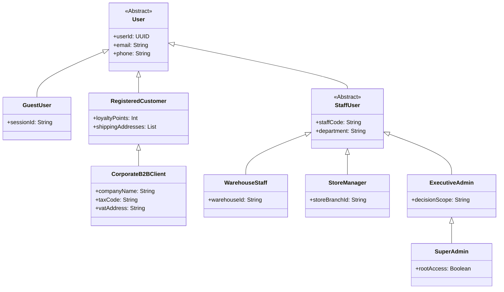

### 1.2. Danh Mục Tác Nhân Hệ Thống

| Mã Actor | Tên Tác Nhân | Loại | Mô Tả Trách Nhiệm & Quyền Hạn |
| :---: | :--- | :---: | :--- |
| **ACT-01** | **Khách Hàng Vãng Lai (Guest User)** | Con người | Chưa đăng nhập; duyệt xem sản phẩm OCOP, đọc câu chuyện di sản, tìm kiếm, giỏ hàng tạm. |
| **ACT-02** | **Khách Hàng Thành Viên (Registered Customer)** | Con người | Đã đăng nhập; đặt hàng, thanh toán VietQR, tích điểm, xem tiến trình vận chuyển trên Web/App. |
| **ACT-03** | **Khách Hàng Doanh Nghiệp (Corporate B2B)** | Con người | Đặt hàng sỉ (> 50 hộp), gửi file logo công ty, nhận báo giá chiết khấu và hóa đơn VAT. |
| **ACT-04** | **Thủ Kho (Warehouse Staff)** | Con người | Quản trị tồn kho theo SKU, khóa kho phân tán, in vận đơn, bàn giao hàng cho shipper 3PL. |
| **ACT-05** | **Quản Lý Bán Hàng & CSKH (Store Manager)** | Con người | Quản trị danh mục sản phẩm, duyệt đơn, tạo mã khuyến mãi, nhận chuông báo đơn mới realtime. |
| **ACT-06** | **Ban Giám Đốc (Executive Admin)** | Con người | Xem Dashboard BI đa chiều, phân tích ma trận RFM, dự báo cạn kho, nhận gợi ý chiến lược thông minh. |
| **ACT-07** | **Quản Trị Kỹ Thuật (Super Admin / DevOps)** | Con người | Quản trị ma trận phân quyền RBAC, giám sát hạ tầng máy chủ Prometheus/Grafana/Jaeger. |
| **EXT-01** | **Cổng Thanh Toán (Payment Gateway)** | Hệ thống | VietQR Napas / VNPay Sandbox xử lý giao dịch và đẩy Webhook/IPN xác nhận tiền về. |
| **EXT-02** | **Đơn Vị Giao Vận 3PL (Logistics API)** | Hệ thống | GHN / GHTK Sandbox tiếp nhận vận đơn, tính phí vận chuyển và cập nhật trạng thái lộ trình shipper. |
| **EXT-03** | **Hệ Thống Thông Báo (Notification Hub)** | Hệ thống | Firebase Cloud Messaging (FCM), Zalo Cloud API (ZNS), SendGrid Email. |
| **EXT-04** | **Bot Tìm Kiếm (Search Engine Bot)** | Hệ thống | Googlebot / Bingbot cào dữ liệu SSR và Schema.org JSON-LD để lập chỉ mục SEO. |

---

## II. SƠ ĐỒ USE CASE TỔNG QUÁT HỆ THỐNG (MASTER USE CASE DIAGRAM)

Sơ đồ tổng thể biểu diễn mối quan hệ giữa các Actor chính và 10 gói phân hệ nghiệp vụ của hệ sinh thái Mè Xửng O Mạ:

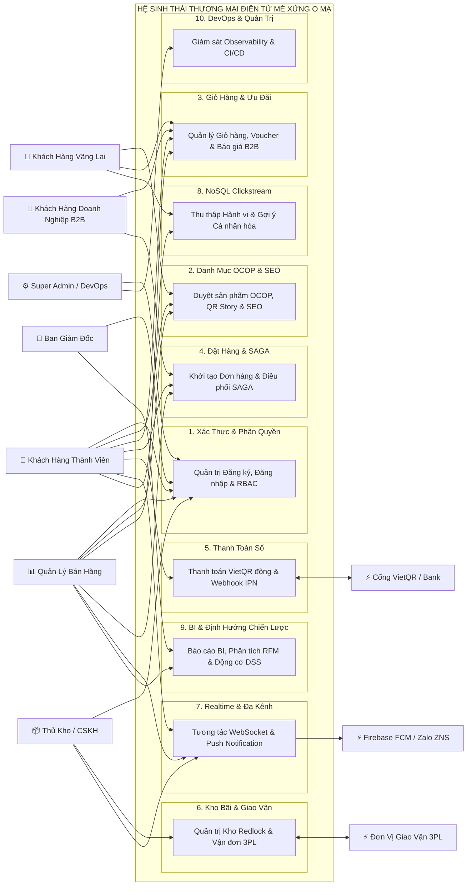

---

## III. PHÂN RÃ SƠ ĐỒ USE CASE THEO TỪNG PHÂN HỆ (DECOMPOSED USE CASE DIAGRAMS)

---

### 3.1. Phân Hệ 1: Xác Thực & Quản Trị Danh Tính (Auth & Identity Subsystem)
*Microservice phụ trách: `auth-service` (Port 4001) | Database: `om_identity_db`*

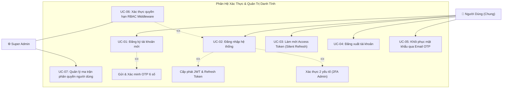

---

### 3.2. Phân Hệ 2: Mua Sắm D2C, Tìm Kiếm & Di Sản OCOP (Catalog & SEO Subsystem)
*Microservice phụ trách: `catalog-service` (Port 4002) | Database: `om_catalog_db` + MinIO*

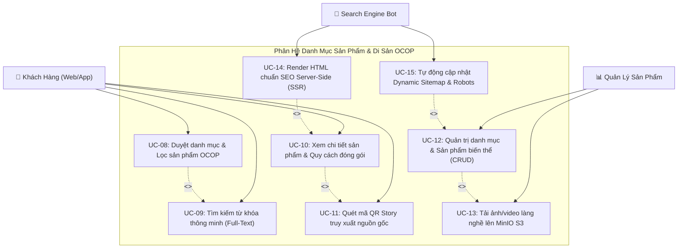

---

### 3.3. Phân Hệ 3: Giỏ Hàng, Khuyến Mãi & Quà Tặng B2B (Cart & Promotion Subsystem)
*Microservice phụ trách: `order-service` & `catalog-service` | Database: Redis + PostgreSQL*

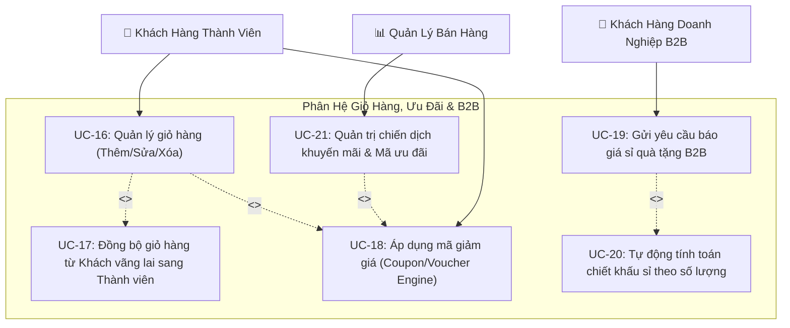

---

### 3.4. Phân Hệ 4: Đặt Hàng & Điều Phối Giao Dịch Phân Tán (Order & SAGA Subsystem)
*Microservice phụ trách: `order-service` (Port 4003) | Database: `om_order_db` + RabbitMQ*

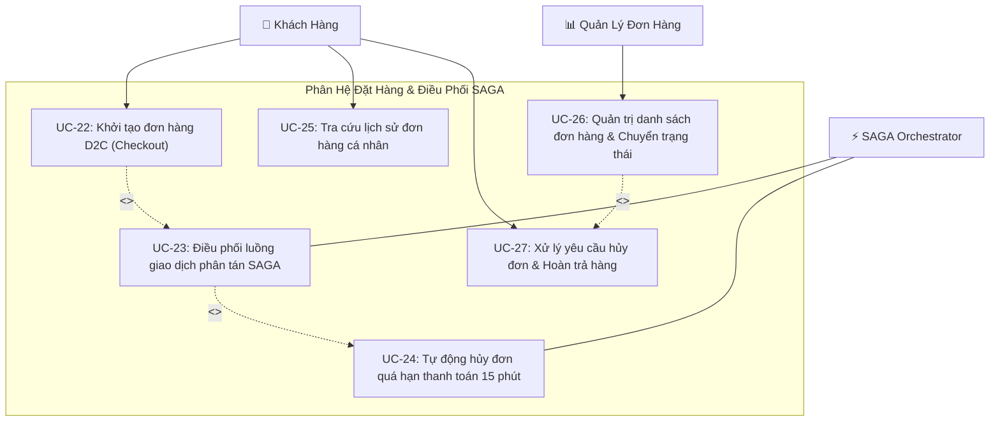

---

### 3.5. Phân Hệ 5: Thanh Toán VietQR & Đối Soát (Payment & Billing Subsystem)
*Microservice phụ trách: `payment-service` (Port 4004) | Database: `om_payment_db` + Redis*

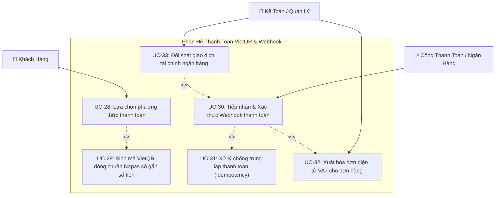

---

### 3.6. Phân Hệ 6: Quản Trị Kho Khóa Phân Tán & Vận Chuyển 3PL (Inventory & Logistics)
*Microservice phụ trách: `inventory-service` & `shipping-service`*

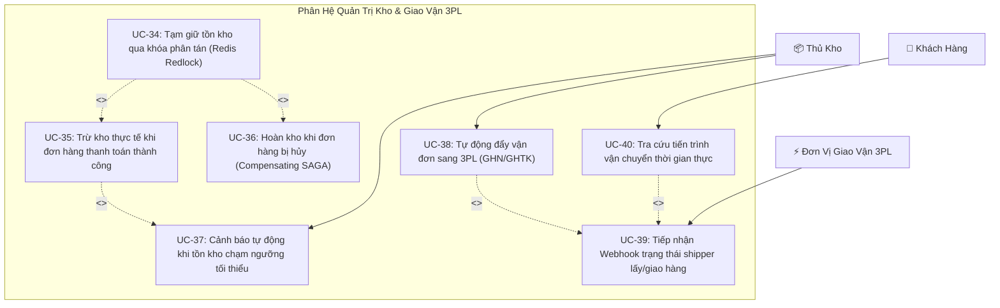

---

### 3.7. Phân Hệ 7: Tương Tác Thời Gian Thực & Đa Nền Tảng (Realtime & Notification)
*Microservice phụ trách: `notification-service` (Port 4007) | Apps: Web & App*

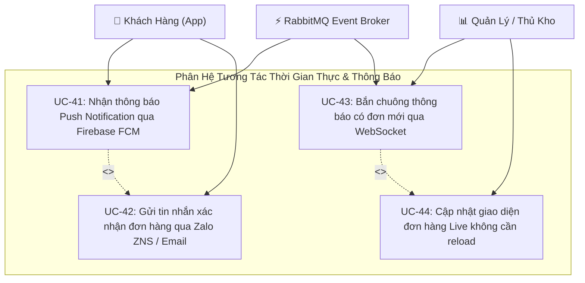

---

### 3.8. Phân Hệ 8: Tracking Hành Vi NoSQL & Gợi Ý Cá Nhân Hóa (Clickstream & Recommendation)
*Microservice phụ trách: `analytics-service` (Port 4008) | Database: `om_behavior_db` (MongoDB)*

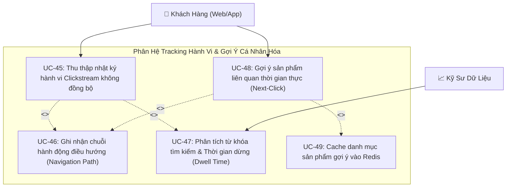

---

### 3.9. Phân Hệ 9: BI Thống Kê & Động Cơ Ra Quyết Định Chiến Lược (BI & DSS Engine)
*Microservice phụ trách: `analytics-service` (Port 4008) | Database: `om_analytics_db` (Data Mart)*

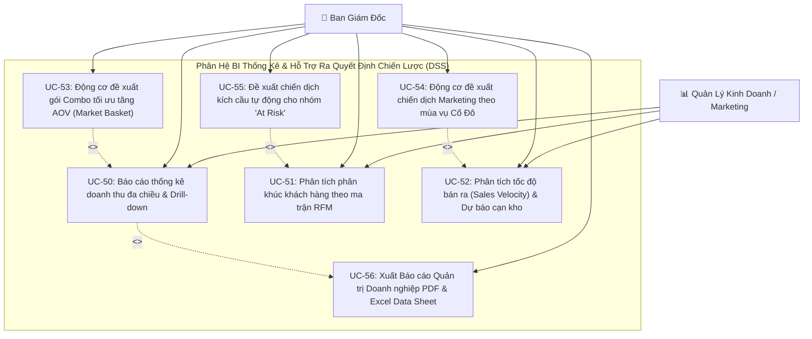

---

### 3.10. Phân Hệ 10: Quản Trị Hệ Thống & Giám Sát DevOps (System Admin & Observability)
*Công cụ: Prometheus, Grafana, Jaeger, Loki, GitHub Actions*

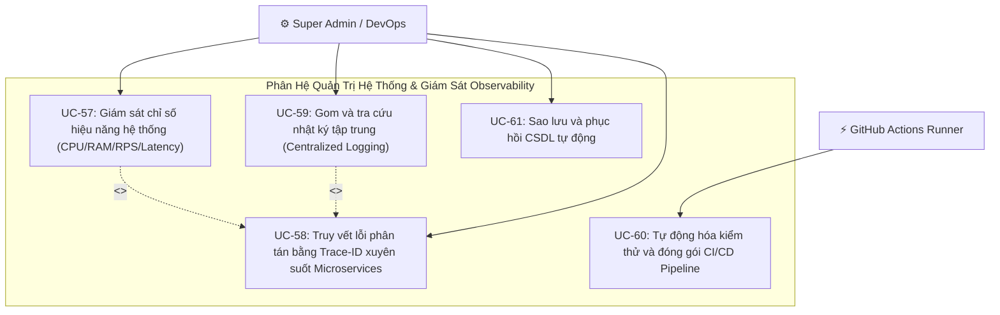

---

## IV. BẢNG ĐẶC TẢ CHI TIẾT CÁC USE CASE CỐT LÕI (DETAILED USE CASE SPECIFICATIONS)

---

### 4.1. Đặc tả Chi Tiết Use Case `UC-22`: Khởi Tạo Đơn Hàng D2C & Điều Phối SAGA

```
┌────────────────────────────────────────────────────────────────────────────────────────────────────────┐
│                               ĐẶC TẢ USE CASE: KHỞI TẠO ĐƠN HÀNG D2C (CHECKOUT)                         │
├──────────────────────────┬─────────────────────────────────────────────────────────────────────────────┤
│ Mã Use Case              │ UC-22                                                                       │
│ Tên Use Case             │ Khởi Tạo Đơn Hàng D2C & Kích Hoạt Điều Phối SAGA                            │
│ Phân Hệ                  │ Phân Hệ 4: Đặt Hàng & SAGA                                                  │
│ Tác Nhân Chính           │ Khách Hàng Thành Viên (ACT-02) / Khách Hàng Vãng Lai (ACT-01)               │
│ Tác Nhân Phụ             │ Inventory Service, Payment Service, Cổng VietQR (EXT-01)                    │
│ Mức Độ Ưu Tiên           │ Bắt Buộc (Must Have)                                                        │
├──────────────────────────┼─────────────────────────────────────────────────────────────────────────────┤
│ Tiền Điều Kiện           │ 1. Khách hàng có ít nhất 1 sản phẩm trong giỏ hàng.                         │
│ (Preconditions)          │ 2. Khách hàng đã điền đầy đủ thông tin giao nhận hàng (Họ tên, SĐT, Địa chỉ).│
├──────────────────────────┼─────────────────────────────────────────────────────────────────────────────┤
│ Hậu Điều Kiện            │ 1. Đơn hàng được tạo trong CSDL "om_order_db" với trạng thái PENDING_PAYMENT.│
│ (Postconditions)         │ 2. Tồn kho tương ứng được tạm giữ thành công trong 15 phút.                 │
│                          │ 3. Dữ liệu VietQR động được hiển thị cho khách hàng.                        │
└──────────────────────────┴─────────────────────────────────────────────────────────────────────────────┘
```

**Luồng Sự Kiện Chính (Main Success Scenario - Happy Path)**:
1. Khách hàng truy cập màn hình Checkout `/thanh-toan` và nhấn nút *"Xác nhận đặt hàng"*.
2. `Order Service` tiếp nhận request, kiểm tra cú pháp và sinh mã đơn hàng duy nhất `OM-YYYYMMDD-XXXX`.
3. `Order Service` gửi lệnh gRPC `ReserveStock(items, ttl=900s)` sang `Inventory Service`.
4. `Inventory Service` sử dụng khóa phân tán **Redis Redlock**, kiểm tra số lượng tồn kho:
   - Số lượng đáp ứng -> Tạm giữ số lượng hàng tương ứng và trả về `ReservationSuccess`.
5. `Order Service` lưu bản ghi đơn hàng trạng thái `PENDING_PAYMENT` vào `om_order_db`.
6. `Order Service` gọi `Payment Service` sinh mã VietQR động chứa số tiền chính xác và nội dung chuyển khoản là mã đơn hàng.
7. Màn hình thanh toán hiển thị mã VietQR kèm đồng hồ đếm ngược 15:00 và hướng dẫn chuyển khoản.

**Các Luồng Rẽ Nhánh / Ngoại Lệ (Alternative & Exception Flows)**:
- **4a. Tồn kho không đủ (Out of Stock)**:
  - `Inventory Service` trả về mã lỗi `ERR_INSUFFICIENT_STOCK`.
  - `Order Service` hủy lệnh tạo đơn, chuyển trạng thái `REJECTED_OUT_OF_STOCK`.
  - Hệ thống hiển thị thông báo: *"Rất tiếc, sản phẩm [Tên sản phẩm] vừa hết hàng trong kho. Vui lòng chọn quy cách khác."*
- **7a. Khách hàng không chuyển khoản sau 15 phút**:
  - Worker hết hạn quét thấy đơn hàng vẫn ở trạng thái `PENDING_PAYMENT`.
  - `Order Service` kích hoạt luồng SAGA đền bù: Chuyển trạng thái đơn sang `EXPIRED` và gửi lệnh sang `Inventory Service` để hoàn lại số lượng hàng đã tạm giữ.

---

### 4.2. Đặc tả Chi Tiết Use Case `UC-30`: Tiếp Nhận Webhook Thanh Toán & Xử Lý Chống Trùng Lặp

```
┌────────────────────────────────────────────────────────────────────────────────────────────────────────┐
│                         ĐẶC TẢ USE CASE: TIẾP NHẬN WEBHOOK THANH TOÁN (IDEMPOTENCY)                    │
├──────────────────────────┬─────────────────────────────────────────────────────────────────────────────┤
│ Mã Use Case              │ UC-30                                                                       │
│ Tên Use Case             │ Tiếp Nhận Webhook Ngân Hàng & Xử Lý Thanh Toán An Toàn                      │
│ Phân Hệ                  │ Phân Hệ 5: Thanh Toán Số                                                    │
│ Tác Nhân Chính           │ Cổng Thanh Toán / Ngân Hàng (EXT-01)                                        │
│ Tác Nhân Phụ             │ Payment Service, Order Service, Notification Service, RabbitMQ              │
│ Mức Độ Ưu Tiên           │ Bắt Buộc (Must Have)                                                        │
├──────────────────────────┼─────────────────────────────────────────────────────────────────────────────┤
│ Tiền Điều Kiện           │ Đơn hàng đang ở trạng thái PENDING_PAYMENT và khách hàng đã chuyển tiền.   │
├──────────────────────────┼─────────────────────────────────────────────────────────────────────────────┤
│ Hậu Điều Kiện            │ 1. Đơn hàng chuyển sang trạng thái PAID.                                     │
│ (Postconditions)         │ 2. Số lượng tồn kho được trừ chính thức.                                    │
│                          │ 3. Thông báo đơn hàng mới được đẩy qua WebSocket và Zalo ZNS/FCM.           │
└──────────────────────────┴─────────────────────────────────────────────────────────────────────────────┘
```

**Luồng Sự Kiện Chính (Main Success Scenario)**:
1. Ngân hàng gửi Webhook HTTP POST tới endpoint `/api/v1/payments/webhook` kèm payload chứa mã giao dịch `transactionId`, số tiền `amount`, nội dung `orderCode` và Header chữ ký số `X-Signature`.
2. `Payment Service` xác thực chữ ký số HMAC-SHA256 với Secret Key bí mật:
   - Chữ ký hợp lệ -> Cho phép tiếp tục xử lý.
3. `Payment Service` kiểm tra khóa Idempotency `payment:idemp:{transactionId}` trong Redis:
   - Khóa chưa tồn tại -> Ghi khóa vào Redis với thời hạn TTL 24 giờ.
4. `Payment Service` ghi nhận bản ghi giao dịch thành công vào `om_payment_db.payments`.
5. `Payment Service` phát sự kiện `PaymentConfirmedEvent` lên Message Broker (RabbitMQ).
6. Các Microservices đăng ký sự kiện xử lý song song:
   - `Order Service`: Cập nhật trạng thái đơn hàng sang `PAID` và gửi lệnh xác nhận trừ kho chính thức cho `Inventory Service`.
   - `Notification Service`: Đẩy WebSocket bắn chuông báo đơn mới cho Web Admin và gửi Push Notification Firebase FCM cho khách hàng.
   - `Analytics Service`: Đồng bộ dữ liệu giao dịch vào Data Mart `om_analytics_db`.
7. `Payment Service` phản hồi `HTTP 200 OK` cho Ngân hàng trong vòng `< 500ms`.

**Các Luồng Ngoại Lệ (Exception Flows)**:
- **2a. Chữ ký số Webhook không hợp lệ**:
  - `Payment Service` từ chối request, trả về mã lỗi `HTTP 401 Unauthorized`.
  - Ghi nhật ký cảnh báo tấn công giả mạo Webhook vào hệ thống giám sát an ninh.
- **3a. Ngân hàng gửi lại Webhook trùng lặp (Duplicate Delivery)**:
  - `Payment Service` kiểm tra thấy khóa Idempotency đã tồn tại trong Redis.
  - Lập tức trả về `HTTP 200 OK` cho Ngân hàng và bỏ qua toàn bộ bước cộng tiền lần 2, đảm bảo tuyệt đối không sinh đơn trùng.

---

### 4.3. Đặc tả Chi Tiết Use Case `UC-54`: Động Cơ Đề Xuất Định Hướng Chiến Lược Kinh Doanh (DSS)

```
┌────────────────────────────────────────────────────────────────────────────────────────────────────────┐
│                        ĐẶC TẢ USE CASE: ĐỘNG CƠ ĐỀ XUẤT CHIẾN LƯỢC KINH DOANH (DSS)                    │
├──────────────────────────┬─────────────────────────────────────────────────────────────────────────────┤
│ Mã Use Case              │ UC-54                                                                       │
│ Tên Use Case             │ Phân Tích Dữ Liệu Đa Nền Tảng & Đề Xuất Định Hướng Chiến Lược               │
│ Phân Hệ                  │ Phân Hệ 9: BI & Động Cơ Ra Quyết Định Chiến Lược                            │
│ Tác Nhân Chính           │ Ban Giám Đốc (ACT-06) / Quản Lý Kinh Doanh (ACT-05)                         │
│ Tác Nhân Phụ             │ Analytics Service, Data Mart PostgreSQL, NoSQL MongoDB                      │
│ Mức Độ Ưu Tiên           │ Bắt Buộc (Must Have - Trọng tâm đề tài)                                     │
├──────────────────────────┼─────────────────────────────────────────────────────────────────────────────┤
│ Tiền Điều Kiện           │ Hệ thống có dữ liệu bán hàng và nhật ký clickstream tối thiểu 14 ngày.      │
├──────────────────────────┼─────────────────────────────────────────────────────────────────────────────┤
│ Hậu Điều Kiện            │ 1. Các thẻ đề xuất chiến lược hành động được hiển thị trực quan.            │
│ (Postconditions)         │ 2. Cho phép Quản trị viên kích hoạt chiến dịch hoặc xuất file PDF/Excel.    │
└──────────────────────────┴─────────────────────────────────────────────────────────────────────────────┘
```

**Luồng Sự Kiện Chính (Main Success Scenario)**:
1. Ban Giám Đốc đăng nhập vào Web Admin và chọn mục *"Trung Tâm Phân Tích & Định Hướng Chiến Lược"* `/admin/strategic-insights`.
2. `Analytics Service` tổng hợp dữ liệu từ 2 nguồn:
   - CSDL Giao dịch `om_analytics_db`: Doanh số, AOV, tốc độ bán hàng, phân khúc RFM.
   - CSDL NoSQL `om_behavior_db`: Từ khóa tìm kiếm, lượt click xem sản phẩm liên quan, tỷ lệ chuyển đổi.
3. **Động Cơ Ra Quyết Định Chiến Lược (Strategic Decision Engine)** thực thi 3 thuật toán:
   - *Thuật toán Market Basket Analysis*: Phát hiện các cặp sản phẩm thường mua kèm với độ tin cậy $\text{Confidence} \ge 60\%$.
   - *Thuật toán Mùa vụ Di sản*: So sánh chu kỳ thời gian hiện tại với các sự kiện văn hóa Cố Đô (Festival Huế, Tết Nguyên Đán, Rằm Trung Thu).
   - *Thuật toán Cảnh báo Chuỗi cung ứng*: So sánh tốc độ bán ra (Sales Velocity) với lượng tồn kho và thời gian nhập nguyên liệu (Lead Time).
4. Hệ thống hiển thị 3 Thẻ Khuyến Nghị Chiến Lược Hành Động:
   - **Khuyến Nghị 1 (Gói Sản Phẩm Tăng AOV)**: *"Tạo Bundle 'Vị Trà Cố Đô' (Mè Xửng Dẻo + Trà Cung Đình) chiết khấu 10% -> Dự kiến tăng AOV thêm 22%."*
   - **Khuyến Nghị 2 (Chiến Dịch Mùa Vụ)**: *"Còn 25 ngày đến Festival Huế -> Đề xuất tăng 35% ngân sách Marketing cho từ khóa 'Đặc sản Huế làm quà' và chuẩn bị thêm 1.500 hộp quà biếu."*
   - **Khuyến Nghị 3 (Chăm Sóc Khách Hàng)**: *"Có 48 khách hàng nhóm 'At Risk' chưa mua lại sau 60 ngày -> Đề xuất gửi Voucher giảm 15% qua tin nhắn Zalo ZNS cá nhân hóa."*
5. Giám đốc có thể bấm nút *"Kích hoạt tạo Bundle/Voucher tự động"* hoặc bấm *"Xuất Báo Cáo Chiến Lược PDF"* để phục vụ họp điều hành.

---

## V. MA TRẬN ÁNH XẠ USER STORIES SANG USE CASES (TRACEABILITY MATRIX)

| Mã Use Case | Tên Use Case Nghiệp Vụ | Mã User Story Tương Ứng | Microservice Phụ Trách |
| :---: | :--- | :---: | :--- |
| **UC-01** | Đăng ký tài khoản mới & Xác minh OTP | `US-01` | `auth-service` |
| **UC-02** | Đăng nhập hệ thống & Cấp phát JWT/Refresh Token | `US-02` | `auth-service` |
| **UC-06** | Xác thực & Kiểm soát phân quyền RBAC | `US-03` | `auth-service` & `api-gateway` |
| **UC-08** | Duyệt danh mục & Lọc sản phẩm OCOP | `US-04` | `catalog-service` |
| **UC-11** | Quét mã QR Story truy xuất nguồn gốc | `US-06` | `catalog-service` |
| **UC-12** | Quản trị danh mục & Sản phẩm biến thể SKU | `US-04` | `catalog-service` |
| **UC-14** | Render HTML chuẩn SEO Server-Side (SSR) | `US-05` | `web-user` (Next.js 14) |
| **UC-16** | Quản lý giỏ hàng đa nền tảng | `US-07` | `order-service` |
| **UC-18** | Áp dụng mã giảm giá (Coupon Engine) | `US-08` | `order-service` |
| **UC-19** | Gửi yêu cầu báo giá sỉ quà tặng B2B | `US-09` | `catalog-service` |
| **UC-22** | Khởi tạo đơn hàng D2C & Checkout | `US-10` | `order-service` |
| **UC-23** | Điều phối giao dịch phân tán SAGA | `US-10` | `order-service` |
| **UC-24** | Tự động hủy đơn quá hạn 15 phút | `US-11` | `order-service` |
| **UC-29** | Sinh mã VietQR động chuẩn Napas | `US-12` | `payment-service` |
| **UC-30** | Tiếp nhận Webhook thanh toán & Idempotency | `US-13` | `payment-service` |
| **UC-34** | Tạm giữ kho phân tán (Redis Redlock) | `US-14` | `inventory-service` |
| **UC-37** | Cảnh báo tồn kho chạm ngưỡng tối thiểu | `US-14` | `inventory-service` |
| **UC-38** | Đẩy vận đơn sang đơn vị giao vận 3PL | `US-15` | `shipping-service` |
| **UC-40** | Tra cứu lộ trình vận chuyển thời gian thực | `US-15` | `shipping-service` |
| **UC-41** | Nhận Push Notification qua Firebase FCM | `US-17` | `notification-service` |
| **UC-43** | Bắn chuông báo đơn mới qua WebSocket | `US-18` | `notification-service` |
| **UC-45** | Thu thập nhật ký hành vi Clickstream NoSQL | `US-19` | `analytics-service` (MongoDB) |
| **UC-48** | Gợi ý sản phẩm liên quan (Next-Click) | `US-20` | `analytics-service` (Redis) |
| **UC-50** | Báo cáo thống kê doanh thu đa chiều | `US-21` | `analytics-service` |
| **UC-51** | Phân loại khách hàng theo ma trận RFM | `US-22` | `analytics-service` |
| **UC-52** | Dự báo tốc độ bán & Thời gian cạn kho | `US-23` | `analytics-service` |
| **UC-54** | Động cơ đề xuất định hướng chiến lược (DSS) | `US-24` | `analytics-service` |
| **UC-57** | Giám sát hiệu năng hệ thống (Prometheus/Grafana) | `US-25` | `infra/monitoring` |
| **UC-60** | Tự động hóa kiểm thử và đóng gói CI/CD | `US-26` | `.github/workflows` |

---

## VI. HƯỚNG DẪN THỰC THI & CÔNG CỤ VẼ SƠ ĐỒ UML CHUẨN

### 6.1. Hướng Dẫn Vẽ Sơ Đồ Sử Dụng Công Cụ Trực Quan
Bạn có thể dễ dàng chuyển đổi các đặc tả trong tài liệu này thành các bản vẽ đồ họa chuyên nghiệp bằng các công cụ:
1. **Draw.io (`app.diagrams.net`)**:
   - Sử dụng thư viện hình dạng **UML Use Case** chuẩn (Actor hình người que, Use Case hình Oval Elip, đường nét đứt có mũi tên cho `<<include>>` và `<<extend>>`).
   - Có thể sao chép trực tiếp các sơ đồ phân rã từ Mục 3 của tài liệu này để vẽ thành từng trang Diagram riêng biệt.
2. **PlantUML / Mermaid**:
   - Toàn bộ mã nguồn sơ đồ trong tài liệu này được viết bằng chuẩn **Mermaid Markdown**. Bạn có thể xem trực tiếp hoặc xuất ra file ảnh PNG/SVG chất lượng cao.
3. **Visual Paradigm / StarUML**:
   - Sử dụng để xuất ra tài liệu báo cáo đồ án chính thức kèm từ điển dữ liệu (Data Dictionary).

### 6.2. Quy Tắc Chuẩn Khi Vẽ Sơ Đồ Use Case (UML Standards Checklist)
- [x] **Hình Elip (Use Case)**: Đặt tên bằng **Động từ + Danh từ** (Ví dụ: *Khởi tạo đơn hàng*, *Sinh mã VietQR*, *Phân tích RFM*).
- [x] **Quan hệ `<<include>>`**: Biểu diễn hành động bắt buộc phải thực hiện trong Use Case cha (Mũi tên nét đứt hướng từ Use Case gốc tới Use Case được include).
- [x] **Quan hệ `<<extend>>`**: Biểu diễn hành động mở rộng có điều kiện (Mũi tên nét đứt hướng từ Use Case mở rộng về Use Case gốc).
- [x] **Ranh giới hệ thống (System Boundary)**: Vẽ khung bao bọc các Use Case bên trong, các Actor nằm ở bên ngoài khung.

---
*Tài liệu này là bản đặc tả thiết kế Use Case chính thức, được lưu trữ tại `docs/01_requirements/use_case_specification.md` làm nền tảng cho việc thiết kế sơ đồ Class, Sequence và hiện thực hóa mã nguồn dự án.*
