# TÀI LIỆU ĐẶC TẢ & PHÂN RÃ SƠ ĐỒ USE CASE TOÀN DIỆN (MASTER USE CASE SPECIFICATION)
## ĐỀ TÀI: HỆ SINH THÁI THƯƠNG MẠI ĐIỆN TỬ ĐA KÊNH & HỆ THỐNG PHÂN TÍCH HỖ TRỢ QUYẾT ĐỊNH CHIẾN LƯỢC CHO NÔNG ĐẶC SẢN OCOP HUẾ (MÈ XỬNG O MẠ)

**Phiên bản:** 3.0  
**Tình trạng:** Bản Đặc Tả Chuẩn Mực Hệ Thống (Master Specification)  
**Phạm vi:** Website D2C + Mobile App + Web Admin + Marketplace + Điểm Bán Offline POS + Logistics + Kho Lô/HSD + Analytics/DSS  
**Tài liệu tham chiếu cơ sở:**
- `01_Product_Backlog.md` (v3.0 - 28 Epics, ~170 User Stories, 11 Bộ Business Rules)
- `02_Sprint_Planning.md` (Lộ trình 3 Giai đoạn Release, Chuỗi 03 MVP, 12 Sprints, DoD, Quản trị rủi ro)
- `03_Non_Functional_Requirements.md` (11 Nhóm NFRs: Performance, Security, Audit hash chain, Observability)
- `04_Functional_Requirements.md` (31 Yêu cầu Chức năng FR-01 ~ FR-31)

---

## MỤC LỤC TÀI LIỆU
1. [I. MÔ HÌNH HÓA TÁC NHÂN HỆ THỐNG (ACTORS MODELING)](#i-mô-hình-hóa-tác-nhân-hệ-thống-actors-modeling)
   - [1.1. Cây Phân Cấp & Kế Thừa Tác Nhân (Actor Generalization Hierarchy)](#11-cây-phân-cấp--kế-thừa-tác-nhân-actor-generalization-hierarchy)
   - [1.2. Danh Mục 19 Tác Nhân Người Dùng (Human Actors)](#12-danh-mục-19-tác-nhân-người-dùng-human-actors)
   - [1.3. Danh Mục 12 Tác Nhân Hệ Thống Ngoại Vi (External System Actors)](#13-danh-mục-12-tác-nhân-hệ-thống-ngoại-vi-external-system-actors)
2. [II. SƠ ĐỒ USE CASE TỔNG QUÁT TOÀN HỆ THỐNG (MASTER USE CASE DIAGRAM)](#ii-sơ-đồ-use-case-tổng-quát-toàn-hệ-thống-master-use-case-diagram)
3. [III. PHÂN RÃ SƠ ĐỒ USE CASE THEO 14 PHÂN HỆ NGHIỆP VỤ (DECOMPOSED USE CASE DIAGRAMS)](#iii-phân-rã-sơ-đồ-use-case-theo-14-phân-hệ-nghiệp-vụ-decomposed-use-case-diagrams)
   - [3.1. Phân Hệ 1: Xác Thực & Quản Trị Danh Tính (Auth & Identity)](#31-phân-hệ-1-xác-thực--quản-trị-danh-tính-auth--identity)
   - [3.2. Phân Hệ 2: Hồ Sơ Khách Hàng & Quản Trị Nhân Sự (Profile & HR)](#32-phân-hệ-2-hồ-sơ-khách-hàng--quản-trị-nhân-sự-profile--hr)
   - [3.3. Phân Hệ 3: Khám Phá Sản Phẩm, Di Sản OCOP & Trợ Lý AI (Discovery, OCOP & AI)](#33-phân-hệ-3-khám-phá-sản-phẩm-di-sản-ocop--trợ-lý-ai-discovery-ocop--ai)
   - [3.4. Phân Hệ 4: Quản Trị Danh Mục, Biến Thể SKU & Giá Đa Kênh (Catalog & Pricing)](#34-phân-hệ-4-quản-trị-danh-mục-biến-thể-sku--giá-đa-kênh-catalog--pricing)
   - [3.5. Phân Hệ 5: Giỏ Hàng, Đặt Hàng D2C & Mua Quà Tặng (Cart, Checkout & Gifting)](#35-phân-hệ-5-giỏ-hàng-đặt-hàng-d2c--mua-quà-tặng-cart-checkout--gifting)
   - [3.6. Phân Hệ 6: Thanh Toán Số, Đối Soát & Hoàn Tiền (Payment, Billing & Refund)](#36-phân-hệ-6-thanh-toán-số-đối-soát--hoàn-tiền-payment-billing--refund)
   - [3.7. Phân Hệ 7: Quản Trị Vòng Đời Đơn Hàng & Điều Phối SLA (Order Management)](#37-phân-hệ-7-quản-trị-vòng-đời-đơn-hàng--điều-phối-sla-order-management)
   - [3.8. Phân Hệ 8: Quản Trị Kho Lô/HSD (FEFO) & Bằng Chứng Đóng Gói (Inventory & Packing)](#38-phân-hệ-8-quản-trị-kho-lôhsd-fefo--bằng-chứng-đóng-gói-inventory--packing)
   - [3.9. Phân Hệ 9: Giao Vận & Điều Phối 3PL (Shipping & Delivery)](#39-phân-hệ-9-giao-vận--điều-phối-3pl-shipping--delivery)
   - [3.10. Phân Hệ 10: Bán Hàng Đa Kênh: Sàn TMĐT & Điểm Bán Offline (Marketplace & POS)](#310-phân-hệ-10-bán-hàng-đa-kênh-sàn-tmđt--điểm-bán-offline-marketplace--pos)
   - [3.11. Phân Hệ 11: CSKH, Đổi Trả / Khiếu Nại & Đánh Giá Review (Support, Return & Reviews)](#311-phân-hệ-11-cskh-đổi-trả--khiếu-nại--đánh-giá-review-support-return--reviews)
   - [3.12. Phân Hệ 12: Khuyến Mãi, Tích Điểm Loyalty & Bán Sỉ B2B (Promotion, Loyalty & B2B)](#312-phân-hệ-12-khuyến-mãi-tích-điểm-loyalty--bán-sỉ-b2b-promotion-loyalty--b2b)
   - [3.13. Phân Hệ 13: Nội Dung Văn Hóa Cố Đô, SEO & Marketing (Content, SEO & Campaigns)](#313-phân-hệ-13-nội-dung-văn-hóa-cố-đô-seo--marketing-content-seo--campaigns)
   - [3.14. Phân Hệ 14: Quản Trị Hệ Thống, Kiểm Toán, Tài Chính & DSS (Admin, Audit, Finance & DSS)](#314-phân-hệ-14-quản-trị-hệ-thống-kiểm-toán-tài-chính--dss-admin-audit-finance--dss)
4. [IV. BẢNG ĐẶC TẢ CHI TIẾT CÁC USE CASE TRỌNG YẾU (DETAILED USE CASE SPECIFICATIONS)](#iv-bảng-đặc-tả-chi-tiết-các-use-case-trọng-yếu-detailed-use-case-specifications)
   - [4.1. UC-ORD-01: Khởi Tạo Đơn Hàng D2C & Tạm Giữ Tồn Kho Phân Tán (Checkout)](#41-uc-ord-01-khởi-tạo-đơn-hàng-d2c--tạm-giữ-tồn-kho-phân-tán-checkout)
   - [4.2. UC-PAY-02: Tiếp Nhận Webhook Thanh Toán & Xác Nhận Đơn Hàng Tự Động](#42-uc-pay-02-tiếp-nhận-webhook-thanh-toán--xác-nhận-đơn-hàng-tự-động)
   - [4.3. UC-PAY-04: Phê Duyệt & Thực Thi Hoàn Tiền Đơn Hàng (Refund Engine)](#43-uc-pay-04-phê-duyệt--thực-thi-hoàn-tiền-đơn-hàng-refund-engine)
   - [4.4. UC-PACK-02: Đóng Gói Sản Phẩm & Ghi Hình/Lưu Trữ Packing Video](#44-uc-pack-02-đóng-gói-sản-phẩm--ghi-hìnhlưu-trữ-packing-video)
   - [4.5. UC-PACK-04: Tra Cứu & Xác Minh Video Đóng Gói Phục Vụ Xử Lý Khiếu Nại](#45-uc-pack-04-tra-cứu--xác-minh-video-đóng-gói-phục-vụ-xử-lý-khiếu-nại)
   - [4.6. UC-MKT-01: Tiếp Nhận & Đồng Bộ Đơn Hàng Tự Động Từ Sàn TMĐT (Shopee/TikTok)](#46-uc-mkt-01-tiếp-nhận--đồng-bộ-đơn-hàng-tự-động-từ-sàn-tmđt-shopeetiktok)
   - [4.7. UC-OFF-02: Ghi Nhận Giao Dịch Bán Lẻ Offline POS & Quản Trị Tồn Điểm Bán](#47-uc-off-02-ghi-nhận-giao-dịch-bán-lẻ-offline-pos--quản-trị-tồn-điểm-bán)
   - [4.8. UC-RET-02: Tiếp Nhận Yêu Cầu Đổi Trả / Hoàn Tiền Đính Kèm Bằng Chứng](#48-uc-ret-02-tiếp-nhận-yêu-cầu-đổi-trả--hoàn-tiền-đính-kèm-bằng-chứng)
   - [4.9. UC-OCOP-01: Quét Mã QR Story Truy Xuất Nguồn Gốc Chuỗi Cung Ứng OCOP](#49-uc-ocop-01-quét-mã-qr-story-truy-xuất-nguồn-gốc-chuỗi-cung-ứng-ocop)
   - [4.10. UC-DSS-02: Phân Tích Đa Nền Tảng & Đề Xuất Định Hướng Chiến Lược (DSS Engine)](#410-uc-dss-02-phân-tích-đa-nền-tảng--đề-xuất-định-hướng-chiến-lược-dss-engine)
5. [V. MA TRẬN ÁNH XẠ TOÀN DIỆN (TRACEABILITY MATRIX)](#v-ma-trận-ánh-xạ-toàn-diện-traceability-matrix)
6. [VI. QUY CHUẨN THIẾT KẾ USE CASE & CHUYỂN TIẾP THIẾT KẾ KỸ THUẬT](#vi-quy-chuẩn-thiết-kế-use-case--chuyển-tiếp-thiết-kế-kỹ-thuật)

---

# I. MÔ HÌNH HÓA TÁC NHÂN HỆ THỐNG (ACTORS MODELING)

Mô hình tác nhân được xây dựng đồng bộ tuyệt đối với Mục 3 & 4 của `01_Product_Backlog.md`. Hệ thống tách bạch rõ ràng giữa **Tác nhân Con người (Human Actors)** và **Tác nhân Hệ thống Ngoại vi (External System Actors)**, đồng thời thiết lập cây quan hệ kế thừa (Generalization) để tối ưu hóa việc phân quyền RBAC ở tầng kiến trúc.

### 1.1. Cây Phân Cấp & Kế Thừa Tác Nhân (Actor Generalization Hierarchy)

```mermaid
classDiagram
    class User {
        <<Abstract>>
        +userId: UUID
        +phone: String
        +status: UserStatus
        +createdAt: DateTime
    }

    class CustomerActor {
        <<Abstract>>
        +customerCode: String
        +contactName: String
    }

    class GuestCustomer {
        +sessionId: String
        +cartFingerprint: String
    }

    class RegisteredCustomer {
        +email: String
        +loyaltyPoints: Integer
        +membershipTier: String
        +defaultAddressId: UUID
    }

    class B2BCustomer {
        +companyName: String
        +taxId: String
        +businessLicenseUrl: String
        +creditLimit: Decimal
    }

    class MarketplaceCustomer {
        +platformType: String
        +externalBuyerId: String
    }

    class OfflineCustomer {
        +posReceiptRef: String
    }

    class InternalStaffActor {
        <<Abstract>>
        +employeeId: UUID
        +staffCode: String
        +department: String
        +assignedRoles: List~Role~
        +accountStatus: StaffStatus
    }

    class WarehouseStaff {
        +assignedWarehouseId: UUID
    }

    class PackingStaff {
        +packingStationId: String
        +recordingDeviceId: String
    }

    class DeliveryStaff {
        +vehiclePlate: String
        +currentRouteId: UUID
    }

    class MarketplaceOperator {
        +authorizedChannels: List~String~
    }

    class OfflineSalesStaff {
        +assignedStoreId: UUID
        +currentShiftId: UUID
    }

    class CustomerServiceStaff {
        +assignedTicketQueue: String
    }

    class SalesManager {
        +branchScope: String
        +discountApprovalLimit: Decimal
    }

    class ContentManager {
        +publishingScope: String
    }

    class MarketingStaff {
        +campaignScope: String
    }

    class SupplyManager {
        +supplyCategory: String
    }

    class AccountantStaff {
        +accountingLicenseId: String
    }

    class AuditorStaff {
        +auditScope: String
    }

    class ExecutiveManager {
        +decisionAuthorityLevel: Integer
    }

    class SystemAdministrator {
        +superUserPrivilege: Boolean
    }

    %% Kế thừa phía Khách Hàng
    User <|-- CustomerActor
    CustomerActor <|-- GuestCustomer
    CustomerActor <|-- RegisteredCustomer
    RegisteredCustomer <|-- B2BCustomer
    CustomerActor <|-- MarketplaceCustomer
    CustomerActor <|-- OfflineCustomer

    %% Kế thừa phía Nhân Viên Nội Bộ
    User <|-- InternalStaffActor
    InternalStaffActor <|-- WarehouseStaff
    InternalStaffActor <|-- PackingStaff
    InternalStaffActor <|-- DeliveryStaff
    InternalStaffActor <|-- MarketplaceOperator
    InternalStaffActor <|-- OfflineSalesStaff
    InternalStaffActor <|-- CustomerServiceStaff
    InternalStaffActor <|-- SalesManager
    InternalStaffActor <|-- ContentManager
    InternalStaffActor <|-- MarketingStaff
    InternalStaffActor <|-- SupplyManager
    InternalStaffActor <|-- AccountantStaff
    InternalStaffActor <|-- AuditorStaff
    InternalStaffActor <|-- ExecutiveManager
    InternalStaffActor <|-- SystemAdministrator
```

---

### 1.2. Danh Mục 19 Tác Nhân Người Dùng (Human Actors)

| Mã Actor | Tên Tác Nhân | Nhóm | Trách Nhiệm & Quyền Hạn Nghiệp Vụ Chính |
| :---: | :--- | :---: | :--- |
| **ACT-01** | **Guest Customer** | Khách ngoài | Khách vãng lai chưa đăng nhập; xem danh mục, đọc câu chuyện di sản OCOP, tìm kiếm, giỏ hàng tạm và Guest Checkout (BR-AUTH-01). |
| **ACT-02** | **Registered Customer** | Khách ngoài | Khách hàng cá nhân đã tạo tài khoản; đặt hàng, thanh toán VietQR/COD, tích điểm Loyalty, mua quà tặng, theo dõi vận đơn và đánh giá Verified Review. |
| **ACT-03** | **B2B Customer** | Khách ngoài | Đại diện doanh nghiệp/tổ chức; yêu cầu báo giá sỉ, gửi file logo thiết kế bao bì mè xửng theo yêu cầu, duyệt báo giá và nhận hóa đơn VAT doanh nghiệp. |
| **ACT-04** | **Marketplace Customer** | Khách ngoài | Khách mua hàng qua sàn TMĐT Shopee/TikTok Shop; dữ liệu đơn hàng và trạng thái được đồng bộ gián tiếp vào hệ thống nội bộ. |
| **ACT-05** | **Offline Customer** | Khách ngoài | Khách mua trực tiếp tại cửa hàng giới thiệu sản phẩm/chợ/điểm bán lưu động; nhận hóa đơn POS và tích điểm qua SĐT. |
| **ACT-06** | **Warehouse Staff** | Nội bộ | Thủ kho; quản lý danh mục tồn kho theo SKU, nhập/xuất kho theo Lô/Batch kèm Ngày sản xuất & Hạn sử dụng, kiểm kê và cảnh báo cận date (FEFO). |
| **ACT-07** | **Packing Staff** | Nội bộ | Nhân viên đóng gói; tiếp nhận danh sách đơn cần gói, kiểm tra checklist mặt hàng, thực hiện đóng gói và ghi hình/lưu trữ Packing Video bằng chứng. |
| **ACT-08** | **Delivery Staff** | Nội bộ | Nhân viên giao hàng nội bộ (nội thành Huế/lân cận); nhận danh sách đơn giao, cập nhật trạng thái lộ trình giao thành công/thất bại thời gian thực. |
| **ACT-09** | **Marketplace Operator** | Nội bộ | Nhân viên vận hành sàn; giám sát đồng bộ đơn hàng từ Shopee/TikTok Shop, đối soát tồn kho hai chiều, xử lý lỗi đồng bộ và đối soát phí sàn. |
| **ACT-10** | **Offline Sales Staff** | Nội bộ | Nhân viên bán lẻ tại điểm bán; nhận hàng từ kho, quét mã vạch bán hàng POS, in hóa đơn, kiểm kê hàng hỏng/trả và nộp báo cáo đối soát tiền mặt cuối ca. |
| **ACT-11** | **Customer Service (CSKH)**| Nội bộ | Nhân viên chăm sóc khách hàng; tiếp nhận Ticket hỗ trợ đa kênh, giải quyết khiếu nại, tra cứu video đóng gói xác minh lỗi và khởi tạo quy trình đổi trả. |
| **ACT-12** | **Sales Manager** | Nội bộ | Trưởng phòng kinh doanh; quản lý bảng giá bán đa kênh, duyệt chương trình khuyến mãi/Combo, duyệt đơn bán sỉ B2B và phê duyệt hoàn tiền (BR-REFUND-01). |
| **ACT-13** | **Content Manager** | Nội bộ | Quản lý nội dung; biên tập bài viết văn hóa Cố Đô, câu chuyện nghệ nhân làng nghề, quản lý đa phương tiện (ảnh/video) và tối ưu hóa SEO On-page. |
| **ACT-14** | **Marketing Staff** | Nội bộ | Chuyên viên tiếp thị; lập kế hoạch chiến dịch Marketing đa kênh, phân phối mã giảm giá, theo dõi chỉ số chuyển đổi, đánh giá hiệu quả chiến dịch (ROI). |
| **ACT-15** | **Supply Manager** | Nội bộ | Quản lý chuỗi cung ứng; quản lý hồ sơ nhà cung cấp/hộ nông dân OCOP, tạo Purchase Order (PO), theo dõi tốc độ tiêu thụ và lập kế hoạch sản xuất. |
| **ACT-16** | **Executive / Business Manager**| Nội bộ | Ban Giám Đốc; theo dõi Dashboard điều hành toàn diện, phân tích ma trận RFM, xem dự báo cạn kho và tiếp nhận các khuyến nghị chiến lược thông minh (DSS). |
| **ACT-17** | **System Administrator** | Nội bộ | Quản trị hệ thống; quản trị tài khoản nhân viên, cấu hình phân quyền RBAC (Role-Permission), giám sát hoạt động hệ thống và quản lý cấu hình chung. |
| **ACT-18** | **Auditor / Security Operator** | Nội bộ | Kiểm toán viên & An toàn thông tin; tra cứu nhật ký kiểm toán (Audit Log) theo cơ chế chuỗi băm chống giả mạo (Tamper-evident hash chain). |
| **ACT-19** | **Accountant / Finance Staff** | Nội bộ | Kế toán & Tài chính; đối soát thanh toán ngân hàng, quản lý dòng tiền đa kênh, thống kê nghĩa vụ thuế và xuất báo cáo tài chính/kết xuất dữ liệu kế toán. |

---

### 1.3. Danh Mục 12 Tác Nhân Hệ Thống Ngoại Vi (External System Actors)

| Mã Actor | Tên Hệ Thống Ngoại Vi | Giao Thức / Chuẩn Giao Tiếp | Vai Trò & Nghiệp Vụ Tương Tác |
| :---: | :--- | :---: | :--- |
| **EXT-01** | **Payment Provider** | REST API / Webhook HMAC | Cổng thanh toán (VietQR Napas, VNPay, MoMo); sinh mã QR động và bắn Webhook IPN xác nhận tiền về. |
| **EXT-02** | **Bank System** | API / Sao kê điện tử | Hệ thống ngân hàng thương mại; cung cấp luồng đối soát dòng tiền và xác thực giao dịch chuyển khoản. |
| **EXT-03** | **Logistics Provider (3PL)**| REST API / Webhook | Đơn vị vận chuyển (GHN, GHTK, Viettel Post); tiếp nhận đơn, tạo mã vận đơn và đẩy trạng thái hành trình shipper. |
| **EXT-04** | **Marketplace Platform** | Open Platform REST API | Các sàn TMĐT (Shopee Open Platform, TikTok Shop Partner API); đẩy đơn mới, nhận đồng bộ tồn kho và đối soát phí. |
| **EXT-05** | **Identity Provider (IdP)** | OAuth 2.0 / OIDC | Google, Facebook, Zalo Open ID; cung cấp xác thực đăng nhập nhanh cho khách hàng người dùng. |
| **EXT-06** | **Notification Provider** | REST API / SDK | Hệ thống gửi tin (SendGrid Email, Firebase Cloud Messaging - FCM, Zalo Cloud ZNS, SMS Gateway). |
| **EXT-07** | **Analytics Platform** | JavaScript SDK / Measurement Protocol | Google Analytics 4 (GA4); thu thập luồng sự kiện hành vi và đo lường chuyển đổi tiếp thị bên ngoài. |
| **EXT-08** | **AI Provider** | gRPC / REST API | Dịch vụ AI (LLM / Embedding / Vector DB); hỗ trợ tìm kiếm ngữ nghĩa, gợi ý sản phẩm và trợ lý ảo CSKH. |
| **EXT-09** | **Media / Object Storage** | S3 API Compatible | Hệ thống lưu trữ đối tượng (AWS S3 / MinIO); lưu trữ ảnh sản phẩm, bài viết và video đóng gói bảo mật (Pre-signed URL). |
| **EXT-10** | **Origin / Traceability Provider**| REST API / Verifiable Credential | Hệ thống dữ liệu xác thực nguồn gốc OCOP tỉnh Thừa Thiên Huế và cổng thông tin truy xuất quốc gia. |
| **EXT-11** | **Tax / Invoice Provider** | REST API / XML chuẩn TCT | Hệ thống hóa đơn điện tử (VNPT-Invoice / MISA meInvoice); cấp mã CQT và xuất hóa đơn điện tử VAT hợp lệ. |
| **EXT-12** | **Social / Marketing Platform**| Graph API / Webhook | Meta Ads, TikTok For Business, Google Ads; thu thập dữ liệu chiến dịch và đồng bộ danh mục quảng cáo. |

---

# II. SƠ ĐỒ USE CASE TỔNG QUÁT TOÀN HỆ THỐNG (MASTER USE CASE DIAGRAM)

Sơ đồ tổng thể phân định ranh giới giữa các nhóm tác nhân người dùng, hệ thống ngoại vi và **14 Gói phân hệ nghiệp vụ** hoàn chỉnh của hệ sinh thái Mè Xửng O Mạ:

```mermaid
graph TB
    %% Nhóm Actors Người Dùng
    subgraph Human_Actors ["TÁC NHÂN CON NGƯỜI (HUMAN ACTORS)"]
        Guest["👤 Khách Hàng Vãng Lai (ACT-01)"]
        Customer["👤 Khách Hàng Thành Viên (ACT-02)"]
        B2B["🏢 Khách Doanh Nghiệp (ACT-03)"]
        OffCustomer["👤 Khách Mua Tại Quầy (ACT-05)"]
        
        Staff_Wh["📦 Thủ Kho (ACT-06)"]
        Staff_Pack["🎁 Nhân Viên Đóng Gói (ACT-07)"]
        Staff_Deliv["🛵 Nhân Viên Giao Hàng (ACT-08)"]
        Staff_MktOps["💻 Vận Hành Sàn TMĐT (ACT-09)"]
        Staff_POS["🏪 Nhân Viên Bán Lẻ POS (ACT-10)"]
        Staff_CS["🎧 Nhân Viên CSKH (ACT-11)"]
        
        Mgr_Sales["📊 Quản Lý Kinh Doanh (ACT-12)"]
        Mgr_Content["✍️ Quản Lý Nội Dung (ACT-13)"]
        Staff_Mktg["📢 Chuyên Viên Marketing (ACT-14)"]
        Mgr_Supply["🌾 Quản Lý Chuỗi Cung Ứng (ACT-15)"]
        Staff_Finance["💰 Kế Toán / Tài Chính (ACT-19)"]
        Staff_Audit["🔍 Chuyên Viên Kiểm Toán (ACT-18)"]
        
        Executive["👔 Ban Giám Đốc (ACT-16)"]
        Admin["⚙️ Quản Trị Hệ Thống (ACT-17)"]
    end

    %% Nhóm Tác Nhân Ngoại Vi
    subgraph External_Actors ["HỆ THỐNG NGOẠI VI (EXTERNAL SYSTEMS)"]
        Ext_Pay["⚡ Cổng VietQR / Ngân Hàng (EXT-01, 02)"]
        Ext_Ship["⚡ Đơn Vị Giao Vận 3PL (EXT-03)"]
        Ext_Mkt["⚡ Sàn Shopee / TikTok Shop (EXT-04)"]
        Ext_IdP["⚡ Google / Facebook / Zalo (EXT-05)"]
        Ext_Noti["⚡ Firebase FCM / Zalo ZNS (EXT-06)"]
        Ext_AI["⚡ Dịch Vụ AI Provider (EXT-08)"]
        Ext_Storage["⚡ Kho Media S3 / MinIO (EXT-09)"]
        Ext_Tax["⚡ Cổng Hóa Đơn VAT (EXT-11)"]
    end

    %% Ranh Giới Hệ Thống 14 Phân Hệ
    subgraph System_Boundary ["HỆ SINH THÁI THƯƠNG MẠI ĐIỆN TỬ ĐA KÊNH MÈ XỬNG O MẠ"]
        PKG_01["1. Phân Hệ Xác Thực & Danh Tính"]
        PKG_02["2. Phân Hệ Hồ Sơ KH & Nhân Sự"]
        PKG_03["3. Phân Hệ Khám Phá Sản Phẩm, OCOP & AI"]
        PKG_04["4. Phân Hệ Quản Trị SKU & Bảng Giá Đa Kênh"]
        PKG_05["5. Phân Hệ Giỏ Hàng, Đặt Hàng & Quà Tặng"]
        PKG_06["6. Phân Hệ Thanh Toán Số, Đối Soát & Hoàn Tiền"]
        PKG_07["7. Phân Hệ Quản Trị Đơn Hàng & SLA"]
        PKG_08["8. Phân Hệ Kho Lô/HSD (FEFO) & Đóng Gói"]
        PKG_09["9. Phân Hệ Giao Vận & Điều Phối 3PL"]
        PKG_10["10. Phân Hệ Sàn TMĐT & Điểm Bán Offline POS"]
        PKG_11["11. Phân Hệ CSKH, Đổi Trả & Đánh Giá Review"]
        PKG_12["12. Phân Hệ Khuyến Mãi, Loyalty & Bán Sỉ B2B"]
        PKG_13["13. Phân Hệ Nội Dung Cố Đô, SEO & Marketing"]
        PKG_14["14. Phân Hệ Kiểm Toán, Tài Chính & DSS Chiến Lược"]
    end

    %% Liên kết Tác nhân Khách hàng
    Guest --> PKG_01
    Guest --> PKG_03
    Guest --> PKG_05
    
    Customer --> PKG_01
    Customer --> PKG_02
    Customer --> PKG_03
    Customer --> PKG_05
    Customer --> PKG_06
    Customer --> PKG_07
    Customer --> PKG_11
    Customer --> PKG_12

    B2B --> PKG_05
    B2B --> PKG_12

    OffCustomer --> PKG_10

    %% Liên kết Tác nhân Vận hành
    Staff_Wh --> PKG_08
    Staff_Pack --> PKG_08
    Staff_Deliv --> PKG_09
    Staff_MktOps --> PKG_10
    Staff_POS --> PKG_10
    Staff_CS --> PKG_11

    %% Liên kết Tác nhân Quản lý & Chuyên môn
    Mgr_Sales --> PKG_04
    Mgr_Sales --> PKG_06
    Mgr_Sales --> PKG_07
    Mgr_Sales --> PKG_11
    Mgr_Sales --> PKG_12

    Mgr_Content --> PKG_13
    Staff_Mktg --> PKG_12
    Staff_Mktg --> PKG_13
    Mgr_Supply --> PKG_08
    Mgr_Supply --> PKG_14

    Staff_Finance --> PKG_06
    Staff_Finance --> PKG_14
    Staff_Audit --> PKG_14

    Executive --> PKG_14
    Admin --> PKG_01
    Admin --> PKG_02
    Admin --> PKG_14

    %% Liên kết Ngoại vi
    PKG_01 <--> Ext_IdP
    PKG_03 <--> Ext_AI
    PKG_06 <--> Ext_Pay
    PKG_06 <--> Ext_Tax
    PKG_08 <--> Ext_Storage
    PKG_09 <--> Ext_Ship
    PKG_10 <--> Ext_Mkt
    PKG_11 <--> Ext_Storage
    PKG_07 --> Ext_Noti
    PKG_11 --> Ext_Noti
```

---

# III. PHÂN RÃ SƠ ĐỒ USE CASE THEO 14 PHÂN HỆ NGHIỆP VỤ (DECOMPOSED USE CASE DIAGRAMS)

---

### 3.1. Phân Hệ 1: Xác Thực & Quản Trị Danh Tính (Auth & Identity)
*Phụ trách: EPIC 01 | Ánh xạ FR: FR-01*

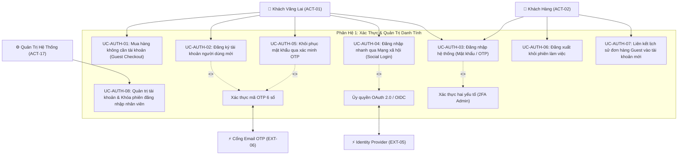

---

### 3.2. Phân Hệ 2: Hồ Sơ Khách Hàng & Quản Trị Nhân Sự (Profile & HR)
*Phụ trách: EPIC 02, EPIC 22 | Ánh xạ FR: FR-02, FR-03*

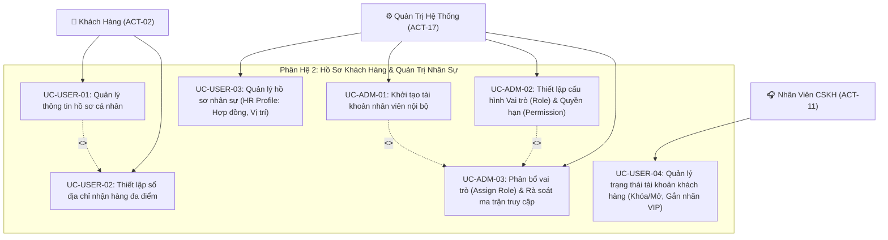

---

### 3.3. Phân Hệ 3: Khám Phá Sản Phẩm, Di Sản OCOP & Trợ Lý AI (Discovery, OCOP & AI)
*Phụ trách: EPIC 03, EPIC 19 | Ánh xạ FR: FR-20, FR-31*

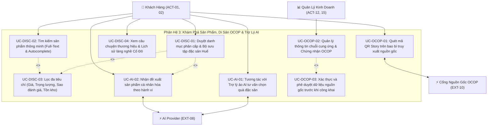

---

### 3.4. Phân Hệ 4: Quản Trị Danh Mục, Biến Thể SKU & Giá Đa Kênh (Catalog & Pricing)
*Phụ trách: EPIC 04 | Ánh xạ FR: FR-04*

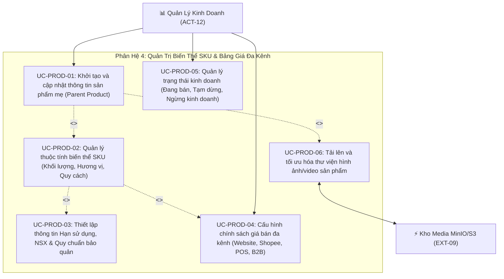

---

### 3.5. Phân Hệ 5: Giỏ Hàng, Đặt Hàng D2C & Mua Quà Tặng (Cart, Checkout & Gifting)
*Phụ trách: EPIC 05, EPIC 06, EPIC 26 | Ánh xạ FR: FR-05, FR-28*

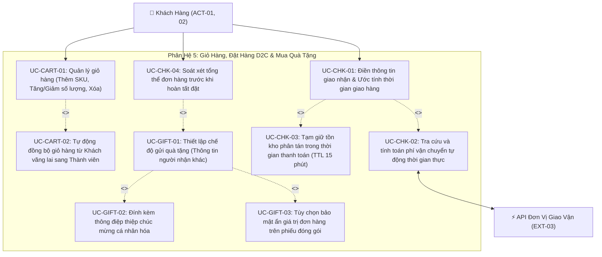

---

### 3.6. Phân Hệ 6: Thanh Toán Số, Đối Soát & Hoàn Tiền (Payment, Billing & Refund)
*Phụ trách: EPIC 07, EPIC 14 | Ánh xạ FR: FR-06, FR-15*

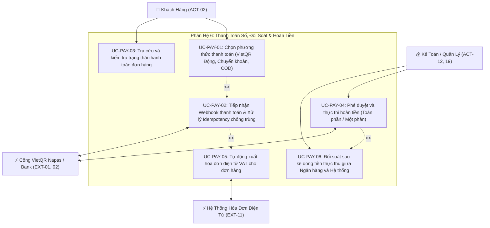

---

### 3.7. Phân Hệ 7: Quản Trị Vòng Đời Đơn Hàng & Điều Phối SLA (Order Management)
*Phụ trách: EPIC 08 | Ánh xạ FR: FR-07*

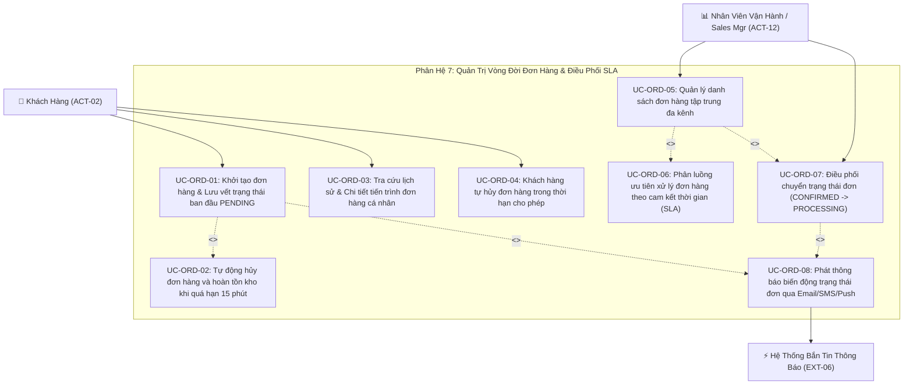

---

### 3.8. Phân Hệ 8: Quản Trị Kho Lô/HSD (FEFO) & Bằng Chứng Đóng Gói (Inventory & Packing)
*Phụ trách: EPIC 09, EPIC 10 | Ánh xạ FR: FR-08, FR-09, FR-10, FR-11*

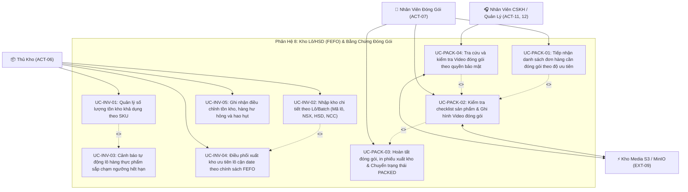

---

### 3.9. Phân Hệ 9: Giao Vận & Điều Phối 3PL (Shipping & Delivery)
*Phụ trách: EPIC 11 | Ánh xạ FR: FR-12*

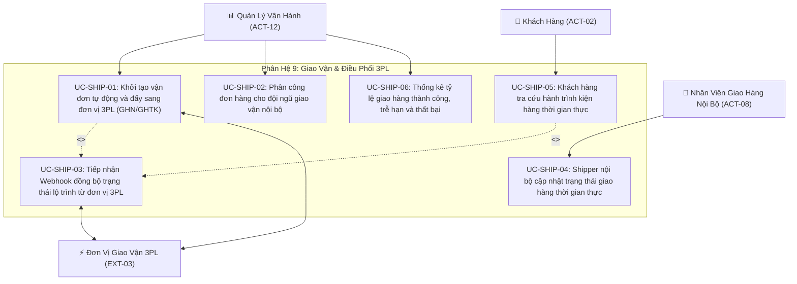

---

### 3.10. Phân Hệ 10: Bán Hàng Đa Kênh: Sàn TMĐT & Điểm Bán Offline (Marketplace & POS)
*Phụ trách: EPIC 12, EPIC 13 | Ánh xạ FR: FR-13, FR-14*

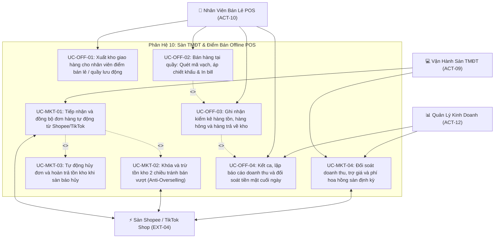

---

### 3.11. Phân Hệ 11: CSKH, Đổi Trả / Khiếu Nại & Đánh Giá Review (Support, Return & Reviews)
*Phụ trách: EPIC 14, EPIC 15, EPIC 16 | Ánh xạ FR: FR-15, FR-16*

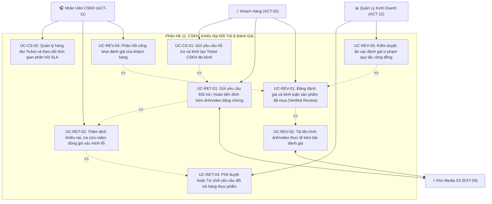

---

### 3.12. Phân Hệ 12: Khuyến Mãi, Tích Điểm Loyalty & Bán Sỉ B2B (Promotion, Loyalty & B2B)
*Phụ trách: EPIC 17, EPIC 18 | Ánh xạ FR: FR-17, FR-18, FR-19*

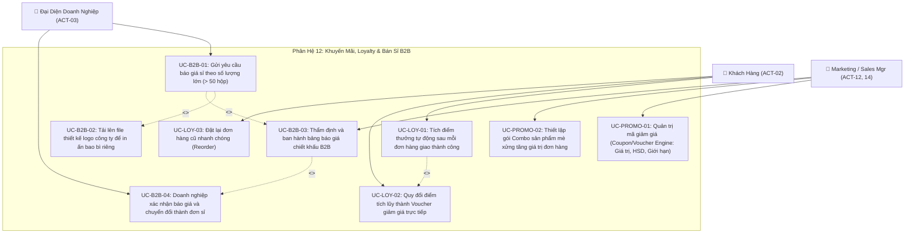

---

### 3.13. Phân Hệ 13: Nội Dung Văn Hóa Cố Đô, SEO & Marketing (Content, SEO & Campaigns)
*Phụ trách: EPIC 20, EPIC 21 | Ánh xạ FR: FR-21, FR-22, FR-23*

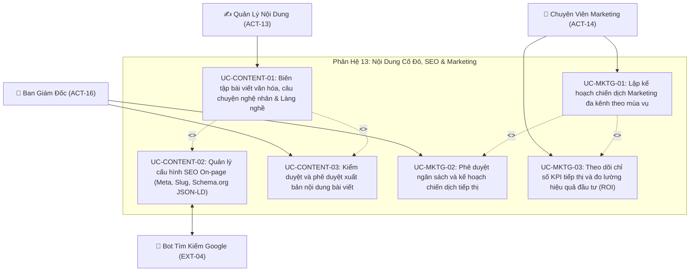

---

### 3.14. Phân Hệ 14: Quản Trị Hệ Thống, Kiểm Toán, Tài Chính & DSS (Admin, Audit, Finance & DSS)
*Phụ trách: EPIC 23, 24, 25, 27, 28 | Ánh xạ FR: FR-24, FR-25, FR-26, FR-27, FR-29, FR-30*

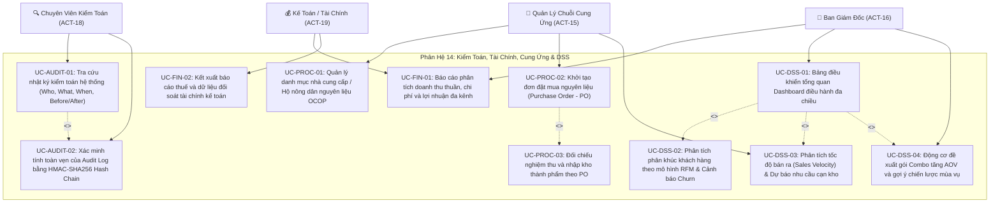

---

# IV. BẢNG ĐẶC TẢ CHI TIẾT CÁC USE CASE TRỌNG YẾU (DETAILED USE CASE SPECIFICATIONS)

Nhằm định hình rõ ràng ranh giới nghiệp vụ, dữ liệu đầu vào/đầu ra và các kịch bản ngoại lệ cho đội ngũ phát triển (Developers & QA), dưới đây là 10 bản đặc tả Use Case rường cột thuộc các phân hệ then chốt của dự án:

---

### 4.1. UC-ORD-01: Khởi Tạo Đơn Hàng D2C & Tạm Giữ Tồn Kho Phân Tán (Checkout)

```
┌──────────────────────────────────────────────────────────────────────────────────────────────────────────────────┐
│                                   ĐẶC TẢ USE CASE: KHỞI TẠO ĐƠN HÀNG D2C (CHECKOUT)                              │
├──────────────────────────┬───────────────────────────────────────────────────────────────────────────────────────┤
│ Mã Use Case              │ UC-ORD-01                                                                             │
│ Tên Use Case             │ Khởi Tạo Đơn Hàng D2C & Tạm Giữ Tồn Kho Phân Tán                                      │
│ Phân Hệ Nghiệp Vụ        │ Phân Hệ 5: Giỏ Hàng & Đặt Hàng | Phân Hệ 7: Quản Trị Đơn Hàng                          │
│ Tác Nhân Chính           │ Khách Hàng Thành Viên (ACT-02) / Khách Hàng Vãng Lai (ACT-01)                         │
│ Tác Nhân Phụ             │ Inventory Service, Payment Service, Logistics Provider (EXT-03)                       │
│ Mức Độ Ưu Tiên           │ Bắt Buộc (Must Have — 1st) | Sprint 04                                                │
├──────────────────────────┼───────────────────────────────────────────────────────────────────────────────────────┤
│ Tiền Điều Kiện           │ 1. Giỏ hàng có ít nhất 1 sản phẩm SKU hợp lệ còn trong trạng thái kinh doanh.         │
│ (Preconditions)          │ 2. Khách hàng đã cung cấp đủ thông tin nhận hàng (Họ tên, SĐT, Địa chỉ chi tiết).     │
├──────────────────────────┼───────────────────────────────────────────────────────────────────────────────────────┤
│ Hậu Điều Kiện            │ 1. Đơn hàng được tạo thành công với trạng thái PENDING_PAYMENT.                       │
│ (Postconditions)         │ 2. Tồn kho khả dụng của các SKU được tạm giữ thành công trong thời hạn 15 phút.       │
│                          │ 3. Sinh mã VietQR động có gắn mã đơn hàng và số tiền chính xác hiển thị trên màn hình.│
└──────────────────────────┴───────────────────────────────────────────────────────────────────────────────────────┘
```

**Luồng Sự Kiện Chính (Main Success Scenario - Happy Path):**
1. Khách hàng xem lại giỏ hàng, chọn địa chỉ giao nhận và nhấn nút *"Tiến hành Đặt Hàng"*.
2. Hệ thống kiểm tra tính hợp lệ của thông tin nhận hàng và tính toán phí vận chuyển chính xác từ API Đơn vị giao vận (EXT-03).
3. Hệ thống kích hoạt khóa phân tán (Distributed Lock) trên từng SKU trong đơn hàng để kiểm tra số lượng tồn khả dụng:
   - Số lượng tồn khả dụng $\ge$ Số lượng đặt mua: Hệ thống thực hiện tạm giữ tồn kho (Hold Stock) với thời gian sống (TTL) là 15 phút.
4. Hệ thống áp dụng mã giảm giá hợp lệ (nếu có), tính tổng số tiền thanh toán cuối cùng và lưu bản ghi Đơn hàng vào CSDL với trạng thái `PENDING_PAYMENT` và sinh mã định danh duy nhất `OM-YYYYMMDD-XXXX`.
5. Hệ thống gọi cổng thanh toán VietQR khởi tạo phiên thanh toán, nhận về chuỗi mã QR động chuẩn Napas 247.
6. Hệ thống điều hướng khách hàng sang màn hình chờ thanh toán, hiển thị mã VietQR động kèm đồng hồ đếm ngược 15:00 và hướng dẫn chuyển khoản.

**Các Luồng Rẽ Nhánh & Ngoại Lệ (Alternative & Exception Flows):**
- **3a. Một hoặc nhiều sản phẩm không đủ tồn kho (Out of Stock / Race-condition):**
  - Hệ thống nhả khóa phân tán ngay lập tức và không tạo đơn hàng.
  - Hệ thống thông báo rõ: *"Rất tiếc, sản phẩm [Tên SKU] vừa hết hàng hoặc không đủ số lượng tồn khả dụng. Vui lòng cập nhật lại giỏ hàng."*
  - Khách hàng được giữ lại tại trang giỏ hàng với thông tin tồn kho mới nhất được làm mới.
- **5a. Lỗi kết nối Cổng thanh toán (Payment Provider Timeout):**
  - Hệ thống ghi nhận đơn hàng ở trạng thái `PAYMENT_FAILED` hoặc cho phép khách hàng chọn phương thức thanh toán thay thế (Thanh toán khi nhận hàng COD hoặc thử lại VietQR).
- **6a. Quá hạn thanh toán 15 phút mà khách hàng chưa chuyển tiền:**
  - Hệ thống Worker tự động quét đơn, chuyển trạng thái đơn hàng sang `EXPIRED`.
  - Hệ thống tự động nhả số lượng tồn kho đã tạm giữ về lại tồn khả dụng cho các khách hàng khác tiếp tục mua.

---

### 4.2. UC-PAY-02: Tiếp Nhận Webhook Thanh Toán & Xác Nhận Đơn Hàng Tự Động

```
┌──────────────────────────────────────────────────────────────────────────────────────────────────────────────────┐
│                             ĐẶC TẢ USE CASE: TIẾP NHẬN WEBHOOK THANH TOÁN (IDEMPOTENCY)                          │
├──────────────────────────┬───────────────────────────────────────────────────────────────────────────────────────┤
│ Mã Use Case              │ UC-PAY-02                                                                             │
│ Tên Use Case             │ Tiếp Nhận Webhook Thanh Toán & Xác Nhận Đơn Hàng Tự Động                              │
│ Phân Hệ Nghiệp Vụ        │ Phân Hệ 6: Thanh Toán Số & Đối Soát                                                   │
│ Tác Nhân Chính           │ Cổng Thanh Toán / Ngân Hàng VietQR (EXT-01, EXT-02)                                   │
│ Tác Nhân Phụ             │ Order Service, Inventory Service, Notification Service, RabbitMQ                      │
│ Mức Độ Ưu Tiên           │ Bắt Buộc (Must Have — 1st) | Sprint 04                                                │
├──────────────────────────┼───────────────────────────────────────────────────────────────────────────────────────┤
│ Tiền Điều Kiện           │ Đơn hàng đang ở trạng thái PENDING_PAYMENT trong thời hạn hiệu lực 15 phút.           │
├──────────────────────────┼───────────────────────────────────────────────────────────────────────────────────────┤
│ Hậu Điều Kiện            │ 1. Đơn hàng chuyển sang trạng thái PAID.                                              │
│ (Postconditions)         │ 2. Tồn kho chuyển từ trạng thái tạm giữ (Reserved) sang trừ thực tế (Committed).      │
│                          │ 3. Phát sự kiện thông báo thời gian thực cho Web Admin và gửi Email xác nhận cho KH.  │
└──────────────────────────┴───────────────────────────────────────────────────────────────────────────────────────┘
```

**Luồng Sự Kiện Chính (Main Success Scenario):**
1. Ngân hàng/Cổng thanh toán gửi Webhook HTTP POST tới endpoint tiếp nhận của hệ thống, mang theo Payload chứa: `transactionId`, `amount`, `orderCode`, `bankCode` và Header chữ ký bảo mật `X-Signature`.
2. Hệ thống thực hiện kiểm tra chữ ký số (HMAC-SHA256) bằng Secret Key bí mật được chia sẻ giữa hệ thống và cổng thanh toán:
   - Chữ ký khớp hoàn toàn $\rightarrow$ Cho phép tiếp tục xử lý.
3. Hệ thống kiểm tra khóa Idempotency Key `payment:idemp:{transactionId}` trong bộ nhớ đệm:
   - Khóa chưa từng tồn tại $\rightarrow$ Ghi nhận khóa với TTL 24 giờ để chặn triệt để rủi ro xử lý trùng tiền.
4. Hệ thống kiểm tra tính khớp nối giữa số tiền khách thực chuyển (`amount`) và tổng giá trị đơn hàng tương ứng (`orderCode`):
   - Số tiền khớp đúng $\rightarrow$ Hệ thống ghi nhận bản ghi giao dịch thành công vào bảng `payments`.
5. Hệ thống chuyển trạng thái đơn hàng từ `PENDING_PAYMENT` sang `PAID` và ghi nhận nhật ký Audit.
6. Hệ thống chuyển đổi trạng thái tồn kho của các SKU trong đơn từ "Tạm giữ" sang "Đã trừ chính thức".
7. Hệ thống phát sự kiện `OrderPaidEvent` lên Message Broker:
   - Notification Service: Bắn chuông WebSocket đơn hàng mới cho màn hình quản trị và gửi Email xác nhận thanh toán kèm mã hóa đơn cho khách hàng.
   - Analytics Service: Ghi nhận sự kiện doanh thu vào Data Mart.
8. Hệ thống phản hồi mã trạng thái `HTTP 200 OK` cho Cổng thanh toán trong vòng dưới 500ms.

**Các Luồng Ngoại Lệ (Exception Flows):**
- **2a. Chữ ký số Webhook không hợp lệ (Sai Secret Key hoặc bị giả mạo Payload):**
  - Hệ thống lập tức từ chối và phản hồi `HTTP 401 Unauthorized`.
  - Ghi nhật ký an ninh cảnh báo giả mạo Webhook kèm địa chỉ IP nguồn gửi đến.
- **3a. Cổng thanh toán gửi lại Webhook trùng lặp (Duplicate Request do Timeout mạng):**
  - Hệ thống kiểm tra thấy `transactionId` đã tồn tại trong khóa Idempotency.
  - Hệ thống lập tức bỏ qua toàn bộ bước cộng tiền lần hai và trả ngay `HTTP 200 OK` cho đối tác.
- **4a. Số tiền chuyển khoản không khớp (Thiếu tiền hoặc thừa tiền):**
  - Hệ thống cập nhật trạng thái đơn hàng thành `PAYMENT_MISMATCH`.
  - Gửi cảnh báo nội bộ khẩn cho nhân viên Kế toán/CSKH tra soát thủ công và liên hệ hỗ trợ khách hàng.

---

### 4.3. UC-PAY-04: Phê Duyệt & Thực Thi Hoàn Tiền Đơn Hàng (Refund Engine)

```
┌──────────────────────────────────────────────────────────────────────────────────────────────────────────────────┐
│                                 ĐẶC TẢ USE CASE: PHÊ DUYỆT & THỰC THI HOÀN TIỀN                                  │
├──────────────────────────┬───────────────────────────────────────────────────────────────────────────────────────┤
│ Mã Use Case              │ UC-PAY-04                                                                             │
│ Tên Use Case             │ Phê Duyệt & Thực Thi Hoàn Tiền Đơn Hàng (Refund Engine)                               │
│ Phân Hệ Nghiệp Vụ        │ Phân Hệ 6: Thanh Toán Số | Phân Hệ 11: CSKH & Đổi Trả                                  │
│ Tác Nhân Chính           │ Sales Manager (ACT-12) / Ban Giám Đốc (ACT-16)                                        │
│ Tác Nhân Phụ             │ Accountant (ACT-19), Payment Gateway (EXT-01), Audit Log Service                     │
│ Mức Độ Ưu Tiên           │ Bắt Buộc (Must Have — 3rd) | Sprint 10                                                │
├──────────────────────────┼───────────────────────────────────────────────────────────────────────────────────────┤
│ Tiền Điều Kiện           │ 1. Đơn hàng đã ở trạng thái PAID hoặc RETURNED.                                       │
│                          │ 2. Có phiếu yêu cầu hoàn tiền đã được CSKH thẩm định sơ bộ.                           │
├──────────────────────────┼───────────────────────────────────────────────────────────────────────────────────────┤
│ Hậu Điều Kiện            │ 1. Lệnh hoàn tiền được gửi thành công sang Cổng thanh toán hoặc cộng ví điểm Loyalty. │
│ (Postconditions)         │ 2. Đơn hàng chuyển sang trạng thái REFUNDED hoặc PARTIALLY_REFUNDED.                 │
│                          │ 3. Bắt buộc ghi nhận đầy đủ lý do hoàn tiền và danh tính người duyệt vào Audit Log.   │
└──────────────────────────┴───────────────────────────────────────────────────────────────────────────────────────┘
```

**Luồng Sự Kiện Chính (Main Success Scenario):**
1. Quản lý bán hàng (Sales Manager) đăng nhập Web Admin, truy cập danh sách *"Yêu cầu hoàn tiền cần duyệt"*.
2. Quản lý kiểm tra thông tin đơn hàng, phương thức thanh toán gốc, lý do hoàn tiền, số tiền đề xuất hoàn và biên bản thẩm định kèm bằng chứng từ CSKH.
3. Quản lý lựa chọn hình thức hoàn:
   - *Hoàn tiền toàn phần (Full Refund)* hoặc *Hoàn tiền một phần (Partial Refund)* theo thỏa thuận.
   - *Phương thức hoàn*: Hoàn trả về tài khoản/cổng thanh toán gốc hoặc quy đổi thành điểm thưởng Loyalty nếu khách hàng đồng ý (BR-REFUND-03).
4. Quản lý nhập mã xác thực OTP/2FA và nhấn nút *"Phê Duyệt Hoàn Tiền"*.
5. Hệ thống gửi yêu cầu Refund API sang Cổng thanh toán gốc (EXT-01) kèm mã giao dịch gốc `originalTransactionId`.
6. Cổng thanh toán phản hồi xác nhận lệnh hoàn tiền thành công.
7. Hệ thống cập nhật trạng thái đơn hàng sang `REFUNDED` (hoặc `PARTIALLY_REFUNDED`), cập nhật trạng thái kho (nếu có hoàn hàng về kho) và ghi bản ghi vào CSDL kiểm toán Audit Log với đầy đủ giá trị Before/After, Lý do hoàn tiền (BR-AUDIT-04).
8. Hệ thống gửi thông báo xác nhận hoàn tiền thành công cho khách hàng qua Email/Zalo ZNS.

**Các Luồng Rẽ Nhánh & Ngoại Lệ:**
- **2a. Quản lý từ chối yêu cầu hoàn tiền:**
  - Quản lý nhập rõ lý do từ chối (Ví dụ: Sản phẩm quá hạn đổi trả, lỗi do người dùng bảo quản sai quy cách).
  - Hệ thống cập nhật trạng thái yêu cầu sang `REJECTED`, thông báo cho CSKH để phản hồi giải thích cho khách hàng.
- **5a. Cổng thanh toán gốc từ chối lệnh hoàn tiền (Ví dụ: Thẻ hết hạn, giao dịch quá thời hạn hoàn tự động):**
  - Hệ thống báo lỗi cho Kế toán để chuyển sang phương án hoàn tiền thủ công qua số tài khoản ngân hàng được khách hàng cung cấp.

---

### 4.4. UC-PACK-02: Đóng Gói Sản Phẩm & Ghi Hình/Lưu Trữ Packing Video

```
┌──────────────────────────────────────────────────────────────────────────────────────────────────────────────────┐
│                            ĐẶC TẢ USE CASE: ĐÓNG GÓI SẢN PHẨM & LƯU BẰNG CHỨNG VIDEO                             │
├──────────────────────────┬───────────────────────────────────────────────────────────────────────────────────────┤
│ Mã Use Case              │ UC-PACK-02                                                                             │
│ Tên Use Case             │ Đóng Gói Sản Phẩm & Ghi Hình/Lưu Trữ Packing Video                                    │
│ Phân Hệ Nghiệp Vụ        │ Phân Hệ 8: Kho Lô/HSD & Đóng Gói                                                      │
│ Tác Nhân Chính           │ Nhân Viên Đóng Gói (Packing Staff - ACT-07)                                           │
│ Tác Nhân Phụ             │ Media Storage S3/MinIO (EXT-09), Order Service                                        │
│ Mức Độ Ưu Tiên           │ Nên Có (Should Have — Phase 2) | Kế thừa từ Sprint 08                                 │
├──────────────────────────┼───────────────────────────────────────────────────────────────────────────────────────┤
│ Tiền Điều Kiện           │ Đơn hàng đang ở trạng thái PROCESSING và đã được in phiếu nhặt hàng (Pick List).     │
├──────────────────────────┼───────────────────────────────────────────────────────────────────────────────────────┤
│ Hậu Điều Kiện            │ 1. Video đóng gói được upload thành công và gắn mã liên kết với đơn hàng OM-XXXX.     │
│ (Postconditions)         │ 2. Đơn hàng chuyển sang trạng thái PACKED, sẵn sàng bàn giao vận chuyển.              │
└──────────────────────────┴───────────────────────────────────────────────────────────────────────────────────────┘
```

**Luồng Sự Kiện Chính (Main Success Scenario):**
1. Nhân viên đóng gói mở ứng dụng Web nội bộ tại bàn đóng gói, quét mã vạch đơn hàng `OM-YYYYMMDD-XXXX`.
2. Màn hình hiển thị danh sách chi tiết: Tên sản phẩm, Biến thể SKU, Số lượng, Hạn sử dụng của lô cần nhặt và ghi chú quà tặng (nếu có).
3. Nhân viên nhấn nút *"Bắt đầu Đóng Gói"* $\rightarrow$ Hệ thống tự động kích hoạt camera tại bàn đóng gói để bắt đầu ghi hình.
4. Nhân viên thực hiện quét mã SKU từng sản phẩm vào thùng hàng và tích chọn kiểm tra các tiêu chí trên Checklist (Hạn sử dụng còn nguyên vẹn, bao bì không rách vỡ, đúng phân loại quà biếu).
5. Nhân viên dán tem niêm phong kiện hàng, dán phiếu giao hàng lên mặt thùng và giơ mã vận đơn trước camera.
6. Nhân viên nhấn *"Hoàn Tất Đóng Gói"* $\rightarrow$ Hệ thống dừng camera ghi hình, nén video và tải tệp lên Kho lưu trữ đối tượng MinIO/S3 (EXT-09) theo đường dẫn bảo mật `media/packing/{orderCode}/{timestamp}.mp4`.
7. Hệ thống nhận URL định danh của video, lưu vào bảng `shipment_proofs` liên kết trực tiếp với mã đơn hàng.
8. Hệ thống cập nhật trạng thái đơn hàng sang `PACKED` và kích hoạt sẵn sàng tạo vận đơn bàn giao cho Shipper.

**Các Luồng Rẽ Nhánh & Ngoại Lệ:**
- **4a. Phát hiện sản phẩm bị lỗi bao bì, móp méo hoặc cận hạn sử dụng:**
  - Nhân viên đóng gói nhấn nút *"Báo Lỗi Sản Phẩm"*, dừng luồng đóng gói và yêu cầu Thủ kho đổi sản phẩm từ Lô/Batch đạt chuẩn khác.
- **6a. Mất kết nối camera hoặc lỗi tải tệp video lên S3:**
  - Hệ thống hiển thị cảnh báo lỗi lưu trữ. Nhân viên đóng gói có quyền chụp ảnh chụp kiện hàng hoàn tất làm bằng chứng dự phòng và báo bộ phận kỹ thuật hỗ trợ.

---

### 4.5. UC-PACK-04: Tra Cứu & Xác Minh Video Đóng Gói Phục Vụ Xử Lý Khiếu Nại

```
┌──────────────────────────────────────────────────────────────────────────────────────────────────────────────────┐
│                             ĐẶC TẢ USE CASE: TRA CỨU & XÁC MINH VIDEO ĐÓNG GÓI                                   │
├──────────────────────────┬───────────────────────────────────────────────────────────────────────────────────────┤
│ Mã Use Case              │ UC-PACK-04                                                                             │
│ Tên Use Case             │ Tra Cứu & Xác Minh Video Đóng Gói Phục Vụ Xử Lý Khiếu Nại                              │
│ Phân Hệ Nghiệp Vụ        │ Phân Hệ 8: Kho Lô & Đóng Gói | Phân Hệ 11: CSKH & Đổi Trả                             │
│ Tác Nhân Chính           │ Nhân Viên CSKH (ACT-11) / Quản Lý Bán Hàng (ACT-12)                                   │
│ Tác Nhân Phụ             │ Media Storage S3/MinIO (EXT-09), Audit Service                                        │
│ Mức Độ Ưu Tiên           │ Nên Có (Should Have — Phase 2) | Sprint 10                                            │
├──────────────────────────┼───────────────────────────────────────────────────────────────────────────────────────┤
│ Tiền Điều Kiện           │ 1. Đơn hàng đã hoàn tất đóng gói và có video lưu trữ hợp lệ.                          │
│                          │ 2. Nhân viên đăng nhập có Role được cấp quyền xem Packing Video (BR-PACK-05).         │
├──────────────────────────┼───────────────────────────────────────────────────────────────────────────────────────┤
│ Hậu Điều Kiện            │ 1. Video đóng gói được phát trực tiếp qua đường dẫn có chữ ký giới hạn thời gian.     │
│ (Postconditions)         │ 2. Ghi nhận nhật ký Audit về lượt xem video để đảm bảo an toàn thông tin (NFR-09).    │
└──────────────────────────┴───────────────────────────────────────────────────────────────────────────────────────┘
```

**Luồng Sự Kiện Chính (Main Success Scenario):**
1. Khách hàng gửi khiếu nại phản ánh đơn hàng nhận được bị thiếu sản phẩm hoặc bị rách vỡ bao bì.
2. Nhân viên CSKH mở giao diện Ticket khiếu nại, nhấn vào liên kết *"Xem Bằng Chứng Đóng Gói"* của đơn hàng tương ứng.
3. Hệ thống kiểm tra quyền hạn RBAC của tài khoản:
   - Tài khoản có quyền `VIEW_PACKING_VIDEO` $\rightarrow$ Hệ thống gửi yêu cầu sinh Pre-signed URL (có hiệu lực 15 phút) từ Media Storage MinIO/S3.
4. Màn hình phát video đóng gói hiển thị rõ ràng: Quá trình nhân viên nhặt hàng, tình trạng bao bì sản phẩm, thao tác đóng thùng và mã niêm phong dán ngoài kiện hàng.
5. CSKH đối chiếu hình ảnh thực tế từ video với hình ảnh khiếu nại của khách hàng:
   - *Trường hợp lỗi do đóng gói thiếu*: Chấp thuận khiếu nại và chuyển quy trình gửi bù hàng/hoàn tiền.
   - *Trường hợp đóng gói đủ nhưng bưu kiện bị rách khi nhận*: Lập biên bản yêu cầu Đơn vị giao vận 3PL bồi thường thiệt hại.
6. Hệ thống tự động ghi nhận bản ghi Audit Log: Nhân viên nào, xem video đóng gói của đơn hàng nào, vào thời điểm nào.

**Các Luồng Ngoại Lệ:**
- **3a. Tài khoản không có quyền xem video:**
  - Hệ thống từ chối truy cập và hiển thị thông báo: *"Bạn không có thẩm quyền truy cập video đóng gói của đơn hàng này. Vui lòng liên hệ Trưởng bộ phận."*

---

### 4.6. UC-MKT-01: Tiếp Nhận & Đồng Bộ Đơn Hàng Tự Động Từ Sàn TMĐT (Shopee/TikTok)

```
┌──────────────────────────────────────────────────────────────────────────────────────────────────────────────────┐
│                             ĐẶC TẢ USE CASE: ĐỒNG BỘ ĐƠN HÀNG SÀN TMĐT (MARKETPLACE)                             │
├──────────────────────────┬───────────────────────────────────────────────────────────────────────────────────────┤
│ Mã Use Case              │ UC-MKT-01                                                                             │
│ Tên Use Case             │ Tiếp Nhận & Đồng Bộ Đơn Hàng Tự Động Từ Sàn TMĐT (Shopee/TikTok)                      │
│ Phân Hệ Nghiệp Vụ        │ Phân Hệ 10: Sàn TMĐT & Điểm Bán Offline POS                                           │
│ Tác Nhân Chính           │ Sàn Thương Mại Điện Tử Shopee / TikTok Shop (EXT-04)                                  │
│ Tác Nhân Phụ             │ Marketplace Operator (ACT-09), Inventory Service, Order Service                       │
│ Mức Độ Ưu Tiên           │ Nên Có (Should Have — Phase 2) | EPIC 12                                              │
├──────────────────────────┼───────────────────────────────────────────────────────────────────────────────────────┤
│ Tiền Điều Kiện           │ Kênh bán Shopee/TikTok đã được tích hợp Open API và xác thực kết nối hợp lệ.          │
├──────────────────────────┼───────────────────────────────────────────────────────────────────────────────────────┤
│ Hậu Điều Kiện            │ 1. Đơn hàng nội bộ được tạo mới với mã nguồn rõ ràng và mã tham chiếu gốc của sàn.    │
│ (Postconditions)         │ 2. Tồn kho khả dụng nội bộ được tạm giữ/trừ ngay để tránh bán vượt trên kênh khác.    │
└──────────────────────────┴───────────────────────────────────────────────────────────────────────────────────────┘
```

**Luồng Sự Kiện Chính (Main Success Scenario):**
1. Khách hàng hoàn tất đặt đơn mua sản phẩm mè xửng trên gian hàng Shopee hoặc TikTok Shop.
2. Sàn TMĐT gửi Webhook thông báo đơn hàng mới `ORDER_CREATED` đến endpoint tiếp nhận của hệ thống.
3. Hệ thống xác thực chữ ký Webhook từ sàn để xác nhận tính hợp lệ.
4. Hệ thống kiểm tra mã tham chiếu gốc `externalOrderId` trong CSDL:
   - Mã chưa tồn tại $\rightarrow$ Cho phép tiếp tục xử lý (Đảm bảo BR-MKTPLACE-04 không sinh trùng đơn khi sàn thử lại).
5. Hệ thống ánh xạ mã SKU của sàn sang mã SKU nội bộ của hệ thống.
6. Hệ thống gửi lệnh sang Inventory Service để trừ số lượng tồn kho khả dụng tương ứng trên hệ thống nội bộ ngay lập tức (BR-MKTPLACE-05).
7. Hệ thống tạo bản ghi Đơn hàng mới trong `orders` với kênh phát sinh `CHANNEL_SHOPEE` hoặc `CHANNEL_TIKTOK`, lưu giữ giá trị đơn hàng thực thu theo sàn (BR-MKTPLACE-07) và chuyển tiếp vào luồng xử lý đóng gói nội bộ.
8. Hệ thống phản hồi xác nhận thành công cho Sàn TMĐT.

**Các Luồng Ngoại Lệ:**
- **4a. Mã đơn hàng từ sàn đã tồn tại trong hệ thống (Duplicate Delivery):**
  - Hệ thống bỏ qua bước tạo đơn, chỉ cập nhật trạng thái mới nhất (nếu có thay đổi) và phản hồi thành công cho sàn.
- **5a. Không tìm thấy mã SKU nội bộ khớp với mã SKU trên sàn:**
  - Hệ thống ghi nhận trạng thái lỗi đồng bộ `SYNC_ERROR_UNKNOWN_SKU` và bắn cảnh báo cho Marketplace Operator (ACT-09) để xử lý cấu hình ánh xạ thủ công.

---

### 4.7. UC-OFF-02: Ghi Nhận Giao Dịch Bán Lẻ Offline POS & Quản Trị Tồn Điểm Bán

```
┌──────────────────────────────────────────────────────────────────────────────────────────────────────────────────┐
│                               ĐẶC TẢ USE CASE: BÁN HÀNG TẠI ĐIỂM BÁN OFFLINE POS                                 │
├──────────────────────────┬───────────────────────────────────────────────────────────────────────────────────────┤
│ Mã Use Case              │ UC-OFF-02                                                                             │
│ Tên Use Case             │ Ghi Nhận Giao Dịch Bán Lẻ Offline POS & Quản Trị Tồn Điểm Bán                         │
│ Phân Hệ Nghiệp Vụ        │ Phân Hệ 10: Sàn TMĐT & Điểm Bán Offline POS                                           │
│ Tác Nhân Chính           │ Nhân Viên Bán Lẻ POS (ACT-10)                                                         │
│ Tác Nhân Phụ             │ Khách Hàng Tại Quầy (ACT-05), Máy In Hóa Đơn, Cổng VietQR                             │
│ Mức Độ Ưu Tiên           │ Nên Có (Should Have — Phase 2) | EPIC 13                                              │
├──────────────────────────┼───────────────────────────────────────────────────────────────────────────────────────┤
│ Tiền Điều Kiện           │ Nhân viên đã mở ca làm việc và có danh mục hàng tồn được cấp phát tại điểm bán.       │
├──────────────────────────┼───────────────────────────────────────────────────────────────────────────────────────┤
│ Hậu Điều Kiện            │ 1. Đơn hàng Offline được lưu trữ thành công trên hệ thống tập trung.                   │
│ (Postconditions)         │ 2. Tồn kho của điểm bán được trừ trực tiếp và hóa đơn bán lẻ được in cho khách.       │
└──────────────────────────┴───────────────────────────────────────────────────────────────────────────────────────┘
```

**Luồng Sự Kiện Chính (Main Success Scenario):**
1. Nhân viên bán hàng dùng đầu đọc mã vạch quét mã Barcode/SKU trên bao bì sản phẩm mè xửng mà khách chọn tại quầy.
2. Giao diện POS hiển thị tên sản phẩm, số lượng, giá bán niêm yết và số lượng tồn hiện có tại quầy.
3. Nhân viên nhập số điện thoại của khách hàng để tra cứu thẻ thành viên:
   - Khách có tài khoản: Hệ thống hiển thị điểm tích lũy và cho phép áp dụng trừ điểm trực tiếp.
   - Khách mới: Cho phép tạo nhanh hồ sơ tích điểm qua SĐT.
4. Nhân viên chọn hình thức thanh toán: *Tiền mặt* hoặc *Quét mã VietQR động tại quầy*.
   - Nếu chọn VietQR: Màn hình phụ hướng về phía khách hiển thị mã QR động để khách chuyển tiền.
5. Nhân viên xác nhận đã nhận đủ tiền và bấm *"Thanh Toán & In Hóa Đơn"*.
6. Hệ thống tạo một bản ghi Đơn hàng với nguồn `CHANNEL_OFFLINE_POS`, trừ số lượng tồn kho của điểm bán tương ứng và gửi lệnh in hóa đơn ra máy in nhiệt.
7. Nhân viên trao hóa đơn và sản phẩm đóng túi cho khách hàng.

**Các Luồng Ngoại Lệ:**
- **2a. Số lượng quét vượt quá tồn kho thực tế của điểm bán:**
  - Màn hình POS báo đỏ cảnh báo tồn kho không đủ. Nhân viên kiểm tra lại số lượng thực tế trên kệ hoặc làm thủ tục xuất bù từ kho tổng.

---

### 4.8. UC-RET-02: Tiếp Nhận Yêu Cầu Đổi Trả / Hoàn Tiền Đính Kèm Bằng Chứng

```
┌──────────────────────────────────────────────────────────────────────────────────────────────────────────────────┐
│                               ĐẶC TẢ USE CASE: TIẾP NHẬN YÊU CẦU ĐỔI TRẢ & BẰNG CHỨNG                            │
├──────────────────────────┬───────────────────────────────────────────────────────────────────────────────────────┤
│ Mã Use Case              │ UC-RET-02                                                                             │
│ Tên Use Case             │ Tiếp Nhận Yêu Cầu Đổi Trả / Hoàn Tiền Đính Kèm Bằng Chứng                             │
│ Phân Hệ Nghiệp Vụ        │ Phân Hệ 11: CSKH, Đổi Trả & Đánh Giá                                                  │
│ Tác Nhân Chính           │ Khách Hàng Thành Viên (ACT-02)                                                        │
│ Tác Nhân Phụ             │ CSKH Staff (ACT-11), Sales Manager (ACT-12), Media Storage S3 (EXT-09)                │
│ Mức Độ Ưu Tiên           │ Bắt Buộc (Must Have — 3rd) | Sprint 10                                                │
├──────────────────────────┼───────────────────────────────────────────────────────────────────────────────────────┤
│ Tiền Điều Kiện           │ Đơn hàng đã ở trạng thái DELIVERED trong vòng 07 ngày kể từ ngày nhận hàng.           │
├──────────────────────────┼───────────────────────────────────────────────────────────────────────────────────────┤
│ Hậu Điều Kiện            │ 1. Phiếu yêu cầu đổi trả được tạo với trạng thái RETURN_REQUESTED.                    │
│ (Postconditions)         │ 2. Hình ảnh/video khiếu nại được tải lên và thông báo được đẩy tới hàng đợi CSKH.    │
└──────────────────────────┴───────────────────────────────────────────────────────────────────────────────────────┘
```

**Luồng Sự Kiện Chính (Main Success Scenario):**
1. Khách hàng truy cập trang chi tiết đơn hàng đã giao thành công và nhấn nút *"Yêu cầu Đổi / Trả Hàng"*.
2. Hệ thống kiểm tra điều kiện thời gian: Ngày hiện tại nằm trong hạn mức 07 ngày kể từ lúc nhận hàng.
3. Khách hàng chọn lý do khiếu nại (Hàng bị ỉu/mốc, rách bao bì, giao sai quy cách, thiếu số lượng quà tặng).
4. Khách hàng tải lên tối thiểu 01 hình ảnh rõ nét chụp tem niêm phong/bao bì và đoạn video ngắn quay cận cảnh tình trạng sản phẩm bị lỗi.
5. Khách hàng chọn phương án mong muốn: *Đổi sản phẩm mới cùng loại* hoặc *Hoàn tiền*.
6. Khách hàng nhấn *"Gửi Yêu Cầu"* $\rightarrow$ Hệ thống tải tệp đa phương tiện lên Kho Media S3, tạo bản ghi khiếu nại và chuyển trạng thái đơn hàng sang `RETURN_REQUESTED`.
7. Hệ thống tự động tạo Ticket CSKH ưu tiên cao và gửi thông báo cho nhân viên CSKH phụ trách thẩm định.

**Các Luồng Ngoại Lệ:**
- **2a. Đơn hàng đã giao quá 07 ngày:**
  - Hệ thống khóa chức năng gửi yêu cầu tự động và hiển thị thông báo: *"Đơn hàng đã vượt quá thời hạn đổi trả theo quy định (07 ngày). Vui lòng liên hệ Hotline CSKH để được hỗ trợ đặc biệt."*

---

### 4.9. UC-OCOP-01: Quét Mã QR Story Truy Xuất Nguồn Gốc Chuỗi Cung Ứng OCOP

```
┌──────────────────────────────────────────────────────────────────────────────────────────────────────────────────┐
│                               ĐẶC TẢ USE CASE: QUÉT MÃ QR STORY TRUY XUẤT NGUỒN GỐC                              │
├──────────────────────────┬───────────────────────────────────────────────────────────────────────────────────────┤
│ Mã Use Case              │ UC-OCOP-01                                                                            │
│ Tên Use Case             │ Quét Mã QR Story Truy Xuất Nguồn Gốc Chuỗi Cung Ứng OCOP                              │
│ Phân Hệ Nghiệp Vụ        │ Phân Hệ 3: Khám Phá Sản Phẩm, Di Sản OCOP & AI                                        │
│ Tác Nhân Chính           │ Khách Hàng (ACT-01, ACT-02, ACT-05)                                                   │
│ Tác Nhân Phụ             │ Origin Provider (EXT-10), Analytics Platform                                          │
│ Mức Độ Ưu Tiên           │ Bắt Buộc (Must Have — 3rd) | Sprint 09                                                │
├──────────────────────────┼───────────────────────────────────────────────────────────────────────────────────────┤
│ Tiền Điều Kiện           │ Khách hàng quét mã QR Code in trên bao bì sản phẩm mè xửng hoặc trang web.            │
├──────────────────────────┼───────────────────────────────────────────────────────────────────────────────────────┤
│ Hậu Điều Kiện            │ Trang Web di sản hiển thị minh bạch toàn bộ dữ liệu nguồn gốc, chứng nhận OCOP và Lô. │
│ (Postconditions)         │ Ghi nhận lượt quét vào hệ thống phân tích hành vi người dùng.                         │
└──────────────────────────┴───────────────────────────────────────────────────────────────────────────────────────┘
```

**Luồng Sự Kiện Chính (Main Success Scenario):**
1. Khách hàng dùng điện thoại thông minh (Camera hoặc Zalo) quét mã QR Story in trên hộp mè xửng O Mạ.
2. Trình duyệt mở trang web giới thiệu di sản nguồn gốc sản phẩm `/story/{skuCode}?batch={batchNumber}`.
3. Hệ thống truy xuất dữ liệu tổng hợp theo chuỗi cung ứng:
   - *Vùng nguyên liệu*: Nguồn gốc hạt mè, đậu phụng, đường mía hữu cơ canh tác tại Quảng Điền, Phong Điền (Huế).
   - *Quy trình chế biến*: Video công đoạn nấu mạch nha, tráng mè xửng truyền thống kết hợp tiêu chuẩn vệ sinh ATTP.
   - *Hồ sơ pháp lý OCOP*: Giấy chứng nhận sản phẩm OCOP 4 sao tỉnh Thừa Thiên Huế, phiếu kiểm nghiệm vi sinh định kỳ.
   - *Thông tin Lô sản xuất*: Ngày sản xuất, Hạn sử dụng của chính lô hàng trên tay khách hàng.
4. Giao diện hiển thị sinh động kết hợp hình ảnh nghệ nhân, câu chuyện văn hóa ẩm thực Cố Đô và nút bấm *"Đặt mua thêm sản phẩm chính hãng"*.
5. Hệ thống ghi nhận lượt quét QR Story vào hệ thống phân tích hành vi để đánh giá mức độ tương tác của khách hàng.

---

### 4.10. UC-DSS-02: Phân Tích Đa Nền Tảng & Đề Xuất Định Hướng Chiến Lược (DSS Engine)

```
┌──────────────────────────────────────────────────────────────────────────────────────────────────────────────────┐
│                               ĐẶC TẢ USE CASE: ĐỘNG CƠ ĐỀ XUẤT ĐỊNH HƯỚNG CHIẾN LƯỢC                             │
├──────────────────────────┬───────────────────────────────────────────────────────────────────────────────────────┤
│ Mã Use Case              │ UC-DSS-02                                                                             │
│ Tên Use Case             │ Phân Tích Đa Nền Tảng & Đề Xuất Định Hướng Chiến Lược (DSS Engine)                    │
│ Phân Hệ Nghiệp Vụ        │ Phân Hệ 14: Quản Trị Hệ Thống, Tài Chính & DSS Chiến Lược                             │
│ Tác Nhân Chính           │ Ban Giám Đốc (ACT-16) / Quản Lý Kinh Doanh (ACT-12)                                   │
│ Tác Nhân Phụ             │ Analytics Service, Data Mart PostgreSQL, MongoDB Behavior DB                          │
│ Mức Độ Ưu Tiên           │ Có Thể Có (Could Have — Phase 3) | Trọng tâm học thuật Đồ án                          │
├──────────────────────────┼───────────────────────────────────────────────────────────────────────────────────────┤
│ Tiền Điều Kiện           │ Hệ thống có dữ liệu bán hàng đa kênh và nhật ký clickstream tối thiểu 14 ngày.        │
├──────────────────────────┼───────────────────────────────────────────────────────────────────────────────────────┤
│ Hậu Điều Kiện            │ 1. Hiển thị các thẻ khuyến nghị hành động chiến lược thông minh.                      │
│ (Postconditions)         │ 2. Cho phép Giám đốc bấm kích hoạt chiến dịch tự động hoặc xuất báo cáo điều hành.    │
└──────────────────────────┴───────────────────────────────────────────────────────────────────────────────────────┘
```

**Luồng Sự Kiện Chính (Main Success Scenario):**
1. Ban Giám Đốc đăng nhập Web Admin và mở chuyên mục *"Trung Tâm Phân Tích & Hỗ Trợ Quyết Định Chiến Lược"*.
2. Động cơ phân tích dữ liệu tổng hợp đa nguồn từ CSDL giao dịch (Doanh thu các kênh, Tồn kho các lô, Tốc độ bán) và CSDL NoSQL (Từ khóa tìm kiếm, lượt xem sản phẩm, tỷ lệ thoát trang).
3. Hệ thống chạy các mô hình tính toán nghiệp vụ thông minh:
   - *Thuật toán Phân tích giỏ hàng (Market Basket Analysis)*: Tìm cặp sản phẩm thường mua kèm với độ tin cậy $\text{Confidence} \ge 60\%$.
   - *Mô hình phân khúc RFM (Recency, Frequency, Monetary)*: Phân loại tệp khách hàng thành các nhóm (VIP, Khách hàng trung thành, Khách hàng có nguy cơ rời bỏ - At Risk).
   - *Thuật toán Cảnh báo chuỗi cung ứng*: So sánh tốc độ tiêu thụ (Sales Velocity) với lượng tồn kho thực tế và hạn sử dụng của Lô.
4. Màn hình hiển thị các thẻ Khuyến nghị Hành động Chiến lược trực quan:
   - **Khuyến Nghị 1 (Gói Sản Phẩm Tăng AOV)**: *"Phát hiện 68% khách mua Mè Xửng Giòn thường mua kèm Trà Cung Đình $\rightarrow$ Đề xuất tạo Combo 'Vị Trà Cố Đô' giảm 8% để tăng giá trị đơn hàng trung bình thêm 25%."*
   - **Khuyến Nghị 2 (Kích Cầu Khách Hàng Nguy Cơ Rời Bỏ)**: *"Có 120 khách hàng nhóm 'At Risk' chưa mua lại sau 60 ngày $\rightarrow$ Đề xuất gửi Voucher giảm 15% qua Zalo ZNS cá nhân hóa."*
   - **Khuyến Nghị 3 (Cảnh Báo Lô Hàng Cận Date)**: *"Lô mè xửng dẻo MX-LOT-04 còn 500 hộp sẽ chạm ngưỡng 45 ngày hết hạn $\rightarrow$ Đề xuất triển khai Flash Sale đẩy hàng nhanh."*
5. Giám đốc có thể nhấn nút *"Kích Hoạt Chiến Dịch"* để hệ thống tự động sinh mã khuyến mãi/gửi tin nhắn, hoặc bấm *"Xuất Báo Cáo Chiến Lược PDF/Excel"* để phục vụ cuộc họp điều hành định kỳ.

---

# V. MA TRẬN ÁNH XẠ TOÀN DIỆN (TRACEABILITY MATRIX)

Bảng ma trận dưới đây thiết lập chuỗi liên kết truy xuất nguồn gốc hai chiều (Bidirectional Traceability) khép kín, ánh xạ 100% giữa **Use Case ID** $\longleftrightarrow$ **User Story ID (chuẩn Backlog v3.0)** $\longleftrightarrow$ **Epic Mapping (EPIC 01 ~ 28)** $\longleftrightarrow$ **Functional Requirement (FR-01 ~ FR-31)** $\longleftrightarrow$ **Lộ trình Phát hành (Release Phase)**:

| Mã Use Case | Tên Use Case Nghiệp Vụ | Ánh Xạ User Story | Epic | Ánh Xạ FR | Phân Kỳ Lộ Trình |
| :---: | :--- | :---: | :---: | :---: | :---: |
| **UC-AUTH-01** | Mua hàng không cần tài khoản (Guest Checkout) | `US-AUTH-01` | EPIC 01 | FR-01 | MVP v1.0 (Must - 1st) |
| **UC-AUTH-02** | Đăng ký tài khoản người dùng mới & OTP | `US-AUTH-02` | EPIC 01 | FR-01 | MVP v1.0 (Must - 1st) |
| **UC-AUTH-03** | Đăng nhập hệ thống (Mật khẩu / Token) | `US-AUTH-03` | EPIC 01 | FR-01 | MVP v1.0 (Must - 1st) |
| **UC-AUTH-04** | Đăng nhập qua mạng xã hội (Social Login) | `US-AUTH-04` | EPIC 01 | FR-01 | Giai đoạn 2 (Should) |
| **UC-AUTH-05** | Khôi phục mật khẩu qua Email OTP | `US-AUTH-05` | EPIC 01 | FR-01 | MVP v1.0 (Must - 1st) |
| **UC-AUTH-06** | Đăng xuất phiên làm việc an toàn | `US-AUTH-03` | EPIC 01 | FR-01 | MVP v1.0 (Must - 1st) |
| **UC-AUTH-07** | Liên kết lịch sử đơn hàng Guest vào tài khoản mới | `US-AUTH-06` | EPIC 01 | FR-01 | Giai đoạn 2 (Should) |
| **UC-USER-01** | Quản lý hồ sơ cá nhân khách hàng | `US-USER-01` | EPIC 02 | FR-01 | MVP v1.0 (Must - 1st) |
| **UC-USER-02** | Thiết lập sổ địa chỉ nhận hàng đa điểm | `US-USER-02` | EPIC 02 | FR-05 | MVP v1.0 (Must - 1st) |
| **UC-USER-03** | Quản lý hồ sơ nhân sự (HR Profile) | `US-USER-03` | EPIC 02 | FR-02 | Giai đoạn 2 (Should) |
| **UC-USER-04** | Quản lý trạng thái tài khoản khách hàng | `US-USER-05` | EPIC 02 | FR-03 | Giai đoạn 2 (Should) |
| **UC-ADM-01** | Khởi tạo và khóa tài khoản nhân viên | `US-ADM-01, 03` | EPIC 22 | FR-03 | MVP v1.1 (Must - 2nd) |
| **UC-ADM-02** | Quản lý Vai trò (Role) & Quyền hạn (Permission)| `US-ADM-04, 05` | EPIC 22 | FR-03 | MVP v1.1 (Must - 2nd) |
| **UC-ADM-03** | Gán vai trò & Rà soát quyền truy cập RBAC | `US-ADM-06, 07` | EPIC 22 | FR-03 | MVP v1.1 (Must - 2nd) |
| **UC-DISC-01** | Duyệt danh mục phân cấp đặc sản Huế | `US-DISC-01` | EPIC 03 | FR-31 | MVP v1.0 (Must - 1st) |
| **UC-DISC-02** | Tìm kiếm sản phẩm thông minh (Full-Text) | `US-DISC-02` | EPIC 03 | FR-31 | MVP v1.0 (Must - 1st) |
| **UC-DISC-03** | Lọc sản phẩm đa tiêu chí (Giá, Trọng lượng, Sao)| `US-DISC-03` | EPIC 03 | FR-31 | MVP v1.0 (Must - 1st) |
| **UC-DISC-04** | Xem câu chuyện di sản & Làng nghề văn hóa | `US-DISC-05` | EPIC 03 | FR-21 | Giai đoạn 2 (Should) |
| **UC-AI-01** | Trợ lý AI tư vấn sản phẩm quà tặng | `US-AI-01` | EPIC 03 | FR-31 | Giai đoạn 3 (Could) |
| **UC-AI-02** | Gợi ý sản phẩm cá nhân hóa thông minh | `US-AI-04` | EPIC 03 | FR-31 | Giai đoạn 3 (Could) |
| **UC-PROD-01** | Khởi tạo và cập nhật sản phẩm mẹ | `US-PROD-01` | EPIC 04 | FR-04 | MVP v1.0 (Must - 1st) |
| **UC-PROD-02** | Quản trị biến thể SKU theo quy cách/khối lượng | `US-PROD-02, 03` | EPIC 04 | FR-04 | MVP v1.0 (Must - 1st) |
| **UC-PROD-03** | Quản lý thông tin NSX, HSD và bảo quản SKU | `US-PROD-04` | EPIC 04 | FR-09 | MVP v1.0 (Must - 1st) |
| **UC-PROD-04** | Cấu hình bảng giá bán đa kênh (Omnichannel) | `US-PROD-05, 07` | EPIC 04 | FR-04 | MVP v1.0 / GĐ2 |
| **UC-PROD-05** | Quản lý trạng thái kinh doanh của sản phẩm | `US-PROD-06` | EPIC 04 | FR-04 | MVP v1.0 (Must - 1st) |
| **UC-CART-01** | Quản lý giỏ hàng trực tuyến (Thêm/Sửa/Xóa) | `US-CART-01~04` | EPIC 05 | FR-05 | MVP v1.0 (Must - 1st) |
| **UC-CART-02** | Đồng bộ giỏ hàng từ Guest sang Thành viên | `US-CART-01` | EPIC 05 | FR-05 | MVP v1.0 (Must - 1st) |
| **UC-CHK-01** | Điền địa chỉ nhận hàng & Tính phí vận chuyển | `US-CHK-01, 02` | EPIC 06 | FR-05 | MVP v1.0 (Must - 1st) |
| **UC-CHK-02** | Tạm giữ tồn kho phân tán chống bán vượt (Redlock)| `US-CHK-03` | EPIC 06 | FR-05 | MVP v1.0 (Must - 1st) |
| **UC-CHK-03** | Soát xét đơn hàng & Áp mã ưu đãi checkout | `US-CHK-04, 05` | EPIC 06 | FR-05 | MVP v1.0 / GĐ2 |
| **UC-GIFT-01** | Mua hàng gửi tặng người khác & Ẩn giá tiền | `US-GIFT-01, 03` | EPIC 26 | FR-28 | Giai đoạn 2 (Should) |
| **UC-GIFT-02** | Đính kèm thiệp chúc mừng cá nhân hóa | `US-GIFT-02` | EPIC 26 | FR-28 | Giai đoạn 2 (Should) |
| **UC-PAY-01** | Chọn phương thức thanh toán (VietQR, COD) | `US-PAY-01, 02` | EPIC 07 | FR-06 | MVP v1.0 (Must - 1st) |
| **UC-PAY-02** | Tiếp nhận Webhook thanh toán & Idempotency | `US-PAY-03` | EPIC 07 | FR-06 | MVP v1.0 (Must - 1st) |
| **UC-PAY-03** | Nhân viên kiểm tra thanh toán & Đối soát | `US-PAY-04, 05` | EPIC 07 | FR-06 | MVP v1.1 (Must - 2nd) |
| **UC-PAY-04** | Phê duyệt và thực thi hoàn tiền (Refund Engine)| `US-RET-05, 06` | EPIC 14 | FR-06, 15| MVP v1.2 (Must - 3rd) |
| **UC-PAY-05** | Tự động xuất hóa đơn điện tử VAT cho đơn | `US-FIN-07` | EPIC 24 | FR-24 | Giai đoạn 3 (Could) |
| **UC-ORD-01** | Khởi tạo đơn hàng & Lưu vết trạng thái | `US-ORD-01, 02` | EPIC 08 | FR-07 | MVP v1.0 (Must - 1st) |
| **UC-ORD-02** | Tự động hủy đơn hàng quá hạn thanh toán 15p | `US-ORD-04` | EPIC 08 | FR-07 | MVP v1.0 (Must - 1st) |
| **UC-ORD-03** | Khách hàng tra cứu lịch sử & Chi tiết đơn | `US-ORD-01, 02` | EPIC 08 | FR-07 | MVP v1.0 (Must - 1st) |
| **UC-ORD-04** | Khách hàng tự hủy đơn khi còn đủ điều kiện | `US-ORD-04` | EPIC 08 | FR-07 | MVP v1.0 (Must - 1st) |
| **UC-ORD-05** | Quản lý danh sách đơn hàng đa kênh tập trung | `US-ORD-05` | EPIC 08 | FR-07 | MVP v1.1 (Must - 2nd) |
| **UC-ORD-06** | Phân luồng ưu tiên xử lý đơn hàng theo SLA | `US-ORD-06` | EPIC 08 | FR-07 | MVP v1.1 (Must - 2nd) |
| **UC-INV-01** | Xem và theo dõi tồn kho khả dụng theo SKU | `US-INV-01` | EPIC 09 | FR-08 | MVP v1.1 (Must - 2nd) |
| **UC-INV-02** | Nhập/Xuất kho chi tiết theo Lô/Batch & NSX/HSD | `US-INV-02~05` | EPIC 09 | FR-08, 09| MVP v1.1 (Must - 2nd) |
| **UC-INV-03** | Cảnh báo tự động lô hàng sắp hết hạn | `US-INV-06, 10` | EPIC 09 | FR-09 | MVP v1.1 (Must - 2nd) |
| **UC-INV-04** | Xuất kho ưu tiên cận hạn sử dụng (FEFO) | `US-INV-08` | EPIC 09 | FR-08, 09| Giai đoạn 2 (Should) |
| **UC-INV-05** | Ghi nhận điều chỉnh tồn kho, hàng hỏng/thất thoát| `US-INV-09` | EPIC 09 | FR-08 | MVP v1.1 (Must - 2nd) |
| **UC-PACK-01** | Quản lý danh sách & Checklist đơn cần đóng gói | `US-PACK-01~03, 07`| EPIC 10 | FR-10 | MVP v1.1 (Must - 2nd) |
| **UC-PACK-02** | Đóng gói sản phẩm & Ghi hình Packing Video | `US-PACK-04, 05` | EPIC 10 | FR-11 | Giai đoạn 2 (Should) |
| **UC-PACK-03** | Xác nhận hoàn thành đóng gói bàn giao vận chuyển| `US-PACK-08` | EPIC 10 | FR-10 | MVP v1.1 (Must - 2nd) |
| **UC-PACK-04** | Tra cứu và kiểm tra Video đóng gói bảo mật | `US-PACK-06, US-RET-07`| EPIC 10 | FR-11 | Giai đoạn 2 (Should) |
| **UC-SHIP-01** | Tạo vận đơn tự động đẩy sang đơn vị 3PL | `US-SHIP-01` | EPIC 11 | FR-12 | MVP v1.1 (Must - 2nd) |
| **UC-SHIP-02** | Phân công đơn cho đội ngũ giao hàng nội bộ | `US-SHIP-03` | EPIC 11 | FR-12 | Giai đoạn 2 (Should) |
| **UC-SHIP-03** | Tiếp nhận Webhook đồng bộ trạng thái shipper 3PL| `US-SHIP-06` | EPIC 11 | FR-12 | MVP v1.1 (Must - 2nd) |
| **UC-SHIP-04** | Shipper nội bộ cập nhật tiến trình giao hàng | `US-SHIP-04` | EPIC 11 | FR-12 | Giai đoạn 2 (Should) |
| **UC-SHIP-05** | Khách hàng tra cứu hành trình kiện hàng live | `US-SHIP-02` | EPIC 11 | FR-12 | MVP v1.1 (Must - 2nd) |
| **UC-SHIP-06** | Thống kê tỷ lệ giao hàng thành công/thất bại | `US-SHIP-05` | EPIC 11 | FR-12 | Giai đoạn 2 (Should) |
| **UC-MKT-01** | Tiếp nhận & Đồng bộ đơn tự động từ Shopee/TikTok| `US-MKT-01, 02, 06`| EPIC 12 | FR-13 | Giai đoạn 2 (Should) |
| **UC-MKT-02** | Khóa/Trừ tồn kho 2 chiều chống bán vượt sàn | `BR-MKTPLACE-05`| EPIC 12 | FR-13 | Giai đoạn 2 (Should) |
| **UC-MKT-03** | Tự động hoàn tồn kho khi đơn sàn bị hủy | `BR-MKTPLACE-06`| EPIC 12 | FR-13 | Giai đoạn 2 (Should) |
| **UC-MKT-04** | Đối soát đơn hàng, doanh thu và phí sàn định kỳ| `US-MKT-04, 05` | EPIC 12 | FR-13 | Giai đoạn 2 (Should) |
| **UC-OFF-01** | Xuất kho giao hàng cho nhân viên điểm bán POS | `US-OFF-01` | EPIC 13 | FR-14 | Giai đoạn 2 (Should) |
| **UC-OFF-02** | Bán hàng POS tại quầy (Quét mã, áp giá, in bill)| `US-OFF-02, 06` | EPIC 13 | FR-14 | Giai đoạn 2 (Should) |
| **UC-OFF-03** | Kiểm kê hàng tồn, hàng hỏng và hàng trả lại quầy| `US-OFF-03` | EPIC 13 | FR-14 | Giai đoạn 2 (Should) |
| **UC-OFF-04** | Kết ca, báo cáo doanh thu & Đối soát tiền mặt | `US-OFF-04, 05` | EPIC 13 | FR-14 | Giai đoạn 2 (Should) |
| **UC-CS-01** | Gửi yêu cầu hỗ trợ và khởi tạo Ticket CSKH | `US-CS-01, 02` | EPIC 16 | FR-15 | MVP v1.2 / GĐ2 |
| **UC-CS-02** | Xem lịch sử tương tác và cảnh báo vi phạm SLA | `US-CS-03~05` | EPIC 16 | FR-15 | Giai đoạn 2 (Should) |
| **UC-RET-01** | Khách hàng gửi yêu cầu hủy đơn khi đủ điều kiện | `US-RET-01` | EPIC 14 | FR-15 | MVP v1.2 (Must - 3rd) |
| **UC-RET-02** | Gửi khiếu nại đổi trả đính kèm ảnh/video chứng từ| `US-RET-02, 03` | EPIC 14 | FR-15 | MVP v1.2 (Must - 3rd) |
| **UC-RET-03** | CSKH thẩm định & Quản lý duyệt/từ chối đổi trả | `US-RET-04, 05` | EPIC 14 | FR-15 | MVP v1.2 (Must - 3rd) |
| **UC-REV-01** | Đăng bài đánh giá sản phẩm (Verified Review) | `US-REV-01, 03` | EPIC 15 | FR-16 | Giai đoạn 2 (Should) |
| **UC-REV-02** | Tải ảnh/video thực tế kèm bài đánh giá | `US-REV-02` | EPIC 15 | FR-16 | Giai đoạn 2 (Should) |
| **UC-REV-03** | Kiểm duyệt và xử lý đánh giá vi phạm chính sách | `US-REV-05` | EPIC 15 | FR-16 | Giai đoạn 2 (Should) |
| **UC-REV-04** | Nhân viên phản hồi công khai đánh giá của khách | `US-REV-04, BR-05` | EPIC 15 | FR-16 | Giai đoạn 2 (Should) |
| **UC-PROMO-01**| Tạo và quản lý mã giảm giá (Coupon/Voucher) | `US-PROMO-01, 02`| EPIC 17 | FR-17 | Giai đoạn 2 (Should) |
| **UC-PROMO-02**| Thiết lập gói Combo sản phẩm mè xửng tăng AOV | `US-PROMO-03, 04`| EPIC 17 | FR-17 | Giai đoạn 2 (Should) |
| **UC-LOY-01** | Tích lũy điểm thưởng thành viên sau đơn hàng | `US-LOY-01` | EPIC 17 | FR-18 | Giai đoạn 2 (Should) |
| **UC-LOY-02** | Đổi điểm thưởng tích lũy lấy Voucher giảm giá | `US-LOY-02` | EPIC 17 | FR-18 | Giai đoạn 2 (Should) |
| **UC-LOY-03** | Đặt lại sản phẩm nhanh chóng từ đơn cũ (Reorder)| `US-LOY-03` | EPIC 17 | FR-18 | Giai đoạn 2 (Should) |
| **UC-B2B-01** | Gửi yêu cầu báo giá sỉ & Tải logo doanh nghiệp | `US-B2B-01, 02` | EPIC 18 | FR-19 | Giai đoạn 2 (Should) |
| **UC-B2B-02** | Quản lý bảng báo giá chiết khấu bán sỉ B2B | `US-B2B-03` | EPIC 18 | FR-19 | Giai đoạn 2 (Should) |
| **UC-B2B-03** | Doanh nghiệp duyệt báo giá và tạo đơn hàng sỉ | `US-B2B-04, 05` | EPIC 18 | FR-19 | Giai đoạn 2 (Should) |
| **UC-OCOP-01** | Quét QR Story xem vùng nguyên liệu & Chứng nhận | `US-OCOP-01~03` | EPIC 19 | FR-20 | MVP v1.2 (Must - 3rd) |
| **UC-OCOP-02** | Quản lý dữ liệu chuỗi cung ứng & Nhà cung cấp | `US-OCOP-04, 05` | EPIC 19 | FR-20 | MVP v1.2 / GĐ2 |
| **UC-OCOP-03** | Kiểm duyệt và phê duyệt dữ liệu nguồn gốc OCOP | `US-OCOP-06` | EPIC 19 | FR-20 | Giai đoạn 2 (Should) |
| **UC-CONTENT-01**| Biên tập bài viết văn hóa Cố Đô & Di sản Huế | `US-CONTENT-01, 03`| EPIC 20 | FR-21 | Giai đoạn 2 (Should) |
| **UC-CONTENT-02**| Cấu hình SEO On-page (Meta, Slug, Schema JSON-LD)| `US-CONTENT-04~06`| EPIC 20 | FR-22 | Giai đoạn 2 (Should) |
| **UC-CONTENT-03**| Phê duyệt xuất bản bài viết nội dung Website | `US-CONTENT-07` | EPIC 20 | FR-21 | Giai đoạn 2 (Should) |
| **UC-MKTG-01** | Lập kế hoạch chiến dịch Marketing đa kênh | `US-MKTG-01~03` | EPIC 21 | FR-23 | Giai đoạn 2 (Should) |
| **UC-MKTG-02** | Phê duyệt kế hoạch và ngân sách chiến dịch | `US-MKTG-04` | EPIC 21 | FR-23 | Giai đoạn 2 (Should) |
| **UC-MKTG-03** | Theo dõi chỉ số KPI tiếp thị và đo lường ROI | `US-MKTG-05~07` | EPIC 21 | FR-23 | Giai đoạn 2 (Should) |
| **UC-AUDIT-01**| Tra cứu nhật ký kiểm toán hệ thống Who/What/When | `US-AUDIT-01~04` | EPIC 23 | FR-27 | MVP v1.2 / GĐ2 |
| **UC-AUDIT-02**| Xác minh tính toàn vẹn Audit Log bằng Hash Chain| `US-AUDIT-05` | EPIC 23 | FR-27 | Giai đoạn 2 (Should) |
| **UC-FIN-01** | Báo cáo doanh thu, chi phí, lợi nhuận đa kênh | `US-FIN-01~05` | EPIC 24 | FR-24 | Giai đoạn 3 (Could) |
| **UC-FIN-02** | Đối soát giao dịch, theo dõi thuế & Kết xuất KT | `US-FIN-06, 07` | EPIC 24 | FR-24 | Giai đoạn 3 (Could) |
| **UC-DSS-01** | Bảng điều khiển tổng quan Dashboard điều hành | `US-DSS-01` | EPIC 25 | FR-25 | Giai đoạn 2 (Should) |
| **UC-DSS-02** | Phân loại phân khúc khách hàng RFM & Churn Risk | `US-DSS-02, 03` | EPIC 25 | FR-26 | Giai đoạn 3 (Could) |
| **UC-DSS-03** | Phân tích Sales Velocity & Dự báo nhu cầu cạn kho| `US-DSS-05~07` | EPIC 25 | FR-26 | Giai đoạn 3 (Could) |
| **UC-DSS-04** | Động cơ đề xuất Combo (Market Basket) & Mùa vụ | `US-DSS-08~10` | EPIC 25 | FR-26 | Giai đoạn 3 (Could) |
| **UC-PROC-01** | Quản lý hồ sơ Nhà cung cấp / Hộ nông dân OCOP | `US-PROC-01` | EPIC 27 | FR-29 | Giai đoạn 3 (Could) |
| **UC-PROC-02** | Lập kế hoạch cung ứng & Tạo đơn mua hàng PO | `US-PROC-02, 03` | EPIC 27 | FR-29 | Giai đoạn 3 (Could) |
| **UC-PROC-03** | Đối chiếu nghiệm thu và nhập kho thành phẩm PO | `US-PROC-04` | EPIC 27 | FR-29 | Giai đoạn 3 (Could) |
| **UC-NOTI-01** | Bắn thông báo biến động đơn qua Email/SMS/Push | `US-NOTI-01~03` | EPIC 28 | FR-30 | MVP v1.1 / GĐ2 |
| **UC-NOTI-02** | Bắn chuông cảnh báo nội bộ (SLA trễ, Lô cận date)| `US-NOTI-04` | EPIC 28 | FR-30 | Giai đoạn 2 (Should) |

---

# VI. QUY CHUẨN THIẾT KẾ USE CASE & CHUYỂN TIẾP THIẾT KẾ KỸ THUẬT

Để bảo toàn tính toàn vẹn kiến trúc của toàn bộ dự án, các nguyên tắc sau đây bắt buộc phải được tuân thủ khi chuyển tiếp từ tầng Yêu cầu (Requirements) sang tầng Thiết kế Kỹ thuật (Technical Design & Architecture):

### 6.1. Nguyên Tắc Chuẩn Mực UML 2.5 Cho Quan Hệ Use Case
1. **Quan hệ `<<include>>` (Bắt buộc phải có):**
   - Chỉ sử dụng khi Use Case A **luôn luôn thực thi** Use Case B như một phần không thể tách rời trong tiến trình của mình.
   - *Ví dụ chuẩn:* `UC-ORD-01 (Tạo đơn hàng)` $\xrightarrow{<<include>>}$ `UC-CHK-02 (Tạm giữ tồn kho)`. Không thể có đơn hàng nào được tạo thành công nếu không qua bước tạm giữ kho.
2. **Quan hệ `<<extend>>` (Mở rộng có điều kiện):**
   - Chỉ sử dụng khi Use Case B là một nhánh bổ sung, **chỉ xảy ra khi thỏa mãn một điểm mở rộng (Extension Point) hoặc điều kiện cụ thể**.
   - *Ví dụ chuẩn:* `UC-CHK-03 (Soát xét đơn hàng)` $\xleftarrow{<<extend>>}$ `UC-GIFT-01 (Chế độ gửi quà biếu)`. Khách hàng chỉ chọn gửi quà tặng khi có nhu cầu tặng người thân.
3. **Tuyệt đối không đưa giải pháp công nghệ hạ tầng thành Use Case nghiệp vụ:**
   - Các cơ chế như *Redis Redlock, Caching dữ liệu, Message Broker RabbitMQ, Middleware JWT, Docker Compose, CI/CD Pipeline GitHub Actions* là **Ràng buộc Kiến trúc Kỹ thuật (Architectural Decisions)**, không phải là nghiệp vụ tương tác giữa Actor và Hệ thống. Các thành phần này thuộc tài liệu Kiến trúc (`docs/02_architecture/`).

### 6.2. Hướng Dẫn Chuyển Tiếp Sang Thiết Kế Hệ Thống (Architecture & Coding)
- **Tầng Thiết Kế Dữ Liệu (ERD & Database Schema):**
  - Dựa vào danh mục thuộc tính trong bảng Actor và các Postconditions của từng Use Case để thiết kế các bảng: `users`, `employees`, `products`, `product_skus`, `batches`, `orders`, `order_items`, `payments`, `shipments`, `packing_proofs`, `tickets`, `reviews`, `coupons`, `b2b_quotations`, `audit_logs`.
- **Tầng Thiết Kế Tương Tác (Sequence Diagrams):**
  - 10 Use Case trọng yếu tại **Mục IV** là cơ sở trực tiếp để dựng sơ đồ tuần tự (Sequence Diagram), thể hiện chi tiết các lệnh gọi gRPC/REST giữa `API Gateway` $\rightarrow$ `Order Service` $\rightarrow$ `Inventory Service` $\rightarrow$ `Payment Service` $\rightarrow$ `External Gateways`.
- **Tầng Kiểm Thử Nghiệm Thu (Acceptance Testing & QA):**
  - Mọi luồng chính (Main Flow) và luồng ngoại lệ (Exception Flows) trong bảng đặc tả tương ứng 1-1 với các kịch bản kiểm thử tích hợp (Integration Test Cases) và kiểm thử E2E của đồ án.

---
*Tài liệu này là Bản Đặc Tả Use Case chuẩn mực cao nhất của Dự án Hệ sinh thái Thương mại điện tử Mè Xửng O Mạ, được lưu trữ tại `docs/01_requirements/use_case_specification.md`, đóng vai trò kim chỉ nam xuyên suốt các công đoạn thiết kế cơ sở dữ liệu, thiết kế API và triển khai mã nguồn.*
