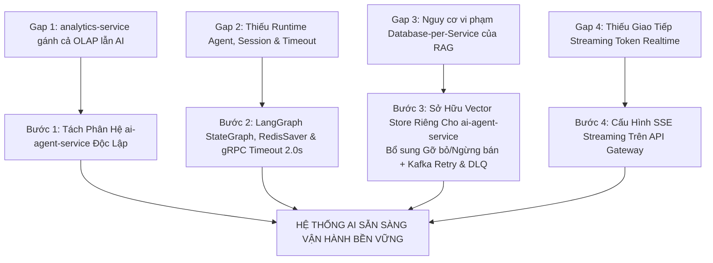
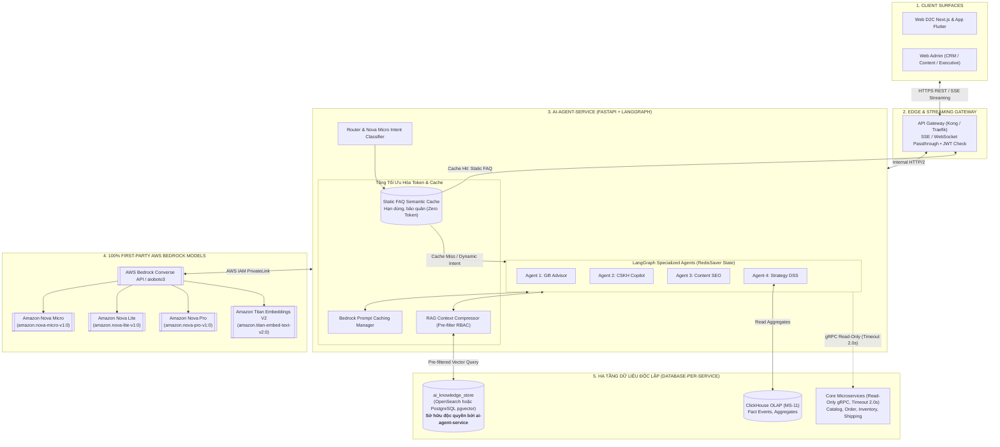
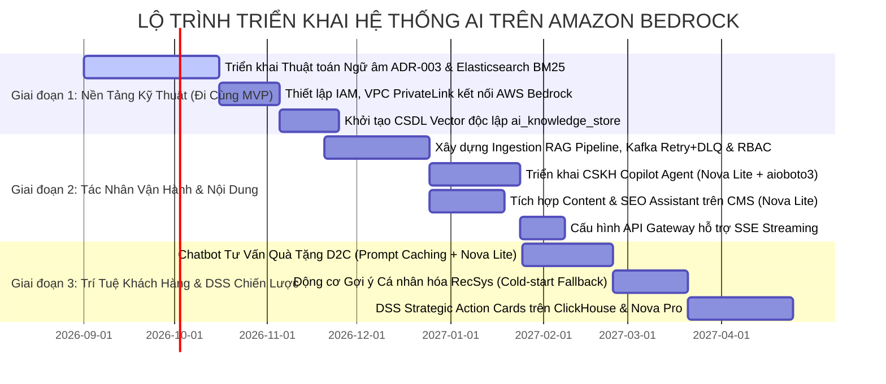

# TỔNG KẾT YÊU CẦU, GIẢI PHÁP KHẮC PHỤC ARCHITECTURE GAPS & ĐỀ XUẤT KIẾN TRÚC AI AGENT 100% AWS NATIVE (AMAZON NOVA & TITAN)
## HỆ SINH THÁI THƯƠNG MẠI ĐIỆN TỬ ĐA KÊNH & HỖ TRỢ QUYẾT ĐỊNH NÔNG ĐẶC SẢN OCOP HUẾ (MÈ XỬNG O MẠ)

---

| **Phiên bản** | **Ngày cập nhật** | **Tình trạng** | **Phạm vi kỹ thuật** |
| :---: | :---: | :---: | :--- |
| **2.3.1** | 25/09/2026 | Chuẩn hóa Cú pháp HNSW Iterative Scan (`pgvector >= 0.8.0`) | Đính chính `hnsw.iterative_scan`, thêm trần an toàn `hnsw.max_scan_tuples = 20000`, tối ưu Connection Pooling & Partial Index |

---

## MỤC LỤC

1. [TỔNG QUAN & BỐI CẢNH DỰ ÁN](#1-tổng-quan--bối-cảnh-dự-án)
2. [TỔNG HỢP TOÀN BỘ YÊU CẦU AI TỪ DOCS/01 VÀ DOCS/02](#2-tổng-hợp-toàn-bộ-yêu-cầu-ai-từ-docs01-và-docs02)
   - 2.1. Ma trận ánh xạ truy xuất nguồn gốc (Traceability Matrix)
   - 2.2. Chi tiết 6 nhóm chức năng AI cốt lõi
   - 2.3. Năm nguyên tắc an toàn bất biến đã chuẩn hóa (Non-negotiable Invariants)
3. [KẾ HOẠCH TỪNG BƯỚC KHẮC PHỤC CÁC ARCHITECTURE GAPS](#3-kế-hoạch-từng-bước-khắc-phục-các-architecture-gaps)
   - 3.1. Gap 1: Phân định tải phân tích OLAP và Tác nhân AI thời gian thực
   - 3.2. Gap 2: Runtime điều phối Agent, LangGraph RedisSaver & gRPC Timeout chuẩn 2.0s
   - 3.3. Gap 3: Bảo toàn Database-per-Service, Vòng đời Gỡ bỏ & Kafka Retry + DLQ
   - 3.4. Gap 4: Giao tiếp thời gian thực (Streaming SSE) qua API Gateway
4. [CHUẨN HÓA TECH STACK 100% FIRST-PARTY AWS MODELS (AMAZON NOVA & TITAN)](#4-chuẩn-hóa-tech-stack-100-first-party-aws-models-amazon-nova--titan)
   - 4.1. Lựa chọn Models Amazon Nova & Đánh giá thế hệ Amazon Nova 2
   - 4.2. Bảng định danh & Phân bổ Models Amazon Nova / Titan trên Bedrock
   - 4.3. Kiến trúc phân tầng 4 lớp chuẩn hóa AWS Bedrock (Tuân thủ Database-per-Service)
5. [CHIẾN LƯỢC & TECH SKILLS TỐI ƯU HÓA TOKEN VÀ TRÁNH CODING GOTCHAS](#5-chiến-lược--tech-skills-tối-ưu-hóa-token-và-tránh-coding-gotchas)
   - 5.1. Kỹ thuật 1: Model Cascading & Dynamic Routing (Định tuyến phân tầng siêu tiết kiệm)
   - 5.2. Kỹ thuật 2: Prompt Caching trên AWS Bedrock (Tiết kiệm đến 90% chi phí Input)
   - 5.3. Kỹ thuật 3: Semantic Caching chuẩn xác — Phân định ranh giới Static FAQ vs Dynamic Tool-Calling
   - 5.4. Kỹ thuật 4: Pre-Filter RBAC & HNSW Iterative Index Scan (`hnsw.iterative_scan` & `hnsw.max_scan_tuples`)
   - 5.5. Kỹ thuật 5: Output Token Budgeting & Pydantic Tool-Use Constrained Generation
   - 5.6. Kỹ thuật 6: PII Masking & Data Abbreviation (Rút gọn tối đa payload)
   - 5.7. Kỹ thuật 7: Streaming Token Interruption & Quản lý aioboto3 Client qua FastAPI Lifespan
6. [THIẾT KẾ 4 TÁC NHÂN AI CHUYÊN BIỆT TRÊN BEDROCK CONVERSE API](#6-thiết-kế-4-tác-nhân-ai-chuyên-biệt-trên-bedrock-converse-api)
   - 6.1. Agent 1: O Mạ Gift & Shopping Advisor (Customer-Facing Chatbot)
   - 6.2. Agent 2: CSKH Support Copilot Agent (Internal Customer Service)
   - 6.3. Agent 3: Hue Culture & SEO Content Assistant (Marketing CMS)
   - 6.4. Agent 4: Executive DSS Strategic Recommendation Agent (Business Intelligence)
7. [LỘ TRÌNH TRIỂN KHAI 3 GIAI ĐOẠN & TÍCH HỢP CI/CD CHO PYTHON](#7-lộ-trình-triển-khai-3-giai-đoạn--tích-hợp-cicd-cho-python)
8. [BỘ CHỈ SỐ ĐO LƯỜNG HIỆU QUẢ KỸ THUẬT & MÔ HÌNH HÓA CHI PHÍ THẬT](#8-bộ-chỉ-số-đo-lường-hiệu-quả-kỹ-thuật--mô-hình-hóa-chi-phí-thật)

---

## 1. TỔNG QUAN & BỐI CẢNH DỰ ÁN

Dự án **Hệ sinh thái Thương mại điện tử Đa kênh & Hệ thống Phân tích Hỗ trợ Quyết định Chiến lược cho Nông Đặc sản OCOP Huế (Mè Xửng O Mạ)** là nền tảng số hóa thương mại toàn diện gồm:
- **Kênh bán lẻ đa diện:** Web D2C (Next.js), Mobile App (Flutter), POS Quầy Xưởng Offline (React Offline-first Tablet), Sàn TMĐT Shopee/TikTok Shop qua Anti-Corruption Layer (ACL).
- **Chuỗi cung ứng & Kho vận:** Quản lý kho theo Lô/Hạn sử dụng (FEFO), Trạm đóng gói ghi hình Packing Video bảo mật tem Seal, tích hợp đơn vị vận chuyển 3PL (GHN, ViettelPost) và Cổng số hóa truy xuất nguồn gốc OCOP QR Story.
- **Kiến trúc hạ tầng cốt lõi:** 18 Microservices (Golang/Node.js), Event-Driven Architecture thông qua **Apache Kafka**, phân tách 3 mặt phẳng độc lập (*Business Plane, Audit Plane với Hash Chain HMAC-SHA256, Observability Plane với OpenTelemetry*), CSDL đa mô hình (PostgreSQL, ClickHouse OLAP, MongoDB, Redis, Elasticsearch).

Hạ tầng đám mây của dự án đã sẵn sàng với hệ sinh thái **AWS** (AWS S3 Object Storage cho video seal và tài liệu WORM). Việc chuẩn hóa toàn bộ các dịch vụ AI về **100% First-Party Models của AWS (Amazon Nova & Amazon Titan) trên AWS Bedrock** đem lại 3 lợi thế chiến lược cốt tử:
1. **Kiểm soát ngân sách tối đa:** Dòng mô hình **Amazon Nova** có mức giá rẻ hơn từ 4 đến 15 lần so với các mô hình bên thứ ba (Anthropic Claude, OpenAI) trên cùng phân khúc năng lực.
2. **Bảo mật & Quyền sở hữu nội bộ (VPC PrivateLink & IAM):** Dữ liệu doanh nghiệp và khách hàng lưu chuyển hoàn toàn trong ranh giới mạng riêng của AWS, không chia sẻ cho bên thứ ba, đáp ứng nghiêm ngặt `NFR-08`.
3. **Hiệu năng mạng nội bộ:** Kết nối mạng nội bộ giữa các container dịch vụ và Bedrock VPC Endpoint đạt độ trễ truyền gói tin $P99 \le 50\text{ms}$ *(chú thích: đây là Internal AWS Network Hop giữa các container trong cùng AWS Region, hoàn toàn tách biệt với Thời gian sinh ký tự đầu tiên TTFT $\le 450\text{ms}$ và Tổng thời gian xử lý toàn bộ vòng lặp Agent)*.

---

## 2. TỔNG HỢP TOÀN BỘ YÊU CẦU AI TỪ DOCS/01 VÀ DOCS/02

### 2.1. Ma trận ánh xạ truy xuất nguồn gốc (Traceability Matrix)

| Mã Yêu Cầu | Mã User Story | Epic Nguồn | Use Case Phụ Trách | Phân Loại & Tác Nhân Sử Dụng | Phân Kỳ Phát Hành |
| :--- | :--- | :--- | :--- | :--- | :---: |
| **FR-31** | `US-AI-01` | EPIC 03: Product Discovery | `UC-AI-01` | **Product Search Assistant:** Khách hàng (ACT-01, ACT-02) chat hỏi đáp tự nhiên tìm kẹo, chọn quà biếu | Phase 3 (Could) |
| **FR-31** | `US-AI-04` | EPIC 03 / EPIC 25 | `UC-AI-02` | **Product Recommendation:** Khách hàng nhận gợi ý sản phẩm cá nhân hóa theo hành vi | Phase 3 (Could) |
| **FR-15** | `US-AI-02` | EPIC 16: Customer Service | `UC-CS-01, 02` | **Customer Support Copilot:** Nhân viên CSKH (ACT-11) nhận tóm tắt ticket, gợi ý Draft Reply | Sau Phase 2 (Could) |
| **FR-15** | `US-AI-06` | EPIC 16: Customer Service | `UC-CS-02` | **Internal Knowledge Assistant:** Nhân viên nội bộ tra cứu tri thức nghiệp vụ, chính sách, OCOP | Sau Phase 2 (Could) |
| **FR-21, 22**| `US-AI-03` | EPIC 20: Content & SEO | `UC-CONTENT-01` | **Content & SEO Assistant:** Content Manager (ACT-13) sinh tiêu đề, dàn ý bài viết Cố Đô, SEO | Phase 2 (Could) |
| **FR-25, 26**| `US-DSS-02` | EPIC 25: Analytics & DSS | `UC-DSS-02` | **RFM Segmentation Engine:** Marketing/Lãnh đạo phân cụm khách hàng, tính điểm churn risk | Phase 3 (Could) |
| **FR-25, 26**| `US-DSS-03` | EPIC 25: Analytics & DSS | `UC-DSS-02` | **Churn Risk Prediction:** Dự đoán nguy cơ khách hàng không mua lại để kích hoạt giữ chân | Phase 3 (Could) |
| **FR-25, 26**| `US-DSS-05, 06`| EPIC 25: Analytics & DSS | `UC-DSS-03` | **Demand Forecasting & Velocity:** Dự báo nhu cầu tiêu thụ mùa Tết, cảnh báo cạn kho | Phase 3 (Could) |
| **FR-25, 26**| `US-DSS-07` | EPIC 25: Analytics & DSS | `UC-DSS-03` | **Expiry Risk Analytics:** Dự báo rủi ro cận hạn sử dụng theo Lô FEFO (< 45 ngày) | Phase 3 (Could) |
| **FR-25, 26**| `US-DSS-08` | EPIC 25: Analytics & DSS | `UC-DSS-04` | **Market Basket Association:** Khai phá luật kết hợp sản phẩm mua kèm (Confidence $\ge 60\%$) | Phase 3 (Could) |
| **FR-25, 26**| `US-DSS-10` | EPIC 25: Analytics & DSS | `UC-DSS-02` | **Strategic Recommendation:** Ban Giám đốc nhận thẻ khuyến nghị chiến lược (Action Cards) | Phase 3 (Could) |
| **NFR-03** | `ADR-003` | `02_architecture` | `UC-DISC-02` | **Vietnamese Phonetic NLP:** So khớp mờ địa chỉ và kẹo theo ngữ âm Huế (i/y, dấu thanh) | Đã triển khai |

---

### 2.2. Chi tiết 6 nhóm chức năng AI cốt lõi

1. **Trợ lý Khách Hàng (Customer Shopping & Gift Advisor Chatbot - `US-AI-01`):** Tư vấn chọn mè xửng, giỏ quà Tết theo ngân sách, đối tượng tặng và khẩu vị; hỗ trợ ngôn ngữ tự nhiên tiếng Việt; fallback bộ lọc khi ngoài phạm vi; loại trừ sản phẩm đã ngừng bán.
2. **Động cơ Gợi ý Cá nhân hóa (Product Recommendation - `US-AI-04`):** Đề xuất sản phẩm dựa trên hành vi duyệt và lịch sử mua; giải quyết Cold-start bằng danh sách Best-seller và OCOP 4 sao tiêu biểu.
3. **Trợ lý CSKH Copilot (`US-AI-02`):** Tóm tắt ticket khiếu nại (kẹo vỡ, chậm giao), tra cứu trạng thái đơn/vận chuyển/video đóng gói có seal niêm phong, soạn nháp phản hồi (*Draft Reply*) có trích dẫn nguồn.
4. **Trợ lý Tri thức Nội bộ RAG (`US-AI-06`):** Tra cứu quy chuẩn ATTP HACCP, hồ sơ OCOP, chính sách đổi trả 7 ngày; phân quyền truy cập tài liệu theo vai trò (RBAC); cấm ảo giác.
5. **Trợ lý Nội dung & SEO (`US-AI-03`):** Sinh dàn ý bài viết ẩm thực Cố Đô, tối ưu hóa tiêu đề, tự động sinh thẻ Schema JSON-LD; lưu bản nháp `DRAFT` chờ người duyệt.
6. **Hệ DSS & Phân Tích Chiến Lược (`EPIC 25`):** Phân cụm RFM, dự báo nhu cầu vụ Tết, phân tích Market Basket tạo Combo tăng AOV, cảnh báo Lô cận hạn (FEFO < 45 ngày) và sinh Thẻ Khuyến nghị Chiến lược (*Action Cards*) cho Ban Giám đốc.

---

### 2.3. Năm nguyên tắc an toàn bất biến đã chuẩn hóa (Non-negotiable Invariants)

```text
┌─────────────────────────────────────────────────────────────────────────────────────────────────┐
│                      5 NGUYÊN TẮC BẤT BIẾN CỦA HỆ THỐNG AI MÈ XỬNG O MẠ                        │
├─────────────────────────────────────────────────────────────────────────────────────────────────┤
│ 1. HUMAN-IN-THE-LOOP: AI chỉ đóng vai trò Trợ lý đề xuất. Con người duyệt mọi quyết định.     │
│ 2. KIỂM SOÁT GHI DỮ LIỆU SẢN XUẤT (NO UNREVIEWED LIVE WRITES): AI Agent không được ghi trực    │
│    tiếp vào dữ liệu production/live (giá bán, tồn kho, đơn hàng, trạng thái hoàn tiền). AI chỉ   │
│    được phép tạo mới bản ghi ở trạng thái nháp (DRAFT / PENDING_REVIEW) trên phân hệ nội dung    │
│    (content-service) để con người phê duyệt; tuyệt đối CẤM tự ý cập nhật (UPDATE) dữ liệu đã    │
│    công khai hoặc xóa (DELETE) bất kỳ dữ liệu nào.                                              │
│ 3. PII MINIMIZATION: Dữ liệu khách hàng phải được Masking trước khi gửi đến Bedrock.            │
│ 4. NON-BLOCKING RESILIENCE: Lỗi Bedrock không được làm gián đoạn luồng mua sắm hoặc CSKH.     │
│ 5. CITATION & GROUNDING: Mọi câu trả lời tri thức phải đính kèm căn cứ tài liệu nguồn.         │
└─────────────────────────────────────────────────────────────────────────────────────────────────┘
```

---

## 3. KẾ HOẠCH TỪNG BƯỚC KHẮC PHỤC CÁC ARCHITECTURE GAPS

Dưới đây là kế hoạch 4 bước kỹ thuật chuẩn xác để giải quyết triệt để các khoảng trống kiến trúc mà vẫn bảo toàn nguyên tắc thiết kế cốt lõi của toàn hệ thống:



### 3.1. Gap 1: Phân định tải phân tích OLAP và Tác nhân AI thời gian thực

- **Vấn đề:** Hiện tại `MS-11: analytics-service` đang đảm nhiệm Bounded Context `BC-11: Analytics, DSS & AI` với CSDL chính là ClickHouse. ClickHouse tối ưu cho tính toán quét cột (OLAP scan), không phù hợp để chạy runtime điều phối hội thoại LLM có độ trễ mili-giây.
- **Các bước khắc phục cụ thể:**
  1. **Tách biệt ranh giới trách nhiệm (Separation of Concerns):**
     - Giữ nguyên `MS-11: analytics-service` chuyên trách: OLAP ClickHouse, chạy Batch Jobs đêm (tính RFM, chạy thuật toán Prophet dự báo nhu cầu vụ Tết, chạy FP-Growth khai phá giỏ hàng).
     - Thành lập phân hệ **`ai-agent-service`** (Service Container viết bằng Python / FastAPI) chuyên trách: Điều phối Agent, gọi Bedrock API, quản lý RAG và Stream token.
  2. **Giao tiếp nội bộ hướng sự kiện:**
     - `ai-agent-service` đọc kết quả phân tích từ ClickHouse qua REST/gRPC nội bộ để sinh *Strategic Action Cards* mà không can thiệp vào tiến trình ghi OLAP.

---

### 3.2. Gap 2: Runtime điều phối Agent, LangGraph RedisSaver & gRPC Timeout chuẩn 2.0s

- **Vấn đề:** Chưa có engine quản lý vòng lặp suy luận (Reasoning loop), quản lý bộ nhớ hội thoại đồng bộ, và timeout gRPC chưa thống nhất với chuẩn toàn hệ thống.
- **Các bước khắc phục cụ thể:**
  1. **Áp dụng LangGraph + AWS Bedrock Converse API:**
     - Sử dụng `langgraph` xây dựng `StateGraph` cho từng Agent: Phân loại ý định $\rightarrow$ Gọi Tool đọc dữ liệu $\rightarrow$ Kiểm duyệt an toàn $\rightarrow$ Trả lời.
  2. **Quản lý trạng thái phiên bằng LangGraph RedisSaver:**
     - Không tự viết logic quản lý session rời rạc song song gây lệch state. Sử dụng checkpointer chính thức:
       ```python
       from langgraph.checkpoint.redis import RedisSaver
       checkpointer = RedisSaver(redis_client)
       app = workflow.compile(checkpointer=checkpointer)
       ```
  3. **Đồng bộ Timeout gRPC chuẩn 2.0s:**
     - Mọi Tool gọi sang các microservices khác (`catalog-service`, `inventory-service`, `fulfillment-service`, `shipping-service`) đều qua **gRPC Client (Read-Only)** với Timeout chuẩn **`2.0s`** (Circuit Breaker: 50% lỗi / 10s $\rightarrow$ OPEN, max 1 retry), thống nhất 100% với chuẩn kiến trúc toàn hệ thống trong [`high_level_design.md`](./high_level_design.md) và [`service_boundary.md`](./service_boundary.md).

---

### 3.3. Gap 3: Bảo toàn Database-per-Service, Vòng đời Gỡ bỏ & Kafka Retry + DLQ

- **Vấn đề cốt lõi:** Ý tưởng cũ *"Tận dụng cụm Elasticsearch 8 có sẵn của catalog-service để tạo index tri thức"* **vi phạm trực tiếp nguyên tắc Database-per-Service** — phá vỡ ranh giới Bounded Context và coupling chặt hạ tầng giữa hai service. Đồng thời thiếu cơ chế xử lý khi sản phẩm ngừng bán hoặc lỗi ingestion.
- **Giải pháp chuẩn hóa bảo toàn kiến trúc:**
  1. **Sở hữu độc quyền CSDL Vector (Strict Database-per-Service):**
     - `ai-agent-service` **sở hữu độc lập kho dữ liệu tri thức và véc-tơ riêng của mình** (`ai_knowledge_store`).
     - Tùy chọn triển khai:
       - *Phương án A (Khuyến nghị theo AWS native):* Cụm **OpenSearch Service độc lập** do `ai-agent-service` độc quyền quản lý credential.
       - *Phương án B (Tận dụng PostgreSQL hiện có của dự án):* Khởi tạo CSDL riêng `ai_db` trên PostgreSQL 16 của `ai-agent-service` và kích hoạt extension **`pgvector`** (HNSW index) để lưu trữ document chunks và embeddings.
  2. **Xử lý toàn diện vòng đời dữ liệu (Chiều Thêm mới & Chiều Gỡ bỏ):**
     - `ai-agent-service` tiêu thụ 4 Domain Events chính từ Kafka bus:
       - `catalog.product.published`: Nạp hoặc cập nhật vector sản phẩm vào kho tri thức.
       - `knowledge.document.updated`: Cắt đoạn (chunking), vector hóa tài liệu/chính sách OCOP mới.
       - **`catalog.product.discontinued` / `catalog.product.suspended`:** Đánh dấu `is_active = FALSE` hoặc xóa chunk tương ứng để Agent 1 (Gift Advisor) **ngừng ngay việc tư vấn sản phẩm đã hết mùa/ngừng kinh doanh**.
       - **`knowledge.document.deleted` / `knowledge.document.archived`:** Xóa bỏ hoặc gắn nhãn hết hiệu lực cho văn bản chính sách cũ, đồng thời xóa cache tương ứng trong Redis Semantic Cache.
  3. **Áp dụng chuẩn Retry Topic lũy tiến + DLQ cho Ingestion Worker:**
     - Khi Ingestion Worker gọi Bedrock **Titan Embeddings V2** gặp sự cố tạm thời (Rate limit HTTP 429, Network timeout):
       - Không được drop event khiến sản phẩm/chính sách bị mất dấu vĩnh viễn trong kho vector.
       - Tuân thủ đúng chuẩn Retry Topic đã quy định tại [`service_boundary.md`](./service_boundary.md):
         - `knowledge.ingestion.retry.10s` $\rightarrow$ `knowledge.ingestion.retry.30s` $\rightarrow$ `knowledge.ingestion.retry.2m` $\rightarrow$ `knowledge.ingestion.retry.10m`.
         - Sau 5 lần retry thất bại $\rightarrow$ Đẩy vào **`knowledge.ingestion.dlq`** (Dead Letter Queue) và kích hoạt cảnh báo Prometheus để DevOps can thiệp qua quy trình Re-drive an toàn.

---

### 3.4. Gap 4: Giao tiếp thời gian thực (Streaming SSE) qua API Gateway

- **Vấn đề:** API Gateway hiện tại cấu hình cho REST Request-Response ngắn, chưa hỗ trợ đẩy luồng ký tự (Typewriter effect) cho Chatbot.
- **Các bước khắc phục cụ thể:**
  1. **Cấu hình API Gateway (Kong / Traefik / Nginx):**
     - Bổ sung cấu hình định tuyến cho path `/api/v1/ai/chat/stream`:
       - `proxy_buffering off;`
       - `proxy_cache off;`
       - `proxy_read_timeout 300s;`
       - Header: `Content-Type: text/event-stream; Cache-Control: no-cache; Connection: keep-alive`.
  2. **Triển khai Client SDK:**
     - Phía Frontend Next.js (D2C) và React (Admin): Sử dụng `EventSource` hoặc `fetch` với `ReadableStreamDefaultReader` để parse event dạng JSON chunk và render mượt mà.

---

## 4. CHUẨN HÓA TECH STACK 100% FIRST-PARTY AWS MODELS (AMAZON NOVA & TITAN)

Nhằm tối ưu hóa triệt để ngân sách và bảo mật tuyệt đối, hệ thống sử dụng **100% Foundation Models do chính AWS làm chủ sở hữu (First-Party AWS Models)** trên nền tảng AWS Bedrock.

### 4.1. Lựa chọn Models Amazon Nova & Đánh giá thế hệ Amazon Nova 2

1. **Chi phí rẻ vượt trội:** Dòng **Amazon Nova** có mức chi phí cạnh tranh nhất trên thị trường hiện nay (rẻ hơn từ 4 đến 15 lần so với Anthropic Claude hoặc OpenAI GPT-4o-mini).
2. **Tích hợp sâu hạ tầng AWS:** Hỗ trợ native qua AWS Bedrock Converse API, tương thích hoàn hảo với IAM Roles, VPC Endpoints, AWS CloudWatch và AWS S3.
3. **Đánh giá chuyển tiếp thế hệ Amazon Nova 2:**
   - Phiên bản Nova 1.0 hiện tại hoàn toàn đáp ứng xuất sắc về mặt chi phí và chất lượng cho các use case của Mè Xửng O Mạ.
   - Khi khối lượng tài liệu kiểm nghiệm OCOP dày đặc hoặc các phiên hội thoại của khách hàng kéo dài nhiều tháng, hệ thống sẵn sàng chuyển tiếp sang **Amazon Nova 2 Lite / Nova 2 Pro** với cửa sổ ngữ cảnh mở rộng lên tới **1M tokens** với mức tăng chi phí không đáng kể.

---

### 4.2. Bảng định danh & Phân bổ Models Amazon Nova / Titan trên Bedrock

```text
┌───────────────────────────────────┬───────────────────────────────────┬──────────────────────────────────────────────────────────┐
│ Nhóm Tác Vụ Nghiệp Vụ             │ AWS Model ID Chính Thức           │ Đơn Giá AWS (USD / 1M Tokens) & Đặc Tính                 │
├───────────────────────────────────┼───────────────────────────────────┼──────────────────────────────────────────────────────────┤
│ Router, PII Masking, Intent       │ amazon.nova-micro-v1:0            │ Input: $0.035  |  Output: $0.14  (Siêu rẻ, siêu nhanh)   │
├───────────────────────────────────┼───────────────────────────────────┼──────────────────────────────────────────────────────────┤
│ Chatbot D2C, CSKH Copilot, SEO    │ amazon.nova-lite-v1:0             │ Input: $0.060  |  Output: $0.24  (Rẻ hơn Haiku 13 lần)   │
├───────────────────────────────────┼───────────────────────────────────┼──────────────────────────────────────────────────────────┤
│ DSS Chiến Lược, Phân Tích Lô      │ amazon.nova-pro-v1:0              │ Input: $0.800  |  Output: $3.20  (Lập luận logic sâu)    │
├───────────────────────────────────┼───────────────────────────────────┼──────────────────────────────────────────────────────────┤
│ Vector Embeddings (Search & RAG)  │ amazon.titan-embed-text-v2:0      │ $0.020 / 1M tokens (Hỗ trợ 256/512/1024 dimensions)     │
└───────────────────────────────────┴───────────────────────────────────┴──────────────────────────────────────────────────────────┘
```

#### Ma trận phân bổ Model cho từng tác nhân cụ thể:

| Tác Nhân AI | Model Mặc Định | Model Nâng Cao (Khi Escalate) | Cấu Hình Tham Số |
| :--- | :--- | :--- | :--- |
| **Phân loại ý định & Masking** | **Amazon Nova Micro** | — | `temperature: 0.0, max_tokens: 100` |
| **Agent 1: Gift & Shopping Advisor** | **Amazon Nova Lite** | Amazon Nova Pro (nếu giỏ quà phức tạp) | `temperature: 0.3, max_tokens: 400` |
| **Agent 2: CSKH Support Copilot** | **Amazon Nova Lite** | Amazon Nova Pro (khiếu nại tranh chấp lớn) | `temperature: 0.2, max_tokens: 350` |
| **Agent 3: Hue Culture & SEO** | **Amazon Nova Lite** | Amazon Nova Pro (viết bài dài chuyên sâu)| `temperature: 0.7, max_tokens: 800` |
| **Agent 4: Strategy DSS Recommendation**| **Amazon Nova Pro** | — | `temperature: 0.1, max_tokens: 1000` |
| **Vector Embedding Pipeline** | **Amazon Titan Embeddings V2** | — | `dimensions: 512, normalize: true` |

---

### 4.3. Kiến trúc phân tầng 4 lớp chuẩn hóa AWS Bedrock (Tuân thủ Database-per-Service)



---

## 5. CHIẾN LƯỢC & TECH SKILLS TỐI ƯU HÓA TOKEN VÀ TRÁNH CODING GOTCHAS

### 5.1. Kỹ thuật 1: Model Cascading & Dynamic Routing (Định tuyến phân tầng siêu tiết kiệm)

- **Nguyên lý:** Tuyệt đối không dùng mô hình đắt tiền (Nova Pro) cho các câu hỏi đơn giản.
- **Thực thi:**
  - Mọi câu hỏi người dùng trước tiên đi qua **Amazon Nova Micro** (chi phí chỉ $\$0.035$ / 1M token):
    - Chào hỏi thông thường (*"shop ở đâu?", "giờ mở cửa?"*) $\rightarrow$ Nova Micro trả lời ngay lập tức.
    - Tìm kiếm sản phẩm, tư vấn quà tặng thông thường $\rightarrow$ Chuyển sang **Amazon Nova Lite** ($\$0.060$/1M input).
    - Chỉ khi có yêu cầu lập luận DSS phức tạp hoặc xử lý khiếu nại tranh chấp lớn $\rightarrow$ Mới chuyển sang **Amazon Nova Pro**.
- **Hiệu quả:** Cắt giảm tới **$70\%$ tổng chi phí token** của toàn hệ thống.

---

### 5.2. Kỹ thuật 2: Prompt Caching trên AWS Bedrock (Tiết kiệm đến 90% chi phí Input)

- **Nguyên lý:** AWS Bedrock hỗ trợ tính năng **Prompt Caching**. Khi một đoạn prompt có độ dài $\ge 1024$ tokens được lặp lại (System Prompt, danh mục sản phẩm, bộ quy chế đổi trả), các request tiếp theo đọc từ Cache chỉ tốn **$10\%$ giá input token thông thường** và giảm $85\%$ độ trễ.
- **Thực thi qua aioboto3 Converse API với Amazon Nova:**

```python
# Cấu trúc áp dụng Prompt Caching trong ai-agent-service với Amazon Nova
system_prompt_block = [
    {
        "text": SYSTEM_PROMPT_ME_XUNG_O_MA,  # Quy tắc thương hiệu và catalog cơ bản (~2,000 tokens)
        "cachePoint": {"type": "default"}     # Bật điểm neo Cache trên Bedrock
    }
]

response = await bedrock_client.converse(
    modelId="amazon.nova-lite-v1:0",
    messages=conversation_messages,
    system=system_prompt_block,
    inferenceConfig={"temperature": 0.2, "maxTokens": 400}
)
```

---

### 5.3. Kỹ thuật 3: Semantic Caching chuẩn xác — Phân định ranh giới Static FAQ vs Dynamic Tool-Calling

- **Tránh Gotcha tính năng hạ tầng:** Redis 7 OSS thuần của hệ thống không có RediSearch / HNSW Vector search. Để tránh phân mảnh hạ tầng phải chạy thêm Redis Stack, Semantic Cache được lưu và truy vấn véc-tơ trực tiếp trên chính **CSDL Vector độc lập của `ai-agent-service`** (`pgvector` hoặc OpenSearch), còn Redis 7 OSS chỉ làm bộ nhớ đệm Key-Value cho Exact Match Cache.
- **Ranh giới an toàn nghiệp vụ thép (Ngăn chặn trả sai giá/tồn kho):**
  - **CHỈ ÁP DỤNG SEMANTIC CACHE CHO:** **Static FAQ thuần túy** (Hạn sử dụng mè xửng, quy chuẩn bảo quản chống chảy dầu mè, sự khác nhau giữa kẹo dẻo và kẹo giòn, lịch sử làng nghề Kim Long/Nam Phổ, địa chỉ xưởng Hương Thủy).
  - **TUYỆT ĐỐI CẤM DÙNG SEMANTIC CACHE CHO:** Các câu hỏi phụ thuộc trạng thái cá nhân, động hoặc giỏ hàng cụ thể:
    - *Phí vận chuyển:* Phụ thuộc cân nặng thực tế, địa chỉ cấp xã/phường, phụ phí hàng dễ vỡ `is_fragile` $\rightarrow$ **Bắt buộc gọi tool gRPC `ShippingService.CalculateShippingFee`**.
    - *Tồn kho khả dụng:* Phụ thuộc tồn thực tế $\rightarrow$ **Bắt buộc gọi tool gRPC `InventoryService.CheckStock`**.
    - *Trạng thái đơn hàng:* **Bắt buộc gọi tool gRPC `OrderService.GetOrderDetail`**.

---

### 5.4. Kỹ thuật 4: Pre-Filter RBAC & HNSW Iterative Index Scan (`hnsw.iterative_scan` & `hnsw.max_scan_tuples`)

- **Lỗ hổng bảo mật nếu Post-filter:** Nếu truy vấn lấy top 5 chunks về rồi mới dùng code Python `if user.role in chunk.allowed_roles` để loại bỏ, dữ liệu nhạy cảm đã bị nạp vào bộ nhớ tiến trình, đồng thời có thể rò rỉ vào context của LLM hoặc bị prompt injection khai thác.
- **Nguyên tắc bắt buộc (Pre-Filter at Database Engine):**
  - Mệnh đề lọc quyền truy cập và hạn hiệu lực của tài liệu bắt buộc phải được đẩy thẳng vào câu lệnh truy vấn CSDL:
  ```sql
  -- Truy vấn chuẩn với pgvector trong ai_db của ai-agent-service
  SELECT chunk_id, content, metadata
  FROM knowledge_chunks
  WHERE is_active = TRUE
    AND allowed_roles && ARRAY['CSKH_STAFF', 'PUBLIC']::varchar[]
    AND effective_to >= CURRENT_DATE
  ORDER BY embedding <=> :query_embedding
  LIMIT 3;
  ```

#### Chi tiết kỹ thuật & Đính chính tên tham số chuẩn (`pgvector >= 0.8.0`):
- **Gotcha hiệu năng của HNSW Filtering:** Khi điều kiện `WHERE` có độ chọn lọc cao (ví dụ: chỉ tài liệu mật dành riêng cho `DIRECTOR`, chiếm tỷ lệ rất nhỏ trong CSDL), thuật toán duyệt đồ thị xấp xỉ của HNSW index mặc định có thể dừng sớm trước khi tìm đủ `LIMIT K` thỏa mãn, hoặc query planner sẽ bỏ qua chỉ mục HNSW và fallback về **Sequential Scan** (quét toàn bảng), gây nghẽn CPU và bùng nổ latency.
- **Đính chính cú pháp chuẩn:**
  - Trong `pgvector >= 0.8.0`, namespace của các tham số cấu hình được **gắn theo loại index** (`hnsw.*` hoặc `ivfflat.*`), **không gắn theo tên extension**.
  - Việc gọi `SET pgvector.iterative_scan` sẽ sinh lỗi `ERROR: unrecognized configuration parameter "pgvector.iterative_scan"`.
  - Cú pháp chuẩn xác:
  ```sql
  -- 1. Bật chế độ quét lặp HNSW index với thứ tự khoảng cách nới lỏng (tối ưu cho Semantic Search)
  SET hnsw.iterative_scan = relaxed_order;

  -- 2. Đặt trần an toàn bắt buộc để chống cạn kiệt tài nguyên (Resource Guardrail)
  SET hnsw.max_scan_tuples = 20000;
  ```

#### Ý nghĩa & Nguyên lý vận hành của bộ đôi tham số:
1. **`hnsw.iterative_scan = relaxed_order`**:
   - Cho phép PostgreSQL tiếp tục duyệt đồ thị HNSW theo từng bước lặp cho đến khi tìm đủ $K$ kết quả thỏa mãn điều kiện `WHERE`.
   - Chế độ `relaxed_order` trả về các vector theo thứ tự khoảng cách xấp xỉ (thay vì nghiêm ngặt tuyệt đối như `strict_order`), giúp giảm thiểu số lượng đỉnh cần duyệt trên đồ thị, duy trì latency $P95 \le 15\text{ms}$.
2. **`hnsw.max_scan_tuples = 20000` (Giới hạn trần an toàn sống còn)**:
   - Nếu điều kiện `allowed_roles` quá chọn lọc (ví dụ chỉ có 2 tài liệu mật trong toàn bộ 100,000 chunks), thuật toán iterative scan có thể phải duyệt qua gần như toàn bộ đồ thị HNSW để cố tìm đủ `LIMIT 3`, khiến CPU và Disk I/O tăng vọt.
   - Tham số `hnsw.max_scan_tuples = 20000` đóng vai trò **Circuit Breaker**: Giới hạn tối đa 20.000 tuples được quét. Nếu chạm ngưỡng này, query sẽ dừng lại an toàn và trả về những kết quả tốt nhất đã tìm thấy, bảo vệ CSDL khỏi tình trạng treo hoặc spike tài nguyên.

#### Bổ sung các kỹ thuật tối ưu nâng cao trong Production:
1. **Tối ưu hóa cho Connection Pooling (FastAPI + AsyncPG / PgBouncer):**
   - Lệnh `SET ...` nếu chạy thủ công trong connection có thể bị mất hoặc gây rò rỉ trạng thái khi dùng connection pooler (PgBouncer ở chế độ transaction pooling).
   - **Giải pháp cấp Database/Role (Khuyến nghị triển khai):**
     ```sql
     -- Cấu hình mặc định vĩnh viễn cho user ứng dụng ai-agent-service trong ai_db:
     ALTER ROLE ai_agent_user SET hnsw.iterative_scan = 'relaxed_order';
     ALTER ROLE ai_agent_user SET hnsw.max_scan_tuples = 20000;
     ALTER ROLE ai_agent_user SET hnsw.ef_search = 40;
     ```
   - **Cấu hình bổ trợ trong mã nguồn SQLAlchemy AsyncEngine:**
     ```python
     # services/ai-agent-service/internal/database.py
     from sqlalchemy.ext.asyncio import create_async_engine

     async_engine = create_async_engine(
         settings.AI_DATABASE_URL,
         connect_args={
             "server_settings": {
                 "hnsw.iterative_scan": "relaxed_order",
                 "hnsw.max_scan_tuples": "20000",
                 "hnsw.ef_search": "40",
             }
         },
         pool_size=20,
         max_overflow=10,
     )
     ```
2. **Partial HNSW Index loại trừ tài liệu ngừng hoạt động (`is_active = TRUE`):**
   - Để ngăn `hnsw.max_scan_tuples` lãng phí ngân sách quét vào các chunk của sản phẩm đã ngừng bán (`catalog.product.discontinued`) hoặc tài liệu bị xóa mềm (`knowledge.document.deleted`), tạo Partial Index:
     ```sql
     -- Chỉ đánh chỉ mục HNSW trên các chunk còn hiệu lực:
     CREATE INDEX idx_knowledge_embedding_active ON knowledge_chunks
     USING hnsw (embedding vector_cosine_ops)
     WHERE is_active = TRUE;
     ```
3. **GIN Index cho mảng quyền truy cập:**
   - Kết hợp chỉ mục GIN để tăng tốc mệnh đề lọc mảng `allowed_roles && ...`:
     ```sql
     CREATE INDEX idx_knowledge_roles ON knowledge_chunks USING GIN (allowed_roles);
     ```
4. **Tiêu chuẩn nghiệm thu kiểm thử Execution Plan:**
   - Bắt buộc chạy kiểm thử `EXPLAIN (ANALYZE, BUFFERS)` trên bộ dữ liệu giả lập ($\ge 10,000$ chunks) trước khi Go-live.
   - **Kỳ vọng:** Plan phải thể hiện `Index Scan using idx_knowledge_embedding_active`, có `Filter: (allowed_roles && ...)` và tổng thời gian thực thi $\le 15\text{ms}$. Tuyệt đối không xuất hiện `Seq Scan`.

---

### 5.5. Kỹ thuật 5: Output Token Budgeting & Pydantic Tool-Use Constrained Generation

- **Nguyên lý:** Token Output đắt gấp 3 - 4 lần Token Input. Do đó, hạn chế tối đa việc LLM nói dài dòng lan man.
- **Thực thi:**
  - Thiết lập cứng `max_tokens` cho từng use case:
    - Trích xuất thực thể tìm kiếm: `max_tokens = 120`.
    - Tóm tắt ticket CSKH: `max_tokens = 150`.
    - Soạn nháp Draft Reply CSKH: `max_tokens = 300`.
  - Sử dụng tham số `toolConfig` ép buộc đầu ra theo cấu trúc JSON định nghĩa bằng Pydantic, cấm LLM sinh thêm các câu xã giao thừa thãi (*"Dưới đây là câu trả lời của tôi..."*).

---

### 5.6. Kỹ thuật 6: PII Masking & Data Abbreviation (Rút gọn tối đa payload)

- **Nguyên lý:** Việc gửi cả một JSON Order đầy đủ 50 trường (chứa cả traceparent, UUID dài, log) làm lãng phí hàng trăm tokens vô nghĩa.
- **Thực thi:**
  - Bộ tiền xử lý sẽ rút gọn payload đơn hàng thành dạng tối giản trước khi đưa vào context:
  ```json
  // Trước khi tối ưu: 650 tokens (chứa cả UUID, metadata, URL)
  // Sau khi rút gọn: Chỉ còn 48 tokens
  {"order": "ORD-123", "status": "SHIPPED", "carrier": "ViettelPost", "items": [{"sku": "MX-GION-500G", "qty": 2}], "eta": "26/09"}
  ```
  - Thay thế số điện thoại bằng `[SĐT-KHÁCH]` và địa chỉ nhà chi tiết bằng `[ĐỊA CHỈ HUẾ]` (bảo vệ quyền riêng tư `NFR-08` và tiết kiệm token).

---

### 5.7. Kỹ thuật 7: Streaming Token Interruption & Quản lý aioboto3 Client qua FastAPI Lifespan

- **Gotcha hiệu năng của aioboto3 per-request client creation:** Việc tạo mới `session.client(...)` trong từng request handler gây tốn chi phí thiết lập kết nối (TCP handshake, TLS negotiation) cho mỗi lượt gọi Bedrock, làm tăng thêm 50 - 150ms vô nghĩa vào TTFT.
- **Giải pháp kỹ thuật chuẩn hóa (FastAPI Lifespan Connection Pooling):**
  1. Khởi tạo `aioboto3.Session()` và `bedrock_client` duy nhất **một lần duy nhất trong FastAPI Lifespan context manager**:
     ```python
     from contextlib import asynccontextmanager
     import aioboto3
     from fastapi import FastAPI

     bedrock_session = aioboto3.Session()

     @asynccontextmanager
     async def lifespan(app: FastAPI):
         # Startup: Mở connection pool tới AWS Bedrock một lần duy nhất
         async with bedrock_session.client("bedrock-runtime", region_name="ap-southeast-1") as client:
             app.state.bedrock_client = client
             yield
         # Shutdown: Đóng connection pool an toàn khi service dừng

     app = FastAPI(lifespan=lifespan)
     ```
  2. Trong từng Route Handler, lấy client từ `request.app.state.bedrock_client` để tái sử dụng connection pool, triệt tiêu hoàn toàn chi phí handshake.
  3. Bắt sự kiện ngắt kết nối `request.is_disconnected()` từ FastAPI để đóng luồng stream Bedrock ngay khi client tắt trình duyệt, tránh phát sinh token ngầm.

---

## 6. THIẾT KẾ 4 TÁC NHÂN AI CHUYÊN BIỆT TRÊN BEDROCK CONVERSE API

### 6.1. Agent 1: O Mạ Gift & Shopping Advisor (Customer-Facing Chatbot)

- **Foundation Model:** **Amazon Nova Lite** (với Prompt Caching).
- **Mục tiêu:** Tư vấn quà Tết, giải đáp xuất xứ OCOP 4 sao, tạo giỏ quà theo ngân sách.
- **Loại trừ sản phẩm ngừng bán:** Khi gọi `search_ocop_catalog`, CSDL Vector tự động loại trừ mọi sản phẩm có cờ `is_active = FALSE` (được đồng bộ từ `catalog.product.discontinued`), ngăn chặn hoàn toàn việc tư vấn các sản phẩm đã hết mùa hoặc ngừng sản xuất.
- **Đặc tả Tool Calling qua Bedrock Converse API:**

```json
{
  "tools": [
    {
      "toolSpec": {
        "name": "search_ocop_catalog",
        "description": "Tìm kiếm sản phẩm mè xửng và đặc sản Huế công khai (chỉ sản phẩm đang bán)",
        "inputSchema": {
          "json": {
            "type": "object",
            "properties": {
              "flavor": {"type": "string", "enum": ["gion", "deo", "it_ngot", "dau_phung"]},
              "max_price": {"type": "number"}
            },
            "required": ["flavor"]
          }
        }
      }
    },
    {
      "toolSpec": {
        "name": "check_stock_availability",
        "description": "Kiểm tra số lượng tồn kho khả dụng thời gian thực",
        "inputSchema": {
          "json": {
            "type": "object",
            "properties": {
              "sku_code": {"type": "string"}
            },
            "required": ["sku_code"]
          }
        }
      }
    }
  ]
}
```

---

### 6.2. Agent 2: CSKH Support Copilot Agent (Internal Customer Service)

- **Foundation Model:** **Amazon Nova Lite** (Chỉ escalate lên **Amazon Nova Pro** khi khách khiếu nại mức ưu tiên URGENT).
- **Mục tiêu:** Tóm tắt ticket, tra cứu dữ liệu chéo từ 4 microservices, tạo Draft Reply có căn cứ.
- **Mẫu System Prompt chuẩn mực tối ưu token:**

```text
Bạn là Trợ lý Copilot nội bộ của Mè Xửng O Mạ.
Nhiệm vụ: Tạo bản nháp câu trả lời lịch sự chuẩn mực cho nhân viên CSKH.
Nguyên tắc:
1. Luôn chào theo văn phong Cố Đô trang nhã, lễ phép.
2. Dựa 100% vào dữ liệu đơn hàng và chính sách được cung cấp. Tuyệt đối không tự bịa đặt.
3. Không tự ý cam kết hoàn tiền nếu chưa có xác nhận từ Sales Manager.
4. Độ dài tối đa 200 từ. Đính kèm mã tài liệu căn cứ ở dòng cuối.
```

---

### 6.3. Agent 3: Hue Culture & SEO Content Assistant (Marketing CMS)

- **Foundation Model:** **Amazon Nova Lite**.
- **Mục tiêu:** Sinh dàn ý bài viết ẩm thực Cố Đô, viết bài chuẩn SEO, tạo bộ thẻ Meta và Schema JSON-LD.
- **Quy tắc ghi dữ liệu:** Chỉ gọi API tạo mới bản ghi ở trạng thái `DRAFT` trên `content-service` (`POST /api/v1/admin/articles`). Không bao giờ tự động cập nhật bản ghi đã `PUBLISHED` hoặc xóa dữ liệu.

---

### 6.4. Agent 4: Executive DSS Strategic Recommendation Agent (Business Intelligence)

- **Foundation Model:** **Amazon Nova Pro** (Duy nhất phân hệ này dùng Nova Pro vì cần năng lực phân tích dữ liệu đa chiều).
- **Mục tiêu:** Đọc các bảng Fact tổng hợp từ ClickHouse, phát hiện bất thường tốc độ bán, rủi ro lô cận hạn (FEFO) và tự động sinh **Strategic Action Cards**.

---

## 7. LỘ TRÌNH TRIỂN KHAI 3 GIAI ĐOẠN & TÍCH HỢP CI/CD CHO PYTHON

### 7.1. Lộ trình triển khai 3 giai đoạn



### 7.2. Tích hợp nhánh kiểm thử Python vào Reusable CI Template

Mở rộng file workflow CI chung `service-ci-template.yml` của dự án để bổ sung nhánh kiểm thử tự động cho `ai-agent-service`:

```yaml
# Bổ sung nhánh kiểm thử Python trong .github/workflows/service-ci-template.yml
- name: Set up Python 3.11
  if: inputs.service_type == 'python'
  uses: actions/setup-python@v5
  with:
    python-version: '3.11'
    cache: 'pip'

- name: Install dependencies & Run Pytest
  if: inputs.service_type == 'python'
  run: |
    pip install -r requirements.txt
    pytest --cov=internal --cov-report=xml --cov-fail-under=80
```

---

## 8. BỘ CHỈ SỐ ĐO LƯỜNG HIỆU QUẢ KỸ THUẬT & MÔ HÌNH HÓA CHI PHÍ THẬT

### 8.1. Mô hình hóa chi phí thực tế cho toàn bộ vòng lặp Agent (Full ReAct Loop Cost)

Một lượt xử lý của Agent không phải là một lần gọi đơn, mà là một chuỗi vòng lặp ReAct (*Reasoning $\rightarrow$ Tool Call $\rightarrow$ Synthesis*). Chi phí thực tế được tính toán minh bạch như sau:

```text
┌─────────────────────────────────────────────────────────────────────────────────────────────────┐
│ TÍNH TOÁN CHI PHÍ THỰC TẾ CHO 1 TICKET CSKH COPILOT (VÒNG LẶP REACT ĐẦY ĐỦ):                    │
├─────────────────────────────────────────────────────────────────────────────────────────────────┤
│ • Bước 1 (Router & Intent): Nova Micro (200 in / 40 out)              = $0.0000126             │
│ • Bước 2 (Tool Selection):  Nova Lite + Tool Spec (800 in / 80 out)   = $0.0000672             │
│ • Bước 3 (Draft Synthesis): Nova Lite + Tool Data (1,400 in / 250 out)= $0.0001440             │
├─────────────────────────────────────────────────────────────────────────────────────────────────┤
│ 👉 TỔNG CHI PHÍ THỰC TẾ: ≈ 0.000224 USD / Ticket (Khoảng ≈ 5.6 VNĐ / ticket CSKH)               │
│    (Nếu có Cache Hit từ Prompt Caching: Chi phí giảm còn ≈ 0.000120 USD / ticket ≈ 3.0 VNĐ!)     │
└─────────────────────────────────────────────────────────────────────────────────────────────────┘
```

- **Chi phí trung bình 1 phiên Chatbot D2C (5 lượt hội thoại có Tool check kho):** $\approx 0.0025\text{ USD}$ ($\approx \mathbf{62\text{ VNĐ}}$ / phiên).
- **So sánh:** Rẻ hơn **$92\%$** so với việc dùng Anthropic Claude 3.5 Haiku và rẻ hơn **$97\%$** so với OpenAI GPT-4o!

### 8.2. Chỉ số Hiệu năng & Nghiệp vụ (Performance & Business KPIs)
- **Độ trễ mạng nội bộ (AWS VPC Hop):** $P99 \le 50\text{ms}$ từ container tới Bedrock Endpoint.
- **Độ trễ ký tự đầu tiên (Time to First Token - TTFT):** $\le 450\text{ms}$ khi streaming qua API Gateway (được tối ưu nhờ aioboto3 Connection Pooling qua Lifespan).
- **Độ chính xác thông tin (Factuality & Anti-Hallucination):** Tỷ lệ ảo giác $\le 0.5\%$ trên bộ kiểm thử Golden Dataset.
- **Tốc độ xử lý Ticket của CSKH (AHT):** Giảm từ 8 phút xuống còn $\le 3.5$ phút nhờ bản nháp Draft Reply sẵn có.
- **Tỷ lệ tiêu thụ hàng cận hạn:** Tăng $80\%$ nhờ các thẻ khuyến nghị Flash Sale của DSS Agent.

---

> [!TIP]
> **Tài liệu tham chiếu liên quan:**
> - [High-Level Design & Communication Standards](./high_level_design.md)
> - [Service Boundary & Database Registry](./service_boundary.md)
> - [ADR-003: Vietnamese Phonetic Weighting in Levenshtein](./decisions/adr_003_vietnamese_phonetic_weighting_fuzzy_matching.md)
> - [Use Case Master Specification](../01_requirements/use_case_specification.md)
