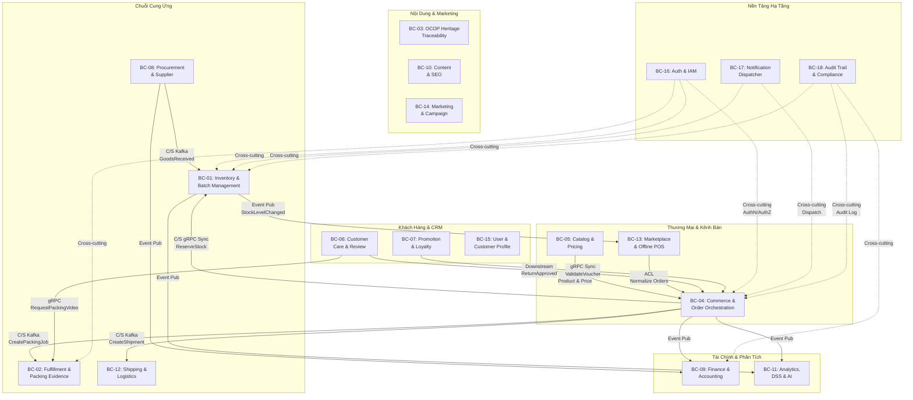

# KHÁM PHÁ NGỮ CẢNH GIỚI HẠN & NGÔN NGỮ PHỔ QUÁT (BOUNDED CONTEXT DISCOVERY)

## HỆ SINH THÁI THƯƠNG MẠI ĐIỆN TỬ ĐA KÊNH & HỖ TRỢ QUYẾT ĐỊNH CHO OCOP HUẾ (MÈ XỬNG O MẠ)

**Phiên bản:** 1.0
**Loại tài liệu:** Bounded Context Discovery & Ubiquitous Language
**Yêu cầu đầu vào:** Domain Design v1.0, Product Backlog v3.0, Functional Requirements, System Design
**Ngày tạo:** 2026-09-12
**Trạng thái:** Bản nháp — Có thể cập nhật khi Domain Model được hoàn thiện thêm

---

## MỤC LỤC

1. [Mục Đích &amp; Vị Trí Trong Quy Trình](#1-mục-đích--vị-trí-trong-quy-trình)
2. [Nguyên Tắc Xác Định Ranh Giới Bounded Context](#2-nguyên-tắc-xác-định-ranh-giới-bounded-context)
3. [Phân Tách Ngữ Nghĩa — Ubiquitous Language Shifts](#3-phân-tách-ngữ-nghĩa--ubiquitous-language-shifts)
4. [Chi Tiết 18 Bounded Contexts](#4-chi-tiết-18-bounded-contexts)
5. [Strategic Context Map](#5-strategic-context-map)
6. [Domain Events &amp; Commands Catalog](#6-domain-events--commands-catalog)
7. [Data Ownership &amp; Polyglot Persistence](#7-data-ownership--polyglot-persistence)
8. [Lộ Trình Triển Khai Bounded Contexts Theo Phase](#8-lộ-trình-triển-khai-bounded-contexts-theo-phase)
9. [Lưu Ý Khi Cập Nhật](#9-lưu-ý-khi-cập-nhật)

---

## 1. MỤC ĐÍCH & VỊ TRÍ TRONG QUY TRÌNH

### 1.1. Mục Đích Tài Liệu

Tài liệu này thực hiện bước **Bounded Context Discovery** — bước kế tiếp sau Domain Design / Scope Analysis, nhằm:

- **Chuyển đổi** 18 Domain đã xác định thành 18 Bounded Context có ranh giới rõ ràng.
- **Thiết lập Ubiquitous Language** riêng biệt cho từng Bounded Context, phản ánh đúng ngữ nghĩa nghiệp vụ nội tại.
- **Xác định Aggregate Roots**, Entity, Value Object và Business Invariants cho từng Context.
- **Thiết lập Context Map** mô tả mối quan hệ tích hợp giữa các Bounded Context (OHS/PL, ACL, Customer-Supplier, Conformist, Cross-cutting).
- **Catalog hóa Domain Events & Commands** để phục vụ kiến trúc Event-Driven qua Apache Kafka.

### 1.2. Vị Trí Trong Quy Trình Kiến Trúc

```text
BUSINESS GOALS & CONSTRAINTS (01_Product_Backlog.md)
    ↓
REQUIREMENT / PRODUCT BACKLOG (01_Product_Backlog.md, 04_Functional_Requirements.md)
    ↓
THIẾT KẾ DOMAIN / SCOPE (domain_design.md)
    ↓
╔═══════════════════════════════════════════════════════════╗
║  ★ BOUNDED CONTEXT DISCOVERY (TÀI LIỆU NÀY)  ★        ║
║    • Ubiquitous Language per Context                     ║
║    • Aggregate Roots & Business Invariants               ║
║    • Context Map & Integration Patterns                  ║
║    • Domain Events & Commands Catalog                    ║
╚═══════════════════════════════════════════════════════════╝
    ↓
DOMAIN MODEL & AGGREGATES (system_design.md §7)
    ↓
CONTEXT MAPPING & SERVICE BOUNDARIES (system_design.md §8-10)
    ↓
TECHNICAL ARCHITECTURE & IMPLEMENTATION
```

### 1.3. Nguồn Dữ Liệu Đầu Vào

| Nguồn                                                                     | Trạng thái           | Vai trò                                         |
| :------------------------------------------------------------------------- | :--------------------- | :----------------------------------------------- |
| [Domain Design v1.0](./domain_design.md)                                    | ✅ Hoàn thành        | 18 Domain, phạm vi IN/OUT, quan hệ phụ thuộc |
| [Product Backlog v3.0](../01_requirements/01_Product_Backlog.md)            | ✅ Bản nháp đủ rõ | ~170 User Stories, Business Rules, Actor Map     |
| [Functional Requirements](../01_requirements/04_Functional_Requirements.md) | ✅ Hoàn thành        | 31 FR, ánh xạ FR → Context                    |
| [Use Case Specification](../01_requirements/use_case_specification.md)      | ✅ Hoàn thành        | Cross-domain interaction flows                   |
| [System Design](./system_design.md)                                         | ✅ Hoàn thành        | Aggregates, Context Map, Saga flows              |

---

## 2. NGUYÊN TẮC XÁC ĐỊNH RANH GIỚI BOUNDED CONTEXT

### 3.1. Tiêu Chí Phân Tách

Ranh giới Bounded Context được xác định dựa trên 6 tiêu chí:

| # | Tiêu chí                          | Giải thích                                                                  |
| :-: | :---------------------------------- | :---------------------------------------------------------------------------- |
| 1 | **Linguistic Boundary**       | Cùng một thuật ngữ mang nghĩa khác nhau → tách thành Context riêng  |
| 2 | **Business Cohesion**         | Các nghiệp vụ liên quan chặt chẽ phải nằm cùng Context               |
| 3 | **Data Ownership**            | Mỗi Context sở hữu dữ liệu riêng, không chia sẻ database              |
| 4 | **Transactional Boundary**    | Đảm bảo ACID trong cùng Context, Eventual Consistency giữa các Context  |
| 5 | **Team Ownership**            | Mỗi Context có thể được phát triển bởi 1 team độc lập             |
| 6 | **Independent Deployability** | Mỗi Context có thể deploy độc lập mà không ảnh hưởng Context khác |

### 3.2. Quy Tắc Bất Biến

> [!IMPORTANT]
> **Database-per-Service (Shared-Nothing Architecture):** CẤM TUYỆT ĐỐI truy cập CSDL chéo giữa các Bounded Context. Mọi giao tiếp phải thông qua API (gRPC/REST) hoặc Domain Events (Kafka).

---

## 3. PHÂN TÁCH NGỮ NGHĨA — UBIQUITOUS LANGUAGE SHIFTS

Bảng dưới đây minh họa tại sao ranh giới Bounded Context bắt buộc phải tồn tại — cùng một **danh từ nghiệp vụ** mang **bản chất và bất biến hoàn toàn khác nhau** trong từng Context:

| Khái Niệm                       | Catalog Context                                                        | Inventory Context                                                  | Fulfillment Context                                                   | Finance Context                                              | Order Context                                                |
| :-------------------------------- | :--------------------------------------------------------------------- | :----------------------------------------------------------------- | :-------------------------------------------------------------------- | :----------------------------------------------------------- | :----------------------------------------------------------- |
| **Sản phẩm (Product)**    | Thông tin tiếp thị, bài viết di sản, hình ảnh, giá niêm yết | Mã SKU vật lý, Lô (Batch), NSX, HSD, Tồn khả dụng/tạm giữ | Kiện hàng đóng gói, kích thước 3 chiều, cân nặng, mã seal | Mã tài sản hàng hóa, giá vốn (COGS), thuế suất GTGT | Dòng đơn hàng (Line Item) với SKU, quantity, unit_price |
| **Giá (Price)**            | Giá niêm yết, giá gạch bỏ, giá sỉ                              | —*(Không quan tâm)*                                           | —*(Không quan tâm)*                                              | Doanh thu thực thu sau chiết khấu, giá vốn thực tế    | Giá tại thời điểm đặt hàng (Snapshot Price)          |
| **Đơn hàng (Order)**     | Giỏ hàng tạm thời, danh sách mong muốn                           | Lệnh tạm giữ tồn (Stock Reservation), Phiếu nhặt hàng       | Lệnh đóng gói (Packing Job), Video bằng chứng, Waybill          | Giao dịch phát sinh doanh thu, Công nợ A/R               | Vòng đời đơn hàng đầy đủ, Saga state               |
| **Khách hàng (Customer)** | Người xem danh mục, tài khoản đã đăng ký                     | —*(Không quan tâm)*                                           | Địa chỉ người nhận, ghi chú giao (quà tặng)                  | Mã số thuế doanh nghiệp (B2B), thông tin đối soát    | Người đặt hàng, thông tin giao hàng                   |

---

## 4. CHI TIẾT 18 BOUNDED CONTEXTS

---

### BC-01: INVENTORY & BATCH MANAGEMENT CONTEXT

| Thuộc tính             | Chi tiết                                                                              |
| :----------------------- | :------------------------------------------------------------------------------------- |
| **Domain**         | Inventory & Batch Management                                                           |
| **Epic**           | EPIC 09                                                                                |
| **FR**             | FR-08 (Inventory), FR-09 (Expiry)                                                      |
| **Business Rules** | BR-BATCH-01 → BR-BATCH-06, BR-ORDER-02, BR-MKTPLACE-05, BR-MKTPLACE-06, BR-OFFLINE-04 |
| **Actors**         | Warehouse Staff (ACT-06), Supply Manager (ACT-15), Sales Manager (ACT-12)              |
| **Phase**          | MVP                                                                                    |

#### Ubiquitous Language

| Thuật ngữ               | Định nghĩa trong Context này                                                                    |
| :------------------------ | :-------------------------------------------------------------------------------------------------- |
| `SKU`                   | Stock Keeping Unit — đơn vị quản lý tồn kho vật lý nhỏ nhất (vd: MX-200G-ME, MX-500G-DP) |
| `Batch / Lot`           | Lô sản xuất có NSX, HSD, nguồn cung cấp; đơn vị truy xuất ngược nguyên liệu           |
| `Physical Quantity`     | Tổng số lượng thực tế trong kho (nhập - xuất)                                               |
| `Reserved Quantity`     | Số lượng đã tạm giữ cho đơn hàng đang xử lý                                            |
| `Available Quantity`    | $= Physical - Reserved \ge 0$; số lượng có thể bán                                          |
| `FEFO Allocation`       | First Expired, First Out — phân bổ xuất kho ưu tiên lô gần hạn nhất                       |
| `Stock Reservation`     | Tạm giữ tồn kho cho checkout, TTL 15 phút                                                       |
| `Near-Expiry Threshold` | Ngưỡng cảnh báo cận hạn: < 45 ngày                                                           |
| `Inventory Quarantine`  | Khu vực cách ly hàng hỏng, hết hạn, chờ xử lý                                              |
| `Stock Adjustment`      | Điều chỉnh tồn kho (hàng hỏng, thất thoát, kiểm kê)                                       |

#### Aggregate Roots & Business Invariants

**Aggregate Root: `InventoryItem`**

```text
InventoryItem (Aggregate Root)
├── sku: SKU (Value Object - Identity)
├── warehouse_location: WarehouseLocation (Value Object)
├── total_physical_qty: int
├── total_reserved_qty: int
├── status: InventoryStatus (ACTIVE | SUSPENDED)
└── batches: List<Batch> (Entity)
    ├── batch_id: BatchId
    ├── batch_code: string
    ├── manufacturing_date: Date
    ├── expiry_date: Date
    ├── physical_quantity: int
    ├── reserved_quantity: int
    └── supplier_id: SupplierId (Reference)
```

**Business Invariants:**

1. **INV-BI-01**: $AvailableQuantity = PhysicalQuantity - ReservedQuantity \ge 0$ — Tuyệt đối không cho phép tồn kho âm trong mọi giao dịch đồng thời.
2. **INV-BI-02**: Batch có $ExpiryDate \le CurrentDate$ bị **CẤM TUYỆT ĐỐI** phân bổ xuất kho hoặc tạm giữ.
3. **INV-BI-03**: Xuất kho bắt buộc sắp xếp phân bổ theo $ExpiryDate$ tăng dần (**Nguyên tắc FEFO**).
4. **INV-BI-04**: Mỗi Batch phải có đủ: batch_code, manufacturing_date, expiry_date, physical_quantity, supplier_id.

**Aggregate Root: `StockReservation`**

```text
StockReservation (Aggregate Root)
├── reservation_id: ReservationId
├── order_id: OrderId (Reference)
├── sku: SKU
├── reserved_quantity: int
├── allocated_batches: List<BatchAllocation> (Value Object)
│   ├── batch_id: BatchId
│   └── quantity: int
├── status: ReservationStatus (RESERVED | COMMITTED | EXPIRED | CANCELLED)
├── created_at: Timestamp
└── expires_at: Timestamp (created_at + 15 minutes)
```

**Business Invariants:**

5. **INV-BI-05**: Quá $TTL = 15$ phút mà chưa nhận `CommitStockCommand` → tự động giải phóng `reserved_quantity` về `available_quantity`.

#### Domain Events (Published)

| Event                            | Trigger                                       | Consumers                                     |
| :------------------------------- | :-------------------------------------------- | :-------------------------------------------- |
| `StockReservedEvent`           | Tạm giữ thành công                        | Order Orchestration                           |
| `StockDeductedEvent`           | Trừ kho chính thức theo FEFO               | Order, Finance, Analytics                     |
| `StockReservationExpiredEvent` | Quá TTL 15 phút                             | Order Orchestration                           |
| `StockLevelChangedEvent`       | Bất kỳ biến động tồn                    | Marketplace (đẩy tồn lên sàn), Analytics |
| `ExpiryWarningEvent`           | Cron job phát hiện lô cận hạn < 45 ngày | Notification, Promotion, Supply Manager       |
| `StockAdjustedEvent`           | Điều chỉnh thủ công                      | Audit Trail, Finance                          |

#### Commands (Received)

| Command                            | Source                          | Mô tả                                   |
| :--------------------------------- | :------------------------------ | :---------------------------------------- |
| `ReserveStockCommand`            | Order Orchestration (gRPC sync) | Tạm giữ tồn kho cho checkout           |
| `CommitStockDeductionCommand`    | Order Orchestration (Kafka)     | Trừ kho chính thức sau khi thanh toán |
| `ReleaseStockReservationCommand` | Order / Timeout Worker          | Giải phóng tồn tạm giữ               |
| `ReceiveGoodsCommand`            | Procurement & Supplier (Kafka)  | Nhập kho nguyên liệu mới              |
| `AdjustStockCommand`             | Warehouse Staff (UI)            | Điều chỉnh tồn kho thủ công         |

---

### BC-02: FULFILLMENT & PACKING EVIDENCE CONTEXT

| Thuộc tính             | Chi tiết                                                                         |
| :----------------------- | :-------------------------------------------------------------------------------- |
| **Domain**         | Fulfillment & Packing Evidence                                                    |
| **Epic**           | EPIC 10                                                                           |
| **FR**             | FR-10 (Packing), FR-11 (Packing Video)                                            |
| **Business Rules** | BR-PACK-01 → BR-PACK-05                                                          |
| **Actors**         | Packing Staff (ACT-07), Admin/Manager (ACT-12, ACT-17), Customer Service (ACT-11) |
| **Phase**          | MVP                                                                               |

#### Ubiquitous Language

| Thuật ngữ                        | Định nghĩa trong Context này                                             |
| :--------------------------------- | :--------------------------------------------------------------------------- |
| `Packing Queue`                  | Hàng đợi đơn hàng cần đóng gói, sắp xếp theo deadline giao hàng |
| `Packing Station`                | Bàn đóng gói được phân công cho nhân viên cụ thể                |
| `Verification Checklist`         | Danh sách kiểm tra SKU, số lượng, NSX/HSD trước đóng thùng         |
| `Packing Evidence / Video Proof` | Video ghi hình quá trình đóng gói làm bằng chứng pháp lý          |
| `Seal Tag Number`                | Mã tem niêm phong kiện hàng, duy nhất mỗi kiện                        |
| `Pre-signed URL`                 | URL truy cập video tạm thời, TTL tối đa 15 phút                        |
| `Package Dimensions`             | Kích thước kiện hàng (L × W × H, Weight)                              |
| `Packed State`                   | Trạng thái hoàn thành đóng gói, sẵn sàng bàn giao vận chuyển     |

#### Aggregate Roots & Business Invariants

**Aggregate Root: `FulfillmentPackage`**

```text
FulfillmentPackage (Aggregate Root)
├── package_id: PackageId
├── order_id: OrderId (Reference)
├── assigned_staff_id: StaffId (Reference)
├── packing_station: StationId
├── verification_checklist: VerificationChecklist (Value Object)
│   ├── sku_verified: boolean
│   ├── quantity_verified: boolean
│   ├── expiry_verified: boolean
│   └── verified_at: Timestamp
├── seal_tag: SealTag (Value Object)
│   ├── tag_number: string (unique)
│   └── applied_at: Timestamp
├── package_dimensions: PackageDimensions (Value Object)
├── packing_evidence: PackingEvidence (Entity)
│   ├── evidence_id: EvidenceId
│   ├── video_s3_key: string
│   ├── video_duration_seconds: int
│   ├── recorded_by_staff_id: StaffId
│   └── recorded_at: Timestamp
├── status: PackingStatus (QUEUED | IN_PROGRESS | PACKED | READY_TO_SHIP)
├── priority: PackingPriority (derived from delivery deadline)
└── created_at: Timestamp
```

**Business Invariants:**

1. **FUL-BI-01**: Kiện hàng chỉ được chuyển sang `PACKED` / `READY_TO_SHIP` khi đã liên kết `video_s3_key` hợp lệ.
2. **FUL-BI-02**: Video đóng gói là tài sản riêng tư; chỉ cấp Pre-signed URL có TTL tối đa 15 phút.
3. **FUL-BI-03**: Chỉ nhân viên được phân công ca trực mới được xác nhận hoàn thành đóng gói.
4. **FUL-BI-04**: Bắt buộc kiểm tra Verification Checklist trước khi đóng thùng.

#### Domain Events (Published)

| Event                             | Trigger                                         | Consumers                                  |
| :-------------------------------- | :---------------------------------------------- | :----------------------------------------- |
| `PackingJobAcceptedEvent`       | Fulfillment ACK nhận lệnh đóng gói         | Order Orchestration (→ PROCESSING)        |
| `PackageSealedAndRecordedEvent` | Đóng gói xong + video upload S3 thành công | Order (→ PACKED), Shipping (tạo waybill) |

#### Commands (Received)

| Command                           | Source                      | Mô tả                                                 |
| :-------------------------------- | :-------------------------- | :------------------------------------------------------ |
| `CreatePackingJobCommand`       | Order Orchestration (Kafka) | Tạo lệnh đóng gói mới                             |
| `RequestPackingVideoUrlCommand` | Customer Care (gRPC)        | Yêu cầu Pre-signed URL video đối chiếu khiếu nại |

---

### BC-03: OCOP HERITAGE TRACEABILITY CONTEXT

| Thuộc tính     | Chi tiết                                                              |
| :--------------- | :--------------------------------------------------------------------- |
| **Domain** | OCOP Heritage Traceability                                             |
| **Epic**   | EPIC 19                                                                |
| **FR**     | FR-20 (OCOP Traceability)                                              |
| **Actors** | Customer (ACT-02), Manager (ACT-12, ACT-15), Offline Customer (ACT-05) |
| **Phase**  | MVP                                                                    |

#### Ubiquitous Language

| Thuật ngữ                           | Định nghĩa trong Context này                                                               |
| :------------------------------------ | :--------------------------------------------------------------------------------------------- |
| `OCOP Product Heritage`             | Hồ sơ di sản sản phẩm OCOP: câu chuyện thương hiệu, quy trình sản xuất thủ công |
| `Farming Origin Region`             | Vùng nguyên liệu (mè Quảng Điền, đậu Phong Điền)                                    |
| `Artisan Story`                     | Câu chuyện nghệ nhân, làng nghề truyền thống                                           |
| `OCOP 4-Star Certification`         | Chứng nhận OCOP 4 sao và các giấy kiểm nghiệm ATTP                                      |
| `QR Story Code`                     | Mã QR phát hành cho từng lô, liên kết trang truy xuất nguồn gốc                      |
| `Batch Trace Page`                  | Trang công khai cho người tiêu dùng quét QR xem nguồn gốc                              |
| `National Traceability Integration` | Liên kết Cổng truy xuất nguồn gốc quốc gia (EXT-10)                                     |

#### Aggregate Roots & Business Invariants

**Aggregate Root: `TraceabilityRecord`**

```text
TraceabilityRecord (Aggregate Root)
├── record_id: TraceabilityRecordId
├── batch_id: BatchId (Reference to Inventory)
├── product_id: ProductId (Reference to Catalog)
├── origin_info: OriginInfo (Value Object)
│   ├── farming_region: string
│   ├── farmer_name: string
│   ├── raw_materials: List<RawMaterial>
│   └── production_process: string
├── certifications: List<Certification> (Entity)
│   ├── cert_id: CertificationId
│   ├── cert_type: CertType (OCOP_4STAR | ATTP | ISO)
│   ├── issued_by: string
│   ├── issued_date: Date
│   └── expiry_date: Date
├── qr_story: QRStory (Entity)
│   ├── qr_code: string (unique)
│   ├── public_url: string
│   ├── scan_count: int
│   └── generated_at: Timestamp
├── approval_status: ApprovalStatus (DRAFT | PENDING_REVIEW | APPROVED | PUBLISHED)
└── national_trace_id: string (Reference to EXT-10)
```

**Business Invariants:**

1. **OCOP-BI-01**: Dữ liệu nguồn gốc phải được phê duyệt (APPROVED) trước khi công khai (PUBLISHED).
2. **OCOP-BI-02**: Mỗi QR Story Code phải liên kết duy nhất với một Batch.
3. **OCOP-BI-03**: Thông tin chứng nhận OCOP phải còn hiệu lực (expiry_date > CurrentDate).

#### Domain Events (Published)

| Event                          | Trigger                                                | Consumers                                |
| :----------------------------- | :----------------------------------------------------- | :--------------------------------------- |
| `TraceabilityPublishedEvent` | Dữ liệu nguồn gốc được phê duyệt & công khai | Catalog (hiển thị badge OCOP), Content |
| `QRStoryScannedEvent`        | Người tiêu dùng quét QR                           | Analytics (thống kê)                   |

---

### BC-04: OMNICHANNEL COMMERCE & ORDER ORCHESTRATION CONTEXT

| Thuộc tính             | Chi tiết                                                                                             |
| :----------------------- | :---------------------------------------------------------------------------------------------------- |
| **Domain**         | Omnichannel Commerce & Order Orchestration                                                            |
| **Epic**           | EPIC 05, 06, 07, 08, 18, 26                                                                           |
| **FR**             | FR-05 (Cart & Checkout), FR-06 (Payment & Refund), FR-07 (Order), FR-19 (B2B), FR-28 (Gifting)        |
| **Business Rules** | BR-ORDER-01 → BR-ORDER-05                                                                            |
| **Actors**         | Guest (ACT-01), Customer (ACT-02), B2B Customer (ACT-03), Sales Manager (ACT-12), Accountant (ACT-19) |
| **Phase**          | MVP / Phase 2                                                                                         |

#### Ubiquitous Language

| Thuật ngữ           | Định nghĩa trong Context này                                                                  |
| :-------------------- | :------------------------------------------------------------------------------------------------ |
| `Customer Order`    | Đơn hàng chính thức với vòng đời đầy đủ                                              |
| `Order Line Item`   | Dòng sản phẩm trong đơn hàng (SKU, quantity, unit_price, discount)                          |
| `Cart Session`      | Giỏ hàng tạm thời, lưu Redis, TTL theo session                                               |
| `Checkout Session`  | Phiên thanh toán: địa chỉ, voucher, phí ship, tạm giữ tồn                                |
| `Order Lifecycle`   | PENDING_PAYMENT → PAID → CONFIRMED → PROCESSING → PACKED → SHIPPED → DELIVERED → COMPLETED |
| `Saga Orchestrator` | Process Manager điều phối giao dịch phân tán                                                |
| `B2B Quotation`     | Báo giá đơn sỉ cho khách doanh nghiệp                                                      |
| `Gift Option`       | Gửi quà hộ: ẩn giá, đính kèm thiệp chúc mừng                                           |
| `Price Masking`     | Ẩn giá trên kiện hàng quà tặng                                                             |
| `Payment Method`    | VietQR (chuyển khoản), COD (thanh toán khi nhận)                                              |

#### Aggregate Roots & Business Invariants

**Aggregate Root: `CustomerOrder`**

```text
CustomerOrder (Aggregate Root)
├── order_id: OrderId
├── order_code: string (human-readable, unique)
├── customer_info: CustomerInfo (Value Object)
│   ├── customer_id: CustomerId (Reference)
│   ├── name: string
│   ├── phone: string
│   └── email: string
├── shipping_address: ShippingAddress (Value Object)
├── line_items: List<OrderLineItem> (Entity)
│   ├── line_item_id: LineItemId
│   ├── sku: SKU (Reference)
│   ├── product_name: string (snapshot)
│   ├── quantity: int
│   ├── unit_price: Money (snapshot at order time)
│   └── discount_amount: Money
├── payment_summary: PaymentSummary (Value Object)
│   ├── subtotal: Money
│   ├── shipping_fee: Money
│   ├── voucher_discount: Money
│   ├── total: Money
│   └── payment_method: PaymentMethod
├── gift_option: GiftOption (Value Object, optional)
│   ├── is_gift: boolean
│   ├── hide_price: boolean
│   └── greeting_card_message: string
├── status: OrderStatus (State Machine)
├── channel: OrderChannel (WEBSITE | SHOPEE | TIKTOK | POS | B2B)
├── saga_state: SagaState (tracking distributed transaction progress)
├── reservation_id: ReservationId (Reference)
├── created_at: Timestamp
└── updated_at: Timestamp
```

**Aggregate Root: `Quotation` (B2B)**

```text
Quotation (Aggregate Root)
├── quotation_id: QuotationId
├── b2b_customer_id: CustomerId (Reference)
├── items: List<QuotationItem>
├── custom_branding: BrandingSpec (Value Object - logo, in ấn)
├── discount_percentage: decimal
├── credit_terms: CreditTerms (Value Object)
├── status: QuotationStatus (DRAFT | PENDING_APPROVAL | APPROVED | CONVERTED_TO_ORDER | REJECTED)
├── approved_by: StaffId
└── valid_until: Date
```

**Business Invariants:**

1. **ORD-BI-01**: $FinalTotal = Subtotal + ShippingFee - VoucherDiscount \ge 0$.
2. **ORD-BI-02**: Chỉ chuyển sang `PAID` khi nhận Domain Event xác nhận thanh toán hợp lệ kèm chữ ký số (HMAC khớp).
3. **ORD-BI-03**: Khách hàng chỉ được tự hủy đơn khi trạng thái đang là `PENDING_PAYMENT`.
4. **ORD-BI-04**: Trạng thái đơn hàng phải tuần tự, không nhảy cóc trong vòng đời.
5. **ORD-BI-05**: Mọi thay đổi trạng thái phải ghi Audit Log.

#### Domain Events (Published)

| Event                      | Trigger                                             | Consumers                                                                     |
| :------------------------- | :-------------------------------------------------- | :---------------------------------------------------------------------------- |
| `OrderPlacedEvent`       | Đơn hàng D2C tạo thành công (PENDING_PAYMENT) | Inventory (reserve), Payment (VietQR), Notification                           |
| `OrderPaidEvent`         | Xác nhận thanh toán thành công                 | Inventory (commit deduction), Fulfillment (create job), Finance, Notification |
| `OrderCancelledEvent`    | Hủy đơn (timeout / khách hủy)                  | Inventory (release), Finance, Notification                                    |
| `OrderCompletedEvent`    | Giao hàng thành công                             | Promotion (tích điểm Loyalty), Analytics, Finance                          |
| `QuotationApprovedEvent` | Sales Manager duyệt báo giá B2B                  | Notification (thông báo doanh nghiệp), Finance                             |

#### Commands (Received)

| Command                           | Source                     | Mô tả                                 |
| :-------------------------------- | :------------------------- | :-------------------------------------- |
| `ImportMarketplaceOrderCommand` | Marketplace ACL (Kafka)    | Nhập đơn từ sàn TMĐT              |
| `CreatePOSOrderCommand`         | Offline POS (gRPC)         | Tạo đơn từ quầy bán lẻ           |
| `ApplyVoucherCommand`           | Promotion & Loyalty (gRPC) | Xác thực và áp dụng mã giảm giá |
| `TriggerReturnRefundCommand`    | Customer Care (Kafka)      | Kích hoạt hoàn tiền từ khiếu nại |

---

### BC-05: CATALOG & PRICING CONTEXT

| Thuộc tính             | Chi tiết                                             |
| :----------------------- | :---------------------------------------------------- |
| **Domain**         | Catalog & Pricing                                     |
| **Epic**           | EPIC 03, 04                                           |
| **FR**             | FR-04 (Product & SKU), FR-31 (Product Discovery & AI) |
| **Business Rules** | BR-PROD-01 → BR-PROD-04                              |
| **Actors**         | Customer (ACT-01, ACT-02), Sales Manager (ACT-12)     |
| **Phase**          | MVP                                                   |

#### Ubiquitous Language

| Thuật ngữ                  | Định nghĩa trong Context này                                           |
| :--------------------------- | :------------------------------------------------------------------------- |
| `Parent Product`           | Sản phẩm mẹ: tên, mô tả, thành phần, hình ảnh                    |
| `Product Variant`          | Biến thể theo khối lượng, hương vị, quy cách                      |
| `SKU Specification`        | Mã đơn vị lưu kho kèm thuộc tính biến thể                        |
| `Omnichannel Price Tier`   | Bảng giá đa kênh: Website, Shopee, TikTok, POS, B2B                    |
| `Listing Status`           | Active (đang bán), Suspended (tạm ngừng), Archived (ngừng kinh doanh) |
| `Full-text Filter`         | Tìm kiếm toàn văn qua Elasticsearch                                    |
| `AI Recommendation Engine` | Hệ thống gợi ý sản phẩm dựa trên hành vi mua hàng                |

#### Aggregate Roots

**Aggregate Root: `Product`**

```text
Product (Aggregate Root)
├── product_id: ProductId
├── name: string
├── description: string
├── ingredients: string
├── storage_guide: string
├── images: List<ProductImage> (Value Object)
├── category_id: CategoryId (Reference)
├── variants: List<ProductVariant> (Entity)
│   ├── variant_id: VariantId
│   ├── sku: SKU (unique)
│   ├── weight: Weight (Value Object)
│   ├── flavor: string
│   ├── packaging: string
│   └── prices: List<ChannelPrice> (Value Object)
│       ├── channel: SalesChannel
│       └── price: Money
├── listing_status: ListingStatus
├── approval_status: ApprovalStatus (DRAFT | PENDING | APPROVED)
└── approved_by: StaffId
```

**Business Invariants:**

1. **CAT-BI-01**: Sản phẩm mẹ có thể có nhiều Variant/SKU (BR-PROD-01).
2. **CAT-BI-02**: Giá, khối lượng, quy cách phải quản lý theo từng SKU riêng (BR-PROD-02).
3. **CAT-BI-03**: Thông tin và giá bán phải được duyệt trước khi công khai (BR-PROD-04).

#### Domain Events (Published)

| Event                     | Trigger                                | Consumers                                                 |
| :------------------------ | :------------------------------------- | :-------------------------------------------------------- |
| `ProductPublishedEvent` | Sản phẩm được duyệt & công khai | Marketplace (đồng bộ lên sàn), Elasticsearch (index) |
| `PriceChangedEvent`     | Cập nhật giá bán                   | Order (validate cart), Marketplace, Audit Trail           |

---

### BC-06: CUSTOMER CARE & REVIEW CONTEXT

| Thuộc tính             | Chi tiết                                                            |
| :----------------------- | :------------------------------------------------------------------- |
| **Domain**         | Customer Care & Review                                               |
| **Epic**           | EPIC 14, 15, 16                                                      |
| **FR**             | FR-15 (Customer Service), FR-16 (Review)                             |
| **Business Rules** | BR-REVIEW-01 → BR-REVIEW-06, BR-REFUND-01 → BR-REFUND-04           |
| **Actors**         | Customer (ACT-02), Customer Service (ACT-11), Sales Manager (ACT-12) |
| **Phase**          | MVP / Phase 2                                                        |

#### Ubiquitous Language

| Thuật ngữ           | Định nghĩa trong Context này                        |
| :-------------------- | :------------------------------------------------------ |
| `Support Ticket`    | Yêu cầu hỗ trợ khách hàng, theo dõi SLA          |
| `SLA Breach`        | Vi phạm thời gian phản hồi cam kết                 |
| `Dispute Case`      | Hồ sơ khiếu nại kèm bằng chứng (ảnh/video lỗi) |
| `Return Request`    | Yêu cầu đổi/trả hàng (State Machine)              |
| `Refund Policy`     | Chính sách hoàn tiền (Full / Partial)               |
| `Verified Review`   | Đánh giá từ khách đã mua hàng, 1-5 sao          |
| `Review Moderation` | Kiểm duyệt đánh giá vi phạm                       |
| `Official Reply`    | Phản hồi chính thức từ nhân viên CSKH            |

#### Aggregate Roots

**Aggregate Root: `SupportTicket`**

```text
SupportTicket (Aggregate Root)
├── ticket_id: TicketId
├── customer_id: CustomerId (Reference)
├── order_id: OrderId (Reference, optional)
├── subject: string
├── messages: List<TicketMessage> (Entity)
├── attachments: List<Attachment> (Value Object)
├── assigned_to: StaffId
├── sla_deadline: Timestamp
├── status: TicketStatus (OPEN | IN_PROGRESS | WAITING_CUSTOMER | RESOLVED | CLOSED)
└── created_at: Timestamp
```

**Aggregate Root: `ReturnRequest`**

```text
ReturnRequest (Aggregate Root)
├── return_id: ReturnId
├── order_id: OrderId (Reference)
├── customer_id: CustomerId (Reference)
├── reason: string
├── evidence: List<DisputeEvidence> (Value Object)
├── refund_type: RefundType (FULL | PARTIAL)
├── refund_amount: Money
├── status: ReturnStatus (RETURN_REQUESTED → REVIEWING → APPROVED | REJECTED → RETURNED → REFUNDED)
├── approved_by: StaffId (Sales Manager+)
└── created_at: Timestamp
```

**Aggregate Root: `Review`**

```text
Review (Aggregate Root)
├── review_id: ReviewId
├── customer_id: CustomerId (Reference)
├── order_id: OrderId (Reference)
├── sku: SKU (Reference)
├── rating: Rating (1-5, Value Object)
├── content: string
├── images: List<ReviewImage> (Value Object)
├── replies: List<ReviewReply> (Entity)
├── moderation_status: ModerationStatus (VISIBLE | HIDDEN | FLAGGED)
├── editable_until: Date (created_at + 30 days)
└── created_at: Timestamp
```

**Business Invariants:**

1. **CARE-BI-01**: Chỉ khách có đơn `DELIVERED` mới được tạo Review cho SKU đã mua (BR-REVIEW-01).
2. **CARE-BI-02**: Rating phải nằm trong [1, 5] nguyên (BR-REVIEW-04).
3. **CARE-BI-03**: Review chỉ chỉnh sửa được trong 30 ngày (BR-REVIEW-06).
4. **CARE-BI-04**: Chỉ Sales Manager+ được duyệt Refund (BR-REFUND-01).
5. **CARE-BI-05**: Mọi thao tác hoàn tiền phải ghi Audit Log (BR-REFUND-04).

#### Domain Events (Published)

| Event                    | Trigger                         | Consumers                                                               |
| :----------------------- | :------------------------------ | :---------------------------------------------------------------------- |
| `ReturnApprovedEvent`  | Sales Manager duyệt đổi trả | Order (kích hoạt refund), Inventory (nhận hàng hoàn), Notification |
| `RefundRequestedEvent` | Hoàn tiền được phê duyệt | Payment (giải ngân), Finance (bút toán giảm DT)                    |
| `ReviewSubmittedEvent` | Khách đánh giá mới         | Analytics, Catalog (cập nhật rating trung bình)                      |

---

### BC-07: PROMOTION & LOYALTY CONTEXT

| Thuộc tính     | Chi tiết                                 |
| :--------------- | :---------------------------------------- |
| **Domain** | Promotion & Loyalty                       |
| **Epic**   | EPIC 17                                   |
| **FR**     | FR-17 (Promotion), FR-18 (Loyalty)        |
| **Actors** | Customer (ACT-02), Sales Manager (ACT-12) |
| **Phase**  | Phase 2                                   |

#### Ubiquitous Language

| Thuật ngữ                     | Định nghĩa trong Context này                                 |
| :------------------------------ | :--------------------------------------------------------------- |
| `Coupon Code`                 | Mã giảm giá có điều kiện áp dụng, hạn mức, thời hạn |
| `Discount Rule`               | Quy tắc giảm giá theo sản phẩm, danh mục, đơn hàng      |
| `Gift Combo / Hamper`         | Bộ sản phẩm combo (giỏ quà Tết)                            |
| `Loyalty Points Ledger`       | Sổ điểm tích lũy sau mỗi đơn hàng                       |
| `Reward Redemption`           | Đổi điểm thành ưu đãi / voucher                          |
| `Point-to-Voucher Conversion` | Quy đổi điểm thành mã giảm giá                           |
| `One-click Reorder`           | Đặt lại nhanh từ đơn hàng cũ                             |

#### Aggregate Roots

**Aggregate Root: `Coupon`**

```text
Coupon (Aggregate Root)
├── coupon_id: CouponId
├── code: string (unique)
├── discount_type: DiscountType (PERCENTAGE | FIXED_AMOUNT | FREE_SHIPPING)
├── discount_value: decimal
├── conditions: CouponCondition (Value Object)
│   ├── min_order_value: Money
│   ├── applicable_skus: List<SKU>
│   ├── applicable_categories: List<CategoryId>
│   └── max_uses: int
├── used_count: int
├── valid_from: Date
├── valid_until: Date
└── status: CouponStatus (ACTIVE | EXPIRED | EXHAUSTED | DISABLED)
```

**Aggregate Root: `LoyaltyAccount`**

```text
LoyaltyAccount (Aggregate Root)
├── account_id: LoyaltyAccountId
├── customer_id: CustomerId (Reference)
├── total_points: int
├── available_points: int
├── transactions: List<PointTransaction> (Entity)
│   ├── transaction_id: PointTransactionId
│   ├── type: TransactionType (EARN | REDEEM | EXPIRE | ADJUST)
│   ├── points: int
│   ├── order_id: OrderId (Reference, optional)
│   └── created_at: Timestamp
└── tier: LoyaltyTier (BRONZE | SILVER | GOLD | PLATINUM)
```

**Business Invariants:**

1. **PROMO-BI-01**: $available\_points \ge 0$ — không cho phép đổi vượt số điểm khả dụng.
2. **PROMO-BI-02**: Coupon chỉ áp dụng được khi: còn trong thời hạn, chưa hết lượt, đơn hàng thỏa điều kiện.

#### Domain Events (Published)

| Event                     | Trigger                                      | Consumers                     |
| :------------------------ | :------------------------------------------- | :---------------------------- |
| `VoucherValidatedEvent` | Coupon xác thực thành công tại checkout | Order Orchestration           |
| `PointsEarnedEvent`     | Tích điểm sau đơn hàng completed       | Notification (thông báo KH) |

---

### BC-08: PROCUREMENT & SUPPLIER CONTEXT

| Thuộc tính     | Chi tiết                                         |
| :--------------- | :------------------------------------------------ |
| **Domain** | Procurement & Supplier                            |
| **Epic**   | EPIC 27                                           |
| **FR**     | FR-29 (Procurement)                               |
| **Actors** | Supply Manager (ACT-15), Warehouse Staff (ACT-06) |
| **Phase**  | Phase 3                                           |

#### Ubiquitous Language

| Thuật ngữ                     | Định nghĩa trong Context này                         |
| :------------------------------ | :------------------------------------------------------- |
| `Supplier / Vendor Profile`   | Hồ sơ nhà cung cấp: nông dân, HTX, hộ OCOP        |
| `Purchase Order (PO)`         | Đơn đặt mua nguyên liệu gửi nhà cung cấp        |
| `Raw Material Intake`         | Tiếp nhận nguyên liệu thực tế tại xưởng         |
| `Intake Inspection Checklist` | Kiểm tra nghiệm thu: cân đo, độ ẩm, chất lượng |
| `Goods Received Note`         | Phiếu nhập kho xác nhận số lượng thực nhận      |
| `Supplier Credit Terms`       | Chính sách công nợ/thanh toán với NCC              |

#### Aggregate Roots

**Aggregate Root: `PurchaseOrder`**

```text
PurchaseOrder (Aggregate Root)
├── po_id: PurchaseOrderId
├── supplier_id: SupplierId (Reference)
├── items: List<POItem> (Entity)
│   ├── raw_material: string
│   ├── expected_quantity: decimal
│   ├── unit: MeasurementUnit
│   └── unit_price: Money
├── expected_delivery_date: Date
├── inspection: InspectionResult (Value Object)
│   ├── actual_quantity: decimal
│   ├── humidity_level: decimal
│   ├── quality_grade: QualityGrade
│   └── inspected_by: StaffId
├── status: POStatus (DRAFT | SENT | RECEIVED | INSPECTED | COMPLETED | CANCELLED)
└── created_at: Timestamp
```

#### Domain Events (Published)

| Event                  | Trigger                                | Consumers                                                   |
| :--------------------- | :------------------------------------- | :---------------------------------------------------------- |
| `GoodsReceivedEvent` | Nghiệm thu nguyên liệu thành công | Inventory (tạo Batch mới), Finance (ghi A/P), Audit Trail |

---

### BC-09: FINANCE & ACCOUNTING CONTEXT

| Thuộc tính     | Chi tiết                               |
| :--------------- | :-------------------------------------- |
| **Domain** | Finance & Accounting                    |
| **Epic**   | EPIC 24                                 |
| **FR**     | FR-24 (Finance)                         |
| **Actors** | Accountant (ACT-19), Executive (ACT-16) |
| **Phase**  | Phase 3                                 |

#### Ubiquitous Language

| Thuật ngữ                       | Định nghĩa trong Context này                 |
| :-------------------------------- | :----------------------------------------------- |
| `General Ledger`                | Sổ cái tổng hợp                              |
| `Revenue Recognition`           | Ghi nhận doanh thu khi đơn hàng hoàn tất   |
| `COGS`                          | Cost of Goods Sold — giá vốn hàng bán       |
| `Refund Deduction Entry`        | Bút toán giảm trừ doanh thu khi hoàn tiền  |
| `Accounts Receivable (A/R)`     | Công nợ phải thu (B2B)                        |
| `Accounts Payable (A/P)`        | Công nợ phải trả (NCC)                       |
| `Electronic VAT Invoice`        | Hóa đơn điện tử GTGT (MISA, VNPT, Viettel) |
| `Bank Statement Reconciliation` | Đối soát sao kê ngân hàng                  |

#### Aggregate Roots

**Aggregate Root: `FinancialTransaction`**

```text
FinancialTransaction (Aggregate Root)
├── transaction_id: FinancialTransactionId
├── type: TransactionType (REVENUE | REFUND_DEDUCTION | COGS | COMMISSION | SHIPPING_COST)
├── order_id: OrderId (Reference)
├── amount: Money
├── channel: SalesChannel
├── tax_amount: Money (VAT)
├── status: TransactionStatus (PENDING | CONFIRMED | RECONCILED)
└── created_at: Timestamp
```

**Aggregate Root: `Reconciliation`**

```text
Reconciliation (Aggregate Root)
├── reconciliation_id: ReconciliationId
├── type: ReconciliationType (BANK | 3PL | MARKETPLACE)
├── period: DateRange (Value Object)
├── expected_amount: Money
├── actual_amount: Money
├── discrepancy: Money
├── status: ReconciliationStatus (PENDING | MATCHED | DISCREPANCY | RESOLVED)
└── reconciled_by: StaffId
```

#### Commands (Received — Event Consumer)

| Event Consumed           | Source              | Action                               |
| :----------------------- | :------------------ | :----------------------------------- |
| `OrderCompletedEvent`  | Order Orchestration | Ghi nhận doanh thu                  |
| `RefundCompletedEvent` | Payment             | Ghi bút toán giảm trừ DT & thuế |
| `GoodsReceivedEvent`   | Procurement         | Ghi nhận A/P nhà cung cấp         |

---

### BC-10: CONTENT & SEO CONTEXT

| Thuộc tính     | Chi tiết                    |
| :--------------- | :--------------------------- |
| **Domain** | Content & SEO                |
| **Epic**   | EPIC 20                      |
| **FR**     | FR-21 (Content), FR-22 (SEO) |
| **Actors** | Content Manager (ACT-13)     |
| **Phase**  | MVP                          |

#### Ubiquitous Language

| Thuật ngữ                   | Định nghĩa trong Context này                       |
| :---------------------------- | :----------------------------------------------------- |
| `Culture Article`           | Bài viết văn hóa Cố Đô, làng nghề mè xửng   |
| `Heritage Blog`             | Blog giới thiệu di sản, câu chuyện thương hiệu |
| `SEO Slug`                  | URL thân thiện cho bài viết & sản phẩm           |
| `Schema.org JSON-LD Markup` | Structured data cho Search Engine                      |
| `OpenGraph Metadata`        | Meta tags cho chia sẻ mạng xã hội                  |
| `SSR Crawler Support`       | Server-Side Rendering phục vụ bot tìm kiếm         |
| `AI Writing Prompt`         | Trợ lý AI gợi ý tiêu đề, outline bài viết     |

#### Aggregate Roots

**Aggregate Root: `Article`**

```text
Article (Aggregate Root)
├── article_id: ArticleId
├── title: string
├── slug: string (unique, SEO-friendly)
├── content: RichText
├── media_assets: List<MediaAsset> (Entity)
├── seo_metadata: SEOMetadata (Value Object)
│   ├── meta_title: string
│   ├── meta_description: string
│   ├── keywords: List<string>
│   ├── og_image: string
│   └── schema_json_ld: string
├── author_id: StaffId (Reference)
├── publish_status: PublishStatus (DRAFT | PENDING_REVIEW | PUBLISHED | ARCHIVED)
├── published_at: Timestamp
└── created_at: Timestamp
```

---

### BC-11: ANALYTICS, DSS & AI CONTEXT

| Thuộc tính     | Chi tiết                                                                                     |
| :--------------- | :-------------------------------------------------------------------------------------------- |
| **Domain** | Analytics, DSS & AI                                                                           |
| **Epic**   | EPIC 25                                                                                       |
| **FR**     | FR-25 (Analytics), FR-26 (DSS)                                                                |
| **Actors** | Executive (ACT-16), Supply Manager (ACT-15), Marketing Staff (ACT-14), Sales Manager (ACT-12) |
| **Phase**  | Phase 3                                                                                       |

#### Ubiquitous Language

| Thuật ngữ                   | Định nghĩa trong Context này                                 |
| :---------------------------- | :--------------------------------------------------------------- |
| `Executive BI Dashboard`    | Dashboard tổng quan cho ban lãnh đạo                         |
| `RFM Segmentation`          | Phân nhóm khách hàng theo Recency, Frequency, Monetary       |
| `Customer Churn Score`      | Điểm đánh giá nguy cơ khách rời bỏ                      |
| `Sales Velocity`            | Tốc độ tiêu thụ từng SKU theo thời gian                   |
| `Stockout Risk Prediction`  | Dự báo nguy cơ hết hàng                                     |
| `Market Basket Association` | Sản phẩm thường được mua cùng nhau (Support, Confidence) |
| `Strategic Action Card`     | Thẻ khuyến nghị chiến lược từ dữ liệu                   |
| `Demand Forecasting`        | Dự báo nhu cầu tiêu thụ (mùa Tết)                         |

#### Aggregate Roots

**Aggregate Root: `Dashboard`**

```text
Dashboard (Aggregate Root — Read Model)
├── dashboard_id: DashboardId
├── type: DashboardType (EXECUTIVE | SALES | INVENTORY | CUSTOMER)
├── widgets: List<Widget> (Entity)
│   ├── widget_id: WidgetId
│   ├── metric_type: MetricType
│   ├── data_source: EventStream
│   ├── time_range: DateRange
│   └── visualization: ChartType
└── owner_id: StaffId
```

> [!TIP]
> Context này chủ yếu là **Read Model / CQRS Query Side**. Dữ liệu được consume từ các Domain Events và aggregate vào ClickHouse (OLAP). Không có Write commands phức tạp.

#### Events Consumed

| Event Consumed             | Source        | Mục đích                    |
| :------------------------- | :------------ | :----------------------------- |
| `OrderCompletedEvent`    | Order         | Dashboard doanh thu, RFM       |
| `StockLevelChangedEvent` | Inventory     | Tốc độ tiêu thụ, dự báo |
| `ExpiryWarningEvent`     | Inventory     | Phân tích rủi ro HSD        |
| `ReviewSubmittedEvent`   | Customer Care | Phân tích sentiment          |

---

### BC-12: SHIPPING & LOGISTICS CONTEXT

| Thuộc tính     | Chi tiết                                           |
| :--------------- | :-------------------------------------------------- |
| **Domain** | Shipping & Logistics                                |
| **Epic**   | EPIC 11                                             |
| **FR**     | FR-12 (Logistics)                                   |
| **Actors** | Delivery Staff (ACT-08), Customer (ACT-02), Manager |
| **Phase**  | MVP                                                 |

#### Ubiquitous Language

| Thuật ngữ                    | Định nghĩa trong Context này              |
| :----------------------------- | :-------------------------------------------- |
| `Waybill`                    | Vận đơn giao hàng                         |
| `Consignment`                | Lô hàng gửi đi qua đơn vị vận chuyển |
| `3PL Carrier API`            | API đối tác giao vận (GHN, ViettelPost)   |
| `Real-time Tracking Webhook` | Webhook đồng bộ trạng thái giao hàng    |
| `Internal Shipper`           | Đội ngũ giao hàng nội bộ                |
| `Proof of Delivery (POD)`    | Bằng chứng giao hàng thành công          |
| `Failed Delivery Escalation` | Xử lý giao hàng thất bại                 |

#### Aggregate Roots

**Aggregate Root: `Shipment`**

```text
Shipment (Aggregate Root)
├── shipment_id: ShipmentId
├── order_id: OrderId (Reference)
├── waybill: Waybill (Value Object)
│   ├── waybill_number: string
│   ├── carrier: Carrier (GHN | VIETTELPOST | INTERNAL)
│   └── created_at: Timestamp
├── shipping_fee: Money
├── weight: Weight
├── pickup_address: Address (Value Object)
├── delivery_address: Address (Value Object)
├── tracking_history: List<TrackingEvent> (Entity)
│   ├── status: TrackingStatus
│   ├── location: string
│   └── timestamp: Timestamp
├── assigned_shipper: StaffId (for INTERNAL)
├── status: ShipmentStatus (CREATED | PICKED_UP | IN_TRANSIT | DELIVERED | FAILED | RETURNED)
└── estimated_delivery: Date
```

#### Domain Events (Published)

| Event                       | Trigger                               | Consumers                                                            |
| :-------------------------- | :------------------------------------ | :------------------------------------------------------------------- |
| `ShipmentDispatchedEvent` | Kiện hàng bàn giao cho shipper/3PL | Order (→ SHIPPED), Notification (thông báo KH)                    |
| `ShipmentDeliveredEvent`  | Giao hàng thành công               | Order (→ DELIVERED → COMPLETED), Promotion (tích điểm), Finance |
| `ShipmentFailedEvent`     | Giao hàng thất bại                 | Order, Notification, Customer Care                                   |

---

### BC-13: MARKETPLACE & OFFLINE POS CONTEXT

| Thuộc tính             | Chi tiết                                                                           |
| :----------------------- | :---------------------------------------------------------------------------------- |
| **Domain**         | Marketplace & Offline POS                                                           |
| **Epic**           | EPIC 12, 13                                                                         |
| **FR**             | FR-13 (Marketplace), FR-14 (Offline Sales)                                          |
| **Business Rules** | BR-MKTPLACE-01 → BR-MKTPLACE-07, BR-OFFLINE-01 → BR-OFFLINE-07                    |
| **Actors**         | Marketplace Operator (ACT-09), Offline Sales Staff (ACT-10), Sales Manager (ACT-12) |
| **Phase**          | Phase 2                                                                             |

#### Ubiquitous Language

**Marketplace Sub-context:**

| Thuật ngữ                       | Định nghĩa                                   |
| :-------------------------------- | :---------------------------------------------- |
| `Marketplace Inbound Webhook`   | Webhook nhận đơn hàng từ Shopee/TikTok     |
| `External Order Reference`      | Mã đơn hàng gốc trên sàn TMĐT           |
| `SKU Cross-Mapping Table`       | Bảng ánh xạ mã SKU sàn ↔ mã SKU nội bộ |
| `Platform Commission / Subsidy` | Hoa hồng sàn / Trợ giá từ sàn             |
| `Anti-Corruption Layer (ACL)`   | Lớp chuẩn hóa dữ liệu dị biệt từ sàn   |

**Offline POS Sub-context:**

| Thuật ngữ             | Định nghĩa                                  |
| :---------------------- | :--------------------------------------------- |
| `POS Terminal`        | Thiết bị/ứng dụng quầy thu ngân          |
| `Cash Drawer Shift`   | Ca làm việc thu ngân (mở/kết ca)          |
| `POS Barcode Scan`    | Quét mã vạch bán hàng                     |
| `Cash Reconciliation` | Đối soát tiền mặt/chuyển khoản cuối ca |

#### Aggregate Roots

**Aggregate Root: `MarketplaceOrder`**

```text
MarketplaceOrder (Aggregate Root)
├── marketplace_order_id: MarketplaceOrderId
├── platform: Platform (SHOPEE | TIKTOK)
├── external_order_id: string (from marketplace, unique per platform)
├── sku_mappings: List<SKUMapping> (Value Object)
│   ├── external_sku: string
│   └── internal_sku: SKU
├── raw_payload: JSON (original webhook data)
├── normalized_order: NormalizedOrder (Value Object — ACL output)
├── sync_status: SyncStatus (RECEIVED | NORMALIZED | PUSHED_TO_ORDER | FAILED)
├── commission: Money
├── subsidy: Money
└── received_at: Timestamp
```

**Aggregate Root: `OfflineTransaction`**

```text
OfflineTransaction (Aggregate Root)
├── transaction_id: OfflineTransactionId
├── sales_point_id: SalesPointId (Reference)
├── staff_id: StaffId
├── shift_id: ShiftId (Reference)
├── items: List<POSItem> (Entity)
│   ├── sku: SKU
│   ├── quantity: int
│   ├── unit_price: Money
│   └── discount: Money
├── payment_type: PaymentType (CASH | TRANSFER)
├── total: Money
├── internal_order_id: OrderId (Reference — sinh sau khi tạo)
└── created_at: Timestamp
```

**Aggregate Root: `ShiftReport`**

```text
ShiftReport (Aggregate Root)
├── shift_id: ShiftId
├── sales_point_id: SalesPointId
├── staff_id: StaffId
├── opened_at: Timestamp
├── closed_at: Timestamp
├── total_sales: Money
├── total_cash: Money
├── total_transfer: Money
├── items_sold: int
├── items_damaged: int
├── items_returned: int
├── cash_discrepancy: Money
└── status: ShiftStatus (OPEN | CLOSED | RECONCILED)
```

**Business Invariants:**

1. **MKT-BI-01**: Không được tạo trùng đơn nội bộ khi Webhook sàn gửi lại nhiều lần (BR-MKTPLACE-04).
2. **MKT-BI-02**: Khi đơn sàn mới đến → phải trừ/tạm giữ tồn kho ngay lập tức (BR-MKTPLACE-05).
3. **POS-BI-01**: Mọi giao dịch offline bắt buộc sinh Order trên hệ thống (BR-OFFLINE-05).
4. **POS-BI-02**: Tiền cuối ca phải khớp với tổng hàng bán (BR-OFFLINE-07).

---

### BC-14: MARKETING & CAMPAIGN CONTEXT

| Thuộc tính     | Chi tiết                                    |
| :--------------- | :------------------------------------------- |
| **Domain** | Marketing & Campaign                         |
| **Epic**   | EPIC 21                                      |
| **FR**     | FR-23 (Marketing)                            |
| **Actors** | Marketing Staff (ACT-14), Executive (ACT-16) |
| **Phase**  | Phase 2                                      |

#### Ubiquitous Language

| Thuật ngữ                         | Định nghĩa trong Context này                           |
| :---------------------------------- | :--------------------------------------------------------- |
| `Marketing Campaign Plan`         | Kế hoạch chiến dịch tiếp thị (Tết, Festival Huế)   |
| `Campaign Budget Approval`        | Phê duyệt ngân sách chiến dịch                       |
| `Acquisition Channel`             | Kênh thu hút khách hàng (Facebook, Google, TikTok Ads) |
| `Campaign KPI Metrics`            | Chỉ số đo hiệu quả chiến dịch                       |
| `Return on Ad Spend (ROAS / ROI)` | Hiệu quả đầu tư quảng cáo                           |

#### Aggregate Roots

**Aggregate Root: `Campaign`**

```text
Campaign (Aggregate Root)
├── campaign_id: CampaignId
├── name: string
├── description: string
├── budget: Money
├── channels: List<AcquisitionChannel> (Value Object)
├── kpi_targets: List<KPITarget> (Value Object)
│   ├── metric: KPIMetric (IMPRESSIONS | CLICKS | CONVERSIONS | REVENUE)
│   └── target_value: decimal
├── kpi_actuals: List<KPIActual> (Entity — tracked over time)
├── start_date: Date
├── end_date: Date
├── status: CampaignStatus (PLANNING | PENDING_APPROVAL | APPROVED | RUNNING | COMPLETED | CANCELLED)
├── approved_by: StaffId
└── roi: decimal (calculated)
```

---

### BC-15: USER & CUSTOMER PROFILE CONTEXT

| Thuộc tính     | Chi tiết                                                           |
| :--------------- | :------------------------------------------------------------------ |
| **Domain** | User & Customer Profile                                             |
| **Epic**   | EPIC 02                                                             |
| **FR**     | FR-02 (HR Profile)                                                  |
| **Actors** | Customer (ACT-02), Customer Service (ACT-11), System Admin (ACT-17) |
| **Phase**  | MVP                                                                 |

#### Ubiquitous Language

| Thuật ngữ               | Định nghĩa trong Context này                                  |
| :------------------------ | :---------------------------------------------------------------- |
| `Customer Profile`      | Hồ sơ khách hàng: họ tên, SĐT, email, thông tin cá nhân |
| `Shipping Address Book` | Sổ địa chỉ giao hàng nhiều điểm                           |
| `Guest Order Claiming`  | Liên kết đơn hàng Guest vào tài khoản đăng ký mới     |
| `Employee Record`       | Hồ sơ nhân viên (HR Profile)                                  |
| `HR Department`         | Phòng ban tổ chức                                              |
| `Staff Position`        | Chức vụ nhân viên                                             |

> [!NOTE]
> Context này **tách riêng** khỏi Authentication & IAM vì: hồ sơ khách hàng (họ tên, SĐT, địa chỉ giao hàng) là **dữ liệu nghiệp vụ** phục vụ mua hàng, giao hàng, chăm sóc khách hàng — không phải dữ liệu xác thực (username, password, token, role).

#### Aggregate Roots

**Aggregate Root: `CustomerProfile`**

```text
CustomerProfile (Aggregate Root)
├── profile_id: ProfileId
├── user_id: UserId (Reference to Auth Context)
├── full_name: string
├── phone: string
├── email: string
├── date_of_birth: Date
├── gender: Gender
├── addresses: List<ShippingAddress> (Entity)
│   ├── address_id: AddressId
│   ├── label: string (Nhà, Công ty, etc.)
│   ├── full_address: string
│   ├── ward: string
│   ├── district: string
│   ├── province: string
│   └── is_default: boolean
├── guest_order_ids: List<OrderId> (claimed guest orders)
└── status: ProfileStatus (ACTIVE | SUSPENDED)
```

**Aggregate Root: `EmployeeProfile`**

```text
EmployeeProfile (Aggregate Root)
├── employee_id: EmployeeId
├── user_id: UserId (Reference to Auth Context)
├── employee_code: string
├── full_name: string
├── department: Department (Value Object)
├── position: string
├── contract: ContractInfo (Value Object)
│   ├── type: ContractType (FULLTIME | PARTTIME | SEASONAL)
│   ├── start_date: Date
│   └── end_date: Date
└── status: EmployeeStatus (ACTIVE | ON_LEAVE | TERMINATED)
```

---

### BC-16: AUTHENTICATION & IAM CONTEXT

| Thuộc tính             | Chi tiết                                                |
| :----------------------- | :------------------------------------------------------- |
| **Domain**         | Authentication & IAM                                     |
| **Epic**           | EPIC 01, 22                                              |
| **FR**             | FR-01 (Authentication), FR-03 (Role & Permission)        |
| **Business Rules** | BR-AUTH-01 → BR-AUTH-04                                 |
| **Actors**         | Guest (ACT-01), Customer (ACT-02), System Admin (ACT-17) |
| **Phase**          | MVP                                                      |

#### Ubiquitous Language

| Thuật ngữ                      | Định nghĩa trong Context này                          |
| :------------------------------- | :-------------------------------------------------------- |
| `User Credential`              | Thông tin đăng nhập: username/email + password hash   |
| `JWT Claim Set`                | Payload chứa user_id, roles, permissions trong JWT token |
| `Guest Session Token`          | Token tạm cho khách vãng lai mua hàng                 |
| `Identity Provider Federation` | Liên kết Social Login (Google, Zalo, Facebook)          |
| `RBAC`                         | Role-Based Access Control — phân quyền theo vai trò   |
| `Permission Matrix`            | Ma trận quyền hạn theo Role                            |
| `Account Lifecycle`            | Active → Locked (5 lần login fail) → Suspended         |

#### Aggregate Roots

**Aggregate Root: `UserAccount`**

```text
UserAccount (Aggregate Root)
├── user_id: UserId
├── email: string (unique)
├── password_hash: string
├── phone: string
├── account_type: AccountType (CUSTOMER | EMPLOYEE)
├── social_identities: List<SocialIdentity> (Entity)
│   ├── provider: IdentityProvider (GOOGLE | FACEBOOK | ZALO)
│   └── provider_user_id: string
├── status: AccountStatus (ACTIVE | LOCKED | SUSPENDED)
├── failed_login_attempts: int (max 5 → LOCKED)
├── last_login_at: Timestamp
└── created_at: Timestamp
```

**Aggregate Root: `Role`**

```text
Role (Aggregate Root)
├── role_id: RoleId
├── name: string (unique)
├── description: string
├── permissions: List<Permission> (Value Object)
│   ├── resource: string
│   └── actions: List<Action> (CREATE | READ | UPDATE | DELETE | APPROVE)
└── assigned_users: List<UserId>
```

**Business Invariants:**

1. **AUTH-BI-01**: Guest checkout được phép mua hàng không cần tài khoản (BR-AUTH-01).
2. **AUTH-BI-02**: Tài khoản nội bộ phải có Role trước khi truy cập chức năng quản trị (BR-AUTH-03).
3. **AUTH-BI-03**: Sau 5 lần đăng nhập thất bại liên tiếp → khóa tài khoản.
4. **AUTH-BI-04**: JWT Access Token TTL = 1 giờ, Refresh Token TTL = 7 ngày.

---

### BC-17: NOTIFICATION DISPATCHER CONTEXT

| Thuộc tính     | Chi tiết                                          |
| :--------------- | :------------------------------------------------- |
| **Domain** | Notification Dispatcher                            |
| **Epic**   | EPIC 28                                            |
| **FR**     | FR-30 (Omnichannel Notification)                   |
| **Actors** | Customer (ACT-02), Nhân viên nội bộ (tất cả) |
| **Phase**  | Phase 2                                            |

#### Ubiquitous Language

| Thuật ngữ                   | Định nghĩa trong Context này                         |
| :---------------------------- | :------------------------------------------------------- |
| `Notification Dispatch Job` | Tác vụ gửi thông báo trong hàng đợi              |
| `Dispatch Channel`          | Kênh gửi: Email, SMS, Zalo ZNS, Push, WebSocket In-app |
| `Notification Template`     | Mẫu thông báo theo loại sự kiện                    |
| `DLQ & Re-drive Policy`     | Dead Letter Queue và chính sách retry khi gửi lỗi   |
| `Delivery Failure Alert`    | Cảnh báo gửi thất bại sau retry                     |

#### Aggregate Roots

**Aggregate Root: `NotificationRequest`**

```text
NotificationRequest (Aggregate Root)
├── request_id: NotificationRequestId
├── recipient_id: UserId (Reference)
├── channel: DispatchChannel
├── template_id: TemplateId
├── payload: Map<string, any> (data from source domain event)
├── attempts: List<DeliveryAttempt> (Entity)
│   ├── attempt_number: int
│   ├── status: AttemptStatus (PENDING | SENT | FAILED)
│   ├── error_message: string
│   └── attempted_at: Timestamp
├── status: NotificationStatus (QUEUED | SENT | FAILED | DLQ)
├── max_retries: int (default: 3)
└── created_at: Timestamp
```

> [!IMPORTANT]
> Notification Context **không quyết định** khi nào gửi thông báo. Domain phát sinh sự kiện quyết định trigger. Notification chỉ chịu trách nhiệm **dispatch** qua kênh phù hợp.

---

### BC-18: AUDIT TRAIL & COMPLIANCE CONTEXT

| Thuộc tính             | Chi tiết                                       |
| :----------------------- | :---------------------------------------------- |
| **Domain**         | Audit Trail & Compliance                        |
| **Epic**           | EPIC 23                                         |
| **FR**             | FR-27 (Audit)                                   |
| **Business Rules** | BR-AUDIT-01 → BR-AUDIT-05                      |
| **Actors**         | System Administrator (ACT-17), Auditor (ACT-18) |
| **Phase**          | MVP / Phase 2                                   |

#### Ubiquitous Language

| Thuật ngữ                             | Định nghĩa trong Context này                          |
| :-------------------------------------- | :-------------------------------------------------------- |
| `Audit Log Record`                    | Bản ghi kiểm toán đầy đủ 7 chiều                  |
| `Tamper-Evident Hash Chain`           | Chuỗi băm chống giả mạo HMAC-SHA256                  |
| `HMAC-SHA256 Cryptographic Hash`      | Thuật toán băm mật mã xác minh tính toàn vẹn     |
| `Previous Block Hash`                 | Hash của bản ghi trước, tạo thành chuỗi liên tục |
| `Append-Only Ledger`                  | Sổ cái chỉ ghi thêm, cấm UPDATE/DELETE               |
| `Audit Integrity Verification Worker` | Worker scheduled kiểm tra tính liên tục Hash Chain    |

#### Aggregate Roots

**Aggregate Root: `AuditEntry`**

```text
AuditEntry (Aggregate Root — Append-Only)
├── entry_id: AuditEntryId
├── who: ActorInfo (Value Object)
│   ├── user_id: UserId
│   ├── role: string
│   └── ip_address: string
├── what: ActionInfo (Value Object)
│   ├── action: string (CREATE | UPDATE | DELETE | APPROVE | REJECT)
│   └── description: string
├── when: Timestamp
├── where: ContextInfo (Value Object)
│   ├── service_name: string
│   ├── endpoint: string
│   └── request_id: string
├── why: string (reason/justification)
├── resource: ResourceInfo (Value Object)
│   ├── resource_type: string
│   └── resource_id: string
├── before_value: JSON
├── after_value: JSON
├── hmac_hash: string (HMAC-SHA256)
└── previous_hash: string (hash of previous entry)
```

**Business Invariants:**

1. **AUDIT-BI-01**: Mọi thao tác nhạy cảm (giá, kho, đơn hàng, hoàn tiền, quyền) bắt buộc ghi Audit Log (BR-AUDIT-01).
2. **AUDIT-BI-02**: Mỗi bản ghi phải chứa đủ 7 chiều: Who, What, When, Where, Why, Resource, Before/After (BR-AUDIT-02).
3. **AUDIT-BI-03**: **APPEND-ONLY** — Tuyệt đối không có API/nút UPDATE hoặc DELETE (BR-AUDIT-05).
4. **AUDIT-BI-04**: Chỉ Auditor (ACT-18) và System Admin (ACT-17) được truy cập (BR-AUDIT-04).
5. **AUDIT-BI-05**: Lưu trữ tối thiểu 1 năm hoặc vĩnh viễn (BR-AUDIT-05).

---

## 5. STRATEGIC CONTEXT MAP

### 5.1. Sơ Đồ Context Map Toàn Cảnh



### 5.2. Bảng Chi Tiết Quan Hệ Context Map

| # | Upstream (U)                     | Downstream (D)        | Pattern                     | Giao thức   | Mô tả                                                       |
| :-: | :------------------------------- | :-------------------- | :-------------------------- | :----------- | :------------------------------------------------------------ |
| 1 | **Catalog & Pricing**      | Commerce & Order      | **OHS/PL**            | gRPC Sync    | Cung cấp thông tin sản phẩm, giá bán                    |
| 2 | **Commerce & Order**       | Inventory & Batch     | **Customer-Supplier** | gRPC Sync    | `ReserveStockCommand` — tạm giữ tồn kho (Critical Path) |
| 3 | **Commerce & Order**       | Inventory & Batch     | **Customer-Supplier** | Kafka Async  | `CommitStockDeductionCommand` — trừ kho FEFO              |
| 4 | **Commerce & Order**       | Fulfillment & Packing | **Customer-Supplier** | Kafka Async  | `CreatePackingJobCommand` — lệnh đóng gói              |
| 5 | **Commerce & Order**       | Shipping & Logistics  | **Customer-Supplier** | Kafka Async  | Tạo vận đơn sau khi đóng gói xong                      |
| 6 | **Marketplace & POS**      | Commerce & Order      | **ACL**               | Kafka + gRPC | Chuẩn hóa đơn sàn → đơn nội bộ                      |
| 7 | **Inventory & Batch**      | Marketplace & POS     | **Event Publisher**   | Kafka Async  | `StockLevelChangedEvent` → đẩy tồn lên sàn            |
| 8 | **Procurement & Supplier** | Inventory & Batch     | **Customer-Supplier** | Kafka Async  | `GoodsReceivedEvent` → nhập kho, tạo Batch               |
| 9 | **Customer Care**          | Commerce & Order      | **Downstream**        | Kafka Async  | `ReturnApprovedEvent` → kích hoạt refund                 |
| 10 | **Customer Care**          | Fulfillment & Packing | **Downstream**        | gRPC Sync    | Tra cứu Pre-signed URL video đối chiếu                    |
| 11 | **Promotion & Loyalty**    | Commerce & Order      | **Customer-Supplier** | gRPC Sync    | Xác thực Voucher tại checkout                              |
| 12 | **Commerce & Order**       | Finance & Accounting  | **Conformist**        | Kafka Async  | Revenue events, refund events                                 |
| 13 | **Commerce & Order**       | Analytics & DSS       | **Conformist**        | Kafka Async  | Stream dữ liệu phân tích                                  |
| 14 | **Procurement**            | Finance & Accounting  | **Conformist**        | Kafka Async  | A/P entries from goods received                               |
| 15 | **Tất cả Contexts**      | Auth & IAM            | **Cross-cutting**     | gRPC / JWT   | Xác thực & phân quyền                                     |
| 16 | **Tất cả Contexts**      | Notification          | **Cross-cutting**     | Kafka Async  | Gửi thông báo đa kênh                                    |
| 17 | **Contexts nhạy cảm**    | Audit Trail           | **Cross-cutting**     | Kafka Async  | Ghi log kiểm toán bất biến                                |

### 5.3. Giao Thức Tương Tác

| Pattern                    | Giao thức                | Khi nào sử dụng                                 | Timeout                            |
| :------------------------- | :------------------------ | :------------------------------------------------- | :--------------------------------- |
| **Synchronous gRPC** | gRPC (East-West)          | Critical Transaction Path cần kết quả tức thì | 2.0s, max 1 retry, Circuit Breaker |
| **Async Kafka**      | Apache Kafka              | Workflow dài, Audit, Notification, Analytics      | Eventual Consistency               |
| **OHS/PL**           | gRPC + Published Language | Context cung cấp API chuẩn cho nhiều consumer   | —                                 |
| **ACL**              | Kafka + Translation Layer | Chuẩn hóa dữ liệu từ hệ thống ngoại vi     | —                                 |

---

## 6. DOMAIN EVENTS & COMMANDS CATALOG

### 6.1. Domain Events Toàn Hệ Thống

| # | Event Name                        | Source BC             | Kafka Topic                       | Key Consumers                            |
| :-: | :-------------------------------- | :-------------------- | :-------------------------------- | :--------------------------------------- |
| 1 | `OrderPlacedEvent`              | BC-04 Order           | `order.placed`                  | Inventory, Payment, Notification         |
| 2 | `StockReservedEvent`            | BC-01 Inventory       | `inventory.stock.reserved`      | Order Orchestration                      |
| 3 | `PaymentConfirmedEvent`         | BC-04 Order (Payment) | `payment.confirmed`             | Order, Notification                      |
| 4 | `StockDeductedEvent`            | BC-01 Inventory       | `inventory.stock.deducted`      | Order, Finance, Analytics                |
| 5 | `StockReservationExpiredEvent`  | BC-01 Inventory       | `inventory.reservation.expired` | Order                                    |
| 6 | `PackingJobAcceptedEvent`       | BC-02 Fulfillment     | `fulfillment.job.accepted`      | Order (→ PROCESSING)                    |
| 7 | `PackageSealedAndRecordedEvent` | BC-02 Fulfillment     | `fulfillment.package.sealed`    | Order (→ PACKED), Shipping              |
| 8 | `ShipmentDispatchedEvent`       | BC-12 Shipping        | `shipping.dispatched`           | Order (→ SHIPPED), Notification         |
| 9 | `ShipmentDeliveredEvent`        | BC-12 Shipping        | `shipping.delivered`            | Order (→ COMPLETED), Promotion, Finance |
| 10 | `ReturnApprovedEvent`           | BC-06 Care            | `care.return.approved`          | Order, Inventory, Notification           |
| 11 | `GoodsInspectedEvent`           | BC-01 Inventory       | `inventory.goods.inspected`     | Payment (refund), Finance                |
| 12 | `RefundCompletedEvent`          | BC-04 Order (Payment) | `payment.refund.completed`      | Finance, Notification                    |
| 13 | `MarketplaceOrderImportedEvent` | BC-13 Marketplace     | `marketplace.order.imported`    | Order (via ACL)                          |
| 14 | `StockLevelChangedEvent`        | BC-01 Inventory       | `inventory.stock.changed`       | Marketplace, Analytics                   |
| 15 | `GoodsReceivedEvent`            | BC-08 Procurement     | `procurement.goods.received`    | Inventory, Finance                       |
| 16 | `QuotationApprovedEvent`        | BC-04 Order           | `order.quotation.approved`      | Notification, Finance                    |
| 17 | `ExpiryWarningEvent`            | BC-01 Inventory       | `inventory.expiry.warning`      | Notification, Promotion, Marketing       |
| 18 | `ProductPublishedEvent`         | BC-05 Catalog         | `catalog.product.published`     | Marketplace, Elasticsearch               |
| 19 | `PriceChangedEvent`             | BC-05 Catalog         | `catalog.price.changed`         | Order, Marketplace, Audit                |
| 20 | `ReviewSubmittedEvent`          | BC-06 Care            | `care.review.submitted`         | Analytics, Catalog                       |
| 21 | `TraceabilityPublishedEvent`    | BC-03 OCOP            | `ocop.traceability.published`   | Catalog, Content                         |
| 22 | `OrderCompletedEvent`           | BC-04 Order           | `order.completed`               | Promotion (points), Analytics, Finance   |
| 23 | `ShipmentFailedEvent`           | BC-12 Shipping        | `shipping.failed`               | Order, Notification, Care                |

### 6.2. Synchronous Commands (gRPC — Critical Path)

| # | Command                  | Caller (Client) | Callee (Server) | Timeout | Mô tả                      |
| :-: | :----------------------- | :-------------- | :-------------- | :------ | :--------------------------- |
| 1 | `GetProductPrice`      | Order           | Catalog         | 2s      | Kiểm tra giá tại checkout |
| 2 | `ReserveStock`         | Order           | Inventory       | 2s      | Khóa tồn kho khả dụng    |
| 3 | `ValidateVoucher`      | Order           | Promotion       | 2s      | Xác thực mã giảm giá    |
| 4 | `GetPackingVideoUrl`   | Customer Care   | Fulfillment     | 2s      | Lấy Pre-signed URL video    |
| 5 | `CalculateShippingFee` | Order           | Shipping        | 2s      | Tính phí vận chuyển      |

---

## 7. DATA OWNERSHIP & POLYGLOT PERSISTENCE

Mỗi Bounded Context sở hữu database riêng, không chia sẻ (**Database-per-Service**):

| Bounded Context               | Primary Store        | Lý do chọn                    | Secondary Store                  |
| :---------------------------- | :------------------- | :------------------------------ | :------------------------------- |
| BC-01 Inventory & Batch       | **PostgreSQL** | ACID mạnh cho anti-overselling | Redis (distributed lock)         |
| BC-02 Fulfillment & Packing   | **PostgreSQL** | Transactional workflow          | MinIO/S3 (video storage)         |
| BC-03 OCOP Traceability       | **PostgreSQL** | Structured traceability data    | —                               |
| BC-04 Commerce & Order        | **PostgreSQL** | ACID cho order lifecycle        | Redis (cart session, saga state) |
| BC-05 Catalog & Pricing       | **PostgreSQL** | Structured product data         | Elasticsearch (full-text search) |
| BC-06 Customer Care           | **MongoDB**    | Flexible ticket/chat schema     | —                               |
| BC-07 Promotion & Loyalty     | **PostgreSQL** | Transactional points ledger     | Redis (coupon cache)             |
| BC-08 Procurement             | **PostgreSQL** | Structured PO workflow          | —                               |
| BC-09 Finance                 | **PostgreSQL** | ACID cho accounting entries     | —                               |
| BC-10 Content & SEO           | **PostgreSQL** | Structured CMS                  | Elasticsearch (content search)   |
| BC-11 Analytics & DSS         | **ClickHouse** | OLAP analytical queries         | Redis (dashboard cache)          |
| BC-12 Shipping                | **PostgreSQL** | Tracking workflow               | —                               |
| BC-13 Marketplace & POS       | **PostgreSQL** | Transactional sync              | Redis (sync state)               |
| BC-14 Marketing               | **PostgreSQL** | Campaign workflow               | —                               |
| BC-15 User & Customer Profile | **PostgreSQL** | Structured profile data         | —                               |
| BC-16 Auth & IAM              | **PostgreSQL** | Security-critical ACID          | Redis (token blacklist, session) |
| BC-17 Notification            | **PostgreSQL** | Delivery tracking               | Redis (dispatch queue)           |
| BC-18 Audit Trail             | **PostgreSQL** | Append-only integrity           | —                               |

---

## 8. LỘ TRÌNH TRIỂN KHAI BOUNDED CONTEXTS THEO PHASE

| Phase                   | Bounded Contexts                                                                                                                                                                                                               | Ghi chú                                           |
| :---------------------- | :----------------------------------------------------------------------------------------------------------------------------------------------------------------------------------------------------------------------------- | :------------------------------------------------- |
| **Phase 1 (MVP)** | BC-16 Auth & IAM, BC-15 User Profile, BC-05 Catalog, BC-04 Order (Cart + Checkout + Payment + Order core), BC-01 Inventory, BC-02 Fulfillment, BC-12 Shipping, BC-03 OCOP Traceability, BC-10 Content & SEO, BC-18 Audit Trail | Luồng mua hàng E2E, OCOP truy xuất, kiểm toán |
| **Phase 2**       | BC-13 Marketplace & POS, BC-07 Promotion & Loyalty, BC-06 Customer Care (Review + Return), BC-14 Marketing, BC-17 Notification, BC-04 Order (B2B + Gifting extension)                                                          | Mở rộng kênh bán, CRM, khuyến mãi            |
| **Phase 3**       | BC-08 Procurement, BC-09 Finance, BC-11 Analytics & DSS, AI features                                                                                                                                                           | Chuỗi cung ứng nâng cao, phân tích, DSS       |

---

## 9. LƯU Ý KHI CẬP NHẬT

> [!WARNING]
> **Tài liệu này là bản sống (Living Document).** Khi có thay đổi từ Domain Design hoặc System Design, cần cập nhật tương ứng.

### Khi nào cần cập nhật:

1. **Thêm Aggregate mới** → Xác định thuộc Bounded Context nào, cập nhật Ubiquitous Language.
2. **Thêm Domain Event mới** → Cập nhật Events Catalog và Context Map.
3. **Thay đổi quan hệ giữa các Context** → Cập nhật Context Map patterns.
4. **Tách hoặc gộp Bounded Context** → Cập nhật toàn bộ phần liên quan.
5. **Thay đổi Business Rules** → Kiểm tra Business Invariants của Context ảnh hưởng.

### Checklist trước khi chuyển sang bước tiếp theo (Domain Model & Aggregates Detail):

- [ ] Tất cả 18 Bounded Contexts có Ubiquitous Language đầy đủ
- [ ] Tất cả Aggregate Roots có Business Invariants rõ ràng
- [ ] Context Map phản ánh đúng quan hệ tích hợp
- [ ] Domain Events Catalog đầy đủ, không trùng lặp
- [ ] Data Ownership xác định rõ cho từng Context
- [ ] Lộ trình triển khai phù hợp với Product Roadmap

---

> **Tài liệu tham chiếu:**
>
> - [Domain Design v1.0](./domain_design.md) — Bản đồ 18 Domain, phạm vi IN/OUT
> - [System Design](./system_design.md) — §6-10 (Bounded Contexts, Aggregates, Context Map, Saga)
> - [Product Backlog v3.0](../01_requirements/01_Product_Backlog.md) — Business Rules, User Stories
> - [Functional Requirements](../01_requirements/04_Functional_Requirements.md) — 31 FR
> - [Use Case Specification](../01_requirements/use_case_specification.md) — Cross-domain flows
