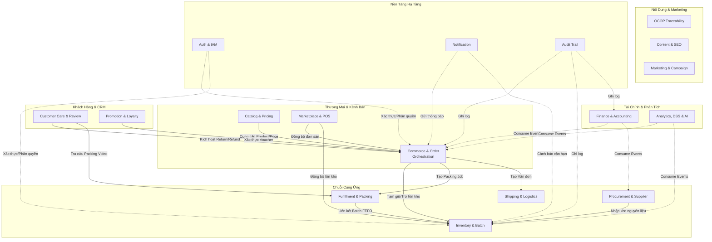

# THIẾT KẾ DOMAIN / SCOPE — PHÂN TÍCH MIỀN NGHIỆP VỤ CHI TIẾT

## HỆ SINH THÁI THƯƠNG MẠI ĐIỆN TỬ ĐA KÊNH & HỖ TRỢ QUYẾT ĐỊNH CHO OCOP HUẾ (MÈ XỬNG O MẠ)

**Phiên bản:** 1.0
**Loại tài liệu:** Domain Design / Scope Analysis
**Yêu cầu đầu vào:** Product Backlog v3.0, Functional Requirements, Epic Map
**Ngày tạo:** 2026-09-12
**Trạng thái:** Bản nháp — Có thể cập nhật khi User Story được hoàn thiện thêm

---

## MỤC LỤC

1. [Mục Đích &amp; Quy Trình Thực Hiện](#1-mục-đích--quy-trình-thực-hiện)
2. [Phương Pháp Luận Khám Phá Domain](#2-phương-pháp-luận-khám-phá-domain)
3. [Domain Map — Bản Đồ Miền Nghiệp Vụ Toàn Cảnh](#3-domain-map--bản-đồ-miền-nghiệp-vụ-toàn-cảnh)
4. [Chi Tiết Từng Domain — Phạm Vi &amp; Trách Nhiệm](#5-chi-tiết-từng-domain--phạm-vi--trách-nhiệm)
5. [Ma Trận Ánh Xạ Domain ↔ Epic ↔ FR](#6-ma-trận-ánh-xạ-domain--epic--fr)
6. [Quan Hệ Phụ Thuộc Giữa Các Domain](#7-quan-hệ-phụ-thuộc-giữa-các-domain)
7. [Lưu Ý Khi Cập Nhật](#8-lưu-ý-khi-cập-nhật)

---

## 1. MỤC ĐÍCH & QUY TRÌNH THỰC HIỆN

### 1.1. Mục Đích Tài Liệu

Tài liệu này thực hiện bước **Thiết kế Domain / Scope** trong quy trình kiến trúc, nhằm:

- **Xác định** các vùng nghiệp vụ chính (Domain) của hệ sinh thái Mè Xửng O Mạ.
- **Xác định phạm vi trách nhiệm** nghiệp vụ cụ thể của từng Domain, bao gồm những gì thuộc về Domain đó và những gì **không thuộc** (Boundary).
- **Thiết lập cơ sở** cho các bước tiếp theo: Bounded Context Discovery, Aggregate Design, Context Mapping, Service Boundary Evaluation.

### 1.2. Vị Trí Trong Quy Trình Kiến Trúc

```text
BUSINESS GOALS & CONSTRAINTS (01_Product_Backlog.md)
    ↓
REQUIREMENT / PRODUCT BACKLOG (01_Product_Backlog.md, 04_Functional_Requirements.md)
    ↓
╔═══════════════════════════════════════════════════════════╗
║  ★ THIẾT KẾ DOMAIN / SCOPE (TÀI LIỆU NÀY)  ★          ║
║    • Domain Map                                          ║
║    • Phạm vi & Trách nhiệm từng Domain                   ║
╚═══════════════════════════════════════════════════════════╝
    ↓
BOUNDED CONTEXT DISCOVERY & UBIQUITOUS LANGUAGE (system_design.md §6)
    ↓
DOMAIN MODEL & AGGREGATES (system_design.md §7)
    ↓
CONTEXT MAPPING & SERVICE BOUNDARIES (system_design.md §8-10)
    ↓
TECHNICAL ARCHITECTURE & IMPLEMENTATION
```

> [!NOTE]
> Tài liệu này **không bắt buộc phải chờ** toàn bộ User Story hoàn thành 100%. Các Domain được xác định dựa trên Epic Map và Business Rules đã đủ rõ ràng. Khi User Story mới được bổ sung hoặc hoàn thiện, tài liệu sẽ được cập nhật tương ứng.

---

## 2. PHƯƠNG PHÁP LUẬN KHÁM PHÁ DOMAIN

### 2.1. Chuỗi Suy Luận Chiến Lược

Các Domain được khám phá thông qua chuỗi suy luận:

$$
\text{Business Goals} \longrightarrow \text{Business Processes (Quy trình E2E)} \longrightarrow \text{Capabilities (Năng lực)} \longrightarrow \text{Domains \& Subdomains}
$$

### 2.3. Nguồn Dữ Liệu Đầu Vào

| Nguồn                                   | Trạng thái           | Vai trò                                    |
| :--------------------------------------- | :--------------------- | :------------------------------------------ |
| Product Backlog v3.0 (~170 User Stories) | ✅ Bản nháp đủ rõ | Xác định Actor, Business Rules, Epic Map |
| Functional Requirements (31 FR)          | ✅ Hoàn thành        | Ánh xạ FR → Domain                       |
| Epic Details (28 Epic files)             | ✅ Có sẵn            | Chi tiết Acceptance Criteria từng Epic    |
| Business Rules (BR-AUTH → BR-AUDIT)     | ✅ Hoàn thành        | Ràng buộc nghiệp vụ bất biến          |

---

## 3. DOMAIN MAP — BẢN ĐỒ MIỀN NGHIỆP VỤ TOÀN CẢNH

### 3.1. Bản Đồ Tổng Quan

```mermaid
graph TB
    subgraph ECOSYSTEM["HỆ SINH THÁI MÈ XỬNG O MẠ"]
        direction TB

        subgraph S_SUPPLY["Chuỗi Cung Ứng"]
            direction TB
            D1["<b>Inventory & Batch<br/>Management</b><br/>(Tồn kho, FEFO, Batch/Lot)"]
            D2["<b>Fulfillment &<br/>Packing Evidence</b><br/>(Đóng gói, Video bằng chứng)"]
            D8["<b>Procurement<br/>& Supplier</b>"]
            D12["<b>Shipping<br/>& Logistics</b>"]
        end

        subgraph S_COMMERCE["Thương Mại & Kênh Bán"]
            direction TB
            D4["<b>Omnichannel Commerce<br/>& Order Orchestration</b><br/>(Đơn hàng đa kênh, Saga)"]
            D5["<b>Catalog &<br/>Pricing</b>"]
            D13["<b>Marketplace<br/>& Offline POS</b>"]
        end

        subgraph S_CUSTOMER["Khách Hàng & CRM"]
            direction TB
            D6["<b>Customer Care<br/>& Review</b>"]
            D7["<b>Promotion<br/>& Loyalty</b>"]
            D15["<b>User & Customer<br/>Profile</b>"]
        end

        subgraph S_MARKETING["Nội Dung & Marketing"]
            direction TB
            D3["<b>OCOP Heritage<br/>Traceability</b><br/>(Truy xuất nguồn gốc, QR Story)"]
            D10["<b>Content<br/>& SEO</b>"]
            D14["<b>Marketing &<br/>Campaign</b>"]
        end

        subgraph S_FINANCE["Tài Chính & Phân Tích"]
            direction TB
            D9["<b>Finance &<br/>Accounting</b>"]
            D11["<b>Analytics,<br/>DSS & AI</b>"]
        end

        subgraph S_PLATFORM["Nền Tảng Hạ Tầng"]
            direction TB
            D16["<b>Authentication<br/>& IAM</b>"]
            D17["<b>Notification<br/>Dispatcher</b>"]
            D18["<b>Audit Trail<br/>& Compliance</b>"]
        end
    end
```



### 3.2. Danh Mục 18 Domain

| # | Tên Domain                                | Nhóm Nghiệp Vụ              |
| :-: | :----------------------------------------- | :----------------------------- |
| 1 | Inventory & Batch Management               | Chuỗi Cung Ứng               |
| 2 | Fulfillment & Packing Evidence             | Chuỗi Cung Ứng               |
| 3 | OCOP Heritage Traceability                 | Di Sản & Minh Bạch           |
| 4 | Omnichannel Commerce & Order Orchestration | Thương Mại                  |
| 5 | Catalog & Pricing                          | Thương Mại                  |
| 6 | Customer Care & Review                     | Khách Hàng                   |
| 7 | Promotion & Loyalty                        | Khách Hàng                   |
| 8 | Procurement & Supplier                     | Chuỗi Cung Ứng               |
| 9 | Finance & Accounting                       | Tài Chính                    |
| 10 | Content & SEO                              | Nội Dung & Truyền Thông     |
| 11 | Analytics, DSS & AI                        | Phân Tích & Ra Quyết Định |
| 12 | Shipping & Logistics                       | Chuỗi Cung Ứng               |
| 13 | Marketplace & Offline POS                  | Kênh Phân Phối              |
| 14 | Marketing & Campaign                       | Nội Dung & Truyền Thông     |
| 15 | User & Customer Profile                    | Khách Hàng & Nhân Sự       |
| 16 | Authentication & IAM                       | Nền Tảng                     |
| 17 | Notification Dispatcher                    | Nền Tảng                     |
| 18 | Audit Trail & Compliance                   | Nền Tảng                     |

---

## 4. CHI TIẾT TỪNG DOMAIN — PHẠM VI & TRÁCH NHIỆM

---

### DOMAIN 1: Inventory & Batch Management

| Thuộc tính              | Chi tiết                                                                              |
| :------------------------ | :------------------------------------------------------------------------------------- |
| **Nhóm**           | Chuỗi Cung Ứng                                                                       |
| **Epic liên quan** | EPIC 09 — Inventory & Batch                                                           |
| **FR liên quan**   | FR-08 (Inventory), FR-09 (Expiry)                                                      |
| **Business Rules**  | BR-BATCH-01 → BR-BATCH-06, BR-ORDER-02, BR-MKTPLACE-05, BR-MKTPLACE-06, BR-OFFLINE-04 |

#### Phạm vi trách nhiệm (IN Scope):

- ✅ Quản lý tồn kho theo **SKU** (số lượng khả dụng, đã đặt, đã xuất)
- ✅ Quản lý **Batch/Lot**: mã lô, ngày sản xuất, hạn sử dụng, số lượng nhập, số lượng còn lại, nguồn cung cấp
- ✅ Cơ chế **FEFO (First Expired, First Out)**: tự động phân bổ xuất kho ưu tiên lô gần hạn
- ✅ **Tạm giữ tồn kho** (Stock Reservation) với TTL 15 phút cho checkout
- ✅ **Chống bán vượt (Anti-overselling)**: bảo vệ tồn kho khả dụng ≥ 0 trong mọi giao dịch đồng thời đa kênh
- ✅ Nhập kho, xuất kho, điều chỉnh tồn kho (hàng hỏng, thất thoát)
- ✅ Cảnh báo **sản phẩm cận hạn sử dụng** (< 45 ngày)
- ✅ Cấm xuất bán sản phẩm **đã hết hạn**
- ✅ Phát Domain Event khi tồn kho thay đổi (`StockLevelChangedEvent`, `ExpiryWarningEvent`)

#### Ngoài phạm vi (OUT of Scope):

- ❌ Quản lý thông tin sản phẩm (tên, mô tả, hình ảnh) → thuộc **Catalog & Pricing**
- ❌ Quản lý hồ sơ nhà cung cấp, đơn đặt mua nguyên liệu → thuộc **Procurement & Supplier**
- ❌ Quy trình đóng gói kiện hàng → thuộc **Fulfillment & Packing Evidence**
- ❌ Tạo vận đơn giao hàng → thuộc **Shipping & Logistics**

#### Actors chính:

`Warehouse Staff (ACT-06)`, `Supply Manager (ACT-15)`, `Sales Manager (ACT-12)`

---

### DOMAIN 2: Fulfillment & Packing Evidence

| Thuộc tính              | Chi tiết                              |
| :------------------------ | :------------------------------------- |
| **Nhóm**           | Chuỗi Cung Ứng                       |
| **Epic liên quan** | EPIC 10 — Packing & Fulfillment       |
| **FR liên quan**   | FR-10 (Packing), FR-11 (Packing Video) |
| **Business Rules**  | BR-PACK-01 → BR-PACK-05               |

#### Phạm vi trách nhiệm (IN Scope):

- ✅ Quản lý danh sách đơn hàng cần đóng gói (Packing Queue)
- ✅ Phân công nhân viên đóng gói
- ✅ Kiểm tra SKU, số lượng trước khi đóng gói (Verification Checklist)
- ✅ **Quay video đóng gói** và liên kết với Order/Shipment (Packing Evidence)
- ✅ Quản lý tem niêm phong kiện hàng (Seal Tag)
- ✅ Kiểm soát quyền truy cập video (**Pre-signed URL TTL 15 phút**)
- ✅ Ưu tiên đóng gói theo thời hạn giao hàng
- ✅ Xác nhận hoàn thành đóng gói, chuyển sang công đoạn giao hàng
- ✅ In phiếu xuất kho, phiếu giao hàng

#### Ngoài phạm vi (OUT of Scope):

- ❌ Quản lý tồn kho, Batch/Lot → thuộc **Inventory & Batch**
- ❌ Tạo vận đơn, tracking giao hàng → thuộc **Shipping & Logistics**
- ❌ Xử lý khiếu nại, đổi trả → thuộc **Customer Care & Review**

#### Actors chính:

`Packing Staff (ACT-07)`, `Admin/Manager (ACT-12, ACT-17)`, `Customer Service (ACT-11)`

---

### DOMAIN 3: OCOP Heritage Traceability

| Thuộc tính              | Chi tiết                                 |
| :------------------------ | :---------------------------------------- |
| **Nhóm**           | Di Sản & Minh Bạch                      |
| **Epic liên quan** | EPIC 19 — OCOP Traceability              |
| **FR liên quan**   | FR-20 (OCOP Traceability)                 |
| **Business Rules**  | (Ràng buộc minh bạch nguồn gốc OCOP) |

#### Phạm vi trách nhiệm (IN Scope):

- ✅ Quản lý thông tin **nguồn gốc sản phẩm/lô hàng**: vùng nguyên liệu, nhà sản xuất, quy trình sản xuất
- ✅ Quản lý **chứng nhận OCOP** và các chứng nhận liên quan
- ✅ Phát hành và quản lý **mã QR Story** cho từng lô hàng
- ✅ Cung cấp trang truy xuất nguồn gốc cho người tiêu dùng quét QR
- ✅ Cập nhật thông tin nhà cung cấp/nguyên liệu
- ✅ Kiểm tra và phê duyệt dữ liệu nguồn gốc trước khi công khai
- ✅ Liên kết với Cổng thông tin truy xuất nguồn gốc quốc gia (EXT-10)

#### Ngoài phạm vi (OUT of Scope):

- ❌ Quản lý hồ sơ nhà cung cấp (thông tin hợp đồng, giá cả) → thuộc **Procurement & Supplier**
- ❌ Quản lý Batch/Lot về mặt số lượng → thuộc **Inventory & Batch**
- ❌ Bài viết văn hóa Huế, SEO → thuộc **Content & SEO**

#### Actors chính:

`Customer (ACT-02)`, `Manager (ACT-12, ACT-15)`, `Offline Customer (ACT-05)`

---

### DOMAIN 4: Omnichannel Commerce & Order Orchestration

| Thuộc tính              | Chi tiết                                                                                                |
| :------------------------ | :------------------------------------------------------------------------------------------------------- |
| **Nhóm**           | Thương Mại                                                                                            |
| **Epic liên quan** | EPIC 05 (Cart), EPIC 06 (Checkout), EPIC 07 (Payment), EPIC 08 (Order), EPIC 18 (B2B), EPIC 26 (Gifting) |
| **FR liên quan**   | FR-05 (Cart & Checkout), FR-06 (Payment & Refund), FR-07 (Order), FR-19 (B2B), FR-28 (Gifting)           |
| **Business Rules**  | BR-ORDER-01 → BR-ORDER-05                                                                               |

#### Phạm vi trách nhiệm (IN Scope):

- ✅ **Giỏ hàng** (Cart): thêm, sửa, xóa sản phẩm, tính tạm tổng
- ✅ **Checkout**: nhập địa chỉ, chọn vận chuyển, áp dụng voucher, tạm giữ tồn kho
- ✅ **Thanh toán**: tích hợp VietQR, COD; xử lý webhook xác nhận; đối soát giao dịch
- ✅ **Vòng đời đơn hàng**: PENDING_PAYMENT → PAID → CONFIRMED → PROCESSING → PACKED → SHIPPED → DELIVERED → COMPLETED
- ✅ **Saga Orchestration**: điều phối giao dịch phân tán giữa Inventory, Payment, Fulfillment, Shipping
- ✅ **B2B Sales**: báo giá (Quotation), đơn sỉ, in logo doanh nghiệp, chính sách công nợ
- ✅ **Gifting Experience**: gửi quà hộ, ẩn giá, đính kèm thiệp chúc mừng
- ✅ Hủy đơn trong thời gian cho phép
- ✅ Phát Domain Events: `OrderPlacedEvent`, `OrderPaidEvent`, `OrderCancelledEvent`

#### Ngoài phạm vi (OUT of Scope):

- ❌ Quản lý thông tin sản phẩm → thuộc **Catalog & Pricing**
- ❌ Quản lý tồn kho, Batch → thuộc **Inventory & Batch**
- ❌ Quy trình đóng gói → thuộc **Fulfillment & Packing Evidence**
- ❌ Giao hàng, tracking → thuộc **Shipping & Logistics**
- ❌ Chương trình khuyến mãi, tạo coupon → thuộc **Promotion & Loyalty**
- ❌ Xử lý đổi trả/hoàn tiền (quy trình nghiệp vụ) → thuộc **Customer Care & Review**

#### Actors chính:

`Guest (ACT-01)`, `Customer (ACT-02)`, `B2B Customer (ACT-03)`, `Sales Manager (ACT-12)`, `Accountant (ACT-19)`

---

### DOMAIN 5: Catalog & Pricing

| Thuộc tính              | Chi tiết                                                     |
| :------------------------ | :------------------------------------------------------------ |
| **Epic liên quan** | EPIC 03 (Product Discovery), EPIC 04 (Product, Variant & SKU) |
| **FR liên quan**   | FR-04 (Product & SKU), FR-31 (Product Discovery & AI)         |
| **Business Rules**  | BR-PROD-01 → BR-PROD-04                                      |

#### Phạm vi trách nhiệm:

- ✅ Quản lý **Product**: tên, mô tả, thành phần, hướng dẫn bảo quản, hình ảnh
- ✅ Quản lý **Category** (danh mục sản phẩm)
- ✅ Quản lý **Variant/SKU**: khối lượng, hương vị, quy cách đóng gói
- ✅ Quản lý **giá bán theo SKU**, giá đa kênh (Website, Shopee, Offline, B2B)
- ✅ Quản lý trạng thái sản phẩm (đang bán, tạm ngừng, ngừng kinh doanh)
- ✅ Tìm kiếm sản phẩm (Full-text search, bộ lọc nâng cao)
- ✅ Sản phẩm bán chạy, sản phẩm đề xuất
- ✅ AI Product Search Assistant & Recommendation (khi khả dụng)
- ✅ Phê duyệt giá và thông tin sản phẩm trước khi công khai

#### Ngoài phạm vi:

- ❌ Số lượng tồn kho → **Inventory & Batch**
- ❌ Ngày sản xuất / Hạn sử dụng → **Inventory & Batch**
- ❌ SEO metadata → **Content & SEO**

#### Actors chính:

`Customer (ACT-01, ACT-02)`, `Sales Manager (ACT-12)`

---

### DOMAIN 6: Customer Care & Review

| Thuộc tính              | Chi tiết                                                                                |
| :------------------------ | :--------------------------------------------------------------------------------------- |
| **Epic liên quan** | EPIC 14 (Return/Refund/Complaint), EPIC 15 (Review & Rating), EPIC 16 (Customer Service) |
| **FR liên quan**   | FR-15 (Customer Service), FR-16 (Review)                                                 |
| **Business Rules**  | BR-REVIEW-01 → BR-REVIEW-06, BR-REFUND-01 → BR-REFUND-04                               |

#### Phạm vi trách nhiệm:

- ✅ **Ticket & hỗ trợ khách hàng**: tạo câu hỏi, theo dõi SLA, lịch sử trao đổi
- ✅ **Khiếu nại**: tiếp nhận, đính kèm bằng chứng (ảnh/video), đối chiếu packing video
- ✅ **Đổi/trả hàng**: State Machine (RETURN_REQUESTED → REVIEWING → APPROVED/REJECTED → RETURNED → REFUNDED)
- ✅ **Hoàn tiền (Refund)**: toàn phần / một phần; chỉ Sales Manager trở lên được duyệt
- ✅ **Verified Review**: chỉ khách đã mua mới được đánh giá; 1-5 sao; ảnh thực tế
- ✅ Trả lời (Reply) đánh giá; chỉnh sửa đánh giá trong 30 ngày
- ✅ Quản lý đánh giá vi phạm
- ✅ AI Customer Support Assistant & Internal Knowledge Assistant (khi khả dụng)
- ✅ Cảnh báo khiếu nại chưa xử lý

#### Ngoài phạm vi:

- ❌ Vòng đời đơn hàng → **Order Orchestration**
- ❌ Xử lý thanh toán hoàn tiền (API ngân hàng) → **Order Orchestration / Payment**

#### Actors chính:

`Customer (ACT-02)`, `Customer Service (ACT-11)`, `Sales Manager (ACT-12)`

---

### DOMAIN 7: Promotion & Loyalty

| Thuộc tính              | Chi tiết                          |
| :------------------------ | :--------------------------------- |
| **Epic liên quan** | EPIC 17 — Promotion & Loyalty     |
| **FR liên quan**   | FR-17 (Promotion), FR-18 (Loyalty) |

#### Phạm vi trách nhiệm:

- ✅ Quản lý **Coupon/Mã giảm giá**: điều kiện áp dụng, hạn mức, thời hạn
- ✅ Quản lý **Discount**: giảm giá theo sản phẩm, danh mục, đơn hàng
- ✅ Quản lý **Combo sản phẩm** (giỏ quà Tết)
- ✅ Hiển thị chương trình khuyến mãi đang áp dụng
- ✅ **Loyalty Points**: tích điểm sau mỗi đơn hàng, đổi điểm thành ưu đãi
- ✅ **Reorder**: đặt lại sản phẩm từ đơn hàng cũ
- ✅ Xác thực voucher tại checkout

#### Ngoài phạm vi:

- ❌ Chiến dịch Marketing → **Marketing & Campaign**
- ❌ Quy trình checkout → **Order Orchestration**

#### Actors chính:

`Customer (ACT-02)`, `Sales Manager (ACT-12)`

---

### DOMAIN 8: Procurement & Supplier

| Thuộc tính              | Chi tiết                                    |
| :------------------------ | :------------------------------------------- |
| **Epic liên quan** | EPIC 27 — Procurement & Supplier Management |
| **FR liên quan**   | FR-29 (Procurement)                          |

#### Phạm vi trách nhiệm:

- ✅ Quản lý **hồ sơ nhà cung cấp** (nông dân, hợp tác xã, hộ kinh doanh OCOP): tên, địa chỉ, hợp đồng, chính sách giá
- ✅ Tạo **Đơn đặt mua (Purchase Order - PO)** gửi nhà cung cấp
- ✅ **Lập kế hoạch sản xuất/nhập hàng** dựa trên dự báo nhu cầu
- ✅ **Đối chiếu nhận hàng** (PO Receiving): cân đo, kiểm tra độ ẩm, xác nhận số lượng thực nhận
- ✅ Phát Domain Event: `GoodsReceivedEvent`

#### Ngoài phạm vi:

- ❌ Quản lý Batch/Lot sau khi nhập kho → **Inventory & Batch**
- ❌ Thông tin nguồn gốc OCOP → **OCOP Heritage Traceability**
- ❌ Hạch toán công nợ nhà cung cấp → **Finance & Accounting**

#### Actors chính:

`Supply Manager (ACT-15)`, `Warehouse Staff (ACT-06)`

---

### DOMAIN 9: Finance & Accounting

| Thuộc tính              | Chi tiết                               |
| :------------------------ | :-------------------------------------- |
| **Epic liên quan** | EPIC 24 — Finance & Business Analytics |
| **FR liên quan**   | FR-24 (Finance)                         |

#### Phạm vi trách nhiệm:

- ✅ Báo cáo **doanh thu** theo ngày/tháng/năm, theo kênh, theo khu vực, theo sản phẩm
- ✅ Báo cáo **chi phí bán hàng** và vận hành
- ✅ Báo cáo **lợi nhuận** theo sản phẩm
- ✅ **Đối soát giao dịch** (Payment Reconciliation): đối soát thanh toán, công nợ 3PL, phí sàn TMĐT
- ✅ **Hạch toán kế toán**: ghi nhận doanh thu, giảm trừ doanh thu (hoàn tiền), thuế GTGT
- ✅ Quản lý **công nợ phải thu** (B2B) và **phải trả** (nhà cung cấp)
- ✅ Kết nối **hóa đơn điện tử VAT** (EXT-11: MISA, VNPT, Viettel Invoice)
- ✅ Xuất báo cáo tài chính/kinh doanh

#### Ngoài phạm vi:

- ❌ Xử lý thanh toán trực tuyến (VietQR, COD) → **Order Orchestration**
- ❌ Phân tích dữ liệu lớn, dự báo → **Analytics, DSS & AI**

#### Actors chính:

`Accountant (ACT-19)`, `Executive (ACT-16)`

---

### DOMAIN 10: Content & SEO

| Thuộc tính              | Chi tiết                    |
| :------------------------ | :--------------------------- |
| **Epic liên quan** | EPIC 20 — Content & SEO     |
| **FR liên quan**   | FR-21 (Content), FR-22 (SEO) |

#### Phạm vi trách nhiệm:

- ✅ Quản lý **bài viết** (CRUD): câu chuyện văn hóa Huế, thương hiệu
- ✅ Quản lý **hình ảnh/video** trong bài viết
- ✅ Phê duyệt nội dung trước khi xuất bản
- ✅ Tối ưu **SEO**: Meta Title, Meta Description, URL thân thiện, Schema.org, SSR
- ✅ SEO cho cả Product lẫn Content
- ✅ AI Content Assistant (khi khả dụng): gợi ý tiêu đề, mô tả, outline bài viết

#### Ngoài phạm vi:

- ❌ Quản lý thông tin sản phẩm → **Catalog & Pricing**
- ❌ Chiến dịch Marketing → **Marketing & Campaign**
- ❌ Truy xuất nguồn gốc OCOP → **OCOP Heritage Traceability**

#### Actors chính:

`Content Manager (ACT-13)`

---

### DOMAIN 11: Analytics, DSS & AI

| Thuộc tính              | Chi tiết                           |
| :------------------------ | :---------------------------------- |
| **Epic liên quan** | EPIC 25 — Customer Analytics & DSS |
| **FR liên quan**   | FR-25 (Analytics), FR-26 (DSS)      |

> [!TIP]
> Domain này mang tính **Strategic Data** — tuy không trực tiếp tạo lợi thế cạnh tranh nghiệp vụ, nhưng cung cấp thông tin chiến lược cho ban lãnh đạo ra quyết định, gián tiếp thúc đẩy Core Domain.

#### Phạm vi trách nhiệm:

- ✅ **Dashboard tổng quan**: doanh thu, đơn hàng, khách hàng, tồn kho, lợi nhuận
- ✅ **RFM Segmentation**: phân nhóm khách hàng (trung thành, tiềm năng, nguy cơ rời bỏ)
- ✅ **Customer Churn Detection**: phát hiện khách hàng có nguy cơ không mua lại
- ✅ **Product Performance**: bán chạy, bán chậm, xu hướng doanh số
- ✅ **Sales Velocity**: tốc độ tiêu thụ từng SKU → phục vụ kế hoạch sản xuất
- ✅ **Demand Forecasting**: dự báo nhu cầu sản phẩm (mùa Tết)
- ✅ **Expiry Risk Analysis**: dự báo lượng hàng có nguy cơ hết hạn
- ✅ **Product Association**: sản phẩm thường được mua cùng nhau → xây dựng Combo
- ✅ **Seasonal Analysis**: phân tích nhu cầu theo mùa, lễ hội
- ✅ **Strategic Recommendation**: khuyến nghị dựa trên dữ liệu
- ✅ Tích hợp GA4 (EXT-07)

#### Ngoài phạm vi:

- ❌ Xử lý giao dịch mua bán → **Order Orchestration**
- ❌ Quản lý tồn kho → **Inventory & Batch**
- ❌ Chiến dịch Marketing → **Marketing & Campaign**

#### Actors chính:

`Executive (ACT-16)`, `Supply Manager (ACT-15)`, `Marketing Staff (ACT-14)`, `Sales Manager (ACT-12)`

---

### DOMAIN 12: Shipping & Logistics

| Thuộc tính              | Chi tiết                      |
| :------------------------ | :----------------------------- |
| **Epic liên quan** | EPIC 11 — Shipping & Delivery |
| **FR liên quan**   | FR-12 (Logistics)              |

#### Phạm vi trách nhiệm:

- ✅ Tạo **vận đơn** (Waybill) cho đơn hàng
- ✅ Đẩy đơn sang **đơn vị vận chuyển 3PL** (GHN, ViettelPost)
- ✅ Tính **phí vận chuyển** theo khối lượng và địa chỉ
- ✅ **Tracking** trạng thái giao hàng (đồng bộ webhook từ 3PL)
- ✅ Quản lý giao hàng **nội bộ** (Delivery Staff)
- ✅ Xem tỷ lệ giao thành công/thất bại
- ✅ Đối soát cước phí vận chuyển

#### Ngoài phạm vi:

- ❌ Đóng gói → **Fulfillment & Packing Evidence**
- ❌ Quản lý đơn hàng → **Order Orchestration**

#### Actors chính:

`Delivery Staff (ACT-08)`, `Customer (ACT-02)`, `Manager`

---

### DOMAIN 13: Marketplace & Offline POS

| Thuộc tính              | Chi tiết                                                        |
| :------------------------ | :--------------------------------------------------------------- |
| **Epic liên quan** | EPIC 12 (Marketplace), EPIC 13 (Offline Sales)                   |
| **FR liên quan**   | FR-13 (Marketplace), FR-14 (Offline Sales)                       |
| **Business Rules**  | BR-MKTPLACE-01 → BR-MKTPLACE-07, BR-OFFLINE-01 → BR-OFFLINE-07 |

#### Phạm vi trách nhiệm:

**Marketplace:**

- ✅ Đồng bộ hai chiều đơn hàng Shopee/TikTok (Inbound & Outbound)
- ✅ **Anti-Corruption Layer (ACL)**: chuẩn hóa dữ liệu dị biệt từ sàn sang mô hình nội bộ
- ✅ Quản lý SKU Mapping (mã sàn ↔ mã nội bộ)
- ✅ Đối soát doanh thu, phí sàn
- ✅ Phát hiện lỗi đồng bộ
- ✅ Lưu mã đơn hàng gốc Marketplace (chống trùng)

**Offline POS:**

- ✅ Quản lý **điểm bán** (cửa hàng, chợ, đại lý)
- ✅ Cấp hàng từ kho cho nhân viên bán offline
- ✅ Ghi nhận **bán hàng, tồn, hàng hỏng, hàng trả** theo ca/ngày
- ✅ Quét mã vạch, in hóa đơn quầy
- ✅ Đối soát tiền mặt/chuyển khoản cuối ca
- ✅ Mỗi giao dịch offline → tạo Order trên hệ thống

#### Ngoài phạm vi:

- ❌ Quản lý tồn kho trung tâm → **Inventory & Batch**
- ❌ Vòng đời đơn hàng nội bộ → **Order Orchestration**

#### Actors chính:

`Marketplace Operator (ACT-09)`, `Offline Sales Staff (ACT-10)`, `Sales Manager (ACT-12)`

---

### DOMAIN 14: Marketing & Campaign

| Thuộc tính              | Chi tiết            |
| :------------------------ | :------------------- |
| **Epic liên quan** | EPIC 21 — Marketing |
| **FR liên quan**   | FR-23 (Marketing)    |

#### Phạm vi trách nhiệm:

- ✅ Lập kế hoạch Marketing theo chiến dịch
- ✅ Tạo nội dung (video, bài viết, chương trình truyền thông) cho chiến dịch
- ✅ Phê duyệt kế hoạch Marketing
- ✅ Theo dõi **KPI** chiến dịch sau triển khai
- ✅ Đánh giá hiệu quả kênh Marketing
- ✅ So sánh chi phí Marketing vs doanh thu (ROI)

#### Ngoài phạm vi:

- ❌ Quản lý coupon, khuyến mãi → **Promotion & Loyalty**
- ❌ Quản lý bài viết SEO → **Content & SEO**

#### Actors chính:

`Marketing Staff (ACT-14)`, `Executive (ACT-16)`

---

### DOMAIN 15: User & Customer Profile

| Thuộc tính              | Chi tiết                                                        |
| :------------------------ | :--------------------------------------------------------------- |
| **Epic liên quan** | EPIC 02 — Customer & Employee Profile                           |
| **FR liên quan**   | FR-02 (HR Profile)                                               |
| **Business Rules**  | (Quản lý thông tin nghiệp vụ của khách hàng & nhân sự) |

> [!NOTE]
> Domain này **tách riêng** khỏi Authentication & IAM vì hồ sơ khách hàng (họ tên, SĐT, địa chỉ giao hàng) là **dữ liệu nghiệp vụ** phục vụ mua hàng, giao hàng, chăm sóc khách hàng — không phải dữ liệu xác thực (username, password, token, role).

#### Phạm vi trách nhiệm:

- ✅ Quản lý **hồ sơ khách hàng**: họ tên, số điện thoại, email, thông tin cá nhân
- ✅ Quản lý **nhiều địa chỉ giao hàng** (đặt hàng nhanh)
- ✅ Quản lý **hồ sơ nhân sự** (HR Profile): phòng ban, hợp đồng, chức vụ
- ✅ Trạng thái tài khoản khách hàng (xem, xử lý khi cần)
- ✅ Liên kết đơn hàng Guest với tài khoản mới đăng ký

#### Ngoài phạm vi:

- ❌ Đăng nhập / đăng xuất / mật khẩu / token → **Authentication & IAM**
- ❌ Role / Permission / RBAC → **Authentication & IAM**
- ❌ Ticket hỗ trợ khách hàng → **Customer Care & Review**
- ❌ Phân nhóm khách hàng (RFM) → **Analytics, DSS & AI**

#### Actors chính:

`Customer (ACT-02)`, `Customer Service (ACT-11)`, `System Admin (ACT-17)`

---

### DOMAIN 16: Authentication & IAM

| Thuộc tính              | Chi tiết                                                                          |
| :------------------------ | :--------------------------------------------------------------------------------- |
| **Epic liên quan** | EPIC 01 (Authentication & Identity), EPIC 22 (User/Role/Permission Administration) |
| **FR liên quan**   | FR-01 (Authentication), FR-03 (Role & Permission)                                  |
| **Business Rules**  | BR-AUTH-01 → BR-AUTH-04                                                           |

#### Phạm vi trách nhiệm:

- ✅ **Đăng ký tài khoản** (Customer & Employee)
- ✅ **Đăng nhập / Đăng xuất**
- ✅ **Guest Checkout** (mua hàng không cần tài khoản)
- ✅ **Social Login**: Google, Facebook, Zalo (EXT-05)
- ✅ **Khôi phục mật khẩu** / OTP
- ✅ **RBAC**: tạo Role, Permission, gán Role cho nhân viên
- ✅ Quản lý **vòng đời tài khoản** (tạo, khóa, mở khóa)
- ✅ Phát hành và xác thực **JWT Token**

#### Ngoài phạm vi:

- ❌ Hồ sơ khách hàng (họ tên, SĐT, địa chỉ) → **User & Customer Profile**
- ❌ Hồ sơ nhân sự (phòng ban, hợp đồng) → **User & Customer Profile**
- ❌ Logic nghiệp vụ bán hàng → **Order Orchestration**
- ❌ Kiểm toán → **Audit Trail**

#### Actors chính:

`Guest (ACT-01)`, `Customer (ACT-02)`, `System Admin (ACT-17)`

---

### DOMAIN 17: Notification Dispatcher

| Thuộc tính              | Chi tiết                                  |
| :------------------------ | :----------------------------------------- |
| **Epic liên quan** | EPIC 28 — Omnichannel Notification System |
| **FR liên quan**   | FR-30 (Omnichannel Notification)           |

#### Phạm vi trách nhiệm:

- ✅ Gửi **Email** (xác nhận đơn hàng, OTP, hóa đơn) — qua SendGrid/AWS SES
- ✅ Gửi **SMS / Zalo ZNS** (trạng thái giao hàng) — qua eSMS/Zalo ZNS API
- ✅ Gửi **Push Notification** (Mobile App/Web) — qua Firebase FCM
- ✅ Cảnh báo **nội bộ** (In-app Alert): đơn khẩn, ticket quá hạn SLA, hàng cận hạn
- ✅ Quản lý hàng đợi gửi thông báo
- ✅ DLQ & Retry khi gửi thất bại

#### Ngoài phạm vi:

- ❌ Quyết định **khi nào** gửi thông báo → Domain phát sinh sự kiện (Order, Inventory, CS...)
- ❌ Nội dung nghiệp vụ → Domain phát sinh sự kiện cung cấp payload

#### Actors chính:

`Customer (ACT-02)`, `Nhân viên nội bộ (tất cả)`

---

### DOMAIN 18: Audit Trail & Compliance

| Thuộc tính              | Chi tiết                   |
| :------------------------ | :-------------------------- |
| **Epic liên quan** | EPIC 23 — Audit & Security |
| **FR liên quan**   | FR-27 (Audit)               |
| **Business Rules**  | BR-AUDIT-01 → BR-AUDIT-05  |

#### Phạm vi trách nhiệm:

- ✅ Ghi nhận **Audit Log** cho mọi thao tác nhạy cảm: Who, What, When, Where, Why, Before/After Value
- ✅ Cơ chế **Tamper-Evident** (HMAC-SHA256 Hash Chain): phát hiện can thiệp
- ✅ **Append-Only**: cấm UPDATE/DELETE
- ✅ Tra cứu Audit Log (chỉ Auditor, System Admin)
- ✅ Lưu trữ tối thiểu theo quy định (1 năm hoặc vĩnh viễn)
- ✅ Scheduled Auditor Worker kiểm tra tính liên tục Hash Chain

#### Ngoài phạm vi:

- ❌ Quyết định **thao tác nào** cần audit → Domain phát sinh sự kiện xác định
- ❌ Quản lý Role/Permission → **Authentication & IAM**

#### Actors chính:

`System Administrator (ACT-17)`, `Auditor (ACT-18)`

---

## 5. MA TRẬN ÁNH XẠ DOMAIN ↔ EPIC ↔ FR

Bảng truy xuất đầy đủ từ Domain tới Epic và Functional Requirement:

| Domain                          | Epic(s)                     | FR(s)                             | Phase         |
| :------------------------------ | :-------------------------- | :-------------------------------- | :------------ |
| **Inventory & Batch**     | EPIC 09                     | FR-08, FR-09                      | MVP           |
| **Fulfillment & Packing** | EPIC 10                     | FR-10, FR-11                      | MVP           |
| **OCOP Traceability**     | EPIC 19                     | FR-20                             | MVP           |
| **Commerce & Order**      | EPIC 05, 06, 07, 08, 18, 26 | FR-05, FR-06, FR-07, FR-19, FR-28 | MVP / Phase 2 |
| Catalog & Pricing               | EPIC 03, 04                 | FR-04, FR-31                      | MVP           |
| Customer Care & Review          | EPIC 14, 15, 16             | FR-15, FR-16                      | MVP / Phase 2 |
| Promotion & Loyalty             | EPIC 17                     | FR-17, FR-18                      | Phase 2       |
| Procurement & Supplier          | EPIC 27                     | FR-29                             | Phase 3       |
| Finance & Accounting            | EPIC 24                     | FR-24                             | Phase 3       |
| Content & SEO                   | EPIC 20                     | FR-21, FR-22                      | MVP           |
| Analytics, DSS & AI             | EPIC 25                     | FR-25, FR-26                      | Phase 3       |
| Shipping & Logistics            | EPIC 11                     | FR-12                             | MVP           |
| Marketplace & POS               | EPIC 12, 13                 | FR-13, FR-14                      | Phase 2       |
| Marketing & Campaign            | EPIC 21                     | FR-23                             | Phase 2       |
| User & Customer Profile         | EPIC 02                     | FR-02                             | MVP           |
| Auth & IAM                      | EPIC 01, 22                 | FR-01, FR-03                      | MVP           |
| Notification                    | EPIC 28                     | FR-30                             | Phase 2       |
| Audit Trail                     | EPIC 23                     | FR-27                             | MVP / Phase 2 |

---

## 6. QUAN HỆ PHỤ THUỘC GIỮA CÁC DOMAIN

### 6.1. Sơ Đồ Phụ Thuộc Cấp Cao



### 6.2. Bảng Quan Hệ Phụ Thuộc

| Domain Thượng Nguồn (Upstream) | Domain Hạ Nguồn (Downstream) | Kiểu Quan Hệ    | Mô tả                                  |
| :-------------------------------- | :----------------------------- | :---------------- | :--------------------------------------- |
| Catalog & Pricing                 | Commerce & Order               | OHS/PL            | Cung cấp thông tin sản phẩm, giá    |
| Commerce & Order                  | Inventory & Batch              | Customer-Supplier | Yêu cầu tạm giữ/trừ tồn kho        |
| Commerce & Order                  | Fulfillment & Packing          | Customer-Supplier | Tạo lệnh đóng gói                   |
| Commerce & Order                  | Shipping & Logistics           | Customer-Supplier | Tạo vận đơn                          |
| Marketplace & POS                 | Commerce & Order               | ACL               | Chuẩn hóa đơn sàn → đơn nội bộ |
| Inventory & Batch                 | Marketplace & POS              | Event Publisher   | Phát sự kiện thay đổi tồn kho      |
| Procurement & Supplier            | Inventory & Batch              | Customer-Supplier | Nhập kho nguyên liệu                  |
| Customer Care                     | Commerce & Order               | Downstream        | Kích hoạt Return/Refund                |
| Customer Care                     | Fulfillment & Packing          | Downstream        | Tra cứu video đối chiếu              |
| Commerce & Order                  | Finance & Accounting           | Event Publisher   | Phát sự kiện doanh thu                |
| Commerce & Order                  | Analytics & DSS                | Event Publisher   | Stream dữ liệu phân tích             |
| Tất cả Domain                   | Auth & IAM                     | Cross-cutting     | Xác thực & phân quyền                |
| Tất cả Domain                   | Notification                   | Cross-cutting     | Gửi thông báo                         |
| Tất cả Domain (nhạy cảm)      | Audit Trail                    | Cross-cutting     | Ghi log kiểm toán                      |

---

## 7. LƯU Ý KHI CẬP NHẬT

> [!WARNING]
> **Tài liệu này là bản sống (Living Document).** Khi có thay đổi từ Product Backlog hoặc User Story, cần cập nhật tương ứng.

### Khi nào cần cập nhật tài liệu này:

1. **Thêm Epic mới** → Xác định Epic thuộc Domain nào, hoặc cần tạo Domain mới.
2. **Thay đổi Business Rules** → Kiểm tra ảnh hưởng đến phạm vi trách nhiệm Domain.
3. **Bổ sung/thay đổi Actor** → Cập nhật Actor chính của Domain liên quan.
4. **Tách hoặc gộp Domain** → Cập nhật Domain Map và quan hệ phụ thuộc.

### Checklist trước khi chuyển sang bước tiếp theo (Bounded Context Discovery):

- [ ] Tất cả Epic đã được ánh xạ tới ít nhất 1 Domain
- [ ] Tất cả FR đã được ánh xạ tới ít nhất 1 Domain
- [ ] Mỗi Domain có phạm vi IN/OUT rõ ràng, không chồng chéo
- [ ] Quan hệ phụ thuộc giữa các Domain đã được xác định

---

> **Tài liệu tham chiếu:**
>
> - [Product Backlog v3.0](../01_requirements/01_Product_Backlog.md)
> - [Functional Requirements](../01_requirements/04_Functional_Requirements.md)
> - [System Design](./system_design.md) — §4 (Domain Discovery)
