# KIẾN TRÚC CẤP CAO & QUY CHUẨN GIAO TIẾP TOÀN HỆ THỐNG
## (HIGH-LEVEL DESIGN & DETAILED INTERFACE CONTRACTS SPECIFICATION)

### HỆ SINH THÁI THƯƠNG MẠI ĐIỆN TỬ ĐA KÊNH & CHUỖI CUNG ỨNG ĐẶC SẢN OCOP HUẾ (MÈ XỬNG O MẠ)

---

## MỤC LỤC CHI TIẾT

1. [Tổng Quan Kiến Trúc & Mô Hình 3 Mặt Phẳng (Three Architectural Planes)](#1-tổng-quan-kiến-trúc--mô-hình-3-mặt-phẳng-three-architectural-planes)
   - 1.1. Bản chất cốt lõi: Business Event ≠ Audit Event ≠ Telemetry Signals
   - 1.2. Sơ đồ kiến trúc 3 Mặt phẳng tổng thể
2. [Tầng Biên (North - South): Hệ Thống Giao Tiếp Với Các Loại Client Như Thế Nào?](#2-tầng-biên-north---south-hệ-thống-giao-tiếp-với-các-loại-client-như-thế-nào)
   - 2.1. Web D2C, POS Quầy Xưởng & Web Admin CMS (RESTful over HTTPS)
   - 2.2. Vai trò Gateway: Local JWT Validation & Trusted Context Injection
   - 2.3. Native Mobile App & Lớp Đệm Chuyên Biệt Mobile BFF (GraphQL over HTTPS)
   - 2.4. Sàn Thương Mại Điện Tử Ngoại Vi Shopee / TikTok Shop (Webhook & Open API)
3. [Tầng Nội Bộ (East - West): Các Microservices Giao Tiếp Với Nhau Như Thế Nào?](#3-tầng-nội-bộ-east---west-các-microservices-giao-tiếp-với-nhau-như-thế-nào)
   - 3.1. Khung Chuẩn Hóa 4 Quy Tắc Giao Tiếp (The 4 Communication Patterns Framework)
   - 3.2. Bản Chất Saga Orchestration: Mô Thức Điều Phối Nghiệp Vụ, Không Phải Giao Thức Mạng
   - 3.3. Tách Biệt Ranh Giới Logic Bên Trong Order Service: Order Domain vs Saga Orchestrator
   - 3.4. Mô Hình Hybrid Saga & Nguyên Tắc Tập Trung Hóa Đền Bù (Centralized Compensation)
   - 3.5. Tối Ưu Hóa Phân Quyền: Loại Bỏ Runtime Blocking Dependency Vào Identity Service
   - 3.6. Đánh Giá & Danh Bạ Ma Trận Giao Tiếp Chi Tiết Toàn Bộ 18 Microservices
4. [Diễn Giải Chi Tiết Các Hợp Đồng Đồng Bộ (gRPC Synchronous on Critical Path)](#4-diễn-giải-chi-tiết-các-hợp-đồng-đồng-bộ-grpc-synchronous-on-critical-path)
   - 4.1. Hợp đồng Khóa tồn kho tức thời (`ReserveStock`) giữa Order/Channel và Inventory
   - 4.2. Hợp đồng Giải phóng tồn kho (`ReleaseReservation`) khi hủy đơn hoặc hết hạn
   - 4.3. Hợp đồng Thẩm định giá bán & SKU (`ValidatePriceAndSKU`) giữa Order và Catalog
   - 4.4. Hợp đồng Thẩm định mã giảm giá (`ValidateVoucher`) giữa Order và Promotion
   - 4.5. Hợp đồng Tính cước vận chuyển chuẩn (`CalculateShippingFee`) giữa Order và Shipping
   - 4.6. Hợp đồng Lấy bằng chứng đóng gói Video (`GetPackingVideoUrl`) giữa Care và Fulfillment
   - 4.7. Hợp đồng Thẩm duyệt đặc quyền động (`CheckSpecializedPermission`) giữa Services và Identity
5. [Diễn Giải Chi Tiết Các Hợp Đồng Bất Đồng Bộ (Kafka Domain Events on Workflows)](#5-diễn-giải-chi-tiết-các-hợp-đồng-bất-đồng-bộ-kafka-domain-events-on-workflows)
   - 5.1. Tối thiểu hóa PII trong sự kiện "Đơn hàng đã thanh toán" (`OrderPaidEvent`)
   - 5.2. Phân định dữ liệu: Dữ liệu Nghiệp vụ vs Dữ liệu Kiểm toán vs Dữ liệu Phân tích
   - 5.3. Chuẩn hóa Analytics Ingestion: Bỏ cơ chế Wildcard lắng nghe bừa bãi
   - 5.4. Sự kiện "Đóng gói hoàn tất & Niêm phong" (`PackingCompletedEvent`)
   - 5.5. Sự kiện "Biến động mức tồn kho" (`StockLevelChangedEvent`)
   - 5.6. Sự kiện "Nhập kho nguyên liệu mè/đậu mới" (`GoodsReceivedEvent`)
   - 5.7. Sự kiện "Cảnh báo Lô hàng cận hạn sử dụng FEFO" (`ExpiryWarningEvent`)
   - 5.8. Cơ chế bảo vệ hàng đợi: Retry Topic & Dead Letter Queue (DLQ)
6. [Mặt Phẳng Kiểm Toán Pháp Lý (Audit Plane & Tamper-Evident Architecture)](#6-mặt-phẳng-kiểm-toán-pháp-lý-audit-plane--tamper-evident-architecture)
   - 6.1. Vì sao Audit phải tách rời khỏi Business Transaction Flow?
   - 6.2. Giải quyết bài toán Hash Chain trong Hệ Thống Phân Tán: Entity-Level Chain
   - 6.3. Đối soát toàn vẹn định kỳ: Periodic Merkle Tree Checkpoint & WORM Storage
   - 6.4. Định nghĩa chuẩn xác: Tamper-Evident Audit Trail (Phát hiện can thiệp)
7. [Mặt Phẳng Giám Sát Viễn Trắc (Observability Plane & OpenTelemetry Architecture)](#7-mặt-phẳng-giám-sát-viễn-trắc-observability-plane--opentelemetry-architecture)
   - 7.1. Kiến trúc thu thập Telemetry: Microservices → OTel Collector → Backends
   - 7.2. Bảo toàn chuỗi vết phân tán W3C Trace Context (`traceparent`) qua HTTP, gRPC và Kafka
   - 7.3. Bộ 4 Tín hiệu vàng (Golden Signals) trên Prometheus, Grafana & Jaeger
8. [Hành Trình Thực Tế Của Một Giao Dịch Điển Hình (Story Walkthrough Bằng Lời)](#8-hành-trình-thực-tế-của-một-giao-dịch-điển-hình-story-walkthrough-bằng-lời)
9. [Các Luồng Nghiệp Vụ Mở Rộng & Trọng Yếu Theo Yêu Cầu Đề Bài](#9-các-luồng-nghiệp-vụ-mở-rộng--trọng-yếu-theo-yêu-cầu-đề-bài)
   - 9.1. Luồng Khiếu Nại, Kiểm Định & Hoàn Tiền Phân Tán (Return & Refund Saga - FR-06, FR-15)
   - 9.2. Luồng Trải Nghiệm Tặng Quà Gửi Hộ & In Thiệp Mừng (Gifting Experience - FR-28)
   - 9.3. Luồng Báo Giá Đơn Sỉ & In Logo Hộp Quà Doanh Nghiệp (B2B Corporate Quotation - FR-19)
   - 9.4. Luồng Tích Điểm Thân Thiết Loyalty & Mua Lại Reorder (EPIC 17, FR-18)
   - 9.5. Luồng Tìm Kiếm Thông Minh Elasticsearch & Trợ Lý Gợi Ý Quà Tết AI (AI Discovery & DSS - EPIC 03, FR-31)
10. [Ma Trận Ánh Xạ Truy Xuất Yêu Cầu Toàn Diện (Requirements Traceability Matrix)](#10-ma-trận-ánh-xạ-truy-xuất-yêu-cầu-toàn-diện-requirements-traceability-matrix)
   - 10.1. Ma trận ánh xạ 31 Yêu Cầu Chức Năng (FR-01 đến FR-31)
   - 10.2. Ma trận ánh xạ 11 Yêu Cầu Phi Chức Năng (NFR-01 đến NFR-11)
11. [Phụ Lục Đặc Tả Kỹ Thuật (Technical Contracts & Schemas)](#11-phụ-lục-đặc-tả-kỹ-thuật-technical-contracts--schemas)
   - 11.1. File Protobuf Definitions (`.proto`)
   - 11.2. File Kafka CloudEvents Schemas (JSON)
   - 11.3. File REST & GraphQL Edge Contracts
12. [Tổng Kết Nguyên Tắc Quản Trị Kiến Trúc](#12-tổng-kết-nguyên-tắc-quản-trị-kiến-trúc)

---

## 1. TỔNG QUAN KIẾN TRÚC & MÔ HÌNH 3 MẶT PHẲNG (THREE ARCHITECTURAL PLANES)

Một trong những sai lầm kinh điển khi thiết kế hệ thống Microservices là **gom mọi loại thông điệp vào cùng một tư duy**: *"Cứ có việc gì là Service phát event lên Kafka cho service khác consume"*. Cách tiếp cận này làm mờ nhạt ranh giới trách nhiệm, kéo theo việc rò rỉ dữ liệu nhạy cảm (PII) và biến hệ thống giám sát hoặc kiểm toán thành điểm nghẽn của các giao dịch mua sắm cốt lõi.

Hệ sinh thái Mè Xửng O Mạ tách biệt hoàn toàn kiến trúc thành **3 Mặt Phẳng Độc Lập (Three Architectural Planes)**:

```text
                           MICROSERVICES HỆ THỐNG
                                     │
        ┌────────────────────────────┼────────────────────────────┐
        │                            │                            │
        ▼                            ▼                            ▼
  BUSINESS PLANE                AUDIT PLANE               OBSERVABILITY PLANE
 (Mặt Phẳng Nghiệp Vụ)     (Mặt Phẳng Kiểm Toán Pháp Lý) (Mặt Phẳng Giám Sát Viễn Trắc)
        │                            │                            │
  Domain Events                Audit Events               Telemetry Signals
 (State Transitions)        (Security Evidence)         (Metrics, Traces, Logs)
        │                            │                            │
        ▼                            ▼                            ▼
  Apache Kafka                  Kafka Topic                 OTLP Protocol
 (order.events, etc.)         (audit.events.v1)          (HTTP/gRPC 4317/4318)
        │                            │                            │
        ▼                            ▼                            ▼
  Other Business               MS-18: Audit               OpenTelemetry Collector
    Services                     Service                          │
 (Inventory, Fulfillment,            │                   ┌────────┼────────┐
  Finance, Shipping...)              ▼                   ▼        ▼        ▼
                               Tamper-Evident         Jaeger    Prom    Loki
                                 Store + WORM        (Traces) (Metrics) (Logs)
                               Checkpoint Root           └────────┼────────┘
                                                                  ▼
                                                          Grafana Dashboard
```

### 1.1. Tuyên Ngôn Phân Định Cốt Lõi (Core Axiom) → \mathbf{Business\ Event\ \neq\ Audit\ Event\ \neq\ Telemetry\ Signals\ (Trace\ /\ Metric\ /\ Log)} → - **Business Event (Sự kiện Nghiệp vụ):** Biểu thị một sự thay đổi trạng thái trong vòng đời của thực thể kinh doanh (ví dụ: `OrderPaidEvent`, `StockLevelChangedEvent`). Nó chứa dữ liệu tối thiểu cần thiết để kích hoạt các bước tiếp theo của chuỗi cung ứng.
- **Audit Event (Sự kiện Kiểm toán):** Biểu thị một **Bằng chứng an ninh và pháp lý (Security Evidence)** trả lời câu hỏi: *Ai (Who) đã làm gì (What) vào thời điểm nào (When) ở đâu (Where), trước khi sửa giá trị là bao nhiêu (Before) và sau khi sửa là bao nhiêu (After)?*. Đây là dữ liệu tuân thủ (Compliance), không bao giờ được trở thành điều kiện tiên quyết (Runtime blocking dependency) của luồng mua sắm.
- **Telemetry Signals (Tín hiệu Viễn trắc):** Gồm Metrics (chỉ số CPU, RPS, P95), Traces (cây tiến trình W3C `traceparent`), và Logs (nhật ký debug). Đây là dữ liệu đo lường kỹ thuật, được đẩy thẳng sang bộ thu thập **OpenTelemetry Collector**, tuyệt đối không đi qua Kafka của tầng nghiệp vụ và không dịch vụ nào phải "chờ" giám sát mới được chạy tiếp.

---

### 1.2. Sơ Đồ Kiến Trúc Chi Tiết Của Toàn Bộ Hệ Thống

```mermaid
flowchart TB
    subgraph CLIENT_TIER ["1. TẦNG CLIENTS ĐA KÊNH"]
        WEB_D2C["Web D2C Khách hàng (Next.js)"]
        APP_MOBILE["Native Mobile App (Flutter)"]
        POS_STORE["POS Quầy Xưởng (React Offline-First)"]
        ADMIN_CMS["Web Admin Quản Trị CMS (React)"]
        EXT_MKP["Webhook Sàn TMĐT (Shopee / TikTok)"]
    end

    subgraph EDGE_TIER ["2. TẦNG BIÊN & API GATEWAY"]
        GW["API Gateway (Traefik / Kong)<br/>• TLS Termination • Local JWT Validation via JWKS<br/>• Inject Trusted Context Headers • Global Rate Limiting"]
        BFF_MOBILE["Mobile BFF (GraphQL Server)<br/>Gộp nhiều truy vấn mạng di động"]
    end

    WEB_D2C -->|HTTPS / REST| GW
    APP_MOBILE -->|HTTPS / GraphQL| BFF_MOBILE
    BFF_MOBILE -->|gRPC / REST| GW
    POS_STORE -->|HTTPS / REST| GW
    ADMIN_CMS -->|HTTPS / REST| GW
    EXT_MKP -->|Webhook HTTPS| GW

    subgraph BUSINESS_PLANE ["3. BUSINESS PLANE (MẶT PHẲNG NGHIỆP VỤ - 16 SERVICES)"]
        direction TB
        MS04["<b>MS-04: order-service</b><br/>Port: 8004 | DB: PostgreSQL<br/><i>Saga Coordinator / Checkout Flow</i>"]
        MS01["<b>MS-01: inventory-service</b><br/>Port: 8001 | DB: PG + Redis<br/><i>Anti-Overselling / FEFO Batches</i>"]
        MS02["<b>MS-02: fulfillment-service</b><br/>Port: 8002 | DB: PG + MinIO S3<br/><i>Packing Video / Seal Verification</i>"]
        MS03["<b>MS-03: traceability-service</b><br/>Port: 8003 | DB: PostgreSQL<br/><i>OCOP Heritage QR / Origin Tracking</i>"]
        MS05["<b>MS-05: catalog-service</b><br/>Port: 8005 | DB: PG + ES"]
        MS07["<b>MS-07: promotion-service</b><br/>Port: 8007 | DB: PG + Redis"]
        MS12["<b>MS-12: shipping-service</b><br/>Port: 8012 | DB: PostgreSQL"]
        MS13["<b>MS-13: channel-service</b><br/>Port: 8013 | DB: PostgreSQL"]
        MS06["<b>MS-06: care-service</b><br/>Port: 8006 | DB: MongoDB"]
        MS08["<b>MS-08: procurement-service</b><br/>Port: 8008 | DB: PostgreSQL"]
        MS09["<b>MS-09: finance-service</b><br/>Port: 8009 | DB: PostgreSQL"]
        MS10["<b>MS-10: content-service</b><br/>Port: 8010 | DB: PostgreSQL"]
        MS11["<b>MS-11: analytics-service</b><br/>Port: 8011 | DB: ClickHouse + MongoDB"]
        MS14["<b>MS-14: marketing-service</b><br/>Port: 8014 | DB: PostgreSQL"]
        MS15["<b>MS-15: profile-service</b><br/>Port: 8015 | DB: PostgreSQL"]
        MS16["<b>MS-16: identity-service</b><br/>Port: 8016 | DB: PG + Redis<br/><i>Specialized Authorization Only</i>"]
        MS17["<b>MS-17: notification-service</b><br/>Port: 8017 | DB: Redis Queue"]
    end

    GW -->|"Trusted Context Headers (X-User-*)"| MS04
    GW -->|"Trusted Context Headers (X-User-*)"| MS05
    GW -->|"Trusted Context Headers (X-User-*)"| MS13

    subgraph KAFKA_BUS ["TRỤC XƯƠNG SỐNG SỰ KIỆN DOANH NGHIỆP: APACHE KAFKA"]
        TOPIC_ORDER["topic: order.events.v1"]
        TOPIC_INV["topic: inventory.events.v1"]
        TOPIC_FUL["topic: fulfillment.events.v1"]
        TOPIC_SHIP["topic: shipping.events.v1"]
        TOPIC_CHANNEL["topic: channel.events.v1"]
        TOPIC_AUDIT["topic: audit.events.v1 (Riêng cho Audit)"]
    end

    MS04 <==>|"Transactional Outbox / Consume"| TOPIC_ORDER
    MS01 <==>|"Transactional Outbox / Consume"| TOPIC_INV
    MS02 <==>|"Transactional Outbox / Consume"| TOPIC_FUL
    MS12 <==>|"Transactional Outbox / Consume"| TOPIC_SHIP
    MS13 <==>|"Transactional Outbox / Consume"| TOPIC_CHANNEL

    subgraph AUDIT_PLANE ["4. AUDIT PLANE (MẶT PHẲNG KIỂM TOÁN PHÁP LÝ)"]
        MS18["<b>MS-18: audit-service</b><br/>Port: 8018 | DB: PG Append-Only<br/><i>Entity-Level Hash Chain</i>"]
        WORM_STORE["WORM / Object Lock Storage<br/>(Lưu trữ Merkle Root định kỳ)"]
    end

    TOPIC_AUDIT -->|Subscribe| MS18
    MS18 -->|Hourly Checkpoint| WORM_STORE

    subgraph OBSERVABILITY_PLANE ["5. OBSERVABILITY PLANE (MẶT PHẲNG GIÁM SÁT VIỄN TRẮC)"]
        OTEL_COLLECTOR["<b>OpenTelemetry Collector</b><br/>Nhận Metrics, Traces, Logs qua OTLP"]
        JAEGER["Jaeger<br/>(Distributed Traces)"]
        PROM["Prometheus<br/>(Metrics & Golden Signals)"]
        LOKI["Loki<br/>(Structured Logs)"]
        GRAFANA["<b>Grafana Unified Dashboard</b><br/>(Single Pane of Glass)"]

        OTEL_COLLECTOR --> JAEGER
        OTEL_COLLECTOR --> PROM
        OTEL_COLLECTOR --> LOKI
        JAEGER --> GRAFANA
        PROM --> GRAFANA
        LOKI --> GRAFANA
    end

    MS04 -.->|"OTLP Push (Non-blocking)"| OTEL_COLLECTOR
    MS01 -.->|"OTLP Push (Non-blocking)"| OTEL_COLLECTOR
    MS02 -.->|"OTLP Push (Non-blocking)"| OTEL_COLLECTOR
```



---

## 2. TẦNG BIÊN (NORTH - SOUTH): HỆ THỐNG GIAO TIẾP VỚI CÁC LOẠI CLIENT NHƯ THẾ NÀO?

Giao tiếp North - South (Bắc - Nam) là luồng kết nối giữa các ứng dụng bên ngoài (Client) đi vào hạ tầng Backend của hệ thống Mè Xửng O Mạ. Mọi kết nối bắt buộc phải đi qua **API Gateway** đóng vai trò cổng kiểm soát trung tâm.

### 2.1. Web D2C, POS Quầy Xưởng & Web Admin CMS: Chuẩn RESTful API (JSON over HTTPS)
- **Đối tượng:** Khách mua hàng qua Website máy tính, Nhân viên thu ngân tại xưởng Huế dùng phần mềm POS, và Ban giám đốc/Quản trị viên dùng Web Admin CMS.
- **Đặc thù mạng:** Chạy trên thiết bị có nguồn điện liên tục, kết nối Wi-Fi hoặc cáp mạng ổn định, băng thông lớn.
- **Cách thức giao tiếp:**
  - Client đóng vai trò là **Consumer** (người gọi), gửi các yêu cầu chuẩn HTTP (GET, POST, PUT, DELETE) với dữ liệu định dạng JSON qua cổng bảo mật HTTPS (Port 443).

---

### 2.2. Vai Trò Của API Gateway: Local JWT Validation & Trusted Context Injection
Trong các kiến trúc microservices kém tối ưu, mỗi khi nhận được một request, microservice lại phải gọi gRPC sang Auth Service để hỏi: *"Token này có sống không? User này có quyền gì?"*. Điều này biến Auth Service thành điểm nghẽn chí mạng (Single Point of Failure): nếu Auth Service lag 1 giây thì toàn bộ 17 service khác đều bị nghẽn 1 giây; nếu Auth Service chết thì toàn bộ hệ thống bán hàng sụp đổ!

Hệ thống Mè Xửng O Mạ áp dụng mô hình **Xác thực phi tập trung (Decentralized Authentication & Trusted Header Injection)** tại API Gateway:

```text
[Client Request: Header Bearer JWT]
                 │
                 ▼
     ┌───────────────────────┐
     │      API GATEWAY      │
     └───────────┬───────────┘
                 │ 1. Giải mã JWT bằng Public Key (JWKS) được Cache cục bộ
                 │ 2. Xóa sạch mọi Header mạo danh: X-User-Id, X-Role...
                 │ 3. Tự tay inject Header chuẩn đã xác thực:
                 │    • X-User-Id: 9876
                 │    • X-User-Role: WAREHOUSE_STAFF
                 │    • X-User-Permissions: inventory:adjust,stock:read
                 ▼
     ┌───────────────────────┐
     │  MS-01: INVENTORY     │ ──> Đọc trực tiếp Header tin cậy để phục vụ ngay!
     └───────────────────────┘     (Không cần gọi điện thoại sang Identity Service)
```

1. **Chấm dứt mã hóa SSL/TLS (TLS Termination):** Giải mã gói tin HTTPS tại cổng biên để giảm tải việc giải mã cho 18 microservice bên trong.
2. **Xác thực danh tính cục bộ (Local JWT Validation):** API Gateway tải và lưu bộ khóa công khai (**JWKS - JSON Web Key Set**) của `identity-service` vào bộ nhớ RAM. Khi request tới, Gateway dùng Public Key để kiểm tra tính hợp lệ của chữ ký mật mã (Cryptographic Signature) ngay tại cổng biên trong vòng **dưới 0.1 mili-giây** mà không cần gọi bất kỳ mạng nội bộ nào sang `identity-service`.
3. **Lọc sạch dữ liệu mạo danh (Header Sanitization):** Đây là nguyên tắc bảo mật tối thượng. Kẻ xấu có thể cố tình gửi các header như `X-User-Id: admin` hoặc `X-User-Role: DIRECTOR`. API Gateway sẽ **xóa sạch toàn bộ các header bắt đầu bằng `X-User-*`** do Client gửi lên.
4. **Tiêm ngữ cảnh tin cậy (Trusted Context Injection):** Sau khi xác thực JWT thành công, Gateway tự động tiêm các Header định danh chính thống (`X-User-Id`, `X-Role`, `X-Permissions`) vào request trước khi chuyển tiếp vào mạng nội bộ. Các microservice nghiệp vụ bên trong hoàn toàn tin tưởng các header này và tự kiểm tra quyền cơ bản (Role/Permission) ngay tại chỗ.
5. **Giới hạn tần suất gọi (Global Rate Limiting):** Chặn các cuộc tấn công quét dữ liệu (DDoS). Nếu một địa chỉ IP hoặc một User gửi quá 100 request/phút, Gateway trả về mã lỗi `429 Too Many Requests`.

---

### 2.3. Native Mobile App & Lớp Đệm Chuyên Biệt Mobile BFF: Chuẩn GraphQL over HTTPS
Ứng dụng di động (Flutter / iOS & Android) dành cho khách hàng mua kẹo đặc sản có đặc thù công nghệ hoàn toàn khác biệt và được phục vụ bởi lớp kiến trúc chuyên biệt gọi là **Mobile BFF (Backend-for-Frontend)**.

#### Vì sao Mobile App không dùng trực tiếp REST API như Website?
1. **Nỗi đau về mạng vô tuyến (Radio Network Latency):** Sóng 4G/5G khi di chuyển ngoài đường thường bị chập chờn, độ trễ bắt tay mạng (Handshake round-trip) rất cao (từ 100ms - 300ms mỗi lượt). Nếu dùng REST, để vẽ xong màn hình Trang chủ, Mobile App phải gọi 5 lần API riêng biệt (lấy Banner, lấy Món bán chạy OCOP, lấy Lịch sử đơn gần nhất, lấy Điểm tích lũy, lấy Danh sách voucher). 5 cuộc gọi mạng di động này sẽ mất từ 1.5 - 2 giây, gây giật lag và làm người dùng khó chịu.
2. **Hao pin & Nóng máy:** Mỗi lần bật ăng-ten chip sóng để truyền dữ liệu là một lần tiêu hao dung lượng pin điện thoại.
3. **Hiện tượng Thừa dữ liệu (Over-fetching) & Thiếu dữ liệu (Under-fetching):** REST API trả về toàn bộ các trường của sản phẩm (cả bài thuyết minh OCOP dài 2000 từ). Màn hình điện thoại nhỏ chỉ cần hiển thị Tên kẹo, Ảnh đại diện và Giá bán. Việc tải thừa dữ liệu làm tốn 4G của khách hàng một cách lãng phí.

#### Giải pháp của hệ thống: Lớp đệm Mobile BFF dùng công nghệ GraphQL
- **Mô hình hoạt động:** Hệ thống dựng một trạm trung chuyển riêng cho Mobile App gọi là `Mobile BFF`.
- **Gói tin đưa đi từ Mobile App:** 
  - Ứng dụng điện thoại chỉ gửi **duy nhất 1 yêu cầu mạng (Single HTTP POST Request)** lên Mobile BFF.
  - Trong gói tin này, ứng dụng dùng cú pháp GraphQL mô tả chính xác cây dữ liệu màn hình đang cần (ví dụ: chỉ xin `name`, `thumbnail_url`, `price_vnd`).
- **Xử lý tại Mobile BFF:**
  - Mobile BFF nhận 1 gói tin từ Mobile, đứng ngay bên trong mạng nội bộ tốc độ cao (mạng cáp quang LAN nội bộ có độ trễ < 1ms), phát ra song song các truy vấn gRPC/REST tới `catalog-service`, `content-service`, `promotion-service`, `profile-service`.
  - Mobile BFF gom toàn bộ dữ liệu trả về, bóc tách đúng những trường mà Mobile yêu cầu, gói lại thành một bưu kiện duy nhất.
- **Gói tin đưa về cho Mobile App:** 
  - Một phản hồi JSON duy nhất khớp 100% với cây cấu trúc mà Mobile mong muốn. Thời gian tải màn hình giảm từ 2 giây xuống còn dưới 300 mili-giây, tiết kiệm đến 70% dung lượng data mạng di động và kéo dài thời lượng pin cho người dùng.

---

### 2.4. Sàn Thương Mại Điện Tử Ngoại Vi (Shopee, TikTok Shop): Webhook & Open API
- **Chiều thu gom đơn hàng (Inbound Flow):** Khi có khách mua mè xửng trên gian hàng Shopee/TikTok của O Mạ, máy chủ của Shopee/TikTok đóng vai trò là Client, gửi một gói tin **Webhook (HTTP POST)** vào API Gateway của hệ thống → Gateway chuyển tiếp vào `channel-service` (Dịch vụ Đa kênh) để đối chiếu mã hàng sàn với mã kẹo nội bộ.
- **Chiều đồng bộ tồn kho (Outbound Flow):** Khi xưởng bán hết hàng hoặc vừa nhập mẻ kẹo mới, `channel-service` đóng vai trò là Client, chủ động gọi vào hệ thống Open API của Shopee và TikTok Shop để cập nhật số lượng tồn kho khả dụng mới nhất.

---

## 3. TẦNG NỘI BỘ (EAST - WEST): CÁC MICROSERVICES GIAO TIẾP VỚI NHAU NHƯ THẾ NÀO?

Giao tiếp East - West (Đông - Tây) là mạng lưới liên lạc nội bộ giữa 18 Microservices nằm phía sau API Gateway. Để hệ thống vận hành bền bỉ, thông suốt và không bao giờ bị nghẽn mạch, toàn bộ các tương tác nội bộ được chuẩn hóa theo các nguyên tắc kỹ thuật phân tán dưới đây.

---

### 3.1. Khung Chuẩn Hóa 4 Quy Tắc Giao Tiếp (The 4 Communication Patterns Framework)

Mọi tương tác trong hệ thống Mè Xửng O Mạ bắt buộc phải được xếp chính xác vào một trong 4 quy tắc cốt lõi sau:

| Nhu Cầu Tương Tác | Bản Chất Thông Điệp | Cơ Chế Kỹ Thuật | Đặc Điểm Vận Hành | Ví Dụ Điển Hình Trong Hệ Thống |
| :--- | :--- | :--- | :--- | :--- |
| **1. Query (Truy Vấn)** | *"Cho tôi dữ liệu"* | **gRPC Synchronous** | Thao tác chỉ đọc (Read-only), an toàn (Idempotent), bên gọi đang phục vụ người dùng và cần dữ liệu ngay lập tức. | • `Order ──GetProductDetail()──► Catalog`<br/>• `Procurement ──GetStockLevel()──► Inventory`<br/>• `Care ──GetPackingVideoUrl()──► Fulfillment` |
| **2. Command Critical Path** | *"Hãy làm việc này và tôi cần biết kết quả ngay"* | **gRPC Synchronous** | Thao tác ghi (Mutation) nằm trực tiếp trên đường găng. Không thể tiếp tục nếu chưa có phản hồi xác nhận. | • `Order ──ReserveStock()──► Inventory`<br/>• `Order ──ReleaseReservation()──► Inventory`<br/>• `Order ──ValidateVoucher()──► Promotion` |
| **3. Domain Event** | *"Việc này đã xảy ra (Business Fact)"* | **Kafka Asynchronous** | Bắn sự kiện nghiệp vụ vào quá khứ. Bên phát không quan tâm ai nghe, không chờ đợi ai phản hồi. | • `Inventory ──StockLevelChangedEvent──► Kafka`<br/>• `Order ──OrderPaidEvent──► Kafka`<br/>• `Fulfillment ──PackingCompletedEvent──► Kafka` |
| **4. Distributed Workflow** | *"Nhiều service phải phối hợp để hoàn thành transaction"* | **Saga Orchestration (Hybrid)** | Nhạc trưởng điều phối chuỗi bước nghiệp vụ, có quản lý trạng thái và kịch bản đền bù (Compensation). | • **Checkout & Payment Saga** (Order ↔ Inv ↔ Payment)<br/>• **Return & Refund Saga** (Care ↔ Fulfill ↔ Finance) |

#### Các quy tắc bổ trợ cho các mặt phẳng chuyên biệt:
- **Audit Evidence (Bằng chứng Kiểm toán):** Gửi bất đồng bộ sang topic riêng `audit.events.v1` → `audit-service`. Tuyệt đối không bao giờ dùng gRPC đồng bộ, không bao giờ là Runtime Blocking Dependency của luồng bán hàng.
- **Analytics Ingestion (Dữ liệu Phân tích):** `analytics-service` chỉ subscribe các topic nghiệp vụ cụ thể (`order.events.v1`, `inventory.events.v1`), hoàn toàn không dùng wildcard (`*`) và chỉ nhận dữ liệu đã tinh gọn PII.
- **Observability Signals (Viễn trắc Kỹ thuật):** Microservice đẩy Metrics/Traces/Logs qua giao thức OTLP trực tiếp sang **OpenTelemetry Collector**, hoàn toàn không đi qua Kafka và không gọi bất kỳ microservice nào.

---

### 3.2. Bản Chất Saga Orchestration: Mô Thức Điều Phối Nghiệp Vụ, Không Phải Giao Thức Mạng

> [!IMPORTANT]
> **Tuyên ngôn kiến trúc cốt lõi:**
> - **Saga Orchestration** là một **Mô thức điều phối nghiệp vụ (Business Coordination Pattern)**.
> - **gRPC và Kafka** là các **Cơ chế truyền thông mạng (Communication Mechanisms)**.
> 
> Saga Orchestrator KHÔNG THAY THẾ gRPC hay Kafka. Nó chỉ là bộ não quyết định: *Bước 1 làm gì? → Nếu thành công thì kích hoạt bước 2 làm gì? → Nếu bước 2 thất bại thì kích hoạt lệnh đền bù (Compensation) gì cho bước 1?*

#### Cảnh báo sai lầm tử huyệt: Biến Saga thành "Central Synchronous Dependency"
Nếu người thiết kế bắt Saga gọi gRPC đồng bộ nối đuôi cho toàn bộ các dịch vụ:

```text
                 Saga Orchestrator
                        │
         ┌──────┬───────┼───────┬──────────┐
         ▼      ▼       ▼       ▼          ▼
    Inventory Payment Fulfillment Noti  Analytics
       (gRPC)  (gRPC)   (gRPC)  (gRPC)   (gRPC)  ❌ TỬ HUYỆT ĐỒNG BỘ!
```

Hậu quả: Nếu dịch vụ Đóng gói (`fulfillment-service`) hoặc Cổng thanh toán bị mạng trễ hoặc nghẽn 10 giây, toàn bộ Saga Orchestrator sẽ bị block. Luồng thread của Order bị cạn kiệt (Thread Starvation), khách hàng mua kẹo trên website bị đơ màn hình và toàn bộ cỗ máy bán hàng sụp đổ dây chuyền!

#### Giải Pháp Kiến Trúc: Mô Hình Hybrid Saga (Command + Event)
Hệ sinh thái Mè Xửng O Mạ áp dụng mô hình lai **Hybrid Saga Pattern**:

```text
                       ┌──────────────────┐
                       │ Saga Orchestrator│
                       └────────┬─────────┘
                                │
                 ┌──────────────┼──────────────┐
                 │              │              │
         gRPC Synchronous     Kafka          Kafka
           (Critical)         Event          Event
                 │              │              │
                 ▼              ▼              ▼
            Inventory        Payment      Fulfillment
          ReserveStock()
                 │
                 │ (Khóa thành công)
                 ▼
          StockReservedEvent
                 │
                 ▼
               Kafka
                 │
                 ▼
          Saga Orchestrator
```

1. **Bước nằm trên Critical Path (Khóa tồn kho):** Gọi **gRPC Synchronous Command** (`Orchestrator ──ReserveStock()──► Inventory`). Order cần biết câu trả lời dứt khoát trong vòng 20 mili-giây để quyết định có mở cổng thanh toán cho khách hay không.
2. **Bước Thanh toán:** Xử lý qua Webhook bất đồng bộ từ ngân hàng (VietQR Callback).
3. **Các bước Downstream & Long-running (Đóng gói, Thông báo, Phân tích):** Hoàn toàn **Bất đồng bộ qua Kafka Events**! 
   - `fulfillment-service` chỉ cần consume sự kiện `OrderPaidEvent` từ Kafka rồi tự tạo nhiệm vụ nhặt kẹo tại xưởng.
   - Luồng mua hàng của khách hàng **HOÀN TẤT NGAY LẬP TỨC**, tuyệt đối không bắt khách hàng hay Order Service phải chờ xưởng đóng gói xong mới được phản hồi!

---

### 3.3. Tách Biệt Ranh Giới Logic Bên Trong Order Service: Order Domain vs Saga Orchestrator

Một sai lầm phổ biến khác trong tài liệu thiết kế là để người đọc hiểu lầm: *"Order Service là một cục đa năng gom chung cả Order Domain, Saga Orchestrator và mọi workflow của doanh nghiệp"*.

Hệ thống phân định rạch ròi ranh giới logic bên trong `order-service` (MS-04):

```text
                     Order Service (MS-04)
                              │
             ┌────────────────┴────────────────┐
             │                                 │
     ┌───────▼────────┐               ┌────────▼────────┐
     │  Order Domain  │               │Saga Orchestrator│
     └───────┬────────┘               └────────┬────────┘
             │                                 │
             │ • Quản lý Aggregate Root Order  │ • Distributed State Machine
             │ • Tính tổng tiền, voucher       │ • Ghi bảng saga_states
             │ • Lưu Order DB & Outbox         │ • Kích hoạt compensation
             │                                 │
             ▼                                 ├──────► gRPC: Inventory (Reserve)
        OrderCreated                           ├──────► Webhook: Payment VietQR
                                               └──────► Outbox: OrderPaidEvent
```

- **Order Domain Component:**
  - Nắm giữ Aggregate Root `Order` và các Domain Entity liên quan (`OrderItem`, `OrderDiscount`).
  - Quản lý trạng thái thực thể của đơn hàng: `DRAFT`, `PENDING_PAYMENT`, `PAID`, `CANCELLED`, `COMPLETED`.
  - Thực thi các quy tắc nghiệp vụ nội tại: tính toán chiết khấu, áp dụng thuế, lưu trữ `shipping_address_id`.
- **Saga Orchestrator Component:**
  - Là một **Máy trạng thái phân tán (Distributed State Machine)** độc lập.
  - Quản lý vòng đời của giao dịch phân tán (Distributed Transaction), ghi nhận trạng thái từng bước vào bảng `saga_states`.
  - Phát các command sang các dịch vụ ngoại vi (gRPC sang `inventory-service`, gửi lệnh thanh toán).
  - Lắng nghe các event phản hồi từ Kafka để chuyển bước tiếp theo.
  - Chịu trách nhiệm tối thượng về việc kích hoạt kịch bản đền bù (Compensation) khi có lỗi.
- **Quy tắc triển khai thực tế:** Trong giai đoạn khởi đầu (MVP), cả hai component này được đóng gói trong cùng một tiến trình microservice `order-service` để tối ưu chi phí vận hành máy chủ. Tuy nhiên, về mặt **Kiến trúc Logic (Logical Architecture)**, chúng là 2 module tách biệt hoàn toàn theo chuẩn Clean Architecture, sẵn sàng tách thành 2 microservice độc lập khi quy mô giao dịch tăng cao mà không làm xáo trộn mã nguồn.

---

### 3.4. Mô Hình Hybrid Saga & Nguyên Tắc Tập Trung Hóa Đền Bù (Centralized Compensation)

Trong hệ thống phân tán, sự cố mạng hoặc lỗi thanh toán là điều tất yếu. Khi một bước trong chuỗi Saga thất bại, hệ thống phải thực hiện đền bù để đưa dữ liệu về trạng thái nhất quán.

#### Nguyên Tắc Tập Trung Hóa Đền Bù (Centralized Compensation)
> [!IMPORTANT]
> **Saga Orchestrator là thực thể duy nhất chịu trách nhiệm 100% việc phát hiện thất bại và kích hoạt đền bù.**

```text
Khách đặt hàng
      │
      ▼
1. ReserveStock (gRPC) ──────────► THÀNH CÔNG (Tồn kho đã bị khóa 15m)
      │
      ▼
2. Chờ thanh toán VietQR ────────► THẤT BẠI (Khách bấm Hủy / Hết hạn 15m / Lỗi ngân hàng)
      │
      ▼
3. Saga Orchestrator phát hiện
      │
      ▼ (Chủ động kích hoạt lệnh đền bù)
4. ReleaseReservation (gRPC) ────► Inventory Service (Mở khóa tồn ngay lập tức!)
```

#### Hai điều CẤM KỴ TUYỆT ĐỐI trong cơ chế đền bù:
1. **CẤM** để `inventory-service` tự "nghe lỏm" sự kiện Payment thất bại rồi tự động nhả hàng.
2. **CẤM** để `finance-service` tự gọi sang `inventory-service` để giải phóng kho.

*Lý do:* Nếu để các dịch vụ tự ý giao tiếp chéo để đền bù, luồng nghiệp vụ sẽ bị phân mảnh (Scattered Business Logic), phá vỡ nguyên tắc Bounded Context và gây ra các tranh chấp dữ liệu (Race Conditions) cực kỳ nguy hiểm (ví dụ: Kho tự nhả hàng đúng vào tích tắc khách hàng vừa kịp quét tiền thành công).

---

### 3.5. Tối Ưu Hóa Phân Quyền: Loại Bỏ Runtime Blocking Dependency Vào Identity Service

Để hệ thống không bao giờ bị tê liệt khi `identity-service` bảo trì hoặc quá tải, quy tắc gọi gRPC sang Identity Service được siết chặt như sau:
1. **Phân quyền cơ bản (Basic Authorization):** Microservice đọc trực tiếp các quyền tĩnh trong header `X-User-Permissions` được Gateway tiêm vào sau khi Gateway đã kiểm tra chữ ký JWT bằng **Cached JWKS** (dưới 0.1ms). **CẤM TUYỆT ĐỐI gọi gRPC sang Identity Service** cho các thao tác đọc/ghi thông thường (như xem đơn, sửa giỏ, cập nhật tồn kho).
2. **Thẩm duyệt đặc quyền động (Specialized Dynamic Authorization):** Microservice **CHỈ ĐƯỢC PHÉP** gọi gRPC sang `identity-service` trong các trường hợp rủi ro tài chính cao cần quyết định động (Dynamic Policy):
   - Kế toán duyệt lệnh Hoàn tiền (Refund) có giá trị lớn hơn 10.000.000 VND.
   - Giám đốc kinh doanh phê duyệt mức chiết khấu đơn sỉ B2B vượt quá khung chính sách (> 25%).
   - Kiểm tra hạn mức công nợ doanh nghiệp dựa trên biến động tín dụng theo thời gian thực.

---

### 3.6. Đánh Giá & Danh Bạ Ma Trận Giao Tiếp Chi Tiết Toàn Bộ 18 Microservices

#### Rà Soát Các Cặp Tương Tác Trọng Yếu Trong Hệ Thống:
1. **Order ↔ Inventory:** 
   - *gRPC Synchronous:* `ReserveStock` (khóa tồn tức thời trên Critical Path) và `ReleaseReservation` (giải phóng tồn khi Saga đền bù).
   - *Kafka Asynchronous:* `StockLevelChangedEvent` (đồng bộ cache Redis) và `StockReservedEvent`.
2. **Order ↔ Fulfillment:** 
   - *Hoàn toàn Asynchronous:* `OrderPaidEvent` → `fulfillment-service` consume để tạo Picking Task tại xưởng. Fulfillment **không bao giờ nằm trong chuỗi đồng bộ của Checkout**!
3. **Inventory ↔ Procurement:**
   - *gRPC Synchronous Query:* `GetStockLevel` khi nhân viên thu mua tra cứu số lượng tồn kho mè/đậu hiện tại trên màn hình Web Admin.
   - *Kafka Asynchronous Event:* `StockLevelChangedEvent` khi kẹo được bán làm tồn kho nguyên liệu tụt xuống dưới ngưỡng an toàn → Tự động kích hoạt dự thảo Purchase Order.
4. **Care ↔ Fulfillment:**
   - *gRPC Synchronous Query:* `GetPackingVideoUrl` vì nhân viên CSKH đang trực tiếp tương tác với khách khiếu nại kẹo vỡ trên màn hình, cần lấy Pre-signed URL video (TTL 15m) ngay lập tức trong 200ms.
5. **Finance:**
   - *Thuần túy là Async Consumer:* Lắng nghe các sự kiện tài chính (`OrderPaidEvent`, `GoodsReceivedEvent`, `ReturnInspectedEvent`). Finance không bao giờ bị gọi gRPC đồng bộ chỉ để "nhận thông báo".

---

#### Bảng Danh Bạ Ma Trận Tương Tác Của Toàn Bộ 18 Microservices:

| Mã & Tên Service | Cổng & CSDL Sở Hữu | Giao Tiếp gRPC (Sync Critical Path) | Giao Tiếp Kafka (Async Business Plane) | Giao Tiếp Biên (North-South via Gateway) |
| :--- | :--- | :--- | :--- | :--- |
| **MS-01**<br/>`inventory-service` | Port: 8001<br/>DB: PostgreSQL + Redis (Redlock) | **Nhận (Provider):**<br/>• `ReserveStock` (từ MS-04, MS-13)<br/>• `ReleaseReservation` (từ MS-04 Saga)<br/>• `GetStockLevel` (Query từ MS-04, MS-08, MS-13)<br/>**Gọi (Consumer):** Không | **Nghe (Consume):**<br/>• `OrderPaidEvent` (MS-04 - trừ kho FEFO)<br/>• `GoodsReceivedEvent` (MS-08 - tạo Lô mới)<br/>• `ReturnInspectedEvent` (MS-06 - restock)<br/>**Bắn (Publish):**<br/>• `StockLevelChangedEvent`<br/>• `StockReservedEvent`<br/>• `ExpiryWarningEvent` | • `/api/v1/admin/inventory/*` (Thủ kho kiểm kê, điều chỉnh tồn thủ công) |
| **MS-02**<br/>`fulfillment-service` | Port: 8002<br/>DB: PostgreSQL + MinIO S3 (Video) | **Nhận (Provider):**<br/>• `GetPackingVideoUrl` (Query từ MS-06 - TTL 15m)<br/>**Gọi (Consumer):** Không | **Nghe (Consume - Bất đồng bộ):**<br/>• `OrderPaidEvent` (MS-04 - tạo Picking Task)<br/>**Bắn (Publish):**<br/>• `PackingJobAcceptedEvent`<br/>• `PackingCompletedEvent` | • `/api/v1/staff/packing/*` (Tablet xưởng quay video & dán seal niêm phong) |
| **MS-03**<br/>`traceability-service`| Port: 8003<br/>DB: PostgreSQL | **Nhận:** Không<br/>**Gọi:** Không | **Nghe (Consume):**<br/>• `PackingCompletedEvent` (MS-02 - gán Lô kẹo)<br/>• `GoodsReceivedEvent` (MS-08 - vùng mè Huế)<br/>**Bắn (Publish):**<br/>• `BatchQrActivatedEvent` | • `/api/v1/trace/{qr_code}` (Public cho người tiêu dùng quét tem OCOP) |
| **MS-04**<br/>`order-service` | Port: 8004<br/>DB: PostgreSQL + Redis (Cart) | **Nhận (Provider):**<br/>• `CreateInternalOrder` (từ MS-13)<br/>**Gọi (Consumer qua Saga/gRPC):**<br/>• MS-01 (`ReserveStock`, `ReleaseReservation`)<br/>• MS-05 (`ValidatePriceAndSKU`, `GetProductDetail`)<br/>• MS-07 (`ValidateVoucher`)<br/>• MS-12 (`CalculateShippingFee`)<br/>• MS-15 (`GetCustomerProfile`)<br/>• MS-16 (Chỉ gọi khi có Dynamic Policy) | **Nghe (Consume):**<br/>• `PackingCompletedEvent` (MS-02)<br/>• `ShipmentDeliveredEvent` (MS-12)<br/>• `MarketplaceOrderImportedEvent` (MS-13)<br/>**Bắn (Publish):**<br/>• `OrderPlacedEvent`<br/>• `OrderPaidEvent` (Không chứa PII)<br/>• `OrderCancelledEvent`<br/>• `OrderCompletedEvent` | • `POST /api/v1/checkout`<br/>• `/api/v1/orders/*`<br/>• `/api/v1/payments/vietqr/callback` (Webhook ngân hàng) |
| **MS-05**<br/>`catalog-service` | Port: 8005<br/>DB: PostgreSQL + Elasticsearch | **Nhận (Provider):**<br/>• `ValidatePriceAndSKU` (từ MS-04)<br/>• `GetProductDetail` (từ MS-04, MS-11, Mobile BFF)<br/>• `GetProductPrice` (từ MS-13)<br/>**Gọi (Consumer):** Không | **Nghe (Consume):**<br/>• `StockLevelChangedEvent` (MS-01 - làm mới cache tồn Redis)<br/>**Bắn (Publish):**<br/>• `ProductPriceChangedEvent`<br/>• `ProductCreatedEvent` | • `/api/v1/products/*`<br/>• `/api/v1/categories/*`<br/>• `/api/v1/search` (Fuzzy Search qua Elasticsearch) |
| **MS-06**<br/>`care-service` | Port: 8006<br/>DB: MongoDB | **Nhận:** Không<br/>**Gọi (Consumer):**<br/>• MS-02 (`GetPackingVideoUrl` - Query video khiếu nại) | **Nghe (Consume):**<br/>• `OrderCompletedEvent` (MS-04 - mở quyền viết review xác thực)<br/>**Bắn (Publish):**<br/>• `ReturnTicketApprovedEvent`<br/>• `ReturnInspectedEvent`<br/>• `ReviewSubmittedEvent` | • `/api/v1/tickets/*` (Gửi khiếu nại vỡ kẹo)<br/>• `/api/v1/returns/*` (Yêu cầu đổi trả)<br/>• `/api/v1/reviews/*` (Đánh giá kèm ảnh) |
| **MS-07**<br/>`promotion-service` | Port: 8007<br/>DB: PostgreSQL + Redis | **Nhận (Provider):**<br/>• `ValidateVoucher` (từ MS-04)<br/>**Gọi (Consumer):** Không | **Nghe (Consume):**<br/>• `OrderPaidEvent` (MS-04 - ghi nhận dùng voucher)<br/>• `OrderCompletedEvent` (MS-04 - tích điểm 1%)<br/>• `ExpiryWarningEvent` (MS-01 - tạo Flash Sale xả hàng cận date)<br/>**Bắn (Publish):**<br/>• `VoucherUsedEvent`<br/>• `LoyaltyPointsEarnedEvent` | • `/api/v1/promotions/*`<br/>• `/api/v1/coupons/*`<br/>• `/api/v1/loyalty/*` |
| **MS-08**<br/>`procurement-service`| Port: 8008<br/>DB: PostgreSQL | **Nhận:** Không<br/>**Gọi (Consumer):**<br/>• MS-01 (`GetStockLevel` - Query số lượng tồn trước khi lập PO) | **Nghe (Consume):**<br/>• `StockLevelChangedEvent` (MS-01 - kích hoạt dự thảo PO khi nguyên liệu dưới ngưỡng an toàn)<br/>**Bắn (Publish):**<br/>• `GoodsReceivedEvent`<br/>• `PurchaseOrderApprovedEvent` | • `/api/v1/admin/procurement/*`<br/>• `/api/v1/admin/suppliers/*` (Quản lý hồ sơ Hợp tác xã Huế) |
| **MS-09**<br/>`finance-service` | Port: 8009<br/>DB: PostgreSQL | **Nhận:** Không<br/>**Gọi (Consumer):** Không | **Nghe (Consume - Async Event Only):**<br/>• `OrderPaidEvent` (MS-04 - ghi nhận doanh thu)<br/>• `GoodsReceivedEvent` (MS-08 - ghi nhận công nợ AP)<br/>• `ReturnInspectedEvent` (MS-06 - kích hoạt hoàn tiền)<br/>**Bắn (Publish):**<br/>• `InvoiceIssuedEvent`<br/>• `RefundProcessedEvent` | • `/api/v1/admin/finance/*`<br/>• `/api/v1/admin/invoices/*` (Xuất hóa đơn VAT điện tử) |
| **MS-10**<br/>`content-service` | Port: 8010<br/>DB: PostgreSQL | **Nhận:** Không<br/>**Gọi (Consumer):** Không | **Nghe (Consume):**<br/>• `ProductCreatedEvent` (MS-05 - sinh bản nháp bài viết SEO làng nghề)<br/>**Bắn (Publish):**<br/>• `ArticlePublishedEvent` | • `/api/v1/articles/*`<br/>• `/api/v1/blog/*`<br/>• `/api/v1/seo/*` (Metadata chuẩn Schema.org) |
| **MS-11**<br/>`analytics-service` | Port: 8011<br/>DB: ClickHouse + MongoDB | **Nhận:** Không<br/>**Gọi (Consumer):**<br/>• MS-05 (`GetProductDetail`) | **Nghe (Consume ĐÚNG TOPIC):**<br/>• `order.paid`, `order.completed`<br/>• `inventory.stock_level_changed`<br/>• `marketplace.order_imported`<br/>• `voucher.used`<br/>*(CẤM Wildcard nghe bừa bãi mọi topic)*<br/>**Bắn (Publish):**<br/>• `DssForecastCompletedEvent` | • `/api/v1/admin/analytics/*` (Dashboard GMV real-time)<br/>• `/api/v1/ai/recommendations` (AI giỏ quà Tết) |
| **MS-12**<br/>`shipping-service` | Port: 8012<br/>DB: PostgreSQL | **Nhận (Provider):**<br/>• `CalculateShippingFee` (từ MS-04)<br/>**Gọi (Consumer):** Không | **Nghe (Consume):**<br/>• `PackingCompletedEvent` (MS-02 - gọi API 3PL tạo vận đơn)<br/>**Bắn (Publish):**<br/>• `ShipmentCreatedEvent`<br/>• `ShipmentDeliveredEvent`<br/>• `ShipmentFailedEvent` | • `/api/v1/webhooks/logistics/ghn`<br/>• `/api/v1/webhooks/logistics/viettelpost` (Đồng bộ lộ trình bưu tá) |
| **MS-13**<br/>`channel-service` | Port: 8013<br/>DB: PostgreSQL | **Nhận:** Không<br/>**Gọi (Consumer):**<br/>• MS-01 (`ReserveStock` - khóa tồn ngay khi có đơn sàn)<br/>• MS-04 (`CreateInternalOrder` - tạo đơn nội bộ) | **Nghe (Consume):**<br/>• `StockLevelChangedEvent` (MS-01 - sync số lượng khả dụng lên Shopee/TikTok)<br/>**Bắn (Publish):**<br/>• `MarketplaceOrderImportedEvent` | • `/api/v1/webhooks/marketplace/shopee`<br/>• `/api/v1/webhooks/marketplace/tiktok`<br/>• `/api/v1/pos/*` (Giao diện quầy thu ngân offline) |
| **MS-14**<br/>`marketing-service` | Port: 8014<br/>DB: PostgreSQL | **Nhận:** Không<br/>**Gọi (Consumer):** Không | **Nghe (Consume):**<br/>• `UserRegisteredEvent` (MS-16)<br/>• `ExpiryWarningEvent` (MS-01 - phát động chiến dịch xả hàng cận date)<br/>**Bắn (Publish):**<br/>• `CampaignLaunchedEvent` | • `/api/v1/admin/marketing/*`<br/>• `/api/v1/admin/campaigns/*` (Phân bổ ngân sách quảng cáo) |
| **MS-15**<br/>`profile-service` | Port: 8015<br/>DB: PostgreSQL | **Nhận (Provider):**<br/>• `GetCustomerProfile` (Query từ MS-04, MS-06)<br/>• `GetDeliveryAddress` (Query từ MS-04, MS-02)<br/>**Gọi (Consumer):** Không | **Nghe (Consume):**<br/>• `UserRegisteredEvent` (MS-16 - tạo hồ sơ trống)<br/>**Bắn (Publish):**<br/>• `ProfileUpdatedEvent` | • `/api/v1/profile/*`<br/>• `/api/v1/profile/addresses/*` (Sổ địa chỉ nhận kẹo) |
| **MS-16**<br/>`identity-service` | Port: 8016<br/>DB: PostgreSQL + Redis | **Nhận (Provider):**<br/>• `GetJwksPublicKey` (Gateway nạp cache)<br/>• `CheckSpecializedPermission` (Quyết định động)<br/>**Gọi (Consumer):** Không | **Nghe:** Không<br/>**Bắn (Publish):**<br/>• `UserRegisteredEvent`<br/>• `UserDeactivatedEvent`<br/>• `PasswordChangedEvent` | • `/api/v1/auth/login`<br/>• `/api/v1/auth/register`<br/>• `/api/v1/auth/refresh`<br/>• `/api/v1/auth/logout` |
| **MS-17**<br/>`notification-service`| Port: 8017<br/>DB: Redis Queue | **Nhận:** Không<br/>**Gọi (Consumer):** Không | **Nghe (Consume - Bất đồng bộ):**<br/>• `OrderPaidEvent` (MS-04)<br/>• `ShipmentDeliveredEvent` (MS-12)<br/>• `ExpiryWarningEvent` (MS-01)<br/>• `ReturnApprovedEvent` (MS-06)<br/>• `RefundProcessedEvent` (MS-09)<br/>**Bắn (Publish):**<br/>• `NotificationSentEvent` | • WebSocket `/ws/notifications` (Bắn thông báo đẩy thời gian thực lên Web/App qua Zalo ZNS/Email/SMS) |
| **MS-18**<br/>`audit-service` | Port: 8018<br/>DB: PostgreSQL Append-Only | **Nhận:** Không<br/>**Gọi (Consumer):** Không | **Nghe (Consume - Topic Riêng Biệt):**<br/>• `audit.events.v1` (từ **TOÀN BỘ 17 service** còn lại)<br/>**Bắn (Publish):**<br/>• `AuditTamperDetectedEvent` (bắn cảnh báo đỏ nếu phát hiện can thiệp băm) | • `/api/v1/admin/audit/*` (Tra cứu vết kiểm toán và đối soát Merkle Root Checkpoint) |

---

## 4. DIỄN GIẢI CHI TIẾT CÁC HỢP ĐỒNG ĐỒNG BỘ (gRPC SYNCHRONOUS ON CRITICAL PATH)

Các hợp đồng này sử dụng công nghệ **gRPC trên nền tảng HTTP/2**, truyền tải dữ liệu dạng nhị phân siêu nén (Protocol Buffers), mang lại độ trễ cực thấp (< 10ms) và tính an toàn kiểu dữ liệu tuyệt đối khi biên dịch.

---

### 4.1. Hợp Đồng Khóa Tồn Kho Tức Thời (`ReserveStock`)
*Đây là hợp đồng mang tính sống còn nhất của toàn bộ hệ thống, bảo vệ nguyên tắc kinh doanh bất di bất dịch: Tuyệt đối không được bán vượt quá số lượng kẹo thực tế có trong kho xưởng (Anti-Overselling).*

- **Bên Tiêu Thụ (Consumer / Customer):** 
  - `order-service` (khi khách mua qua Website/App).
  - `channel-service` (khi đơn hàng từ Shopee/TikTok Shop đổ về).
- **Bên Cung Cấp (Provider):** `inventory-service` (Dịch vụ quản lý kho & lô hàng).
- **Giao thức:** gRPC qua cổng nội bộ 8001.
- **Bản chất nghiệp vụ:** Khi khách hàng bấm "Đặt hàng", hệ thống không thể dự đoán bừa là trong kho còn kẹo hay không. Bắt buộc phải có xác nhận chính thức từ cơ sở dữ liệu kho rằng "Đã giữ riêng số hộp kẹo này trong 15 phút" thì mới được phép cấp mã VietQR cho khách thanh toán.
- **Gói tin đưa đi (Request):**
  - *Mã đơn hàng (`order_id`):* Định danh đơn đang mua.
  - *Khóa bất biến (`idempotency_key`):* Chuỗi mã duy nhất. Nếu mạng giật, khách bấm nút 2 lần thì kho nhận diện cùng 1 khóa và chỉ trừ giữ tồn 1 lần duy nhất.
  - *Danh sách mặt hàng (`items`):* Mã kẹo (ví dụ: `MX-GION-500G`) và số lượng muốn mua (ví dụ: 2 hộp).
  - *Thời gian giữ chỗ (`ttl_minutes`):* Mặc định là 15 phút.
  - *Kênh bán (`channel`):* Cho biết đơn đến từ Web, Mobile hay Shopee.
- **Xử lý bên trong Provider (`inventory-service`):**
  - Mở một Transaction trong PostgreSQL với lệnh khóa hàng độc quyền: `SELECT physical_qty, reserved_qty FROM inventory_items WHERE sku = '...' FOR UPDATE;`.
  - Tính toán: Tồn khả dụng = Tồn vật lý - Tồn đang bị khóa. Nếu Tồn khả dụng >= Số lượng mua, cộng thêm vào cột `reserved_qty` và tạo một bản ghi giữ chỗ trong bảng `stock_reservations` với hạn chót hết hạn sau 15 phút.
- **Gói tin đưa về (Response):**
  - *Nếu thành công:* Báo trạng thái `SUCCESS`, trả về Mã phiếu khóa tồn (`reservation_id`) và Thời điểm hết hạn chính xác (`expires_at_unix_ms`).
  - *Nếu thất bại (không đủ hàng):* Báo trạng thái `INSUFFICIENT_STOCK`, kèm danh sách chi tiết mã kẹo nào bị thiếu, trong kho hiện chỉ còn bao nhiêu cái để màn hình thông báo rõ ràng cho khách.
- **Cơ chế phòng vệ sập hệ thống (Circuit Breaker):**
  - `order-service` đặt đồng hồ bấm giờ tối đa **2.0 giây**. Nếu database của kho bị quá tải không trả lời kịp trong 2 giây, cuộc gọi bị ngắt ngay lập tức (Strict Timeout).
  - Nếu trong 10 giây liên tục mà có trên 50% số cuộc gọi sang Kho bị lỗi, **Cầu dao ngắt mạch (Circuit Breaker) sẽ tự động BẬT MỞ (OPEN)**. Lúc này, `order-service` sẽ không gửi lệnh sang Kho nữa mà trả về ngay thông báo lỗi nhanh (Fail Fast): *"Hệ thống kho đang quá tải, quý khách vui lòng thử lại sau giây lát!"*, bảo vệ `order-service` không bị treo cạn kiệt luồng (Thread Starvation).

---

### 4.2. Hợp Đồng Giải Phóng Tồn Kho Khóa Tạm (`ReleaseReservation`)
- **Bên Tiêu Thụ (Consumer):** `order-service`.
- **Bên Cung Cấp (Provider):** `inventory-service`.
- **Giao thức:** gRPC.
- **Bản chất nghiệp vụ:** Khi khách hàng bấm nút "Hủy đơn" trên màn hình, hoặc khi đồng hồ đếm ngược 15 phút trôi qua mà khách không chuyển khoản, số hàng kẹo đang bị tạm khóa phải được trả lại ngay lập tức cho kho để người khác mua.
- **Gói tin đưa đi:** Mã đơn hàng, Mã phiếu giữ chỗ (`reservation_id`), và Lý do giải phóng (`USER_CANCELLED` hoặc `PAYMENT_TIMEOUT`).
- **Gói tin đưa về:** Trạng thái xác nhận đã giải phóng thành công, số lượng kẹo khả dụng lập tức tăng trở lại.

---

### 4.3. Hợp Đồng Thẩm Định Giá Bán & Mã Hàng (`ValidatePriceAndSKU`)
- **Bên Tiêu Thụ (Consumer):** `order-service`.
- **Bên Cung Cấp (Provider):** `catalog-service` (Dịch vụ Quản lý Danh mục & Giá).
- **Giao thức:** gRPC qua cổng nội bộ 8005.
- **Bản chất nghiệp vụ:** Chặn đứng các hành vi gian lận kỹ thuật cao. Người dùng có thể dùng công cụ can thiệp trình duyệt (Inspect F12 hoặc sửa gói tin HTTP) để đổi giá hộp mè xửng từ 110.000đ xuống 1.000đ trước khi gửi về máy chủ.
- **Gói tin đưa đi:** Kênh mua hàng, danh sách mã hàng (SKU) kèm theo mức giá mà phía Client gửi lên.
- **Gói tin đưa về:** 
  - Đánh giá Hợp lệ (`is_valid = true/false`).
  - Nếu phát hiện giá bị sửa lệch hoặc sản phẩm đã ngừng sản xuất, gói tin trả về danh sách các mặt hàng sai phạm, đồng thời trả về **Tổng số tiền chuẩn xác** được tính lại từ cơ sở dữ liệu gốc của Catalog để Order Service lấy làm căn cứ tính tiền.

---

### 4.4. Hợp Đồng Thẩm Định Mã Giảm Giá & Voucher (`ValidateVoucher`)
- **Bên Tiêu Thụ (Consumer):** `order-service`.
- **Bên Cung Cấp (Provider):** `promotion-service` (Dịch vụ Khuyến mãi & Voucher).
- **Giao thức:** gRPC qua cổng nội bộ 8007.
- **Bản chất nghiệp vụ:** Kiểm tra xem mã giảm giá khách nhập có hợp lệ hay không, có đúng điều kiện giá trị đơn hàng tối thiểu không, ngân sách khuyến mãi còn không và khách hàng này đã dùng mã này bao giờ chưa.
- **Gói tin đưa đi:** Mã voucher khách nhập, mã khách hàng (`customer_id`), tổng giá trị đơn hàng hiện tại.
- **Gói tin đưa về:** Trạng thái mã có được chấp nhận hay không, lý do từ chối nếu sai (ví dụ: "Mã chỉ áp dụng cho đơn từ 300k" hoặc "Mã đã hết lượt dùng hôm nay"), và số tiền được chiết khấu chuẩn xác (ví dụ: giảm 30.000đ tiền hàng hoặc miễn phí vận chuyển).

---

### 4.5. Hợp Đồng Tính Cước Vận Chuyển Chuẩn (`CalculateShippingFee`)
- **Bên Tiêu Thụ (Consumer):** `order-service`.
- **Bên Cung Cấp (Provider):** `shipping-service` (Dịch vụ Vận chuyển & Giao vận).
- **Giao thức:** gRPC qua cổng nội bộ 8012.
- **Bản chất nghiệp vụ:** Tính trước số tiền cước vận chuyển chính xác từ xưởng Huế tới địa chỉ nhận hàng của khách dựa trên khoảng cách địa lý và tổng trọng lượng các hộp kẹo.
- **Gói tin đưa đi:** Tọa độ/Mã phường xã tỉnh thành của người nhận, tổng khối lượng đơn hàng tính bằng gram.
- **Gói tin đưa về:** Mức phí vận chuyển chuẩn (VND) và thời gian giao hàng dự kiến (ví dụ: 2-3 ngày).

---

### 4.6. Hợp Đồng Lấy Bằng Chứng Đóng Gói Video (`GetPackingVideoUrl`)
- **Bên Tiêu Thụ (Consumer):** `care-service` (Dịch vụ Chăm sóc Khách hàng & Giải quyết Khiếu nại).
- **Bên Cung Cấp (Provider):** `fulfillment-service` (Dịch vụ Đóng gói & Xử lý Kiện hàng).
- **Giao thức:** gRPC qua cổng nội bộ 8002.
- **Bản chất nghiệp vụ:** Giải quyết bài toán khách hàng nhận kẹo khiếu nại "bánh bị vỡ nát do vận chuyển" hoặc "xưởng giao thiếu 1 hộp mè xửng dẻo". Video quay cảnh đóng gói tại xưởng là tài sản nhạy cảm nội bộ, tuyệt đối không được cấp link truy cập công khai vĩnh viễn.
- **Gói tin đưa đi:** Mã đơn hàng đang khiếu nại, mã nhân viên CSKH đang mở hồ sơ kiểm tra.
- **Gói tin đưa về:** 
  - Một đường dẫn tải video có chữ ký bảo mật tạm thời (**Pre-signed URL**) với **thời hạn tự hủy sau đúng 15 phút**.
  - Mã tem niêm phong (Seal Code) đã dán trên miệng thùng.
  - Chuỗi băm mật mã **SHA-256 Checksum** của file video nhằm chứng minh với khách hàng và đơn vị bưu cục rằng video hoàn toàn nguyên bản, được xuất ra từ hệ thống camera tại xưởng và không hề bị biên tập cắt ghép.

---

### 4.7. Hợp Đồng Thẩm Duyệt Đặc Quyền Động (`CheckSpecializedPermission`)
- **Bên Tiêu Thụ (Consumer):** `order-service`, `finance-service`.
- **Bên Cung Cấp (Provider):** `identity-service` (Dịch vụ Định danh & Phân quyền IAM).
- **Giao thức:** gRPC qua cổng nội bộ 8016.
- **Bản chất nghiệp vụ:** Chỉ gọi khi cần quyết định thẩm quyền theo điều kiện động (Dynamic Policy), tuyệt đối không gọi cho các request thông thường.
- **Gói tin đưa đi:** `user_id`, `action: "REFUND_APPROVAL"`, `context: { "amount": 12000000, "threshold": 10000000 }`.
- **Gói tin đưa về:** Quyết định phê duyệt được phép hay bị từ chối, hạn mức tối đa được duyệt.

---

## 5. DIỄN GIẢI CHI TIẾT CÁC HỢP ĐỒNG BẤT ĐỒNG BỘ (KAFKA DOMAIN EVENTS ON WORKFLOWS)

### 5.1. Tối Thiểu Hóa PII Trong Sự Kiện "Đơn Hàng Đã Thanh Toán" (`OrderPaidEvent`)
Một nguyên tắc bảo mật thông tin (Data Privacy) cốt lõi là: **Sự kiện bắn qua Message Broker càng ít dữ liệu cá nhân nhạy cảm (PII) càng tốt**.

Trong thiết kế cũ, `OrderPaidEvent` chứa cả tên khách hàng, số điện thoại và địa chỉ nhà chi tiết. Khi bắn lên Kafka, sự kiện này được tiêu thụ bởi cả `inventory-service`, `finance-service`, `analytics-service` → Vô hình trung làm rò rỉ dữ liệu cá nhân của khách hàng đến các service hoàn toàn không cần địa chỉ nhà (như kho chỉ cần trừ số lượng, kế toán chỉ cần số tiền, analytics chỉ cần kênh bán)!

**Giải Pháp Thiết Kế Chuẩn:**
`OrderPaidEvent` được tinh gọn tối đa, thay thế toàn bộ địa chỉ bằng **`shipping_address_id`**:

```json
{
  "specversion": "1.0",
  "id": "evt-ord-paid-789a2b3c-9012-4def-a123-56789abcdef0",
  "source": "https://omama.vn/services/order-service",
  "type": "vn.omama.order.paid.v1",
  "subject": "order_id:ORD-20261015-0042",
  "time": "2026-10-15T08:30:15.120Z",
  "datacontenttype": "application/json",
  "traceparent": "00-4bf92f3577b34da6a3ce929d0e0e4736-00f067aa0ba902b7-01",
  "data": {
    "order_id": "ORD-20261015-0042",
    "customer_id": "CUST-9876",
    "shipping_address_id": "ADDR-1029",
    "channel": "D2C_WEB",
    "currency": "VND",
    "total_amount": 350000,
    "discount_amount": 30000,
    "shipping_fee": 25000,
    "final_paid_amount": 345000,
    "payment": {
      "method": "VIETQR",
      "bank_transaction_id": "FT2628891048201",
      "paid_at": "2026-10-15T08:30:12.000Z"
    },
    "items": [
      { "sku_code": "MX-GION-500G", "quantity": 2, "unit_price": 110000 },
      { "sku_code": "MX-DEO-HOMEMADE-300G", "quantity": 1, "unit_price": 130000 }
    ]
  }
}
```

*Quy tắc truy xuất địa chỉ:*
- `inventory-service`, `finance-service`, `analytics-service` đọc trực tiếp payload trên, **không hề chạm tới PII của khách**.
- Riêng `fulfillment-service` (đóng gói) và `shipping-service` (in phiếu bưu cục) cần địa chỉ giao: Dùng `shipping_address_id` để lấy snapshot địa chỉ nhận hàng được `order-service` bảo lưu riêng biệt khi checkout.

---

### 5.2. Phân Định Dữ Liệu: Nghiệp Vụ vs Kiểm Toán vs Phân Tích
Tuyệt đối không dùng chung một "Generic Event" cồng kềnh cho cả 3 mục đích:

| Tiêu Chí So Sánh | Dữ Liệu Nghiệp Vụ (`OrderPaidEvent`) | Dữ Liệu Kiểm Toán (`AuditEvent`) | Dữ Liệu Phân Tích (`Analytics Ingestion`) |
| :--- | :--- | :--- | :--- |
| **Mục đích chính** | Chuyển đổi trạng thái đơn hàng, kích hoạt xuất kho | Bằng chứng an ninh, pháp lý, truy vết sai phạm | Báo cáo doanh thu, phân nhóm RFM, AI DSS |
| **Thông tin cốt lõi** | `order_id`, `items`, `final_paid_amount`, `channel` | `actor_id`, `action`, `resource`, `before`, `after`, `ip` | `order_id`, `sku`, `qty`, `revenue`, `segment`, `time` |
| **Dữ liệu nhạy cảm** | Không chứa mật khẩu, không chứa full PII | Ghi nhận danh tính người sửa, mã băm vết | Ẩn danh hoàn toàn, không chứa thông tin cá nhân |
| **Kênh truyền tải** | Topic Kafka nghiệp vụ (`order.events.v1`) | Topic kiểm toán riêng (`audit.events.v1`) | Subscribe có chọn lọc từ Topic nghiệp vụ |

---

### 5.3. Chuẩn Hóa Analytics Ingestion: Bỏ Cơ Chế Wildcard Lắng Nghe Bừa Bãi
Trong thiết kế sơ khởi, `analytics-service` được ghi là *"Lắng nghe Wildcard MỌI sự kiện hệ thống `order.*`, `inventory.*`..."*. Trong môi trường production với 18 microservices và hàng trăm loại event, cơ chế wildcard này sẽ làm:
1. Consumer của Analytics bị quá tải vì phải nhai nuốt hàng triệu event vụn vặt (như session heartbeats, token refresh, audit pings).
2. Vi phạm nguyên tắc bảo mật khi Analytics đọc được các sự kiện nội bộ nhạy cảm.

**Chuẩn Hóa Lại:**
`analytics-service` thiết lập các Consumer Group đăng ký chính xác vào các Topic mang giá trị đo lường kinh doanh:
- `order.events.v1`: Lấy `OrderPaidEvent`, `OrderCompletedEvent` (tính GMV, tỷ lệ hủy đơn).
- `inventory.events.v1`: Lấy `StockLevelChangedEvent` (tính tốc độ quay vòng hàng tồn).
- `channel.events.v1`: Lấy `MarketplaceOrderImportedEvent` (đo hiệu quả kênh Shopee/TikTok).
- `promotion.events.v1`: Lấy `VoucherUsedEvent` (đo hiệu quả chiến dịch khuyến mãi).

---

### 5.4. Sự Kiện "Đóng Gói Hoàn Tất & Niêm Phong" (`PackingCompletedEvent`)
- **Bên Phát (Publisher):** `fulfillment-service`.
- **Kênh (Topic):** `fulfillment.events.v1` (Khóa phân vùng Partition Key theo `order_id`).
- **Nội dung:** `order_id`, `packer_staff_id`, `package_seal_code`, `total_weight_grams`, thông tin video (storage key, sha256 checksum), và danh sách Lô thực tế (`batch_code`, `mfg_date`, `exp_date`).
- **Người tiêu thụ:**
  - `shipping-service`: Gọi API GHN/ViettelPost tạo vận đơn và in tem dán thùng.
  - `traceability-service`: Kích hoạt tem QR OCOP liên kết với Lô kẹo thực tế.
  - `order-service`: Cập nhật trạng thái `PACKED_READY_FOR_SHIPPING`.

---

### 5.5. Sự Kiện "Biến Động Số Lượng Tồn Kho" (`StockLevelChangedEvent`)
- **Bên Phát:** `inventory-service` → **Topic:** `inventory.events.v1` (Partition Key theo `sku_code`).
- **Nội dung:** `sku_code`, `physical_qty`, `reserved_qty`, `available_qty`, `change_reason`.
- **Người tiêu thụ:**
  - `channel-service`: Đồng bộ ngay số lượng khả dụng lên Shopee/TikTok Shop Open API để chống bán vượt tồn.
  - `catalog-service`: Cập nhật cache Redis hiển thị Web/App.

---

### 5.6. Sự Kiện "Nhập Kho Nguyên Liệu Mè/Đậu Mới" (`GoodsReceivedEvent`)
- **Bên Phát:** `procurement-service` → **Topic:** `procurement.events.v1`.
- **Nội dung:** `po_number`, `supplier_id`, số lượng cân thực nhận, ngày thu hoạch, hạn dùng.
- **Người tiêu thụ:**
  - `inventory-service`: Tự tạo mã Lô nguyên liệu mới trong kho.
  - `finance-service`: Ghi nhận công nợ phải trả nhà cung cấp (Accounts Payable).

---

### 5.7. Sự Kiện "Cảnh Báo Lô Hàng Cận Hạn Sử Dụng FEFO" (`ExpiryWarningEvent`)
- **Bên Phát:** `inventory-service` (chạy job quét 01:00 AM) → **Topic:** `inventory.events.v1`.
- **Nội dung:** Danh sách các Lô kẹo mè xửng có HSD cận kề dưới 45 ngày.
- **Người tiêu thụ:**
  - `promotion-service` / `marketing-service`: Đề xuất tạo Flash Sale giảm giá xả hàng cận date.
  - `notification-service`: Bắn cảnh báo đỏ cho Quản lý kho.

---

### 5.8. Cơ Chế Bảo Vệ Hàng Đợi: Retry Topic & Dead Letter Queue (DLQ)
Áp dụng chiến lược phòng thủ 3 tầng:
1. **Immediate Retry (3 lần):** Thử lại ngay lập tức với Exponential Backoff (1s, 2s, 4s).
2. **Retry Topic (`*.retry.v1`):** Hoãn 60 giây để chờ dịch vụ hạ nguồn hồi phục.
3. **Dead Letter Queue (`*.dlq.v1`):** Cách ly gói tin lỗi kèm đầy đủ Header (`x-exception-message`, `x-exception-stacktrace`, `x-original-topic`), đồng thời bắn cảnh báo Telegram/Discord cho DevOps.

---

## 6. MẶT PHẲNG KIỂM TOÁN PHÁP LÝ (AUDIT PLANE & TAMPER-EVIDENT ARCHITECTURE)

### 6.1. Vì Sao Audit Phải Tách Rời Khỏi Business Transaction Flow?
Trong thiết kế đồng bộ sai lầm:
```text
Khách đặt hàng ──> Order Service ──gRPC──> Inventory Service
                                 ──gRPC──> Audit Service ❌ (Nếu Audit chết -> Đơn hàng sập!)
```
Cách làm này biến Audit thành Runtime Dependency, khiến một dịch vụ ghi log phụ kéo sập cả cỗ máy kiếm tiền của doanh nghiệp.

Trong kiến trúc chuẩn của Mè Xửng O Mạ:
```text
Khách đặt hàng ──> Order Service ──> Lưu Order DB + Ghi Outbox Table (Cùng 1 Local Transaction)
                                 ──> Phản hồi Thành Công cho Khách!
                                        │
                                   Outbox Poller
                                        │
                                        ▼
                                 audit.events.v1 (Kafka)
                                        │
                                        ▼
                                  audit-service (Nếu chết, Kafka giữ tin an toàn)
```
Giao dịch mua bán của khách hàng hoàn tất 100% độc lập. Nếu `audit-service` gặp sự cố bảo trì, tin nhắn vẫn được lưu an toàn trên Kafka và xử lý bù sau (Temporal Decoupling).

---

### 6.2. Giải Quyết Bài Toán Hash Chain Trong Hệ Thống Phân Tán: Entity-Level Chain
Nhiều tài liệu thiết kế tuyên bố: *"Hệ thống dùng Hash Chain toàn cục nối đuôi nhau như Blockchain: Record sau băm kèm mã băm của Record trước"*.

**Thực Tế Kỹ Thuật (Reality Check):**
Trong hệ thống phân tán, các sự kiện từ 17 microservices đổ về Kafka trên nhiều partition khác nhau cùng một thời điểm:
- Sự kiện A (Order) và Sự kiện B (Inventory) đến đồng thời.
- Do mạng trễ hoặc retry, thứ tự có thể là A → B hoặc B → A.
- Nếu bắt toàn bộ 17 services phải xếp hàng đợi lấy "mã băm trước đó của toàn hệ thống" thì `audit-service` sẽ trở thành một **nút thắt cổ chai đơn điểm (Single Bottleneck)**, bóp nghẹt thông lượng của toàn bộ hệ sinh thái!

**Giải Pháp Kiến Trúc: Entity-Level Hash Chain**
Thay vì cố tạo một chuỗi băm toàn cục vô lý, hệ thống băm chuỗi cục bộ **theo từng Thực thể nghiệp vụ (Entity-Level Chain)**:
- **Kafka Partition Key:** Được đặt theo công thức: `entity_type + ":" + entity_id` (ví dụ: `order:ORD-0042`, `inventory:SKU-GION-500G`).
- Nhờ cơ chế phân vùng của Kafka, toàn bộ các sự kiện kiểm toán của cùng một đơn hàng hoặc cùng một mã kẹo **luôn luôn rơi vào đúng 1 Partition duy nhất** → Đảm bảo thứ tự thời gian tuần tự tuyệt đối (Strict In-Order Delivery).
- Bảng kiểm toán duy trì chuỗi băm: → \text{Current Hash} = \text{HMAC-SHA256}(\text{Current Record Data}\ +\ \text{Previous Entity Hash}) → - Vòng đời của một đơn hàng (`ORD-0042`) có chuỗi băm riêng: Tạo đơn → Khóa tồn → Thanh toán → Đóng gói → Giao hàng.

---

### 6.3. Đối Soát Toàn Vẹn Định Kỳ: Periodic Merkle Tree Checkpoint & WORM Storage
Để bảo vệ toàn bộ các chuỗi băm phân tán, hệ thống áp dụng cơ chế **Cây Merkle định kỳ (Periodic Merkle Tree Checkpoint)**:
1. Vào cuối mỗi giờ (hoặc cuối ngày), `audit-service` gom toàn bộ các Audit Records phát sinh trong block giờ đó, dựng thành một cây **Merkle Tree**.
2. Tính toán mã băm gốc duy nhất đại diện cho toàn bộ dữ liệu của giờ đó: **Merkle Root Hash**.
3. **Đẩy Merkle Root Hash ra bên ngoài:** Ghi Root Hash lên kho lưu trữ bất biến chuyên dụng (**WORM Storage - Write Once, Read Many** như AWS S3 Object Lock ở chế độ Compliance Mode, hoặc lưu trên một sổ cái đối soát độc lập).

---

### 6.4. Định Nghĩa Chuẩn Xác: Tamper-Evident Audit Trail (Phát Hiện Can Thiệp)
> [!IMPORTANT]
> **Đính chính khái niệm kỹ thuật:**
> Tuyệt đối không tuyên bố: *"Cơ sở dữ liệu bất biến tuyệt đối, kể cả DB Administrator cũng không thể can thiệp"*.
> 
> Trong thực tế, một quản trị viên database có quyền root (`postgres superuser`) hoàn toàn có thể chạy lệnh `UPDATE audit_records SET ...` hoặc `DELETE FROM audit_records...`. 
> 
> Giá trị thực sự của kiến trúc là **Tamper-Evident (Phát hiện can thiệp tức thì)**: Nếu kẻ xấu sửa đổi bất kỳ một trường dữ liệu nào trong quá khứ, chuỗi băm Entity Hash Chain sẽ bị đứt gãy, và khi tính lại cây Merkle Tree sẽ **không thể khớp với Merkle Root Hash đã bị khóa cứng trên WORM Storage**. Hệ thống đối soát độc lập sẽ lập tức phát cờ báo động đỏ và định vị chính xác bản ghi nào đã bị can thiệp trái phép!

---

## 7. MẶT PHẲNG GIÁM SÁT VIỄN TRẮC (OBSERVABILITY PLANE & OPENTELEMETRY ARCHITECTURE)

### 7.1. Kiến Trúc Thu Thập Telemetry: OTel Collector Data Plane
Dịch vụ nghiệp vụ không bao giờ được "gọi" sang một Observability Service bằng gRPC hay Kafka. Việc theo dõi sức khỏe hệ thống phải diễn ra trong suốt và không cản trở luồng chạy chính.

Mô hình triển khai chuẩn quốc tế:
1. **Tại mỗi Microservice:** Tích hợp **OpenTelemetry SDK**. Dịch vụ sinh ra:
   - **Metrics:** Thời gian phản hồi, số request lỗi, số connection pool.
   - **Traces:** Cây span tiến trình.
   - **Logs:** Nhật ký có cấu trúc JSON.
2. **Đẩy tín hiệu viễn trắc (Push Telemetry via OTLP):** SDK tự động gom nhóm (batching) và đẩy bất đồng bộ qua giao thức chuẩn **OTLP (OpenTelemetry Protocol over gRPC Port 4317)** sang **OpenTelemetry Collector** (chạy dưới dạng DaemonSet hoặc Sidecar container).
3. **Phân phối của OTel Collector:** OTel Collector làm nhiệm vụ lọc, nén và xuất khẩu (export) sang các kho lưu trữ chuyên biệt:
   - Traces xuất sang **Jaeger**.
   - Metrics xuất sang **Prometheus**.
   - Logs xuất sang **Grafana Loki**.
4. **Giao diện quản trị hợp nhất (Single Pane of Glass):** Sử dụng **Grafana** làm giao diện duy nhất kết nối cả 3 nguồn dữ liệu, cho phép kỹ sư từ một dòng Log lỗi có thể click xem ngay Span Trace tương ứng trên Jaeger và biểu đồ CPU trên Prometheus!

---

### 7.2. Bảo Toàn Chuỗi Vết Phân Tán W3C Trace Context (`traceparent`)
Hệ thống duy trì một mã vết duy nhất xuyên suốt qua cả 3 môi trường giao tiếp:

```text
1. Client HTTP Request      ──>  Header: traceparent: 00-4bf92f3577b34da6a3ce929d0e0e4736-00f067aa0ba902b7-01
                                         │
2. API Gateway              ──>  Bảo toàn Trace-ID (4bf92f3577b34da6a3ce929d0e0e4736)
                                         │
3. East-West gRPC           ──>  Truyền qua gRPC Metadata: Key "traceparent"
                                         │
4. Kafka Event Record       ──>  Gắn vào Kafka Record Header: Key "traceparent"
                                         │
5. Downstream Consumers     ──>  Đọc Kafka Header, liên kết Span con vào Trace-ID gốc
```

Nhờ cơ chế này, công cụ Jaeger có thể vẽ được cây thác nước hoàn chỉnh:
- `API Gateway` (15ms) → `order-service` (40ms) → `catalog-service` (10ms) → `inventory-service` (25ms) → Bắn sự kiện `order.paid.v1` → `fulfillment-service` tiêu thụ (45ms). Kỹ sư biết chính xác từng mắt xích tốn bao nhiêu mili-giây.

---

### 7.3. Bộ 4 Tín Hiệu Vàng (Golden Signals) Trên Prometheus & Grafana
- **Độ trễ (Latency):** Giám sát thời gian phản hồi P95 và P99 của từng API (cảnh báo nếu > 2s).
- **Lưu lượng (Traffic):** Đo số lượng yêu cầu mỗi giây (RPS) vào từng microservice.
- **Tỷ lệ lỗi (Errors):** Đếm số mã lỗi HTTP 5xx hoặc gRPC `INTERNAL_ERROR`.
- **Độ bão hòa (Saturation):** Theo dõi mức tiêu hao CPU, RAM và số lượng Connection Pool tới PostgreSQL/Redis.

---

## 8. HÀNH TRÌNH THỰC TẾ CỦA MỘT GIAO DỊCH ĐIỂN HÌNH (STORY WALKTHROUGH BẰNG LỜI)

Dưới đây là câu chuyện diễn giải chi tiết từng mili-giây diễn biến của một đơn hàng mua mè xửng Huế trên website theo đúng mô hình **Hybrid Saga Orchestration**:

---

### Giai Đoạn 1: Khách Bấm Nút "Đặt Mua 2 Hộp Mè Xửng Giòn" Trên Website (Thời gian: 0.15 giây)
1. **Khách hàng** bấm nút "Đặt Hàng" trên Web D2C. Trình duyệt gửi gói tin `POST /api/v1/checkout` kèm JWT Token qua HTTPS tới **API Gateway**.
2. **API Gateway:**
   - Sử dụng Public Key (JWKS) lưu trên RAM để xác thực chữ ký JWT trong **0.05ms** (không gọi `identity-service`).
   - Xóa sạch header rác, tiêm `X-User-Id: CUST-9876`, `X-Role: CUSTOMER`, sinh W3C Trace Context `traceparent` rồi chuyển tiếp gói tin vào **`order-service`**.
3. **Tại `order-service` (Khởi Động Hybrid Saga):**
   - **Order Domain Component:** Khởi tạo bản ghi đơn hàng ở trạng thái `DRAFT`, lưu thông tin giỏ hàng và địa chỉ nhận hàng (`shipping_address_id: ADDR-1029`).
   - **Saga Orchestrator Component:** Tiếp quản điều phối giao dịch phân tán, tạo bản ghi trạng thái trong bảng `saga_states` (`status: IN_PROGRESS, step: RESERVE_INVENTORY`).
4. **Thực Hiện Bước Critical Path Bằng gRPC Synchronous Command:**
   - Saga Orchestrator gọi gRPC `ReserveStock` sang **`inventory-service`** với `order_id: ORD-20261015-0042`, `idempotency_key`, danh sách 2 hộp mè xửng giòn, TTL giữ tồn là 15 phút.
   - `inventory-service` mở Transaction PostgreSQL với `SELECT ... FOR UPDATE`, xác nhận tồn kho khả dụng còn đủ → Ghi tăng `reserved_qty`, tạo bản ghi giữ chỗ trong `stock_reservations`, trả về gRPC Response `SUCCESS` (thời gian chỉ mất 18ms). Đồng thời, kho phát `StockReservedEvent` lên Kafka.
   - Saga Orchestrator kiểm tra giá qua gRPC `ValidatePriceAndSKU` (Catalog) và mã giảm giá qua gRPC `ValidateVoucher` (Promotion) → Đều hợp lệ!
5. **Phản Hồi Cho Khách Hàng:**
   - Saga Orchestrator chuyển trạng thái đơn hàng thành `PENDING_PAYMENT`, sinh mã VietQR động chứa số tiền chuẩn 345.000 VND và cú pháp chuyển khoản định danh duy nhất.
   - Web D2C nhận kết quả và hiển thị mã VietQR kèm đồng hồ đếm ngược 15:00. Toàn bộ tiến trình chỉ diễn ra trong **0.15 giây**!

---

### Kịch Bản Đền Bù Phân Tán (Ngoại Lệ: Nếu Thanh Toán Thất Bại / Hết Hạn 15 Phút):
- Nếu sau 15 phút khách không chuyển tiền hoặc bấm nút "Hủy đơn":
- **Saga Orchestrator** trong `order-service` phát hiện sự kiện hết hạn (`PaymentTimeout` hoặc `UserCancelled`).
- **Saga Orchestrator chịu trách nhiệm 100% việc kích hoạt Compensation Command:** Gọi gRPC `ReleaseReservation` sang `inventory-service`.
- `inventory-service` giải phóng số lượng kẹo đang bị tạm khóa, đưa tồn khả dụng trở lại bình thường. 
- *Tuyệt đối không có chuyện Inventory tự nhả hàng hay Finance can thiệp vào kho.*

---

### Giai Đoạn 2: Khách Quét Mã VietQR Thành Công (Thời gian: 0.1 giây)
1. Khách mở App Ngân hàng quét mã VietQR và xác nhận chuyển tiền. Tiền về tài khoản ngân hàng của xưởng O Mạ.
2. Cổng thanh toán VietQR bắn gói tin Webhook bảo mật (kèm chữ ký HMAC-SHA256) vào API Gateway → Gateway chuyển tới **`order-service`**.
3. **Saga Orchestrator** nhận thông báo thanh toán thành công (`PaymentSucceeded`):
   - Thẩm định chữ ký HMAC khớp với số tiền 345.000 VND.
   - Đánh dấu Saga State hoàn tất thành công (`COMPLETED`).
   - Order Domain chuyển trạng thái đơn hàng sang `PAID`.
   - Ghi một bản ghi `OrderPaidEvent` (đã tinh giản PII, chỉ mang `shipping_address_id`) vào bảng Transactional Outbox trong cùng 1 Local Transaction CSDL.
4. Hết luồng đồng bộ! Khách hàng nhận ngay màn hình thông báo thanh toán thành công và mã đơn hàng.

---

### Giai Đoạn 3: Chuỗi Cung Ứng & Hậu Kỳ Bất Đồng Bộ (Hoàn Toàn Không Chờ Đợi)
Outbox Poller quét bảng outbox và phát sự kiện `OrderPaidEvent` lên Kafka topic `order.events.v1`. Các dịch vụ hạ nguồn tự do tiêu thụ độc lập:

1. **`fulfillment-service` (Xử lý Đóng Gói Tại Xưởng):**
   - Consume `OrderPaidEvent` → Tự động tạo một **Picking Task** (Nhiệm vụ nhặt hàng) trên hệ thống.
   - Màn hình tablet tại xưởng kẹo Huế phát tiếng chuông báo có đơn mới. Thợ đóng gói ra kệ lấy đúng 2 hộp mè xửng giòn theo nguyên tắc FEFO (lô sản xuất sớm nhất).
   - Thợ đặt hộp kẹo lên bàn đóng gói, quét mã vạch và bấm nút quay video trên tablet. Camera tự động quay cận cảnh kẹo nguyên vẹn, dán tem niêm phong O Mạ (Seal Code: `SEAL-8899`) và tải video lên MinIO S3.
   - `fulfillment-service` phát sự kiện `PackingCompletedEvent` lên Kafka topic `fulfillment.events.v1`.
2. **`shipping-service` (Điều Phối Vận Chuyển 3PL):**
   - Consume `PackingCompletedEvent` → Tự động gọi Open API của ViettelPost/Giao Hàng Nhanh tạo vận đơn giao hàng và in phiếu bưu tá dán lên mặt thùng.
3. **`notification-service` (Chăm Sóc Khách Hàng):**
   - Consume `OrderPaidEvent` → Gửi tin nhắn Zalo ZNS và Email xác nhận đơn cho khách.
   - Khi có `PackingCompletedEvent` → Gửi thông báo: *"Đơn kẹo của bạn đã được đóng gói cẩn thận tại xưởng Huế và sẵn sàng bàn giao bưu tá!"*.
4. **`analytics-service` (Phân Tích & Báo Cáo):**
   - Consume `OrderPaidEvent` → Nạp dữ liệu doanh thu GMV +345.000 VND vào kho dữ liệu OLAP ClickHouse để phục vụ biểu đồ Dashboard thời gian thực của Ban Giám Đốc.
5. **`audit-service` (Lưu Vết Kiểm Toán Pháp Lý):**
   - Consume `audit.events.v1` → Ghi nhận bản ghi kiểm toán kèm theo Entity-Level Hash Chain đại diện cho thực thể `order:ORD-20261015-0042`.

---

## 9. CÁC LUỒNG NGHIỆP VỤ MỞ RỘNG & TRỌNG YẾU THEO YÊU CẦU ĐỀ BÀI

### 9.1. Luồng Khiếu Nại, Kiểm Định & Hoàn Tiền Phân Tán (Return & Refund Saga - FR-06, FR-15)
1. **Khách gửi Ticket:** Khách gửi ticket khiếu nại kẹo bị vỡ kèm ảnh chụp qua Web/App tới `care-service`.
2. **Đối chiếu video xưởng:** Nhân viên CSKH dùng gRPC `GetPackingVideoUrl` gọi sang `fulfillment-service` lấy Pre-signed URL video (TTL 15m) để kiểm tra xem kẹo lúc đóng tại xưởng có nguyên vẹn không.
3. **Duyệt đổi trả:** Sales Manager duyệt chấp thuận → Hệ thống phát sự kiện `ReturnApprovedEvent`.
4. **Kiểm định kho hoàn:** Khách gửi kẹo về xưởng Huế. Thủ kho (`inventory-service`) kiểm định:
   - Nếu hàng còn nguyên vẹn: Nhập lại kho (Restock) → Tăng tồn khả dụng.
   - Nếu hàng vỡ nát: Đưa vào khu cách ly tiêu hủy (Quarantine) → Ghi nhận tổn thất.
5. **Kích hoạt hoàn tiền:** Thủ kho xác nhận → Phát sự kiện `ReturnInspectedEvent`. `order-service` (Saga Orchestrator) ra lệnh cho `finance-service` kích hoạt Refund Engine gọi Napas/VietQR hoàn tiền trực tiếp về tài khoản ngân hàng gốc của khách hàng.

---

### 9.2. Luồng Trải Nghiệm Tặng Quà Gửi Hộ & In Thiệp Mừng (Gifting Experience - FR-28)
- Khi checkout, khách tick chọn *"Gửi làm quà tặng người thân"*, nhập địa chỉ người nhận riêng, tick chọn **"Ẩn giá tiền trên bưu kiện"** và nhập lời chúc tâm tình.
- `order-service` gắn cờ `is_gift = true` và lưu lời chúc.
- `fulfillment-service` khi in Phiếu đóng gói sẽ **tự động ẩn toàn bộ giá tiền**, đồng thời máy in tại xưởng tự động **in ra một tấm thiệp chúc mừng O Mạ trang nhã** xếp ngay ngắn vào hộp quà.

---

### 9.3. Luồng Báo Giá Đơn Sỉ & In Logo Hộp Quà Doanh Nghiệp (B2B Corporate Quotation - FR-19)
- Doanh nghiệp tạo yêu cầu báo giá số lượng lớn (ví dụ: 500 hộp) và tải lên file Vector Logo công ty.
- Phân hệ B2B trong `order-service` tạo bản ghi `Quotation`.
- Giám đốc Kinh doanh thẩm duyệt chiết khấu trên Web Admin → Phát sự kiện `QuotationApprovedEvent`.
- Doanh nghiệp chấp thuận → Chuyển thành Đơn B2B chính thức, quản lý công nợ phải thu (A/R) và xuất hóa đơn VAT tại `finance-service`.

---

### 9.4. Luồng Tích Điểm Thân Thiết Loyalty & Mua Lại Reorder (EPIC 17, FR-18)
- Tích điểm tự động 1% khi đơn hàng hoàn tất (`COMPLETED`).
- Cấn trừ điểm trực tiếp vào tiền thanh toán tại bước Checkout (1 điểm = 1.000 VND).
- Tính năng **1-Click Reorder** trên Mobile App tự động kiểm tra lại giá mới nhất qua gRPC và nạp nhanh vào giỏ hàng.

---

### 9.5. Luồng Tìm Kiếm Thông Minh Elasticsearch & Trợ Lý Gợi Ý Quà Tết AI (AI Discovery & DSS - EPIC 03, FR-31)
- `catalog-service` đồng bộ dữ liệu sang **Elasticsearch**: Tìm kiếm mờ không dấu (Fuzzy search *"me xung"* ra *"Mè xửng giòn"*), lọc sao OCOP 4 sao/5 sao.
- `analytics-service` vận hành **AI DSS Gift Assistant**: Hỏi nhu cầu người nhận và khoảng ngân sách để tự động ghép combo giỏ quà Tết vừa vặn nhất.

---

## 10. MA TRẬN ÁNH XẠ TRUY XUẤT YÊU CẦU TOÀN DIỆN (REQUIREMENTS TRACEABILITY MATRIX)

### 10.1. Ma Trận Ánh Xạ 31 Yêu Cầu Chức Năng (FR-01 đến FR-31)

| Mã FR | Tên Yêu Cầu Chức Năng | Microservice Chịu Trách Nhiệm | Giao Thức & Mặt Phẳng | CSDL Sở Hữu | Cơ Chế Kỹ Thuật Hiện Thực Hóa |
| :--- | :--- | :--- | :--- | :--- | :--- |
| **FR-01** | Authentication | MS-16 `identity-service` | REST Gateway, Local JWKS | PostgreSQL + Redis | JWT Access/Refresh Token, Bcrypt, Whitelist Redis, Guest Checkout |
| **FR-02** | HR Profile | MS-15 `profile-service` | REST (Admin), gRPC | PostgreSQL | Quản lý hồ sơ nhân viên kho, thợ đóng gói, hợp đồng, chức vụ |
| **FR-03** | Role & Permission | MS-16 `identity-service` | Gateway Inject, Dynamic gRPC | PostgreSQL + Redis | RBAC Matrix (19 vai trò), Header Sanitization tại Gateway |
| **FR-04** | Product & SKU | MS-05 `catalog-service` | REST, gRPC `ValidatePriceAndSKU` | PostgreSQL + ES | Quản lý Product, Variant, SKU, duyệt giá bán đa kênh |
| **FR-05** | Cart & Checkout | MS-04 `order-service` | REST, GraphQL BFF, gRPC | PostgreSQL + Redis | Saga Orchestrator, Khóa tồn 15m, Session Cart trên Redis |
| **FR-06** | Payment & Refund | MS-04 `order` & MS-09 `finance` | Webhook REST, Kafka | PostgreSQL | VietQR tự động, chữ ký HMAC, Saga Refund Engine, hoàn tiền qua Napas |
| **FR-07** | Order Management | MS-04 `order-service` | REST, Kafka Events | PostgreSQL | Vòng đời đơn hàng đầy đủ, State Machine trong bảng `saga_states` |
| **FR-08** | Inventory | MS-01 `inventory-service` | gRPC `ReserveStock`, Kafka | PostgreSQL + Redis | Quản lý tồn SKU & Batch, `SELECT FOR UPDATE`, Redis Redlock |
| **FR-09** | Expiry | MS-01 `inventory-service` | Kafka `ExpiryWarningEvent` | PostgreSQL | Quản lý NSX, HSD, thuật toán xuất kho FEFO, Scheduled Job 01:00 AM |
| **FR-10** | Packing | MS-02 `fulfillment-service`| Kafka, Tablet Web | PostgreSQL | Màn hình tablet xưởng, in tem nhãn giao hàng, quét mã vạch |
| **FR-11** | Packing Video | MS-02 `fulfillment-service`| gRPC `GetPackingVideoUrl` | MinIO / S3 Storage | Quay video đóng gói, Pre-signed URL TTL 15m, SHA-256 Checksum, Tem Seal |
| **FR-12** | Logistics | MS-12 `shipping-service` | REST API 3PL, Kafka | PostgreSQL | Kết nối Open API GHN/ViettelPost, đồng bộ lộ trình shipper thời gian thực |
| **FR-13** | Marketplace | MS-13 `channel-service` | Webhook HTTP, gRPC Sync | PostgreSQL | Đồng bộ 2 chiều Shopee/TikTok Shop, chống bán lố (Anti-overselling) |
| **FR-14** | Offline Sales | MS-13 `channel-service` | REST POS, gRPC | PostgreSQL | Phần mềm POS offline quầy xưởng, in bill, đối soát tiền mặt cuối ca |
| **FR-15** | Customer Service | MS-06 `care-service` | REST, gRPC, Kafka | MongoDB | Ticket khiếu nại, quy trình đổi trả hàng, đối chiếu video đóng gói |
| **FR-16** | Review | MS-06 `care-service` | REST API | MongoDB | Đánh giá mua hàng xác thực (Verified Buyer), kiểm duyệt, seller reply |
| **FR-17** | Promotion | MS-07 `promotion-service` | gRPC `ValidateVoucher` | PostgreSQL + Redis | Mã giảm giá, voucher freeship, combo giảm giá, giới hạn ngân sách |
| **FR-18** | Loyalty | MS-07 `promotion` & MS-15 `profile`| REST, Kafka | PostgreSQL | Tích điểm thành viên (1%), nâng hạng thẻ, tính năng 1-Click Reorder |
| **FR-19** | B2B | MS-04 `order` & MS-09 `finance` | REST, Kafka | PostgreSQL | Báo giá sỉ Quotation, tải logo thương hiệu, quản lý công nợ A/R |
| **FR-20** | OCOP Traceability | MS-03 `traceability-service`| REST Scan QR, Kafka | PostgreSQL | Mã QR Story OCOP trên từng hộp kẹo, minh bạch nguồn nguyên liệu Huế |
| **FR-21** | Content | MS-10 `content-service` | REST API | PostgreSQL | Quản lý bài viết văn hóa Huế, công thức làng nghề, hình ảnh xưởng kẹo |
| **FR-22** | SEO | MS-10 `content` & Next.js D2C | Next.js SSR | PostgreSQL | Cấu trúc Schema.org, Open Graph, Server-Side Rendering chuẩn SEO |
| **FR-23** | Marketing | MS-14 `marketing-service` | REST API | PostgreSQL | Lập kế hoạch chiến dịch, phân bổ ngân sách, theo dõi chỉ số ROI |
| **FR-24** | Finance | MS-09 `finance-service` | REST, Kafka | PostgreSQL | Xuất hóa đơn VAT điện tử, đối soát tiền về tài khoản, báo cáo P&L |
| **FR-25** | Analytics | MS-11 `analytics-service` | Kafka Specific Topic, OLAP | ClickHouse + MongoDB | Phân tích hành vi clickstream, doanh thu real-time, sản phẩm bán chạy |
| **FR-26** | DSS | MS-11 `analytics-service` | Batch Job Analytics | ClickHouse | Phân nhóm khách RFM, dự báo nhu cầu vụ Tết, đề xuất chiến lược giá |
| **FR-27** | Audit | MS-18 `audit-service` | Kafka `audit.events.v1` | PostgreSQL Append-Only | Lưu vết Tamper-Evident Entity Hash Chain + Periodic Merkle Checkpoint |
| **FR-28** | Gifting Experience | MS-04 `order` & MS-02 `fulfill` | REST, Kafka | PostgreSQL | Mua tặng gửi hộ, ẩn giá trên packing slip, in thiệp chúc mừng O Mạ |
| **FR-29** | Procurement | MS-08 `procurement-service`| Kafka `GoodsReceivedEvent` | PostgreSQL | Quản lý Nhà cung cấp mè/đậu, Đơn mua PO, đối chiếu cân nặng nhập kho |
| **FR-30** | Omnichannel Notification| MS-17 `notification-service` | Kafka Consumer | Redis Job Queue | Điều phối gửi tin đa kênh: Zalo ZNS, SMS Brandname, Email, Push FCM |
| **FR-31** | Product Discovery & AI | MS-05 `catalog` & MS-11 `analytics`| REST, Elasticsearch | Elasticsearch + OLAP | Tìm kiếm mờ không dấu, lọc theo sao OCOP, AI trợ lý chọn giỏ quà Tết |

---

### 10.2. Ma Trận Ánh Xạ 11 Yêu Cầu Phi Chức Năng (NFR-01 đến NFR-11)

| Mã NFR | Tên Yêu Cầu | Ràng Buộc & Tiêu Chuẩn Kỹ Thuật | Giải Pháp Kiến Trúc & Biện Pháp Đảm Bảo Trong HLD |
| :--- | :--- | :--- | :--- |
| **NFR-01** | Performance | Phản hồi trang < 500ms, API critical path < 200ms | Cache Redis tại Catalog/Promotion, gRPC nội bộ < 10ms, GraphQL gộp truy vấn. |
| **NFR-02** | Mobile First | Tối ưu trải nghiệm màn hình nhỏ và mạng di động 4G | Thiết kế riêng tầng **Mobile BFF** dùng GraphQL, giảm 70% data, 1 single round-trip. |
| **NFR-03** | Availability | Khả dụng 99.9% mùa Tết cao điểm | Database-per-service (chống sập toàn bộ), Kafka buffer tải đột biến, Stateless Services. |
| **NFR-04** | Security | Bảo vệ dữ liệu cá nhân, thanh toán, kho | Kiến trúc Zero-Trust, API Gateway TLS Termination, mã hóa mTLS nội bộ, mật khẩu Bcrypt. |
| **NFR-05** | Authorization | Người dùng chỉ thao tác đúng quyền | RBAC 19 roles, **Header Sanitization** bóc sạch `X-User-*`, Local JWT check qua JWKS. |
| **NFR-06** | Data Integrity | Tuyệt đối chống bán vượt tồn (Anti-overselling) | PostgreSQL `SELECT FOR UPDATE` + Redis Redlock + Saga Orchestration khóa tồn 15m. |
| **NFR-07** | Audit Integrity | Phát hiện sửa đổi/xóa trái phép nhật ký kiểm toán | **Tamper-Evident Entity Hash Chain** kết hợp **Periodic Merkle Checkpoint** trên WORM. |
| **NFR-08** | Privacy | Bảo vệ thông tin đời tư khách hàng (PII) | **Tối thiểu hóa PII trong `OrderPaidEvent`**, chỉ dùng `shipping_address_id`. |
| **NFR-09** | Media Security | Video đóng gói là dữ liệu nội bộ nhạy cảm | Lưu bucket riêng trên MinIO/S3, **chỉ cấp Pre-signed URL TTL 15 phút**, băm SHA-256. |
| **NFR-10** | Scalability | Mở rộng tải giao dịch và dữ liệu lớn phân tích | Kiến trúc phân tán vô hướng (Stateless), Kafka phân vùng Topic, ClickHouse cho OLAP. |
| **NFR-11** | Observability | Giám sát sức khỏe hệ thống và truy vết lỗi | **OpenTelemetry Collector Architecture**, W3C `traceparent` qua Jaeger Waterfall & Prometheus. |

---

## 11. PHỤ LỤC ĐẶC TẢ KỸ THUẬT (TECHNICAL CONTRACTS & SCHEMAS)

### 11.1. File Protobuf Definitions (`.proto`)

#### A. Contract Quản Lý Tồn Kho: `inventory.proto`
```protobuf
syntax = "proto3";

package omamx.inventory.v1;

option go_package = "github.com/omamx/proto/inventory/v1;inventoryv1";
option java_multiple_files = true;
option java_package = "com.omamx.proto.inventory.v1";

service InventoryService {
  rpc ReserveStock(ReserveStockRequest) returns (ReserveStockResponse);
  rpc ReleaseReservation(ReleaseReservationRequest) returns (ReleaseReservationResponse);
  rpc GetStockLevel(GetStockLevelRequest) returns (GetStockLevelResponse);
}

message ReserveItem {
  string sku_code = 1;
  int32 quantity = 2;
}

message ReserveStockRequest {
  string order_id = 1;
  string idempotency_key = 2;
  repeated ReserveItem items = 3;
  int32 ttl_minutes = 4;
  string channel = 5;
}

enum ReservationStatus {
  RESERVATION_STATUS_UNSPECIFIED = 0;
  RESERVATION_STATUS_SUCCESS = 1;
  RESERVATION_STATUS_INSUFFICIENT_STOCK = 2;
  RESERVATION_STATUS_PRODUCT_NOT_FOUND = 3;
  RESERVATION_STATUS_SKU_INACTIVE = 4;
}

message InsufficientItemDetail {
  string sku_code = 1;
  int32 requested_qty = 2;
  int32 available_qty = 3;
}

message ReserveStockResponse {
  ReservationStatus status = 1;
  string reservation_id = 2;
  int64 expires_at_unix_ms = 3;
  repeated InsufficientItemDetail unavailable_items = 4;
  string error_message = 5;
}

message ReleaseReservationRequest {
  string order_id = 1;
  string reservation_id = 2;
  string reason = 3;
}

message ReleaseReservationResponse {
  bool is_released = 1;
  string message = 2;
}

message GetStockLevelRequest {
  repeated string sku_codes = 1;
}

message StockLevelItem {
  string sku_code = 1;
  int32 physical_quantity = 2;
  int32 reserved_quantity = 3;
  int32 available_quantity = 4;
}

message GetStockLevelResponse {
  repeated StockLevelItem items = 1;
}
```

---

#### B. Contract Video Đóng Gói: `fulfillment.proto`
```protobuf
syntax = "proto3";

package omamx.fulfillment.v1;

option go_package = "github.com/omamx/proto/fulfillment/v1;fulfillmentv1";

service FulfillmentService {
  rpc GetPackingVideoUrl(GetPackingVideoUrlRequest) returns (GetPackingVideoUrlResponse);
}

message GetPackingVideoUrlRequest {
  string order_id = 1;
  string requested_by_user_id = 2;
}

message GetPackingVideoUrlResponse {
  bool has_video = 1;
  string presigned_video_url = 2;
  int64 expires_at_unix_sec = 3;
  string seal_code = 4;
  string video_checksum_sha256 = 5;
}
```

---

#### C. Contract Thẩm Duyệt Quyền Động: `identity.proto`
```protobuf
syntax = "proto3";

package omamx.identity.v1;

option go_package = "github.com/omamx/proto/identity/v1;identityv1";

service IdentityService {
  rpc CheckSpecializedPermission(SpecializedPermissionRequest) returns (SpecializedPermissionResponse);
}

message SpecializedPermissionRequest {
  string user_id = 1;
  string action = 2;
  map<string, string> context_attributes = 3;
}

message SpecializedPermissionResponse {
  bool is_allowed = 1;
  string decision_reason = 2;
}
```

---

### 11.2. File Kafka CloudEvents Schemas (JSON)

#### A. Schema Sự Kiện `OrderPaidEvent` (Đã Tối Thiểu Hóa PII)
```json
{
  "specversion": "1.0",
  "id": "evt-ord-paid-789a2b3c-9012-4def-a123-56789abcdef0",
  "source": "https://omama.vn/services/order-service",
  "type": "vn.omama.order.paid.v1",
  "subject": "order_id:ORD-20261015-0042",
  "time": "2026-10-15T08:30:15.120Z",
  "datacontenttype": "application/json",
  "traceparent": "00-4bf92f3577b34da6a3ce929d0e0e4736-00f067aa0ba902b7-01",
  "data": {
    "order_id": "ORD-20261015-0042",
    "customer_id": "CUST-9876",
    "shipping_address_id": "ADDR-1029",
    "channel": "D2C_WEB",
    "currency": "VND",
    "total_amount": 350000,
    "discount_amount": 30000,
    "shipping_fee": 25000,
    "final_paid_amount": 345000,
    "payment": {
      "method": "VIETQR",
      "bank_transaction_id": "FT2628891048201",
      "paid_at": "2026-10-15T08:30:12.000Z"
    },
    "items": [
      { "sku_code": "MX-GION-500G", "quantity": 2, "unit_price": 110000 },
      { "sku_code": "MX-DEO-HOMEMADE-300G", "quantity": 1, "unit_price": 130000 }
    ]
  }
}
```

---

#### B. Schema Sự Kiện Kiểm Toán `AuditEvent` (Audit Plane)
```json
{
  "specversion": "1.0",
  "id": "evt-aud-556b1c2d-7890-4efa-b234-67890abcdef9",
  "source": "https://omama.vn/services/inventory-service",
  "type": "vn.omama.audit.record.v1",
  "subject": "entity:inventory:SKU-GION-500G",
  "time": "2026-10-15T08:35:00.000Z",
  "datacontenttype": "application/json",
  "traceparent": "00-4bf92f3577b34da6a3ce929d0e0e4736-00f067aa0ba902b9-01",
  "data": {
    "actor_id": "STAFF-WH-02",
    "actor_role": "WAREHOUSE_STAFF",
    "ip_address": "192.168.1.45",
    "action": "INVENTORY_ADJUST",
    "entity_type": "INVENTORY_ITEM",
    "entity_id": "SKU-GION-500G",
    "before_state": { "physical_qty": 100, "reserved_qty": 5 },
    "after_state": { "physical_qty": 95, "reserved_qty": 5 },
    "change_reason": "Bánh bị rách bao bì khi bốc dỡ",
    "prev_entity_hash": "a1b2c3d4e5f6...",
    "current_entity_hash": "e3b0c44298fc1c149afbf4c8996fb92427ae41e4649b934ca495991b7852b855"
  }
}
```

---

### 11.3. File REST & GraphQL Edge Contracts

#### A. REST API Checkout Endpoint (`POST /api/v1/checkout`)
- **Headers:**
  ```http
  POST /api/v1/checkout HTTP/1.1
  Host: api.omama.vn
  Content-Type: application/json
  Authorization: Bearer <JWT_ACCESS_TOKEN>
  X-Idempotency-Key: idemp-9a8b-4c7d-8e6f-1234567890ab
  ```
- **Request Body:**
  ```json
  {
    "channel": "D2C_WEB",
    "shipping_address_id": "ADDR-1029",
    "voucher_code": "OMAMA_FREESHIP_30K",
    "payment_method": "VIETQR",
    "is_gift": true,
    "gift_message": "Chúc mừng năm mới gia đình Bác Ba!",
    "items": [
      { "sku_code": "MX-GION-500G", "quantity": 2, "price": 110000 },
      { "sku_code": "MX-DEO-HOMEMADE-300G", "quantity": 1, "price": 130000 }
    ]
  }
  ```

---

## 12. TỔNG KẾT NGUYÊN TẮC QUẢN TRỊ KIẾN TRÚC

1. **Phân Tách 3 Mặt Phẳng:** 
   - Business Plane (gRPC & Kafka) không bị nghẽn bởi Audit Plane.
   - Observability Plane (OpenTelemetry Collector → Jaeger/Prometheus/Loki) thu thập dữ liệu bất đồng bộ không gây tải cho luồng mua sắm.
2. **Bảo Mật & Riêng Tư (Privacy by Design):**
   - Sự kiện nghiệp vụ loại bỏ PII (`OrderPaidEvent` chỉ dùng `shipping_address_id`).
   - Gateway xác thực JWT cục bộ và tiêm Trusted Context Headers, triệt tiêu Runtime Dependency vào Identity Service.
3. **Toàn Vẹn Kiểm Toán Thực Tế (Tamper-Evident Reality):**
   - Chuỗi băm Entity-Level Hash Chain kết hợp Periodic Merkle Root Checkpoint trên WORM Storage bảo đảm phát hiện ngay lập tức mọi hành vi sửa xóa dữ liệu trong quá khứ.
