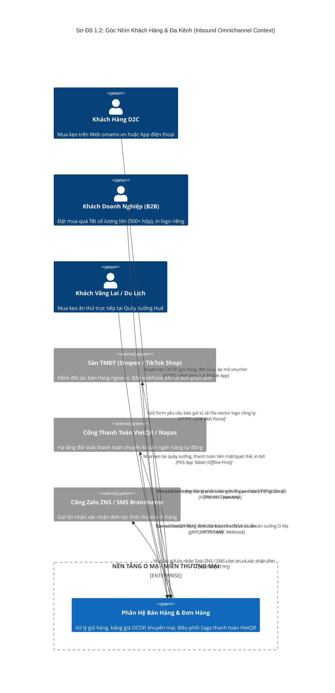
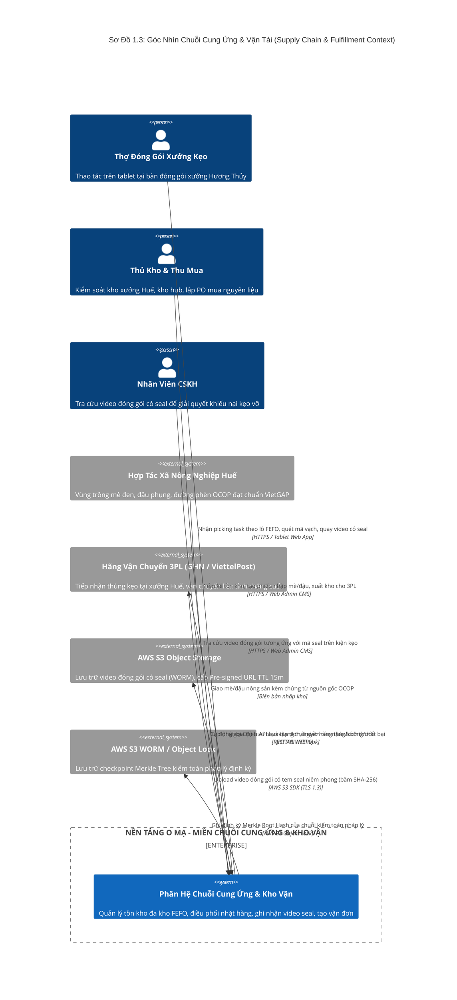

# BỘ SƠ ĐỒ BỐI CẢNH HỆ THỐNG (SYSTEM CONTEXT DIAGRAMS - C4 LEVEL 1)

## 1. Vị Trí & Vai Trò Trong Tài Liệu HLD
- **Cấp độ kiến trúc:** Toàn cảnh (System Context - Level 1 trong mô hình C4).
- **Vị trí trong HLD:** Đặt tại **Chương 1 (Mục Mở đầu)** — Xác định vị trí của Hệ sinh thái Mè Xửng O Mạ trong thế giới thực, trả lời câu hỏi: *Ai tương tác với hệ thống, qua kênh nào, và hệ thống phụ thuộc vào những đối tác ngoại vi nào?*
- **Chiến lược phân rã (Modular De-cluttering):** Để loại bỏ hoàn toàn tình trạng "All-In-One" khiến mũi tên chồng chéo, rối mắt và đè chữ chú thích, tài liệu phân rã System Context thành **3 sơ đồ chuyên biệt theo từng góc nhìn nghiệp vụ rõ ràng**:
  - **Sơ đồ 1.1 (Toàn Cảnh Cốt Lõi):** Bức tranh tối giản chỉ gồm Hệ thống trung tâm, 2 nhóm tác nhân lớn và 2 nhóm đối tác chính.
  - **Sơ đồ 1.2 (Góc Nhìn Khách Hàng & Bán Hàng Đa Kênh):** Chuyên sâu về luồng mua sắm, sàn TMĐT và cổng thanh toán.
  - **Sơ đồ 1.3 (Góc Nhìn Chuỗi Cung Ứng & Đối Tác Hậu Cần):** Chuyên sâu về xưởng đóng gói, kho vận, HTX nông sản, 3PL và kiểm toán.

---

## 2. Quy Chuẩn Ký Hiệu Áp Dụng (Tuân Thủ `regulation.md`)
- Sử dụng engine `C4Context` của Mermaid.
- Sử dụng macro `Person(...)` định danh người dùng.
- Sử dụng macro `Enterprise_Boundary(...)` và `System(...)` đóng khung nền tảng O Mạ Core.
- Sử dụng macro `System_Ext(...)` cho đối tác bên thứ ba theo đúng Dòng 8 của `regulation.md`.
- Ghi rõ giao thức và kênh truyền thông trong tham số thứ 4 của `Rel(...)`.

---

## 3. Sơ Đồ 1.1: System Context Tổng Quan (High-Level Core Context)
*Mục đích: Cung cấp cái nhìn nhanh trong 30 giây cho Ban Giám Đốc và các bên liên quan, đường nét thông thoáng, không chồng chéo.*

```mermaid
C4Context
    title Sơ Đồ 1.1: Bối Cảnh Cốt Lõi Hệ Thống Mè Xửng O Mạ (High-Level Context)

    Person(users_consumer, "Nhóm Khách Hàng", "Người tiêu dùng cá nhân D2C, Khách sỉ B2B, Khách du lịch tại xưởng")
    Person(users_staff, "Nhóm Vận Hành Nội Bộ", "Thợ đóng gói xưởng kẹo, Thủ kho, Kế toán, Nhân viên CSKH")

    Enterprise_Boundary(b_omamx, "HỆ SINH THÁI MÈ XỬNG O MẠ") {
        System(omamx_platform, "Nền Tảng O Mạ Core Platform", "Hệ thống 18 Microservices: Thương mại điện tử đa kênh, Quản lý kho FEFO, Đóng gói có video seal, Truy xuất OCOP")
    }

    System_Ext(ext_channels_pay, "Kênh Đối Tác & Thanh Toán", "Shopee, TikTok Shop, Cổng VietQR / Napas liên ngân hàng")
    System_Ext(ext_supply_cloud, "Chuỗi Cung Ứng & Hạ Tầng", "Hợp tác xã Huế, Logistics 3PL (GHN/ViettelPost), AWS S3 Cloud Storage")

    Rel(users_consumer, omamx_platform, "Tìm kiếm kẹo, đặt mua, thanh toán VietQR, theo dõi đơn", "HTTPS / Web Next.js & Mobile Flutter")
    Rel(users_staff, omamx_platform, "Đóng gói seal kẹo, kiểm kê kho, đối soát hóa đơn VAT, xem DSS", "HTTPS / Web Admin & Tablet")

    Rel(ext_channels_pay, omamx_platform, "Bắn Webhook đơn hàng sàn và Webhook xác nhận tiền về", "HTTPS REST / HMAC Webhook")
    Rel(omamx_platforVm, ext_channels_pay, "Đồng bộ tồn kho thời gian thực 2 chiều lên Shopee/TikTok", "Partner Open API")

    Rel(omamx_platform, ext_supply_cloud, "Gọi API tạo vận đơn 3PL, lưu trữ video seal và tài liệu kiểm toán", "REST API & AWS SDK")
    Rel(ext_supply_cloud, omamx_platform, "Cung ứng nguyên liệu mè/đậu OCOP, cập nhật tọa độ giao hàng", "Biên bản nhập kho & Webhook 3PL")
```

---

## 4. Sơ Đồ 1.2: Phân Rã Góc Nhìn Khách Hàng & Bán Hàng Đa Kênh (Inbound Omnichannel Context)
*Mục đích: Làm rõ mọi kênh bán hàng và luồng tiền vào hệ thống mà không bị phân tâm bởi thợ xưởng hay xe tải giao hàng.*



---

## 5. Sơ Đồ 1.3: Phân Rã Góc Nhìn Chuỗi Cung Ứng & Hậu Cần (Outbound Supply Chain & Logistics Context)
*Mục đích: Làm rõ hậu kỳ xưởng kẹo Huế, quy trình dán seal niêm phong, lưu trữ video AWS S3, vận chuyển 3PL và vùng nguyên liệu.*



---

## 6. Tổng Kết So Sánh: Trước & Sau Phân Rã
- **Trước phân rã (All-In-One):** 1 sơ đồ chứa hơn 16 đối tượng và gần 30 đường kết nối chéo nhau, chữ chú thích đè lên đường vẽ, không thể in ấn hoặc trình chiếu trên slide.
- **Sau phân rã (Modular 3 Views):**
  - Sơ đồ 1.1 cho bức tranh tổng quan ngắn gọn, chuẩn xác.
  - Sơ đồ 1.2 tách bạch 100% luồng bán hàng & khách hàng.
  - Sơ đồ 1.3 tách bạch 100% chuỗi cung ứng, kho vận xưởng kẹo và hạ tầng lưu trữ AWS S3.
  - Mọi chú thích mũi tên đều nằm gọn gàng, rõ nét, không một mũi tên nào bị cắt ngang hoặc che chữ.
