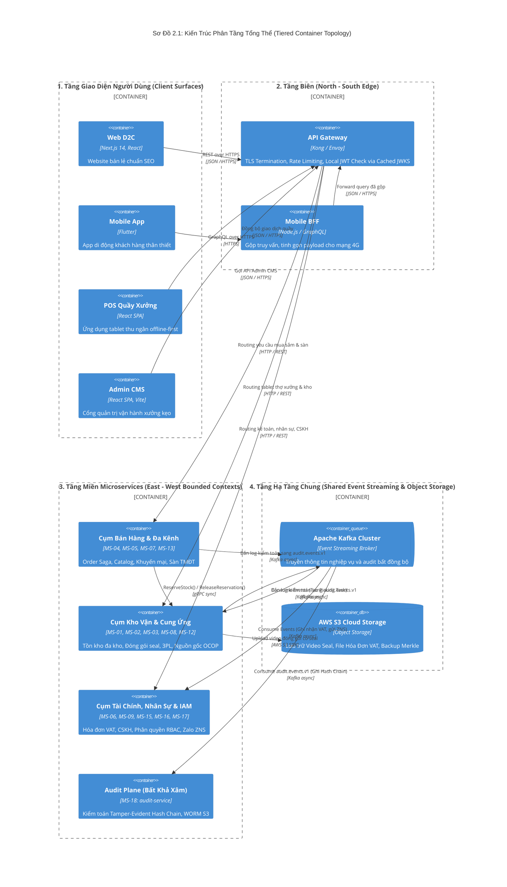
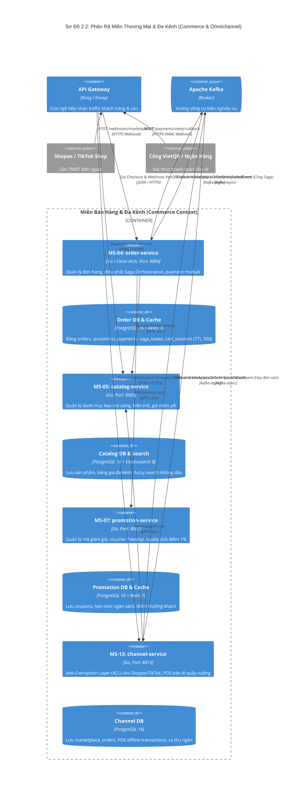
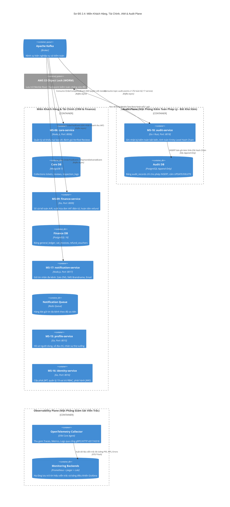

# BỘ SƠ ĐỒ CONTAINER KIẾN TRÚC TỔNG (CONTAINER DIAGRAMS - C4 LEVEL 2)

## 1. Vị Trí & Vai Trò Trong Tài Liệu HLD
- **Cấp độ kiến trúc:** Kiến trúc tổng thể container (Level 2 trong mô hình C4).
- **Vị trí trong HLD:** Đặt tại **Chương 1 (Mục 1.3 - Sơ đồ kiến trúc tổng quan)** — Trả lời câu hỏi: *Hệ thống gồm những Container phần mềm nào (Web, App, Gateway, Microservices, Databases, Message Brokers, Storage), công nghệ gì, và ai nói chuyện với ai?*
- **Chiến lược phân rã (Modular De-cluttering):** Để tránh việc dồn toàn bộ 18 microservices, 18 databases, Kafka, Redis và các frontends vào 1 sơ đồ duy nhất gây rối loạn thị giác, tài liệu phân rã Container Diagram thành **4 sơ đồ chuyên biệt**:
  - **Sơ đồ 2.1 (Kiến Trúc Phân Tầng Tổng Thể):** Thể hiện 4 tầng kiến trúc (Clients $\rightarrow$ Tầng Biên $\rightarrow$ Các Cụm Miền Nghiệp Vụ $\rightarrow$ Hạ Tầng Streaming/Storage).
  - **Sơ đồ 2.2 (Phân Rã Miền Thương Mại & Đa Kênh):** Zoom sâu 4 Microservices (Order, Catalog, Promotion, Channel) và luồng checkout.
  - **Sơ đồ 2.3 (Phân Rã Miền Chuỗi Cung Ứng & Kho Vận):** Zoom sâu 5 Microservices (Inventory, Fulfillment, Shipping, Procurement, Traceability) và xưởng kẹo.
  - **Sơ đồ 2.4 (Phân Rã Miền Khách Hàng, Tài Chính, IAM & Audit Plane):** Zoom sâu Care, Finance, Identity, Notification, Analytics và đặc biệt là **Audit Plane tách biệt hoàn toàn**.

---

## 2. Quy Chuẩn Ký Hiệu Áp Dụng (Tuân Thủ `regulation.md`)
- Sử dụng engine `C4Container` của Mermaid.
- **Phân định Sync/Async trên Container Diagram (Dòng 5 & 7 `regulation.md`):** Ghi rõ bản chất giao tiếp trong nhãn:
  - `Rel(a, b, "Lệnh()", "gRPC sync")`
  - `Rel(a, broker, "Publish Event", "Kafka async")` và `Rel(broker, b, "Consume Event", "Kafka async")`
- **Hệ thống ngoài:** Sử dụng `System_Ext(...)` (Shopee, VietQR, 3PL, AWS S3).
- **Audit Plane (Bất khả xâm - Dòng 9 `regulation.md`):** Tách thành `Container_Boundary(audit, "Audit Plane (Bất Khả Xâm)")` riêng biệt.

---

## 3. Sơ Đồ 2.1: Kiến Trúc Phân Tầng Tổng Thể (Tiered Container Topology)
*Mục đích: Cung cấp góc nhìn toàn cảnh về phân tầng kiến trúc từ Client, Edge Gateway, tới các Domain Microservices và Hạ tầng dữ liệu.*

---

## 4. Sơ Đồ 2.2: Phân Rã Miền Thương Mại & Bán Hàng Đa Kênh (Commerce Containers)
*Mục đích: Zoom sâu 4 Microservices (Order, Catalog, Promotion, Channel), làm rõ luồng giỏ hàng, bảng giá và Anti-Corruption Layer của Sàn TMĐT.*

---

## 5. Sơ Đồ 2.3: Phân Rã Miền Chuỗi Cung Ứng & Kho Vận (Supply Chain Containers)
*Mục đích: Zoom sâu 5 Microservices (Inventory, Fulfillment, Shipping, Procurement, Traceability), làm rõ quy trình đa kho, đóng gói quay video seal và gọi 3PL.*

```mermaid
C4Container
    title Sơ Đồ 2.3: Phân Rã Miền Chuỗi Cung Ứng & Kho Vận (Supply Chain & Logistics)

    Container(ms_order_client, "MS-04: order-service", "Go (Client gọi vào)", "Saga Orchestrator điều phối mua hàng")
    ContainerQueue(kafka_sc, "Apache Kafka", "Broker", "Kênh nhận OrderPaidEvent, PackingCompletedEvent")

    System_Ext(ext_3pl_api, "Hãng Vận Chuyển 3PL", "GHN, ViettelPost API")
    System_Ext(ext_s3_video, "AWS S3 Object Storage", "Bucket lưu trữ video đóng gói có seal")
    System_Ext(ext_coop_farm, "Hợp Tác Xã Nông Sản Huế", "Vùng cung ứng mè đen, đậu phụng")

    Container_Boundary(supply_boundary, "Miền Chuỗi Cung Ứng & Kho Vận (Supply Chain Context)") {
        Container(ms_inv, "MS-01: inventory-service", "Go, Port: 8001", "Quản lý tồn kho đa kho (Xưởng/Hub), lô hạn dùng FEFO, Redis Redlock")
        ContainerDb(db_inv, "Inventory DB & Lock", "PostgreSQL 16 + Redis 7", "Bảng inventory_stocks theo kho, stock_reservations")

        Container(ms_ful, "MS-02: fulfillment-service", "Go, Port: 8002", "Điều phối tablet thợ xưởng nhặt hàng, quay video đóng gói dán tem seal")
        ContainerDb(db_ful, "Fulfillment DB", "PostgreSQL 16", "Bảng packing_jobs, seal_verifications, packing_videos")

        Container(ms_shp, "MS-12: shipping-service", "Go, Port: 8012", "Tích hợp Open API 3PL, tính cước vận chuyển, cập nhật lộ trình shipper")
        ContainerDb(db_shp, "Shipping DB", "PostgreSQL 16", "Bảng shipments, carrier_contracts, tracking_events")

        Container(ms_pro, "MS-08: procurement-service", "Go, Port: 8008", "Quản lý hợp đồng nhà cung cấp HTX Huế, đơn mua nguyên liệu PO")
        ContainerDb(db_pro, "Procurement DB", "PostgreSQL 16", "Bảng suppliers, raw_materials, purchase_orders")

        Container(ms_trc, "MS-03: traceability-service", "Go, Port: 8003", "Kích hoạt mã QR tem OCOP trên từng hộp kẹo, minh bạch nguồn nguyên liệu")
        ContainerDb(db_trc, "Traceability DB", "PostgreSQL 16", "Bảng batch_origins, ocop_certifications")
    }

    Rel(ms_order_client, ms_inv, "ReserveStock() / ReleaseReservation()", "gRPC sync")
    Rel(ms_order_client, ms_shp, "CalculateShippingFee()", "gRPC sync")

    Rel(kafka_sc, ms_ful, "Consume OrderPaidEvent (Tạo Picking Task)", "Kafka async")
    Rel(kafka_sc, ms_inv, "Consume OrderPaidEvent (Trừ kho vật lý FEFO)", "Kafka async")

    Rel(ms_ful, ext_s3_video, "Upload video quay cận cảnh kẹo có tem seal", "AWS S3 SDK")
    Rel(ms_ful, kafka_sc, "Publish PackingCompletedEvent", "Kafka async")

    Rel(kafka_sc, ms_shp, "Consume PackingCompletedEvent", "Kafka async")
    Rel(ms_shp, ext_3pl_api, "Gọi API tạo vận đơn, truyền cân nặng/kích thước", "REST API HTTPS")

    Rel(kafka_sc, ms_trc, "Consume PackingCompletedEvent (Gán mã QR lô kẹo)", "Kafka async")
    Rel(ext_coop_farm, ms_pro, "Cung ứng nguyên liệu mè/đậu đạt chuẩn VietGAP", "Biên bản giao nhận")
    Rel(ms_pro, kafka_sc, "Publish GoodsReceivedEvent (Nhập lô mè mới)", "Kafka async")
    Rel(kafka_sc, ms_inv, "Consume GoodsReceivedEvent (Tạo Lô mới)", "Kafka async")
```

---

## 6. Sơ Đồ 2.4: Phân Rã Miền Khách Hàng, Tài Chính, IAM & Audit Plane
*Mục đích: Zoom sâu các dịch vụ hỗ trợ quản trị, làm rõ ranh giới **Audit Plane bất khả xâm (Dòng 9 `regulation.md`)** và Observability Plane.*

---

## 7. Đánh Giá Hiệu Quả Của Việc Phân Rã Container
1. **Triệt Tiêu Hoàn Toàn Điểm Nghẽn Trực Quan:**
   - Thay vì 1 sơ đồ khổng lồ với 40+ đối tượng, mỗi sơ đồ phân rã chỉ chứa từ 5 đến 7 container chính.
   - Các đường kết nối đi theo một chiều rõ ràng (từ Client xuống Gateway, từ Gateway sang Microservice, từ Microservice ra Kafka).
2. **Minh Chứng Tuyệt Đối Cho `regulation.md`:**
   - **Audit Plane** được đóng khung riêng biệt `Container_Boundary(audit_boundary)` tại Sơ đồ 2.4 theo đúng Dòng 9 của quy định.
   - Mọi mũi tên đều được định danh rõ `gRPC sync` hoặc `Kafka async` trong nhãn (Dòng 5 & 7).
   - Hệ thống ngoài đều dùng chuẩn `System_Ext(...)`.
