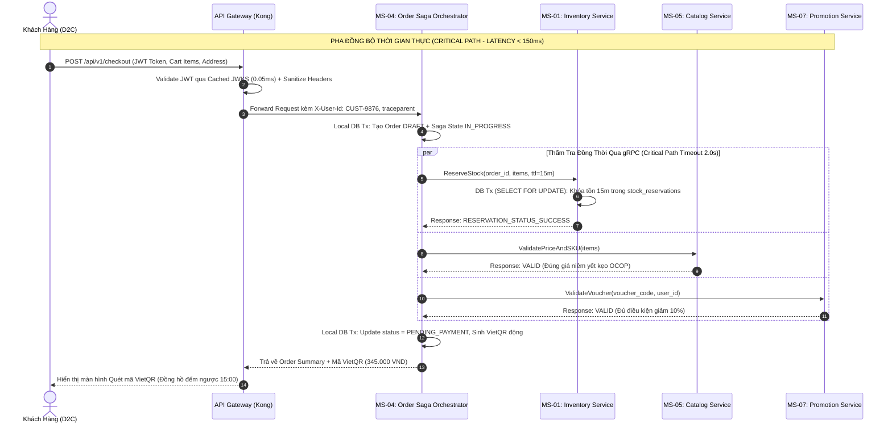
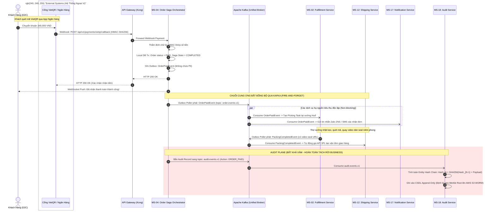
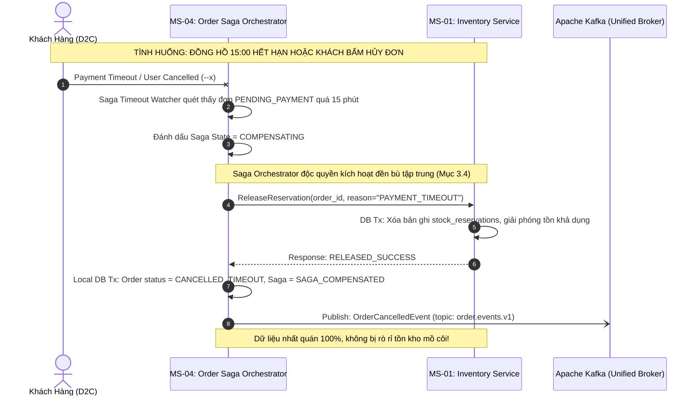
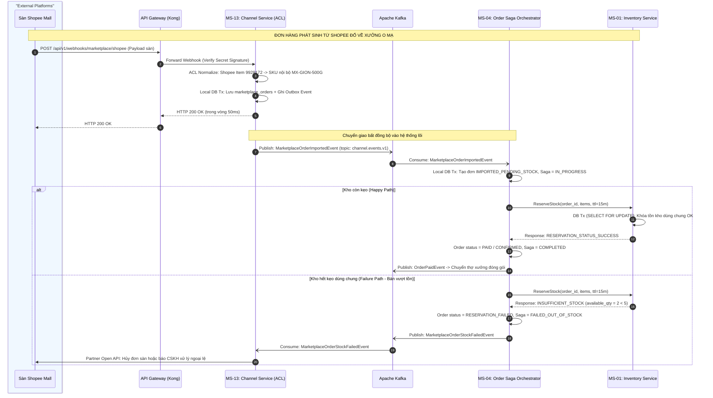

# BỘ SƠ ĐỒ TUẦN TỰ LUỒNG NGHIỆP VỤ & SAGA ĐỀN BÙ (SEQUENCE DIAGRAMS)

## 1. Vị Trí & Vai Trò Trong Tài Liệu HLD
- **Cấp độ kiến trúc:** Luồng tương tác nghiệp vụ động (Sequence Diagrams).
- **Vị trí trong HLD:** Đặt tại **Chương 4 (Mục 4.2 - Luồng Nghiệp Vụ Lõi Critical Path)** kết hợp **Chương 7 (Story Walkthrough)** — Trả lời câu hỏi: *Từng thông điệp được gửi đi theo thứ tự thời gian như thế nào? Bước nào bắt buộc phải chờ (sync gRPC < 20ms), bước nào chuyển giao bất đồng bộ (async Kafka), và khi xảy ra lỗi/timeout thì ai kích hoạt đền bù?*
- **Chiến lược phân rã (Modular De-cluttering):** Thay vì gộp chung toàn bộ từ lúc khách bấm nút, thanh toán, đóng gói, giao hàng, kiểm toán và đền bù vào một sơ đồ khổng lồ gây chồng chéo các khối `par`, `alt`, `rect`, tài liệu phân rã thành **4 sơ đồ tuần tự chuyên biệt, mạch lạc và độc lập**:
  - **Sơ đồ 3.1 (Critical Path Checkout):** Pha đồng bộ thời gian thực (< 150ms) từ lúc khách bấm "Đặt mua" đến khi nhận mã VietQR.
  - **Sơ đồ 3.2 (Thanh Toán & Hậu Kỳ Bất Đồng Bộ):** Pha nhận tiền VietQR qua Webhook và kích hoạt chuỗi cung ứng đóng gói seal, giao hàng 3PL qua Kafka.
  - **Sơ đồ 3.3 (Kịch Bản Đền Bù Phân Tán - Centralized Compensation):** Pha xử lý ngoại lệ khi quá hạn 15 phút hoặc lỗi mạng, minh chứng luật Mục 3.4.
  - **Sơ đồ 3.4 (Hành Trình Đơn Sàn Marketplace Inbound Saga):** Pha nhập đơn từ Shopee/TikTok qua ACL, khóa tồn dùng chung và xử lý khi hết hàng.

---

## 2. Quy Chuẩn Ký Hiệu Áp Dụng (Tuân Thủ Tuyệt Đối `regulation.md`)

| Ký Hiệu | Bản Chất Kỹ Thuật | Căn Cứ Tại `regulation.md` |
| :---: | :--- | :--- |
| `->>` | **gRPC Synchronous Command:** Đường liền, mũi tên đặc. Lệnh trên đường găng (Critical Path), chặn luồng chờ phản hồi. | Dòng 5: `->> (đường liền, mũi tên đặc)` |
| `-->>` | **Phản hồi gRPC:** Đường đứt, mũi tên đặc. Kết quả xác nhận hoặc mã lỗi từ Provider. | Dòng 6: `-->> (đường đứt, mũi tên đặc)` |
| `-)` | **Kafka Domain Event:** Đường liền, mũi tên hở. Sự kiện bất đồng bộ phát tán (Fire-and-Forget). | Dòng 7: `-) (đường liền, mũi tên hở)` |
| `box "External Systems"` | **Phân vùng hệ thống ngoài:** Đóng khung riêng các đối tác ngoại vi (Cổng Ngân hàng VietQR, Sàn Shopee). | Dòng 8: `box "External Systems" để tách vùng` |
| `rect rgb(255,230,230)` | **Audit Plane (Bất khả xâm):** Tô nền đỏ nhạt bao bọc toàn bộ tương tác kiểm toán. | Dòng 9: `rect rgb(255,230,230) ... end` |
| `-x` hoặc `--x` | **Lỗi / Timeout / Đền bù:** Đường nét kèm dấu gạch chéo X đỏ, biểu thị sự cố mạng hoặc quá hạn thanh toán. | Dòng 10: `-x hoặc --x (dấu X built-in)` |

---

## 3. Sơ Đồ 3.1: Critical Path Checkout & Khóa Tồn Kho gRPC (Thời Gian Thực < 150ms)
*Mục đích: Đặc tả giai đoạn sống còn trên đường găng, chỉ có các cuộc gọi gRPC đồng bộ có Circuit Breaker (Timeout 2.0s).*

---

## 4. Sơ Đồ 3.2: Thanh Toán VietQR & Chuỗi Cung Ứng Hậu Kỳ Bất Đồng Bộ (Happy Path)
*Mục đích: Đặc tả giai đoạn sau khi nhận được tiền từ ngân hàng, toàn bộ quy trình đóng gói seal, giao hàng 3PL và kiểm toán chạy qua Kafka.*

---

## 5. Sơ Đồ 3.3: Ngoại Lệ Quá Hạn 15 Phút & Kịch Bản Đền Bù Phân Tán (Centralized Compensation)
*Mục đích: Làm sáng tỏ nguyên tắc bất di bất dịch của Mục 3.4 — Saga Orchestrator là thực thể duy nhất phát hiện sự cố và phát lệnh đền bù giải phóng tồn kho.*

---

## 6. Sơ Đồ 3.4: Hành Trình Nhập Đơn Sàn Marketplace Inbound Saga (Shopee / TikTok)
*Mục đích: Bắt lỗi mâu thuẫn kiến trúc đã phát hiện — minh chứng Channel Service chỉ làm ACL phát event, Order Saga mới là bên gọi ReserveStock.*

---

## 7. Tổng Kết So Sánh: Trực Quan Hóa Sau Phân Rã
- **Không còn tình trạng "ma trận mũi tên":** Mỗi sơ đồ chỉ biểu đạt đúng một phân đoạn nghiệp vụ rõ ràng với từ 4 đến 6 participants.
- **Tuân thủ triệt để `regulation.md`:** 
  - gRPC đồng bộ thể hiện bằng `->>` và `-->>`.
  - Kafka bất đồng bộ thể hiện bằng `-)`.
  - Webhook ngân hàng / sàn TMĐT đặt trong `box "External Systems"`.
  - Audit Plane được tô màu nền đỏ nhạt bằng `rect rgb(255, 230, 230)`.
  - Sự cố timeout và đền bù thể hiện bằng `-x` / `--x`.
