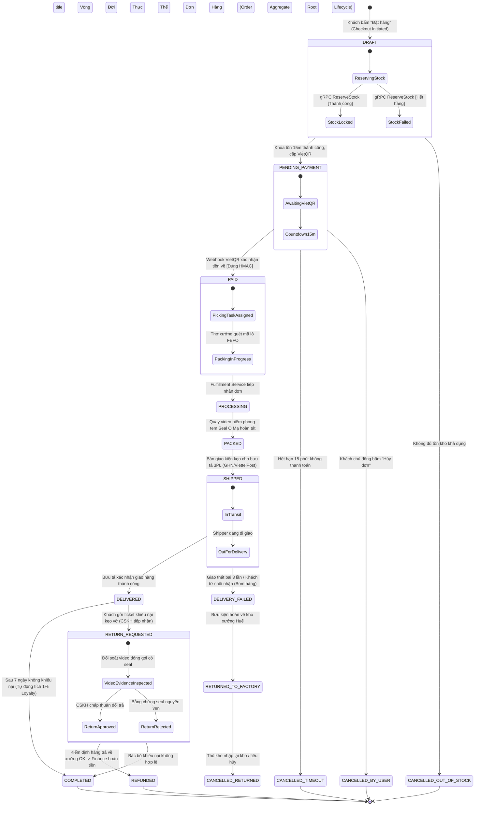
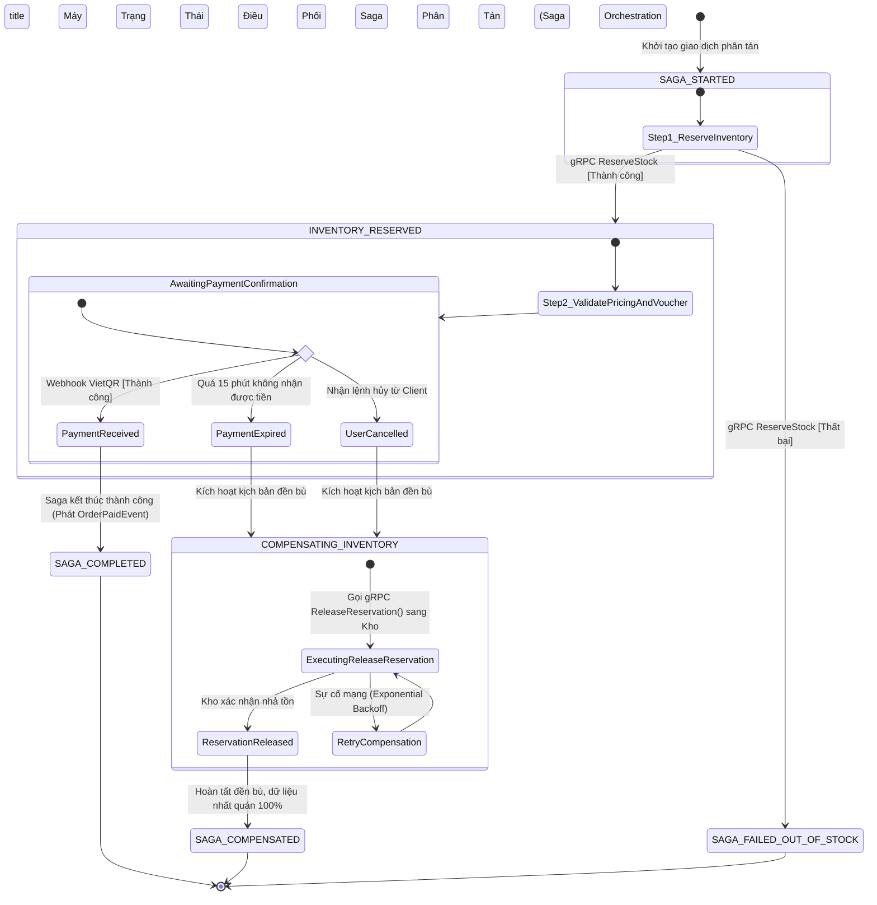
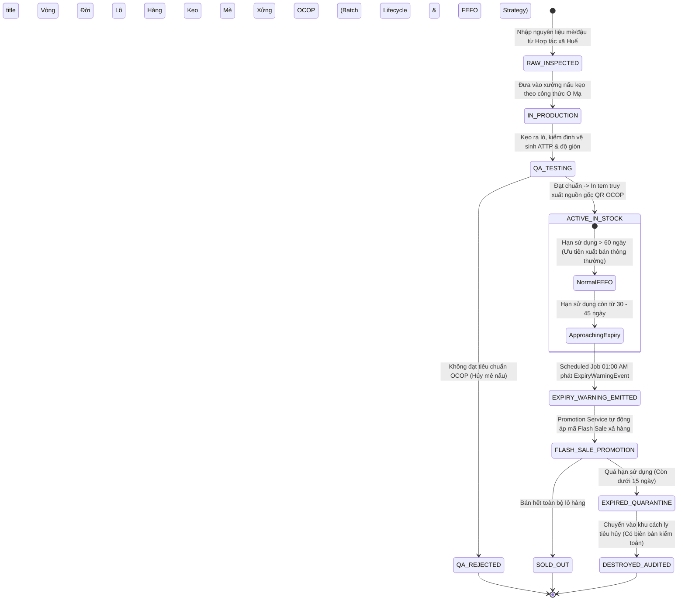

# SƠ ĐỒ TRẠNG THÁI VÒNG ĐỜI THỰC THỂ & SAGA STATE MACHINE (STATE DIAGRAM - stateDiagram-v2)

## 1. Vị Trí & Vai Trò Trong Tài Liệu HLD
- **Cấp độ kiến trúc:** Vòng đời Entity & Máy trạng thái Giao dịch phân tán (State Transition Diagram).
- **Vị trí trong HLD:** Đặt tại **Chương 3 (Mục 3.2 & 3.3 - Saga Orchestration & State Machine)** — Trả lời câu hỏi: *Một đơn hàng, một giao dịch Saga phân tán, và một lô kẹo mè xửng trải qua những trạng thái nào trong suốt vòng đời của nó? Điều kiện gì kích hoạt việc chuyển trạng thái và kịch bản nào dẫn tới hủy/hoàn tiền?*

---

## 2. Quy Chuẩn Ký Hiệu Áp Dụng (Tuân Thủ Tuyệt Đối `regulation.md`)
- Sử dụng engine `stateDiagram-v2` chuẩn hóa của Mermaid.
- Theo Dòng 5 của `regulation.md`: *State Diagram không áp dụng phân chia sync/async*, mà tập trung vào:
  - Trạng thái khởi đầu `[*]` và trạng thái kết thúc `[*]`.
  - Nhãn chuyển trạng thái kèm Trigger và Điều kiện kiểm tra (Guard Condition): `State1 --> State2 : Trigger [Guard]`.
  - Trạng thái hợp thành (Composite States) để nhóm các pha xử lý liên quan: `state CheckoutPhase { ... }`.
  - Phân nhánh lựa chọn (Choice / Decision point) bằng `<<choice>>`.

---

## 3. Sơ Đồ 4.1: Vòng Đời Thực Thể Đơn Hàng Cốt Lõi (Order Aggregate Root Lifecycle)

---

## 4. Sơ Đồ 4.2: Máy Trạng Thái Điều Phối Saga Phân Tán (Distributed Saga State Machine)

Sơ đồ đặc tả bảng `saga_states` bên trong `order-service`, thể hiện cơ chế **Centralized Compensation (Mục 3.4)**:

---

## 5. Sơ Đồ 4.3: Vòng Đời Lô Hàng & Chiến Lược Xuất Kho FEFO (Batch Lifecycle & FEFO Strategy)

Quản lý xuất kho kẹo mè xửng Huế bảo đảm chất lượng OCOP theo nguyên tắc **Hạn dùng sớm nhất xuất trước (FEFO - First Expired, First Out)**:

