# SƠ ĐỒ THÀNH PHẦN ZOOM SÂU DỊCH VỤ PHỨC TẠP (COMPONENT DIAGRAM - MS-04 ORDER SERVICE)

## 1. Vị Trí & Vai Trò Trong Tài Liệu HLD
- **Cấp độ kiến trúc:** Chi tiết thành phần nội bộ (Component Diagram - Level 3 trong mô hình C4).
- **Vị trí trong HLD:** Đặt tại **Chương 3 (Mục 3.3 - Tách Biệt Ranh Giới Logic Bên Trong Order Service)** — Trả lời câu hỏi: *Bên trong dịch vụ phức tạp nhất hệ thống (`order-service`), các module logic được phân chia ranh giới như thế nào để vừa tối ưu vận hành trong giai đoạn MVP, vừa sẵn sàng bóc tách thành các microservices độc lập trong tương lai mà không làm xáo trộn mã nguồn?*

---

## 2. Quy Chuẩn Ký Hiệu Áp Dụng (Tuân Thủ Tuyệt Đối `regulation.md`)
- Sử dụng engine `flowchart TB` của Mermaid.
- **Ký hiệu gRPC Đồng bộ:** Sử dụng mũi tên liền `-->` kết hợp lớp CSS `classDef sync stroke:#0066cc,stroke-width:2px`.
- **Ký hiệu Kafka Bất đồng bộ:** Sử dụng mũi tên đứt nét `-.->` kết hợp lớp CSS `classDef async stroke-dasharray: 5 5,stroke:#2e7d32,stroke-width:2px`.
- **Ký hiệu Webhook bên thứ 3:** Sử dụng node hình bo tròn hai đầu `(([Webhook]))` theo đúng Dòng 8 của `regulation.md`.
- **Ký hiệu Audit Plane:** Sử dụng lớp CSS `classDef audit fill:#ffe0e0,stroke:#cc0000,stroke-width:2px` theo Dòng 9 của `regulation.md`.
- **Ký hiệu Điểm quyết định:** Sử dụng node hình thoi `{Kiểm Tra?}` theo Dòng 10 của `regulation.md`.

---

## 3. Sơ Đồ 5.1: Cấu Trúc Thành Phần & Ranh Giới Lưu Trữ (MS-04 Component Topology & Data Ownership)

Sơ đồ này bóc tách cấu trúc 6 phân hệ nội bộ của `order-service` và cơ chế cô lập dữ liệu theo mô hình Database-per-service (kết hợp phân tách schema sẵn sàng cho microservice tương lai):

```mermaid
flowchart TB
    %% =========================================================================
    %% ĐỊNH NGHĨA PHONG CÁCH ĐỒNG NHẤT THEO REGULATION.MD
    %% =========================================================================
    classDef sync stroke:#0066cc,stroke-width:2px,fill:#f0f7ff;
    classDef async stroke-dasharray: 5 5,stroke:#2e7d32,stroke-width:2px,fill:#f1f8e9;
    classDef audit fill:#ffe0e0,stroke:#cc0000,stroke-width:2px;
    classDef storage fill:#fff3e0,stroke:#e65100,stroke-width:2px;
    classDef external fill:#f3e5f5,stroke:#7b1fa2,stroke-width:2px;
    classDef internal fill:#ffffff,stroke:#333333,stroke-width:1.5px;

    %% =========================================================================
    %% RANH GIỚI CONTAINER MS-04: ORDER SERVICE
    %% =========================================================================
    subgraph MS04_CONTAINER ["CONTAINER: MS-04 ORDER-SERVICE (PORT: 8004)"]

        subgraph LAYER_ADAPTER ["1. Tầng Adapter Giao Tiếp (Inbound Handlers)"]
            REST_CTRL["REST / GraphQL API Handlers<br/><i>POST /checkout, GET /orders</i>"]:::internal
            WH_HANDLER["Payment Webhook Handler<br/><i>Verify HMAC-SHA256</i>"]:::internal
            KAFKA_IN_CONSUMER["Kafka Ingestion Consumer<br/><i>MarketplaceOrderImported</i>"]:::internal
        end

        subgraph LAYER_DOMAIN ["2. Phân Hệ Order Domain Core (Nghiệp Vụ Đơn Hàng)"]
            AGG_ORDER["Order Aggregate Root<br/><i>Tính giá, chiết khấu, VAT, Snapshot</i>"]:::internal
            ENTITY_ITEMS["OrderItem & Voucher Entities"]:::internal
            ORDER_REPO["Order Repository Interface"]:::internal
        end

        subgraph LAYER_SAGA ["3. Phân Hệ Saga Orchestration Engine (Quản Lý Giao Dịch)"]
            SAGA_COORD["Saga Coordinator & State Machine<br/><i>Quản lý trạng thái saga_states</i>"]:::internal
            SAGA_WATCHER["Saga Timeout Watcher Daemon<br/><i>Quét đơn treo 15 phút</i>"]:::internal
            COMPENSATE_ENG["Compensation Engine<br/><i>Độc quyền gọi ReleaseReservation</i>"]:::internal
            GRPC_CLIENTS["gRPC Internal Clients Pool<br/><i>Circuit Breaker, Timeout 2.0s</i>"]:::internal
        end

        subgraph LAYER_PAYMENT ["4. Phân Hệ Thanh Toán (Payment Module - Tách Schema)"]
            PAY_SERVICE["Payment Settlement Service<br/><i>Sinh VietQR động, đối soát giao dịch</i>"]:::internal
            PAY_REPO["Payment Repository Interface"]:::internal
        end

        subgraph LAYER_CART ["5. Phân Hệ Giỏ Hàng Tạm Thời (Cart Session)"]
            CART_MGR["Cart Session Manager<br/><i>Quản lý giỏ hàng Khách vãng lai & Thành viên</i>"]:::internal
        end

        subgraph LAYER_OUTBOX ["6. Phân Hệ Giao Dịch Tin Cậy (Transactional Outbox)"]
            OUTBOX_WRITER["Outbox Writer<br/><i>Ghi event trong cùng Local DB Tx</i>"]:::internal
            OUTBOX_POLLER["Outbox Poller Daemon<br/><i>Quét bảng outbox_events định kỳ 500ms</i>"]:::internal
        end
    end

    %% =========================================================================
    %% CƠ SỞ DỮ LIỆU CỦA ORDER SERVICE
    %% =========================================================================
    subgraph MS04_STORAGE ["STORAGE SỞ HỮU RIÊNG (DATABASE-PER-SERVICE)"]
        subgraph PG_ORDER_DB ["PostgreSQL 16: order_db"]
            SCHEMA_PUBLIC[("Schema public<br/>- orders<br/>- order_items<br/>- saga_states<br/>- outbox_events")]:::storage
            SCHEMA_PAYMENT[("Schema payment_schema<br/>- payments<br/>- payment_transactions<br/><i>(Sẵn sàng bóc tách MS-19)</i>")]:::storage
        end
        REDIS_CART[("Redis 7: Session & Cache<br/>- cart:session:{id} (TTL 30d)<br/>- idempotency:{key} (TTL 24h)")]:::storage
    end

    %% =========================================================================
    %% LIÊN KẾT NỘI BỘ GIỮA CÁC MODULE VÀ STORAGE
    %% =========================================================================
    REST_CTRL -->|Gọi quản lý giỏ| CART_MGR:::sync
    REST_CTRL -->|Khởi tạo đơn đặt hàng| AGG_ORDER:::sync
    WH_HANDLER -->|Xác thực & ghi nhận tiền| PAY_SERVICE:::sync
    KAFKA_IN_CONSUMER -->|Import đơn sàn TMĐT| SAGA_COORD:::sync

    CART_MGR -->|Đọc / Ghi Session| REDIS_CART:::sync
    AGG_ORDER -->|Tham chiếu thực thể con| ENTITY_ITEMS:::sync
    AGG_ORDER -->|Khởi động Saga| SAGA_COORD:::sync
    AGG_ORDER -->|Lưu đơn hàng| ORDER_REPO:::sync
    ORDER_REPO --> SCHEMA_PUBLIC:::sync

    SAGA_COORD -->|Thực thi lệnh phân tán| GRPC_CLIENTS:::sync
    SAGA_COORD -->|Ghi nhận trạng thái Saga| SCHEMA_PUBLIC:::sync
    SAGA_WATCHER -->|Kích hoạt đền bù| COMPENSATE_ENG:::sync
    COMPENSATE_ENG -->|Thực thi nhả tồn qua gRPC| GRPC_CLIENTS:::sync

    PAY_SERVICE -->|Đối soát & cập nhật thanh toán| AGG_ORDER:::sync
    PAY_SERVICE -->|Lưu lịch sử giao dịch| PAY_REPO:::sync
    PAY_REPO --> SCHEMA_PAYMENT:::sync

    AGG_ORDER -->|Ghi Outbox Event trong cùng Tx| OUTBOX_WRITER:::sync
    OUTBOX_WRITER --> SCHEMA_PUBLIC:::sync
    OUTBOX_POLLER -->|Đọc batch & đánh dấu đã gửi| SCHEMA_PUBLIC:::sync
```



---

## 4. Sơ Đồ 5.2: Luồng Xử Lý Nghiệp Vụ & Tương Tác Dịch Vụ (Internal Execution & Service Flow)

Sơ đồ này mô tả chi tiết luồng vận hành động giữa các module nội bộ của `order-service` với các Microservices đối tác và Message Broker ngoại vi:

```mermaid
flowchart TB
    %% =========================================================================
    %% ĐỊNH NGHĨA PHONG CÁCH ĐỒNG NHẤT THEO REGULATION.MD
    %% =========================================================================
    classDef sync stroke:#0066cc,stroke-width:2px,fill:#f0f7ff;
    classDef async stroke-dasharray: 5 5,stroke:#2e7d32,stroke-width:2px,fill:#f1f8e9;
    classDef audit fill:#ffe0e0,stroke:#cc0000,stroke-width:2px;
    classDef storage fill:#fff3e0,stroke:#e65100,stroke-width:2px;
    classDef external fill:#f3e5f5,stroke:#7b1fa2,stroke-width:2px;

    %% =========================================================================
    %% TẦNG BIÊN & EXTERNAL WEBHOOKS
    %% =========================================================================
    subgraph INBOUND ["TẦNG BIÊN & NGOẠI VI"]
        GW["API Gateway (Kong)<br/><i>Inject: X-User-Id, traceparent</i>"]
        WH_BANK(([Webhook Ngân Hàng VietQR])):::external
    end

    %% =========================================================================
    %% CÁC THÀNH PHẦN NỘI BỘ ORDER SERVICE ĐIỀU PHỐI
    %% =========================================================================
    subgraph MS04_FLOW ["MS-04: ORDER-SERVICE RUNTIME"]
        CTRL_CHECKOUT["REST Controller"]
        AGG_CORE["Order Aggregate Root"]
        SAGA_ORCH["Saga Coordinator"]
        CLIENT_GRPC["gRPC Internal Clients Pool"]
        PAY_MOD["Payment Module"]
        SAGA_TIMER["Timeout Watcher & Compensation"]
        OUTBOX_ENG["Transactional Outbox Engine"]
    end

    %% =========================================================================
    %% DỊCH VỤ NỘI BỘ (CALLED VIA gRPC)
    %% =========================================================================
    subgraph INTERNAL_PEERS ["MICROSERVICES ĐỐI TÁC (gRPC INTERNAL)"]
        MS01["MS-01: inventory-service<br/><i>ReserveStock() / ReleaseReservation()</i>"]
        MS05["MS-05: catalog-service<br/><i>ValidatePriceAndSKU()</i>"]
        MS07["MS-07: promotion-service<br/><i>ValidateAndLockVoucher()</i>"]
        MS12["MS-12: shipping-service<br/><i>CalculateShippingFee()</i>"]
    end

    %% =========================================================================
    %% BROKERS & AUDIT PLANE
    %% =========================================================================
    subgraph BROKERS ["MESSAGE BROKER & AUDIT PLANE"]
        KAFKA_ORDER{{"Apache Kafka Topic: order.events.v1"}}:::async
        KAFKA_AUDIT{{"Apache Kafka Topic: audit.events.v1"}}:::audit
    end

    %% =========================================================================
    %% LUỒNG 1: CHECKOUT CRITICAL PATH (< 150ms)
    %% =========================================================================
    GW -->|1. POST /checkout| CTRL_CHECKOUT:::sync
    CTRL_CHECKOUT -->|2. Tạo DRAFT Order| AGG_CORE:::sync
    AGG_CORE -->|3. Trigger Saga| SAGA_ORCH:::sync

    SAGA_ORCH -->|4. Điều phối song song| CLIENT_GRPC:::sync
    CLIENT_GRPC -->|ReserveStock| MS01:::sync
    CLIENT_GRPC -->|ValidatePrice| MS05:::sync
    CLIENT_GRPC -->|ValidateVoucher| MS07:::sync
    CLIENT_GRPC -->|CalcShipping| MS12:::sync

    %% =========================================================================
    %% LUỒNG 2: XÁC NHẬN THANH TOÁN (VIETQR WEBHOOK)
    %% =========================================================================
    WH_BANK -.->|5. Webhook POST| PAY_MOD:::async
    PAY_MOD -->|6. Verify HMAC & Báo đã thu tiền| AGG_CORE:::sync
    AGG_CORE -->|7. Chuyển trạng thái PAID & Ghi Outbox| OUTBOX_ENG:::sync

    %% =========================================================================
    %% LUỒNG 3: PUBLISH EVENT & AUDIT (TRANSACTIONAL OUTBOX)
    %% =========================================================================
    OUTBOX_ENG -.->|8. Publish OrderPaidEvent| KAFKA_ORDER:::async
    OUTBOX_ENG -.->|9. Publish Audit Record| KAFKA_AUDIT:::audit

    %% =========================================================================
    %% LUỒNG 4: QUÁ HẠN 15 PHÚT & ĐỀN BÙ TẬP TRUNG (COMPENSATION)
    %% =========================================================================
    SAGA_TIMER -->|Quét đơn timeout 15m| SAGA_ORCH:::sync
    SAGA_ORCH -->|Kích hoạt đền bù tập trung| CLIENT_GRPC:::sync
    CLIENT_GRPC -->|ReleaseReservation| MS01:::sync
```

---

## 5. Ý Nghĩa Thiết Kế Của Sự Phân Tách Logic
1. **Sẵn Sàng Tách Microservice MS-19 (Payment Service):**
   - Phân hệ Thanh toán được quy hoạch riêng biệt trong `payment_schema` với `PAY_SERVICE` và `PAY_REPO`. Khi hệ thống mở rộng vượt ngưỡng 10.000 giao dịch/ngày, module này có thể tách thành dịch vụ độc lập mà không cần tái cấu trúc cơ sở dữ liệu.
2. **Nguyên Tắc Cô Lập Đền Bù (Centralized Compensation):**
   - Thành phần `COMPENSATE_ENG` nằm trực tiếp dưới sự điều phối của `SAGA_COORD` và `SAGA_WATCHER`, đảm bảo `order-service` là thực thể duy nhất sở hữu máy trạng thái phân tán và độc quyền kích hoạt lệnh giải phóng tồn kho khi có sự cố.
3. **Phân Định Tuyệt Đối Sync vs Async:**
   - Các đường màu xanh dương `-->` (gRPC Sync) thể hiện luồng chặn trên Critical Path (< 150ms).
   - Các đường nét đứt màu xanh lá `-.->` (Kafka Async) thể hiện luồng chuyển giao quy trình cho các dịch vụ khác mà không cản trở khách hàng.
