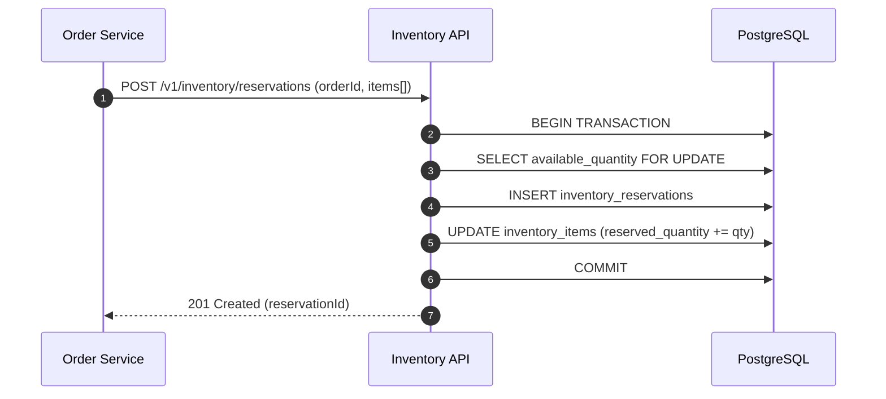
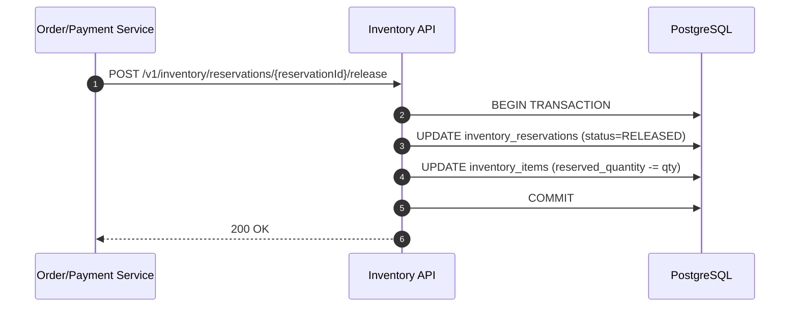
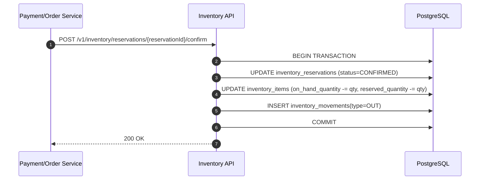

# Inventory Service - Luồng hoạt động và Database Snapshot

## 1) Luồng giữ kho (reserve) khi tạo đơn hàng



## 2) Luồng giải phóng kho (release) khi hủy/thanh toán lỗi



## 3) Luồng xác nhận trừ kho (confirm) khi thanh toán thành công



## 4) Database snapshot (sau thiết kế)

```sql
-- Bảng tồn kho theo SKU
CREATE TABLE inventory_items (
  id UUID PRIMARY KEY,
  sku VARCHAR(100) NOT NULL UNIQUE,
  warehouse_code VARCHAR(50) NOT NULL,
  on_hand_quantity INTEGER NOT NULL DEFAULT 0,
  reserved_quantity INTEGER NOT NULL DEFAULT 0,
  reorder_threshold INTEGER NOT NULL DEFAULT 0,
  updated_at TIMESTAMPTZ NOT NULL DEFAULT NOW()
);

-- Bảng giữ kho theo đơn
CREATE TABLE inventory_reservations (
  id UUID PRIMARY KEY,
  order_id UUID NOT NULL,
  sku VARCHAR(100) NOT NULL,
  quantity INTEGER NOT NULL CHECK (quantity > 0),
  status VARCHAR(20) NOT NULL CHECK (status IN ('RESERVED','CONFIRMED','RELEASED')),
  expires_at TIMESTAMPTZ,
  created_at TIMESTAMPTZ NOT NULL DEFAULT NOW(),
  updated_at TIMESTAMPTZ NOT NULL DEFAULT NOW()
);

-- Bảng lịch sử biến động kho
CREATE TABLE inventory_movements (
  id UUID PRIMARY KEY,
  sku VARCHAR(100) NOT NULL,
  movement_type VARCHAR(10) NOT NULL CHECK (movement_type IN ('IN','OUT','ADJUST')),
  quantity INTEGER NOT NULL,
  reason VARCHAR(255),
  reference_id UUID,
  created_at TIMESTAMPTZ NOT NULL DEFAULT NOW()
);
```

## 5) Checklist bàn giao theo issue

- [ ] Chụp ảnh màn hình schema DB sau khi triển khai thực tế.
- [ ] Upload tài liệu/ảnh vào Drive: https://drive.google.com/drive/folders/1D8XvDCrrIamaaLNEH1NwFYOExfKLtK-4?usp=sharing
- [ ] Comment link ảnh + xác nhận hoàn tất vào issue #7.

