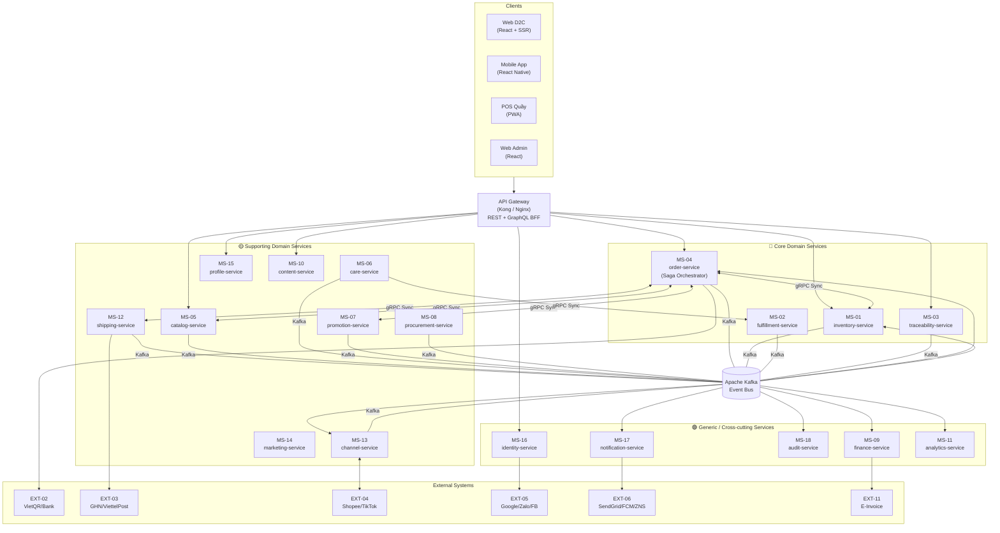
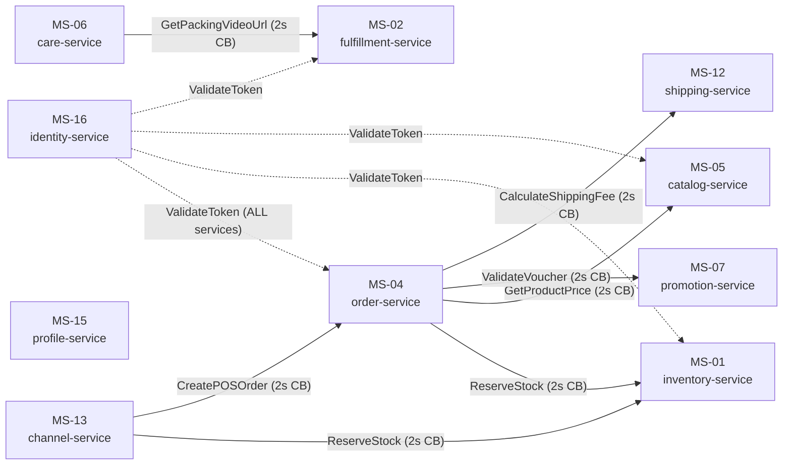
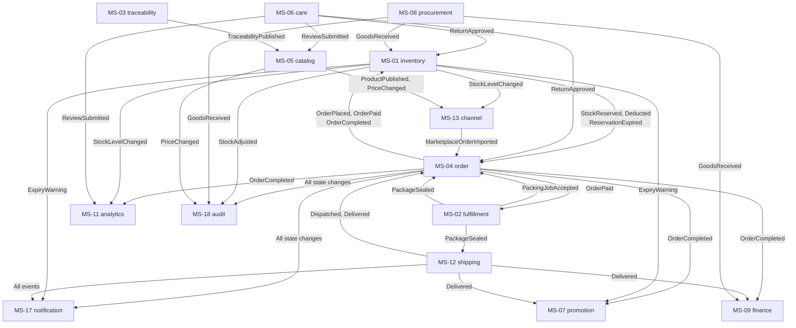
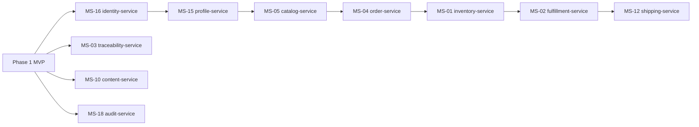

# THIẾT KẾ RANH GIỚI DỊCH VỤ & QUYỀN SỞ HỮU DỮ LIỆU (SERVICE BOUNDARY & DATA OWNERSHIP)

## HỆ SINH THÁI THƯƠNG MẠI ĐIỆN TỬ ĐA KÊNH & HỖ TRỢ QUYẾT ĐỊNH — MÈ XỬNG O MẠ

**Phiên bản:** 1.0
**Loại tài liệu:** Service Boundary Evaluation & Data Ownership Design
**Yêu cầu đầu vào:** Bounded Context Discovery v1.0
**Ngày tạo:** 2026-09-12
**Trạng thái:** Bản nháp — Cập nhật theo tiến độ phát triển

---

## MỤC LỤC

1. [Nguyên Tắc Thiết Kế Service Boundary](#1-nguyên-tắc-thiết-kế-service-boundary)
2. [Danh Sách 18 Microservices](#2-danh-sách-18-microservices)
3. [Chi Tiết Từng Microservice](#3-chi-tiết-từng-microservice)
4. [Service Boundary Diagram](#4-service-boundary-diagram)
5. [Service Responsibility Matrix](#5-service-responsibility-matrix)
6. [Data Ownership Matrix](#6-data-ownership-matrix)
7. [Service Dependency Graph](#7-service-dependency-graph)
8. [API Gateway & Communication Overview](#8-api-gateway--communication-overview)
9. [Lộ Trình Triển Khai Theo Phase](#9-lộ-trình-triển-khai-theo-phase)

---

## 1. NGUYÊN TẮC THIẾT KẾ SERVICE BOUNDARY

### 1.1. Ánh Xạ Bounded Context → Microservice

Nguyên tắc cơ bản: **Mỗi Bounded Context ánh xạ thành đúng một Microservice độc lập.**

```text
Bounded Context (BC)  ──1:1──►  Microservice (MS)
    Ubiquitous Language       Service's Domain Model
    Aggregate Roots           Service's Internal State
    Domain Events Published   Service's Kafka Produces
    Commands Received         Service's Kafka/gRPC Consumes
    Data Ownership            Service's Private Database
```

### 1.2. Sáu Tiêu Chí Đánh Giá Ranh Giới Service

| # | Tiêu chí | Câu hỏi kiểm tra |
| :-: | :--- | :--- |
| 1 | **Business Cohesion** | Các chức năng trong service có phục vụ cùng một mục tiêu nghiệp vụ không? |
| 2 | **Data Ownership** | Service có quyền sở hữu dữ liệu riêng, không phụ thuộc DB của service khác không? |
| 3 | **Scalability** | Service có thể scale độc lập theo nhu cầu riêng không? |
| 4 | **Failure Isolation** | Service có thể bị lỗi mà không kéo sập các service quan trọng khác không? |
| 5 | **Change Coupling** | Thay đổi nghiệp vụ trong service này có đòi hỏi thay đổi service khác không? |
| 6 | **Team Ownership** | Một team nhỏ (2–5 người) có thể phát triển và vận hành service này độc lập không? |

### 1.3. Quy Tắc Bất Khả Xâm Phạm (Hard Rules)

> [!CAUTION]
> **SHARED-NOTHING ARCHITECTURE — CẤM VI PHẠM:**
>
> 1. **NO cross-service DB access** — Tuyệt đối cấm truy cập bảng dữ liệu của service khác qua SQL/ORM trực tiếp.
> 2. **NO shared schema** — Không có schema dùng chung giữa hai service dù cùng instance PostgreSQL.
> 3. **API-only inter-service communication** — Mọi giao tiếp phải qua gRPC (sync) hoặc Kafka Event/Command (async).
> 4. **Data duplication is intentional** — Dữ liệu tham chiếu từ service khác (vd: tên sản phẩm trong đơn hàng) là snapshot hợp lệ, không phải vi phạm.
> 5. **Each service owns its migrations** — Service tự quản lý schema migration, không phụ thuộc team khác.

---

## 2. DANH SÁCH 18 MICROSERVICES

| # | Service Name | Bounded Context | Domain Type | Phase | Port (internal) |
| :-: | :--- | :--- | :--- | :--- | :--- |
| MS-01 | `inventory-service` | BC-01 Inventory & Batch | 🔴 Core | MVP | 8001 |
| MS-02 | `fulfillment-service` | BC-02 Fulfillment & Packing | 🔴 Core | MVP | 8002 |
| MS-03 | `traceability-service` | BC-03 OCOP Heritage | 🔴 Core | MVP | 8003 |
| MS-04 | `order-service` | BC-04 Commerce & Order | 🔴 Core | MVP | 8004 |
| MS-05 | `catalog-service` | BC-05 Catalog & Pricing | 🟡 Supporting | MVP | 8005 |
| MS-06 | `care-service` | BC-06 Customer Care & Review | 🟡 Supporting | MVP/P2 | 8006 |
| MS-07 | `promotion-service` | BC-07 Promotion & Loyalty | 🟡 Supporting | Phase 2 | 8007 |
| MS-08 | `procurement-service` | BC-08 Procurement & Supplier | 🟡 Supporting | Phase 3 | 8008 |
| MS-09 | `finance-service` | BC-09 Finance & Accounting | 🟢 Generic | Phase 3 | 8009 |
| MS-10 | `content-service` | BC-10 Content & SEO | 🟡 Supporting | MVP | 8010 |
| MS-11 | `analytics-service` | BC-11 Analytics, DSS & AI | 🟢 Generic | Phase 3 | 8011 |
| MS-12 | `shipping-service` | BC-12 Shipping & Logistics | 🟡 Supporting | MVP | 8012 |
| MS-13 | `channel-service` | BC-13 Marketplace & Offline POS | 🟡 Supporting | Phase 2 | 8013 |
| MS-14 | `marketing-service` | BC-14 Marketing & Campaign | 🟡 Supporting | Phase 2 | 8014 |
| MS-15 | `profile-service` | BC-15 User & Customer Profile | 🟡 Supporting | MVP | 8015 |
| MS-16 | `identity-service` | BC-16 Authentication & IAM | 🟢 Generic | MVP | 8016 |
| MS-17 | `notification-service` | BC-17 Notification Dispatcher | 🟢 Generic | Phase 2 | 8017 |
| MS-18 | `audit-service` | BC-18 Audit Trail & Compliance | 🟢 Generic | MVP | 8018 |

---

## 3. CHI TIẾT TỪNG MICROSERVICE

---

### MS-01: `inventory-service`

#### Thông tin cơ bản

| Thuộc tính | Chi tiết |
| :--- | :--- |
| **Service Name** | `inventory-service` |
| **Bounded Context** | BC-01: Inventory & Batch Management |
| **Domain Type** | 🔴 Core Domain |
| **Phase** | MVP |
| **Team Owner** | Supply Chain Team |

#### Business Responsibility

Quản lý toàn bộ vòng đời tồn kho vật lý theo SKU và Batch/Lot. Đây là **nguồn chân lý duy nhất (Single Source of Truth)** cho số lượng tồn kho khả dụng, tạm giữ và đã xuất. Bảo đảm tính bất biến FEFO, anti-overselling và cảnh báo cận hạn sử dụng.

#### Data sở hữu

| Bảng/Collection | Mô tả | Ghi chú |
| :--- | :--- | :--- |
| `inventory_items` | Tồn kho theo SKU: physical_qty, reserved_qty | Source of Truth |
| `batches` | Lô sản xuất: batch_code, NSX, HSD, qty, supplier_id | FEFO sorted |
| `stock_reservations` | Tạm giữ tồn kho: order_id, qty, TTL, status | TTL 15 phút |
| `stock_adjustments` | Lịch sử điều chỉnh thủ công | Audit-linked |
| `warehouse_locations` | Vị trí vật lý trong kho | Reference |

#### Database / Schema

| Loại | Công nghệ | Schema | Mục đích |
| :--- | :--- | :--- | :--- |
| Primary | PostgreSQL | `inventory_db` | ACID transactions, SELECT FOR UPDATE |
| Cache / Lock | Redis | `inventory:*` | Distributed lock (Redlock) để ngăn race condition |

#### API cung cấp (gRPC — Internal)

```protobuf
service InventoryService {
  // Critical Path — Synchronous (2s timeout, Circuit Breaker)
  rpc ReserveStock(ReserveStockRequest) returns (ReserveStockResponse);
  rpc GetStockLevel(GetStockLevelRequest) returns (StockLevelResponse);

  // Admin APIs (REST via API Gateway)
  rpc AdjustStock(AdjustStockRequest) returns (AdjustStockResponse);
  rpc ReceiveGoods(ReceiveGoodsRequest) returns (ReceiveGoodsResponse);
  rpc GetBatchList(GetBatchListRequest) returns (BatchListResponse);
  rpc GetExpiryReport(GetExpiryReportRequest) returns (ExpiryReportResponse);
}
```

#### Events Published (Kafka)

| Topic | Event | Trigger | Consumers |
| :--- | :--- | :--- | :--- |
| `inventory.stock.reserved` | `StockReservedEvent` | Tạm giữ thành công | MS-04 Order |
| `inventory.stock.deducted` | `StockDeductedEvent` | Trừ kho chính thức FEFO | MS-04, MS-09, MS-11 |
| `inventory.reservation.expired` | `StockReservationExpiredEvent` | TTL 15' hết hạn | MS-04 Order |
| `inventory.stock.changed` | `StockLevelChangedEvent` | Bất kỳ biến động tồn | MS-13 Channel, MS-11 Analytics |
| `inventory.expiry.warning` | `ExpiryWarningEvent` | Cron: lô cận HSD < 45 ngày | MS-17 Notification, MS-07 Promotion |
| `inventory.stock.adjusted` | `StockAdjustedEvent` | Điều chỉnh thủ công | MS-18 Audit, MS-09 Finance |
| `inventory.goods.inspected` | `GoodsInspectedEvent` | Kiểm định hàng hoàn | MS-09 Finance, MS-04 Order (refund trigger) |

#### Events/Commands Consumed (Kafka)

| Topic | Event/Command | Source | Action |
| :--- | :--- | :--- | :--- |
| `order.stock.commit` | `CommitStockDeductionCommand` | MS-04 Order | Trừ kho chính thức theo FEFO, giải phóng reservation |
| `order.stock.release` | `ReleaseStockReservationCommand` | MS-04 Order | Hoàn tất reservation, cộng lại available_qty |
| `procurement.goods.received` | `GoodsReceivedEvent` | MS-08 Procurement | Tạo Batch mới, cộng physical_qty |
| `care.return.approved` | `ReturnApprovedEvent` | MS-06 Care | Chuẩn bị nhận hàng hoàn, quarantine slot |

#### Service Dependencies

| Dependency | Loại | Mục đích |
| :--- | :--- | :--- |
| MS-16 `identity-service` | gRPC Sync | Xác thực token nhân viên kho |
| MS-18 `audit-service` | Kafka Async | Ghi log mọi thao tác xuất/nhập kho |
| MS-17 `notification-service` | Kafka Async | Gửi cảnh báo cận HSD |

#### Dữ liệu KHÔNG được phép sở hữu / chỉnh sửa

| Dữ liệu | Thuộc về Service | Lý do |
| :--- | :--- | :--- |
| Thông tin sản phẩm (tên, mô tả, giá) | MS-05 `catalog-service` | Catalog là nguồn chân lý sản phẩm |
| Thông tin hồ sơ nhà cung cấp | MS-08 `procurement-service` | Procurement sở hữu supplier data |
| Vòng đời đơn hàng | MS-04 `order-service` | Order sở hữu order state machine |
| Video đóng gói | MS-02 `fulfillment-service` | Fulfillment sở hữu packing evidence |
| Thông tin vận đơn | MS-12 `shipping-service` | Shipping sở hữu waybill |

---

### MS-02: `fulfillment-service`

#### Thông tin cơ bản

| Thuộc tính | Chi tiết |
| :--- | :--- |
| **Service Name** | `fulfillment-service` |
| **Bounded Context** | BC-02: Fulfillment & Packing Evidence |
| **Domain Type** | 🔴 Core Domain |
| **Phase** | MVP |
| **Team Owner** | Warehouse Operations Team |

#### Business Responsibility

Quản lý quy trình đóng gói đơn hàng từ khi nhận lệnh đến khi sẵn sàng bàn giao vận chuyển. Đặc biệt chịu trách nhiệm **lưu trữ và kiểm soát truy cập video đóng gói (Packing Evidence)** — tài sản pháp lý quan trọng để giải quyết khiếu nại.

#### Data sở hữu

| Bảng/Collection | Mô tả | Ghi chú |
| :--- | :--- | :--- |
| `fulfillment_packages` | Gói hàng: order_id, status, staff, priority | Aggregate Root |
| `verification_checklists` | Kết quả kiểm tra SKU/HSD trước đóng gói | Mandatory |
| `packing_evidences` | Metadata video: s3_key, duration, recorded_by, order_id | KHÔNG lưu URL trực tiếp |
| `seal_tags` | Tem niêm phong: tag_number, package_id | Unique per package |
| `packing_stations` | Bàn đóng gói và phân công nhân viên | Reference |

#### Database / Schema

| Loại | Công nghệ | Schema | Mục đích |
| :--- | :--- | :--- | :--- |
| Primary | PostgreSQL | `fulfillment_db` | Workflow state, Packing job tracking |
| Object Storage | MinIO / AWS S3 | Bucket: `packing-videos` | Video storage — KHÔNG public, chỉ pre-signed URL |

#### API cung cấp (gRPC — Internal)

```protobuf
service FulfillmentService {
  // Called by Customer Care to cross-reference dispute
  rpc GetPackingVideoUrl(GetVideoUrlRequest) returns (PreSignedUrlResponse);
    // Returns: pre-signed URL with TTL=15min — NEVER direct S3 URL

  // Internal Admin APIs (REST)
  rpc GetPackingQueue(GetQueueRequest) returns (PackingQueueResponse);
  rpc AssignPackingJob(AssignJobRequest) returns (AssignJobResponse);
  rpc CompletePackingVerification(VerifyRequest) returns (VerifyResponse);
  rpc UploadPackingEvidence(EvidenceRequest) returns (EvidenceResponse);
  rpc SealPackage(SealRequest) returns (SealResponse);
}
```

#### Events Published (Kafka)

| Topic | Event | Trigger | Consumers |
| :--- | :--- | :--- | :--- |
| `fulfillment.job.accepted` | `PackingJobAcceptedEvent` | Nhận lệnh & gán Batch FEFO thành công | MS-04 Order (→ PROCESSING) |
| `fulfillment.package.sealed` | `PackageSealedAndRecordedEvent` | Đóng gói xong + video upload S3 | MS-04 (→ PACKED), MS-12 Shipping |

#### Events/Commands Consumed (Kafka)

| Topic | Event/Command | Source | Action |
| :--- | :--- | :--- | :--- |
| `order.packing.create` | `CreatePackingJobCommand` | MS-04 Order | Tạo packing job mới, đưa vào queue |

#### Service Dependencies

| Dependency | Loại | Mục đích |
| :--- | :--- | :--- |
| MS-01 `inventory-service` | Kafka Async | Nhận thông tin Batch FEFO để in checklist |
| MS-16 `identity-service` | gRPC Sync | Xác thực nhân viên đóng gói |
| MS-18 `audit-service` | Kafka Async | Ghi log thao tác đóng gói |

#### Dữ liệu KHÔNG được phép sở hữu / chỉnh sửa

| Dữ liệu | Thuộc về | Lý do |
| :--- | :--- | :--- |
| Tồn kho, Batch/Lot số lượng | MS-01 `inventory-service` | Inventory là Single Source of Truth |
| Trạng thái đơn hàng | MS-04 `order-service` | Order sở hữu lifecycle |
| Thông tin khiếu nại, đổi trả | MS-06 `care-service` | Care sở hữu dispute workflow |
| Vận đơn, tracking | MS-12 `shipping-service` | Shipping sở hữu waybill |

---

### MS-03: `traceability-service`

#### Thông tin cơ bản

| Thuộc tính | Chi tiết |
| :--- | :--- |
| **Service Name** | `traceability-service` |
| **Bounded Context** | BC-03: OCOP Heritage Traceability |
| **Domain Type** | 🔴 Core Domain |
| **Phase** | MVP |
| **Team Owner** | Product & Heritage Team |

#### Business Responsibility

Số hóa và công khai minh bạch nguồn gốc sản phẩm OCOP. Quản lý hồ sơ chứng nhận, phát hành mã QR Story và cung cấp trang truy xuất nguồn gốc cho người tiêu dùng quét QR.

#### Data sở hữu

| Bảng/Collection | Mô tả | Ghi chú |
| :--- | :--- | :--- |
| `traceability_records` | Hồ sơ nguồn gốc: batch_ref, origin, production_process | Aggregate Root |
| `origin_infos` | Vùng nguyên liệu, nông dân, quy trình thủ công | Value Object |
| `certifications` | Chứng nhận OCOP 4 sao, ATTP, ISO | Expiry tracked |
| `qr_stories` | Mã QR + public_url + scan_count | 1 per batch |
| `national_trace_links` | Reference ID từ EXT-10 (Cổng quốc gia) | External link |

#### Database / Schema

| Loại | Công nghệ | Schema | Mục đích |
| :--- | :--- | :--- | :--- |
| Primary | PostgreSQL | `traceability_db` | Structured origin data |

#### API cung cấp (REST — Public + Internal)

```yaml
# Public API (no auth required — for QR scan consumers)
GET  /api/v1/trace/qr/{qr_code}            # Trang truy xuất nguồn gốc cho người dùng quét QR
GET  /api/v1/trace/batch/{batch_code}       # Xem nguồn gốc theo mã lô

# Internal Admin API (auth required)
POST /api/v1/admin/trace/records            # Tạo hồ sơ nguồn gốc mới
PUT  /api/v1/admin/trace/records/{id}       # Cập nhật thông tin nguồn gốc
POST /api/v1/admin/trace/records/{id}/approve  # Phê duyệt & công khai
GET  /api/v1/admin/trace/certifications     # Quản lý chứng nhận OCOP
```

#### Events Published (Kafka)

| Topic | Event | Trigger | Consumers |
| :--- | :--- | :--- | :--- |
| `ocop.traceability.published` | `TraceabilityPublishedEvent` | Dữ liệu được approved & published | MS-05 Catalog (hiển thị badge), MS-10 Content |

#### Events/Commands Consumed (Kafka)

| Topic | Event/Command | Source | Action |
| :--- | :--- | :--- | :--- |
| `procurement.goods.received` | `GoodsReceivedEvent` | MS-08 Procurement | Gợi ý tạo traceability record cho lô mới |

#### Dữ liệu KHÔNG được phép sở hữu / chỉnh sửa

| Dữ liệu | Thuộc về | Lý do |
| :--- | :--- | :--- |
| Số lượng Batch/Lot | MS-01 `inventory-service` | Inventory quản lý số lượng |
| Hồ sơ nhà cung cấp chi tiết | MS-08 `procurement-service` | Procurement quản lý supplier |
| Bài viết SEO văn hóa Huế | MS-10 `content-service` | Content quản lý editorial |

---

### MS-04: `order-service`

#### Thông tin cơ bản

| Thuộc tính | Chi tiết |
| :--- | :--- |
| **Service Name** | `order-service` |
| **Bounded Context** | BC-04: Omnichannel Commerce & Order Orchestration |
| **Domain Type** | 🔴 Core Domain |
| **Phase** | MVP (Phase 2: B2B, Gifting) |
| **Team Owner** | Commerce Core Team |

#### Business Responsibility

**Trái tim của hệ sinh thái**. Điều phối toàn bộ vòng đời đơn hàng từ tạo giỏ hàng đến hoàn tất. Đóng vai trò **Saga Orchestrator** — điều phối giao dịch phân tán giữa Inventory, Payment, Fulfillment, Shipping. Xử lý thanh toán VietQR/COD và webhook ngân hàng. Hỗ trợ B2B Quotation và Gifting Experience.

#### Data sở hữu

| Bảng/Collection | Mô tả | Ghi chú |
| :--- | :--- | :--- |
| `carts` | Giỏ hàng phiên mua sắm | Redis (TTL session) |
| `checkout_sessions` | Phiên checkout: địa chỉ, voucher, phí ship | Redis (TTL 30 min) |
| `orders` | Đơn hàng: lifecycle, saga_state, channel | Aggregate Root |
| `order_line_items` | Dòng sản phẩm: sku snapshot, qty, price snapshot | Immutable after creation |
| `payments` | Giao dịch thanh toán: VietQR/COD, status, HMAC | Idempotency keyed |
| `quotations` | Báo giá B2B: items, discount, credit_terms | B2B only |
| `gift_options` | Tùy chọn quà tặng: ẩn giá, thiệp | Gifting only |
| `saga_states` | Trạng thái saga orchestration | Internal state machine |

#### Database / Schema

| Loại | Công nghệ | Schema | Mục đích |
| :--- | :--- | :--- | :--- |
| Primary | PostgreSQL | `order_db` | ACID cho order lifecycle, payment |
| Session Store | Redis | `cart:*`, `checkout:*` | Giỏ hàng, checkout session, saga state cache |

#### API cung cấp (REST — Public via Gateway + gRPC Internal)

```yaml
# REST Public API (via API Gateway)
POST /api/v1/cart/items                   # Thêm sản phẩm vào giỏ
PUT  /api/v1/cart/items/{sku}             # Cập nhật số lượng
DELETE /api/v1/cart/items/{sku}           # Xóa sản phẩm
GET  /api/v1/cart                         # Xem giỏ hàng
POST /api/v1/checkout                     # Bắt đầu checkout (tạm giữ tồn)
POST /api/v1/orders                       # Đặt hàng (PENDING_PAYMENT)
GET  /api/v1/orders/{order_id}            # Xem chi tiết đơn hàng
GET  /api/v1/orders                       # Lịch sử đơn hàng
POST /api/v1/orders/{order_id}/cancel     # Hủy đơn (PENDING_PAYMENT only)
POST /api/v1/payment/webhook/vietqr       # Webhook thanh toán ngân hàng
POST /api/v1/b2b/quotations               # Tạo báo giá B2B
PUT  /api/v1/b2b/quotations/{id}/approve  # Duyệt báo giá (Sales Manager)

# gRPC Internal
rpc CreatePOSOrder(POSOrderRequest) returns (OrderResponse);      # From MS-13
rpc ImportMarketplaceOrder(MarketplaceOrderRequest) returns (OrderResponse);  # From MS-13
rpc TriggerRefund(RefundRequest) returns (RefundResponse);        # From MS-06
```

#### Events Published (Kafka)

| Topic | Event | Trigger | Consumers |
| :--- | :--- | :--- | :--- |
| `order.placed` | `OrderPlacedEvent` | Đơn tạo PENDING_PAYMENT | MS-01 (reserve), MS-17 Notification |
| `order.stock.commit` | `CommitStockDeductionCommand` | Sau PAID | MS-01 Inventory |
| `order.stock.release` | `ReleaseStockReservationCommand` | Timeout / cancel | MS-01 Inventory |
| `order.packing.create` | `CreatePackingJobCommand` | Sau PAID + stock committed | MS-02 Fulfillment |
| `order.completed` | `OrderCompletedEvent` | Giao hàng thành công | MS-07 Promotion, MS-09 Finance, MS-11 Analytics |
| `order.cancelled` | `OrderCancelledEvent` | Hủy đơn | MS-01, MS-09, MS-17 |
| `order.quotation.approved` | `QuotationApprovedEvent` | Sales Manager duyệt B2B | MS-09 Finance, MS-17 Notification |
| `payment.confirmed` | `PaymentConfirmedEvent` | Webhook ngân hàng verified | MS-01, MS-02, MS-17 |
| `payment.refund.completed` | `RefundCompletedEvent` | Refund API thành công | MS-09 Finance, MS-17 Notification |
| `order.*` (audit) | Tất cả state changes | Mọi chuyển trạng thái | MS-18 Audit Trail |

#### Events/Commands Consumed (Kafka)

| Topic | Event/Command | Source | Action |
| :--- | :--- | :--- | :--- |
| `inventory.stock.reserved` | `StockReservedEvent` | MS-01 | Xác nhận tạm giữ, tiếp tục saga |
| `inventory.reservation.expired` | `StockReservationExpiredEvent` | MS-01 | Chuyển order → CANCELLED_TIMEOUT |
| `inventory.stock.deducted` | `StockDeductedEvent` | MS-01 | Update order saga state |
| `fulfillment.job.accepted` | `PackingJobAcceptedEvent` | MS-02 | Chuyển order → PROCESSING |
| `fulfillment.package.sealed` | `PackageSealedAndRecordedEvent` | MS-02 | Chuyển order → PACKED |
| `shipping.dispatched` | `ShipmentDispatchedEvent` | MS-12 | Chuyển order → SHIPPED |
| `shipping.delivered` | `ShipmentDeliveredEvent` | MS-12 | Chuyển order → DELIVERED → COMPLETED |
| `shipping.failed` | `ShipmentFailedEvent` | MS-12 | Xử lý giao hàng thất bại |
| `care.return.approved` | `ReturnApprovedEvent` | MS-06 | Kích hoạt refund flow |
| `marketplace.order.imported` | `MarketplaceOrderImportedEvent` | MS-13 | Tạo đơn nội bộ + gRPC reserve stock |

#### Service Dependencies

| Dependency | Loại | Mục đích |
| :--- | :--- | :--- |
| MS-01 `inventory-service` | gRPC Sync (Critical) | `ReserveStock` — tạm giữ tồn kho |
| MS-05 `catalog-service` | gRPC Sync | `GetProductPrice` — validate giá checkout |
| MS-07 `promotion-service` | gRPC Sync | `ValidateVoucher` — xác thực mã giảm giá |
| MS-12 `shipping-service` | gRPC Sync | `CalculateShippingFee` — tính phí vận chuyển |
| MS-16 `identity-service` | gRPC Sync | Xác thực JWT, kiểm tra quyền |
| MS-18 `audit-service` | Kafka Async | Ghi log mọi thay đổi trạng thái đơn hàng |

#### Dữ liệu KHÔNG được phép sở hữu / chỉnh sửa

| Dữ liệu | Thuộc về | Lý do |
| :--- | :--- | :--- |
| Tồn kho, Batch số lượng | MS-01 | Inventory là SSOT |
| Thông tin sản phẩm master | MS-05 | Catalog sở hữu product data |
| Video đóng gói | MS-02 | Fulfillment sở hữu packing evidence |
| Coupon rules | MS-07 | Promotion sở hữu discount logic |
| Tracking vận đơn | MS-12 | Shipping sở hữu waybill |
| Hồ sơ khách hàng | MS-15 | Profile sở hữu customer data |
| Điểm tích lũy | MS-07 | Promotion sở hữu loyalty ledger |

---

### MS-05: `catalog-service`

#### Thông tin cơ bản

| Thuộc tính | Chi tiết |
| :--- | :--- |
| **Service Name** | `catalog-service` |
| **Bounded Context** | BC-05: Catalog & Pricing |
| **Domain Type** | 🟡 Supporting Domain |
| **Phase** | MVP |
| **Team Owner** | Product Team |

#### Business Responsibility

Quản lý toàn bộ thông tin sản phẩm, danh mục và bảng giá đa kênh. Cung cấp khả năng tìm kiếm sản phẩm (Full-text + Filter). Là **nguồn chân lý** cho thông tin marketing sản phẩm và giá niêm yết.

#### Data sở hữu

| Bảng/Collection | Mô tả | Ghi chú |
| :--- | :--- | :--- |
| `products` | Sản phẩm mẹ: tên, mô tả, thành phần, hình ảnh | Aggregate Root |
| `categories` | Danh mục sản phẩm | Hierarchy supported |
| `product_variants` | Biến thể/SKU: weight, flavor, packaging | Entity |
| `channel_prices` | Giá theo kênh: Website, Shopee, TikTok, POS, B2B | Multi-tier pricing |
| `product_images` | Ảnh sản phẩm: S3 keys | Managed via S3 |

#### Database / Schema

| Loại | Công nghệ | Schema | Mục đích |
| :--- | :--- | :--- | :--- |
| Primary | PostgreSQL | `catalog_db` | Product master data |
| Search Index | Elasticsearch | Index: `products` | Full-text search, filter, sort |
| Cache | Redis | `catalog:product:*` | Product detail cache (CDN-like) |

#### API cung cấp

```yaml
# REST Public API
GET  /api/v1/products                     # Danh sách sản phẩm (pagination, filter)
GET  /api/v1/products/{product_id}        # Chi tiết sản phẩm
GET  /api/v1/products/search?q=...        # Tìm kiếm full-text
GET  /api/v1/categories                   # Danh mục
GET  /api/v1/products/recommended         # Sản phẩm đề xuất / AI recommendation

# gRPC Internal (Critical Path)
rpc GetProductPrice(GetPriceRequest) returns (PriceResponse);     # From MS-04 Order
rpc ValidateProductAvailability(ValidateRequest) returns (ValidateResponse);

# REST Admin API
POST /api/v1/admin/products               # Tạo sản phẩm mới
PUT  /api/v1/admin/products/{id}          # Cập nhật sản phẩm
POST /api/v1/admin/products/{id}/approve  # Phê duyệt & công khai
PUT  /api/v1/admin/products/{id}/prices   # Cập nhật bảng giá
```

#### Events Published (Kafka)

| Topic | Event | Trigger | Consumers |
| :--- | :--- | :--- | :--- |
| `catalog.product.published` | `ProductPublishedEvent` | Sản phẩm approved & published | MS-13 Channel, Elasticsearch indexer |
| `catalog.price.changed` | `PriceChangedEvent` | Cập nhật giá bán | MS-04 Order, MS-13 Channel, MS-18 Audit |
| `catalog.product.suspended` | `ProductSuspendedEvent` | Tạm ngừng bán | MS-04 Order (cart validation) |

#### Events/Commands Consumed (Kafka)

| Topic | Event | Source | Action |
| :--- | :--- | :--- | :--- |
| `ocop.traceability.published` | `TraceabilityPublishedEvent` | MS-03 | Gắn badge OCOP vào product display |
| `care.review.submitted` | `ReviewSubmittedEvent` | MS-06 | Cập nhật average rating trên product |

#### Dữ liệu KHÔNG được phép sở hữu / chỉnh sửa

| Dữ liệu | Thuộc về | Lý do |
| :--- | :--- | :--- |
| Số lượng tồn kho | MS-01 | Inventory SSOT |
| NSX/HSD của Batch | MS-01 | Inventory quản lý Batch |
| SEO metadata | MS-10 | Content quản lý SEO |
| Doanh số, bán chạy | MS-11 | Analytics tổng hợp |

---

### MS-06: `care-service`

#### Thông tin cơ bản

| Thuộc tính | Chi tiết |
| :--- | :--- |
| **Service Name** | `care-service` |
| **Bounded Context** | BC-06: Customer Care & Review |
| **Domain Type** | 🟡 Supporting Domain |
| **Phase** | MVP / Phase 2 |
| **Team Owner** | CRM Team |

#### Business Responsibility

Quản lý toàn bộ trải nghiệm sau mua: ticket hỗ trợ, khiếu nại, quy trình đổi/trả hàng, hoàn tiền, và đánh giá sản phẩm xác thực. Là cầu nối giữa khách hàng và các bộ phận vận hành.

#### Data sở hữu

| Bảng/Collection | Mô tả | Ghi chú |
| :--- | :--- | :--- |
| `support_tickets` | Ticket hỗ trợ: messages, SLA, assigned_staff | MongoDB (flexible schema) |
| `dispute_cases` | Hồ sơ khiếu nại: evidence, packing_video_ref | MongoDB |
| `return_requests` | Yêu cầu đổi/trả: state machine, refund_amount | Aggregate Root |
| `reviews` | Đánh giá: rating, content, images, replies | Verified purchase only |
| `review_replies` | Phản hồi chính thức từ nhân viên | Public facing |

#### Database / Schema

| Loại | Công nghệ | Schema | Mục đích |
| :--- | :--- | :--- | :--- |
| Primary | MongoDB | `care_db` | Flexible ticket/review schema |

#### API cung cấp

```yaml
# REST Public API
POST /api/v1/tickets                      # Tạo ticket hỗ trợ
GET  /api/v1/tickets/{ticket_id}          # Xem ticket
POST /api/v1/tickets/{id}/messages        # Gửi tin nhắn trong ticket
POST /api/v1/returns                      # Yêu cầu đổi/trả
GET  /api/v1/returns/{return_id}          # Trạng thái đổi/trả
POST /api/v1/reviews                      # Đăng đánh giá (verified purchase)
GET  /api/v1/products/{sku}/reviews       # Xem đánh giá sản phẩm
PUT  /api/v1/reviews/{id}                 # Chỉnh sửa đánh giá (< 30 days)

# gRPC Internal
rpc GetPackingVideoUrl(DisputeRequest) returns (PreSignedUrlResponse);  # → MS-02

# REST Admin API
PUT  /api/v1/admin/returns/{id}/approve   # Duyệt đổi/trả (Sales Manager)
PUT  /api/v1/admin/returns/{id}/reject    # Từ chối đổi/trả
PUT  /api/v1/admin/reviews/{id}/moderate  # Kiểm duyệt đánh giá
POST /api/v1/admin/reviews/{id}/reply     # Phản hồi đánh giá
```

#### Events Published (Kafka)

| Topic | Event | Trigger | Consumers |
| :--- | :--- | :--- | :--- |
| `care.return.approved` | `ReturnApprovedEvent` | Sales Manager duyệt | MS-04 Order (refund), MS-01 Inventory (receive return), MS-17 Notification |
| `care.review.submitted` | `ReviewSubmittedEvent` | Khách đăng đánh giá | MS-11 Analytics, MS-05 Catalog (rating update) |

#### Events/Commands Consumed (Kafka)

| Topic | Event | Source | Action |
| :--- | :--- | :--- | :--- |
| `order.completed` | `OrderCompletedEvent` | MS-04 | Mở khóa quyền đăng review cho KH |
| `shipping.failed` | `ShipmentFailedEvent` | MS-12 | Auto-create support ticket nếu cần |

#### Service Dependencies

| Dependency | Loại | Mục đích |
| :--- | :--- | :--- |
| MS-02 `fulfillment-service` | gRPC Sync | Lấy Pre-signed URL video đối chiếu khiếu nại |
| MS-16 `identity-service` | gRPC Sync | Xác thực token khách hàng & nhân viên |
| MS-18 `audit-service` | Kafka Async | Ghi log thao tác phê duyệt refund |

#### Dữ liệu KHÔNG được phép sở hữu / chỉnh sửa

| Dữ liệu | Thuộc về | Lý do |
| :--- | :--- | :--- |
| Vòng đời đơn hàng | MS-04 | Order sở hữu state machine |
| Hoàn tiền thực tế (gọi API ngân hàng) | MS-04 `order-service` | Payment logic trong Order |
| Video đóng gói raw | MS-02 | Fulfillment sở hữu, chỉ cấp pre-signed URL |

---

### MS-07: `promotion-service`

#### Thông tin cơ bản

| Thuộc tính | Chi tiết |
| :--- | :--- |
| **Service Name** | `promotion-service` |
| **Bounded Context** | BC-07: Promotion & Loyalty |
| **Domain Type** | 🟡 Supporting Domain |
| **Phase** | Phase 2 |
| **Team Owner** | CRM Team |

#### Business Responsibility

Quản lý toàn bộ cơ chế khuyến mãi: Coupon, Discount, Combo sản phẩm, tích điểm Loyalty và đổi điểm. Xác thực voucher tại checkout theo thời gian thực.

#### Data sở hữu

| Bảng/Collection | Mô tả | Ghi chú |
| :--- | :--- | :--- |
| `coupons` | Mã giảm giá: code, conditions, used_count, TTL | Aggregate Root |
| `discount_rules` | Quy tắc giảm giá: by product/category/order | Rule engine |
| `combos` | Bộ sản phẩm combo (giỏ quà Tết) | |
| `loyalty_accounts` | Sổ điểm: customer_id, total_pts, available_pts | Aggregate Root |
| `point_transactions` | Lịch sử tích/đổi điểm | Append-only ledger |

#### Database / Schema

| Loại | Công nghệ | Schema | Mục đích |
| :--- | :--- | :--- | :--- |
| Primary | PostgreSQL | `promotion_db` | Transactional points ledger |
| Cache | Redis | `coupon:*`, `loyalty:*` | Coupon lookup, points cache |

#### API cung cấp

```yaml
# gRPC Internal (Critical Path)
rpc ValidateVoucher(ValidateVoucherRequest) returns (VoucherValidationResponse);  # From MS-04

# REST Public API
GET  /api/v1/promotions/active            # Danh sách khuyến mãi đang áp dụng
GET  /api/v1/loyalty/balance              # Số điểm tích lũy của khách
POST /api/v1/loyalty/redeem               # Đổi điểm lấy voucher
GET  /api/v1/orders/{id}/reorder          # Đặt lại từ đơn cũ

# REST Admin API
POST /api/v1/admin/coupons                # Tạo mã giảm giá
PUT  /api/v1/admin/coupons/{id}           # Cập nhật coupon
POST /api/v1/admin/combos                 # Tạo combo sản phẩm
```

#### Events Published (Kafka)

| Topic | Event | Trigger | Consumers |
| :--- | :--- | :--- | :--- |
| `promotion.points.earned` | `PointsEarnedEvent` | Tích điểm sau đơn completed | MS-17 Notification |
| `promotion.voucher.validated` | `VoucherValidatedEvent` | Coupon xác thực tại checkout | MS-04 Order (embedded in sync response) |

#### Events/Commands Consumed (Kafka)

| Topic | Event | Source | Action |
| :--- | :--- | :--- | :--- |
| `order.completed` | `OrderCompletedEvent` | MS-04 | Tích điểm Loyalty cho khách |
| `shipping.delivered` | `ShipmentDeliveredEvent` | MS-12 | Trigger tích điểm (backup path) |
| `inventory.expiry.warning` | `ExpiryWarningEvent` | MS-01 | Đề xuất tạo Flash Sale cho lô cận HSD |

---

### MS-08: `procurement-service`

#### Thông tin cơ bản

| Thuộc tính | Chi tiết |
| :--- | :--- |
| **Service Name** | `procurement-service` |
| **Bounded Context** | BC-08: Procurement & Supplier |
| **Domain Type** | 🟡 Supporting Domain |
| **Phase** | Phase 3 |
| **Team Owner** | Supply Chain Team |

#### Business Responsibility

Quản lý quan hệ nhà cung cấp, lập kế hoạch và phát hành đơn đặt mua nguyên liệu (PO), nghiệm thu nguyên liệu thực tế tại xưởng.

#### Data sở hữu

| Bảng/Collection | Mô tả | Ghi chú |
| :--- | :--- | :--- |
| `suppliers` | Hồ sơ nhà cung cấp: nông dân, HTX, hộ OCOP | Aggregate Entity |
| `purchase_orders` | Đơn đặt mua nguyên liệu | Aggregate Root |
| `goods_receipts` | Phiếu nghiệm thu: qty, humidity, quality | After PO delivery |
| `supplier_contracts` | Hợp đồng và điều khoản thanh toán NCC | |

#### Database / Schema

| Loại | Công nghệ | Schema | Mục đích |
| :--- | :--- | :--- | :--- |
| Primary | PostgreSQL | `procurement_db` | Structured PO workflow |

#### Events Published (Kafka)

| Topic | Event | Trigger | Consumers |
| :--- | :--- | :--- | :--- |
| `procurement.goods.received` | `GoodsReceivedEvent` | Nghiệm thu xong, xác nhận nhập kho | MS-01 Inventory (tạo Batch mới), MS-09 Finance (ghi A/P), MS-18 Audit |

#### Service Dependencies

| Dependency | Loại | Mục đích |
| :--- | :--- | :--- |
| MS-11 `analytics-service` | Read-only REST | Xem Sales Velocity, Demand Forecast để lập kế hoạch PO |
| MS-01 `inventory-service` | gRPC Sync | Xem tồn kho hiện tại trước khi lập PO |

---

### MS-09: `finance-service`

#### Thông tin cơ bản

| Thuộc tính | Chi tiết |
| :--- | :--- |
| **Service Name** | `finance-service` |
| **Bounded Context** | BC-09: Finance & Accounting |
| **Domain Type** | 🟢 Generic Domain |
| **Phase** | Phase 3 |
| **Team Owner** | Finance Team |

#### Business Responsibility

Ghi nhận và quản lý toàn bộ giao dịch tài chính doanh nghiệp: doanh thu, chi phí, hoàn tiền, đối soát sao kê, công nợ B2B và NCC, kết xuất hóa đơn điện tử VAT.

#### Data sở hữu

| Bảng/Collection | Mô tả | Ghi chú |
| :--- | :--- | :--- |
| `financial_transactions` | Giao dịch tài chính: revenue, COGS, commission | Aggregate Root |
| `reconciliations` | Đối soát: Bank, 3PL, Marketplace | Period-based |
| `vat_invoices` | Hóa đơn điện tử VAT | External: EXT-11 |
| `accounts_receivable` | Công nợ phải thu (B2B) | |
| `accounts_payable` | Công nợ phải trả (NCC) | |
| `profit_loss_reports` | Báo cáo L&P | Aggregated views |

#### Database / Schema

| Loại | Công nghệ | Schema | Mục đích |
| :--- | :--- | :--- | :--- |
| Primary | PostgreSQL | `finance_db` | ACID cho accounting entries |

#### Events/Commands Consumed (Kafka — Conformist Pattern)

| Topic | Event | Source | Action |
| :--- | :--- | :--- | :--- |
| `order.completed` | `OrderCompletedEvent` | MS-04 | Ghi nhận doanh thu (Revenue Recognition) |
| `payment.refund.completed` | `RefundCompletedEvent` | MS-04 | Ghi bút toán giảm trừ doanh thu + hoàn VAT |
| `procurement.goods.received` | `GoodsReceivedEvent` | MS-08 | Ghi nhận Accounts Payable |
| `shipping.delivered` | `ShipmentDeliveredEvent` | MS-12 | Đối soát cước phí 3PL |
| `inventory.stock.adjusted` | `StockAdjustedEvent` | MS-01 | Ghi COGS adjustment |

---

### MS-10: `content-service`

#### Thông tin cơ bản

| Thuộc tính | Chi tiết |
| :--- | :--- |
| **Service Name** | `content-service` |
| **Bounded Context** | BC-10: Content & SEO |
| **Domain Type** | 🟡 Supporting Domain |
| **Phase** | MVP |
| **Team Owner** | Content Team |

#### Business Responsibility

Quản lý biên tập và xuất bản bài viết văn hóa Huế, tối ưu SEO On-page, và quản lý media assets phục vụ marketing.

#### Data sở hữu

| Bảng/Collection | Mô tả | Ghi chú |
| :--- | :--- | :--- |
| `articles` | Bài viết: title, slug, rich_text_content | Aggregate Root |
| `seo_metadata` | Meta title, description, keywords, Schema JSON-LD | Per article & product |
| `media_assets` | Hình ảnh, video bài viết | S3 keys |

#### Database / Schema

| Loại | Công nghệ | Schema | Mục đích |
| :--- | :--- | :--- | :--- |
| Primary | PostgreSQL | `content_db` | Structured CMS |
| Search | Elasticsearch | Index: `articles` | Content search |

#### API cung cấp

```yaml
GET  /api/v1/articles                     # Danh sách bài viết
GET  /api/v1/articles/{slug}              # Xem bài viết (SSR-friendly)
GET  /api/v1/seo/product/{sku}            # SEO metadata cho trang sản phẩm

# Admin API
POST /api/v1/admin/articles               # Tạo bài viết
PUT  /api/v1/admin/articles/{id}/publish  # Xuất bản
```

---

### MS-11: `analytics-service`

#### Thông tin cơ bản

| Thuộc tính | Chi tiết |
| :--- | :--- |
| **Service Name** | `analytics-service` |
| **Bounded Context** | BC-11: Analytics, DSS & AI |
| **Domain Type** | 🟢 Generic Domain |
| **Phase** | Phase 3 |
| **Team Owner** | Data Team |

#### Business Responsibility

Thu thập, tổng hợp và phân tích dữ liệu toàn hệ thống phục vụ BI Dashboard, RFM segmentation, dự báo nhu cầu, và các khuyến nghị chiến lược (DSS).

#### Data sở hữu

| Bảng/Collection | Mô tả | Ghi chú |
| :--- | :--- | :--- |
| `order_events_fact` | Fact table: đơn hàng denormalized | ClickHouse |
| `inventory_events_fact` | Fact table: biến động tồn kho | ClickHouse |
| `customer_rfm_segments` | Phân nhóm RFM | Computed |
| `demand_forecasts` | Dự báo nhu cầu theo SKU & mùa | Model output |
| `product_associations` | Market basket: support, confidence | Model output |
| `dashboards_config` | Cấu hình widget dashboard | PostgreSQL |

#### Database / Schema

| Loại | Công nghệ | Schema | Mục đích |
| :--- | :--- | :--- | :--- |
| Primary (OLAP) | ClickHouse | `analytics_db` | High-performance analytical queries |
| Config | PostgreSQL | `analytics_config` | Dashboard configuration |
| Cache | Redis | `dashboard:*` | Dashboard result cache |

> [!NOTE]
> Analytics Service là **Read-Only Consumer** — không bao giờ write trực tiếp vào DB của service khác. Dữ liệu được consume từ Kafka và aggregate vào ClickHouse.

---

### MS-12: `shipping-service`

#### Thông tin cơ bản

| Thuộc tính | Chi tiết |
| :--- | :--- |
| **Service Name** | `shipping-service` |
| **Bounded Context** | BC-12: Shipping & Logistics |
| **Domain Type** | 🟡 Supporting Domain |
| **Phase** | MVP |
| **Team Owner** | Logistics Team |

#### Business Responsibility

Tạo vận đơn, đẩy đơn sang 3PL (GHN, ViettelPost), tracking lộ trình thời gian thực qua webhook, quản lý đội giao hàng nội bộ và đối soát cước phí vận chuyển.

#### Data sở hữu

| Bảng/Collection | Mô tả | Ghi chú |
| :--- | :--- | :--- |
| `shipments` | Vận đơn: order_ref, carrier, status, tracking | Aggregate Root |
| `waybills` | Chi tiết vận đơn: waybill_number, carrier_data | 1-to-1 with shipment |
| `tracking_events` | Lịch sử tracking: status, location, timestamp | Append-only |
| `internal_deliveries` | Phân công shipper nội bộ | |
| `shipping_rates` | Bảng cước vận chuyển | Sync từ 3PL API |

#### Database / Schema

| Loại | Công nghệ | Schema | Mục đích |
| :--- | :--- | :--- | :--- |
| Primary | PostgreSQL | `shipping_db` | Shipment tracking workflow |

#### API cung cấp

```yaml
# gRPC Internal (Critical Path)
rpc CalculateShippingFee(ShippingFeeRequest) returns (ShippingFeeResponse);  # From MS-04

# REST Internal
POST /api/v1/internal/shipments           # Tạo vận đơn (from MS-04 via event)
POST /api/v1/webhook/ghn                  # GHN tracking webhook
POST /api/v1/webhook/viettelpost          # ViettelPost tracking webhook

# REST Public
GET  /api/v1/shipments/{order_id}/tracking  # Khách theo dõi lộ trình
```

#### Events Published (Kafka)

| Topic | Event | Trigger | Consumers |
| :--- | :--- | :--- | :--- |
| `shipping.dispatched` | `ShipmentDispatchedEvent` | Bàn giao shipper/3PL | MS-04 (→ SHIPPED), MS-17 Notification |
| `shipping.delivered` | `ShipmentDeliveredEvent` | Giao hàng thành công | MS-04 (→ COMPLETED), MS-07 Promotion, MS-09 Finance |
| `shipping.failed` | `ShipmentFailedEvent` | Giao hàng thất bại | MS-04, MS-17 Notification, MS-06 Care |

#### Events/Commands Consumed (Kafka)

| Topic | Event | Source | Action |
| :--- | :--- | :--- | :--- |
| `fulfillment.package.sealed` | `PackageSealedAndRecordedEvent` | MS-02 | Tạo waybill và đẩy sang 3PL |

---

### MS-13: `channel-service`

#### Thông tin cơ bản

| Thuộc tính | Chi tiết |
| :--- | :--- |
| **Service Name** | `channel-service` |
| **Bounded Context** | BC-13: Marketplace & Offline POS |
| **Domain Type** | 🟡 Supporting Domain |
| **Phase** | Phase 2 |
| **Team Owner** | Channel Operations Team |

#### Business Responsibility

**Marketplace:** Tiếp nhận webhook từ Shopee/TikTok, chuẩn hóa qua ACL, đồng bộ tồn kho outbound.
**Offline POS:** Quản lý điểm bán, ca thu ngân, giao dịch quầy bán lẻ và đối soát cuối ca.

#### Data sở hữu

| Bảng/Collection | Mô tả | Ghi chú |
| :--- | :--- | :--- |
| `marketplace_orders` | Đơn sàn: external_id, platform, raw_payload, ACL output | Idempotency keyed |
| `sku_mappings` | Ánh xạ SKU sàn ↔ SKU nội bộ | Per platform |
| `marketplace_settlements` | Đối soát doanh thu, hoa hồng sàn | Monthly |
| `sales_points` | Điểm bán lẻ offline | |
| `offline_transactions` | Giao dịch quầy: items, payment_type, total | Aggregate Root |
| `shift_reports` | Báo cáo ca: tiền mặt, hàng bán, tồn, trả | Daily reconciliation |

#### Database / Schema

| Loại | Công nghệ | Schema | Mục đích |
| :--- | :--- | :--- | :--- |
| Primary | PostgreSQL | `channel_db` | Transactional sync + POS workflow |
| Cache | Redis | `marketplace:sync:*` | Sync state, idempotency keys |

#### Events Published (Kafka)

| Topic | Event | Trigger | Consumers |
| :--- | :--- | :--- | :--- |
| `marketplace.order.imported` | `MarketplaceOrderImportedEvent` | ACL normalize xong, sẵn sàng tạo đơn nội bộ | MS-04 Order |

#### Events/Commands Consumed (Kafka)

| Topic | Event | Source | Action |
| :--- | :--- | :--- | :--- |
| `inventory.stock.changed` | `StockLevelChangedEvent` | MS-01 | Gọi Partner API đẩy tồn mới lên Shopee/TikTok |
| `catalog.product.published` | `ProductPublishedEvent` | MS-05 | Đồng bộ sản phẩm mới lên sàn |
| `catalog.price.changed` | `PriceChangedEvent` | MS-05 | Cập nhật giá trên sàn |

#### Service Dependencies

| Dependency | Loại | Mục đích |
| :--- | :--- | :--- |
| MS-04 `order-service` | gRPC Sync | Tạo đơn nội bộ từ POS transaction |
| MS-01 `inventory-service` | gRPC Sync | Lock tồn kho ngay khi nhận đơn sàn (anti-overselling) |
| EXT-04 Shopee/TikTok Partner API | REST HTTPS | Đồng bộ tồn kho, nhận webhook đơn hàng |

---

### MS-14: `marketing-service`

#### Thông tin cơ bản

| Thuộc tính | Chi tiết |
| :--- | :--- |
| **Service Name** | `marketing-service` |
| **Bounded Context** | BC-14: Marketing & Campaign |
| **Domain Type** | 🟡 Supporting Domain |
| **Phase** | Phase 2 |
| **Team Owner** | Marketing Team |

#### Business Responsibility

Lập kế hoạch, phê duyệt, triển khai và đo lường hiệu quả chiến dịch marketing đa kênh. Theo dõi KPI và tính toán ROI.

#### Data sở hữu

| Bảng/Collection | Mô tả | Ghi chú |
| :--- | :--- | :--- |
| `campaigns` | Chiến dịch: name, budget, channels, KPI targets | Aggregate Root |
| `campaign_kpis` | Chỉ số thực tế: impressions, clicks, conversions | Tracked over time |
| `marketing_plans` | Kế hoạch ngân sách & phê duyệt | |

---

### MS-15: `profile-service`

#### Thông tin cơ bản

| Thuộc tính | Chi tiết |
| :--- | :--- |
| **Service Name** | `profile-service` |
| **Bounded Context** | BC-15: User & Customer Profile |
| **Domain Type** | 🟡 Supporting Domain |
| **Phase** | MVP |
| **Team Owner** | Platform Team |

#### Business Responsibility

Quản lý hồ sơ khách hàng (thông tin cá nhân, sổ địa chỉ giao hàng) và hồ sơ nhân sự (HR Profile). Tách biệt khỏi Auth để đảm bảo Single Responsibility.

#### Data sở hữu

| Bảng/Collection | Mô tả | Ghi chú |
| :--- | :--- | :--- |
| `customer_profiles` | Họ tên, SĐT, email, DOB, gender | Aggregate Root |
| `shipping_addresses` | Sổ địa chỉ giao hàng: nhiều địa chỉ per customer | Entity |
| `employee_profiles` | Hồ sơ nhân viên: phòng ban, chức vụ, hợp đồng | Aggregate Root |

#### Database / Schema

| Loại | Công nghệ | Schema | Mục đích |
| :--- | :--- | :--- | :--- |
| Primary | PostgreSQL | `profile_db` | Structured profile data |

#### API cung cấp

```yaml
GET  /api/v1/profile/me                   # Xem hồ sơ cá nhân
PUT  /api/v1/profile/me                   # Cập nhật hồ sơ
POST /api/v1/profile/addresses            # Thêm địa chỉ giao hàng
PUT  /api/v1/profile/addresses/{id}       # Cập nhật địa chỉ
DELETE /api/v1/profile/addresses/{id}     # Xóa địa chỉ

# gRPC Internal
rpc GetCustomerProfile(GetProfileRequest) returns (CustomerProfileResponse);
rpc GetShippingAddresses(GetAddressesRequest) returns (AddressListResponse);
```

#### Dữ liệu KHÔNG được phép sở hữu / chỉnh sửa

| Dữ liệu | Thuộc về | Lý do |
| :--- | :--- | :--- |
| Thông tin đăng nhập (email, password hash) | MS-16 `identity-service` | Auth sở hữu credentials |
| Role/Permission | MS-16 | IAM sở hữu RBAC |
| Lịch sử đơn hàng | MS-04 | Order sở hữu order data |
| Điểm tích lũy | MS-07 | Promotion sở hữu loyalty |

---

### MS-16: `identity-service`

#### Thông tin cơ bản

| Thuộc tính | Chi tiết |
| :--- | :--- |
| **Service Name** | `identity-service` |
| **Bounded Context** | BC-16: Authentication & IAM |
| **Domain Type** | 🟢 Generic Domain |
| **Phase** | MVP |
| **Team Owner** | Platform Team |

#### Business Responsibility

Xử lý toàn bộ luồng xác thực và phân quyền: đăng ký, đăng nhập, Social Login, JWT lifecycle, RBAC cho nhân viên nội bộ, Guest Checkout identity context.

#### Data sở hữu

| Bảng/Collection | Mô tả | Ghi chú |
| :--- | :--- | :--- |
| `user_accounts` | Tài khoản: email, password_hash, status, failed_attempts | Aggregate Root |
| `social_identities` | Social login: provider, provider_user_id | Google/FB/Zalo |
| `roles` | Danh sách roles: name, permissions | RBAC |
| `user_role_assignments` | Gán role cho nhân viên | Many-to-many |
| `otp_records` | OTP khôi phục mật khẩu: hash, TTL | Short-lived |
| `refresh_tokens` | Refresh token store | Revocable |

#### Database / Schema

| Loại | Công nghệ | Schema | Mục đích |
| :--- | :--- | :--- | :--- |
| Primary | PostgreSQL | `identity_db` | Security-critical ACID |
| Cache | Redis | `session:*`, `blacklist:*` | Token blacklist, session store |

#### API cung cấp

```yaml
# REST Public API
POST /api/v1/auth/register                # Đăng ký tài khoản
POST /api/v1/auth/login                   # Đăng nhập → JWT access + refresh
POST /api/v1/auth/logout                  # Đăng xuất (blacklist token)
POST /api/v1/auth/refresh                 # Làm mới access token
POST /api/v1/auth/social/{provider}       # Social Login (Google/Zalo/Facebook)
POST /api/v1/auth/forgot-password         # Gửi OTP reset mật khẩu
POST /api/v1/auth/reset-password          # Đặt lại mật khẩu bằng OTP

# gRPC Internal (ALL other services call this)
rpc ValidateToken(ValidateTokenRequest) returns (TokenClaimsResponse);
rpc CheckPermission(CheckPermissionRequest) returns (PermissionCheckResponse);

# REST Admin API
POST /api/v1/admin/roles                  # Tạo role
POST /api/v1/admin/users/{id}/roles       # Gán role cho nhân viên
PUT  /api/v1/admin/users/{id}/status      # Khóa/mở khóa tài khoản
```

---

### MS-17: `notification-service`

#### Thông tin cơ bản

| Thuộc tính | Chi tiết |
| :--- | :--- |
| **Service Name** | `notification-service` |
| **Bounded Context** | BC-17: Notification Dispatcher |
| **Domain Type** | 🟢 Generic Domain |
| **Phase** | Phase 2 |
| **Team Owner** | Platform Team |

#### Business Responsibility

Tiếp nhận yêu cầu gửi thông báo từ các service khác qua Kafka và dispatch qua kênh phù hợp (Email, SMS, Zalo ZNS, Push FCM, WebSocket in-app). Quản lý retry và DLQ.

#### Data sở hữu

| Bảng/Collection | Mô tả | Ghi chú |
| :--- | :--- | :--- |
| `notification_requests` | Yêu cầu gửi: recipient, channel, template, payload | Aggregate Root |
| `delivery_attempts` | Lịch sử gửi: attempt#, status, error | Retry tracking |
| `notification_templates` | Mẫu tin: per event type + channel | |

#### Database / Schema

| Loại | Công nghệ | Schema | Mục đích |
| :--- | :--- | :--- | :--- |
| Primary | PostgreSQL | `notification_db` | Delivery tracking |
| Queue | Redis | `notif:queue:*` | Dispatch queue, priority queue |

> [!IMPORTANT]
> Notification Service **KHÔNG** quyết định khi nào gửi thông báo. Việc đó là trách nhiệm của domain phát sinh sự kiện. Notification Service chỉ chịu trách nhiệm **dispatch** qua kênh kỹ thuật phù hợp.

---

### MS-18: `audit-service`

#### Thông tin cơ bản

| Thuộc tính | Chi tiết |
| :--- | :--- |
| **Service Name** | `audit-service` |
| **Bounded Context** | BC-18: Audit Trail & Compliance |
| **Domain Type** | 🟢 Generic Domain |
| **Phase** | MVP |
| **Team Owner** | Security Team |

#### Business Responsibility

Ghi nhận và bảo vệ nhật ký kiểm toán bất biến cho mọi thao tác nhạy cảm. Duy trì HMAC-SHA256 Hash Chain chống giả mạo. Chỉ Auditor và System Admin được truy vấn.

#### Data sở hữu

| Bảng/Collection | Mô tả | Ghi chú |
| :--- | :--- | :--- |
| `audit_entries` | Log kiểm toán: Who/What/When/Where/Why/Before/After | **APPEND-ONLY, NO UPDATE, NO DELETE** |
| `hash_chain_segments` | HMAC-SHA256 chain: entry_hash + prev_hash | Tamper-evident |

#### Database / Schema

| Loại | Công nghệ | Schema | Mục đích |
| :--- | :--- | :--- | :--- |
| Primary | PostgreSQL | `audit_db` | Append-only integrity |

#### API cung cấp

```yaml
# REST Admin API (Auditor & System Admin ONLY)
GET  /api/v1/admin/audit/logs             # Tra cứu audit log (filter by resource, actor, time)
GET  /api/v1/admin/audit/integrity-check  # Kiểm tra tính liên tục Hash Chain
```

> [!CAUTION]
> **KHÔNG có API POST/PUT/DELETE** trên audit entries. Mọi entry chỉ được ghi qua Kafka consumer nội bộ, không qua HTTP endpoint.

#### Events/Commands Consumed (Kafka — Consumer-Only)

| Topic | Source | Action |
| :--- | :--- | :--- |
| Tất cả `*.audit` topics | Mọi service nhạy cảm | Ghi AuditEntry + compute HMAC chain |

---

## 4. SERVICE BOUNDARY DIAGRAM



---

## 5. SERVICE RESPONSIBILITY MATRIX

| Service | Core Responsibility | Business Invariants | Scale Factor | Availability Req. |
| :--- | :--- | :--- | :--- | :--- |
| MS-01 `inventory-service` | SSOT tồn kho vật lý, FEFO, anti-overselling | Available ≥ 0, FEFO mandatory, expired = banned | 🔴 High (concurrent) | 99.9% |
| MS-02 `fulfillment-service` | Đóng gói, video evidence, seal tag | Video mandatory before PACKED, pre-signed URL only | 🟡 Medium | 99.5% |
| MS-03 `traceability-service` | QR Story OCOP, chứng nhận nguồn gốc | Approve before publish, QR unique per batch | 🟢 Low | 99% |
| MS-04 `order-service` | Saga Orchestrator, cart, checkout, payment | Order state machine, HMAC payment verification | 🔴 High (user-facing) | 99.9% |
| MS-05 `catalog-service` | Product master data, giá đa kênh, search | Approve before publish, price per SKU mandatory | 🟡 Medium-High (read-heavy) | 99.5% |
| MS-06 `care-service` | Ticket, return, review | Verified purchase for review, Sales Mgr+ for refund | 🟡 Medium | 99% |
| MS-07 `promotion-service` | Coupon, Loyalty, Combo | Points ≥ 0, voucher conditions enforced | 🟡 Medium | 99% |
| MS-08 `procurement-service` | PO, supplier, goods receipt | Inspection required before batch creation | 🟢 Low | 99% |
| MS-09 `finance-service` | Accounting entries, reconciliation, VAT | Double-entry accounting, ACID | 🟢 Low | 99% |
| MS-10 `content-service` | Article CMS, SEO metadata | Review before publish | 🟢 Low-Medium | 99% |
| MS-11 `analytics-service` | BI Dashboard, RFM, Forecasting | Read-only consumer, no write to other services | 🟢 Low | 99% |
| MS-12 `shipping-service` | Waybill, 3PL integration, tracking | Waybill created after PackageSealed | 🟡 Medium | 99.5% |
| MS-13 `channel-service` | ACL Marketplace, Offline POS | Idempotent order import, instant stock lock | 🟡 Medium | 99.5% |
| MS-14 `marketing-service` | Campaign planning, KPI tracking | Budget approval before activation | 🟢 Low | 99% |
| MS-15 `profile-service` | Customer profile, HR profile, address book | Profile separate from credentials | 🟡 Medium | 99.5% |
| MS-16 `identity-service` | AuthN, AuthZ, RBAC, JWT | 5 fails → lock, JWT TTL enforced | 🔴 High (every request) | 99.9% |
| MS-17 `notification-service` | Multi-channel dispatch, DLQ, retry | No business logic, dispatch only | 🟡 Medium | 99% |
| MS-18 `audit-service` | Append-only audit log, HMAC chain | No UPDATE/DELETE, 7-dimension record, ≥1yr retention | 🟡 Medium | 99.5% |

---

## 6. DATA OWNERSHIP MATRIX

### 6.1. Bảng Quyền Sở Hữu Dữ Liệu Chính

| Dữ liệu / Entity | Chủ sở hữu (Owner) | Không được phép truy cập trực tiếp từ | Cách tham chiếu hợp lệ |
| :--- | :--- | :--- | :--- |
| **Tồn kho (inventory_items, batches)** | MS-01 `inventory-service` | Tất cả service khác | gRPC `GetStockLevel`, Kafka Event |
| **Stock Reservation** | MS-01 | Tất cả | gRPC `ReserveStock` |
| **Video đóng gói (packing_evidences)** | MS-02 `fulfillment-service` | Tất cả | gRPC `GetPackingVideoUrl` (pre-signed only) |
| **Hồ sơ nguồn gốc OCOP (traceability_records)** | MS-03 `traceability-service` | Tất cả | REST Public API, Kafka Event |
| **Đơn hàng (orders, payments)** | MS-04 `order-service` | Tất cả | REST API, Kafka Event |
| **Giỏ hàng (carts)** | MS-04 | Tất cả | REST API |
| **Báo giá B2B (quotations)** | MS-04 | Tất cả | REST API |
| **Thông tin sản phẩm (products, variants)** | MS-05 `catalog-service` | Tất cả | gRPC `GetProductPrice`, REST API |
| **Giá bán (channel_prices)** | MS-05 | Tất cả | gRPC `GetProductPrice` |
| **Ticket hỗ trợ (support_tickets)** | MS-06 `care-service` | Tất cả | REST API |
| **Đổi/trả (return_requests)** | MS-06 | Tất cả | REST API, Kafka Event |
| **Đánh giá (reviews)** | MS-06 | Tất cả | REST API |
| **Coupon (coupons)** | MS-07 `promotion-service` | Tất cả | gRPC `ValidateVoucher`, REST API |
| **Điểm tích lũy (loyalty_accounts)** | MS-07 | Tất cả | REST API |
| **Nhà cung cấp (suppliers)** | MS-08 `procurement-service` | Tất cả | REST API |
| **Purchase Order (purchase_orders)** | MS-08 | Tất cả | REST API |
| **Giao dịch tài chính (financial_transactions)** | MS-09 `finance-service` | Tất cả | REST Admin API |
| **Hóa đơn VAT (vat_invoices)** | MS-09 | Tất cả | REST Admin API |
| **Bài viết (articles)** | MS-10 `content-service` | Tất cả | REST API |
| **Dashboard & Forecasts** | MS-11 `analytics-service` | Tất cả | REST API |
| **Vận đơn (shipments, waybills)** | MS-12 `shipping-service` | Tất cả | REST API, Kafka Event |
| **Đơn hàng sàn (marketplace_orders)** | MS-13 `channel-service` | Tất cả | REST API, Kafka Event |
| **Giao dịch POS (offline_transactions)** | MS-13 | Tất cả | REST API |
| **Chiến dịch marketing (campaigns)** | MS-14 `marketing-service` | Tất cả | REST API |
| **Hồ sơ KH (customer_profiles, addresses)** | MS-15 `profile-service` | Tất cả | gRPC `GetCustomerProfile` |
| **Hồ sơ nhân viên (employee_profiles)** | MS-15 | Tất cả | REST Admin API |
| **Tài khoản người dùng (user_accounts)** | MS-16 `identity-service` | Tất cả | gRPC `ValidateToken` |
| **Roles & Permissions** | MS-16 | Tất cả | gRPC `CheckPermission` |
| **Thông báo (notification_requests)** | MS-17 `notification-service` | Tất cả | Kafka consumer, REST Admin API |
| **Audit Log (audit_entries)** | MS-18 `audit-service` | Tất cả — kể cả WRITE từ các service | Kafka consumer (write), REST (read-only Auditor) |

### 6.2. Database-per-Service Registry

| Service | DB Engine | Schema Name | Secondary Storage | Notes |
| :--- | :--- | :--- | :--- | :--- |
| MS-01 `inventory-service` | PostgreSQL | `inventory_db` | Redis (Redlock) | SELECT FOR UPDATE |
| MS-02 `fulfillment-service` | PostgreSQL | `fulfillment_db` | MinIO S3 (videos) | Pre-signed URL only |
| MS-03 `traceability-service` | PostgreSQL | `traceability_db` | — | |
| MS-04 `order-service` | PostgreSQL | `order_db` | Redis (cart, saga) | Session TTL |
| MS-05 `catalog-service` | PostgreSQL | `catalog_db` | Elasticsearch | Full-text search |
| MS-06 `care-service` | MongoDB | `care_db` | — | Flexible ticket schema |
| MS-07 `promotion-service` | PostgreSQL | `promotion_db` | Redis (coupon cache) | |
| MS-08 `procurement-service` | PostgreSQL | `procurement_db` | — | |
| MS-09 `finance-service` | PostgreSQL | `finance_db` | — | ACID critical |
| MS-10 `content-service` | PostgreSQL | `content_db` | Elasticsearch | |
| MS-11 `analytics-service` | ClickHouse | `analytics_db` | Redis (dashboard) | OLAP only |
| MS-12 `shipping-service` | PostgreSQL | `shipping_db` | — | |
| MS-13 `channel-service` | PostgreSQL | `channel_db` | Redis (sync state) | |
| MS-14 `marketing-service` | PostgreSQL | `marketing_db` | — | |
| MS-15 `profile-service` | PostgreSQL | `profile_db` | — | |
| MS-16 `identity-service` | PostgreSQL | `identity_db` | Redis (token blacklist) | Security-critical |
| MS-17 `notification-service` | PostgreSQL | `notification_db` | Redis (dispatch queue) | |
| MS-18 `audit-service` | PostgreSQL | `audit_db` | — | Append-only partition |

---

## 7. SERVICE DEPENDENCY GRAPH

### 7.1. Synchronous gRPC Dependencies (Critical Path — must be resilient)



### 7.2. Kafka Event Dependencies (Async — Eventual Consistency)



### 7.3. Fan-out Impact Analysis (Service Outage Risk)

| Service sập | Services bị ảnh hưởng trực tiếp | Mức độ ảnh hưởng |
| :--- | :--- | :--- |
| MS-16 `identity-service` | **TẤT CẢ** (mọi request đều cần auth) | 🔴 CRITICAL |
| MS-01 `inventory-service` | MS-04 (checkout blocked), MS-13 (marketplace sync) | 🔴 CRITICAL |
| MS-04 `order-service` | MS-02, MS-12, MS-07, MS-09, MS-13 | 🔴 CRITICAL |
| MS-05 `catalog-service` | MS-04 (cart validation), MS-13 (listing sync) | 🟡 HIGH |
| MS-02 `fulfillment-service` | MS-04 (order stuck at PAID), MS-06 (no dispute video) | 🟡 HIGH |
| MS-12 `shipping-service` | MS-04 (order stuck at PACKED) | 🟡 HIGH |
| MS-18 `audit-service` | Compliance risk (log gap) — business ops not blocked | 🟡 MEDIUM |
| MS-17 `notification-service` | User không nhận thông báo — business ops not blocked | 🟢 LOW |
| MS-11 `analytics-service` | Dashboard không cập nhật — business ops not blocked | 🟢 LOW |

---

## 8. API GATEWAY & COMMUNICATION OVERVIEW

### 8.1. Luồng Request Client → Service

```text
Client (Web/Mobile/POS/Admin)
    │
    ▼
API Gateway (Kong / Nginx)
    │ ├── Rate Limiting (per IP, per user)
    │ ├── JWT Validation (via identity-service)
    │ ├── Request Routing (by path prefix)
    │ └── TLS Termination
    │
    ├── /api/v1/products/**    → MS-05 catalog-service (REST)
    ├── /api/v1/cart/**        → MS-04 order-service (REST)
    ├── /api/v1/orders/**      → MS-04 order-service (REST)
    ├── /api/v1/auth/**        → MS-16 identity-service (REST)
    ├── /api/v1/profile/**     → MS-15 profile-service (REST)
    ├── /api/v1/trace/**       → MS-03 traceability-service (REST, public)
    ├── /api/v1/articles/**    → MS-10 content-service (REST)
    ├── /graphql               → BFF GraphQL (aggregates MS-04, MS-05, MS-07)
    └── /api/v1/admin/**       → Respective admin APIs (internal)
```

### 8.2. Inter-Service Communication Rules

| Phương thức | Protocol | Use Case | Timeout | Resilience |
| :--- | :--- | :--- | :--- | :--- |
| gRPC Sync | HTTP/2 + Protobuf | Critical path: reserve stock, validate price, check permission | 2s | Circuit Breaker (50% err/10s → OPEN), Max 1 Retry |
| Kafka Async Event | Apache Kafka | Side-effects: audit, notify, analytics, downstream workflows | N/A | DLQ after 5 retries, Re-drive policy |
| Kafka Async Command | Apache Kafka | Directed commands: commit stock, create packing job, release reservation | N/A | Idempotent consumers (dedup by command_id) |
| REST (internal) | HTTP/1.1 + JSON | Non-critical cross-service reads (admin flows) | 5s | Standard retry |

---

## 9. LỘ TRÌNH TRIỂN KHAI THEO PHASE

### Phase 1 — MVP (Core E2E Flow)



| Service | Deliverable Phase 1 |
| :--- | :--- |
| MS-16 | Auth, Social Login, RBAC |
| MS-15 | Customer Profile, Address Book |
| MS-05 | Product CRUD, Category, Pricing, Search |
| MS-04 | Cart, Checkout, Payment (VietQR + COD), Order Lifecycle, Saga |
| MS-01 | Inventory CRUD, Batch/FEFO, Anti-overselling, Expiry Warning |
| MS-02 | Packing Queue, Verification, Video Evidence, Seal Tag |
| MS-12 | Waybill, GHN/ViettelPost Integration, Tracking |
| MS-03 | QR Story, Origin Data, Certification |
| MS-10 | Article CMS, SEO Metadata |
| MS-18 | Audit Log, HMAC Chain |

### Phase 2 — Extended Channels & CRM

| Service | Deliverable Phase 2 |
| :--- | :--- |
| MS-13 | Marketplace Sync (Shopee/TikTok), Offline POS |
| MS-07 | Coupon, Loyalty Points, Combo |
| MS-06 | Tickets, Return/Refund, Verified Reviews |
| MS-14 | Campaign Planning & KPI |
| MS-17 | Email, SMS, ZNS, Push FCM Dispatcher |
| MS-04 (ext) | B2B Quotation, Gifting Experience |

### Phase 3 — Supply Chain & Analytics

| Service | Deliverable Phase 3 |
| :--- | :--- |
| MS-08 | Supplier Management, Purchase Order, Goods Receipt |
| MS-09 | Finance Reports, Reconciliation, VAT Invoice |
| MS-11 | BI Dashboard, RFM, Demand Forecasting, DSS |
| AI Features | Product Recommendation, Content Assistant, Customer Support AI |

---

> **Tài liệu tham chiếu:**
>
> - [Bounded Context Discovery v1.0](./bounded_context.md) — 18 Bounded Contexts, Aggregates, Context Map
> - [Domain Design v1.0](./domain_design.md) — Domain Map, Business Rules
> - [System Design](./system_design.md) — Communication Architecture, Saga flows
> - [Product Backlog v3.0](../01_requirements/01_Product_Backlog.md) — Business Rules
> - [Functional Requirements](../01_requirements/04_Functional_Requirements.md) — 31 FR

