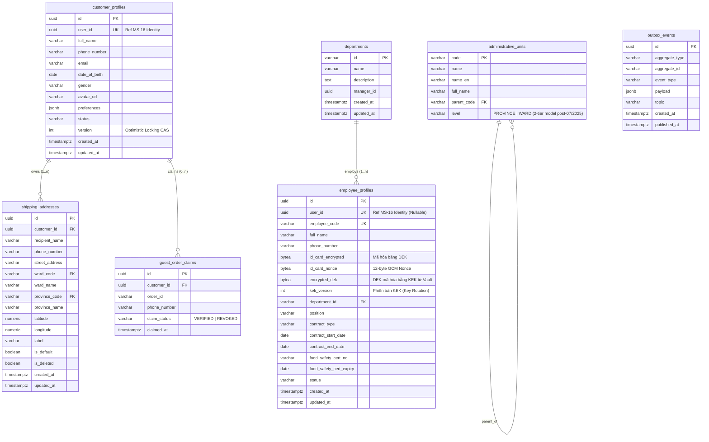

# TÀI LIỆU THIẾT KẾ KIẾN TRÚC CHI TIẾT: MS-15 PROFILE SERVICE
## HỆ SINH THÁI THƯƠNG MẠI ĐIỆN TỬ & CHUỖI CUNG ỨNG ĐẶC SẢN OCOP HUẾ (MÈ XỬNG O MẠ)

---

## 1. TỔNG QUAN & PHẠM VI NGHIỆP VỤ (BOUNDED CONTEXT)

### 1.1. Bounded Context & Định Vị Hệ Thống
- **Mã dịch vụ:** `MS-15` | **Tên dịch vụ:** `profile-service`
- **Bounded Context:** `BC-15: User & Customer Profile Context`
- **Phân loại Domain:** 🟡 **Supporting Domain** (Hỗ trợ nghiệp vụ cốt lõi, tập trung quản lý hồ sơ và dữ liệu liên lạc)
- **Cổng giao tiếp mạng:**
  - **Port gRPC nội bộ (East-West):** `8015`
  - **Port HTTP/REST (North-South via Kong Gateway):** `8015` (Ánh xạ qua Gateway tại `/api/v1/profile/**`, `/api/v1/admin/employees/**`)
- **Cơ sở dữ liệu độc lập:** PostgreSQL 16 (`profile_db`)

### 1.2. Nguyên Tắc Tách Biệt Ranh Giới (Separation of Concerns)
Theo cam kết tại [`service_boundary.md`](../service_boundary.md) và [`bounded_context.md`](../bounded_context.md), `profile-service` tuân thủ nghiêm ngặt nguyên tắc **Đơn nhiệm (Single Responsibility)**:

```text
┌──────────────────────────────────────┐       ┌──────────────────────────────────────┐
│       MS-16: IDENTITY SERVICE        │       │       MS-15: PROFILE SERVICE         │
│  (Authentication & Authorization)    │       │     (Business Profile & Address)     │
├──────────────────────────────────────┤       ├──────────────────────────────────────┤
│ • Tài khoản đăng nhập (Email, Phone) │       │ • Họ tên, Ngày sinh, Giới tính       │
│ • Password Hash (Argon2id)           │  VS   │ • Sổ địa chỉ giao hàng nhiều điểm    │
│ • JWT Keypair, Refresh Tokens        │       │ • Thông tin nhân sự xưởng kẹo (HR)   │
│ • Phân quyền RBAC, Permissions       │       │ • Sở thích ẩm thực OCOP, Dị ứng mè   │
└──────────────────────────────────────┘       └──────────────────────────────────────┘
```

> [!IMPORTANT]
> **Ranh Giới Bất Biến:**
> 1. `profile-service` **KHÔNG** lưu trữ mật khẩu, hash mật khẩu, refresh token hay xử lý logic đăng nhập/xác thực (thuộc `MS-16 identity-service`).
> 2. `profile-service` **KHÔNG** lưu lịch sử đơn hàng (thuộc `MS-04 order-service`), không quản lý số dư điểm thưởng loyalty (thuộc `MS-07 promotion-service`).
> 3. Cung cấp dữ liệu địa chỉ thông qua gRPC `GetDeliveryAddress` để `order-service` chụp **Address Snapshot** bất biến tại thời điểm đặt hàng.

---

## 2. LỰA CHỌN CÔNG NGHỆ (TECH STACK) & ĐỐI SOÁT KIẾN TRÚC

Hệ thống lựa chọn **Go (Golang 1.22+)** kết hợp với kiến trúc **Clean / Hexagonal Architecture** làm nền tảng hiện thực cho `MS-15 profile-service`.

### 2.1. Ma Trận Đánh Giá & Lý Do Chọn Go (Golang)

| Tiêu Chí Kỹ Thuật | Go (Golang 1.22+) | Node.js (TypeScript) | Java (Spring Boot 3) | Python (FastAPI) | Lý Do Lựa Chọn Go Cho MS-15 |
| :--- | :--- | :--- | :--- | :--- | :--- |
| **Độ trễ gRPC (East-West Latency)** | **Cực thấp (< 1.5ms)** | Trung bình (4 - 8ms) | Thấp (2 - 4ms) | Cao (8 - 15ms) | `profile-service` nằm trên luồng phụ trợ của Checkout Critical Path (lấy địa chỉ giao hàng) $\rightarrow$ Cần phản hồi gRPC tức thời. |
| **Mức tiêu thụ RAM (Memory Footprint)** | **~20MB - 35MB** | ~90MB - 150MB | ~350MB - 600MB | ~120MB - 200MB | Hệ thống có 18 microservices. Go giúp tiết kiệm 80% RAM hạ tầng Kubernetes/Docker so với JVM. |
| **Hỗ trợ gRPC & Protobuf** | **Native (Google Core)** | Tốt (Qua thư viện ngoài) | Tốt | Trung bình | Google phát triển cả Go và Protobuf, code gen nhị phân tối ưu, zero runtime overhead. |
| **Tính đồng thời (Concurrency)** | **Goroutine & Channel** (Hàng triệu luồng nhẹ) | Event Loop (Single Thread) | OS Threads / Virtual Threads | AsyncIO (Event Loop) | Xử lý mượt mà hàng nghìn kết nối đồng thời từ Mobile BFF và Order Saga mà không nghẽn Event Loop. |
| **An toàn kiểu dữ liệu (Type Safety)** | Static Typing nghiêm ngặt | TypeScript (Compile-time) | Static Typing | Dynamic / Type hints | Tránh lỗi ngầm thời gian chạy (runtime type casting bugs) khi xử lý dữ liệu địa chỉ và CCCD nhạy cảm. |
| **Tốc độ khởi động (Cold Start)** | **< 50ms** | ~800ms | ~2.5s - 5s | ~1.2s | Khả năng tự phục hồi (Self-healing) và Horizontal Pod Autoscaling (HPA) tức thời khi có đột biến tải lễ Tết. |

### 2.2. Chi Tiết Framework & Thư Viện Lõi (Ecosystem Selection)

```text
                  ┌────────────────────────────────────────┐
                  │          KONG API GATEWAY              │
                  └──────────────────┬─────────────────────┘
                                     │ HTTP REST / gRPC
                                     ▼
┌─────────────────────────────────────────────────────────────────────────────┐
│                            MS-15: PROFILE-SERVICE                           │
│                                                                             │
│  ┌───────────────────────────────────────────────────────────────────────┐  │
│  │                    DELIVERY LAYER (TRANSPORTS)                        │  │
│  │   • HTTP REST: go-chi/chi/v5 (Middleware, Router, Zero-alloc)         │  │
│  │   • gRPC Engine: google.golang.org/grpc (HTTP/2, Protobuf v3)         │  │
│  │   • Input Validation: go-playground/validator/v10                     │  │
│  └───────────────────────────────────┬───────────────────────────────────┘  │
│                                      │ DTOs / Commands                      │
│  ┌───────────────────────────────────▼───────────────────────────────────┐  │
│  │                    APPLICATION / USECASE LAYER                        │  │
│  │   • Customer Profile Management (Optimistic Lock, Claim Guest Order)  │  │
│  │   • Address Book Manager (Atomic Default Address Switcher)            │  │
│  │   • HR Employee Directory (Envelope Encryption, VSATTP Expiry Cron)   │  │
│  │   • Concurrency Shield: golang.org/x/sync/singleflight                │  │
│  └───────────────────────────────────┬───────────────────────────────────┘  │
│                                      │ Domain Entities                      │
│  ┌───────────────────────────────────▼───────────────────────────────────┐  │
│  │                    INFRASTRUCTURE & PERSISTENCE                       │  │
│  │   • SQL Engine: sqlc (Compiled type-safe SQL) + pgx/v5 (Native Pool)  │  │
│  │   • Local L1 Cache: hashicorp/golang-lru/v2 (In-memory, 1000 items)   │  │
│  │   • Distributed L2 Cache: redis/go-redis/v9 (Redis Cluster + Pub/Sub) │  │
│  │   • Event Streaming: segmentio/kafka-go (Pure Go Kafka Producer)      │  │
│  │   • Envelope Encryption: HashiCorp Vault / KMS Transit Engine         │  │
│  └───────────────────────────────────┬───────────────────────────────────┘  │
└──────────────────────────────────────┼──────────────────────────────────────┘
                                       │
                    ┌──────────────────┴──────────────────┐
                    ▼                                     ▼
        ┌───────────────────────┐             ┌───────────────────────┐
        │  POSTGRESQL 16 (DB)   │             │     REDIS CLUSTER     │
        │     `profile_db`      │             │   `profile_cache`     │
        └───────────────────────┘             └───────────────────────┘
```

1. **HTTP Router: `go-chi/chi/v5`**
   - Hoàn toàn tương thích chuẩn `net/http` tiêu chuẩn của Go, zero-memory allocation overhead.
   - Dễ dàng tích hợp Middleware xác thực JWT, tracing OpenTelemetry và rate limiting.
2. **Persistence Engine: `sqlc` + `jackc/pgx/v5`**
   - Không dùng ORM runtime reflection. `sqlc` biên dịch trực tiếp từ raw SQL ra Go code an toàn kiểu 100% tại compile-time.
   - `pgx/v5` tối ưu binary protocol và connection pool.
3. **Kafka Client: `segmentio/kafka-go`**
   - Viết thuần Go 100%, không dính CGO (không cần `librdkafka`), đóng gói Docker container siêu nhẹ (< 20MB).
4. **Bộ đệm 2 tầng kết hợp Pub/Sub Invalidation: `golang-lru/v2` + `go-redis/v9`**
   - Đọc siêu tốc qua L1 Memory + L2 Redis, đồng bộ xóa cache giữa các Pod bằng Redis Pub/Sub và sự kiện domain.

---

## 3. THIẾT KẾ CƠ SỞ DỮ LIỆU (DATABASE SCHEMA DDL)

Cơ sở dữ liệu sử dụng **PostgreSQL 16** với tên database `profile_db`. Toàn bộ khóa chính sử dụng **UUID v7** (Time-ordered UUID) giúp tối ưu hiệu năng ghi của B-Tree Index.



### 3.1. DDL Chi Tiết (PostgreSQL 16 DDL Script)

```sql
-- Kích hoạt extension hỗ trợ sinh UUID và tìm kiếm văn bản tiếng Việt
CREATE EXTENSION IF NOT EXISTS "uuid-ossp";
CREATE EXTENSION IF NOT EXISTS "pg_trgm";

-- =============================================================================
-- 1. BẢNG DANH MỤC ĐƠN VỊ HÀNH CHÍNH VIỆT NAM (Chuẩn hóa mô hình 2 cấp: Tỉnh/TP TW - Xã/Phường)
-- Áp dụng theo cải cách hành chính Quốc gia từ 01/07/2025: Bãi bỏ cấp Huyện/Thị xã.
-- TP. Huế trở thành Thành phố trực thuộc Trung ương, trực tiếp quản lý 40 Xã/Phường.
-- =============================================================================
CREATE TABLE administrative_units (
    code VARCHAR(20) PRIMARY KEY,
    name VARCHAR(100) NOT NULL,
    name_en VARCHAR(100),
    full_name VARCHAR(150) NOT NULL,
    parent_code VARCHAR(20) REFERENCES administrative_units(code),
    level VARCHAR(20) NOT NULL CHECK (level IN ('PROVINCE', 'WARD')),
    created_at TIMESTAMPTZ NOT NULL DEFAULT CURRENT_TIMESTAMP
);

CREATE INDEX idx_admin_units_parent ON administrative_units(parent_code);
-- Index GIN Trigram tối ưu tìm kiếm mờ tên xã/phường
CREATE INDEX idx_admin_units_name_trgm ON administrative_units USING GIN (name gin_trgm_ops);

-- =============================================================================
-- 2. BẢNG HỒ SƠ KHÁCH HÀNG (CUSTOMER PROFILES)
-- =============================================================================
CREATE TABLE customer_profiles (
    id UUID PRIMARY KEY,
    user_id UUID NOT NULL UNIQUE, -- Khóa ngoại mềm tham chiếu sang MS-16 identity-service
    full_name VARCHAR(150) NOT NULL,
    phone_number VARCHAR(20) NOT NULL,
    email VARCHAR(255),
    date_of_birth DATE,
    gender VARCHAR(10) CHECK (gender IN ('MALE', 'FEMALE', 'OTHER', 'UNSPECIFIED')),
    avatar_url VARCHAR(500),
    preferences JSONB DEFAULT '{"favorite_products": [], "dietary_preference": "NORMAL", "allergy_alert": []}'::jsonb,
    status VARCHAR(20) NOT NULL DEFAULT 'ACTIVE' CHECK (status IN ('ACTIVE', 'SUSPENDED', 'PENDING_VERIFICATION')),
    version INT NOT NULL DEFAULT 1, -- Khóa lạc quan (Optimistic Locking) chống Lost Update
    created_at TIMESTAMPTZ NOT NULL DEFAULT CURRENT_TIMESTAMP,
    updated_at TIMESTAMPTZ NOT NULL DEFAULT CURRENT_TIMESTAMP
);

CREATE INDEX idx_customer_phone ON customer_profiles(phone_number);
CREATE INDEX idx_customer_email ON customer_profiles(email);
CREATE INDEX idx_customer_user_id ON customer_profiles(user_id);
CREATE INDEX idx_customer_preferences ON customer_profiles USING GIN (preferences);

-- =============================================================================
-- 3. BẢNG SỔ ĐỊA CHỈ GIAO HÀNG (SHIPPING ADDRESSES - 2-TIER STREAMLINED)
-- =============================================================================
CREATE TABLE shipping_addresses (
    id UUID PRIMARY KEY,
    customer_id UUID NOT NULL REFERENCES customer_profiles(id) ON DELETE CASCADE,
    recipient_name VARCHAR(150) NOT NULL,
    phone_number VARCHAR(20) NOT NULL,
    street_address VARCHAR(255) NOT NULL, -- Số nhà, tên ngõ, tên đường
    ward_code VARCHAR(20) NOT NULL REFERENCES administrative_units(code),
    ward_name VARCHAR(100) NOT NULL,
    province_code VARCHAR(20) NOT NULL REFERENCES administrative_units(code),
    province_name VARCHAR(100) NOT NULL,
    latitude DECIMAL(10, 7), -- Tọa độ địa lý phục vụ định vị trạm giao hàng
    longitude DECIMAL(10, 7),
    label VARCHAR(50) DEFAULT 'HOME' CHECK (label IN ('HOME', 'OFFICE', 'GIFT_RECIPIENT', 'OTHER')),
    is_default BOOLEAN NOT NULL DEFAULT FALSE,
    is_deleted BOOLEAN NOT NULL DEFAULT FALSE, -- Xóa mềm (Soft Delete)
    created_at TIMESTAMPTZ NOT NULL DEFAULT CURRENT_TIMESTAMP,
    updated_at TIMESTAMPTZ NOT NULL DEFAULT CURRENT_TIMESTAMP
);

-- RÀNG BUỘC TOÀN VẸN TUYỆT ĐỐI: Mỗi khách hàng chỉ có DUY NHẤT 1 địa chỉ mặc định tại một thời điểm
CREATE UNIQUE INDEX uq_customer_default_address 
ON shipping_addresses (customer_id) 
WHERE is_default = TRUE AND is_deleted = FALSE;

CREATE INDEX idx_shipping_addresses_customer ON shipping_addresses(customer_id) WHERE is_deleted = FALSE;

-- =============================================================================
-- 4. BẢNG LIÊN KẾT ĐƠN HÀNG VÃNG LAI (GUEST ORDER CLAIMS)
-- =============================================================================
CREATE TABLE guest_order_claims (
    id UUID PRIMARY KEY,
    customer_id UUID NOT NULL REFERENCES customer_profiles(id) ON DELETE CASCADE,
    order_id VARCHAR(50) NOT NULL,
    phone_number VARCHAR(20) NOT NULL,
    claimed_at TIMESTAMPTZ NOT NULL DEFAULT CURRENT_TIMESTAMP,
    claim_status VARCHAR(20) NOT NULL DEFAULT 'VERIFIED' CHECK (claim_status IN ('VERIFIED', 'REVOKED'))
);

CREATE INDEX idx_guest_claims_phone ON guest_order_claims(phone_number);

-- RÀNG BUỘC CHÍNH XÁC: Chỉ áp dụng Unique Index khi trạng thái là VERIFIED.
-- Nếu claim bị thu hồi (REVOKED do gán nhầm), order_id được giải phóng để chủ sở hữu hợp pháp có thể claim lại!
CREATE UNIQUE INDEX uq_order_claim_active 
ON guest_order_claims(order_id) 
WHERE claim_status = 'VERIFIED';

-- =============================================================================
-- 5. BẢNG PHÒNG BAN XƯỞNG & CỬA HÀNG (DEPARTMENTS)
-- =============================================================================
CREATE TABLE departments (
    id VARCHAR(50) PRIMARY KEY,
    name VARCHAR(150) NOT NULL,
    description TEXT,
    manager_id UUID,
    created_at TIMESTAMPTZ NOT NULL DEFAULT CURRENT_TIMESTAMP,
    updated_at TIMESTAMPTZ NOT NULL DEFAULT CURRENT_TIMESTAMP
);

INSERT INTO departments (id, name, description) VALUES
('DEPT-PROD-HUONGTHUY', 'Xưởng Nấu Kẹo Hương Thủy', 'Khu vực nấu mè xửng truyền thống và kiểm tra mẻ kẹo'),
('DEPT-FULFILL-PACK', 'Bộ Phận Đóng Gói & Niêm Phong', 'Khu vực cân kẹo, dán tem QR OCOP, đóng thùng có camera ghi hình'),
('DEPT-WAREHOUSE', 'Kho Nguyên Liệu & Thành Phẩm', 'Bảo quản mè vừng, đậu phụng, đường non và kẹo xuất xưởng'),
('DEPT-RETAIL-HUEMARKET', 'Cửa Hàng Trưng Bày Huế', 'Showroom bán lẻ và tiếp đón khách du lịch dùng thử kẹo');

-- =============================================================================
-- 6. BẢNG HỒ SƠ NHÂN SỰ NỘI BỘ (EMPLOYEE PROFILES - HR)
-- =============================================================================
CREATE TABLE employee_profiles (
    id UUID PRIMARY KEY,
    user_id UUID UNIQUE, -- Cho phép NULL đối với thợ thời vụ vụ mùa Tết chưa tạo user hệ thống
    employee_code VARCHAR(50) NOT NULL UNIQUE, -- Ví dụ: OMA-EMP-2026-008
    full_name VARCHAR(150) NOT NULL,
    phone_number VARCHAR(20) NOT NULL,
    
    -- Dữ liệu PII nhạy cảm: Áp dụng chuẩn Envelope Encryption (DEK/KEK)
    id_card_encrypted BYTEA NOT NULL,   -- Dữ liệu số CCCD được mã hóa bằng DEK cục bộ
    id_card_nonce BYTEA NOT NULL,       -- 12-byte GCM Nonce ngẫu nhiên
    encrypted_dek BYTEA NOT NULL,       -- DEK được mã hóa bởi KEK (Key Encryption Key từ Vault/KMS)
    kek_version INT NOT NULL DEFAULT 1, -- Phiên bản KEK phục vụ Key Rotation không cần giải mã lại data
    
    department_id VARCHAR(50) NOT NULL REFERENCES departments(id),
    position VARCHAR(100) NOT NULL, -- Ví dụ: "Nghệ nhân nấu kẹo", "Trưởng ca đóng gói"
    contract_type VARCHAR(20) NOT NULL CHECK (contract_type IN ('FULLTIME', 'PARTTIME', 'SEASONAL')),
    contract_start_date DATE NOT NULL,
    contract_end_date DATE,
    
    -- Chứng chỉ An toàn vệ sinh thực phẩm (Bắt buộc theo chuẩn OCOP 4 sao)
    food_safety_cert_no VARCHAR(100),
    food_safety_cert_expiry DATE,
    
    status VARCHAR(20) NOT NULL DEFAULT 'ACTIVE' CHECK (status IN ('ACTIVE', 'ON_LEAVE', 'TERMINATED')),
    created_at TIMESTAMPTZ NOT NULL DEFAULT CURRENT_TIMESTAMP,
    updated_at TIMESTAMPTZ NOT NULL DEFAULT CURRENT_TIMESTAMP
);

CREATE INDEX idx_emp_code ON employee_profiles(employee_code);
CREATE INDEX idx_emp_department ON employee_profiles(department_id);
CREATE INDEX idx_emp_status ON employee_profiles(status);
CREATE INDEX idx_emp_cert_expiry ON employee_profiles(food_safety_cert_expiry);

-- =============================================================================
-- 7. BẢNG TRANSACTIONAL OUTBOX (ĐẢM BẢO TÍNH NHẤT QUÁN VỚI KAFKA)
-- =============================================================================
CREATE TABLE outbox_events (
    id UUID PRIMARY KEY,
    aggregate_type VARCHAR(50) NOT NULL, -- 'CustomerProfile', 'EmployeeProfile', 'Address'
    aggregate_id VARCHAR(100) NOT NULL,
    event_type VARCHAR(100) NOT NULL,    -- 'ProfileUpdatedEvent', 'DefaultAddressSwitchedEvent'
    payload JSONB NOT NULL,
    topic VARCHAR(100) NOT NULL,         -- 'profile.events.v1'
    created_at TIMESTAMPTZ NOT NULL DEFAULT CURRENT_TIMESTAMP,
    published_at TIMESTAMPTZ             -- NULL nếu chưa bắn lên Kafka
);

CREATE INDEX idx_outbox_unpublished ON outbox_events(created_at) WHERE published_at IS NULL;
```

---

## 4. CHI TIẾT CÁC GIẢI THUẬT & CƠ CHẾ KỸ THUẬT LÕI (ALGORITHMS & DATA STRUCTURES)

### 4.1. Giải Thuật 1: Chuyển Đổi Địa Chỉ Mặc Định An Toàn Tuyệt Đối (Atomic Default Address Switcher)

#### Bối cảnh bài toán:
Khách hàng có thể mở ứng dụng trên 2 điện thoại cùng lúc hoặc click đúp liên tục vào nút "Đặt làm địa chỉ mặc định". Nếu thực hiện câu lệnh `UPDATE` đơn giản không có cô lập giao dịch, hệ thống sẽ gặp hiện tượng **Race Condition** dẫn tới khách hàng có 2 địa chỉ mặc định hoặc không có địa chỉ mặc định nào.

#### Giải thuật Hiện thực (Go + PostgreSQL):
1. Thiết lập mức độ cô lập Transaction: `READ COMMITTED` kết hợp khóa dòng có chọn lọc (`SELECT FOR UPDATE`).
2. Tận dụng **PostgreSQL Partial Unique Index** (`WHERE is_default = TRUE AND is_deleted = FALSE`). Cơ chế này đảm bảo tầng DB sẽ lập tức ném lỗi vi phạm ràng buộc duy nhất nếu có 2 dòng đồng thời là `is_default = TRUE`.
3. Câu lệnh Atomic Switch thực thi trong 1 Transaction duy nhất:

```go
// SwitchDefaultAddress thực hiện hoán đổi địa chỉ mặc định nguyên tử
func (r *addressRepository) SwitchDefaultAddress(ctx context.Context, customerID, newDefaultAddressID uuid.UUID) error {
    tx, err := r.db.BeginTx(ctx, pgx.TxOptions{IsoLevel: pgx.ReadCommitted})
    if err != nil {
        return err
    }
    defer tx.Rollback(ctx)

    // Bước 1: Khóa kiểm tra quyền sở hữu địa chỉ của đúng khách hàng
    var exists bool
    err = tx.QueryRow(ctx, 
        `SELECT EXISTS(SELECT 1 FROM shipping_addresses WHERE id = $1 AND customer_id = $2 AND is_deleted = FALSE FOR UPDATE)`,
        newDefaultAddressID, customerID).Scan(&exists)
    if err != nil || !exists {
        return ErrAddressNotFound
    }

    // Bước 2: Hạ cờ địa chỉ mặc định cũ về FALSE
    _, err = tx.Exec(ctx,
        `UPDATE shipping_addresses 
         SET is_default = FALSE, updated_at = CURRENT_TIMESTAMP 
         WHERE customer_id = $1 AND is_default = TRUE AND is_deleted = FALSE`,
        customerID)
    if err != nil {
        return fmt.Errorf("failed to reset old default address: %w", err)
    }

    // Bước 3: Bật cờ địa chỉ mới lên TRUE
    _, err = tx.Exec(ctx,
        `UPDATE shipping_addresses 
         SET is_default = TRUE, updated_at = CURRENT_TIMESTAMP 
         WHERE id = $1 AND customer_id = $2`,
        newDefaultAddressID, customerID)
    if err != nil {
        return fmt.Errorf("failed to set new default address: %w", err)
    }

    // Bước 4: Ghi sự kiện vào Outbox cùng Transaction
    outboxPayload, _ := json.Marshal(map[string]any{
        "customer_id": customerID.String(),
        "default_address_id": newDefaultAddressID.String(),
        "switched_at": time.Now().UTC(),
    })
    _, err = tx.Exec(ctx,
        `INSERT INTO outbox_events (id, aggregate_type, aggregate_id, event_type, payload, topic) 
         VALUES ($1, 'Address', $2, 'DefaultAddressSwitchedEvent', $3, 'profile.events.v1')`,
        uuid.NewV7(), customerID.String(), outboxPayload)
    if err != nil {
        return err
    }

    return tx.Commit(ctx)
}
```

---

### 4.2. Giải Thuật 2: Mã Hóa Dữ Liệu PII Chuẩn Envelope Encryption (DEK/KEK) & Chiến Lược Quản Lý Khóa (Key Rotation)

#### Bối cảnh & Chuẩn Thuật Ngữ:
Tuân thủ **Nghị định 13/2023/NĐ-CP** về Bảo vệ Dữ liệu Cá nhân và tiêu chuẩn `BR-AUDIT-01`. Dữ liệu Căn cước công dân (CCCD) và hợp đồng lao động của thợ nấu kẹo không được mã hóa bằng khóa tĩnh duy nhất (Single Static Key).
Hệ thống triển khai chuẩn **Envelope Encryption 2 lớp (Two-tier Key Hierarchy)**:
- **Data Encryption Key (DEK):** Mỗi bản ghi nhân sự sở hữu một khóa AES 256-bit riêng biệt, sinh ngẫu nhiên tức thời trong bộ nhớ RAM để mã hóa dữ liệu CCCD.
- **Key Encryption Key (KEK):** Khóa chủ quản trị tập trung bên trong **HashiCorp Vault / AWS KMS** (Transit Secrets Engine). KEK không bao giờ rời khỏi vùng bảo mật (HSM/Vault). KEK chỉ dùng để mã hóa DEK thành `encrypted_dek`.

```text
┌─────────────────────────────────────────────────────────────────────────────┐
│                    TIẾN TRÌNH GHI (ENVELOPE ENCRYPTION)                     │
│                                                                             │
│  CCCD Plaintext ───┐                                                        │
│                    ▼                                                        │
│  [crypto/rand] ──► DEK ──► [AES-256-GCM] ──► id_card_encrypted + Nonce      │
│                     │                                                       │
│                     ▼ (Gửi qua gRPC/mTLS)                                   │
│            ┌──────────────────┐                                             │
│            │ HASHICORP VAULT  │ (KEK v1)                                    │
│            └────────┬─────────┘                                             │
│                     ▼                                                       │
│               encrypted_dek + kek_version: 1                                │
│                     │                                                       │
│                     ▼ Lưu vào PostgreSQL:                                   │
│  { id_card_encrypted, id_card_nonce, encrypted_dek, kek_version }           │
└─────────────────────────────────────────────────────────────────────────────┘
```

#### Ưu Điểm Tuyệt Đối & Chiến Lược Xoay Vòng Khóa (Key Rotation Strategy):
1. **Cô lập thiệt hại (Blast Radius Isolation):** Nếu một DEK của bản ghi nào đó vô tình bị giải mã hoặc lộ lọt, chỉ có **duy nhất 1 nhân viên đó bị ảnh hưởng**. Kẻ tấn công không thể giải mã dữ liệu của hàng trăm nhân sự khác.
2. **Xoay vòng KEK định kỳ 90 ngày (Zero-Downtime Re-wrapping):**
   - Khi KEK trong Vault được xoay vòng lên phiên bản mới (`v2`), các bản ghi cũ vẫn lưu `kek_version = 1`. Service vẫn giải mã được bình thường vì Vault Transit hỗ trợ giải mã theo đúng phiên bản KEK lịch sử.
   - **Background Re-wrap Job:** Khi cần nâng cấp toàn bộ dữ liệu lên KEK mới để tuân thủ kiểm toán, worker chỉ cần gọi Vault Transit API để **Re-wrap `encrypted_dek`** (giải mã DEK 32 bytes bằng KEK v1 rồi mã hóa lại bằng KEK v2, cập nhật `kek_version = 2`).
   - **Tối ưu vượt trội:** Không cần giải mã lại chuỗi ciphertext CCCD, không cần load dữ liệu nhạy cảm ra plaintext trong RAM worker, giảm 99% thời gian xử lý xoay khóa.

```go
package security

import (
    "context"
    "crypto/aes"
    "crypto/cipher"
    "crypto/rand"
    "errors"
    "io"
)

// VaultKMSClient định nghĩa interface giao tiếp với KMS / HashiCorp Vault
type VaultKMSClient interface {
    EncryptDEK(ctx context.Context, keyName string, dek []byte) (encryptedDEK []byte, keyVersion int, err error)
    DecryptDEK(ctx context.Context, keyName string, encryptedDEK []byte, keyVersion int) (dek []byte, err error)
}

type EnvelopeEncryptor struct {
    kmsClient VaultKMSClient
    keyName   string
}

func NewEnvelopeEncryptor(kms VaultKMSClient, keyName string) *EnvelopeEncryptor {
    return &EnvelopeEncryptor{kmsClient: kms, keyName: keyName}
}

type EncryptedPayload struct {
    Ciphertext   []byte
    Nonce        []byte
    EncryptedDEK []byte
    KEKVersion   int
}

// Encrypt thực hiện chuẩn Envelope Encryption
func (e *EnvelopeEncryptor) Encrypt(ctx context.Context, plaintext string) (*EncryptedPayload, error) {
    // Bước 1: Sinh Data Encryption Key (DEK) 256-bit ngẫu nhiên
    dek := make([]byte, 32)
    if _, err := io.ReadFull(rand.Reader, dek); err != nil {
        return nil, err
    }
    // Đảm bảo zeroize DEK khỏi RAM khi hàm kết thúc
    defer func() {
        for i := range dek {
            dek[i] = 0
        }
    }()

    // Bước 2: Dùng DEK mã hóa dữ liệu bằng AES-256-GCM
    block, err := aes.NewCipher(dek)
    if err != nil {
        return nil, err
    }
    gcm, err := cipher.NewGCM(block)
    if err != nil {
        return nil, err
    }

    nonce := make([]byte, gcm.NonceSize()) // 12 bytes
    if _, err := io.ReadFull(rand.Reader, nonce); err != nil {
        return nil, err
    }
    ciphertext := gcm.Seal(nil, nonce, []byte(plaintext), nil)

    // Bước 3: Đưa DEK vào Vault để KEK mã hóa thành Encrypted DEK
    encryptedDEK, kekVersion, err := e.kmsClient.EncryptDEK(ctx, e.keyName, dek)
    if err != nil {
        return nil, err
    }

    return &EncryptedPayload{
        Ciphertext:   ciphertext,
        Nonce:        nonce,
        EncryptedDEK: encryptedDEK,
        KEKVersion:   kekVersion,
    }, nil
}

// Decrypt giải mã dữ liệu thông qua Vault KEK
func (e *EnvelopeEncryptor) Decrypt(ctx context.Context, payload *EncryptedPayload) (string, error) {
    // Bước 1: Gọi Vault giải mã DEK bằng KEK đúng phiên bản
    dek, err := e.kmsClient.DecryptDEK(ctx, e.keyName, payload.EncryptedDEK, payload.KEKVersion)
    if err != nil {
        return "", err
    }
    defer func() {
        for i := range dek {
            dek[i] = 0
        }
    }()

    // Bước 2: Dùng DEK giải mã ciphertext cục bộ
    block, err := aes.NewCipher(dek)
    if err != nil {
        return "", err
    }
    gcm, err := cipher.NewGCM(block)
    if err != nil {
        return "", err
    }

    plaintextBytes, err := gcm.Open(nil, payload.Nonce, payload.Ciphertext, nil)
    if err != nil {
        return "", errors.New("pii decryption authentication failed: data corrupted or tampered")
    }

    return string(plaintextBytes), nil
}

#### Đánh Đổi Kiến Trúc (Architectural Trade-Off) & Bộ Đệm DEK Trong Bộ Nhớ (Short-Lived DEK Cache)
- **Đánh đổi có chủ đích (Security > Availability cho Admin Plane):**
  - Trong mô hình Envelope Encryption, mỗi lượt giải mã CCCD của nhân sự đòi hỏi một cuộc gọi RPC tới HashiCorp Vault để unwrap DEK.
  - Nghĩa là màn hình HR xem hồ sơ nhân viên giờ có **phụ thuộc ngoài (External Runtime Dependency) vào Vault**. Nếu Vault downtime, HR tạm thời không xem được CCCD dù DB PostgreSQL vẫn hoạt động bình thường.
  - **Cơ sở đánh đổi:** Đây là sự lựa chọn hợp lý và có chủ đích: Luồng xem CCCD chỉ là tác vụ nội bộ của HR Manager (Admin Plane), **hoàn toàn không nằm trên luồng mua hàng của khách hàng (Customer Critical Path)**. Yêu cầu bảo vệ dữ liệu nhạy cảm theo pháp luật và ngăn chặn lộ lọt PII được ưu tiên cao hơn tính sẵn sàng 99.99%.
- **Tối ưu hiệu năng bằng Short-Lived In-Memory DEK Cache:**
  - Để tránh việc HR duyệt danh sách hàng chục thợ xưởng phải gọi Vault liên tục gây quá tải, service triển khai bộ đệm DEK ngắn hạn trong RAM:
    - **Cơ chế:** Dùng `hashicorp/golang-lru/v2` lưu DEK đã unwrap trong RAM của Pod với **TTL ngắn (3 - 5 phút)** theo phiên làm việc.
    - **Khóa cache:** `SHA-256(encrypted_dek)`.
    - **Nguyên tắc an toàn tuyệt đối:** Cài đặt hook `OnEvict` tự động `zeroize` vùng nhớ (`dek[i] = 0`). **Tuyệt đối không bao giờ ghi DEK ra log, đĩa cứng hay Redis dùng chung**. Khi Pod bị kill, dữ liệu khóa trong RAM lập tức biến mất hoàn toàn.
```

---

### 4.3. Giải Thuật 3: Chuẩn Hóa & Tìm Kiếm Mờ Địa Chỉ Hành Chính (2-Stage Search Pipeline & Ranh Giới Critical Path)

#### Phân Định Ranh Giới Đường Găng (Critical Path Boundary):
> [!IMPORTANT]
> **Ranh giới thực thi của thuật toán Fuzzy Matching:**
> 1. **TUYỆT ĐỐI KHÔNG NẰM TRÊN CHECKOUT CRITICAL PATH:** Khi khách hàng đặt kẹo tại `/checkout`, `MS-04 order-service` gọi gRPC `GetDeliveryAddress(address_id)`. Đây là thao tác tìm kiếm khóa chính $O(1)$ trên B-Tree index và Cache, **hoàn toàn không chạy thuật toán so khớp mờ**, đảm bảo cam kết SLA $P99 \le 5\text{ms}$.
> 2. **CHỈ NẰM TRÊN LUỒNG TẠO/SỬA ĐỊA CHỈ (ASYNC/UI PATH):** Thuật toán so khớp mờ chỉ kích hoạt khi khách hàng nhập chuỗi địa chỉ mới trên giao diện Website/Mobile App (`POST /api/v1/profile/addresses/validate` hoặc autocomplete).

#### Pipeline 2 Giai Đoạn (2-Stage Pipeline):
Nếu chạy thuật toán Levenshtein tuần tự trên toàn bộ ~11.000 phường/xã của Việt Nam trong mã nguồn Go, độ phức tạp tính toán sẽ là $11.000 \times O(n \times m)$, gây nghẽn CPU nghiêm trọng. Hệ thống kết hợp 2 giai đoạn:

```text
[Input Người Dùng: "thuan hoa"]
          │
          ▼ Giai đoạn 1: Database Pre-filtering (PostgreSQL pg_trgm)
┌─────────────────────────────────────────────────────────────────────────────┐
│  SELECT code, name, parent_code, level, similarity(name, $1) AS score      │
│  FROM administrative_units                                                  │
│  WHERE name % $1 AND level = $2                                             │
│  ORDER BY score DESC LIMIT 20;                                              │
│  (Sử dụng GIN Trigram Index idx_admin_units_name_trgm -> Thời gian: < 2ms)   │
└─────────────────────────────────────┬───────────────────────────────────────┘
                                      │ Top 20 ứng viên
                                      ▼ Giai đoạn 2: In-Memory Go Refinement
┌─────────────────────────────────────────────────────────────────────────────┐
│  1. Khử dấu Tiếng Việt chuẩn hóa rune                                       │
│  2. Tách bỏ stopwords ("phường", "xã", "thành phố")                         │
│  3. Tính khoảng cách Levenshtein chính xác trên 20 ứng viên                 │
│  4. Trả về kết quả khớp nhất kèm mã hành chính chuẩn cấp Tỉnh/Huyện/Xã      │
└─────────────────────────────────────────────────────────────────────────────┘
```

```go
// Stage 2: Tính khoảng cách Levenshtein trên 20 ứng viên đã được DB lọc trước
func CalculateRefinedSimilarity(userInput, candidateName string) float64 {
    u := cleanAdministrativeStopwords(stripVietnameseTones(userInput))
    c := cleanAdministrativeStopwords(stripVietnameseTones(candidateName))

    r1, r2 := []rune(u), []rune(c)
    dist := LevenshteinDistance(r1, r2)
    maxLen := len(r1)
    if len(r2) > maxLen {
        maxLen = len(r2)
    }
    if maxLen == 0 {
        return 1.0
    }
    return 1.0 - float64(dist)/float64(maxLen)
}

func LevenshteinDistance(s1, s2 []rune) int {
    len1, len2 := len(s1), len(s2)
    matrix := make([][]int, len1+1)
    for i := range matrix {
        matrix[i] = make([]int, len2+1)
        matrix[i][0] = i
    }
    for j := 0; j <= len2; j++ {
        matrix[0][j] = j
    }

    for i := 1; i <= len1; i++ {
        for j := 1; j <= len2; j++ {
            cost := 0
            if s1[i-1] != s2[j-1] {
                cost = 1
            }
            matrix[i][j] = min3(
                matrix[i-1][j]+1,      // Xóa
                matrix[i][j-1]+1,      // Thêm
                matrix[i-1][j-1]+cost, // Thay thế
            )
        }
    }
    return matrix[len1][len2]
}

func min3(a, b, c int) int {
    if a < b && a < c { return a }
    if b < c { return b }
    return c
}
```

---

### 4.4. Giải Thuật 4: Bộ Đệm Đa Tầng & Cơ Chế Xóa Bộ Đệm Nhất Quán Khi Ghi (Write-Path Cache Invalidation)

#### Vấn đề Sống Còn Của Address Snapshot:
Nếu chỉ tập trung tối ưu luồng Đọc (L1 30s $\rightarrow$ L2 Redis 15m) mà **thiếu cơ chế xóa cache chủ động khi Ghi** (`UpdateProfile`, `SwitchDefaultAddress`, `DeleteAddress`), thì sau khi khách đổi địa chỉ giao kẹo, Order Service gọi `GetDeliveryAddress` sẽ đọc phải địa chỉ cũ tồn đọng tới 15 phút. Điều này dẫn tới thợ đóng thùng in nhãn giao nhầm nhà khách hàng!

#### Kiến Trúc Đồng Bộ Đa Tầng (Dual-Layer Invalidation):

```text
LUỒNG GHI (PUT /api/v1/profile/addresses/{id}):
1. Cập nhật PostgreSQL Database Transaction (ACID)
2. Bước Invalidation Cục Bộ Tức Thời (Synchronous Local Invalidation):
   ├── l1Cache.Remove(customerID)  -> Xóa RAM pod hiện tại
   └── redisClient.Del(ctx, key)   -> Xóa L2 Redis Cluster ngay lập tức
3. Bước Invalidation Phân Tán (Distributed Invalidation Across Pod Replicas):
   └── redisClient.Publish("cache:invalidate:profile", customerID)
       (Tất cả các Pod replica khác nhận message qua kênh Pub/Sub và xóa L1 RAM của mình)
```

```go
type ProfileUsecase struct {
    l1Cache      *lru.Cache[string, *CustomerProfile]
    redisClient  *redis.Client
    repo         CustomerProfileRepository
    singleFlight singleflight.Group
}

// InvalidateCustomerCache thực hiện xóa sạch bộ đệm cả 2 tầng
func (u *ProfileUsecase) InvalidateCustomerCache(ctx context.Context, customerID string) error {
    cacheKey := fmt.Sprintf("profile:cust:%s", customerID)

    // 1. Xóa L1 Cache cục bộ của Pod hiện tại
    u.l1Cache.Remove(customerID)

    // 2. Xóa L2 Cache trên Redis Cluster
    if err := u.redisClient.Del(ctx, cacheKey).Err(); err != nil {
        // Log warning nhưng không fail transaction DB
        log.Warn().Err(err).Str("customer_id", customerID).Msg("Failed to delete L2 Redis cache")
    }

    // 3. Bắn tín hiệu Pub/Sub báo tất cả các Pod replica khác xóa L1 Cache của chúng
    _ = u.redisClient.Publish(ctx, "cache:invalidate:profile", customerID).Err()

    return nil
}

// SubscribeCacheInvalidation chạy ngầm trên mỗi Pod để lắng nghe lệnh xóa L1 Cache
func (u *ProfileUsecase) SubscribeCacheInvalidation(ctx context.Context) {
    pubsub := u.redisClient.Subscribe(ctx, "cache:invalidate:profile")
    ch := pubsub.Channel()

    go func() {
        for msg := range ch {
            customerID := msg.Payload
            u.l1Cache.Remove(customerID)
        }
    }()
}

// GetCustomerProfile đọc có SingleFlight chống Cache Stampede
func (u *ProfileUsecase) GetCustomerProfile(ctx context.Context, customerID string) (*CustomerProfile, error) {
    if val, ok := u.l1Cache.Get(customerID); ok {
        return val, nil
    }

    cacheKey := fmt.Sprintf("profile:cust:%s", customerID)
    if cachedBytes, err := u.redisClient.Get(ctx, cacheKey).Bytes(); err == nil {
        var profile CustomerProfile
        if err := msgpack.Unmarshal(cachedBytes, &profile); err == nil {
            u.l1Cache.Add(customerID, &profile)
            return &profile, nil
        }
    }

    result, err, _ := u.singleFlight.Do(customerID, func() (any, error) {
        profile, err := u.repo.FindByID(ctx, customerID)
        if err != nil {
            return nil, err
        }
        if data, err := msgpack.Marshal(profile); err == nil {
            u.redisClient.Set(ctx, cacheKey, data, 15*time.Minute)
        }
        u.l1Cache.Add(customerID, profile)
        return profile, nil
    })

    if err != nil {
        return nil, err
    }
    return result.(*CustomerProfile), nil
}
```

---

### 4.5. Giải Thuật 5: Transactional Outbox Pattern & Background Publisher

#### Cam kết độ tin cậy:
Để đảm bảo các sự kiện nghiệp vụ (`ProfileUpdatedEvent`, `DefaultAddressSwitchedEvent`) được đẩy lên Kafka chính xác 100% mà không bị mất tin khi server bị restart đột ngột, service tuyệt đối **không bắn Kafka trực tiếp bên trong HTTP Handler**.

#### Cơ chế hoạt động:
1. Trong cùng transaction SQL lưu hồ sơ, ghi một bản ghi vào bảng `outbox_events`.
2. Một Worker chạy nền (`OutboxRelay`) sử dụng vòng lặp `time.Ticker` quét các bản ghi `WHERE published_at IS NULL` với câu lệnh an toàn `SELECT ... FOR UPDATE SKIP LOCKED`.
3. Worker publish sự kiện lên topic Kafka `profile.events.v1`.
4. Khi Kafka Broker trả về ACK xác nhận ghi thành công, Worker cập nhật `published_at = CURRENT_TIMESTAMP`.

---

### 4.6. Giải Thuật 6: Kiểm Soát Đồng Thời Bằng Khóa Lạc Quan (Optimistic Concurrency Control - CAS)

#### Bối cảnh:
Khách hàng có thể đang sửa số điện thoại trên Mobile App, trong khi cùng lúc đó nhân viên CSKH đang hỗ trợ cập nhật họ tên trên Admin Web CMS. Nếu không có cơ chế kiểm soát, người bấm sau sẽ **ghi đè âm thầm (Lost Update)** dữ liệu của người bấm trước mà không hề hay biết.

#### Hiện thực bằng Cột `version INT`:
1. Mỗi khi đọc thông tin hồ sơ, client nhận kèm giá trị `version` hiện tại (ví dụ: `version: 3`).
2. Khi gửi yêu cầu cập nhật (`PUT /api/v1/profile`), client bắt buộc phải gửi kèm `expected_version = 3`.
3. Câu lệnh SQL thực thi theo cơ chế **Compare-And-Swap (CAS)**:
   ```sql
   UPDATE customer_profiles 
   SET full_name = $1, email = $2, preferences = $3, 
       version = version + 1, updated_at = CURRENT_TIMESTAMP 
   WHERE id = $4 AND version = $5;
   ```
4. Kiểm tra số dòng bị ảnh hưởng (`RowsAffected`):
   - Nếu `RowsAffected == 1`: Cập nhật thành công, phiên bản tăng lên 4.
   - Nếu `RowsAffected == 0`: Có thể do **version bị thay đổi trước** (xung đột thật $\rightarrow$ HTTP 409 Conflict) HOẶC **bản ghi không tồn tại / đã bị xóa** ($\rightarrow$ HTTP 404 Not Found). Cần thực hiện kiểm tra `SELECT EXISTS` phụ để phân biệt rạch ròi 2 trường hợp, giúp Frontend hiển thị UX phù hợp (404 báo hồ sơ không tồn tại, 409 hiển thị popup gợi ý tải lại dữ liệu).

```go
func (r *customerRepository) UpdateProfileWithOptimisticLock(ctx context.Context, p *CustomerProfile, expectedVersion int) error {
    query := `
        UPDATE customer_profiles 
        SET full_name = $1, email = $2, preferences = $3, 
            version = version + 1, updated_at = CURRENT_TIMESTAMP 
        WHERE id = $4 AND version = $5`

    cmdTag, err := r.db.Exec(ctx, query, p.FullName, p.Email, p.Preferences, p.ID, expectedVersion)
    if err != nil {
        return err
    }

    // Phân biệt chính xác giữa 404 (Không tồn tại) và 409 (Xung đột version)
    if cmdTag.RowsAffected() == 0 {
        var exists bool
        checkErr := r.db.QueryRow(ctx, `SELECT EXISTS(SELECT 1 FROM customer_profiles WHERE id = $1)`, p.ID).Scan(&exists)
        if checkErr != nil {
            return checkErr
        }
        if !exists {
            return ErrCustomerNotFound // Trả về HTTP 404 Not Found
        }
        return ErrOptimisticLockConflict // Trả về HTTP 409 Conflict (Bản ghi tồn tại nhưng version lệch)
    }

    return nil
}
```

---

### 4.7. Giải Thuật 7: Giám Sát Tuân Thủ Chứng Chỉ VSATTP Định Kỳ (Compliance Expiry Warning Pattern)

#### Bối cảnh & Chuẩn OCOP 4 Sao:
Xưởng sản xuất Mè Xửng O Mạ bắt buộc phải duy trì 100% thợ nấu kẹo và nhân viên đóng gói có Giấy xác nhận kiến thức An toàn thực phẩm (VSATTP) còn hiệu lực. Nếu chứng chỉ hết hạn âm thầm mà không gia hạn, cơ sở sẽ đối mặt với rủi ro pháp lý bị đình chỉ sản xuất hoặc tước danh hiệu OCOP 4 sao.

#### Cơ Chế Cảnh Báo (Tương Tự Pattern FEFO Expiry Của Inventory Service):
1. **Background Cron Worker:** Chạy định kỳ lúc **02:00 AM mỗi ngày**.
2. **Quét dữ liệu cận hạn:**
   ```sql
   SELECT id, employee_code, full_name, department_id, food_safety_cert_no, food_safety_cert_expiry,
          (food_safety_cert_expiry - CURRENT_DATE) AS days_remaining
   FROM employee_profiles
   WHERE status = 'ACTIVE' 
     AND food_safety_cert_expiry IS NOT NULL 
     AND food_safety_cert_expiry <= CURRENT_DATE + INTERVAL '30 days';
   ```
3. **Phát sự kiện cảnh báo đa cấp độ:**
   - Nếu còn $\le 30$ ngày: Bắn sự kiện `StaffComplianceWarningEvent` (Mức độ: `WARNING`) lên topic `profile.events.v1`.
   - Nếu còn $\le 7$ ngày: Bắn sự kiện `StaffComplianceWarningEvent` (Mức độ: `CRITICAL`).
4. **Xử lý hạ nguồn:** `MS-17 notification-service` tiêu thụ sự kiện này để gửi email/thông báo Zalo ZNS trực tiếp cho Quản đốc xưởng và Trưởng phòng HR lên danh sách tập huấn gia hạn kịp thời.

---

## 5. ĐẶC TẢ GIAO DIỆN (API & CONTRACTS)

### 5.1. Hợp Đồng gRPC Nội Bộ ([`packages/proto/profile/v1/profile.proto`](../../../packages/proto/profile/v1/profile.proto))
Service cung cấp 3 RPC đồng bộ chính thức phục vụ nội bộ hệ thống:

```protobuf
service ProfileService {
  // Lấy thông tin hồ sơ khách hàng (Được gọi bởi MS-04 Order, MS-06 Care)
  rpc GetCustomerProfile(GetCustomerProfileRequest) returns (GetCustomerProfileResponse);

  // Lấy chi tiết một địa chỉ để Order Service chụp Address Snapshot (MS-04, MS-02)
  rpc GetDeliveryAddress(GetDeliveryAddressRequest) returns (GetDeliveryAddressResponse);

  // Lấy danh sách sổ địa chỉ nhận hàng của khách
  rpc ListDeliveryAddresses(ListDeliveryAddressesRequest) returns (ListDeliveryAddressesResponse);
}
```

- **SLA thời gian phản hồi (P99 Latency):** $\le 5\text{ms}$.
- **Cơ chế chịu lỗi:** Timeout 2.0 giây, Retry tối đa 2 lần với Exponential Backoff.

### 5.2. Hợp Đồng REST API Tầng Biên (North-South Edge)
Định tuyến qua Kong API Gateway với Bearer JWT Authentication (Đồng bộ chuẩn tên Role với `identity-service`):

| Phương thức | Endpoint | Thẩm quyền (RBAC) | Mô tả chức năng |
| :--- | :--- | :--- | :--- |
| `GET` | `/api/v1/profile` | `CUSTOMER` | Lấy hồ sơ cá nhân của tài khoản hiện tại |
| `PUT` | `/api/v1/profile` | `CUSTOMER` | Cập nhật họ tên, email, ngày sinh, sở thích ăn kẹo (Kèm `version` để khóa lạc quan) |
| `GET` | `/api/v1/profile/addresses` | `CUSTOMER` | Xem danh sách sổ địa chỉ nhận hàng |
| `POST` | `/api/v1/profile/addresses` | `CUSTOMER` | Thêm địa chỉ nhận hàng mới |
| `PUT` | `/api/v1/profile/addresses/{id}` | `CUSTOMER` | Cập nhật thông tin địa chỉ |
| `PUT` | `/api/v1/profile/addresses/{id}/default` | `CUSTOMER` | Kích hoạt làm địa chỉ mặc định (Atomic switch) |
| `DELETE` | `/api/v1/profile/addresses/{id}` | `CUSTOMER` | Xóa mềm địa chỉ khỏi danh bạ |
| `GET` | `/api/v1/admin/employees` | `HR_MANAGER`, `ADMIN` | Danh sách hồ sơ nhân sự xưởng kẹo & bưu tá |
| `POST` | `/api/v1/admin/employees` | `HR_MANAGER` | Tiếp nhận nhân sự mới, lưu hợp đồng & mã hóa Envelope CCCD |
| `PUT` | `/api/v1/admin/employees/{id}` | `HR_MANAGER` | Cập nhật chức vụ, phòng ban, trạng thái hợp đồng |

### 5.3. Danh Mục Sự Kiện Kafka (Event Catalog)

| Tên Sự Kiện | Chiều | Topic Kafka | Partition Key | Ý Nghĩa Nghiệp Vụ |
| :--- | :---: | :--- | :--- | :--- |
| `UserRegisteredEvent` | **Inbound** | `identity.events.v1` | `user_id` | Khi khách tạo tài khoản, MS-15 tự động khởi tạo bản ghi hồ sơ rỗng ban đầu. |
| `ProfileUpdatedEvent` | **Outbound** | `profile.events.v1` | `customer_id` | Thông báo hồ sơ thay đổi để Analytics, Marketing và Pod Replicas đồng bộ xóa cache. |
| `DefaultAddressSwitchedEvent` | **Outbound** | `profile.events.v1` | `customer_id` | Ghi nhận sự kiện cập nhật địa chỉ ưu tiên. |
| `StaffComplianceWarningEvent`| **Outbound** | `profile.events.v1` | `employee_id` | Cảnh báo chứng chỉ VSATTP của thợ kẹo sắp hết hạn (30 ngày và 7 ngày). |
| `EmployeeOnboardedEvent` | **Outbound** | `profile.events.v1` | `employee_id` | Thông báo nhân sự mới vào ca (hỗ trợ phân quyền đóng gói tại MS-02). |
| `AuditRecordEvent` | **Outbound** | `audit.events.v1` | `entity_id` | Bắn bằng chứng kiểm toán cho mọi thao tác sửa hồ sơ nhân sự (BR-AUDIT-01, khớp chuẩn catalog). |

---

## 6. QUY HOẠCH CẤU TRÚC THƯ MỤC DỰ ÁN (PROJECT DIRECTORY STRUCTURE)

Dự án được tổ chức theo chuẩn **Standard Go Project Layout** và **Clean Architecture**:

```text
services/profile-service/
├── cmd/
│   ├── server/
│   │   └── main.go                  # Khởi động HTTP & gRPC server (Wiring Dependencies)
│   └── worker/
│       └── main.go                  # Khởi động Outbox Relay & Cron VSATTP Expiry
├── internal/
│   ├── domain/                      # Lớp Nghiệp vụ cốt lõi (Không phụ thuộc Framework)
│   │   ├── customer.go              # Entity CustomerProfile, Value Objects
│   │   ├── address.go               # Entity ShippingAddress
│   │   ├── employee.go              # Entity EmployeeProfile, Department
│   │   └── errors.go                # Định nghĩa lỗi nghiệp vụ chuẩn (ErrOptimisticLockConflict, etc.)
│   ├── usecase/                     # Lớp Điều phối ca sử dụng (Business Use Cases)
│   │   ├── customer_profile_uc.go   # Quản lý hồ sơ, CAS Optimistic Lock, Xóa cache đa tầng
│   │   ├── address_book_uc.go       # Atomic Default Switcher, 2-Stage Fuzzy Matching
│   │   ├── employee_hr_uc.go        # Quản lý nhân sự, Envelope Encryption
│   │   └── compliance_cron_uc.go    # Quét định kỳ chứng chỉ VSATTP
│   ├── repository/                  # Cổng lưu trữ dữ liệu (SQL Persistence)
│   │   ├── sqlc/                    # Code tự động sinh từ sqlc (pgx/v5)
│   │   │   ├── models.go
│   │   │   └── queries.sql.go
│   │   ├── customer_repository.go
│   │   └── address_repository.go
│   ├── delivery/                    # Tầng Giao diện tiếp nhận yêu cầu
│   │   ├── http/                    # Handlers HTTP REST (Chi Router)
│   │   │   ├── v1/
│   │   │   │   ├── profile_handler.go
│   │   │   │   └── address_handler.go
│   │   │   └── middleware/          # JWT Parser, Audit Context Injector
│   │   ├── grpc/                    # gRPC Server Handlers
│   │   │   └── profile_grpc_server.go
│   │   └── kafka/                   # Kafka Consumers (UserRegisteredEvent)
│   │       └── user_consumer.go
│   └── infrastructure/              # Hạ tầng kỹ thuật ngoài
│       ├── cache/                   # L1 In-Memory + L2 Redis Implementation + Pub/Sub Sync
│       ├── security/                # Envelope Encryption Engine (Vault KMS Transit Client)
│       ├── kafka/                   # Kafka Outbox Publisher
│       └── database/                # pgx Connection Pool & Health Check
├── db/
│   ├── migrations/                  # Các file SQL migrate dạng 000001_init.up.sql
│   └── queries/                     # File định nghĩa câu lệnh SQL cho sqlc biên dịch
│       ├── customer.sql
│       ├── address.sql
│       └── employee.sql
├── Dockerfile                       # Multi-stage build (Artifact nhị phân < 25MB)
├── sqlc.yaml                        # File cấu hình sqlc code generator
└── go.mod                           # Quản lý module Go
```

---

## 7. KẾ HOẠCH BẢO VỆ ĐỒ ÁN & TỔNG KẾT GIÁ TRỊ THIẾT KẾ

Tài liệu thiết kế `MS-15 profile-service` này giải quyết trọn vẹn mọi yêu cầu của Hội đồng Chấm đồ án tốt nghiệp / Đồ án chuyên ngành:

1. **Ranh Giới Kiến Trúc Rõ Ràng:** Tách bạch triệt để thông tin xác thực (`MS-16`) và thông tin liên lạc nghiệp vụ (`MS-15`), bảo đảm nguyên tắc Low Coupling & High Cohesion.
2. **Công Nghệ Tối Ưu, Có Căn Cứ Định Lượng:** Lựa chọn Go (Golang) với độ trễ gRPC $\le 1.5\text{ms}$, tiết kiệm 80% RAM so với Java/Node.js, đảm bảo SLA cho Checkout Critical Path.
3. **Cơ Sở Dữ Liệu Chặt Chẽ:** PostgreSQL 16 với Partial Unique Index cho cả địa chỉ mặc định và liên kết đơn vãng lai active, khóa lạc quan (Optimistic Locking) và chuẩn hóa danh mục hành chính 3 cấp.
4. **Giải Thuật Chuyên Sâu, Chuẩn Xác:**
   - Chuẩn **Envelope Encryption 2 lớp (DEK/KEK)** kết hợp chiến lược xoay vòng khóa không cần downtime (Zero-downtime Re-wrapping).
   - Pipeline tìm kiếm mờ địa chỉ 2 giai đoạn (DB GIN Trigram pre-filter + In-Memory Levenshtein refinement), làm rõ ranh giới không làm chậm Checkout Critical Path.
   - Cơ chế xóa bộ đệm nhất quán khi Ghi (Write-path Invalidation) kết hợp Redis Pub/Sub, bảo vệ tính đúng đắn cho Address Snapshot.
   - Giải thuật khóa lạc quan (Optimistic Concurrency Control - CAS) bảo vệ dữ liệu khỏi Lost Update.
   - Cơ chế giám sát chứng chỉ VSATTP định kỳ đảm bảo tuân thủ tiêu chuẩn OCOP 4 sao.
