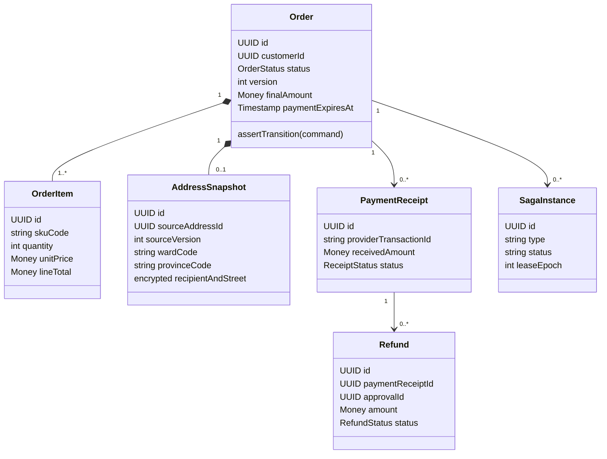

> **Implementation 3.1 — 09/10/2026:** [08_implementation_and_acceptance.md](08_implementation_and_acceptance.md) là nguồn hành vi hiện tại. Acceptance tạo checkout operation, chưa tạo Order; PAID và outbox chờ terminal stock/voucher outcome. Các đoạn v3.0 khác mô tả candidate cần đọc cùng cập nhật này.

# 01 — Domain model và ranh giới Order Service

[Chỉ mục](README.md) · [Tiếp: State machine](02_state_machine_and_lifecycle.md)

## 1. Ranh giới chức năng và quyền sở hữu

MS-04 thuộc BC-04 Commerce & Order Orchestration. EPIC là ranh giới nghiệp vụ, không nhất thiết mỗi Epic là một process. Cart, Checkout, Order và Payment component có use case riêng dù dùng chung database trong lựa chọn v3.0.

| Thành phần | Sở hữu | Không thực hiện |
| --- | --- | --- |
| Cart | Danh sách SKU/quantity, revision, phiên Guest/Customer | Giữ kho khi thêm vào giỏ; coi giá cache là giá thanh toán |
| Checkout | Quote, kiểm tra địa chỉ/giá/phí, chốt snapshot, saga giữ tài nguyên | Tin tổng tiền của browser; tự tuyên bố thanh toán thành công |
| Order | Order status, owner, snapshot, timeline, SLA, quyền thao tác | Ghi trực tiếp DB của service khác |
| Payment component | Intent, provider receipt, allocation, reconciliation, refund execution | Tự phê duyệt refund; coi trang redirect/ảnh QR là bằng chứng tiền đã thu |
| Saga orchestrator | Intent, command key, kết quả bước, retry, compensation | Dùng memory/Redis làm nhật ký duy nhất; gọi mạng khi giữ SQL transaction |
| MS-01 Inventory | Availability, reservation, FEFO, stock commit/release | Cho Order sửa số lượng hoặc tự chọn Batch |
| MS-07 Promotion | Voucher budget/hold/consume/release, loyalty ledger | Cho Order tự cộng điểm hoặc tự làm tròn voucher khác kết quả chuẩn |
| MS-15 Profile / Identity | Profile/address book; subject và xác thực | Sửa hồi tố order snapshot khi khách đổi địa chỉ |
| MS-02 / MS-12 | Packing task/package/video; shipment/checkpoint | Cho generic admin PATCH tự đánh dấu PACKED/DELIVERED |
| MS-06 Care / MS-09 Finance | Case/decision; accounting và settlement | Đồng nhất Case APPROVED, hàng RETURNED và tiền REFUNDED |

D2C HTTP dự kiến dùng port 8004. gRPC dùng listener riêng dự kiến 9004; số này là đề xuất cấu hình, không suy ra service đã mở cổng. Hai listener không bind cùng địa chỉ/port trừ khi có cơ chế multiplex được kiểm chứng.

## 2. Aggregate, entity và value object



Order giữ snapshot và invariant thương mại. PaymentReceipt/Refund là aggregate tài chính liên kết Order, có locking riêng nhưng transaction áp dụng receipt vào Order phải khóa cùng Order. Không load tất cả lịch sử payment vào mỗi lần xem queue. Saga là process manager bền vững, không phải Order status.

| Thuật ngữ | Nghĩa chính xác |
| --- | --- |
| `order_id` | UUID sinh tại ứng dụng trước khi tạo intent hoặc gọi giữ tài nguyên |
| `order_code` | Mã cho khách đọc; unique, không dùng làm proof sở hữu |
| `customer_id` | ID hồ sơ của Profile; `NULL` cho Guest, khác JWT `sub` |
| `shipping_address_id` trên event | ID snapshot trong Order DB; không phải ID địa chỉ đang sống trong Profile |
| `reservation_id`, `voucher_lock_id` | Reference tài nguyên do service chủ quản trả về |
| `payment receipt` | Một khoản tiền thực nhận/đã xác minh; không phải một lần quét QR |
| `allocation` | Phần receipt được phân bổ vào nghĩa vụ thanh toán Order |
| `operational_hold` | Chặn tiến trình nghiệp vụ khi cần đối soát; không xóa sự thật tài chính |

## 3. Snapshot và tiền

OrderItem lưu `sku_code`, tên, quy cách, khối lượng, quantity, đơn giá và thành tiền đã kiểm tra; shipping quote lưu carrier/service, phí gốc, quote reference/expiry. VoucherSnapshot lưu loại, số tiền áp dụng, policy version và hold ID. Chỉ một voucher MVP; stacking/loyalty dùng để trả tiền cần chính sách và contract riêng.

AddressSnapshot lưu recipient/phone/street, tỉnh/phường code/name, optional cặp tọa độ, nguồn và version. Saved address lấy bằng `GetDeliveryAddress(address_id, customer_id)`; address ID rỗng lấy default. Response phải đúng customer. Dữ liệu hai cấp theo Profile contract; `common.Address.district` rỗng. Không dùng dữ liệu default thay đổi về sau để sửa snapshot.

Guest nhập địa chỉ trực tiếp, dùng cùng validation địa giới và recipient. MVP một địa chỉ/đơn. Sau khi đặt không sửa snapshot bằng update chung; thay địa chỉ cần command chuyên biệt, kiểm tra phí và fulfillment chưa bắt đầu, ghi revision/audit. Command này chưa thuộc MVP v3.0.

Money dùng số nguyên VND, `int64/BIGINT`; protobuf `currency_code=VND`, `units=amount`, `nanos=0`. JSON phải giới hạn giá trị trong miền số nguyên an toàn của client; đề xuất `0..1_000_000_000_000` VND cho từng amount. Kiểm tra overflow khi nhân/cộng trước khi ghi SQL.

```text
subtotal = Σ(quantity × canonical_unit_price)
0 ≤ merchandise_discount ≤ subtotal
0 ≤ shipping_discount ≤ shipping_fee
final = subtotal - merchandise_discount + shipping_fee - shipping_discount
0 ≤ allocated_paid ≤ final
refundable(receipt) = received - Σ(refund SUCCEEDED) - Σ(refund đang giữ nghĩa vụ)
```

Free shipping trừ vào shipping component, không ép vào merchandise discount. Vì vậy luật cũ `final >= shipping_fee` được bỏ. Ví dụ hàng 220.000, giảm hàng 20.000, ship 25.000, miễn ship 25.000 → final 200.000. Với `FREE_SHIPPING`, proto Promotion chưa nhận phí ship/cap để tính đúng: phải bổ sung contract, không tự đoán từ `discount_amount`.

Đơn final=0 dùng quy trình zero-payment riêng, không tạo receipt ngân hàng giả. Chưa hỗ trợ MVP; trả `422 ZERO_AMOUNT_ORDER_UNSUPPORTED`. Giá sản phẩm được coi đã bao gồm thuế trong MVP; không tự thêm VAT. B2B cần snapshot tax/credit terms riêng.

## 4. Bất biến có thể kiểm chứng

1. Ít nhất một line; quantity > 0; gộp SKU trùng trước quote; thiếu bất kỳ SKU thì thất bại toàn bộ checkout, không tự tách đơn.
2. Chỉ tạo `PENDING_PAYMENT` sau Inventory reserve và voucher hold hợp lệ; expiry theo hạn tài nguyên thực tế.
3. Tài nguyên có key ổn định và intent bền vững trước RPC; mất phản hồi là kết quả UNKNOWN, không phải FAILED.
4. Receipt đã xác minh tồn tại độc lập với Order status; tiền vào đơn đã hủy vẫn phải lưu và đối soát.
5. Trả trước chỉ cho fulfillment khi tiền đã allocated đủ final và stock đã COMMITTED; COD được phép chưa trả tiền nhưng phải có COD eligibility và stock commit.
6. Một provider receipt chỉ ghi nhận một lần. Refund phải có approval hợp lệ, không vượt refundable; retry không tạo nghĩa vụ mới.
7. Owner chỉ đổi từ Guest sang Customer bằng verified claim; không ghi đè owner khác và không đổi snapshot.
8. Mọi mutation quan trọng có history/audit intent và outbox cùng commit. Consumer business effect + inbox commit cùng nhau.
9. Order cancelled không tự trở lại PAID/PROCESSING; refund lỗi không tự đưa order quay lại sản xuất.
10. Admin thao tác qua command có guard và quyền; không chỉnh trạng thái tùy ý.

## 5. Mô hình kho nhìn từ Order

Order lưu reference và projection `NONE/RESERVED/COMMITTING/COMMITTED/RELEASING/RELEASED/EXPIRED/UNKNOWN`; không sở hữu stock ledger. Inventory contract hiện nói `available = physical - reserved`. Không đưa thêm `committed` vào công thức này nếu chưa đổi định nghĩa `physical`.

Thiết kế finalize yêu cầu Inventory chuyển reservation atomically từ ACTIVE → COMMITTED hoặc RELEASED/EXPIRED. Commit tiêu thụ reservation đúng một lần; quantity available không bị trừ lần hai. Ví dụ physical=100/reserved=0/available=100; reserve 2 → 100/2/98; nếu commit được định nghĩa là trừ physical → 98/0/98. Nếu Inventory chọn giữ committed trên kệ đến dispatch thì phải dùng ledger khác và công bố công thức mới. Order chỉ dựa vào kết quả terminal của reservation.

## 6. Quyền riêng tư và scope

Không đưa recipient, phone, street, tọa độ, gift_message hoặc ghi chú tự do vào event fan-out. Identifier vẫn cần ACL/retention; không coi UUID là dữ liệu công khai. Shipping/Packing đọc snapshot qua API nội bộ có service identity và purpose hợp lệ. Customer xem đủ dữ liệu của mình; queue chỉ hiển thị dữ liệu tối thiểu, CSKH có masking theo quyền.

PII snapshot mã hóa tại tầng lưu trữ với key ID/version, TLS khi truyền; không log raw webhook, token/proof hay thông tin nhận hàng. Retention và xóa/ẩn danh cần policy được chủ dữ liệu phê duyệt, không tự đặt thời gian pháp lý. Ledger/audit chỉ dùng reference khi đủ; không cascade delete order vì xóa profile.
