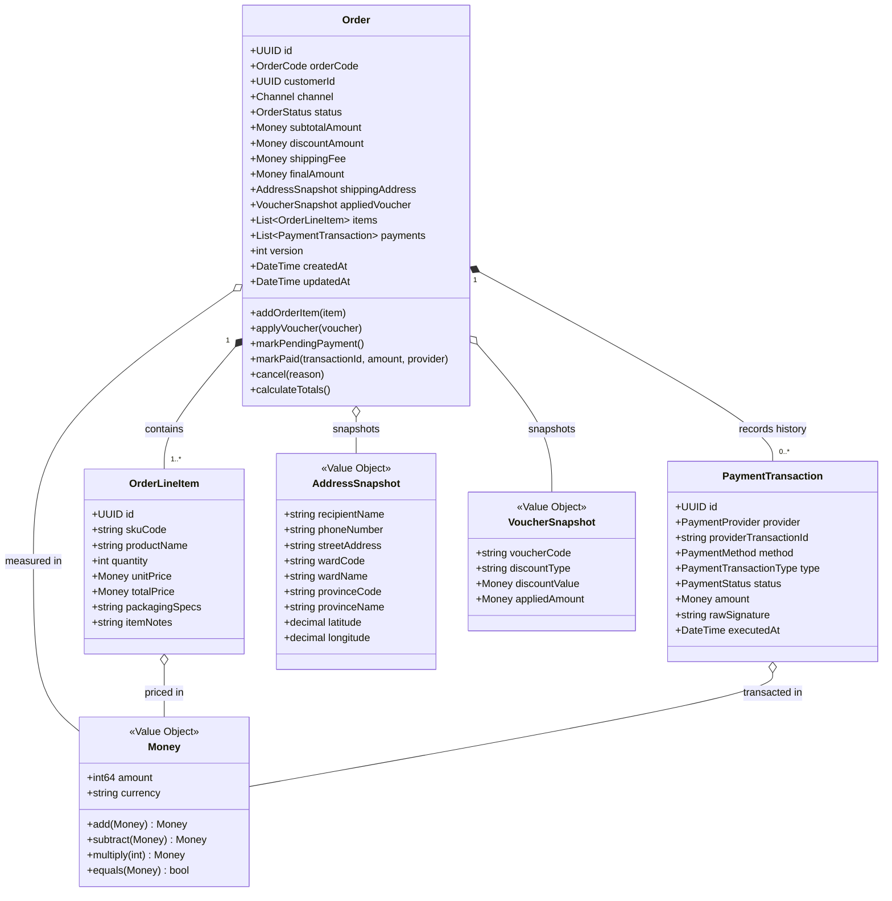

# TÀI LIỆU THIẾT KẾ CHI TIẾT (LLD): MS-04 ORDER SERVICE
## PHÂN HỆ 1: RANH GIỚI NGHIỆP VỤ & MÔ HÌNH MIỀN (DOMAIN MODEL & BOUNDED CONTEXT)

---

> **ĐIỀU HƯỚNG TÀI LIỆU:**
> - 📍 **Vị trí:** Phân hệ 1 / 6 của bộ thiết kế LLD `MS-04 order-service`.
> - ⬅️ [README.md — Bản đồ điều hướng & Kiến trúc tổng thể](README.md)
> - ➡️ [02_state_machine_and_lifecycle.md — Máy trạng thái & Vòng đời đơn hàng](02_state_machine_and_lifecycle.md)

---

## 1. BƯỚC 1: XÁC LẬP BIÊN GIỚI & RANH GIỚI SỞ HỮU DỮ LIỆU (BOUNDED CONTEXT & SCOPE ISOLATION)

Trước khi bắt tay vào thiết kế bất kỳ thực thể hay bảng cơ sở dữ liệu nào, nguyên tắc tối thượng của kiến trúc phân tán là **phải thiết lập ranh giới cô lập (Boundary Isolation)**: xác định rõ trách nhiệm cốt lõi, quyền sở hữu dữ liệu độc quyền, và đặc biệt là **những gì dịch vụ TUYỆT ĐỐI CẤM LÀM**.

```text
                                       KONG API GATEWAY
                                              │
                      ┌───────────────────────┴───────────────────────┐
                      │ HTTP REST (North-South)                       │ GraphQL (BFF)
                      ▼                                               ▼
         ┌─────────────────────────────────────────────────────────────────────────┐
         │                    MS-04: ORDER SERVICE (CORE DOMAIN)                   │
         │  ┌───────────────────────────────┐     ┌─────────────────────────────┐  │
         │  │     ORDER DOMAIN ENGINE       │     │      SAGA ORCHESTRATOR      │  │
         │  │  • Quản lý Aggregate Order    │     │  • Điều phối Checkout Saga  │  │
         │  │  • Snapshots bất biến         │     │  • Quản lý saga_instances   │  │
         │  │  • Tính toán số học Money     │     │  • Kích hoạt đền bù tập trung│  │
         │  │  • FSM Order Transitions      │     │    (Centralized Model A)    │  │
         │  └───────────────────────────────┘     └─────────────────────────────┘  │
         └────────┬─────────────────────┬───────────────────────┬──────────────────┘
                  │ gRPC (Critical)     │ gRPC (Critical)       │ Kafka Events (Async)
                  ▼                     ▼                       ▼
         MS-01: INVENTORY       MS-05: CATALOG          APACHE KAFKA BROKER CLUSTER
         (Port: 8001)           (Port: 8005)            (order.events.v1)
```

### 1.1. Bounded Context & Định Vị Hệ Thống
- **Mã định danh:** `MS-04` | **Tên dịch vụ:** `order-service`
- **Bounded Context:** `BC-04: Omnichannel Commerce & Order Orchestration Context`
- **Phân loại Domain:** 🔴 **Core Domain** — Trái tim vận hành của toàn bộ hệ sinh thái Mè Xửng O Mạ.
- **Cổng giao tiếp mạng:**
  - **Port gRPC nội bộ (East-West Server):** `8004` (Tiếp nhận `CreatePOSOrder` từ POS quầy xưởng MS-13, `GetOrderDetail`, `CancelOrder`).
  - **Port HTTP REST (North-South via Kong Gateway):** `8004` (Ánh xạ các endpoint `/api/v1/checkout`, `/api/v1/orders/**`, `/api/v1/cart/**`, `/api/v1/payments/vietqr/callback`).
- **Cơ sở dữ liệu độc lập (Shared-Nothing Architecture):**
  - **Primary Relational DB:** PostgreSQL 16 (`order_db`) — Lưu trữ đơn hàng, mặt hàng, giao dịch thanh toán, outbox events, saga states.
  - **Distributed Cache & Session Store:** Redis Cluster 7 (`order_cache`) — Quản lý giỏ hàng, checkout token, idempotency keys, distributed lock.

---

### 1.2. Ranh Giới Bất Biến & Quyền Sở Hữu Dữ Liệu (Data Ownership Boundaries)
Tuân thủ cam kết tại [`service_boundary.md`](../../service_boundary.md) và [`bounded_context.md`](../../bounded_context.md), `order-service` thiết lập 5 nguyên tắc sở hữu thép:

| Dữ Liệu / Trách Nhiệm | Thuộc Về MS-04 `order-service`? | Đơn Vị Sở Hữu Chính Thức | Lý Do Kiến Trúc & Ranh Giới Bất Khả Xâm Phạm |
| :--- | :---: | :--- | :--- |
| **Vòng đời trạng thái đơn hàng (`OrderStatus`)** | ✅ **SỞ HỮU DUY NHẤT** | MS-04 `order-service` | Là Single Source of Truth cho trạng thái đơn. Không service nào khác được ghi/sửa trực tiếp trạng thái đơn. |
| **Bản chụp thương mại (Snapshots)** | ✅ **SỞ HỮU DUY NHẤT** | MS-04 `order-service` | Chụp lại giá, tên kẹo, chiết khấu và địa chỉ giao hàng tại thời điểm bấm đặt hàng để bảo toàn giá trị pháp lý. |
| **Điều phối giao dịch phân tán (Saga Orchestration)** | ✅ **SỞ HỮU DUY NHẤT** | MS-04 `order-service` | Thực thi nguyên tắc **Centralized Compensation (Model A)**: Độc quyền phát hiện lỗi/timeout và trực tiếp gọi lệnh hoàn tác kho/voucher. |
| **Số lượng hàng tồn kho vật lý & Lô hạn dùng (FEFO)** | ❌ **CẤM SỞ HỮU** | MS-01 `inventory-service` | MS-04 chỉ gửi yêu cầu `ReserveStock` và `ReleaseReservation` qua gRPC; tuyệt đối cấm truy cập trực tiếp bảng tồn kho. |
| **Giá niêm yết gốc & Quy cách sản phẩm** | ❌ **CẤM SỞ HỮU** | MS-05 `catalog-service` | MS-04 chỉ thẩm định giá gửi lên qua gRPC `ValidatePriceAndSKU` đối chiếu với Catalog gốc. |
| **Ngân sách voucher & Điểm tích lũy Loyalty** | ❌ **CẤM SỞ HỮU** | MS-07 `promotion-service` | MS-04 gọi gRPC khóa voucher và gửi sự kiện `OrderPaidEvent` để Promotion tự tích điểm 1% loyalty. |
| **Đóng gói tại xưởng & Video kiểm định** | ❌ **CẤM SỞ HỮU** | MS-02 `fulfillment-service` | Xưởng Huế tự tiêu thụ `OrderPaidEvent` từ Kafka để đóng kẹo; không làm nghẽn luồng checkout của khách. |
| **Vận đơn 3PL & Lộ trình giao hàng** | ❌ **CẤM SỞ HỮU** | MS-12 `shipping-service` | MS-12 làm việc trực tiếp với GHN/ViettelPost và phát Kafka event báo bưu tá đã giao hàng. |

---

### 1.3. Chính Sách Bảo Mật PII & Trade-off Tính Sẵn Sàng (PII Policy & Availability Trade-off)

#### 1.3.1. Phân Định Danh Mục Dữ Liệu Rõ Ràng (PII Classification)
Nhằm tránh mâu thuẫn khái niệm, tài liệu chuẩn hóa 3 cấp độ định danh:
- **Direct PII (Thông tin định danh trực tiếp cá nhân):** Họ và tên khách hàng, số điện thoại, số nhà/tên đường cụ thể, tọa độ GPS chính xác. $\rightarrow$ **TUYỆT ĐỐI KHÔNG ĐƯỢC XUẤT HIỆN TRÊN KAFKA EVENT STREAM.**
- **Internal / Business Identifiers (Mã định danh nội bộ hệ thống):** `order_id`, `customer_id` (UUID v7 ẩn danh), `shipping_address_id` (Khóa ngoại tham chiếu snapshot). $\rightarrow$ **ĐƯỢC PHÉP NẰM TRONG KAFKA PAYLOAD** để các consumer định tuyến xử lý nghiệp vụ.
- **Aggregated / Business Metrics:** Doanh thu, số lượng hộp kẹo, kênh bán, mã voucher. $\rightarrow$ **CÔNG KHAI NỘI BỘ TRÊN EVENT STREAM.**

#### 1.3.2. Quyết Định Kiến Trúc: Option A (Privacy-First) & Đánh Đổi Tính Sẵn Sàng (Availability Trade-off)
Hệ sinh thái Mè Xửng O Mạ lựa chọn **Option A — Privacy-First**:
- Payload của sự kiện `OrderPaidEvent` chỉ chứa `shipping_address_id`.
- Khi `fulfillment-service` cần in tem dán gói kẹo hoặc `shipping-service` cần tạo vận đơn bưu cục, chúng sẽ gọi gRPC `GetOrderDetail` sang `order-service` để lấy địa chỉ nhận hàng.
- **Phân tích Đánh đổi (Trade-off):**
  - *Ưu điểm:* Loại bỏ 100% rủi ro rò rỉ dữ liệu cá nhân (Data Leakage) sang các consumer không cần thiết như `inventory-service`, `finance-service`, `analytics-service`.
  - *Rủi ro (Runtime Coupling):* Nếu `order-service` gặp sự cố mạng tạm thời, `fulfillment-service` không lấy được địa chỉ để in tem.
  - *Biện pháp Giảm thiểu Kỹ thuật (Mitigation):* 
    1. `order-service` thiết lập bộ đệm L2 Cache trên Redis cho `AddressSnapshot` với TTL 48 giờ.
    2. Consumer `fulfillment-service` cài đặt cơ chế Retry with Exponential Backoff + Jitter cho cuộc gọi gRPC lấy địa chỉ, đảm bảo khi `order-service` hồi phục thì việc in tem tiếp tục trơn tru mà không làm rơi rớt dữ liệu.

---

### 1.4. Lựa Chọn Công Nghệ & Ràng Buộc Kỹ Thuật (Tech Stack Selection)
- **Ngôn ngữ nền tảng:** **Go (Golang 1.22+)** hoặc **Node.js (TypeScript 5+)** tuân thủ Clean Architecture.
- **PostgreSQL Driver:** `pgx/v5` (Go) hoặc `pg` pool (Node.js) hỗ trợ kết nối Binary Protocol hiệu năng cao.
- **Serialization:** Google Protocol Buffers v3 cho giao tiếp nội bộ gRPC; JSON Schema chuẩn CNCF CloudEvents 1.0 cho Apache Kafka.
- **Bộ đệm & Khóa phân tán:** `go-redis/v9` (hoặc `ioredis`) tương thích Redis Cluster.

---

## 2. BƯỚC 2: MÔ HÌNH HÓA MIỀN NGHIỆP VỤ CỐT LÕI (DOMAIN MODEL, ENTITIES & VALUE OBJECTS)

*Theo chuẩn mực Domain-Driven Design, trước khi thiết kế bảng cơ sở dữ liệu (Database Schema), ta bắt buộc phải mô hình hóa miền nghiệp vụ độc lập hoàn toàn với công nghệ hạ tầng (Infrastructure-Agnostic).*



### 2.1. Thuật Ngữ Nghiệp Vụ Chuẩn Hóa (Ubiquitous Language)
- **Order (Đơn hàng):** Aggregate Root trung tâm, biểu thị giao dịch thương mại hoàn chỉnh.
- **OrderLineItem (Mặt hàng chi tiết):** Bản chụp cố định của sản phẩm kẹo mè xửng (mã SKU, tên kẹo, đơn giá, quy cách) tại thời điểm khách bấm đặt hàng.
- **PaymentTransaction (Giao dịch dòng tiền):** Thực thể ghi nhận lịch sử từng lần tương tác thanh toán (lần quét VietQR thử nghiệm, thanh toán thành công, hoặc giao dịch hoàn tiền refund).
- **Snapshot (Bản chụp bất biến):** Dữ liệu sao chép nguyên trạng tại thời điểm xác nhận checkout, không bị ảnh hưởng nếu dữ liệu gốc ở Catalog hoặc Profile bị thay đổi.
- **Centralized Compensation (Model A):** Cơ chế điều phối đền bù tập trung: Duy nhất Saga Orchestrator trong `order-service` phát lệnh hoàn tác tài nguyên sang các service vệ tinh.

---

### 2.2. Aggregate Root: `Order`
Thực thể gốc kiểm soát toàn bộ tính toàn vẹn của đơn hàng:
- **Định danh duy nhất:** `id` (UUID v7 time-ordered) và `order_code` (Mã định dạng thân thiện `ORD-YYYYMMDD-XXXX`).
- **Chủ sở hữu:** `customer_id` (UUID tham chiếu sang MS-15 Profile Service; `NULL` đối với khách vãng lai `GUEST_CUSTOMER`).
- **Kênh bán lẻ (`Channel`):** `D2C_WEB`, `D2C_MOBILE`, `POS_OFFLINE`, `MARKETPLACE_SHOPEE`, `MARKETPLACE_TIKTOK`, `B2B_CORPORATE`.
- **Trạng thái thực thể:** `OrderStatus` (Quản lý chặt chẽ theo máy trạng thái FSM).
- **Khóa lạc quan CAS (Optimistic Concurrency Control):** Thuộc tính `version` nguyên số tăng dần, giải quyết triệt để tranh chấp cập nhật đồng thời.

---

### 2.3. Entities Thuộc Aggregate
1. **`OrderLineItem`:**
   - Thuộc sở hữu hoàn toàn của `Order`.
   - `sku_code`, `product_name`, `quantity` ($> 0$), `unit_price` (Money), `total_price` ($= \text{unit\_price} \times \text{quantity}$).
   - `packaging_specs`: Quy cách đóng gói (Ví dụ: "Hộp 500g hút chân không chống ẩm", "Túi 300g truyền thống").
2. **`PaymentTransaction` (Thống nhất mô hình 1 Order $\rightarrow$ $N$ Payments):**
   - Thay vì chỉ có 1 `PaymentRecord` duy nhất, hệ thống mô hình hóa quan hệ $1:N$ để phản ánh chính xác thực tế:
     - Khách hàng quét QR lần 1 thất bại $\rightarrow$ Ghi nhận 1 `PaymentTransaction` trạng thái `FAILED`.
     - Khách quét QR lần 2 thành công $\rightarrow$ Ghi nhận 1 `PaymentTransaction` trạng thái `PAID`.
     - Sau này khách khiếu nại vỡ kẹo $\rightarrow$ Ghi nhận thêm 1 `PaymentTransaction` loại `REFUND` trạng thái `PAID`.
   - Thuộc tính: `provider` (`VIETQR_NAPAS`, `COD_INTERNAL`, `B2B_BANK_DIRECT`, `POS_TERMINAL`), `provider_transaction_id` (Mã giao dịch phía ngân hàng), `type` (`PAYMENT`, `REFUND`), `amount` (Money), `status` (`PENDING`, `PAID`, `FAILED`), `raw_signature`, `executed_at`.

---

### 2.4. Value Objects Bất Biến (Immutable Value Objects)
1. **`Money` (Chuẩn hóa cho tiền tệ VND):**
   - Vì Việt Nam Đồng (VND) không có đơn vị phân số thập phân (không dùng hào, xu), cấu trúc `Money` trong Domain được tinh gọn tối đa:
     ```go
     type Money struct {
         Amount   int64  // Số tiền nguyên bản (VND)
         Currency string // Bắt buộc "VND"
     }
     ```
   - *Tính tương thích Protobuf:* Khi giao tiếp gRPC qua message `omamx.common.v1.Money`, `Amount` được gán vào trường `units`, còn trường `nanos` được gán cứng `= 0`.
   - *Tính tương thích JSON REST API:* Giá trị tiền được biểu diễn dưới dạng số nguyên an toàn (JSON integer). Với mức doanh thu đơn hàng thông thường ($< 9 \times 10^{15}$ VND), hoàn toàn nằm trong giới hạn an toàn của IEEE 754 float64 / JavaScript `Number.MAX_SAFE_INTEGER`.
2. **`AddressSnapshot`:**
   - Lưu trữ: `recipient_name`, `phone_number`, `street_address`, `ward_code`, `ward_name`, `province_code`, `province_name`, `latitude`, `longitude`.
   - Tuân thủ chuẩn hành chính 2 cấp (Tỉnh/Thành phố TW - Xã/Phường) có hiệu lực tại Việt Nam từ 01/07/2025.
3. **`VoucherSnapshot`:**
   - `voucher_code`, `discount_type` (`PERCENTAGE`, `FIXED_AMOUNT`), `discount_value` (Money), `applied_amount` (Money).

---

### 2.5. Mô Hình 3 Trạng Thái Tồn Kho Phân Tán (The 3-State Inventory Model)

> [!IMPORTANT]
> **Làm Rõ Ngữ Nghĩa Tồn Kho Giữa Order Service & Inventory Service:**
> Để ngăn ngừa hoàn toàn nguy cơ **Double Deduction (Trừ kho hai lần)**, hệ thống định nghĩa rạch ròi 3 biến số tồn kho bên trong `inventory-service`:
> 1. **`available_quantity` (Tồn khả dụng):** Số lượng kẹo sẵn sàng mở bán.
> 2. **`reserved_quantity` (Tồn tạm khóa):** Số lượng kẹo đang được giữ riêng cho các đơn hàng `PENDING_PAYMENT` (TTL 15 phút).
> 3. **`committed_quantity` (Tồn xuất kho chính thức):** Số lượng kẹo đã được thanh toán tiền, chờ xưởng đóng gói bàn giao bưu cục.
> 
> *Công thức bảo toàn:*
> $$\text{physical\_quantity} = \text{available\_quantity} + \text{reserved\_quantity}$$

```text
Trạng Thái Ban Đầu (Initial):
   available: 100 | reserved: 0 | committed: 0

Bước 1: Khách đặt 2 hộp mè xửng (Order Service gọi ReserveStock):
   available: 98  | reserved: 2 | committed: 0  (Tồn khả dụng đã giảm ngay để chống bán lố!)

Bước 2A: Thanh toán thành công (Sự kiện OrderPaidEvent bắn sang Kho):
   available: 98  | reserved: 0 | committed: 2  (Chuyển từ reserved sang committed, CẤM trừ available lần 2!)

Bước 2B: Hết hạn 15m hoặc khách hủy đơn (Order Service gọi ReleaseReservation):
   available: 100 | reserved: 0 | committed: 0  (Hoàn trả tồn khả dụng về nguyên trạng)
```

---

### 2.6. Các Bất Biến Nghiệp Vụ Miền (Domain Invariants)
Bất kỳ thay đổi nào trên Aggregate `Order` đều phải vượt qua 5 điều kiện kiểm tra bất biến:
$$\mathbf{Invariant\ 1:}\quad \text{discount\_amount} \le \text{subtotal\_amount} \quad (\text{Chiết khấu cấm vượt quá tổng tiền hàng})$$
$$\mathbf{Invariant\ 2:}\quad \text{final\_amount} = \text{subtotal\_amount} - \text{discount\_amount} + \text{shipping\_fee}$$
$$\mathbf{Invariant\ 3:}\quad \text{final\_amount} \ge \text{shipping\_fee} \ge 0$$
$$\mathbf{Invariant\ 4:}\quad \text{len(order\_line\_items)} \ge 1 \quad \text{và} \quad \forall\ \text{item} \in \text{order\_line\_items},\ \text{quantity} > 0$$
$$\mathbf{Invariant\ 5:}\quad \text{Chỉ cho phép chuyển } \texttt{PENDING\_PAYMENT} \rightarrow \texttt{PAID} \text{ khi số tiền giao dịch khớp tuyệt đối: } \text{amount\_paid} = \text{final\_amount}.$$

---
👉 [Chuyển sang Phân hệ 2: Máy Trạng Thái & Vòng Đời Đơn Hàng](02_state_machine_and_lifecycle.md)
