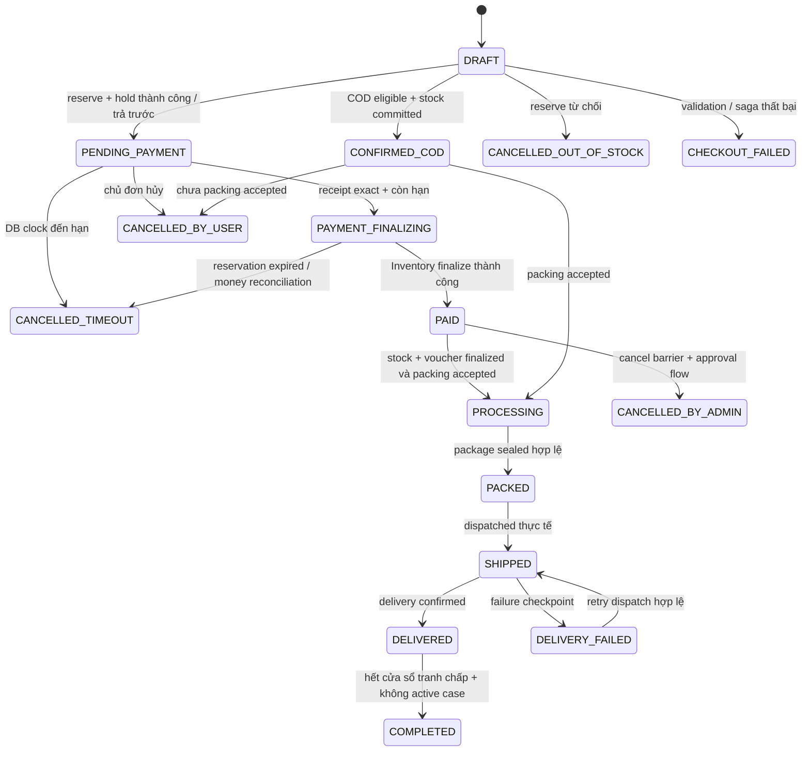

> **Implementation 3.1 — 09/10/2026:** [08_implementation_and_acceptance.md](08_implementation_and_acceptance.md) là nguồn hành vi hiện tại. Acceptance tạo checkout operation, chưa tạo Order; PAID và outbox chờ terminal stock/voucher outcome. Các đoạn v3.0 khác mô tả candidate cần đọc cùng cập nhật này.

# 02 — State machine, lifecycle và cạnh tranh

[Chỉ mục](README.md) · [Trước: Domain](01_order_domain_and_boundary.md) · [Tiếp: Persistence](03_database_and_persistence.md)

## 1. Bốn trục trạng thái

| Trục | Giá trị thiết kế | Nguồn chuẩn |
| --- | --- | --- |
| Order | DRAFT, PENDING_PAYMENT, PAYMENT_FINALIZING, PAID, CONFIRMED_COD, PROCESSING, PACKED, SHIPPED, DELIVERED, DELIVERY_FAILED, COMPLETED, CANCELLED_TIMEOUT, CANCELLED_BY_USER, CANCELLED_BY_ADMIN, CANCELLED_OUT_OF_STOCK, CHECKOUT_FAILED | Order aggregate |
| Payment summary | UNPAID, PENDING, CONFIRMED, RECONCILIATION_REQUIRED, PARTIALLY_REFUNDED, REFUNDED | Receipt/allocation/refund ledger |
| Stock projection | NONE, RESERVED, COMMITTING, COMMITTED, RELEASING, RELEASED, EXPIRED, UNKNOWN | Inventory acknowledgement |
| Return / Refund | Case trạng thái theo Care; refund REQUESTED, APPROVED, SUBMITTED, SUCCEEDED, FAILED, UNKNOWN | Care decision; Payment execution |

`PAYMENT_FINALIZING`, `CONFIRMED_COD`, `DELIVERY_FAILED`, `CANCELLED_BY_ADMIN`, `CHECKOUT_FAILED` chưa nằm trong order.proto: **candidate additions**, không trả chúng qua enum v1 trước khi cập nhật hợp đồng. `RETURN_REQUESTED/REFUNDED` có trong proto cũ nhưng v3.0 dùng projection tương thích nếu cần, không dùng để thay thế Case và financial status. `REFUND_PENDING` trong LLD cũ chưa có trong proto, không tiếp tục trình bày là trạng thái wire hiện có.

## 2. Luồng trả trước và COD



Order timeline và payment summary hiển thị riêng. Với COD: `PROCESSING` + `UNPAID` hợp lệ, `DELIVERED` không tự bằng `CONFIRMED`. Tiền COD chỉ xác nhận từ bằng chứng thu/đối soát được Payment chấp nhận. Một COD receipt đến lúc order SHIPPED/DELIVERED cập nhật payment summary, không kéo Order về PAID.

## 3. Transition matrix

| From → To | Command/source | Guard bắt buộc | Ghi cùng transaction |
| --- | --- | --- | --- |
| DRAFT → PENDING_PAYMENT | Checkout saga | tất cả SKU/address/quote valid; reserve và hold còn hạn | snapshot, expiry, references, history, OrderPlaced outbox, idempotency result |
| DRAFT → CONFIRMED_COD | Checkout COD | eligibility đúng policy; inventory COMMITTED; voucher finalized | phương thức COD, UNPAID summary, history, fulfillment-ready outbox |
| DRAFT → CHECKOUT_FAILED / CANCELLED_OUT_OF_STOCK | saga reject | lý do xác định, hoặc compensation đang được theo dõi | failure reason, release intent cho mọi bước có khả năng thành công |
| PENDING_PAYMENT → PAYMENT_FINALIZING | verified receipt | exact VND, đúng receiver/reference, DB now < expiry; chưa cancel | receipt + allocation, payment summary CONFIRMED, finalize saga intent |
| PAYMENT_FINALIZING → PAID | Inventory ack | reservation COMMITTED đúng order/items, tiền đủ | stock projection, history, OrderPaid outbox; fulfillment-ready khi voucher finalized |
| PENDING_PAYMENT → CANCELLED_TIMEOUT | sweeper | DB now ≥ expiry, payment chưa confirmed | history, cancel outbox, release saga intent |
| PENDING_PAYMENT → CANCELLED_BY_USER | owner command | ownership, expected version, chưa receipt allocated | history, cancel outbox, release saga intent |
| CONFIRMED_COD → CANCELLED_BY_USER | owner command | chưa packing accepted; cancel barrier xác nhận | cancel history, decommit intent, không refund nếu chưa nhận tiền |
| PAID → CANCELLED_BY_ADMIN | manager command | packing cancel barrier thành công; nghĩa vụ refund được mở | cancelled history, reversal/refund request references; không gán REFUNDED |
| PAID / CONFIRMED_COD → PROCESSING | Fulfillment accepted | đúng task/order; stock committed; ready authorization còn hiệu lực | task reference, state/history, SLA deadline, outbox |
| PROCESSING → PACKED | Fulfillment sealed | đúng task, seal/video reference và actor đã được nguồn xác thực | package projection, history, outbox |
| PACKED → SHIPPED | Shipping dispatched | đúng shipment/order; đã thực tế bàn giao | shipment reference, checkpoint version, history |
| SHIPPED → DELIVERED / DELIVERY_FAILED | Shipping result | đúng shipment, sequence mới; event hợp lệ | delivery projection, history; tranh chấp deadline nếu delivered |
| DELIVERY_FAILED → SHIPPED | retry shipping | source xác nhận attempt mới; order không cancelled | attempt/checkpoint/history |
| DELIVERED → COMPLETED | completion job | now ≥ deadline; không active case; COD đã đối soát hoặc policy công nợ cho phép | history, OrderCompleted outbox một lần |

Generic `PATCH status` không thuộc contract. Nhân viên có thể đặt hold, ghi reason hoặc khởi tạo cancellation review; không tự giả lập provider receipt, packing hay delivery.

## 4. Payment vs timeout: local và remote đều phải an toàn

CAS trên Order giải quyết local race nhưng không giải quyết Inventory TTL worker. Hai lớp bắt buộc:

1. Receipt handler và sweeper khóa cùng hàng Order. Chỉ khi state=PENDING_PAYMENT và `clock_timestamp() < payment_expires_at` mới tạo allocation/đổi PAYMENT_FINALIZING. Sweeper chỉ hủy PENDING_PAYMENT với `clock_timestamp() >= payment_expires_at`. Xác định thời điểm quyết định **sau khi lấy row lock**, không dùng timestamp cố định từ đầu transaction lâu trước đó.
2. Inventory xử lý FinalizeReservation và TTL expiration bằng cùng atomic guard ACTIVE/còn hạn. Chỉ một terminal outcome thắng. `PAID`/ready chỉ sau COMMITTED acknowledgement, không khi mới publish Kafka.

```text
BEGIN
  SELECT order FOR UPDATE
  decision_at = DB clock sau lock
  INSERT verified receipt ON CONFLICT(provider, transaction_id) DO NOTHING
  nếu exact + state/expiry cho phép:
    INSERT allocation; UPDATE order -> PAYMENT_FINALIZING, version+1
    INSERT FINALIZE saga intent; INSERT history/outbox cần thiết
  nếu late/mismatch/cancelled:
    lưu RECONCILIATION_REQUIRED, không allocate, tạo case intent
COMMIT
RPC finalize chạy sau commit; retry cùng key khi mất phản hồi
```

| Trường hợp | Kết quả |
| --- | --- |
| Payment vào local finalizing trước expiry; kho còn active | Finalize kho thắng → PAID; timeout không release |
| Local timeout thắng | Order cancelled; tiền đến vẫn lưu receipt/reconciliation; không phục hồi đơn |
| Order finalizing nhưng kho đã expire trước finalize | Không ready; Order CANCELLED_TIMEOUT, receipt cần đối soát/refund approval |
| Finalize kho thành công, ack bị mất | Query/retry cùng key; không release dựa vào lỗi timeout |
| Callback provider timestamp trước expiry nhưng nhận sau expiry | MVP dùng DB decision time; lưu provider time làm bằng chứng; không hồi sinh đơn |
| Client hủy gặp PAYMENT_FINALIZING | 409 PAYMENT_FINALIZING; manager xử lý sau terminal inventory outcome |

Chính sách nhận trễ là lựa chọn thận trọng để không bán lại stock đã được giải phóng. Nếu muốn grace period cần hold protocol được Inventory chấp nhận, không chỉ sửa một điều kiện SQL.

## 5. Saga state, lease và compensation

Saga `STARTED → IN_PROGRESS → COMPLETED`; lỗi xác định chuyển `COMPENSATING → COMPENSATED`. RPC không rõ kết quả chuyển `WAITING_RETRY`, giữ intent và key; hết ngân sách tự động chuyển `MANUAL_REVIEW`, vẫn là nghĩa vụ chưa hoàn tất.

Worker nhận lease có `lease_epoch` tăng. Bước có `PENDING/SENT/UNKNOWN/SUCCEEDED/REJECTED/COMPENSATED`, command key và response reference. Worker cũ chỉ cập nhật khi epoch còn khớp; hết lease không có quyền rollback kết quả worker mới. Remote key vẫn bắt buộc vì epoch local không chặn remote RPC cũ.

Compensation ngược thứ tự acquisition, theo tài nguyên **có thể đã được giữ**. Release lặp không cộng tồn/voucher lần hai. Reservation COMMITTED cần reversal/decommit được phê duyệt, không gọi ReleaseReservation vốn dành ACTIVE. TTL là lưới an toàn trong service chủ quản, Order điều phối nghiệp vụ và reconciliation; không có hai worker cùng tự suy đoán ledger.

## 6. Return, refund và completion

Care giữ active case theo order/line/quantity. Completion job và consumer mở Case phải phối hợp bằng Order row lock cùng cờ `has_active_case`. Vì Care và Order khác DB, completion chỉ chứng minh cờ projection đã biết: cần barrier/query Care xác nhận case eligibility/version và grace watermark trước completion. Nếu thiếu contract này, tắt auto-completion; không giả định Kafka không lag.

Một case sau COMPLETED không tự bị cấm: policy return có thể cho phép; mở hold và adjustment nghiệp vụ theo quyết định Care. Loyalty thuộc Promotion, không cộng cứng 1% trong Order. Partial refund giữ Order lifecycle và payment PARTIALLY_REFUNDED; full refund không đồng nghĩa hàng đã về kho hay order bị hủy. Refund failed/unknown giữ nghĩa vụ và retry/query, không quay PROCESSING. Cửa sổ 7 ngày là default đề xuất, chưa phải SLA pháp lý.
