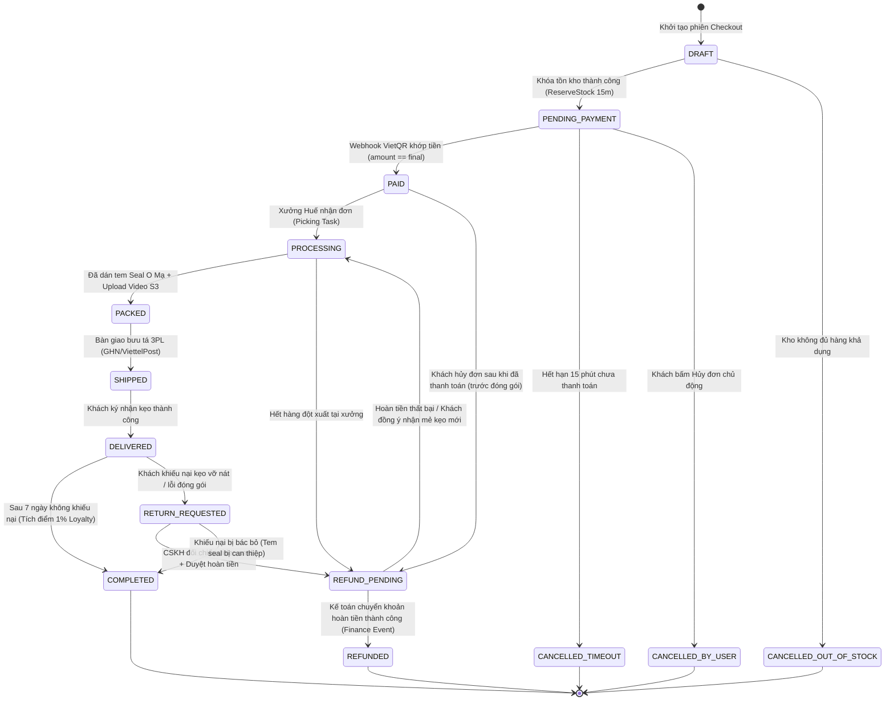
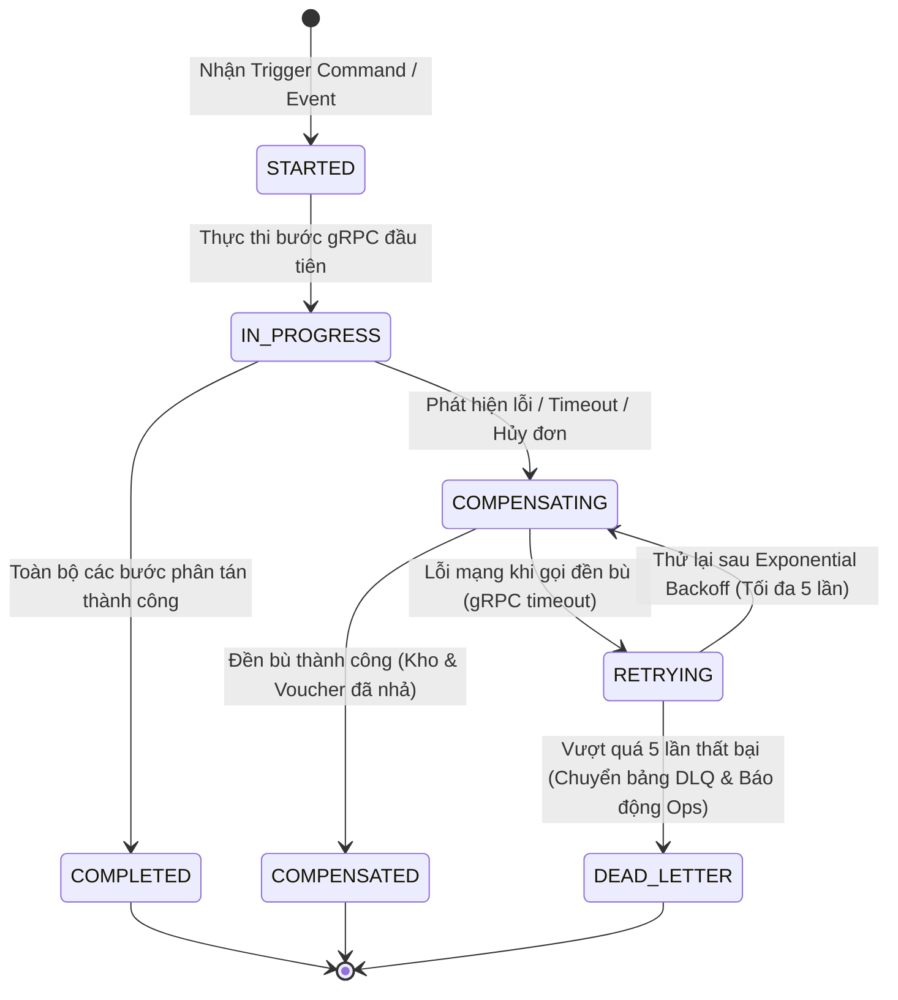

# TÀI LIỆU THIẾT KẾ CHI TIẾT (LLD): MS-04 ORDER SERVICE
## PHÂN HỆ 2: MÁY TRẠNG THÁI & VÒNG ĐỜI THỰC THỂ (STATE MACHINE & LIFECYCLE)

---

> **ĐIỀU HƯỚNG TÀI LIỆU:**
> - 📍 **Vị trí:** Phân hệ 2 / 6 của bộ thiết kế LLD `MS-04 order-service`.
> - ⬅️ [01_order_domain_and_boundary.md — Ranh giới nghiệp vụ & Mô hình miền](01_order_domain_and_boundary.md)
> - 🔼 [README.md — Bản đồ điều hướng & Kiến trúc tổng thể](README.md)
> - ➡️ [03_database_and_persistence.md — Mô hình dữ liệu & Tầng lưu trữ](03_database_and_persistence.md)

---

## 3. BƯỚC 3: MÁY TRẠNG THÁI & VÒNG ĐỜI THỰC THỂ (STATE MACHINE & LIFECYCLE TRANSITIONS)

Sau khi đã định nghĩa Aggregate Root và các Invariant ở Phân hệ 1, bước tiếp theo trong LLD là mô hình hóa máy trạng thái hữu hạn (FSM) quản lý toàn bộ vòng đời của đơn hàng và tiến trình phân tán Saga.

---

### 3.1. Sơ Đồ Chuyển Trạng Thái Đơn Hàng Hoàn Chỉnh (Order State Machine FSM)



---

### 3.2. Sơ Đồ Máy Trạng Thái Saga (Saga Lifecycle State Machine)

Toàn bộ các tiến trình phân tán (Checkout Saga, Timeout Compensation Saga, Return Saga) đều được quản lý bởi máy trạng thái Saga độc lập:



---

### 3.3. Ma Trận Chuyển Trạng Thái Hợp Lệ, Điều Kiện Bảo Vệ & Side Effects

| Trạng Thái Hiện Tại | Lệnh / Sự Kiện Kích Hoạt | Trạng Thái Kế Tiếp | Điều Kiện Bảo Vệ (Guards) | Tác Vụ Kèm Theo (Side Effects / Events) |
| :--- | :--- | :--- | :--- | :--- |
| `DRAFT` | `ConfirmCheckoutCommand` | `PENDING_PAYMENT` | `ReserveStock` gRPC trả về `SUCCESS` | Sinh VietQR URL, đặt `expires_at = NOW() + 15m`, phát `OrderPlacedEvent`. |
| `DRAFT` | `ConfirmCheckoutCommand` | `CANCELLED_OUT_OF_STOCK` | `ReserveStock` trả về `INSUFFICIENT_STOCK` | Trả về thông báo lỗi SKU hết hàng cho Client, không tạo nợ. |
| `PENDING_PAYMENT` | `VietQRWebhookReceived` | `PAID` | HMAC hợp lệ VÀ **`amount_paid == final_amount`** | Ghi Outbox `OrderPaidEvent`, kích hoạt xưởng đóng kẹo và trừ tồn kho committed. |
| `PENDING_PAYMENT` | `Timeout15mExpired` | `CANCELLED_TIMEOUT` | Thời gian hiện tại $> \text{expires\_at}$ VÀ chưa có thanh toán | **Trực tiếp gọi gRPC `ReleaseReservation` sang Kho**, phát `OrderCancelledEvent`. |
| `PENDING_PAYMENT` | `UserCancelCommand` | `CANCELLED_BY_USER` | Người gọi là chủ đơn VÀ đơn chưa thanh toán | **Trực tiếp gọi gRPC `ReleaseReservation` sang Kho**, phát `OrderCancelledEvent`. |
| `PAID` | `FulfillmentJobAccepted` | `PROCESSING` | Nhận sự kiện từ MS-02 Fulfillment | Cập nhật timeline, thông báo khách qua Zalo ZNS. |
| `PAID` | `CancelPaidOrderCommand` | `REFUND_PENDING` | Quản trị viên hủy đơn trước khi xưởng gói hàng | Khởi tạo Refund Saga, thông báo MS-09 Finance chuẩn bị hoàn tiền. |
| `PROCESSING` | `PackageSealedEvent` | `PACKED` | Kiện hàng có mã seal O Mạ và video trên S3 | Lưu `seal_code`, sẵn sàng bàn giao vận chuyển. |
| `PACKED` | `ShipmentCreatedEvent` | `SHIPPED` | Nhận mã vận đơn từ MS-12 Shipping | Lưu `tracking_code`, `shipping_carrier`, gửi link tracking cho khách. |
| `SHIPPED` | `ShipmentDeliveredEvent`| `DELIVERED` | Bưu tá 3PL xác nhận giao thành công | Bắt đầu đếm ngược thời gian khiếu nại 7 ngày. |
| `DELIVERED` | `AutoCompleteCron` | `COMPLETED` | Quá 7 ngày kể từ khi giao và không có khiếu nại | Bắn `OrderCompletedEvent` để MS-07 tích điểm 1% loyalty, mở quyền Review. |
| `DELIVERED` | `ReturnTicketApproved` | `RETURN_REQUESTED` | CSKH tiếp nhận khiếu nại hợp lệ qua MS-06 | Đóng băng tiến trình tích điểm loyalty, chờ kiểm định hàng hoàn. |
| `RETURN_REQUESTED` | `ApproveRefundCommand` | `REFUND_PENDING` | CSKH xác nhận lỗi từ nhà sản xuất qua video seal | Kích hoạt lệnh hoàn tiền sang MS-09 Finance. |
| `REFUND_PENDING` | `RefundProcessedEvent` | `REFUNDED` | MS-09 Finance báo đã chuyển khoản hoàn tiền | Cập nhật `payment_status = REFUNDED`, kết thúc đơn. |

---

### 3.4. Cơ Chế Giải Quyết Tranh Chấp Trạng Thái Cạnh Tranh (Payment vs Timeout Race Condition)

Một trong những tình huống hóc búa nhất của hệ thống thương mại điện tử phân tán là **Sự cố Cạnh tranh tại giây thứ 900 (Second-899 Race Condition)**:
- Tại thời điểm `14:59.900`, Khách hàng hoàn tất quét mã VietQR tại App ngân hàng $\rightarrow$ Webhook ngân hàng bắn tới máy chủ.
- Tại đúng thời điểm `15:00.000`, Cron Job `TimeoutSweeper` của hệ thống quét thấy đơn hàng đã quá hạn 15 phút.

```text
              LUỒNG A: WEBHOOK THANH TOÁN (14:59.900)
                                │
                                ▼
        ┌──────────────────────────────────────────────┐
        │  UPDATE orders SET status = 'PAID', ...      │
        │  WHERE id = $1 AND status = 'PENDING_PAYMENT'│
        │    AND version = $2                          │
        └──────────────────────┬───────────────────────┘
                                │
                    CẠNH TRANH KHÓA ROW ATOMIC
                                │
        ┌──────────────────────┴───────────────────────┐
        │  UPDATE orders SET status = 'CANCELLED_...'  │
        │  WHERE id = $1 AND status = 'PENDING_PAYMENT'│
        │    AND expires_at < NOW() AND version = $2   │
        └──────────────────────────────────────────────┘
                                ▲
                                │
              LUỒNG B: TIMEOUT SWEEPER (15:00.000)
```

#### Định Nghĩa Rõ Winner Condition (Điều Kiện Thắng Cuộc Tuyệt Đối):
Hệ thống sử dụng **Atomic Compare-And-Swap (CAS)** trên PostgreSQL để phân định thắng thua:
1. **Trường hợp Luồng A (Payment) commit trước:**
   - Lệnh SQL của Luồng A thực thi: Trạng thái chuyển thành `PAID`, `version` tăng từ $1 \rightarrow 2$. Số dòng cập nhật (`RowsAffected`) $= 1$. Luồng A thắng!
   - Khi Luồng B (Timeout Sweeper) chạy tới, điều kiện `WHERE status = 'PENDING_PAYMENT' AND version = 1` không còn thỏa mãn $\rightarrow$ `RowsAffected` $= 0$. 
   - **Xử lý phía Luồng B:** Nhận biết đơn đã được thanh toán hợp lệ, Sweeper hủy bỏ lệnh đền bù, không gọi `ReleaseReservation` sang Kho.
2. **Trường hợp Luồng B (Timeout) commit trước:**
   - Lệnh SQL của Luồng B thực thi: Trạng thái chuyển thành `CANCELLED_TIMEOUT`, `version` tăng từ $1 \rightarrow 2$, gọi gRPC `ReleaseReservation` sang Kho nhả kẹo. Luồng B thắng!
   - Khi Luồng A (Webhook) chạy tới, điều kiện `WHERE status = 'PENDING_PAYMENT'` bị sai $\rightarrow$ `RowsAffected` $= 0$.
   - **Xử lý phía Luồng A (Payment Đến Sau Timeout):** 
     - Webhook nhận biết đơn hàng đã bị hủy do quá hạn và tồn kho có thể đã bị người khác mua mất.
     - **Hành động:** Hệ thống **CẤM** tự ý chuyển đơn thành `PAID`. Ghi nhận giao dịch thanh toán vào bảng `payments` ở trạng thái `RECONCILIATION_REQUIRED`, đồng thời phát sự kiện `OrderPaymentAfterTimeoutEvent` để bộ phận Chăm sóc khách hàng & Kế toán chủ động liên hệ hoàn tiền 100% cho khách hàng trong vòng 30 phút.
