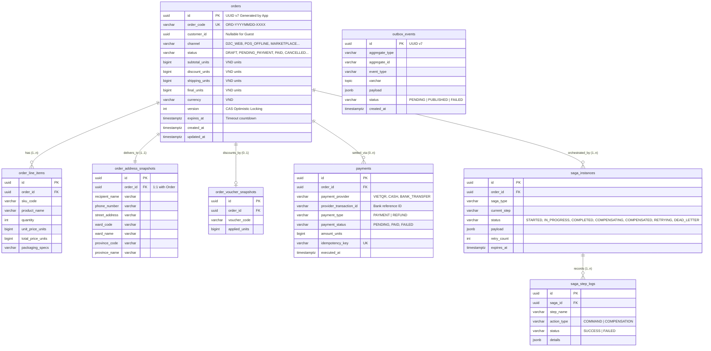

# TÀI LIỆU THIẾT KẾ CHI TIẾT (LLD): MS-04 ORDER SERVICE
## PHÂN HỆ 3: MÔ HÌNH DỮ LIỆU & TẦNG LƯU TRỮ (DATABASE SCHEMA & REPOSITORIES)

---

> **ĐIỀU HƯỚNG TÀI LIỆU:**
> - 📍 **Vị trí:** Phân hệ 3 / 6 của bộ thiết kế LLD `MS-04 order-service`.
> - ⬅️ [02_state_machine_and_lifecycle.md — Máy trạng thái & Vòng đời đơn hàng](02_state_machine_and_lifecycle.md)
> - 🔼 [README.md — Bản đồ điều hướng & Kiến trúc tổng thể](README.md)
> - ➡️ [04_usecases_and_saga_orchestration.md — Ca sử dụng & Điều phối Saga](04_usecases_and_saga_orchestration.md)

---

## 4. BƯỚC 4: MÔ HÌNH HÓA DỮ LIỆU QUAN HỆ & BỘ ĐỆM (DATABASE SCHEMA DDL & CACHE STORAGE)

Sau khi xác lập FSM và vòng đời thực thể, Bước 4 hiện thực hóa mô hình dữ liệu vật lý trên PostgreSQL 16 và Redis 7.2.

---

### 4.1. Sơ Đồ Thực Thể - Liên Kết (ERD)



---

### 4.2. Chiến Lược Sinh Khóa Chính UUID v7

> [!IMPORTANT]
> **Khẳng Định Kỹ Thuật Về UUID v7 Trên PostgreSQL 16:**
> Extension `uuid-ossp` của PostgreSQL **KHÔNG hỗ trợ sinh UUID v7** (chỉ hỗ trợ UUID v1, v3, v4, v5).
> 
> Nhằm tối ưu hóa triệt để cấu trúc B-Tree Index trên đĩa cứng và đạt hiệu năng ghi tuần tự tối đa:
> 1. **Khóa chính UUID v7 ĐƯỢC SINH BỞI APPLICATION LAYER (Go / Node.js)** trước khi thực thi lệnh `INSERT` xuống cơ sở dữ liệu.
> 2. Sử dụng các thư viện chuẩn hóa: `github.com/google/uuid` (Go v1.6+) hoặc `uuidv7` (Node.js/TypeScript).
> 3. Cột trong PostgreSQL sử dụng kiểu dữ liệu bản địa `UUID` (16 bytes nhị phân), hoàn toàn tương thích và lưu trữ chuẩn xác giá trị UUID v7 từ ứng dụng đưa xuống.

---

### 4.3. Kịch Bản DDL Chi Tiết (PostgreSQL 16 Production Script)

```sql
-- Extension hỗ trợ tìm kiếm văn bản tiếng Việt cho mã đơn
CREATE EXTENSION IF NOT EXISTS "pg_trgm";

-- =============================================================================
-- 1. BẢNG ĐƠN HÀNG TRUNG TÂM (ORDERS AGGREGATE ROOT)
-- =============================================================================
CREATE TABLE orders (
    id UUID PRIMARY KEY, -- Sinh UUID v7 từ Application Layer
    order_code VARCHAR(32) NOT NULL UNIQUE,
    customer_id UUID, -- Khóa ngoại mềm sang MS-15 Profile (NULL nếu là Guest)
    channel VARCHAR(30) NOT NULL CHECK (channel IN (
        'D2C_WEB', 'D2C_MOBILE', 'POS_OFFLINE', 
        'MARKETPLACE_SHOPEE', 'MARKETPLACE_TIKTOK', 'B2B_CORPORATE'
    )),
    status VARCHAR(35) NOT NULL CHECK (status IN (
        'DRAFT', 'PENDING_PAYMENT', 'PAID', 'PROCESSING', 
        'PACKED', 'SHIPPED', 'DELIVERED', 'COMPLETED',
        'CANCELLED_TIMEOUT', 'CANCELLED_BY_USER', 'CANCELLED_OUT_OF_STOCK',
        'RETURN_REQUESTED', 'REFUND_PENDING', 'REFUNDED'
    )),
    
    -- Tiền tệ: Đơn vị nguyên VND (BIGINT), tuyệt đối cấm dùng float
    subtotal_units BIGINT NOT NULL CHECK (subtotal_units >= 0),
    discount_units BIGINT NOT NULL DEFAULT 0 CHECK (discount_units >= 0),
    shipping_units BIGINT NOT NULL DEFAULT 0 CHECK (shipping_units >= 0),
    final_units BIGINT NOT NULL CHECK (final_units >= 0),
    currency VARCHAR(3) NOT NULL DEFAULT 'VND',
    
    customer_note TEXT,
    staff_note TEXT,
    
    -- CAS Optimistic Concurrency Control
    version INT NOT NULL DEFAULT 1,
    
    -- Hạn chót đếm ngược 15 phút (Dùng trực tiếp cho Timeout Sweeper)
    expires_at TIMESTAMPTZ,
    
    -- Thông tin giao vận & niêm phong
    tracking_code VARCHAR(100),
    shipping_carrier VARCHAR(50),
    seal_code VARCHAR(50),
    
    created_at TIMESTAMPTZ NOT NULL DEFAULT CURRENT_TIMESTAMP,
    updated_at TIMESTAMPTZ NOT NULL DEFAULT CURRENT_TIMESTAMP,
    
    -- =========================================================================
    -- CÁC RÀNG BUỘC KIỂM TRA BẤT BIẾN (DOMAIN CHECK CONSTRAINTS)
    -- =========================================================================
    -- Luật 1: Chiết khấu không bao giờ được vượt quá tổng tiền hàng
    CONSTRAINT chk_order_discount_limit CHECK (discount_units <= subtotal_units),
    -- Luật 2: Khớp số học tiền tệ tuyệt đối
    CONSTRAINT chk_order_math_integrity CHECK (final_units = subtotal_units - discount_units + shipping_units),
    -- Luật 3: Tiền thanh toán cuối cùng không được nhỏ hơn phí giao hàng
    CONSTRAINT chk_order_final_floor CHECK (final_units >= shipping_units)
);

CREATE INDEX idx_orders_customer_created ON orders (customer_id, created_at DESC) WHERE customer_id IS NOT NULL;
CREATE INDEX idx_orders_status ON orders (status);
CREATE INDEX idx_orders_expires_sweep ON orders (expires_at) WHERE status = 'PENDING_PAYMENT';
CREATE INDEX idx_orders_created_at ON orders (created_at DESC);
CREATE INDEX idx_orders_code_trgm ON orders USING GIN (order_code gin_trgm_ops);

-- =============================================================================
-- 2. BẢNG MẶT HÀNG CHI TIẾT (ORDER LINE ITEMS)
-- =============================================================================
CREATE TABLE order_line_items (
    id UUID PRIMARY KEY,
    order_id UUID NOT NULL REFERENCES orders(id) ON DELETE CASCADE,
    sku_code VARCHAR(64) NOT NULL,
    product_name VARCHAR(255) NOT NULL,
    quantity INT NOT NULL CHECK (quantity > 0),
    unit_price_units BIGINT NOT NULL CHECK (unit_price_units >= 0),
    total_price_units BIGINT NOT NULL CHECK (total_price_units >= 0),
    packaging_specs VARCHAR(100),
    item_notes VARCHAR(255),
    created_at TIMESTAMPTZ NOT NULL DEFAULT CURRENT_TIMESTAMP,
    
    CONSTRAINT chk_item_math CHECK (total_price_units = unit_price_units * quantity)
);

CREATE INDEX idx_line_items_order ON order_line_items (order_id);
CREATE INDEX idx_line_items_sku ON order_line_items (sku_code);

-- =============================================================================
-- 3. BẢNG BẢN CHỤP ĐỊA CHỈ NHẬN HÀNG (ORDER ADDRESS SNAPSHOTS)
-- =============================================================================
CREATE TABLE order_address_snapshots (
    id UUID PRIMARY KEY,
    order_id UUID NOT NULL UNIQUE REFERENCES orders(id) ON DELETE CASCADE,
    recipient_name VARCHAR(150) NOT NULL,
    phone_number VARCHAR(20) NOT NULL,
    street_address VARCHAR(255) NOT NULL,
    ward_code VARCHAR(20) NOT NULL,
    ward_name VARCHAR(100) NOT NULL,
    province_code VARCHAR(20) NOT NULL,
    province_name VARCHAR(100) NOT NULL,
    latitude NUMERIC(10, 7),
    longitude NUMERIC(10, 7),
    created_at TIMESTAMPTZ NOT NULL DEFAULT CURRENT_TIMESTAMP
);

-- =============================================================================
-- 4. BẢNG BẢN CHỤP KHUYẾN MÃI (ORDER VOUCHER SNAPSHOTS)
-- =============================================================================
CREATE TABLE order_voucher_snapshots (
    id UUID PRIMARY KEY,
    order_id UUID NOT NULL UNIQUE REFERENCES orders(id) ON DELETE CASCADE,
    voucher_code VARCHAR(50) NOT NULL,
    discount_type VARCHAR(20) NOT NULL CHECK (discount_type IN ('PERCENTAGE', 'FIXED_AMOUNT')),
    discount_value_units BIGINT NOT NULL,
    applied_units BIGINT NOT NULL CHECK (applied_units >= 0),
    created_at TIMESTAMPTZ NOT NULL DEFAULT CURRENT_TIMESTAMP
);

-- =============================================================================
-- 5. BẢNG GIAO DỊCH THANH TOÁN (PAYMENTS - QUAN HỆ 1:N)
-- Bảo đảm chống trùng lặp theo định danh nhà cung cấp thanh toán
-- =============================================================================
CREATE TABLE payments (
    id UUID PRIMARY KEY,
    order_id UUID NOT NULL REFERENCES orders(id) ON DELETE RESTRICT,
    payment_provider VARCHAR(30) NOT NULL CHECK (payment_provider IN (
        'VIETQR_NAPAS', 'COD_INTERNAL', 'B2B_BANK_DIRECT', 'POS_TERMINAL'
    )),
    provider_transaction_id VARCHAR(100) NOT NULL,
    payment_type VARCHAR(20) NOT NULL DEFAULT 'PAYMENT' CHECK (payment_type IN ('PAYMENT', 'REFUND')),
    payment_status VARCHAR(20) NOT NULL CHECK (payment_status IN (
        'PENDING', 'PAID', 'FAILED', 'RECONCILIATION_REQUIRED'
    )),
    amount_units BIGINT NOT NULL CHECK (amount_units >= 0),
    currency VARCHAR(3) NOT NULL DEFAULT 'VND',
    idempotency_key VARCHAR(128) NOT NULL UNIQUE,
    raw_signature TEXT,
    executed_at TIMESTAMPTZ,
    created_at TIMESTAMPTZ NOT NULL DEFAULT CURRENT_TIMESTAMP,
    
    -- Chống trùng lặp tuyệt đối theo giao dịch phía nhà cung cấp
    CONSTRAINT uq_payment_provider_tx UNIQUE (payment_provider, provider_transaction_id)
);

CREATE INDEX idx_payments_order ON payments (order_id);

-- =============================================================================
-- 6. BẢNG QUẢN LÝ TIẾN TRÌNH SAGA (SAGA INSTANCES & LOGS)
-- =============================================================================
CREATE TABLE saga_instances (
    id UUID PRIMARY KEY,
    order_id UUID NOT NULL REFERENCES orders(id) ON DELETE CASCADE,
    saga_type VARCHAR(50) NOT NULL CHECK (saga_type IN (
        'CHECKOUT_D2C_SAGA', 'MARKETPLACE_INBOUND_SAGA', 
        'ORDER_TIMEOUT_COMPENSATION_SAGA', 'RETURN_REFUND_SAGA'
    )),
    current_step VARCHAR(60) NOT NULL,
    status VARCHAR(30) NOT NULL CHECK (status IN (
        'STARTED', 'IN_PROGRESS', 'COMPLETED', 
        'COMPENSATING', 'COMPENSATED', 'RETRYING', 'DEAD_LETTER'
    )),
    payload JSONB NOT NULL DEFAULT '{}'::jsonb,
    error_message TEXT,
    retry_count INT NOT NULL DEFAULT 0,
    expires_at TIMESTAMPTZ,
    created_at TIMESTAMPTZ NOT NULL DEFAULT CURRENT_TIMESTAMP,
    updated_at TIMESTAMPTZ NOT NULL DEFAULT CURRENT_TIMESTAMP
);

CREATE INDEX idx_saga_order ON saga_instances (order_id);
CREATE INDEX idx_saga_status_retry ON saga_instances (status, retry_count) 
    WHERE status IN ('COMPENSATING', 'RETRYING');

CREATE TABLE saga_step_logs (
    id UUID PRIMARY KEY,
    saga_id UUID NOT NULL REFERENCES saga_instances(id) ON DELETE CASCADE,
    step_name VARCHAR(60) NOT NULL,
    action_type VARCHAR(20) NOT NULL CHECK (action_type IN ('COMMAND', 'COMPENSATION')),
    status VARCHAR(20) NOT NULL CHECK (status IN ('SUCCESS', 'FAILED')),
    details JSONB NOT NULL DEFAULT '{}'::jsonb,
    executed_at TIMESTAMPTZ NOT NULL DEFAULT CURRENT_TIMESTAMP
);

CREATE INDEX idx_saga_step_logs_saga ON saga_step_logs (saga_id);

-- =============================================================================
-- 7. BẢNG TRANSACTIONAL OUTBOX PATTERN (OUTBOX EVENTS)
-- =============================================================================
CREATE TABLE outbox_events (
    id UUID PRIMARY KEY,
    aggregate_type VARCHAR(50) NOT NULL DEFAULT 'Order',
    aggregate_id VARCHAR(64) NOT NULL,
    event_type VARCHAR(100) NOT NULL,
    topic VARCHAR(100) NOT NULL,
    payload JSONB NOT NULL,
    status VARCHAR(20) NOT NULL DEFAULT 'PENDING' CHECK (status IN ('PENDING', 'PUBLISHED', 'FAILED')),
    traceparent VARCHAR(128),
    created_at TIMESTAMPTZ NOT NULL DEFAULT CURRENT_TIMESTAMP,
    published_at TIMESTAMPTZ
);

CREATE INDEX idx_outbox_pending ON outbox_events (created_at ASC) WHERE status = 'PENDING';
```

---

### 4.4. Mô Hình Dữ Liệu Bộ Đệm & Phiên (Redis Data Schema)

| Cấu Trúc Khóa (Key Pattern) | Kiểu Dữ Liệu | TTL | Mục Đích Kỹ Thuật |
| :--- | :---: | :---: | :--- |
| `cart:{customer_id_or_session}` | `Hash` | 30 ngày (Login) / 7 ngày (Guest) | Quản lý giỏ hàng tạm thời trước khi checkout (`sku_code` $\rightarrow$ `quantity`). |
| `checkout_session:{checkout_token}` | `String (JSON)` | 30 phút | Lưu trữ giỏ hàng, snapshot địa chỉ đã chọn để chuẩn bị xác nhận. |
| `idempotency:checkout:{key}` | `String` | 24 giờ | Ngăn chặn việc bấm nút "Đặt Hàng" nhiều lần gây tạo đơn trùng. |
| `idempotency:payment:vietqr:{trans_id}`| `String` | 7 ngày | Ngăn ngân hàng gọi Webhook trùng lặp xử lý thanh toán đúp. |
| `saga:lock:order:{order_id}` | `String` (Redlock) | 10 giây | Concurrency Shield ngăn hai tiến trình cùng cập nhật trạng thái đơn hàng. |

---

## 5. BƯỚC 5: TRỪU TƯỢNG HÓA TẦNG LƯU TRỮ (REPOSITORY & DATA ACCESS INTERFACES)

*Tuân thủ nguyên tắc Dependency Inversion: Toàn bộ Tầng Miền và Ứng Dụng chỉ làm việc qua các interface được type-safe nghiêm ngặt, loại bỏ hoàn toàn việc dùng `tx interface{}` mơ hồ.*

---

### 5.1. Định Nghĩa Trừu Tượng Database Transaction (`DBTX`)

```go
package repository

import (
    "context"
    "github.com/jackc/pgx/v5"
    "github.com/jackc/pgx/v5/pgconn"
)

// DBTX đại diện cho giao diện chung của pgx.Pool và pgx.Tx
// Bảo đảm tính an toàn kiểu dữ liệu tại thời điểm biên dịch (Compile-time Type Safety)
type DBTX interface {
    Exec(ctx context.Context, sql string, arguments ...any) (commandTag pgconn.CommandTag, err error)
    Query(ctx context.Context, sql string, args ...any) (pgx.Rows, error)
    QueryRow(ctx context.Context, sql string, args ...any) pgx.Row
}
```

---

### 5.2. `OrderRepository` Interface

```go
package repository

import (
    "context"
    "errors"
    "time"
    "github.com/omamx/order-service/internal/domain"
)

var (
    ErrOrderNotFound          = errors.New("order: not found")
    ErrOptimisticLockConflict = errors.New("order: concurrent modification detected (CAS version conflict)")
)

type OrderRepository interface {
    // Tạo mới Order cùng OrderLineItems, AddressSnapshot, VoucherSnapshot trong 1 Transaction
    Create(ctx context.Context, db DBTX, order *domain.Order) error
    
    // Truy vấn Aggregate đầy đủ
    GetByID(ctx context.Context, db DBTX, orderID domain.UUID) (*domain.Order, error)
    GetByCode(ctx context.Context, db DBTX, orderCode string) (*domain.Order, error)
    
    // Cập nhật trạng thái sử dụng CAS Optimistic Locking:
    // UPDATE orders SET status = $1, version = version + 1 WHERE id = $2 AND version = $3
    UpdateStatusCAS(ctx context.Context, db DBTX, orderID domain.UUID, oldStatus, newStatus domain.OrderStatus, oldVersion int) (bool, error)
    
    // Quét các đơn hàng PENDING_PAYMENT bị quá hạn cho Timeout Sweeper
    FindExpiredOrders(ctx context.Context, db DBTX, before time.Time, limit int) ([]*domain.Order, error)
    
    // Ghi nhận giao dịch thanh toán vào bảng payments
    RecordPaymentTransaction(ctx context.Context, db DBTX, txRecord *domain.PaymentTransaction) error
}
```

---

### 5.3. `SagaRepository` Interface

```go
package repository

import (
    "context"
    "github.com/omamx/order-service/internal/domain"
)

type SagaRepository interface {
    CreateSaga(ctx context.Context, db DBTX, saga *domain.SagaInstance) error
    GetByOrderID(ctx context.Context, db DBTX, orderID domain.UUID) (*domain.SagaInstance, error)
    UpdateSagaStatus(ctx context.Context, db DBTX, sagaID domain.UUID, currentStep string, status domain.SagaStatus, retryCount int, errMsg *string) error
    LogStep(ctx context.Context, db DBTX, logEntry *domain.SagaStepLog) error
    
    // Lấy danh sách Saga đang COMPENSATING hoặc RETRYING để chạy Worker thử lại
    FindRetryingSagas(ctx context.Context, db DBTX, maxRetries int, limit int) ([]*domain.SagaInstance, error)
}
```

---

### 5.4. `OutboxRepository` Interface

```go
package repository

import (
    "context"
    "github.com/omamx/order-service/internal/domain"
)

type OutboxRepository interface {
    SaveEvent(ctx context.Context, db DBTX, event *domain.OutboxEvent) error
    FetchPendingEvents(ctx context.Context, db DBTX, batchSize int) ([]*domain.OutboxEvent, error)
    MarkPublished(ctx context.Context, db DBTX, eventIDs []domain.UUID) error
    MarkFailed(ctx context.Context, db DBTX, eventID domain.UUID, reason string) error
}
```

---

### 5.5. `CartRepository` Interface

```go
package repository

import (
    "context"
    "time"
)

type CartItem struct {
    SKUCode  string `json:"sku_code"`
    Quantity int    `json:"quantity"`
}

type CartRepository interface {
    GetCart(ctx context.Context, cartKey string) ([]CartItem, error)
    SetItem(ctx context.Context, cartKey string, skuCode string, quantity int, ttl time.Duration) error
    RemoveItem(ctx context.Context, cartKey string, skuCode string) error
    ClearCart(ctx context.Context, cartKey string) error
}
```
