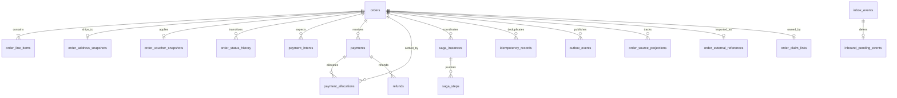

> **Implementation 3.1 — 09/10/2026:** [08_implementation_and_acceptance.md](08_implementation_and_acceptance.md) là nguồn hành vi hiện tại. Acceptance tạo checkout operation, chưa tạo Order; PAID và outbox chờ terminal stock/voucher outcome. Các đoạn v3.0 khác mô tả candidate cần đọc cùng cập nhật này.

# 03 — Database, transaction và persistence

[Chỉ mục](README.md) · [Trước: State machine](02_state_machine_and_lifecycle.md) · [Tiếp: Use cases](04_usecases_and_saga_orchestration.md)

## 1. Nguồn dữ liệu và ERD

PostgreSQL `order_db` giữ order/snapshot, financial ledger, idempotency, saga, inbox/outbox. Redis giữ cart và read cache có thể khôi phục hoặc mất theo chính sách phiên; không lưu nguồn duy nhất của nghĩa vụ. DDL tại [order_schema_candidate.sql](order_schema_candidate.sql) là schema **candidate cho database rỗng**, cần migration/versioning/review khi triển khai. Không được chạy đè database thật hoặc coi là migration đã áp dụng.



Order có 1..N items sau khi checkout chốt; DRAFT chưa validate có thể chưa có item. Cross-table invariant về số line và tổng tiền không được bảo đảm chỉ bằng `CHECK` của bảng orders: application transaction phải kiểm tra từ snapshot canonical; có thể bổ sung deferred constraint trigger khi triển khai.

## 2. Bảng và ràng buộc

| Bảng | Trường/constraint chính | Lý do |
| --- | --- | --- |
| orders | UUID, code unique, nullable customer, channel/method/status, totals, expiry, resource IDs, version, SLA, hold/case projection | Domain và truy vấn queue không phụ thuộc join mạng |
| order_line_items | unique(order,sku), quantity > 0, unit/line total BIGINT, canonical metadata | Không trùng line; bảo toàn thương mại |
| order_address_snapshots | unique(order), source address/version, encrypted PII, ward/province | Reference Profile và snapshot độc lập |
| order_voucher_snapshots | unique(order), code/type/policy, hold ID, merchandise/shipping split | Không gộp free ship vào giảm hàng |
| order_status_history | unique(order,version), from/to, actor/source/reason, time | Một transition có một timeline entry |
| payment_intents | unique operation/transfer reference, receiver, expected amount/expiry | QR/payment instruction không được lấy từ browser |
| payments | unique(provider,provider_transaction_id), optional order, verified amount, immutable receipt hash | Unmatched receipt vẫn phải ghi nhận |
| payment_allocations | unique(payment), amount > 0 | Không auto cộng tiền chưa được xác nhận/phê duyệt vào Order |
| refunds | payment ID, approval ID, unique operation key, amount > 0, status, provider ref | Chống retry hoàn tiền và vượt ngân sách receipt |
| saga_instances / saga_steps | unique(order,type,operation key), step key unique, lease epoch, run_after, attempts, reference, error code | Khôi phục qua restart; chống stale worker |
| idempotency_records | primary(scope,operation,key), request hash, order ID, IN_PROGRESS/SUCCEEDED/FAILED, result status | Durable dedup theo người gọi/hành động |
| outbox_events | stable event ID, aggregate type/ID/sequence, optional order ID, ordinal, topic/key/payload, retry/lease | At-least-once và ordering theo aggregate |
| inbox_events | primary(consumer,source,event ID), payload hash, APPLIED/DEFERRED/REJECTED | Dedup cả cùng ID bị giả mạo nội dung |
| inbound_pending_events | FK inbox, source version, order, retry deadline | Event đến sớm không bị bỏ mất |
| order_source_projections | primary(order,source,resource), source_version, non-PII projection | Dedup checkpoint/case/task theo business version dù event ID mới |
| order_external_references | primary(channel,store,external ID), order unique | Chống nhập lại đơn marketplace/POS |
| order_claim_links | order unique, customer, claim/version | Ownership immutable ngoại trừ verified claim |

UUID sinh ở application; không phụ thuộc extension UUID v7 của PostgreSQL 16. Không tạo cross-database FK tới Customer, SKU, address book, reservation. IDs đó được validation qua contract, lưu như reference. Không `ON DELETE CASCADE` financial/history; xóa/ẩn danh phải theo retention workflow.

## 3. Transaction boundary

| Local transaction | Nội dung atomic | Ngoài transaction |
| --- | --- | --- |
| T0: nhận checkout | dedup insert + DRAFT + saga STARTED, input hash/reference | validation query Catalog/Profile/Shipping |
| T1: trước acquisition | snapshot canonical + totals + saga step intent/key | voucher hold, stock reserve |
| T2: nhận acquisition | resource reference + từng step outcome | query/retry remote nếu UNKNOWN |
| T3: checkout thành công | PENDING_PAYMENT/CONFIRMED_COD + history/outbox + dedup result | publish Kafka; trả response có thể bị mất |
| T4: receipt | unique receipt + lock Order + allocation hoặc reconciliation + FINALIZE intent/history | finalize Inventory/Promotion |
| T5: finalize ack | stock projection + PAID + OrderPaid; ready event khi đủ điều kiện | Packing nhận ready authorization |
| T6: hủy/timeout | guarded status + history + cancel event + release saga intent | release/decommit remote |
| T7: consumer | inbox + mutation/history/outbox, hoặc DEFERRED + pending payload | commit Kafka offset sau DB commit |
| T8: refund budget | lock receipt, tính refundable, insert approved refund obligation | provider refund với operation key ổn định |
| T9: refund result | financial status + settlement ref + audit outbox | notify/accounting consumers |

T0 cho phép lưu DRAFT trước validation; DRAFT không phải đơn có quyền thanh toán hoặc fulfillment. Nếu validation fail, ghi CHECKOUT_FAILED và dedup result. Input chứa PII lưu encrypted/restricted snapshot; saga payload chỉ chứa reference, không sao chép raw body.

## 4. Khóa và CAS

Các handler thay đổi cùng Order dùng row lock hoặc CAS với version. Thứ tự khóa thống nhất: Order → PaymentReceipt (ID tăng dần khi nhiều receipt) → Refund/Saga. Unmatched receipt chỉ khóa receipt. Không lấy lock receipt rồi quay lại Order để tránh deadlock.

```sql
BEGIN;
SELECT id, status, version, payment_expires_at
FROM orders WHERE id = $1 FOR UPDATE;
-- application xác định decision_at bằng SELECT clock_timestamp() sau lock
UPDATE orders
SET status = $3, version = version + 1, updated_at = clock_timestamp()
WHERE id = $1 AND status = $4 AND version = $2
RETURNING version;
-- nếu 0 rows: re-read, kiểm tra quyền và trả conflict/no-op theo intent
-- nếu thành công: INSERT history + outbox + saga intent trước COMMIT
COMMIT;
```

Isolation `READ COMMITTED` với khóa hàng thích hợp đủ cho các invariant cục bộ trên một Order; tổng refundable phải khóa receipt rồi cộng succeeded + approved/submitted/unknown obligations. Các bước có nhiều aggregate cần kiểm tra kỹ và retry deadlock/serialization theo bounded policy. PostgreSQL đánh giá lại điều kiện UPDATE sau khi chờ cập nhật cạnh tranh; thiết kế vẫn phải kiểm tra rows affected. [PostgreSQL 16 transaction isolation](https://www.postgresql.org/docs/16/transaction-iso.html).

`version` bắt đầu 1; mọi mutation có ý nghĩa tăng đúng một lần và history ghi phiên bản mới. Replay cùng command thành công không tăng version. Snapshot immutable sau chốt: application role không có UPDATE trực tiếp; dùng repository có guard/trigger và migration role riêng. DDL candidate chưa chứa trigger immutable nên đây là yêu cầu implementation cần kiểm chứng.

## 5. Idempotency durable

Scope = verified customer ID hoặc Guest session ID hoặc trusted service/store ID; operation = CHECKOUT/CANCEL/POS_IMPORT/REFUND. Key không phải bearer token và không dùng chung giữa khách. Hash SHA-256 của request canonical gồm cart revision, line quantities/prices mong đợi, address source/version, carrier/method/voucher; loại transport timestamp/trace ID. Key trùng + hash khác → 409 IDEMPOTENCY_CONFLICT.

`INSERT ... ON CONFLICT DO NOTHING` quyết định winner. Cùng hash và IN_PROGRESS trả `202` + status resource/Retry-After; cùng hash đã kết thúc replay HTTP status và order reference. Response dựng lại từ snapshot, không gọi lại query giá. Sau khi response retention hết hạn vẫn giữ key/hash/order tombstone đủ cho cửa sổ business retry; không xóa key khi saga đang chạy hoặc tiền/compensation chưa terminal. Đề xuất response retention 7 ngày, tombstone 30 ngày; imports và receipt/refund uniqueness giữ theo ledger retention. Công bố giới hạn retry cho client trước release.

## 6. Outbox và inbox

Outbox event ID giữ nguyên qua mọi lần gửi. `aggregate_version` và `event_ordinal` tạo thứ tự các event phát trong cùng một mutation. Publisher chỉ claim event nếu không còn event chưa publish có sequence nhỏ hơn của cùng aggregate, dùng lease + `FOR UPDATE SKIP LOCKED`; gửi cùng order partition key. Không gửi Kafka khi giữ SQL row lock lâu. Receipt unmatched dùng aggregate PAYMENT với order ID NULL; vì vậy vẫn có reconciliation/audit outbox cùng receipt commit. Broker ack rồi mới mark PUBLISHED; crash ở giữa gây duplicate, không đổi ID. Producer idempotence không làm Kafka và SQL thành một transaction.

Lease takeover có thể tạo duplicate/stale send ngay cả khi SQL selection đúng: consumer cần xử lý source version và state guards, không coi broker arrival order là business causality tuyệt đối. Kafka chỉ cung cấp ordering trong partition; external DB effect cần phối hợp và dedup riêng. [Apache Kafka design](https://kafka.apache.org/41/design/design/).

Inbox APPLIED được commit cùng effect; DEFERRED được commit cùng pending payload nếu thiếu prerequisite. Khi prerequisite có mặt, pending worker khóa inbox/order, apply và đổi APPLIED trong một transaction. Không insert APPLIED trước effect; không commit offset khi chưa có durable result. Poison event ghi REJECTED + durable DLQ outbox; DLQ ack/persistence thành công rồi mới advance offset. Replay dùng cùng event ID/source; cùng ID/hash khác báo integrity incident.

## 7. Index, queue và Redis

Index customer history `(customer_id, created_at DESC, id DESC)`; queue `(status, sla_due_at, id)` với active states; timeout partial `(payment_expires_at,id)` WHERE PENDING_PAYMENT; completion partial `(completion_due_at,id)` WHERE DELIVERED; outbox pending/run_after; saga run_after/lease expiry; payments provider uniqueness; marketplace uniqueness theo channel/store/id.

Keyset pagination dùng `(created_at,id)`; cursor chứa filter hash và scope đã ký. SLA queue sort overdue trước, `sla_due_at ASC`, `created_at ASC`, `id ASC`. Deadline lưu theo policy version và state entry time, không tính lại từ created_at cho tất cả công đoạn. Queue không chứa order thiếu ready authorization cho công đoạn.

Redis keys `cart:{scope}`, `quote:{scope}:{id}`, `order-read:{order_id}:{version}`. Cart mutate atomically với revision (Lua/WATCH), TTL 30 ngày; quote 5 phút, không reserve. Nếu Redis mất cart, báo phiên hết hạn, không tác động orders. Nếu cache fail, đọc DB; auth/state/refund/ownership không dựa vào cache. Không cache raw PII mặc định; profile authoritative read không có cam kết P99 5 ms.

## 8. Repository ports và vận hành dữ liệu

`UnitOfWork` truyền DBTX thật cho mọi repository trong transaction: Order, Payment, Saga, History, Outbox, Inbox, Dedup. Không mở transaction mới bên trong repository. External client interface trả `Succeeded/Rejected/Unknown`, không gom timeout vào rejection.

Migrations expand/backfill/validate trước constrain; rollback không xóa receipt hoặc nghĩa vụ chưa hoàn thành. DB role ứng dụng không được truncate history/ledger. Backup phải có PITR và restore drill; restore outbox/inbox cùng DB, sau restore reconcile provider/Inventory vì remote effect có thể mới hơn backup. Schema retention/partitioning chọn sau đo tải; không partition vội làm mất global receipt uniqueness.
