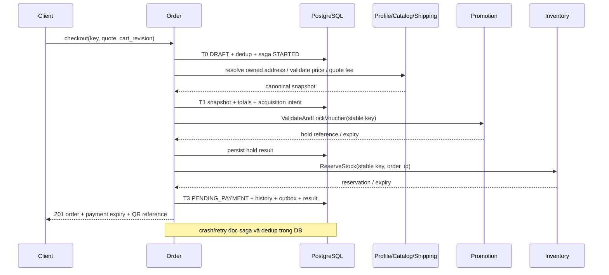

> **Implementation 3.1 — 09/10/2026:** [08_implementation_and_acceptance.md](08_implementation_and_acceptance.md) là nguồn hành vi hiện tại. Acceptance tạo checkout operation, chưa tạo Order; PAID và outbox chờ terminal stock/voucher outcome. Các đoạn v3.0 khác mô tả candidate cần đọc cùng cập nhật này.

# 04 — Use cases và điều phối saga bền vững

[Chỉ mục](README.md) · [Trước: Persistence](03_database_and_persistence.md) · [Tiếp: Contracts](05_api_contracts_and_transports.md)

## 1. Cart và quote trước checkout

Cart dùng owner scope đáng tin: Customer resolved từ Identity/Profile, Guest dùng session opaque có TTL. Khi mutate, kiểm tra revision và tổng line/quantity; giới hạn đề xuất 100 SKU, quantity mỗi SKU 1..999, body 64 KiB. SKU/price cache phục vụ hiển thị, không reserve stock. Merge guest cart vào customer là phép gộp có key/revision, không chuyển quyền Orders Guest.

Quote đọc cart revision, validate canonical SKU metadata/price, địa chỉ owned/Guest và shipping. Price thay đổi trả `409 PRICE_CHANGED`, không âm thầm thu số tiền mới. Quote chứa line snapshot, address reference/version, carrier/service, totals, expiry, policy version và input hash; chỉ một địa chỉ, không reserve. Voucher preview dùng CalculateDiscount, chưa giữ budget. Checkout phải kiểm tra lại voucher bằng hold, nên quote là dự kiến, không cam kết tài nguyên.

Chọn `POST /api/v1/checkout` là command duy nhất vừa confirm quote vừa tạo order; không thêm `POST /orders` tạo đơn thứ hai. Có thể giữ alias gateway cho client cũ sau contract review, cùng use case và key scope; không mặc nhiên có hai luồng tạo độc lập.

## 2. Checkout trả trước

Trình tự chi tiết:

1. Validate auth/body/key; canonical request hash. T0 insert DRAFT và dedup trong một transaction. Nếu dedup conflict, rollback DRAFT mới rồi đọc record winner; không để lại draft rác từ request thua.
2. Saved address gọi Profile với đúng customer; không có resolver user→customer thì không fallback JWT sub. Guest address validate master data, giữ snapshot encrypted.
3. Catalog ValidatePriceAndSKU cung cấp subtotal; GetProductVariant cung cấp canonical name/weight/packaging. Contract hiện chưa trả full validated line snapshot/version: cần gap G03 để tránh metadata/price bị đổi giữa hai query. Shipping phụ thuộc address và weight; voucher phụ thuộc canonical subtotal. Chỉ parallel các query độc lập, không chạy voucher trước khi có subtotal.
4. Lưu snapshot, quote và acquisition intent trước RPC có side effect. Sinh `order_id` ngay T0; key mỗi bước `order:{id}:checkout:{operation}:voucher-hold` / `stock-reserve`, không sinh lại khi retry.
5. Có voucher thì hold trước, ghi ack rồi reserve tất cả SKU atomic. Reserve thất bại rõ ràng → release voucher. Không có voucher bỏ qua bước hold. Reserve timeout → UNKNOWN; query/retry cùng key để xác định, không tạo đơn khác.
6. `payment_expires_at=min(inventory_expiry, voucher_expiry nếu có, commercial_confirmation_expiry)`. Quote dùng để validation trước acquisition; lưu commercial confirmation expiry = thời điểm canonical snapshot T1 + 15 phút cho snapshot đã chốt. Đề xuất cần còn ít nhất 30 giây khi trả QR; nếu không, compensation và yêu cầu quote mới. Không gia hạn bằng reset local clock.
7. T3 ghi PENDING_PAYMENT, resource IDs, history, OrderPlaced candidate event, dedup SUCCEEDED/result 201. QR được tạo từ final/receiver/reference trong payment_intents đã lưu cùng transaction, không từ browser. Không có provider integration thì không tuyên bố tạo VietQR đã được xác minh.
8. Client mất response: retry key cũ đọc lại order. Deadline HTTP đến khi saga chưa terminal: trả 202 với order reference, không 504 làm khách hiểu thất bại chắc chắn. Nếu DB chưa durable nhận request thì trả 503; caller vẫn retry cùng key.

Nếu external call đã thành công nhưng T3 commit thất bại/không rõ, worker tìm T0/T1 và remote key để resume hoặc compensation. Không có nhánh “DB chưa ghi gì nhưng saga worker sẽ biết để nhả”: intent phải tồn tại trước đó.

## 3. COD checkout

COD eligibility kiểm tra channel, địa chỉ, carrier/service, giá trị, SKU, risk policy; không được thì 422 COD_NOT_AVAILABLE. Không cấp QR, không chờ webhook 15 phút. DRAFT giữ stock/hold rồi finalize stock và voucher bằng stable commands; thành công mới T3 CONFIRMED_COD, UNPAID, fulfillment-ready. Lease cho các bước COD là deadline điều phối ngắn, không phải khoảng 15 phút đợi khách trả tiền.

Mất finalize ack tiếp tục query/retry; nếu stock expired trước finalize thì checkout fail và compensate voucher. Kho COMMITTED nhưng DB response chưa thành công: worker tiếp tục T3 hoặc decommit bằng reversal có contract, không ReleaseReservation ACTIVE. COD không được bật trước khi gap finalize/reversal và fulfillment-ready đã đóng.

## 4. Webhook và quyết định payment

Webhook phải dùng adapter theo provider thực sự cung cấp thông báo giao dịch. VietQR là cách tạo mã chuyển khoản, không tự quy định webhook HMAC hay tính finality của ngân hàng. Adapter cần verify signature/raw bytes, receiver account, transaction ID, reference, timestamp/replay policy và receipt status. Không hard-code HMAC-SHA256 cho mọi ngân hàng nếu hợp đồng provider chưa nói vậy.

1. Verify trước khi ghi receipt; IP allowlist chỉ bổ sung, không thay chữ ký. Provider invalid trả 401/403 theo contract; DB unavailable trả 503 để provider retry.
2. Unique(provider,transaction ID) khóa chống trùng. Duplicate phải so normalized receipt hash/amount/account/reference; khác nội dung → security/reconciliation incident, không no-op im lặng.
3. Receipt không match order vẫn lưu `payments.order_id=NULL`, RECONCILIATION_REQUIRED. Không mất tiền nhận thực tế vì parse mã đơn lỗi.
4. Match Order: khóa row, xác định decision time; exact/đúng currency/receiver/reference và còn hạn → allocation + PAYMENT_FINALIZING + finalize intent. Accepted webhook chỉ có nghĩa đã lưu receipt, không có nghĩa Order đã PAID.
5. Worker finalize stock atomic với Inventory expiry; outcome COMMITTED → PAID/OrderPaid. Voucher finalize thành công thì phát fulfillment-ready; voucher failure/unknown giữ operational hold, không đóng gói. Failure definitive cần cancellation review/reversal và refund approval, không gọi release committed stock.

| Receipt | Allocation tự động MVP | Order/Payment kết quả |
| --- | --- | --- |
| Exact và còn hạn, stock finalize thành công | final toàn bộ | PAID + CONFIRMED |
| Thiếu tiền | không | Order giữ PENDING_PAYMENT; receipt RECONCILIATION_REQUIRED |
| Thừa tiền | không | Order giữ PENDING_PAYMENT; receipt RECONCILIATION_REQUIRED |
| Tiền vào sau cancel/expiry | không | Order giữ cancelled; mở đối soát và refund review |
| Nhiều receipt nhỏ cộng đủ | không tự cộng | đối soát có phê duyệt; chưa hỗ trợ auto split payment |
| Duplicate cùng normalized payload | không tạo allocation thứ hai | replay ACK |
| Exact nhưng reservation expired | giữ sự thật receipt, không fulfillment | cancelled/hold + reconciliation |

Receipt dư/mismatch đến khi Order đã PAID hoặc đang fulfillment tạo reconciliation case riêng; không hạ payment summary CONFIRMED của allocation hợp lệ, không phát OrderPaid lần hai. Trạng thái RECONCILIATION_REQUIRED của receipt riêng không xóa sự thật payment của Order.

Luật exact-match được áp dụng nhất quán: chuyển thừa **không** tự PAID. Nếu muốn phân bổ final và hoàn phần thừa phải có policy mới, refund approval và allocation ledger; không gửi khách “chuyển nốt” khi chưa hỗ trợ tổng hợp receipt.

## 5. Timeout, tự hủy và paid cancellation

Timeout worker lấy candidate PENDING_PAYMENT theo index; lock từng Order rồi kiểm tra DB clock và guard như chương 02. Transaction hủy tạo release saga intent và cancellation fact. Worker sau commit release stock/hold; cancellation response có `compensation_status=PENDING`, không tuyên bố kho đã nhả ngay.

Self-cancel trả trước chỉ PENDING_PAYMENT. Paid customer yêu cầu hủy → tạo cancellation review do Manager/Care xử lý; không tự refund. COD trước packing accepted có thể hủy nhưng cần barrier với Fulfillment. Race giữa cancellation và ready consumer phải qua authorization/cancel protocol: Fulfillment kiểm tra ready generation, atomically chấp nhận task hoặc cancel, trả terminal acceptance. Order chỉ commit cancelled sau xác nhận barrier; pending yêu cầu trả 202 và hold. Không chỉ kiểm tra local PROCESSING vì event acceptance có thể đang lag.

Nếu PROCESSING/PACKED thì self-cancel 409 CANCELLATION_NOT_ALLOWED và hướng dẫn quy trình hỗ trợ; không release stock đã commit. Nếu shipment đã dispatch, xử lý return/delivery-failure bằng Care/Shipping. Reversal kho chỉ sau nguồn xác nhận dừng fulfillment/thu hồi hàng hoặc kiểm định; money refund không tự restock.

## 6. Fulfillment, shipping và SLA

OrderPaid là fact tiền + stock finalize của trả trước; dùng event fulfillment-ready riêng cho cả COD và trả trước, sau voucher và inventory commit. Fulfillment task unique(order,ready generation). Ready và cancel handshake phải chống event cũ: cancelled order không được tạo task từ ready đã xếp hàng trước đó.

Inbound events mang order ID, resource ID, source sequence/version và occurrence time. Packing accepted chuyển PROCESSING, sealed chuyển PACKED, shipment created chỉ gắn tracking; dispatched mới SHIPPED. Delivery failed không coi hoàn tất; reattempt có attempt ID mới. Duplicate business checkpoint với event ID mới vẫn dedup theo resource/version. Event đến sớm durable DEFERRED; source snapshot query giúp khôi phục prerequisite, không quay trạng thái ngược.

SLA deadline bắt đầu khi đủ điều kiện bước tương ứng; ví dụ packing deadline = ready_at + configured packing SLA. Queue chỉ hiển thị task đủ điều kiện theo quyền công đoạn. Mặc định cảnh báo khi còn dưới 20% budget, overdue khi DB now > due_at; threshold là đề xuất. Đổi policy không tính lại hạn đơn cũ nếu chưa có approved recalculation command.

## 7. Verified Guest claim

Profile verifier phải đối chiếu đơn thực sự Guest, proof bind order/customer/phone, TTL và chống replay. Phone/order_code tự gửi không đủ. Chưa có verifier adapter thì Profile hiện trả 503 và không có event thật để consumer xử lý.

Order consumer chỉ tin publisher Profile đã xác thực và claim đã verified. Tại transaction: inbox dedup → lock Order → nếu owner NULL thì update customer/link/version/history/audit; nếu cùng customer thì no-op; nếu owner khác thì reject/security case. Không thay address snapshot. Muốn claim acknowledged end-to-end phải có Order-side apply ack hoặc status query; việc Profile phát event chưa đồng nghĩa lịch sử đơn của Customer đã cập nhật. Claim revoked/transfer là gap cần policy, không tự đổi lại owner NULL.

## 8. Return/refund và nguồn kênh khác

Refund decision từ Care chứa approval ID/version, order/receipt/line scope, amount, method, approving actor và policy. Payment lock receipt kiểm tra refundable, giữ obligation trước RPC; provider operation key không đổi. Timeout refund → UNKNOWN, query provider trước retry; chỉ receipt/refund settlement confirmed mới SUCCEEDED. FAILED terminal có thể giải phóng obligation theo policy; UNKNOWN vẫn giữ budget. Partial refund không xóa line thương mại hoặc làm tiền đã trả thành chưa trả.

Marketplace do Channel normalize rồi event import; uniqueness(channel,store,external ID), external payment state/reference giữ riêng; không gán PAID chỉ vì kênh sàn. Out-of-stock phát kết quả import fail cho Channel xử lý với sàn, Order không gọi API Shopee/TikTok trực tiếp. POS chỉ qua CreatePOSOrder với trusted terminal/cashier và external sale key; CASH cần bằng chứng thu đúng quyền, CARD cần terminal confirmation, VIETQR chưa receipt thì pending. Retry offline cùng sale ID không trừ kho hai lần; không coi offline disconnected là được phép bỏ validate stock.

B2B credit terms/deposit và gifting multi-address có policy riêng ở giai đoạn sau. Gift text/ẩn giá lưu private snapshot; event chỉ is_gift/reference. Không suy diễn B2B payment completed từ một khoản đặt cọc.

## 9. Retry, timeout và ngân sách

RPC chỉ retry khi idempotent key/query contract bảo đảm; không retry validation rejection. Backoff đề xuất full jitter trong `min(30s, 0.5s × 2^attempt)`, tự động tối đa 10 attempts/15 phút cho acquisition/compensation rồi MANUAL_REVIEW; không xóa nghĩa vụ. Finalize ưu tiên trong reservation window, hết hạn phải query terminal outcome. Circuit breaker theo rolling error/timeout window, không tính business rejection là service lỗi.

HTTP deadline 3 giây, từng RPC ≤ min(2 giây, remaining budget). Profile/address và Catalog metadata trước Shipping/voucher; reserve sau validation. Performance phải đo network + DB + provider, ghi số line/nguồn address/voucher/COD/tải/concurrency. Acceptance p95 500 ms là mục tiêu tiếp nhận/commit, không phải toàn bộ Saga; không tự kết luận từ ngân sách từng bước hoặc mock.
