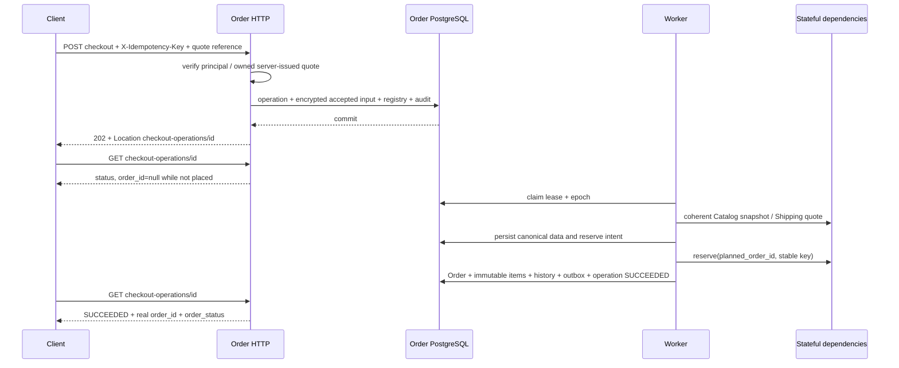

# MS-04 — implementation 3.1 và release gates

**09/10/2026.** Đây là nguồn mô tả code hiện tại, thay thế các đoạn candidate v3.0 còn ghi Order DRAFT tại acceptance, PAID trước voucher finalize hoặc checkout p95 là toàn bộ Saga. Backend chạy ở **sandbox**; dependencies có trạng thái và provider ledger độc lập. Production startup bị từ chối vì chưa có bộ adapter thật được kiểm chứng.

## 1. Tài nguyên và transaction



Operation UUID và planned Order UUID được sinh/lưu trước acquisition. Planned UUID chỉ là correlation nội bộ; `order_id` public NULL cho đến transaction tạo Order commit. Validation failure không để lại Order. Compensation UNKNOWN giữ obligation trong WAITING_RETRY/COMPENSATING/MANUAL_REVIEW.

Operation states: ACCEPTED, PROCESSING, WAITING_RETRY, COMPENSATING, SUCCEEDED, FAILED, MANUAL_REVIEW. Worker dùng lease 10 giây, epoch tăng; stale worker không thể ghi kết quả. External keys không thay đổi khi retry hoặc operator resume. HTTP request không chờ canonical calls/Saga.

## 2. Idempotency, quote và Cart

| Điều kiện | POST replay |
| --- | --- |
| Key mới, acceptance hợp lệ | 202 + operation mới |
| Cùng scope/key/hash, chưa terminal | 202 + operation cũ |
| Cùng scope/key/hash, SUCCEEDED | 201 + kết quả/Order cũ |
| Cùng key, hash khác | 409 IDEMPOTENCY_CONFLICT |
| Cùng key/hash, FAILED | HTTP error đã lưu + operation FAILED |
| Terminal response hết 7 ngày | 410 IDEMPOTENCY_RESPONSE_EXPIRED + operation reference |
| Chưa terminal dù response hết hạn | 202, không tạo effect mới |

Registry có minimum tombstone 30 ngày nhưng **không tự xóa/reuse key**. Code chưa tự compact dữ liệu PII vì policy retention riêng chưa chốt; operation status tối thiểu và nghĩa vụ đang chạy phải giữ bền vững.

Cart là Redis session có revision và TTL 30 ngày; item ID là SKU ổn định do server trả. Quote preview trong Redis được mã hóa AEAD, có scope/principal và TTL 5 phút. Handler xác minh quote server, ownership, method/revision và expiry theo DB acceptance time. Browser không quyết định giá/tổng tiền.

Accepted input/quote lưu encrypted trong PostgreSQL. Sau commit, mất Redis không mất dữ liệu resume. Worker bỏ qua preview expiry đã qua nhưng revalidate thương mại; giá/phí đổi trả PRICE_CHANGED thay vì tự thu tổng mới. Catalog simulator dùng repeatable-read batch và lưu canonical snapshot có ID/validity; Shipping trả quote reference/expiry. Payment expiry lấy min Inventory, Catalog, Shipping và commercial confirmation 15 phút.

Saved address adapter có hai chế độ: simulator, hoặc HTTP Profile hiện có với `PROFILE_URL` và credential `PROFILE_INTERNAL_TOKEN` riêng. Profile lookup kiểm user/customer/address/version. Default stack dùng simulator; không công bố đã chạy integration với Profile thật. Phone đầu vào Guest được chuẩn hóa về E.164; administrative fixture `75/HUE-01` là dữ liệu synthetic.

## 3. Financial truth và fulfillment

Provider ledger nằm trong database `order_simulator`, độc lập với Order DB `order_runtime`. Payment/refund SUCCEEDED là sự thật ledger, không phụ thuộc callback/HTTP ACK. Statement có commit-ordered cursor; cursor Order chỉ advance sau khi từng receipt có durable local outcome. Vì vậy callback mất ở đơn đã hủy hoặc reference unmatched vẫn được ghi nhận.

Receipt unique(provider, transaction ID); duplicate khác normalized hash gây conflict/audit. Chỉ exact VND/receiver/reference/policy mới allocate. Thiếu/thừa/nhiều khoản/late/unmatched vào reconciliation. Refund giữ budget trước RPC; UNKNOWN vẫn chiếm nghĩa vụ, query trước submit, stable provider key chống hoàn tiền lặp.

```text
PAID ⇒ provider receipt SUCCEEDED đã xác minh
     ∧ allocation đủ final
     ∧ stock COMMITTED
     ∧ voucher finalized nếu tính năng đó được bật
```

Voucher hiện bị từ chối bằng VOUCHER_FEATURE_DISABLED. Paid mutation, history và paid outbox cùng transaction. Fulfillment-ready là event/authorization riêng; COD CONFIRMED_COD vẫn UNPAID. Source simulator kiểm current Order eligibility/generation khi nhận task, nên cached ready không bỏ qua hold.

Cancel worker lấy terminal accept/cancel barrier trước release/reversal; COMMITTED không dùng active reservation release. COD đã settled yêu cầu cancellation review. Paid cancellation không tự refund; Care approval cho refund là nghĩa vụ độc lập. Refund approval đặt hold, không tự restock hoặc quay PROCESSING.

Shipping CREATED chỉ cập nhật reference; DISPATCHED mới SHIPPED. Source messages dùng HMAC trên normalized event (signature field rỗng khi tính MAC), secret sandbox và source/resource query độc lập; message thiếu/sai signature bị từ chối hoặc quarantine trước commit offset. Đây là contract simulator, chưa thay thế authentication của adapter thật. Inbox + source version + association guards chống duplicate/stale và giữ DEFERRED khi thiếu prerequisite. Completion cần Care barrier, hết cửa sổ 7 ngày, payment phù hợp và không có refund obligation chưa terminal. Care simulator serialize case-open/completion decision; post-completion return policy cần feature riêng.

## 4. Contract và code

- [REST contract](../../../03_api_specs/order-service.openapi.yaml).
- [Dependency simulator contract](../../../03_api_specs/order-sandbox-dependencies.openapi.yaml).
- [Service README](../../../../services/order-service/README.md).
- Order gRPC đăng ký thật: GetOrderDetail, CancelOrder, GetCheckoutOperation; requesting_user_id không thay thế bearer identity. CreatePOSOrder trả FEATURE_DISABLED.
- Inventory simulator đăng ký RPC reserve/release/query/finalize/reversal cùng ledger HTTP; FEFO/batch RPC trả Unimplemented rõ ràng.
- Event v2 schemas ở `packages/events/schemas/order/v2`, không sửa breaking v1. Payload fact chỉ references/version/state, không Direct PII.
- Code: domain thuần; app chứa orchestration/transactional persistence và external clients; transport HTTP/gRPC; simulator độc lập; migrations forward có version lock. Go-generated files được kiểm drift trong CI.

HTTP sandbox: 18004; Order gRPC: 19004; simulator HTTP: 18104; Inventory gRPC: 19104; PostgreSQL: 15434; Redis: 16384; Kafka: 19094. Host ports chỉ bind 127.0.0.1.

## 5. Evidence và priority

[Gate matrix và kết quả](../../../04_testing/order-service/03_implementation_verification.md) ghi tests theo v1.0/v1.1/v1.2 và evidence thực tế. Race suite dùng schema riêng cho mỗi harness, Redis DB1 và Kafka thật; không sửa Profile DB hoặc dữ liệu sandbox API DB0.

P0: ownership, money/stock invariants, durable recovery và chống trùng. P1: contracts, API/release behavior, regression/evidence. P2: dataset lớn, scale/HA, PITR/full restore, tracing exporter và tối ưu. Các tests chưa chạy ghi NOT_RUN; adapters thật ghi BLOCKED_BY_CONTRACT. Không diễn giải simulator PASS thành production-ready.

Acceptance histogram đo từ đầu HTTP middleware đến khi response đã được ghi, gồm auth và durable commit. Completion đo acceptance → operation terminal an toàn; payment finalization đo receipt → PAID. HTTP deadline 3s, outbound RPC/HTTP attempt 2s là fault limits. Backlog gauges dùng timestamp gốc, không reset tuổi nghĩa vụ mỗi retry. Availability 99.9% và SLO dưới tải production chưa được chứng minh.

Audit local append-only + HMAC chain kiểm sự thay đổi nội dung/mất mắt xích. External anchoring/MS-18 cần thêm để chứng minh xóa phần đuôi bởi privileged actor; không coi local hash chain là bằng chứng đầy đủ cho mọi kiểu tampering.
