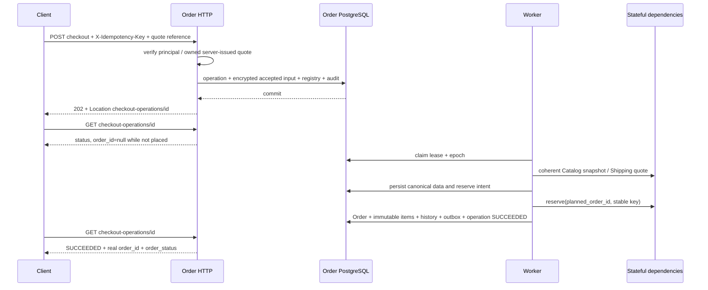
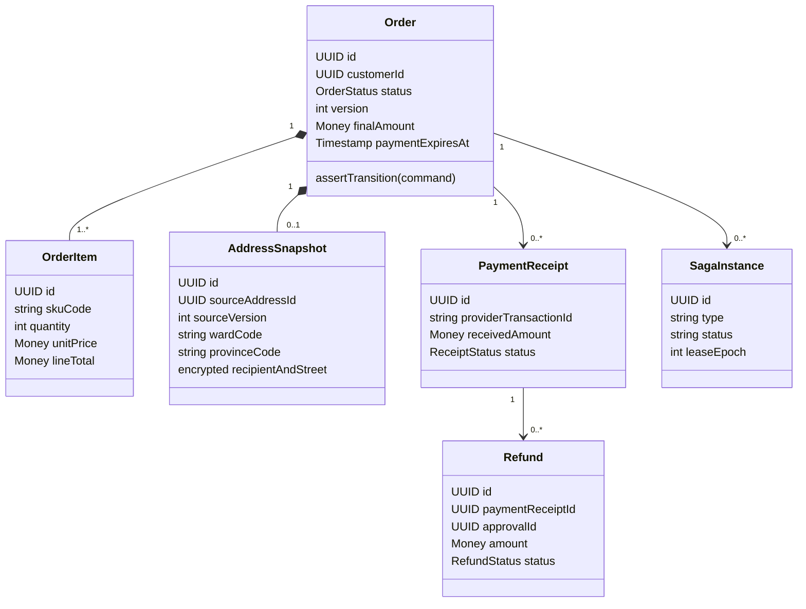
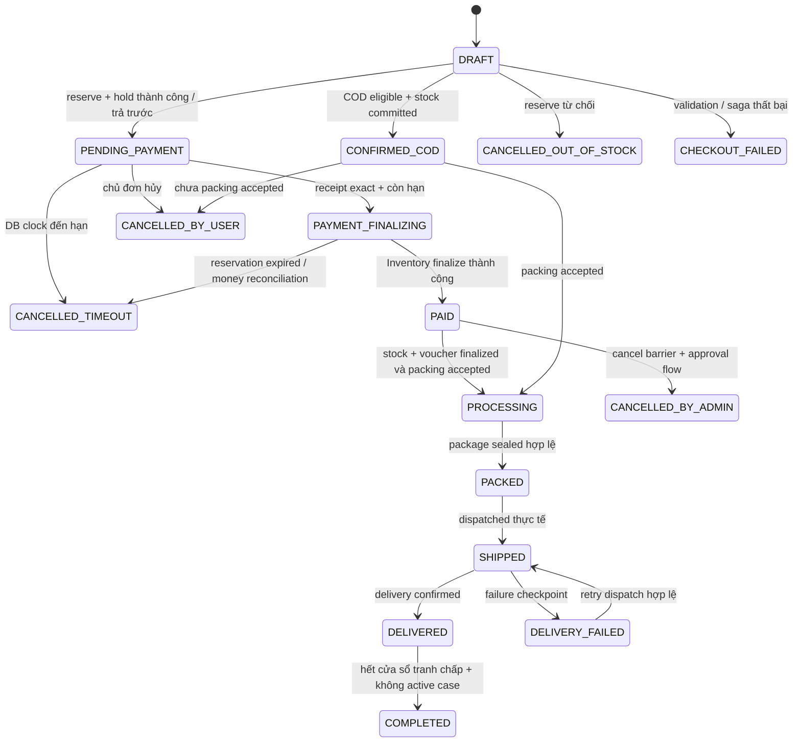
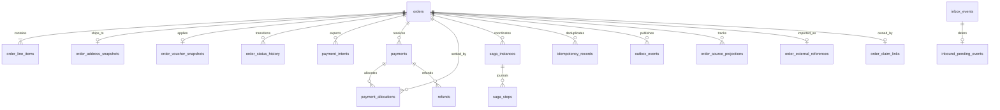
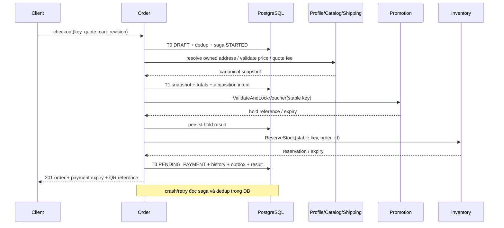

# MS-04 Order Service — thiết kế và implementation 3.1

[Chỉ mục](README.md) · [Code và cách chạy](../../../../services/order-service/README.md)

---

# MS-04 — implementation 3.1 và release gates

**09/10/2026.** Đây là nguồn mô tả code hiện tại, thay thế các đoạn candidate v3.0 còn ghi Order DRAFT tại acceptance, PAID trước voucher finalize hoặc checkout p95 là toàn bộ Saga. Backend chạy ở **sandbox**; dependencies có trạng thái và provider ledger độc lập. Production startup bị từ chối vì chưa có bộ adapter thật được kiểm chứng.

## 1. Tài nguyên và transaction



Operation UUID và planned Order UUID được sinh/lưu trước acquisition. Planned UUID chỉ là correlation nội bộ; `order_id` public NULL cho đến transaction tạo Order commit. Validation failure không để lại Order. Compensation UNKNOWN giữ obligation trong WAITING_RETRY/COMPENSATING/MANUAL_REVIEW.

Operation states: ACCEPTED, PROCESSING, WAITING_RETRY, COMPENSATING, SUCCEEDED, FAILED, MANUAL_REVIEW. Worker dùng lease 10 giây, epoch tăng; stale worker không thể ghi kết quả. External keys không thay đổi khi retry hoặc operator resume. HTTP request không chờ canonical calls/Saga.

## 2. Idempotency, quote và Cart

| Điều kiện | POST replay |
| --- | --- |
| Key mới, acceptance hợp lệ | 202 + operation mới |
| Cùng scope/key/hash, chưa terminal | 202 + operation cũ |
| Cùng scope/key/hash, SUCCEEDED | 201 + kết quả/Order cũ |
| Cùng key, hash khác | 409 IDEMPOTENCY_CONFLICT |
| Cùng key/hash, FAILED | HTTP error đã lưu + operation FAILED |
| Terminal response hết 7 ngày | 410 IDEMPOTENCY_RESPONSE_EXPIRED + operation reference |
| Chưa terminal dù response hết hạn | 202, không tạo effect mới |

Registry có minimum tombstone 30 ngày nhưng **không tự xóa/reuse key**. Code chưa tự compact dữ liệu PII vì policy retention riêng chưa chốt; operation status tối thiểu và nghĩa vụ đang chạy phải giữ bền vững.

Cart là Redis session có revision và TTL 30 ngày; item ID là SKU ổn định do server trả. Quote preview trong Redis được mã hóa AEAD, có scope/principal và TTL 5 phút. Handler xác minh quote server, ownership, method/revision và expiry theo DB acceptance time. Browser không quyết định giá/tổng tiền.

Accepted input/quote lưu encrypted trong PostgreSQL. Sau commit, mất Redis không mất dữ liệu resume. Worker bỏ qua preview expiry đã qua nhưng revalidate thương mại; giá/phí đổi trả PRICE_CHANGED thay vì tự thu tổng mới. Catalog simulator dùng repeatable-read batch và lưu canonical snapshot có ID/validity; Shipping trả quote reference/expiry. Payment expiry lấy min Inventory, Catalog, Shipping và commercial confirmation 15 phút.

Saved address adapter có hai chế độ: simulator, hoặc HTTP Profile hiện có với `PROFILE_URL` và credential `PROFILE_INTERNAL_TOKEN` riêng. Profile lookup kiểm user/customer/address/version. Default stack dùng simulator; không công bố đã chạy integration với Profile thật. Phone đầu vào Guest được chuẩn hóa về E.164; administrative fixture `75/HUE-01` là dữ liệu synthetic.

## 3. Financial truth và fulfillment

Provider ledger nằm trong database `order_simulator`, độc lập với Order DB `order_runtime`. Payment/refund SUCCEEDED là sự thật ledger, không phụ thuộc callback/HTTP ACK. Statement có commit-ordered cursor; cursor Order chỉ advance sau khi từng receipt có durable local outcome. Vì vậy callback mất ở đơn đã hủy hoặc reference unmatched vẫn được ghi nhận.

Receipt unique(provider, transaction ID); duplicate khác normalized hash gây conflict/audit. Chỉ exact VND/receiver/reference/policy mới allocate. Thiếu/thừa/nhiều khoản/late/unmatched vào reconciliation. Refund giữ budget trước RPC; UNKNOWN vẫn chiếm nghĩa vụ, query trước submit, stable provider key chống hoàn tiền lặp.

```text
PAID ⇒ provider receipt SUCCEEDED đã xác minh
     ∧ allocation đủ final
     ∧ stock COMMITTED
     ∧ voucher finalized nếu tính năng đó được bật
```

Voucher hiện bị từ chối bằng VOUCHER_FEATURE_DISABLED. Paid mutation, history và paid outbox cùng transaction. Fulfillment-ready là event/authorization riêng; COD CONFIRMED_COD vẫn UNPAID. Source simulator kiểm current Order eligibility/generation khi nhận task, nên cached ready không bỏ qua hold.

Cancel worker lấy terminal accept/cancel barrier trước release/reversal; COMMITTED không dùng active reservation release. COD đã settled yêu cầu cancellation review. Paid cancellation không tự refund; Care approval cho refund là nghĩa vụ độc lập. Refund approval đặt hold, không tự restock hoặc quay PROCESSING.

Shipping CREATED chỉ cập nhật reference; DISPATCHED mới SHIPPED. Source messages dùng HMAC trên normalized event (signature field rỗng khi tính MAC), secret sandbox và source/resource query độc lập; message thiếu/sai signature bị từ chối hoặc quarantine trước commit offset. Đây là contract simulator, chưa thay thế authentication của adapter thật. Inbox + source version + association guards chống duplicate/stale và giữ DEFERRED khi thiếu prerequisite. Completion cần Care barrier, hết cửa sổ 7 ngày, payment phù hợp và không có refund obligation chưa terminal. Care simulator serialize case-open/completion decision; post-completion return policy cần feature riêng.

## 4. Contract và code

- [REST contract](../../../03_api_specs/order-service.openapi.yaml).
- [Dependency simulator contract](../../../03_api_specs/order-sandbox-dependencies.openapi.yaml).
- [Service README](../../../../services/order-service/README.md).
- Order gRPC đăng ký thật: GetOrderDetail, CancelOrder, GetCheckoutOperation; requesting_user_id không thay thế bearer identity. CreatePOSOrder trả FEATURE_DISABLED.
- Inventory simulator đăng ký RPC reserve/release/query/finalize/reversal cùng ledger HTTP; FEFO/batch RPC trả Unimplemented rõ ràng.
- Event v2 schemas ở `packages/events/schemas/order/v2`, không sửa breaking v1. Payload fact chỉ references/version/state, không Direct PII.
- Code: domain thuần; app chứa orchestration/transactional persistence và external clients; transport HTTP/gRPC; simulator độc lập; migrations forward có version lock. Go-generated files được kiểm drift trong CI.

HTTP sandbox: 18004; Order gRPC: 19004; simulator HTTP: 18104; Inventory gRPC: 19104; PostgreSQL: 15434; Redis: 16384; Kafka: 19094. Host ports chỉ bind 127.0.0.1.

## 5. Evidence và priority

[Gate matrix và kết quả](../../../04_testing/order-service/03_implementation_verification.md) ghi tests theo v1.0/v1.1/v1.2 và evidence thực tế. Race suite dùng schema riêng cho mỗi harness, Redis DB1 và Kafka thật; không sửa Profile DB hoặc dữ liệu sandbox API DB0.

P0: ownership, money/stock invariants, durable recovery và chống trùng. P1: contracts, API/release behavior, regression/evidence. P2: dataset lớn, scale/HA, PITR/full restore, tracing exporter và tối ưu. Các tests chưa chạy ghi NOT_RUN; adapters thật ghi BLOCKED_BY_CONTRACT. Không diễn giải simulator PASS thành production-ready.

Acceptance histogram đo từ đầu HTTP middleware đến khi response đã được ghi, gồm auth và durable commit. Completion đo acceptance → operation terminal an toàn; payment finalization đo receipt → PAID. HTTP deadline 3s, outbound RPC/HTTP attempt 2s là fault limits. Backlog gauges dùng timestamp gốc, không reset tuổi nghĩa vụ mỗi retry. Availability 99.9% và SLO dưới tải production chưa được chứng minh.

Audit local append-only + HMAC chain kiểm sự thay đổi nội dung/mất mắt xích. External anchoring/MS-18 cần thêm để chứng minh xóa phần đuôi bởi privileged actor; không coi local hash chain là bằng chứng đầy đủ cho mọi kiểu tampering.


---

> **Implementation 3.1 — 09/10/2026:** [08_implementation_and_acceptance.md](08_implementation_and_acceptance.md) là nguồn hành vi hiện tại. Acceptance tạo checkout operation, chưa tạo Order; PAID và outbox chờ terminal stock/voucher outcome. Các đoạn v3.0 khác mô tả candidate cần đọc cùng cập nhật này.

# 01 — Domain model và ranh giới Order Service

[Chỉ mục](README.md) · [Tiếp: State machine](02_state_machine_and_lifecycle.md)

## 1. Ranh giới chức năng và quyền sở hữu

MS-04 thuộc BC-04 Commerce & Order Orchestration. EPIC là ranh giới nghiệp vụ, không nhất thiết mỗi Epic là một process. Cart, Checkout, Order và Payment component có use case riêng dù dùng chung database trong lựa chọn v3.0.

| Thành phần | Sở hữu | Không thực hiện |
| --- | --- | --- |
| Cart | Danh sách SKU/quantity, revision, phiên Guest/Customer | Giữ kho khi thêm vào giỏ; coi giá cache là giá thanh toán |
| Checkout | Quote, kiểm tra địa chỉ/giá/phí, chốt snapshot, saga giữ tài nguyên | Tin tổng tiền của browser; tự tuyên bố thanh toán thành công |
| Order | Order status, owner, snapshot, timeline, SLA, quyền thao tác | Ghi trực tiếp DB của service khác |
| Payment component | Intent, provider receipt, allocation, reconciliation, refund execution | Tự phê duyệt refund; coi trang redirect/ảnh QR là bằng chứng tiền đã thu |
| Saga orchestrator | Intent, command key, kết quả bước, retry, compensation | Dùng memory/Redis làm nhật ký duy nhất; gọi mạng khi giữ SQL transaction |
| MS-01 Inventory | Availability, reservation, FEFO, stock commit/release | Cho Order sửa số lượng hoặc tự chọn Batch |
| MS-07 Promotion | Voucher budget/hold/consume/release, loyalty ledger | Cho Order tự cộng điểm hoặc tự làm tròn voucher khác kết quả chuẩn |
| MS-15 Profile / Identity | Profile/address book; subject và xác thực | Sửa hồi tố order snapshot khi khách đổi địa chỉ |
| MS-02 / MS-12 | Packing task/package/video; shipment/checkpoint | Cho generic admin PATCH tự đánh dấu PACKED/DELIVERED |
| MS-06 Care / MS-09 Finance | Case/decision; accounting và settlement | Đồng nhất Case APPROVED, hàng RETURNED và tiền REFUNDED |

D2C HTTP dự kiến dùng port 8004. gRPC dùng listener riêng dự kiến 9004; số này là đề xuất cấu hình, không suy ra service đã mở cổng. Hai listener không bind cùng địa chỉ/port trừ khi có cơ chế multiplex được kiểm chứng.

## 2. Aggregate, entity và value object



Order giữ snapshot và invariant thương mại. PaymentReceipt/Refund là aggregate tài chính liên kết Order, có locking riêng nhưng transaction áp dụng receipt vào Order phải khóa cùng Order. Không load tất cả lịch sử payment vào mỗi lần xem queue. Saga là process manager bền vững, không phải Order status.

| Thuật ngữ | Nghĩa chính xác |
| --- | --- |
| `order_id` | UUID sinh tại ứng dụng trước khi tạo intent hoặc gọi giữ tài nguyên |
| `order_code` | Mã cho khách đọc; unique, không dùng làm proof sở hữu |
| `customer_id` | ID hồ sơ của Profile; `NULL` cho Guest, khác JWT `sub` |
| `shipping_address_id` trên event | ID snapshot trong Order DB; không phải ID địa chỉ đang sống trong Profile |
| `reservation_id`, `voucher_lock_id` | Reference tài nguyên do service chủ quản trả về |
| `payment receipt` | Một khoản tiền thực nhận/đã xác minh; không phải một lần quét QR |
| `allocation` | Phần receipt được phân bổ vào nghĩa vụ thanh toán Order |
| `operational_hold` | Chặn tiến trình nghiệp vụ khi cần đối soát; không xóa sự thật tài chính |

## 3. Snapshot và tiền

OrderItem lưu `sku_code`, tên, quy cách, khối lượng, quantity, đơn giá và thành tiền đã kiểm tra; shipping quote lưu carrier/service, phí gốc, quote reference/expiry. VoucherSnapshot lưu loại, số tiền áp dụng, policy version và hold ID. Chỉ một voucher MVP; stacking/loyalty dùng để trả tiền cần chính sách và contract riêng.

AddressSnapshot lưu recipient/phone/street, tỉnh/phường code/name, optional cặp tọa độ, nguồn và version. Saved address lấy bằng `GetDeliveryAddress(address_id, customer_id)`; address ID rỗng lấy default. Response phải đúng customer. Dữ liệu hai cấp theo Profile contract; `common.Address.district` rỗng. Không dùng dữ liệu default thay đổi về sau để sửa snapshot.

Guest nhập địa chỉ trực tiếp, dùng cùng validation địa giới và recipient. MVP một địa chỉ/đơn. Sau khi đặt không sửa snapshot bằng update chung; thay địa chỉ cần command chuyên biệt, kiểm tra phí và fulfillment chưa bắt đầu, ghi revision/audit. Command này chưa thuộc MVP v3.0.

Money dùng số nguyên VND, `int64/BIGINT`; protobuf `currency_code=VND`, `units=amount`, `nanos=0`. JSON phải giới hạn giá trị trong miền số nguyên an toàn của client; đề xuất `0..1_000_000_000_000` VND cho từng amount. Kiểm tra overflow khi nhân/cộng trước khi ghi SQL.

```text
subtotal = Σ(quantity × canonical_unit_price)
0 ≤ merchandise_discount ≤ subtotal
0 ≤ shipping_discount ≤ shipping_fee
final = subtotal - merchandise_discount + shipping_fee - shipping_discount
0 ≤ allocated_paid ≤ final
refundable(receipt) = received - Σ(refund SUCCEEDED) - Σ(refund đang giữ nghĩa vụ)
```

Free shipping trừ vào shipping component, không ép vào merchandise discount. Vì vậy luật cũ `final >= shipping_fee` được bỏ. Ví dụ hàng 220.000, giảm hàng 20.000, ship 25.000, miễn ship 25.000 → final 200.000. Với `FREE_SHIPPING`, proto Promotion chưa nhận phí ship/cap để tính đúng: phải bổ sung contract, không tự đoán từ `discount_amount`.

Đơn final=0 dùng quy trình zero-payment riêng, không tạo receipt ngân hàng giả. Chưa hỗ trợ MVP; trả `422 ZERO_AMOUNT_ORDER_UNSUPPORTED`. Giá sản phẩm được coi đã bao gồm thuế trong MVP; không tự thêm VAT. B2B cần snapshot tax/credit terms riêng.

## 4. Bất biến có thể kiểm chứng

1. Ít nhất một line; quantity > 0; gộp SKU trùng trước quote; thiếu bất kỳ SKU thì thất bại toàn bộ checkout, không tự tách đơn.
2. Chỉ tạo `PENDING_PAYMENT` sau Inventory reserve và voucher hold hợp lệ; expiry theo hạn tài nguyên thực tế.
3. Tài nguyên có key ổn định và intent bền vững trước RPC; mất phản hồi là kết quả UNKNOWN, không phải FAILED.
4. Receipt đã xác minh tồn tại độc lập với Order status; tiền vào đơn đã hủy vẫn phải lưu và đối soát.
5. Trả trước chỉ cho fulfillment khi tiền đã allocated đủ final và stock đã COMMITTED; COD được phép chưa trả tiền nhưng phải có COD eligibility và stock commit.
6. Một provider receipt chỉ ghi nhận một lần. Refund phải có approval hợp lệ, không vượt refundable; retry không tạo nghĩa vụ mới.
7. Owner chỉ đổi từ Guest sang Customer bằng verified claim; không ghi đè owner khác và không đổi snapshot.
8. Mọi mutation quan trọng có history/audit intent và outbox cùng commit. Consumer business effect + inbox commit cùng nhau.
9. Order cancelled không tự trở lại PAID/PROCESSING; refund lỗi không tự đưa order quay lại sản xuất.
10. Admin thao tác qua command có guard và quyền; không chỉnh trạng thái tùy ý.

## 5. Mô hình kho nhìn từ Order

Order lưu reference và projection `NONE/RESERVED/COMMITTING/COMMITTED/RELEASING/RELEASED/EXPIRED/UNKNOWN`; không sở hữu stock ledger. Inventory contract hiện nói `available = physical - reserved`. Không đưa thêm `committed` vào công thức này nếu chưa đổi định nghĩa `physical`.

Thiết kế finalize yêu cầu Inventory chuyển reservation atomically từ ACTIVE → COMMITTED hoặc RELEASED/EXPIRED. Commit tiêu thụ reservation đúng một lần; quantity available không bị trừ lần hai. Ví dụ physical=100/reserved=0/available=100; reserve 2 → 100/2/98; nếu commit được định nghĩa là trừ physical → 98/0/98. Nếu Inventory chọn giữ committed trên kệ đến dispatch thì phải dùng ledger khác và công bố công thức mới. Order chỉ dựa vào kết quả terminal của reservation.

## 6. Quyền riêng tư và scope

Không đưa recipient, phone, street, tọa độ, gift_message hoặc ghi chú tự do vào event fan-out. Identifier vẫn cần ACL/retention; không coi UUID là dữ liệu công khai. Shipping/Packing đọc snapshot qua API nội bộ có service identity và purpose hợp lệ. Customer xem đủ dữ liệu của mình; queue chỉ hiển thị dữ liệu tối thiểu, CSKH có masking theo quyền.

PII snapshot mã hóa tại tầng lưu trữ với key ID/version, TLS khi truyền; không log raw webhook, token/proof hay thông tin nhận hàng. Retention và xóa/ẩn danh cần policy được chủ dữ liệu phê duyệt, không tự đặt thời gian pháp lý. Ledger/audit chỉ dùng reference khi đủ; không cascade delete order vì xóa profile.


---

> **Implementation 3.1 — 09/10/2026:** [08_implementation_and_acceptance.md](08_implementation_and_acceptance.md) là nguồn hành vi hiện tại. Acceptance tạo checkout operation, chưa tạo Order; PAID và outbox chờ terminal stock/voucher outcome. Các đoạn v3.0 khác mô tả candidate cần đọc cùng cập nhật này.

# 02 — State machine, lifecycle và cạnh tranh

[Chỉ mục](README.md) · [Trước: Domain](01_order_domain_and_boundary.md) · [Tiếp: Persistence](03_database_and_persistence.md)

## 1. Bốn trục trạng thái

| Trục | Giá trị thiết kế | Nguồn chuẩn |
| --- | --- | --- |
| Order | DRAFT, PENDING_PAYMENT, PAYMENT_FINALIZING, PAID, CONFIRMED_COD, PROCESSING, PACKED, SHIPPED, DELIVERED, DELIVERY_FAILED, COMPLETED, CANCELLED_TIMEOUT, CANCELLED_BY_USER, CANCELLED_BY_ADMIN, CANCELLED_OUT_OF_STOCK, CHECKOUT_FAILED | Order aggregate |
| Payment summary | UNPAID, PENDING, CONFIRMED, RECONCILIATION_REQUIRED, PARTIALLY_REFUNDED, REFUNDED | Receipt/allocation/refund ledger |
| Stock projection | NONE, RESERVED, COMMITTING, COMMITTED, RELEASING, RELEASED, EXPIRED, UNKNOWN | Inventory acknowledgement |
| Return / Refund | Case trạng thái theo Care; refund REQUESTED, APPROVED, SUBMITTED, SUCCEEDED, FAILED, UNKNOWN | Care decision; Payment execution |

`PAYMENT_FINALIZING`, `CONFIRMED_COD`, `DELIVERY_FAILED`, `CANCELLED_BY_ADMIN`, `CHECKOUT_FAILED` chưa nằm trong order.proto: **candidate additions**, không trả chúng qua enum v1 trước khi cập nhật hợp đồng. `RETURN_REQUESTED/REFUNDED` có trong proto cũ nhưng v3.0 dùng projection tương thích nếu cần, không dùng để thay thế Case và financial status. `REFUND_PENDING` trong LLD cũ chưa có trong proto, không tiếp tục trình bày là trạng thái wire hiện có.

## 2. Luồng trả trước và COD



Order timeline và payment summary hiển thị riêng. Với COD: `PROCESSING` + `UNPAID` hợp lệ, `DELIVERED` không tự bằng `CONFIRMED`. Tiền COD chỉ xác nhận từ bằng chứng thu/đối soát được Payment chấp nhận. Một COD receipt đến lúc order SHIPPED/DELIVERED cập nhật payment summary, không kéo Order về PAID.

## 3. Transition matrix

| From → To | Command/source | Guard bắt buộc | Ghi cùng transaction |
| --- | --- | --- | --- |
| DRAFT → PENDING_PAYMENT | Checkout saga | tất cả SKU/address/quote valid; reserve và hold còn hạn | snapshot, expiry, references, history, OrderPlaced outbox, idempotency result |
| DRAFT → CONFIRMED_COD | Checkout COD | eligibility đúng policy; inventory COMMITTED; voucher finalized | phương thức COD, UNPAID summary, history, fulfillment-ready outbox |
| DRAFT → CHECKOUT_FAILED / CANCELLED_OUT_OF_STOCK | saga reject | lý do xác định, hoặc compensation đang được theo dõi | failure reason, release intent cho mọi bước có khả năng thành công |
| PENDING_PAYMENT → PAYMENT_FINALIZING | verified receipt | exact VND, đúng receiver/reference, DB now < expiry; chưa cancel | receipt + allocation, payment summary CONFIRMED, finalize saga intent |
| PAYMENT_FINALIZING → PAID | Inventory ack | reservation COMMITTED đúng order/items, tiền đủ | stock projection, history, OrderPaid outbox; fulfillment-ready khi voucher finalized |
| PENDING_PAYMENT → CANCELLED_TIMEOUT | sweeper | DB now ≥ expiry, payment chưa confirmed | history, cancel outbox, release saga intent |
| PENDING_PAYMENT → CANCELLED_BY_USER | owner command | ownership, expected version, chưa receipt allocated | history, cancel outbox, release saga intent |
| CONFIRMED_COD → CANCELLED_BY_USER | owner command | chưa packing accepted; cancel barrier xác nhận | cancel history, decommit intent, không refund nếu chưa nhận tiền |
| PAID → CANCELLED_BY_ADMIN | manager command | packing cancel barrier thành công; nghĩa vụ refund được mở | cancelled history, reversal/refund request references; không gán REFUNDED |
| PAID / CONFIRMED_COD → PROCESSING | Fulfillment accepted | đúng task/order; stock committed; ready authorization còn hiệu lực | task reference, state/history, SLA deadline, outbox |
| PROCESSING → PACKED | Fulfillment sealed | đúng task, seal/video reference và actor đã được nguồn xác thực | package projection, history, outbox |
| PACKED → SHIPPED | Shipping dispatched | đúng shipment/order; đã thực tế bàn giao | shipment reference, checkpoint version, history |
| SHIPPED → DELIVERED / DELIVERY_FAILED | Shipping result | đúng shipment, sequence mới; event hợp lệ | delivery projection, history; tranh chấp deadline nếu delivered |
| DELIVERY_FAILED → SHIPPED | retry shipping | source xác nhận attempt mới; order không cancelled | attempt/checkpoint/history |
| DELIVERED → COMPLETED | completion job | now ≥ deadline; không active case; COD đã đối soát hoặc policy công nợ cho phép | history, OrderCompleted outbox một lần |

Generic `PATCH status` không thuộc contract. Nhân viên có thể đặt hold, ghi reason hoặc khởi tạo cancellation review; không tự giả lập provider receipt, packing hay delivery.

## 4. Payment vs timeout: local và remote đều phải an toàn

CAS trên Order giải quyết local race nhưng không giải quyết Inventory TTL worker. Hai lớp bắt buộc:

1. Receipt handler và sweeper khóa cùng hàng Order. Chỉ khi state=PENDING_PAYMENT và `clock_timestamp() < payment_expires_at` mới tạo allocation/đổi PAYMENT_FINALIZING. Sweeper chỉ hủy PENDING_PAYMENT với `clock_timestamp() >= payment_expires_at`. Xác định thời điểm quyết định **sau khi lấy row lock**, không dùng timestamp cố định từ đầu transaction lâu trước đó.
2. Inventory xử lý FinalizeReservation và TTL expiration bằng cùng atomic guard ACTIVE/còn hạn. Chỉ một terminal outcome thắng. `PAID`/ready chỉ sau COMMITTED acknowledgement, không khi mới publish Kafka.

```text
BEGIN
  SELECT order FOR UPDATE
  decision_at = DB clock sau lock
  INSERT verified receipt ON CONFLICT(provider, transaction_id) DO NOTHING
  nếu exact + state/expiry cho phép:
    INSERT allocation; UPDATE order -> PAYMENT_FINALIZING, version+1
    INSERT FINALIZE saga intent; INSERT history/outbox cần thiết
  nếu late/mismatch/cancelled:
    lưu RECONCILIATION_REQUIRED, không allocate, tạo case intent
COMMIT
RPC finalize chạy sau commit; retry cùng key khi mất phản hồi
```

| Trường hợp | Kết quả |
| --- | --- |
| Payment vào local finalizing trước expiry; kho còn active | Finalize kho thắng → PAID; timeout không release |
| Local timeout thắng | Order cancelled; tiền đến vẫn lưu receipt/reconciliation; không phục hồi đơn |
| Order finalizing nhưng kho đã expire trước finalize | Không ready; Order CANCELLED_TIMEOUT, receipt cần đối soát/refund approval |
| Finalize kho thành công, ack bị mất | Query/retry cùng key; không release dựa vào lỗi timeout |
| Callback provider timestamp trước expiry nhưng nhận sau expiry | MVP dùng DB decision time; lưu provider time làm bằng chứng; không hồi sinh đơn |
| Client hủy gặp PAYMENT_FINALIZING | 409 PAYMENT_FINALIZING; manager xử lý sau terminal inventory outcome |

Chính sách nhận trễ là lựa chọn thận trọng để không bán lại stock đã được giải phóng. Nếu muốn grace period cần hold protocol được Inventory chấp nhận, không chỉ sửa một điều kiện SQL.

## 5. Saga state, lease và compensation

Saga `STARTED → IN_PROGRESS → COMPLETED`; lỗi xác định chuyển `COMPENSATING → COMPENSATED`. RPC không rõ kết quả chuyển `WAITING_RETRY`, giữ intent và key; hết ngân sách tự động chuyển `MANUAL_REVIEW`, vẫn là nghĩa vụ chưa hoàn tất.

Worker nhận lease có `lease_epoch` tăng. Bước có `PENDING/SENT/UNKNOWN/SUCCEEDED/REJECTED/COMPENSATED`, command key và response reference. Worker cũ chỉ cập nhật khi epoch còn khớp; hết lease không có quyền rollback kết quả worker mới. Remote key vẫn bắt buộc vì epoch local không chặn remote RPC cũ.

Compensation ngược thứ tự acquisition, theo tài nguyên **có thể đã được giữ**. Release lặp không cộng tồn/voucher lần hai. Reservation COMMITTED cần reversal/decommit được phê duyệt, không gọi ReleaseReservation vốn dành ACTIVE. TTL là lưới an toàn trong service chủ quản, Order điều phối nghiệp vụ và reconciliation; không có hai worker cùng tự suy đoán ledger.

## 6. Return, refund và completion

Care giữ active case theo order/line/quantity. Completion job và consumer mở Case phải phối hợp bằng Order row lock cùng cờ `has_active_case`. Vì Care và Order khác DB, completion chỉ chứng minh cờ projection đã biết: cần barrier/query Care xác nhận case eligibility/version và grace watermark trước completion. Nếu thiếu contract này, tắt auto-completion; không giả định Kafka không lag.

Một case sau COMPLETED không tự bị cấm: policy return có thể cho phép; mở hold và adjustment nghiệp vụ theo quyết định Care. Loyalty thuộc Promotion, không cộng cứng 1% trong Order. Partial refund giữ Order lifecycle và payment PARTIALLY_REFUNDED; full refund không đồng nghĩa hàng đã về kho hay order bị hủy. Refund failed/unknown giữ nghĩa vụ và retry/query, không quay PROCESSING. Cửa sổ 7 ngày là default đề xuất, chưa phải SLA pháp lý.


---

> **Implementation 3.1 — 09/10/2026:** [08_implementation_and_acceptance.md](08_implementation_and_acceptance.md) là nguồn hành vi hiện tại. Acceptance tạo checkout operation, chưa tạo Order; PAID và outbox chờ terminal stock/voucher outcome. Các đoạn v3.0 khác mô tả candidate cần đọc cùng cập nhật này.

# 03 — Database, transaction và persistence

[Chỉ mục](README.md) · [Trước: State machine](02_state_machine_and_lifecycle.md) · [Tiếp: Use cases](04_usecases_and_saga_orchestration.md)

## 1. Nguồn dữ liệu và ERD

PostgreSQL `order_db` giữ order/snapshot, financial ledger, idempotency, saga, inbox/outbox. Redis giữ cart và read cache có thể khôi phục hoặc mất theo chính sách phiên; không lưu nguồn duy nhất của nghĩa vụ. DDL tại [order_schema_candidate.sql](order_schema_candidate.sql) là schema **candidate cho database rỗng**, cần migration/versioning/review khi triển khai. Không được chạy đè database thật hoặc coi là migration đã áp dụng.



Order có 1..N items sau khi checkout chốt; DRAFT chưa validate có thể chưa có item. Cross-table invariant về số line và tổng tiền không được bảo đảm chỉ bằng `CHECK` của bảng orders: application transaction phải kiểm tra từ snapshot canonical; có thể bổ sung deferred constraint trigger khi triển khai.

## 2. Bảng và ràng buộc

| Bảng | Trường/constraint chính | Lý do |
| --- | --- | --- |
| orders | UUID, code unique, nullable customer, channel/method/status, totals, expiry, resource IDs, version, SLA, hold/case projection | Domain và truy vấn queue không phụ thuộc join mạng |
| order_line_items | unique(order,sku), quantity > 0, unit/line total BIGINT, canonical metadata | Không trùng line; bảo toàn thương mại |
| order_address_snapshots | unique(order), source address/version, encrypted PII, ward/province | Reference Profile và snapshot độc lập |
| order_voucher_snapshots | unique(order), code/type/policy, hold ID, merchandise/shipping split | Không gộp free ship vào giảm hàng |
| order_status_history | unique(order,version), from/to, actor/source/reason, time | Một transition có một timeline entry |
| payment_intents | unique operation/transfer reference, receiver, expected amount/expiry | QR/payment instruction không được lấy từ browser |
| payments | unique(provider,provider_transaction_id), optional order, verified amount, immutable receipt hash | Unmatched receipt vẫn phải ghi nhận |
| payment_allocations | unique(payment), amount > 0 | Không auto cộng tiền chưa được xác nhận/phê duyệt vào Order |
| refunds | payment ID, approval ID, unique operation key, amount > 0, status, provider ref | Chống retry hoàn tiền và vượt ngân sách receipt |
| saga_instances / saga_steps | unique(order,type,operation key), step key unique, lease epoch, run_after, attempts, reference, error code | Khôi phục qua restart; chống stale worker |
| idempotency_records | primary(scope,operation,key), request hash, order ID, IN_PROGRESS/SUCCEEDED/FAILED, result status | Durable dedup theo người gọi/hành động |
| outbox_events | stable event ID, aggregate type/ID/sequence, optional order ID, ordinal, topic/key/payload, retry/lease | At-least-once và ordering theo aggregate |
| inbox_events | primary(consumer,source,event ID), payload hash, APPLIED/DEFERRED/REJECTED | Dedup cả cùng ID bị giả mạo nội dung |
| inbound_pending_events | FK inbox, source version, order, retry deadline | Event đến sớm không bị bỏ mất |
| order_source_projections | primary(order,source,resource), source_version, non-PII projection | Dedup checkpoint/case/task theo business version dù event ID mới |
| order_external_references | primary(channel,store,external ID), order unique | Chống nhập lại đơn marketplace/POS |
| order_claim_links | order unique, customer, claim/version | Ownership immutable ngoại trừ verified claim |

UUID sinh ở application; không phụ thuộc extension UUID v7 của PostgreSQL 16. Không tạo cross-database FK tới Customer, SKU, address book, reservation. IDs đó được validation qua contract, lưu như reference. Không `ON DELETE CASCADE` financial/history; xóa/ẩn danh phải theo retention workflow.

## 3. Transaction boundary

| Local transaction | Nội dung atomic | Ngoài transaction |
| --- | --- | --- |
| T0: nhận checkout | dedup insert + DRAFT + saga STARTED, input hash/reference | validation query Catalog/Profile/Shipping |
| T1: trước acquisition | snapshot canonical + totals + saga step intent/key | voucher hold, stock reserve |
| T2: nhận acquisition | resource reference + từng step outcome | query/retry remote nếu UNKNOWN |
| T3: checkout thành công | PENDING_PAYMENT/CONFIRMED_COD + history/outbox + dedup result | publish Kafka; trả response có thể bị mất |
| T4: receipt | unique receipt + lock Order + allocation hoặc reconciliation + FINALIZE intent/history | finalize Inventory/Promotion |
| T5: finalize ack | stock projection + PAID + OrderPaid; ready event khi đủ điều kiện | Packing nhận ready authorization |
| T6: hủy/timeout | guarded status + history + cancel event + release saga intent | release/decommit remote |
| T7: consumer | inbox + mutation/history/outbox, hoặc DEFERRED + pending payload | commit Kafka offset sau DB commit |
| T8: refund budget | lock receipt, tính refundable, insert approved refund obligation | provider refund với operation key ổn định |
| T9: refund result | financial status + settlement ref + audit outbox | notify/accounting consumers |

T0 cho phép lưu DRAFT trước validation; DRAFT không phải đơn có quyền thanh toán hoặc fulfillment. Nếu validation fail, ghi CHECKOUT_FAILED và dedup result. Input chứa PII lưu encrypted/restricted snapshot; saga payload chỉ chứa reference, không sao chép raw body.

## 4. Khóa và CAS

Các handler thay đổi cùng Order dùng row lock hoặc CAS với version. Thứ tự khóa thống nhất: Order → PaymentReceipt (ID tăng dần khi nhiều receipt) → Refund/Saga. Unmatched receipt chỉ khóa receipt. Không lấy lock receipt rồi quay lại Order để tránh deadlock.

```sql
BEGIN;
SELECT id, status, version, payment_expires_at
FROM orders WHERE id = $1 FOR UPDATE;
-- application xác định decision_at bằng SELECT clock_timestamp() sau lock
UPDATE orders
SET status = $3, version = version + 1, updated_at = clock_timestamp()
WHERE id = $1 AND status = $4 AND version = $2
RETURNING version;
-- nếu 0 rows: re-read, kiểm tra quyền và trả conflict/no-op theo intent
-- nếu thành công: INSERT history + outbox + saga intent trước COMMIT
COMMIT;
```

Isolation `READ COMMITTED` với khóa hàng thích hợp đủ cho các invariant cục bộ trên một Order; tổng refundable phải khóa receipt rồi cộng succeeded + approved/submitted/unknown obligations. Các bước có nhiều aggregate cần kiểm tra kỹ và retry deadlock/serialization theo bounded policy. PostgreSQL đánh giá lại điều kiện UPDATE sau khi chờ cập nhật cạnh tranh; thiết kế vẫn phải kiểm tra rows affected. [PostgreSQL 16 transaction isolation](https://www.postgresql.org/docs/16/transaction-iso.html).

`version` bắt đầu 1; mọi mutation có ý nghĩa tăng đúng một lần và history ghi phiên bản mới. Replay cùng command thành công không tăng version. Snapshot immutable sau chốt: application role không có UPDATE trực tiếp; dùng repository có guard/trigger và migration role riêng. DDL candidate chưa chứa trigger immutable nên đây là yêu cầu implementation cần kiểm chứng.

## 5. Idempotency durable

Scope = verified customer ID hoặc Guest session ID hoặc trusted service/store ID; operation = CHECKOUT/CANCEL/POS_IMPORT/REFUND. Key không phải bearer token và không dùng chung giữa khách. Hash SHA-256 của request canonical gồm cart revision, line quantities/prices mong đợi, address source/version, carrier/method/voucher; loại transport timestamp/trace ID. Key trùng + hash khác → 409 IDEMPOTENCY_CONFLICT.

`INSERT ... ON CONFLICT DO NOTHING` quyết định winner. Cùng hash và IN_PROGRESS trả `202` + status resource/Retry-After; cùng hash đã kết thúc replay HTTP status và order reference. Response dựng lại từ snapshot, không gọi lại query giá. Sau khi response retention hết hạn vẫn giữ key/hash/order tombstone đủ cho cửa sổ business retry; không xóa key khi saga đang chạy hoặc tiền/compensation chưa terminal. Đề xuất response retention 7 ngày, tombstone 30 ngày; imports và receipt/refund uniqueness giữ theo ledger retention. Công bố giới hạn retry cho client trước release.

## 6. Outbox và inbox

Outbox event ID giữ nguyên qua mọi lần gửi. `aggregate_version` và `event_ordinal` tạo thứ tự các event phát trong cùng một mutation. Publisher chỉ claim event nếu không còn event chưa publish có sequence nhỏ hơn của cùng aggregate, dùng lease + `FOR UPDATE SKIP LOCKED`; gửi cùng order partition key. Không gửi Kafka khi giữ SQL row lock lâu. Receipt unmatched dùng aggregate PAYMENT với order ID NULL; vì vậy vẫn có reconciliation/audit outbox cùng receipt commit. Broker ack rồi mới mark PUBLISHED; crash ở giữa gây duplicate, không đổi ID. Producer idempotence không làm Kafka và SQL thành một transaction.

Lease takeover có thể tạo duplicate/stale send ngay cả khi SQL selection đúng: consumer cần xử lý source version và state guards, không coi broker arrival order là business causality tuyệt đối. Kafka chỉ cung cấp ordering trong partition; external DB effect cần phối hợp và dedup riêng. [Apache Kafka design](https://kafka.apache.org/41/design/design/).

Inbox APPLIED được commit cùng effect; DEFERRED được commit cùng pending payload nếu thiếu prerequisite. Khi prerequisite có mặt, pending worker khóa inbox/order, apply và đổi APPLIED trong một transaction. Không insert APPLIED trước effect; không commit offset khi chưa có durable result. Poison event ghi REJECTED + durable DLQ outbox; DLQ ack/persistence thành công rồi mới advance offset. Replay dùng cùng event ID/source; cùng ID/hash khác báo integrity incident.

## 7. Index, queue và Redis

Index customer history `(customer_id, created_at DESC, id DESC)`; queue `(status, sla_due_at, id)` với active states; timeout partial `(payment_expires_at,id)` WHERE PENDING_PAYMENT; completion partial `(completion_due_at,id)` WHERE DELIVERED; outbox pending/run_after; saga run_after/lease expiry; payments provider uniqueness; marketplace uniqueness theo channel/store/id.

Keyset pagination dùng `(created_at,id)`; cursor chứa filter hash và scope đã ký. SLA queue sort overdue trước, `sla_due_at ASC`, `created_at ASC`, `id ASC`. Deadline lưu theo policy version và state entry time, không tính lại từ created_at cho tất cả công đoạn. Queue không chứa order thiếu ready authorization cho công đoạn.

Redis keys `cart:{scope}`, `quote:{scope}:{id}`, `order-read:{order_id}:{version}`. Cart mutate atomically với revision (Lua/WATCH), TTL 30 ngày; quote 5 phút, không reserve. Nếu Redis mất cart, báo phiên hết hạn, không tác động orders. Nếu cache fail, đọc DB; auth/state/refund/ownership không dựa vào cache. Không cache raw PII mặc định; profile authoritative read không có cam kết P99 5 ms.

## 8. Repository ports và vận hành dữ liệu

`UnitOfWork` truyền DBTX thật cho mọi repository trong transaction: Order, Payment, Saga, History, Outbox, Inbox, Dedup. Không mở transaction mới bên trong repository. External client interface trả `Succeeded/Rejected/Unknown`, không gom timeout vào rejection.

Migrations expand/backfill/validate trước constrain; rollback không xóa receipt hoặc nghĩa vụ chưa hoàn thành. DB role ứng dụng không được truncate history/ledger. Backup phải có PITR và restore drill; restore outbox/inbox cùng DB, sau restore reconcile provider/Inventory vì remote effect có thể mới hơn backup. Schema retention/partitioning chọn sau đo tải; không partition vội làm mất global receipt uniqueness.


---

> **Implementation 3.1 — 09/10/2026:** [08_implementation_and_acceptance.md](08_implementation_and_acceptance.md) là nguồn hành vi hiện tại. Acceptance tạo checkout operation, chưa tạo Order; PAID và outbox chờ terminal stock/voucher outcome. Các đoạn v3.0 khác mô tả candidate cần đọc cùng cập nhật này.

# 04 — Use cases và điều phối saga bền vững

[Chỉ mục](README.md) · [Trước: Persistence](03_database_and_persistence.md) · [Tiếp: Contracts](05_api_contracts_and_transports.md)

## 1. Cart và quote trước checkout

Cart dùng owner scope đáng tin: Customer resolved từ Identity/Profile, Guest dùng session opaque có TTL. Khi mutate, kiểm tra revision và tổng line/quantity; giới hạn đề xuất 100 SKU, quantity mỗi SKU 1..999, body 64 KiB. SKU/price cache phục vụ hiển thị, không reserve stock. Merge guest cart vào customer là phép gộp có key/revision, không chuyển quyền Orders Guest.

Quote đọc cart revision, validate canonical SKU metadata/price, địa chỉ owned/Guest và shipping. Price thay đổi trả `409 PRICE_CHANGED`, không âm thầm thu số tiền mới. Quote chứa line snapshot, address reference/version, carrier/service, totals, expiry, policy version và input hash; chỉ một địa chỉ, không reserve. Voucher preview dùng CalculateDiscount, chưa giữ budget. Checkout phải kiểm tra lại voucher bằng hold, nên quote là dự kiến, không cam kết tài nguyên.

Chọn `POST /api/v1/checkout` là command duy nhất vừa confirm quote vừa tạo order; không thêm `POST /orders` tạo đơn thứ hai. Có thể giữ alias gateway cho client cũ sau contract review, cùng use case và key scope; không mặc nhiên có hai luồng tạo độc lập.

## 2. Checkout trả trước



Trình tự chi tiết:

1. Validate auth/body/key; canonical request hash. T0 insert DRAFT và dedup trong một transaction. Nếu dedup conflict, rollback DRAFT mới rồi đọc record winner; không để lại draft rác từ request thua.
2. Saved address gọi Profile với đúng customer; không có resolver user→customer thì không fallback JWT sub. Guest address validate master data, giữ snapshot encrypted.
3. Catalog ValidatePriceAndSKU cung cấp subtotal; GetProductVariant cung cấp canonical name/weight/packaging. Contract hiện chưa trả full validated line snapshot/version: cần gap G03 để tránh metadata/price bị đổi giữa hai query. Shipping phụ thuộc address và weight; voucher phụ thuộc canonical subtotal. Chỉ parallel các query độc lập, không chạy voucher trước khi có subtotal.
4. Lưu snapshot, quote và acquisition intent trước RPC có side effect. Sinh `order_id` ngay T0; key mỗi bước `order:{id}:checkout:{operation}:voucher-hold` / `stock-reserve`, không sinh lại khi retry.
5. Có voucher thì hold trước, ghi ack rồi reserve tất cả SKU atomic. Reserve thất bại rõ ràng → release voucher. Không có voucher bỏ qua bước hold. Reserve timeout → UNKNOWN; query/retry cùng key để xác định, không tạo đơn khác.
6. `payment_expires_at=min(inventory_expiry, voucher_expiry nếu có, commercial_confirmation_expiry)`. Quote dùng để validation trước acquisition; lưu commercial confirmation expiry = thời điểm canonical snapshot T1 + 15 phút cho snapshot đã chốt. Đề xuất cần còn ít nhất 30 giây khi trả QR; nếu không, compensation và yêu cầu quote mới. Không gia hạn bằng reset local clock.
7. T3 ghi PENDING_PAYMENT, resource IDs, history, OrderPlaced candidate event, dedup SUCCEEDED/result 201. QR được tạo từ final/receiver/reference trong payment_intents đã lưu cùng transaction, không từ browser. Không có provider integration thì không tuyên bố tạo VietQR đã được xác minh.
8. Client mất response: retry key cũ đọc lại order. Deadline HTTP đến khi saga chưa terminal: trả 202 với order reference, không 504 làm khách hiểu thất bại chắc chắn. Nếu DB chưa durable nhận request thì trả 503; caller vẫn retry cùng key.

Nếu external call đã thành công nhưng T3 commit thất bại/không rõ, worker tìm T0/T1 và remote key để resume hoặc compensation. Không có nhánh “DB chưa ghi gì nhưng saga worker sẽ biết để nhả”: intent phải tồn tại trước đó.

## 3. COD checkout

COD eligibility kiểm tra channel, địa chỉ, carrier/service, giá trị, SKU, risk policy; không được thì 422 COD_NOT_AVAILABLE. Không cấp QR, không chờ webhook 15 phút. DRAFT giữ stock/hold rồi finalize stock và voucher bằng stable commands; thành công mới T3 CONFIRMED_COD, UNPAID, fulfillment-ready. Lease cho các bước COD là deadline điều phối ngắn, không phải khoảng 15 phút đợi khách trả tiền.

Mất finalize ack tiếp tục query/retry; nếu stock expired trước finalize thì checkout fail và compensate voucher. Kho COMMITTED nhưng DB response chưa thành công: worker tiếp tục T3 hoặc decommit bằng reversal có contract, không ReleaseReservation ACTIVE. COD không được bật trước khi gap finalize/reversal và fulfillment-ready đã đóng.

## 4. Webhook và quyết định payment

Webhook phải dùng adapter theo provider thực sự cung cấp thông báo giao dịch. VietQR là cách tạo mã chuyển khoản, không tự quy định webhook HMAC hay tính finality của ngân hàng. Adapter cần verify signature/raw bytes, receiver account, transaction ID, reference, timestamp/replay policy và receipt status. Không hard-code HMAC-SHA256 cho mọi ngân hàng nếu hợp đồng provider chưa nói vậy.

1. Verify trước khi ghi receipt; IP allowlist chỉ bổ sung, không thay chữ ký. Provider invalid trả 401/403 theo contract; DB unavailable trả 503 để provider retry.
2. Unique(provider,transaction ID) khóa chống trùng. Duplicate phải so normalized receipt hash/amount/account/reference; khác nội dung → security/reconciliation incident, không no-op im lặng.
3. Receipt không match order vẫn lưu `payments.order_id=NULL`, RECONCILIATION_REQUIRED. Không mất tiền nhận thực tế vì parse mã đơn lỗi.
4. Match Order: khóa row, xác định decision time; exact/đúng currency/receiver/reference và còn hạn → allocation + PAYMENT_FINALIZING + finalize intent. Accepted webhook chỉ có nghĩa đã lưu receipt, không có nghĩa Order đã PAID.
5. Worker finalize stock atomic với Inventory expiry; outcome COMMITTED → PAID/OrderPaid. Voucher finalize thành công thì phát fulfillment-ready; voucher failure/unknown giữ operational hold, không đóng gói. Failure definitive cần cancellation review/reversal và refund approval, không gọi release committed stock.

| Receipt | Allocation tự động MVP | Order/Payment kết quả |
| --- | --- | --- |
| Exact và còn hạn, stock finalize thành công | final toàn bộ | PAID + CONFIRMED |
| Thiếu tiền | không | Order giữ PENDING_PAYMENT; receipt RECONCILIATION_REQUIRED |
| Thừa tiền | không | Order giữ PENDING_PAYMENT; receipt RECONCILIATION_REQUIRED |
| Tiền vào sau cancel/expiry | không | Order giữ cancelled; mở đối soát và refund review |
| Nhiều receipt nhỏ cộng đủ | không tự cộng | đối soát có phê duyệt; chưa hỗ trợ auto split payment |
| Duplicate cùng normalized payload | không tạo allocation thứ hai | replay ACK |
| Exact nhưng reservation expired | giữ sự thật receipt, không fulfillment | cancelled/hold + reconciliation |

Receipt dư/mismatch đến khi Order đã PAID hoặc đang fulfillment tạo reconciliation case riêng; không hạ payment summary CONFIRMED của allocation hợp lệ, không phát OrderPaid lần hai. Trạng thái RECONCILIATION_REQUIRED của receipt riêng không xóa sự thật payment của Order.

Luật exact-match được áp dụng nhất quán: chuyển thừa **không** tự PAID. Nếu muốn phân bổ final và hoàn phần thừa phải có policy mới, refund approval và allocation ledger; không gửi khách “chuyển nốt” khi chưa hỗ trợ tổng hợp receipt.

## 5. Timeout, tự hủy và paid cancellation

Timeout worker lấy candidate PENDING_PAYMENT theo index; lock từng Order rồi kiểm tra DB clock và guard như chương 02. Transaction hủy tạo release saga intent và cancellation fact. Worker sau commit release stock/hold; cancellation response có `compensation_status=PENDING`, không tuyên bố kho đã nhả ngay.

Self-cancel trả trước chỉ PENDING_PAYMENT. Paid customer yêu cầu hủy → tạo cancellation review do Manager/Care xử lý; không tự refund. COD trước packing accepted có thể hủy nhưng cần barrier với Fulfillment. Race giữa cancellation và ready consumer phải qua authorization/cancel protocol: Fulfillment kiểm tra ready generation, atomically chấp nhận task hoặc cancel, trả terminal acceptance. Order chỉ commit cancelled sau xác nhận barrier; pending yêu cầu trả 202 và hold. Không chỉ kiểm tra local PROCESSING vì event acceptance có thể đang lag.

Nếu PROCESSING/PACKED thì self-cancel 409 CANCELLATION_NOT_ALLOWED và hướng dẫn quy trình hỗ trợ; không release stock đã commit. Nếu shipment đã dispatch, xử lý return/delivery-failure bằng Care/Shipping. Reversal kho chỉ sau nguồn xác nhận dừng fulfillment/thu hồi hàng hoặc kiểm định; money refund không tự restock.

## 6. Fulfillment, shipping và SLA

OrderPaid là fact tiền + stock finalize của trả trước; dùng event fulfillment-ready riêng cho cả COD và trả trước, sau voucher và inventory commit. Fulfillment task unique(order,ready generation). Ready và cancel handshake phải chống event cũ: cancelled order không được tạo task từ ready đã xếp hàng trước đó.

Inbound events mang order ID, resource ID, source sequence/version và occurrence time. Packing accepted chuyển PROCESSING, sealed chuyển PACKED, shipment created chỉ gắn tracking; dispatched mới SHIPPED. Delivery failed không coi hoàn tất; reattempt có attempt ID mới. Duplicate business checkpoint với event ID mới vẫn dedup theo resource/version. Event đến sớm durable DEFERRED; source snapshot query giúp khôi phục prerequisite, không quay trạng thái ngược.

SLA deadline bắt đầu khi đủ điều kiện bước tương ứng; ví dụ packing deadline = ready_at + configured packing SLA. Queue chỉ hiển thị task đủ điều kiện theo quyền công đoạn. Mặc định cảnh báo khi còn dưới 20% budget, overdue khi DB now > due_at; threshold là đề xuất. Đổi policy không tính lại hạn đơn cũ nếu chưa có approved recalculation command.

## 7. Verified Guest claim

Profile verifier phải đối chiếu đơn thực sự Guest, proof bind order/customer/phone, TTL và chống replay. Phone/order_code tự gửi không đủ. Chưa có verifier adapter thì Profile hiện trả 503 và không có event thật để consumer xử lý.

Order consumer chỉ tin publisher Profile đã xác thực và claim đã verified. Tại transaction: inbox dedup → lock Order → nếu owner NULL thì update customer/link/version/history/audit; nếu cùng customer thì no-op; nếu owner khác thì reject/security case. Không thay address snapshot. Muốn claim acknowledged end-to-end phải có Order-side apply ack hoặc status query; việc Profile phát event chưa đồng nghĩa lịch sử đơn của Customer đã cập nhật. Claim revoked/transfer là gap cần policy, không tự đổi lại owner NULL.

## 8. Return/refund và nguồn kênh khác

Refund decision từ Care chứa approval ID/version, order/receipt/line scope, amount, method, approving actor và policy. Payment lock receipt kiểm tra refundable, giữ obligation trước RPC; provider operation key không đổi. Timeout refund → UNKNOWN, query provider trước retry; chỉ receipt/refund settlement confirmed mới SUCCEEDED. FAILED terminal có thể giải phóng obligation theo policy; UNKNOWN vẫn giữ budget. Partial refund không xóa line thương mại hoặc làm tiền đã trả thành chưa trả.

Marketplace do Channel normalize rồi event import; uniqueness(channel,store,external ID), external payment state/reference giữ riêng; không gán PAID chỉ vì kênh sàn. Out-of-stock phát kết quả import fail cho Channel xử lý với sàn, Order không gọi API Shopee/TikTok trực tiếp. POS chỉ qua CreatePOSOrder với trusted terminal/cashier và external sale key; CASH cần bằng chứng thu đúng quyền, CARD cần terminal confirmation, VIETQR chưa receipt thì pending. Retry offline cùng sale ID không trừ kho hai lần; không coi offline disconnected là được phép bỏ validate stock.

B2B credit terms/deposit và gifting multi-address có policy riêng ở giai đoạn sau. Gift text/ẩn giá lưu private snapshot; event chỉ is_gift/reference. Không suy diễn B2B payment completed từ một khoản đặt cọc.

## 9. Retry, timeout và ngân sách

RPC chỉ retry khi idempotent key/query contract bảo đảm; không retry validation rejection. Backoff đề xuất full jitter trong `min(30s, 0.5s × 2^attempt)`, tự động tối đa 10 attempts/15 phút cho acquisition/compensation rồi MANUAL_REVIEW; không xóa nghĩa vụ. Finalize ưu tiên trong reservation window, hết hạn phải query terminal outcome. Circuit breaker theo rolling error/timeout window, không tính business rejection là service lỗi.

HTTP deadline 3 giây, từng RPC ≤ min(2 giây, remaining budget). Profile/address và Catalog metadata trước Shipping/voucher; reserve sau validation. Performance phải đo network + DB + provider, ghi số line/nguồn address/voucher/COD/tải/concurrency. Acceptance p95 500 ms là mục tiêu tiếp nhận/commit, không phải toàn bộ Saga; không tự kết luận từ ngân sách từng bước hoặc mock.


---

> **Implementation 3.1 — 09/10/2026:** [08_implementation_and_acceptance.md](08_implementation_and_acceptance.md) là nguồn hành vi hiện tại. Acceptance tạo checkout operation, chưa tạo Order; PAID và outbox chờ terminal stock/voucher outcome. Các đoạn v3.0 khác mô tả candidate cần đọc cùng cập nhật này.

# 05 — API contracts, transports và bảo mật

[Chỉ mục](README.md) · [Trước: Use cases](04_usecases_and_saga_orchestration.md) · [Tiếp: Testing](06_testing_and_failure_recovery.md)

## 1. Mức độ hiệu lực

Chương này là **contract candidate v3.0**, không tự thay đổi OpenAPI/protobuf/event schemas dùng chung. `openapi_d2c.yaml` hiện có checkout, lịch sử/chi tiết/cancel/tracking và callback nhưng thiếu COD/finalize/202/idempotency durable của v3.0. Bảng chênh lệch chương 07 là checklist trước integration. Không dùng ví dụ candidate để khẳng định contract hiện tại validate được.

REST giữ `X-Idempotency-Key` theo OpenAPI hiện tại. Header bắt buộc cho checkout/cancel/import/refund có side effect; giới hạn đề xuất UUID hoặc chuỗi ASCII 16..128 ký tự. Các client hiện có format UUID vẫn được hỗ trợ. Bổ sung `If-Match` cho mutation cần version; Guest auth dùng proof riêng, không dùng idempotency key.

## 2. Identity và authorization

Public client dùng bearer JWT hoặc Guest session/proof qua Gateway. Gateway bỏ header internal do client gửi và gắn identity đã xác thực; Order xác minh service caller và scoped context. Metadata `requesting_user_id/cancelled_by_user_id/cashier_staff_id` trong protobuf không tự là bằng chứng quyền. JWT sub là user ID, phải resolve Profile customer ID; không có resolver hợp lệ trả 503 IDENTITY_RESOLUTION_UNAVAILABLE.

| Caller | Quyền |
| --- | --- |
| Customer | List/detail/cancel chỉ order có đúng customer ID |
| Guest | Detail/cancel chỉ order bind proof còn hạn; proof giới hạn read/cancel theo scope |
| Warehouse/Packing | Queue của công đoạn và phạm vi kho được phân quyền |
| Sales Manager | List/detail toàn scope, hold/cancel review; không giả receipt |
| Customer Service | Case-related detail với masking; không tự approve refund |
| Fulfillment/Shipping | Internal detail snapshot cho task/shipment đang được cấp quyền |
| Channel | POS/import scope của terminal/store; không đọc mọi order |
| Profile verifier | Query guest eligibility qua contract tối thiểu, không tải PII toàn bộ |

Không có ownership trả 404 giống không tồn tại để tránh enumeration; thiếu auth 401, có auth nhưng thiếu quyền chức năng 403. Guest proof dùng verifier đáng tin/OTP liên kết order/phone/action, chống replay và brute force, không chỉ so phone trong request. Verification endpoint/issuer là gap G06, chưa hoàn thiện trong repo. Staff quyền + warehouse/assignment được kiểm tra cho mỗi command.

## 3. REST endpoint candidate

| Method / Path | Input chính | Thành công | Ghi chú |
| --- | --- | --- | --- |
| GET `/api/v1/cart` | session/customer | 200 cart + revision | giá dự kiến |
| POST `/api/v1/cart/items` | SKU, qty, expected revision | 200 cart mới | atomic revision |
| PUT `/api/v1/cart/items/{item_id}` | qty, If-Match | 200 | dùng item ID theo OpenAPI hiện tại |
| DELETE `/api/v1/cart/items/{item_id}` | If-Match | 204 | không reserve/release kho |
| POST `/api/v1/checkout/quote` | cart revision, address, carrier/method, voucher | 200 quote | mới; không tạo order |
| POST `/api/v1/checkout` | quote ID, cart revision, method | 201 hoặc 202 | X-Idempotency-Key; duy nhất command tạo D2C |
| GET `/api/v1/orders` | cursor, limit 1..100, status/date | 200 summaries | customer scope, không nhận customer ID tùy ý |
| GET `/api/v1/orders/{id}` | auth/proof | 200 detail + ETag | canonical snapshot |
| GET `/api/v1/orders/{id}/tracking` | auth/proof | 200 shipment projection | chỉ authorized checkpoints |
| POST `/api/v1/orders/{id}/cancel` | reason code, If-Match | 200 hoặc 202 | idempotent, compensation có thể pending |
| POST `/api/v1/orders/{id}/cancellation-requests` | reason, expected version | 202 review reference | paid customer request, không immediate refund |
| GET `/api/v1/admin/orders` | filters, cursor | 200 scoped list | permission `orders:read` |
| GET `/api/v1/admin/orders/queue` | stage, warehouse, SLA filter | 200 actionable queue | stage eligibility + assignment |
| POST `/api/v1/admin/orders/{id}/hold` | reason, expected version | 200 | permission + audit |
| POST `/api/v1/payments/vietqr/callback` | provider raw signed body | provider ACK sau durable receipt | adapter riêng, không bearer khách |

Không mở arbitrary state PATCH. B2B quotation/multi-address/promotion stacking chỉ thêm sau policy review. `GET /orders/{id}` cũng là status resource cho checkout 202; response phân biệt DRAFT/checkout pending và đơn đặt thành công.

## 4. Ví dụ checkout và response

Ví dụ dưới đây là candidate bổ sung quote, giữ header naming hiện có:

```http
POST /api/v1/checkout
Authorization: Bearer <customer-token>
X-Idempotency-Key: 93381d37-e3e4-4cf4-9018-8cd5a76c9011
Content-Type: application/json

{"quote_id":"quote-opaque-reference","cart_revision":12,"payment_method":"VIETQR"}
```

```json
{
  "order_id": "019a0000-0000-7000-8000-000000000001",
  "order_code": "ORD-20261008-000001",
  "status": "PENDING_PAYMENT",
  "version": 2,
  "channel": "D2C_WEB",
  "amounts": {
    "currency": "VND", "subtotal_units": 220000,
    "merchandise_discount_units": 20000,
    "shipping_units": 25000, "shipping_discount_units": 0,
    "final_units": 225000
  },
  "payment": {"method":"VIETQR","status":"PENDING","reference":"OMAMA-000001"},
  "payment_expires_at":"2026-10-08T08:15:00Z",
  "compensation_status":"NONE"
}
```

201 trả Location `/api/v1/orders/{id}`; 202 trả cùng Location và `Retry-After: 2`, status còn DRAFT/PAYMENT_FINALIZING theo tài nguyên đang xử lý. COD trả CONFIRMED_COD và payment UNPAID; không gán paid_at hoặc bank transaction giả. Response list gồm code/time/final/channel/order status/payment summary/SLA flags, không chứa PII chi tiết.

Detail thêm items/address snapshot, authorized timeline, payment summary, stock projection, shipment/packages, `allowed_actions` và operational hold. `allowed_actions` giúp UI nhưng server vẫn kiểm tra guard lúc command tới. ETag từ order version. Cursor ký scope/filter; timestamp ISO-8601 UTC, UI hiển thị Asia/Saigon.

## 5. Lỗi và retry semantics

```json
{
  "error": {
    "code":"IDEMPOTENCY_CONFLICT",
    "message":"Khóa yêu cầu đã được dùng với nội dung khác.",
    "retryable":false,
    "correlation_id":"request-reference",
    "details":[]
  }
}
```

| HTTP | Codes candidate | Hành vi |
| --- | --- | --- |
| 400 / 413 | INVALID_REQUEST / BODY_TOO_LARGE | sửa cấu trúc; reject unknown fields |
| 401 / 403 | AUTH_REQUIRED / PERMISSION_DENIED | không retry bằng đổi customer ID |
| 404 | ORDER_NOT_FOUND / ADDRESS_NOT_FOUND | không tiết lộ ownership |
| 409 | IDEMPOTENCY_CONFLICT, VERSION_CONFLICT, PRICE_CHANGED, INSUFFICIENT_STOCK, CANCELLATION_NOT_ALLOWED, PAYMENT_FINALIZING | reload hoặc thao tác mới khi người dùng chấp nhận; không đổi key để né IN_PROGRESS |
| 422 | INVALID_ADDRESS, VOUCHER_NOT_APPLICABLE, COD_NOT_AVAILABLE, ZERO_AMOUNT_ORDER_UNSUPPORTED | lỗi nghiệp vụ xác định |
| 428 | VERSION_REQUIRED | bổ sung If-Match |
| 429 | RATE_LIMITED | Retry-After |
| 503 | DEPENDENCY_UNAVAILABLE, IDENTITY_RESOLUTION_UNAVAILABLE, CLAIM_VERIFICATION_UNAVAILABLE | retry cùng key sau backoff |

Timeout RPC sau durable acceptance trả checkout 202; 504 chỉ dùng khi gateway deadline thực sự bị vượt và response mất, không diễn giải là remote rollback. Webhook ACK contract theo provider; thiết kế không áp arbitrary JSON error cho provider không hỗ trợ. Correlation ID không chứa token/phone.

## 6. gRPC hiện có và phần bổ sung

| Service và method hiện có trong packages/proto | Cách dùng v3.0 / giới hạn |
| --- | --- |
| Order.CreatePOSOrder | Channel terminal đã xác thực; no marketplace import qua RPC này |
| Order.GetOrderDetail | cần principal service/user trusted metadata; hiện response thiếu lifecycle projections/version/COD fields |
| Order.CancelOrder | chưa có expected version/compensation status; cần additive extension |
| Inventory.ReserveStock / ReleaseReservation | dùng stable key; Release cần reservation_id nên chưa giải quyết unknown ID |
| Catalog.ValidatePriceAndSKU / GetProductVariant | chưa có canonical line snapshot và price version đồng bộ |
| Promotion.ValidateAndLockVoucher / ReleaseVoucher / CalculateDiscount | tên RPC đúng; không dùng ValidateVoucher tưởng tượng |
| Shipping.CalculateShippingFee / CreateShipment / TrackShipment | chưa có quote reference/valid_until dùng cho checkout |
| Profile.GetDeliveryAddress | response thật GetDeliveryAddressResponse, customer required, two-tier additive fields |
| Fulfillment.GetPackingVideoUrl / SubmitPackingEvidence | chưa có ready authorization/cancellation barrier |
| Identity.CheckSpecializedPermission / GetJwksPublicKey | không phải resolver user→customer |

**Proposed Inventory capability**, cần bổ sung proto hoặc protocol tương đương đã chứng minh:

```text
GetReservationByOrder(order_id, command_key)
  -> terminal_state, reservation_id, items_digest, expires_at, version
FinalizeReservation(order_id, reservation_id, command_key, expected_version)
  -> COMMITTED | EXPIRED | RELEASED | UNKNOWN + operation reference
ReleaseReservationByOrder(order_id, reserve_command_key, release_command_key)
  -> RELEASED | COMMITTED | EXPIRED
ReverseCommittedStock(order_id, approval_reference, reversal_key, items_scope)
  -> terminal outcome / query reference
```

Finalize/expire/release được serialize tại Inventory. ReleaseByOrder ghi cancellation tombstone kể cả reserve chưa tồn tại để chặn reserve cũ đến trễ; cùng order/key sau cancelled không reserve lại. Proto hiện có không cam kết tombstone: gap blocker.

Promotion cần query hold by order/key, consume/finalize hold và release-by-order chống hold đến trễ; free-ship input gồm canonical shipping fee + cap. Fulfillment cần authorize-ready generation và cancel/query task terminal outcome. Care cần case eligibility/version barrier. Profile cần verifier query tối thiểu/claim ack; không cho verifier dựa trên arbitrary requesting_user_id.

gRPC errors dùng status codes: InvalidArgument, Unauthenticated, PermissionDenied, NotFound, AlreadyExists cho identity conflict, FailedPrecondition cho transition, Aborted cho version, Unavailable/DeadlineExceeded cho unknown network outcome. DTO ErrorDetail hiện tồn tại chỉ dùng nếu contract cụ thể yêu cầu; không đồng thời trả transport OK và che lỗi hệ thống trong field mà client dễ bỏ qua.

## 7. Kafka: fact, command và phiên bản

Fact mô tả sự kiện đã commit; command là intent chưa biết kết quả. Topics candidate `order.events.v2`, `inventory.commands.v1`, `promotion.commands.v1` và reply events phải có ACL/group/schema riêng. Không dùng OrderCancelled fact làm command release khi Order worker đã release trực tiếp. Chọn duy nhất một adapter gửi command: RPC có stable key hoặc outbox command; không đồng thời dùng cả hai cho cùng effect.

| Event | Thời điểm phát | Hiện trạng |
| --- | --- | --- |
| `vn.omama.order.placed.v2` | PENDING_PAYMENT/CONFIRMED_COD đã durable | candidate, chưa schema |
| `vn.omama.order.paid.v2` | receipt allocated đủ và stock committed | v1 schema có nhưng chưa đủ v3.0 |
| `vn.omama.order.fulfillment_ready.v2` | inventory/voucher finalized, không hold, COD/trả trước đúng policy | candidate; consumer mới bắt buộc |
| `vn.omama.order.cancelled.v2` | cancellation outcome durable | v1 có nhưng resource “đã nhả” chưa đúng khi compensation pending |
| `vn.omama.order.completed.v2` | lifecycle completion barrier thành công | candidate, loyalty policy do Promotion |
| `vn.omama.order.reconciliation_required.v2` | receipt mismatch/late/unmatched | candidate; unmatched dùng aggregate PAYMENT trong outbox |
| `vn.omama.order.marketplace_import_failed.v2` | import rejection durable | candidate |

Payment unmatched không có order ID: outbox dùng `aggregate_type=PAYMENT`, `aggregate_id=payment_id`, `order_id=NULL` và partition key là payment ID. Không tạo order giả để phát event; reconciliation/audit event cùng commit receipt. Khi match sau đó, association/payment mutation có version mới và audit riêng (G12 yêu cầu implementation).

CloudEvents candidate cho **registered customer đã paid**, không chứa Direct PII:

```json
{
  "specversion":"1.0",
  "id":"bdb7155a-3716-4a69-87f2-0a03d4601001",
  "source":"https://omama.vn/services/order-service",
  "type":"vn.omama.order.paid.v2",
  "subject":"order:019a0000-0000-7000-8000-000000000001",
  "time":"2026-10-08T08:02:00Z",
  "datacontenttype":"application/json",
  "traceparent":"00-4bf92f3577b34da6a3ce929d0e0e4736-00f067aa0ba902b7-01",
  "data":{
    "order_id":"019a0000-0000-7000-8000-000000000001",
    "order_version":4,
    "channel":"D2C_WEB",
    "customer_id":"019a0000-0000-7000-8000-000000000002",
    "shipping_address_id":"019a0000-0000-7000-8000-000000000003",
    "final_paid_amount":{"currency_code":"VND","units":225000,"nanos":0},
    "payment_id":"019a0000-0000-7000-8000-000000000004",
    "stock_status":"COMMITTED",
    "items":[{"sku_code":"MX-GION-500G","quantity":2}]
  }
}
```

`customer_id` nullable cho Guest; shipping snapshot nullable cho POS nhận tại quầy; channel vocabulary `D2C_WEB/MOBILE_APP/SHOPEE/TIKTOK/POS_QUAY/B2B_WHOLESALE` thống nhất trong v3.0, B2B extension cần schema mới. Envelope stable id/source/type; traceparent là extension dự án, không phải mandatory core CloudEvents. Subject reference không phải proof quyền. [CloudEvents 1.0.2 specification](https://github.com/cloudevents/spec/blob/v1.0.2/cloudevents/spec.md).

Không sửa required/type của schema v1 đang phát mà coi backward-compatible. V2 topics/event types cần consumer migration, dual-read có business dedup theo operation/order/version, tránh phát hai bản tạo hai packing tasks. Consumer ready tách khỏi paid trước khi bật COD; legacy paid consumer không được tự commit stock lần hai. Schema v2 phải được bổ sung/validate trước publish; ví dụ trên không validate bằng v1.

Inbound: Fulfillment/Shipping/Inventory/Channel/Profile/Care/Payment adapters kiểm tra source ACL, resource association, event schema và source sequence. Khác topic/key (shipping tracking_code, profile customer_id) không có global order; Inbox + deferred protocol xử lý việc đến lệch thứ tự.

## 8. Security và observability trên transport

TLS/mTLS hoặc authenticated internal token theo deployment đã kiểm chứng; không gửi internal token tới browser. Profile hiện yêu cầu `x-internal-token` gRPC, customer ID đúng, deadline server 2 giây; không tự giả định Profile đã có mTLS. Rate-limit riêng Guest proof/webhook/list; body/raw signature bytes giới hạn. JWKS cache có rotation và fail-closed policy cho key lạ.

Logs chỉ dùng request/order/payment/saga references, state, error code, duration; không dùng order/customer ID làm metric label. Traces W3C qua HTTP/gRPC/Kafka, redact PII. Metrics gồm query/checkout latency theo method/channel, pending/finalizing ages, outbox lag, saga UNKNOWN, reconciliation count, refund UNKNOWN, inbox deferred/DLQ, SLA overdue. Health live chỉ process; readiness kiểm DB và khả năng durable accept. Broker down làm backlog, không tự phủ định DB đã commit.


---

> **Implementation 3.1 — 09/10/2026:** [08_implementation_and_acceptance.md](08_implementation_and_acceptance.md) là nguồn hành vi hiện tại. Acceptance tạo checkout operation, chưa tạo Order; PAID và outbox chờ terminal stock/voucher outcome. Các đoạn v3.0 khác mô tả candidate cần đọc cùng cập nhật này.

# 06 — Kiểm thử, recovery và truy vết

[Chỉ mục](README.md) · [Trước: Contracts](05_api_contracts_and_transports.md) · [Tiếp: Quyết định/gaps](07_decisions_and_contract_gaps.md)

**Trạng thái:** danh mục yêu cầu gốc v3.0; kết quả runtime 3.1 và phạm vi từng release được ghi tại [báo cáo nghiệm thu](../../../04_testing/order-service/03_implementation_verification.md). Các feature mở rộng chưa triển khai không được đánh dấu PASS.

## 1. Phân lớp code đề xuất

```text
services/order-service/
  cmd/server/                 bootstrap HTTP/gRPC và shutdown
  internal/domain/            Order/Money/guard; không import DB/client
  internal/usecase/           Cart, Quote, Checkout, Receipt, Cancel, Claim, Refund
  internal/saga/              durable process manager, retry/finalize/compensation
  internal/ports/             UnitOfWork, repositories, external capabilities
  internal/repository/        PostgreSQL/Redis adapters; DBTX shared
  internal/transport/         HTTP, gRPC, Kafka; auth/schema/input validation
  internal/provider/          webhook adapter và bank/refund query
  internal/worker/            outbox, pending inbox, timeout, completion, saga
  migrations/                DDL versioned; immutable constraints/backfill
  tests/unit/                 money/FSM/authorization rules
  tests/integration/          DB atomicity, unique, locking, publisher/inbox
  tests/contract/             actual REST/proto/schema compatibility
  tests/fault/                lost ack, crash, lease, TTL race
  tests/load/                 real dependencies, explicit dataset/concurrency
```

Đây là blueprint Go tham khảo theo implementation Profile; lựa chọn ngôn ngữ Order chưa tồn tại trong code. Không biến đường dẫn blueprint thành link file đang có. Unit test pure domain; integration test DB thật; contract test gọi server registered thật; fault test kiểm ledger/references sau restart, không chỉ HTTP status.

## 2. Ma trận test có oracle

| ID | Arrange / Act | Assertion bắt buộc |
| --- | --- | --- |
| ORD-T01 | Customer A query/cancel/address của B; fake internal headers | 404/403 phù hợp, không PII/effect; sub không bị dùng làm customer ID |
| ORD-T02 | Guest biết code + phone nhưng không valid proof; replay proof | không cấp quyền; OTP/proof đúng bind được; expired/replay bị chặn |
| ORD-T03 | 100 concurrent checkout cùng scope/key/body; Redis flush | một checkout operation, một Order sau placement và một reserve business effect; cùng operation response |
| ORD-T04 | cùng key khác body; hai customers cùng key | conflict đầu tiên; scope khác độc lập, không rò response |
| ORD-T05 | SKU duplicate, inactive, changed price, address version changed, ship fee unavailable | không silently reprice; no resource acquisition khi validation fail |
| ORD-T06 | cart free shipping và merchandise discount; overflow/currency/nanos | arithmetic đúng; invalid rejected, tổng line bằng subtotal |
| ORD-T07 | voucher hold thành công rồi reserve rejected | release hold một lần; checkout terminal fail; mọi references truy được |
| ORD-T08 | reserve commit ở Inventory rồi mất reply; Order process crash | durable intent trước RPC; retry/query tìm cùng reservation, không reserve lần hai |
| ORD-T09 | release đến Inventory trước reserve request trễ | tombstone chặn reserve trễ; available cuối đúng, không treo hold |
| ORD-T10 | DB ack mất sau T3 commit; client retry | dedup result/order giữ nguyên, không compensate order thành công |
| ORD-T11 | exact/under/over/multi-small/unknown-reference/late receipt | mọi valid receipt được giữ; chỉ exact policy được allocate; không late PAID |
| ORD-T12 | duplicate provider transaction cùng payload và khác payload | same no-op; altered conflict/security case, không receipt/allocation mới |
| ORD-T13 | receipt vs Order timeout vs Inventory TTL finalize, tại before/equal/after expiry | chỉ terminal stock outcome hợp lệ; không PAID/ready nếu stock expired |
| ORD-T14 | finalize thành công mất reply; stale worker epoch | query stable key ra COMMITTED; không release committed, stale không update |
| ORD-T15 | OrderPaid trước voucher finalize, COD không paid, ready duplicate | packing chỉ sau ready authorization; một task; COD payment UNPAID |
| ORD-T16 | cancel và Fulfillment acceptance đồng thời; delayed ready | một terminal barrier decision; cancelled không bắt đầu packing |
| ORD-T17 | outbox send ack xong crash trước SQL published; nhiều publisher/rebalance | duplicate stable event ID; consumer chỉ một effect; source version guards |
| ORD-T18 | Packing sealed/Shipping delivered đến trước prerequisite | durable DEFERRED; apply sau prerequisite một lần; không bỏ mất checkpoint |
| ORD-T19 | apply inbox effect rồi SQL rollback; Kafka replay | chưa APPLIED nếu rollback; replay thực hiện đúng một lần |
| ORD-T20 | claim same owner/new owner/revoked event/không verifier | no owner overwrite; snapshot giữ nguyên; thiếu verifier không claimed |
| ORD-T21 | hai refunds đồng thời vượt receipt balance; provider ack mất | budget không âm; UNKNOWN giữ nghĩa vụ; query trước submit lại |
| ORD-T22 | partial/full refund, hàng chưa kiểm định, refund fail | financial status đúng; không restock; không tự PROCESSING |
| ORD-T23 | completion job vs active Case tại Care, event lag | barrier hoặc disable completion; không loyalty event sớm/trùng |
| ORD-T24 | query list/queue theo filters, cursor tampering, scopes | pagination ổn định; overdue đúng policy; không hiện task chưa eligible |
| ORD-T25 | marketplace/POS replay khác event ID cùng external sale ID | một order; terminal/store permission; không trừ kho hai lần |
| ORD-T26 | DB/Kafka/Redis/remote unavailable, shutdown midflight, PITR restore | durable nghĩa vụ không mất; backlog/recovery và readiness đúng |

## 3. Failure recovery matrix

| Failure point | Durable state | Recovery | Không được làm |
| --- | --- | --- | --- |
| Validation query timeout | DRAFT/saga STARTED, chưa giữ tài nguyên | retry read hoặc terminal fail có reason | tự đoán giá/phí |
| Voucher/stock RPC timeout | step intent + UNKNOWN | query/retry same key, resolve remote terminal state | coi timeout là chưa giữ gì |
| Stock reserve sau local hủy | cancellation tombstone remote | late reserve rejection; reconcile | reserve lại cùng order cancelled |
| T3 DB commit result unknown | T0/T1 hoặc T3 thật sự committed | đọc dedup/order authoritative rồi quyết định | release chỉ vì SQL client mất ack |
| Receipt callback mất HTTP ack | receipt unique có thể đã committed | provider replay so payload hash | ghi nhận tiền lần hai |
| Inventory expiry thắng finalize | receipt confirmed, stock EXPIRED | cancel/hold, reconciliation/refund approval | phát ready hoặc hồi sinh order |
| Voucher consume unknown | PAID + operational hold | query promotion, retry same key | cho Packing chỉ bằng paid |
| Kafka down | outbox pending, order DB committed | retry publisher, alert oldest age | rollback order đã xác nhận |
| Publisher crash sau broker ack | outbox chưa published | republish same ID | tạo event ID mới |
| Poison/incoming event sớm | inbox REJECTED/DEFERRED + durable record | DLQ/pending replay có audit | mark APPLIED rồi bỏ dữ liệu |
| Release thất bại hết auto retry | cancelled + saga MANUAL_REVIEW | Ops query và resume same intent/key | xóa obligation hoặc tăng tồn thủ công |
| Refund unknown provider result | refund UNKNOWN, amount giữ ngân sách | query statement/provider, human escalation | gửi refund mới với key mới |
| Profile unavailable / guest verifier thiếu | checkout/claim chưa được xác minh | fail closed/503; dữ liệu cũ không thay owner | dùng customer query parameter hoặc fake OTP |
| Restore DB cũ hơn remote | local records thiếu remote outcome mới | full remote reconcile/outbox dedup trước resume | tự retry tất cả RPC không query |

## 4. Traceability đúng mã FR/NFR hiện tại

| Yêu cầu | Thiết kế chịu trách nhiệm | Tests |
| --- | --- | --- |
| FR-05; US-CHK-01..05; EPIC 05/06 | cart revision, quote, canonical snapshot, durable acquisition | T03..10 |
| FR-06; US-PAY-01..03; EPIC 07 | receipts, COD, exact-match, reconciliation/refund ledger | T11..15, T21..22 |
| FR-07; US-ORD-01/02/04/05/06; EPIC 08 | history/detail/cancel/queue/SLA/state guards | T01..02, T13, T16, T24 |
| FR-08/09; EPIC 09 | Inventory ownership, FEFO contract, finalize vs TTL | T07..09, T13..14 |
| FR-10/11/12; EPIC 10/11 | ready barrier, package/shipment projections | T15..18 |
| FR-13/14; EPIC 12/13 | channel/store/external ID uniqueness, POS auth | T25 |
| FR-15; EPIC 14/16 | Case/refund approval, partial financial outcome | T21..23 |
| FR-17/18; EPIC 17 | voucher hold/consume, completion fact, loyalty ngoài Order | T06..07, T15, T23 |
| FR-19/28; EPIC 18/26 | B2B/gifting extension, private snapshot | contract/policy test trước release riêng |
| NFR-01 Performance | measured SLO theo endpoint/tải, keyset/index | load plan, không kết luận từ mock |
| NFR-02 Mobile First | bounded list, allowed actions, pending response | web/mobile E2E khi client có |
| NFR-03 Availability | durable saga, retry và restore/reconcile | T08..10, T17, T26 |
| NFR-04/05 Security/Authorization | trusted principal, scope, service ACL | T01..02, T12, T20, T24..25 |
| NFR-06 Data Integrity | atomic reservation, dedup, local transactions | T03..23 |
| NFR-07 Audit Integrity | history + audit intent, downstream tamper-evident ledger | audit integration riêng + T19 |
| NFR-08 Privacy | encrypted snapshot, no PII fan-out/logs | payload/log scan và auth tests |
| NFR-09 Media Security | private packing evidence qua Fulfillment authorization | URL scope/expiry tests |
| NFR-10 Scalability | index, bounded queues, publisher/worker leases | realistic load/scale/rebalance |
| NFR-11 Observability | trace, counters, backlog, health external dependencies | fault + alert drill |

FR-07 mới là Order Management; NFR-02 là Mobile First, NFR-07 là Audit Integrity, NFR-08 là Privacy. Không giữ mapping sai của v2.0. Local history không tự chứng minh tamper-evident audit chain; phải kiểm MS-18 end-to-end.

## 5. Môi trường và bằng chứng

Dùng PostgreSQL 16/Redis/Kafka thật trong môi trường isolated; provider sandbox và Inventory/Promotion adapter có fault injection/query terminal ledger. Contract consumer tests gọi server thực được registered từ protobuf; stub chỉ kiểm branch logic. Để race test có ý nghĩa, dùng barrier, DB clock và remote terminal assertions thay vì sleep cố định.

Mỗi run ghi commit/schema version, config deadline/TTL, seed, line count/data size, concurrency, faults, latency distribution, SQL ledger counts và remote outcome; scrub PII/secrets. Những test chưa chạy phải đánh `NOT_RUN`, không chuyển PASS vì tài liệu đã mô tả. Xem [kế hoạch nghiệm thu](../../../04_testing/order-service/01_acceptance_and_verification_plan.md).

Go-live gates: G01..G09 và các gaps theo feature trong chương 07 đã đóng; tests MVP pass; no unresolved money/stock integrity issue; restore và reconciliation drill có bằng chứng; provider contract/Guest auth/COD/return policy được phê duyệt. Test tài liệu của đợt này chỉ kiểm link/fence/XML, consistency asset và DDL candidate trong database tạm.


---

> **Implementation 3.1 — 09/10/2026:** [08_implementation_and_acceptance.md](08_implementation_and_acceptance.md) là nguồn hành vi hiện tại. Acceptance tạo checkout operation, chưa tạo Order; PAID và outbox chờ terminal stock/voucher outcome. Các đoạn v3.0 khác mô tả candidate cần đọc cùng cập nhật này.

# 07 — Quyết định thiết kế, xung đột nguồn và integration gaps

[Chỉ mục](README.md) · [Trước: Testing](06_testing_and_failure_recovery.md)

## 1. Nhật ký quyết định v3.0

Các quyết định dưới đây là **đề xuất thiết kế được tài liệu hóa**, không phải ADR đã được các service khác phê duyệt. Mã OD dùng để tham chiếu review/implementation.

| ID | Vấn đề nguồn v2.0 / repo | Quyết định và lý do | Trade-off / điều kiện |
| --- | --- | --- | --- |
| OD-01 | README hệ thống có payment-service; boundary MS-04 chứa payment | Payment component trong MS-04, use case và financial ledger tách nghiệp vụ | chưa tách process; tách sau phải ADR/contracts mới |
| OD-02 | reserve dùng order ID rồi mới sinh ID; DB commit sau giữ kho chưa có nhật ký | sinh ID/T0 durable trước RPC; journal từng acquisition | thêm ghi SQL; có DRAFT chưa thành công phải expire/clean có retention |
| OD-03 | Redis key PROCESSING/replay là chống trùng chính | durable dedup key/hash/result, Redis chỉ cache | thêm DB load; giữ tombstone lâu đủ retry |
| OD-04 | trả thừa tiền vẫn PAID dù ghi exact-match | auto allocation chỉ exact; thiếu/thừa/multi-receipt vào review | giảm tự động hóa để không âm thầm đổi chính sách tài chính |
| OD-05 | OrderPaid trực tiếp kích cả commit stock và packing; TTL có thể nhả trước consume | atomic Inventory finalize acknowledgement rồi paid; ready riêng sau voucher | thêm protocol/latency; blocker ở proto/consumer hiện tại |
| OD-06 | COD bị gộp chờ thanh toán/PAID trước packing | CONFIRMED_COD + UNPAID, eligibility + committed stock | cần enum/ready event mới; không activate bằng legacy consumers |
| OD-07 | refund là Order status; thất bại quay PROCESSING | return/case/refund độc lập; financial allocation/budget | API nhiều projection, cần UI rõ trạng thái |
| OD-08 | claim dựa phone và customer ID; Profile cache SLA 5 ms | trusted verifier, owner update conditional, authoritative Profile read | Guest claim chặn khi chưa verifier; không hứa SLA mock |
| OD-09 | free ship bị ép discount <= subtotal và final>=shipping | merchandise/shipping discount tách, arithmetic explicit | Promotion phải nhận fee/cap để finalize đúng |
| OD-10 | SHIPPED từ ShipmentCreated; loyalty PAID/completed không nhất quán | dispatched mới SHIPPED, completed policy+case barrier; Promotion sở hữu điểm | completion auto off nếu chưa barrier; 7 ngày cần policy chốt |
| OD-11 | hai listener cùng port; tên RPC giả; payload khác schema | ports/config rõ; actual packages là contract hiện tại; candidate/gap ghi riêng | shared contracts chưa được sửa theo docs |
| OD-12 | tự nhận production-ready 10/10, p95 140 ms chưa chạy | thiết kế candidate, SLO mục tiêu, explicit evidence plan | chỉ hoàn thành docs, chưa chứng minh runtime |

## 2. Hợp đồng hiện có khác thiết kế ở đâu?

| ID / Mức | Gap cụ thể | Đơn vị cần bổ sung | Tiêu chí đóng / feature bị chặn |
| --- | --- | --- | --- |
| G01 / blocker | Inventory không có finalize/query reservation/release-by-order/tombstone/reversal | Inventory + Order | atomic terminal outcome và T08/09/13/14 pass; checkout finalize/COD/cancel committed chưa integration-ready |
| G02 / blocker khi voucher | Promotion không có query/consume/release-by-order; free ship input thiếu fee/cap | Promotion + Order | hold terminal idempotent, expiry conflict và reversal rõ; T07/15 pass |
| G03 / blocker checkout | Catalog validation chưa trả canonical full line snapshot + version nhất quán; Shipping fee thiếu quote ID/expiry | Catalog + Shipping | dùng response snapshot coherent và quote valid policy; T05 pass |
| G04 / blocker | order.proto thiếu finalizing/COD/delivery-failed/admin-cancel/checkout-failed, version và projection fields | Order + Gateway/clients | additive enum/fields không đổi numbers cũ; v1 projection có test; REST candidate chính thức hóa |
| G05 / blocker | schema paid/cancelled v1 required string customer/address; thiếu COD/ready/version/compensation semantics | Order + downstream consumers | schema v2 + migration; guest/POS/free text redaction và duplicate business effect tests |
| G06 / blocker Guest | Guest proof issuer/verifier và lookup tối thiểu chưa có; Profile verifier chưa cấu hình | Identity/Profile/Order | end-to-end verified ownership; false/replay/expired denied; claim ack và revoke policy |
| G07 / blocker packing/cancel | Fulfillment thiếu ready-generation authorization/cancel barrier/query task | Fulfillment + Order | acceptance/cancel race terminal outcome, stale ready không tạo task; T15/16 pass |
| G08 / blocker payment | Provider callback authenticity/finality/refund query contract chưa chọn/kiểm chứng | Payment component + integration owner | sandbox raw-signature/replay/receiver receipt + settlement query; T11/12/21 pass |
| G09 / blocker completion | Care active-case eligibility/version/barrier và allowed completion policy chưa có | Care + Order + Promotion | completion không vượt active case khi Kafka lag; loyalty once; auto-completion giữ off trước đó |
| G10 / feature-specific | marketplace payload/store reference, POS offline sale key và cash/card evidence chưa đủ | Channel + Order | T25; schema external payment info và store ACL |
| G11 / blocker auth | mapping trusted Identity user→Profile customer, staff scope chưa có trong Order implementation | Identity/Profile/Gateway + Order | auth integration T01; không lấy sub trực tiếp hoặc trust arbitrary headers |
| G12 / implementation | financial outbox/inbox, immutability enforcement và cross-table total/allocation invariant phải được hiện thực | Order + DB | candidate DDL triển khai thành migration; receipt/unmatched và money invariant tests |
| G13 / feature-specific | B2B tax/credit/deposit, gift text/privacy, multiple address policies | Commerce owner + related services | scope/policy review và versioned snapshot/contract trước release |

“Đóng gap” cần contract file/migration/adapter và bằng chứng test, không chỉ thêm method name vào tài liệu. Feature không phụ thuộc gap mở có thể phát triển độc lập; không bật checkout/fulfillment tiền thật trước blocker tương ứng.

## 3. Những giá trị phải được chủ nghiệp vụ chốt

| Policy | Default đề xuất | Vì sao cần chốt |
| --- | --- | --- |
| Hold trả trước | 15 phút; local expiry không vượt Inventory/Promotion | ảnh hưởng late receipts và khả năng giữ hàng |
| Quote trước xác nhận | 5 phút, revalidate lúc confirm | thay đổi phí/giá không âm thầm charge |
| Commercial confirmation | 15 phút từ canonical snapshot T1, lấy min remote expiries | không kéo dài hold do RPC chậm; quote preview hết hạn khác payment window |
| Paid cancellation | Customer tạo review; Manager approve + fulfillment barrier | tiền đã thu và sản xuất có thể đã bắt đầu |
| Receipt thiếu/thừa/nhiều khoản | không tự allocate MVP | cần quy tắc settlement/refund rõ |
| COD eligibility/completion | policy carrier/risk, chưa đối soát thì không auto-complete mặc định | delivery chưa chứng minh tiền về |
| Return/dispute window | 7 ngày default, Care quyết định scope | không dùng duration như quy định pháp lý đã chốt |
| Loyalty | Promotion quyết định earn/reverse, không hard-code 1% | refunds/Guest claim/late completion phải cùng ledger |
| Retention | response dedup 7 ngày, tombstone 30 ngày; ledger/PII theo policy riêng | phải cân bằng replay/privacy/audit, không tự xóa nghĩa vụ |
| SLA | từng stage/policy version; chưa đặt số giờ fulfillment cụ thể | cần năng lực thực tế và lịch vận hành kho |

## 4. Lộ trình triển khai có dependency

1. Chốt policies/payment provider/trusted identity; bổ sung Inventory terminal protocol và Catalog/Shipping canonical quote.
2. Domain + migration + repositories/UnitOfWork + durable dedup/saga/outbox/inbox; chạy money/unique/atomic tests.
3. Cart/quote/checkout trả trước + webhook/reconciliation + timeout/compensation; fault tests trước UI success integration.
4. Promotion finalization và ready/cancel barrier; sau đó COD + queue/SLA + shipping projection.
5. Guest verifier/claim ack; Care/refund budget/provider query; completion/loyalty theo barrier.
6. Marketplace/POS/B2B/gifting theo releases; load/restore/observability và go-live evidence.

## 5. Tham chiếu kỹ thuật đã kiểm tra

- [PostgreSQL 16 — transaction isolation](https://www.postgresql.org/docs/16/transaction-iso.html): đọc/khóa và re-evaluate UPDATE là nền cho guard cục bộ, không tạo distributed atomicity.
- [Apache Kafka — design](https://kafka.apache.org/41/design/design/): partition ordering và delivery semantics không tự bảo đảm transaction với PostgreSQL.
- [CloudEvents 1.0.2](https://github.com/cloudevents/spec/blob/v1.0.2/cloudevents/spec.md): envelope và extensions; traceparent là yêu cầu dự án, không tự là core required attribute.

Các SQL/RPC/protocol trong v3.0 là suy luận thiết kế từ yêu cầu và giới hạn repo, không phải mô tả implementation đã được nguồn bên ngoài xác nhận.
