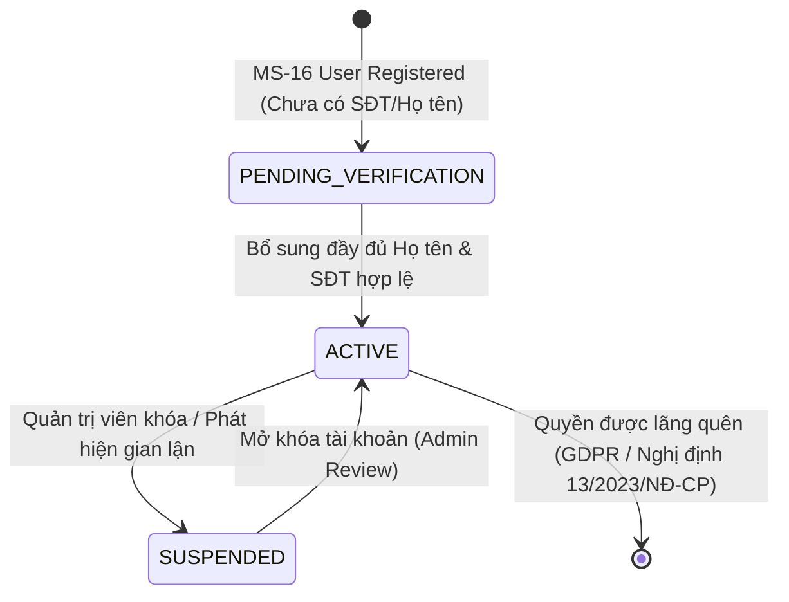

> **Cập nhật 08/10/2026:** Hành vi implementation hiện tại được mô tả tại [06_hardening_and_contract.md](06_hardening_and_contract.md). Các mô tả cache authoritative, OTP claim đã hoàn thiện và SLA từ mock benchmark trong bản v2.0 dưới đây đã được thay thế. Xem ADR-004/005/006 cho quyết định mới.

# SUB-DOMAIN THIẾT KẾ: CUSTOMER PROFILE & DIETARY PREFERENCE
## PHÂN HỆ QUẢN LÝ HỒ SƠ KHÁCH HÀNG & KHẨU VỊ OCOP — MS-15 PROFILE SERVICE
### Bounded Context: `BC-15: User & Customer Profile Context`

---

## 1. TỔNG QUAN & RANH GIỚI NGHIỆP VỤ (BOUNDED CONTEXT)

Phân hệ **Customer Profile** chịu trách nhiệm quản lý thông tin nhận diện khách hàng tiêu dùng trên sàn thương mại điện tử D2C Mè Xửng O Mạ. Phân hệ này tuân thủ các ranh giới nghiêm ngặt:

- **Sở hữu dữ liệu:**
  - Họ và tên, Giới tính, Ngày sinh, Ảnh đại diện (Avatar).
  - Số điện thoại liên lạc, Email giao dịch.
  - Sở thích khẩu vị ẩm thực OCOP và các cảnh báo dị ứng (mè, đậu phộng, gluten).
  - Trạng thái hoạt động và phiên bản khóa lạc quan (OCC CAS Version).
- **Tuyệt đối KHÔNG sở hữu:**
  - Thông tin đăng nhập, hash mật khẩu, refresh token (thuộc `MS-16 identity-service`).
  - Lịch sử đặt hàng, tổng chi tiêu tích lũy (thuộc `MS-04 order-service`).
  - Điểm thưởng Mè Xửng Xu, hạng thành viên (thuộc `MS-07 promotion-service`).

```text
┌──────────────────────────────────────┐       ┌──────────────────────────────────────┐
│       MS-16: IDENTITY SERVICE        │       │       MS-15: PROFILE SERVICE         │
│  (Authentication & Authorization)    │       │        (Customer Profile Domain)     │
├──────────────────────────────────────┤       ├──────────────────────────────────────┤
│ • Tài khoản đăng nhập (Email, Phone) │  1-1  │ • Họ tên, Ngày sinh, Giới tính       │
│ • Password Hash (Argon2id)           │ ───►  │ • Avatar URL                         │
│ • JWT Tokens, Roles, Permissions     │       │ • Sở thích kẹo, Dị ứng mè / lạc      │
│ • Lock / Unlock tài khoản xác thực   │       │ • Trạng thái hồ sơ & OCC CAS Version │
└──────────────────────────────────────┘       └──────────────────────────────────────┘
```

---

## 2. MÔ HÌNH MIỀN NGHIỆP VỤ (DOMAIN MODEL & INVARIANTS)

### 2.1. Aggregate Root: `CustomerProfile`

```text
┌────────────────────────────────────────────────────────────────────────┐
│                   AGGREGATE ROOT: CustomerProfile                     │
├────────────────────────────────────────────────────────────────────────┤
│ - ID: UUID v7 (Primary Key)                                            │
│ - UserID: UUID v7 (Khóa ngoại 1-1 với MS-16 Identity)                  │
│ - FullName: string (Tối đa 150 ký tự, UTF-8 tiếng Việt)               │
│ - PhoneNumber: string (Chuẩn E.164, ví dụ: +84905123456)               │
│ - Email: string (Chuẩn RFC 5322)                                       │
│ - DateOfBirth: *time.Time (Không vượt quá thời điểm hiện tại)          │
│ - Gender: GenderEnum (MALE, FEMALE, OTHER, UNSPECIFIED)                │
│ - AvatarURL: string                                                    │
│ - Preferences: DietaryPreference (Value Object)                        │
│ - Status: CustomerStatusEnum (ACTIVE, SUSPENDED, PENDING_VERIFICATION) │
│ - Version: int (Tự tăng đơn điệu mỗi lần cập nhật thành công)          │
│ - CreatedAt: time.Time                                                 │
│ - UpdatedAt: time.Time                                                 │
├────────────────────────────────────────────────────────────────────────┤
│ + UpdateProfile(fullName, phone, email, expectedVersion): Result       │
│ + UpdateDietaryPreferences(prefs DietaryPreference): void              │
│ + SuspendAccount(reason string): void                                  │
│ + ActivateAccount(): void                                              │
└────────────────────────────────────────────────────────────────────────┘
```

### 2.2. Value Object: `DietaryPreference` (Khẩu Vị & Dị Ứng OCOP)

Trong bối cảnh sản xuất và phân phối kẹo mè xửng đặc sản Huế:
- **Nguyên liệu cốt lõi:** Mè vừng rang, Đậu phụng (lạc), Bột dong riềng, Đường mía, Mạch nha.
- **Rủi ro dị ứng thực phẩm:** Một bộ phận người tiêu dùng bị dị ứng nghiêm trọng với **đậu phộng (Peanut Allergy)** hoặc **mè vừng (Sesame Allergy)**.
- **Mô hình Value Object:**

```go
type DietaryPreference struct {
    FavoriteProducts  []string `json:"favorite_products"` // Ví dụ: ["me_xung_gion", "keo_guong_dau_phung"]
    DietaryPreference string   `json:"dietary_preference"`// "NORMAL", "LOW_SUGAR", "VEGAN"
    AllergyAlert      []string `json:"allergy_alert"`     // ["PEANUT", "SESAME", "GLUTEN"]
}
```

- **Tính bất biến (Invariants):**
  - Danh sách cảnh báo dị ứng phải được kiểm tra chéo khi khách hàng thêm sản phẩm vào giỏ hàng (phối hợp với `MS-02 catalog-service`).
  - Nếu `AllergyAlert` chứa `"SESAME"`, hệ thống hiển thị cảnh báo đỏ trên UI khi duyệt các dòng mè xửng dẻo truyền thống.

---

## 3. MÁY TRẠNG THÁI HỒ SƠ KHÁCH HÀNG (CUSTOMER PROFILE FSM)



### Ma Trận Chuyển Trạng Thái

| Trạng Thái Ban Đầu | Sự Kiện Kích Hoạt | Trạng Thái Đích | Điều Kiện Bảo Vệ (Guard Condition) | Hành Động Đi Kèm (Side Effects) |
| :--- | :--- | :--- | :--- | :--- |
| `[*]` | `UserRegisteredEvent` | `PENDING_VERIFICATION` | UserID chưa tồn tại trong hệ thống | Tạo bản ghi với Version = 1 |
| `PENDING_VERIFICATION`| `CompleteProfile` | `ACTIVE` | `FullName` không rỗng, `PhoneNumber` hợp lệ | Phát `CustomerProfileActivatedEvent` |
| `ACTIVE` | `SuspendAccount` | `SUSPENDED` | Thao tác bởi Quản trị viên (Role: `ADMIN`) | Vô hiệu hóa Cache, cấm tạo đơn mới |
| `SUSPENDED` | `UnsuspendAccount` | `ACTIVE` | Thao tác bởi Quản trị viên kèm lý do mở khóa | Khôi phục quyền đặt hàng |

---

## 4. DATABASE SCHEMA DDL & CHỈ MỤC (POSTGRESQL 16)

```sql
CREATE TABLE IF NOT EXISTS customer_profiles (
    id UUID PRIMARY KEY,
    user_id UUID NOT NULL UNIQUE,
    full_name VARCHAR(150) NOT NULL,
    phone_number VARCHAR(20) NOT NULL,
    email VARCHAR(255),
    date_of_birth DATE,
    gender VARCHAR(10) CHECK (gender IN ('MALE', 'FEMALE', 'OTHER', 'UNSPECIFIED')),
    avatar_url VARCHAR(500),
    preferences JSONB DEFAULT '{"favorite_products": [], "dietary_preference": "NORMAL", "allergy_alert": []}'::jsonb,
    status VARCHAR(20) NOT NULL DEFAULT 'ACTIVE' CHECK (status IN ('ACTIVE', 'SUSPENDED', 'PENDING_VERIFICATION')),
    version INT NOT NULL DEFAULT 1,
    created_at TIMESTAMPTZ NOT NULL DEFAULT CURRENT_TIMESTAMP,
    updated_at TIMESTAMPTZ NOT NULL DEFAULT CURRENT_TIMESTAMP
);

-- Chỉ mục tối ưu hóa truy vấn
CREATE INDEX IF NOT EXISTS idx_customer_phone ON customer_profiles(phone_number);
CREATE INDEX IF NOT EXISTS idx_customer_email ON customer_profiles(email);
CREATE INDEX IF NOT EXISTS idx_customer_user_id ON customer_profiles(user_id);
CREATE INDEX IF NOT EXISTS idx_customer_preferences ON customer_profiles USING GIN (preferences);
```

---

## 5. USE CASE CỐT LÕI: `UpdateProfileWithOCCUseCase`

### 5.1. Thuật Toán Khóa Lạc Quan Non-Blocking CAS (Optimistic Concurrency Control)

Để tránh hiện tượng **Lost Update** khi khách hàng mở đồng thời nhiều thiết bị (web và app di động) cùng sửa thông tin cá nhân:

```text
[BƯỚC 1]: Nhận request (customer_id, full_name, phone, email, expected_version).
[BƯỚC 2]: Thực thi câu lệnh SQL CAS nguyên tử:
          UPDATE customer_profiles 
          SET full_name = $2, phone_number = $3, email = $4,
              version = version + 1, updated_at = NOW()
          WHERE id = $1 AND version = $5
          RETURNING *;
[BƯỚC 3]: Kiểm tra kết quả:
          - Nếu trả về 1 row -> Cập nhật thành công.
          - Nếu 0 rows affected -> Thực hiện kiểm tra phụ:
            SELECT EXISTS(SELECT 1 FROM customer_profiles WHERE id = $1)
            + Nếu false: Trả về ErrCustomerNotFound (HTTP 404).
            + Nếu true:  Trả về ErrOptimisticLockConflict (HTTP 409 Conflict).
[BƯỚC 4]: Xóa Cache 2 tầng (L1 RAM + L2 Redis) và phát Redis Pub/Sub thông báo tới toàn bộ Pods.
[BƯỚC 5]: Ghi Transactional Outbox event 'vn.omama.profile.updated.v1' để đồng bộ sang MS-16 và CRM.
```

### 5.2. Hiện Thực Mã Nguồn

Chi tiết mã nguồn đã triển khai tại:
- Use Case: [`internal/usecase/customer_usecase.go`](file:///e:/DUT.K1N4/PBL/services/profile-service/internal/usecase/customer_usecase.go)
- Repository CAS: [`internal/repository/customer_repository.go`](file:///e:/DUT.K1N4/PBL/services/profile-service/internal/repository/customer_repository.go#L76-L133)

---

## 6. GIAO TIẾP NGOẠI VI (API & KAFKA EVENTS)

### 6.1. RESTful APIs

| Phương thức | Endpoint | Phân quyền | Mô tả | Mã phản hồi |
| :--- | :--- | :--- | :--- | :--- |
| `GET` | `/api/v1/profile` | `CUSTOMER` | Lấy thông tin cá nhân của phiên đăng nhập | `200 OK`, `401 Unauthorized` |
| `PUT` | `/api/v1/profile` | `CUSTOMER` | Cập nhật hồ sơ cá nhân với khóa lạc quan OCC (`version`) | `200 OK`, `409 Conflict`, `400 Bad Request` |

### 6.2. Kafka Events

- **Sự kiện Xuất Bản (Outbox Topic `profile.events.v1`):**
  - `vn.omama.profile.created.v1`: Kích hoạt khi khách hoàn thiện hồ sơ. Consumer: `MS-07 promotion-service` (tặng voucher chào mừng).
  - `vn.omama.profile.updated.v1`: Kích hoạt khi cập nhật thông tin cá nhân. Consumer: `MS-16 identity-service`, `MS-25 analytics-service`.
- **Sự kiện Tiêu Thụ (Inbound Topic `identity.events.v1`):**
  - `vn.omama.identity.user_registered.v1`: Tự động tạo bản ghi `customer_profiles` với `status = 'PENDING_VERIFICATION'`.
  - `vn.omama.identity.user_locked.v1`: Cập nhật `status = 'SUSPENDED'`, vô hiệu hóa cache khách hàng.
