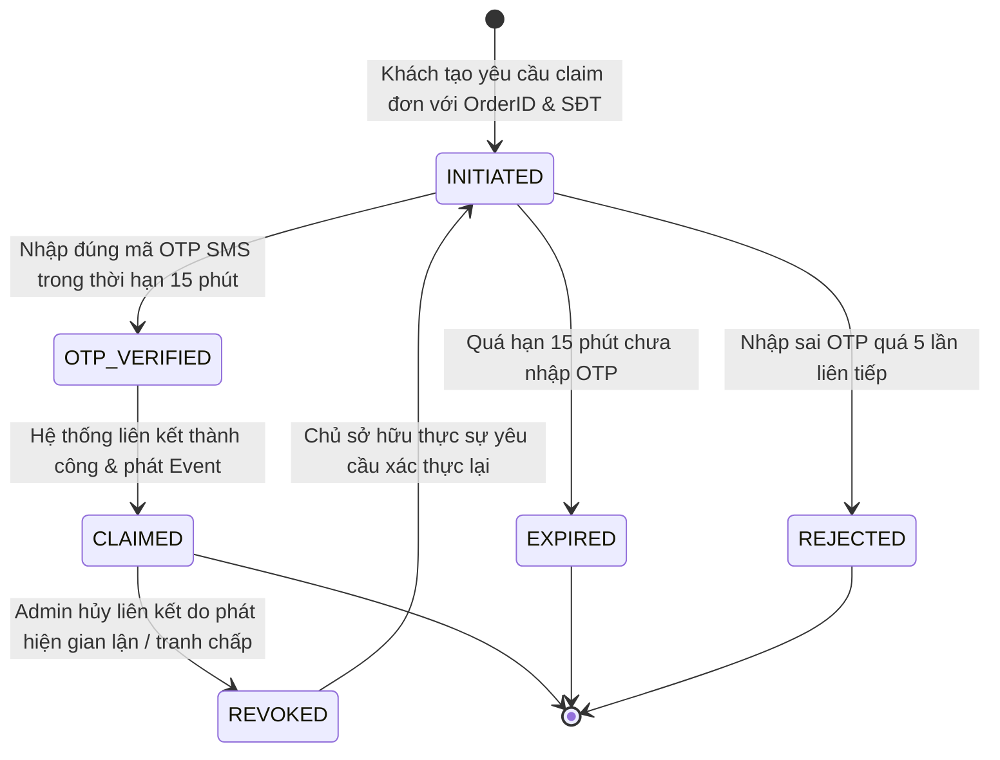

# SUB-DOMAIN THIẾT KẾ: GUEST ORDER CLAIM & RETRIEVAL
## PHÂN HỆ KHÔI PHỤC & LIÊN KẾT ĐƠN HÀNG VÃNG LAI VÀO TÀI KHOẢN CHÍNH THỨC
### Bounded Context: `BC-15: User & Customer Profile Context`

---

## 1. TỔNG QUAN NGHIỆP VỤ (BUSINESS CONTEXT)

### 1.1. Nhu Cầu Mua Sắm Vãng Lai (Guest Checkout)
Khi khách du lịch đến Huế hoặc khách hàng mua thử kẹo Mè Xửng O Mạ trên website D2C lần đầu tiên, họ có thể chọn đặt hàng dạng **Khách Vãng Lai (Guest Checkout)** mà không cần tạo tài khoản mật khẩu, chỉ cần nhập Số điện thoại nhận hàng.

### 1.2. Quyền Lợi & Nghiệp Vụ Liên Kết Đơn Hàng (Guest Order Claim)
Sau khi trải nghiệm sản phẩm ngon và quyết định tạo tài khoản thành viên chính thức (`MS-16 Identity`), khách hàng có nhu cầu:
- **Khôi phục toàn bộ các đơn hàng cũ** đã đặt bằng số điện thoại đó.
- **Tích điểm thưởng Mè Xửng Xu** từ các đơn hàng trước đây (`MS-07 promotion-service`).
- **Theo dõi trạng thái giao hàng** tập trung trên Dashboard cá nhân.

---

## 2. MÔ HÌNH MIỀN NGHIỆP VỤ (DOMAIN MODEL & INVARIANTS)

```text
┌────────────────────────────────────────────────────────────────────────┐
│                      ENTITY: GuestOrderClaim                          │
├────────────────────────────────────────────────────────────────────────┤
│ - ID: UUID v7 (Primary Key)                                            │
│ - CustomerID: UUID v7 (ID tài khoản thành viên nhận đơn)              │
│ - OrderID: string (Mã đơn hàng vãng lai cần liên kết, ví dụ: ORD-1024) │
│ - PhoneNumber: string (SĐT người đặt đơn vãng lai ban đầu)            │
│ - ClaimStatus: GuestOrderClaimStatusEnum                              │
│ - VerificationCode: string (Mã OTP 6 số ngẫu nhiên)                   │
│ - VerifiedAt: *time.Time (Thời điểm xác thực OTP thành công)          │
│ - ExpiresAt: time.Time (Thời điểm hết hạn hiệu lực OTP - 15 phút)      │
│ - ClaimedAt: time.Time (Thời điểm ghi nhận claim hoàn tất)            │
├────────────────────────────────────────────────────────────────────────┤
│ + VerifyOTP(inputOTP string): error                                   │
│ + RevokeClaim(reason string): error                                    │
└────────────────────────────────────────────────────────────────────────┘
```

### Bất Biến Nghiệp Vụ Miền (Domain Invariants)
- **Bất biến Chống Claim Trùng Lặp (Double-Claim Shield):** Một mã đơn hàng (`order_id`) chỉ được phép thuộc về **tối đa duy nhất một tài khoản thành viên có hiệu lực**. Tuyệt đối không để 2 tài khoản khác nhau cùng sở hữu 1 đơn hàng để gian lận tích điểm thưởng Mè Xửng Xu.
- **Bất biến OTP SMS Hợp Lệ:** Việc gán đơn hàng vào tài khoản chỉ thành công khi chủ sở hữu chứng minh được quyền sở hữu số điện thoại đặt hàng thông qua mã OTP SMS gửi về số điện thoại đó.

---

## 3. MÁY TRẠNG THÁI KHÔI PHỤC ĐƠN VÃNG LAI (GUEST ORDER CLAIM FSM)



### Ma Trận Chuyển Trạng Thái

| Trạng Thái Đầu | Sự Kiện | Trạng Thái Đích | Điều Kiện Bảo Vệ (Guard) | Hành Động Kèm Theo |
| :--- | :--- | :--- | :--- | :--- |
| `[*]` | `InitiateClaim` | `INITIATED` | `order_id` chưa có claim nào ở trạng thái `CLAIMED` hoặc `VERIFIED` | Sinh OTP 6 chữ số, lưu TTL 15 phút, phát lệnh gửi SMS qua `MS-28 notification-service` |
| `INITIATED` | `VerifyOTP` | `OTP_VERIFIED` | Mã OTP khớp, `ExpiresAt > NOW()` | Đánh dấu `VerifiedAt = NOW()` |
| `OTP_VERIFIED` | `CompleteClaim` | `CLAIMED` | Giao dịch Database thành công | Ghi Transactional Outbox `vn.omama.profile.guest_order_claimed.v1` |
| `CLAIMED` | `AdminRevoke` | `REVOKED` | Thao tác bởi Quản trị viên kèm biên bản tranh chấp | Giải phóng `order_id` cho chủ sở hữu hợp pháp |

---

## 4. DATABASE SCHEMA DDL & PARTIAL UNIQUE INDEX

```sql
CREATE TABLE IF NOT EXISTS guest_order_claims (
    id UUID PRIMARY KEY,
    customer_id UUID NOT NULL REFERENCES customer_profiles(id) ON DELETE CASCADE,
    order_id VARCHAR(50) NOT NULL,
    phone_number VARCHAR(20) NOT NULL,
    claimed_at TIMESTAMPTZ NOT NULL DEFAULT CURRENT_TIMESTAMP,
    claim_status VARCHAR(20) NOT NULL DEFAULT 'VERIFIED' CHECK (claim_status IN ('VERIFIED', 'REVOKED'))
);

CREATE INDEX IF NOT EXISTS idx_guest_claims_phone ON guest_order_claims(phone_number);

-- PARTIAL UNIQUE INDEX CHỐNG CHIẾM ĐOẠT & CLAIM TRÙNG ĐƠN HÀNG
CREATE UNIQUE INDEX IF NOT EXISTS uq_order_claim_active 
ON guest_order_claims(order_id) 
WHERE claim_status = 'VERIFIED';
```

> [!IMPORTANT]
> **Cơ chế Partial Index:** Nếu một claim bị hủy (`claim_status = 'REVOKED'`), chỉ mục này sẽ tự động loại trừ dòng đó ra khỏi index, cho phép chủ sở hữu hợp pháp thực sự claim lại đơn hàng mà không gặp lỗi trùng khóa!

---

## 5. USE CASE CỐT LÕI: `ClaimGuestOrderUseCase`

```text
[BƯỚC 1]: Nhận request (customer_id, order_id, phone_number) từ phiên đăng nhập.
[BƯỚC 2]: Thực thi lệnh INSERT vào bảng guest_order_claims với claim_status = 'VERIFIED'.
          └──> Nếu trùng lặp: PostgreSQL ném lỗi 23505 (unique_violation).
               Use case bắt lỗi và trả về domain.ErrOrderAlreadyClaimed (HTTP 409 Conflict).
[BƯỚC 3]: Đóng gói Payload sự kiện Kafka Outbox:
          {
            "order_id": "ORD-1024",
            "customer_id": "cust-uuid-456",
            "phone_number": "0905123456",
            "claimed_at": "2026-10-02T22:00:00Z"
          }
[BƯỚC 4]: Ghi vào bảng outbox_events với topic 'profile.events.v1'.
[BƯỚC 5]: Trả về kết quả HTTP 201 Created cho Client.
```

---

## 6. GIAO TIẾP NGOẠI VI (REST APIs & KAFKA STREAMING)

### 6.1. RESTful APIs

| Method | Endpoint | RBAC | Mô Tả | Mã Phản Hồi |
| :--- | :--- | :--- | :--- | :--- |
| `POST` | `/api/v1/profile/guest-claims` | `CUSTOMER` | Khởi tạo yêu cầu nhận đơn hàng vãng lai | `201 Created`, `400 Bad Request`, `409 Conflict` |
| `GET` | `/api/v1/profile/guest-claims/{order_id}` | `CUSTOMER` | Tra cứu trạng thái claim của một đơn hàng | `200 OK`, `404 Not Found` |

### 6.2. Kafka Event Xuất Bản (Transactional Outbox)

- **Tên sự kiện:** `vn.omama.profile.guest_order_claimed.v1`
- **Topic:** `profile.events.v1`
- **Partition Key:** `customer_id`
- **Consumers chính:**
  1. `MS-04 order-service`: Cập nhật trường `customer_id` trên đơn hàng từ `NULL/GUEST` thành `customer_id` thực tế, chuyển giao toàn quyền quản lý đơn cho khách.
  2. `MS-07 promotion-service`: Đọc giá trị tổng tiền đơn hàng đã thanh toán và kích hoạt cơ chế tích lũy **Mè Xửng Xu** vào ví điểm thưởng của khách.
