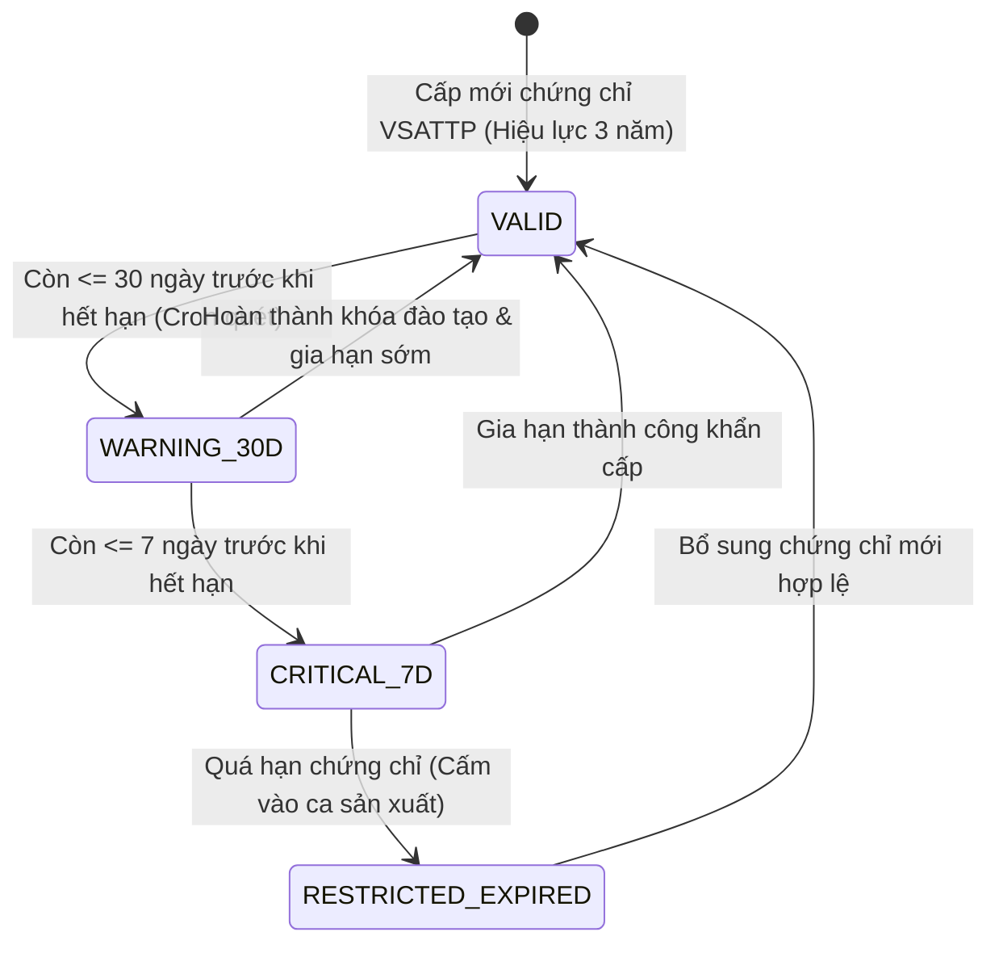

> **Cập nhật 08/10/2026:** Hành vi implementation hiện tại được mô tả tại [06_hardening_and_contract.md](06_hardening_and_contract.md). Các mô tả cache authoritative, OTP claim đã hoàn thiện và SLA từ mock benchmark trong bản v2.0 dưới đây đã được thay thế. Xem ADR-004/005/006 cho quyết định mới.

# SUB-DOMAIN THIẾT KẾ: EMPLOYEE PROFILE & FOOD SAFETY COMPLIANCE
## PHÂN HỆ QUẢN LÝ NHÂN SỰ XƯỞNG KẸO, MÃ HÓA ENVELOPE ENCRYPTION & GIÁM SÁT TUÂN THỦ VSATTP OCOP
### Bounded Context: `BC-15: User & Customer Profile Context`

---

## 1. TỔNG QUAN & BỐI CẢNH SẢN XUẤT OCOP

### 1.1. Bối Cảnh Xưởng Sản Xuất Mè Xửng O Mạ
Trong quy trình chế biến kẹo mè xửng đạt chuẩn **OCOP 4 sao**:
- Các công nhân trực tiếp tham gia chế biến (đứng bếp quấy chảo kẹo, cán mè, cắt kẹo, đóng gói dán tem QR niêm phong) bắt buộc phải có **Giấy xác nhận tập huấn kiến thức An toàn Vệ sinh Thực phẩm (VSATTP)** còn hiệu lực theo quy định của Bộ Y tế và Chi cục ATVSTP Thừa Thiên Huế (thời hạn 3 năm/lần).
- Nếu công nhân đứng ca nấu kẹo có chứng chỉ VSATTP bị quá hạn, mẻ kẹo đó sẽ bị cơ quan thẩm quyền đình chỉ lưu hành hoặc tước quyền dán tem OCOP.

### 1.2. Chính Sách Bảo Mật Dữ Liệu Cá Nhân (Nghị Định 13/2023/NĐ-CP)
- Thông tin Căn cước công dân (CCCD / ID Card) của nhân sự là **Dữ liệu cá nhân nhạy cảm (Restricted PII)**.
- **Yêu cầu bảo mật cấp cao:** Tuyệt đối không được lưu trữ số CCCD dưới dạng văn bản thô (Plaintext) trong cơ sở dữ liệu. Mọi hành vi lưu trữ phải được mã hóa theo tiêu chuẩn quân sự `AES-256-GCM` thông qua mô hình **Mã hóa Phong bì (Envelope Encryption)** kết hợp với hệ thống Quản lý Khóa ngoài **HashiCorp Vault Transit Engine**.

---

## 2. MÔ HÌNH MIỀN NGHIỆP VỤ (DOMAIN MODEL & ENTITIES)

```text
┌────────────────────────────────────────────────────────────────────────┐
│                        ENTITY: Department                              │
├────────────────────────────────────────────────────────────────────────┤
│ - ID: string (Ví dụ: DEPT-PROD-HUONGTHUY, DEPT-FULFILL-PACK)          │
│ - Name: string (Tên phòng ban / phân xưởng)                            │
│ - Description: string                                                  │
│ - ManagerID: *UUID (Người quản lý trực tiếp)                           │
│ - CreatedAt / UpdatedAt: time.Time                                     │
└────────────────────────────────────────────────────────────────────────┘

┌────────────────────────────────────────────────────────────────────────┐
│                      ENTITY: EmployeeProfile                           │
├────────────────────────────────────────────────────────────────────────┤
│ - ID: UUID v7 (Primary Key)                                            │
│ - UserID: *UUID (Tùy chọn liên kết với tài khoản hệ thống MS-16)       │
│ - EmployeeCode: string (Mã nhân viên duy nhất, ví dụ: EMP-001)         │
│ - FullName: string (Họ tên nhân viên)                                  │
│ - PhoneNumber: string (SĐT liên hệ)                                    │
│ - IDCardEncrypted: []byte (Ciphertext CCCD đã mã hóa AES-256-GCM)      │
│ - IDCardNonce: []byte (Khóa khởi tạo Nonce 96-bit ngẫu nhiên)          │
│ - EncryptedDEK: []byte (Data Encryption Key đã bọc bởi Vault KEK)      │
│ - KEKVersion: int (Phiên bản Master KEK của Vault tại thời điểm bọc)   │
│ - DepartmentID: string (Khóa ngoại trỏ về Department)                  │
│ - Position: string (Bếp trưởng quấy kẹo, Kỹ thuật viên đóng gói...)    │
│ - ContractType: string (FULLTIME, PARTTIME, SEASONAL)                  │
│ - ContractStartDate: time.Time                                         │
│ - ContractEndDate: *time.Time                                          │
│ - FoodSafetyCertNo: string (Số giấy chứng nhận tập huấn VSATTP)        │
│ - FoodSafetyCertExpiry: *time.Time (Ngày hết hạn chứng chỉ)            │
│ - Status: string (ACTIVE, ON_LEAVE, TERMINATED)                        │
│ - CreatedAt / UpdatedAt: time.Time                                     │
└────────────────────────────────────────────────────────────────────────┘
```

---

## 3. THUẬT TOÁN BẢO MẬT: ENVELOPE ENCRYPTION & IN-MEMORY ZEROIZE

```text
                               HASHICORP VAULT TRANSIT KMS
                                 (Master KEK Versioned)
                                           ▲
                     Wrap DEK (POST)       │     Unwrap DEK (POST)
                  (v1/transit/encrypt)     │   (v1/transit/decrypt)
                                           ▼
┌─────────────────────────────────────────────────────────────────────────┐
│               ENVELOPE ENCRYPTOR ENGINE (PROFILE SERVICE)               │
│                                                                         │
│  [QUY TRÌNH MÃ HÓA ONBOARDING]:                                         │
│  1. Plaintext CCCD ("046098001234")                                     │
│  2. Sinh ngẫu nhiên DEK 256-bit (crypto/rand)                           │
│  3. Dùng DEK mã hóa CCCD bằng AES-256-GCM + Nonce 96-bit                │
│  4. Gửi DEK lên Vault KEK để Wrap -> Thu được EncryptedDEK + KEKVersion │
│  5. Zeroize DEK plaintext trong RAM ngay lập tức                        │
│                                                                         │
│  [BỘ ĐỆM DEK TRONG RAM (SHORT-LIVED CACHE)]:                            │
│  • Lưu DEK đã giải mã trong LRU Cache (TTL 3-5 phút) phục vụ xem hàng loạt│
│  • Hook OnEvict: Tự động ghi đè mảng byte về 0 khi hết hạn (Zeroize)    │
└─────────────────────────────────────────────────────────────────────────┘
```

### 3.1. Cơ Chế Xóa Sạch Bộ Nhớ RAM (Zeroize on Eviction)
```go
cache := expirable.NewLRU[string, []byte](1000, func(key string, val []byte) {
    // Hook OnEvict: Tự động ghi đè toàn bộ mảng byte về 0 khi hết hạn
    for i := range val {
        val[i] = 0
    }
}, cacheTTL)
```

### 3.2. Cơ Chế Chống Giả Mạo (Tamper Detection)
Thuật toán `AES-256-GCM` sử dụng Authentication Tag 128-bit. Nếu kẻ gian can thiệp trực tiếp vào cơ sở dữ liệu làm biến đổi dù chỉ 1 bit của cột `id_card_encrypted`, hàm `gCM.Open()` sẽ ném lỗi `ErrTamperDetected`, từ chối giải mã và tuyệt đối không bao giờ làm panic tiến trình server.

---

## 4. MÁY TRẠNG THÁI TUÂN THỦ VSATTP (FOOD SAFETY COMPLIANCE FSM)



### Ma Trận Chuyển Trạng Thái

| Trạng Thái Đầu | Sự Kiện | Trạng Thái Đích | Điều Kiện Bảo Vệ | Hành Động Kèm Theo |
| :--- | :--- | :--- | :--- | :--- |
| `VALID` | `CronDailyScan` | `WARNING_30D` | $8 \le \text{DaysRemaining} \le 30$ | Ghi Outbox `StaffComplianceWarningEvent` (Level: `WARNING_30_DAYS`) |
| `WARNING_30D` | `CronDailyScan` | `CRITICAL_7D` | $1 \le \text{DaysRemaining} \le 7$ | Ghi Outbox `StaffComplianceWarningEvent` (Level: `CRITICAL_7_DAYS`), gửi cảnh báo khẩn cấp tới Quản đốc xưởng |
| `CRITICAL_7D` | `CronDailyScan` | `RESTRICTED_EXPIRED` | $\text{DaysRemaining} \le 0$ | Ghi Outbox `StaffComplianceExpiredEvent`, vô hiệu hóa quyền vào ca sản xuất trên `MS-10 packing-service` |

---

## 5. DATABASE SCHEMA DDL (POSTGRESQL 16)

```sql
-- 1. DEPARTMENTS
CREATE TABLE IF NOT EXISTS departments (
    id VARCHAR(50) PRIMARY KEY,
    name VARCHAR(150) NOT NULL,
    description TEXT,
    manager_id UUID,
    created_at TIMESTAMPTZ NOT NULL DEFAULT CURRENT_TIMESTAMP,
    updated_at TIMESTAMPTZ NOT NULL DEFAULT CURRENT_TIMESTAMP
);

INSERT INTO departments (id, name, description) VALUES
('DEPT-PROD-HUONGTHUY', 'Xưởng Nấu Kẹo Hương Thủy', 'Khu vực nấu mè xửng truyền thống và kiểm tra mẻ kẹo'),
('DEPT-FULFILL-PACK', 'Bộ Phận Đóng Gói & Niêm Phong', 'Khu vực cân kẹo, dán tem QR OCOP, đóng thùng có camera ghi hình'),
('DEPT-WAREHOUSE', 'Kho Nguyên Liệu & Thành Phẩm', 'Bảo quản mè vừng, đậu phụng, đường non và kẹo xuất xưởng'),
('DEPT-RETAIL-HUEMARKET', 'Cửa Hàng Trưng Bày Huế', 'Showroom bán lẻ và tiếp đón khách du lịch dùng thử kẹo')
ON CONFLICT (id) DO NOTHING;

-- 2. EMPLOYEE PROFILES
CREATE TABLE IF NOT EXISTS employee_profiles (
    id UUID PRIMARY KEY,
    user_id UUID UNIQUE,
    employee_code VARCHAR(50) NOT NULL UNIQUE,
    full_name VARCHAR(150) NOT NULL,
    phone_number VARCHAR(20) NOT NULL,
    id_card_encrypted BYTEA NOT NULL,
    id_card_nonce BYTEA NOT NULL,
    encrypted_dek BYTEA NOT NULL,
    kek_version INT NOT NULL DEFAULT 1,
    department_id VARCHAR(50) NOT NULL REFERENCES departments(id),
    position VARCHAR(100) NOT NULL,
    contract_type VARCHAR(20) NOT NULL CHECK (contract_type IN ('FULLTIME', 'PARTTIME', 'SEASONAL')),
    contract_start_date DATE NOT NULL,
    contract_end_date DATE,
    food_safety_cert_no VARCHAR(100),
    food_safety_cert_expiry DATE,
    status VARCHAR(20) NOT NULL DEFAULT 'ACTIVE' CHECK (status IN ('ACTIVE', 'ON_LEAVE', 'TERMINATED')),
    created_at TIMESTAMPTZ NOT NULL DEFAULT CURRENT_TIMESTAMP,
    updated_at TIMESTAMPTZ NOT NULL DEFAULT CURRENT_TIMESTAMP
);

CREATE INDEX IF NOT EXISTS idx_emp_code ON employee_profiles(employee_code);
CREATE INDEX IF NOT EXISTS idx_emp_department ON employee_profiles(department_id);
CREATE INDEX IF NOT EXISTS idx_emp_status ON employee_profiles(status);
CREATE INDEX IF NOT EXISTS idx_emp_cert_expiry ON employee_profiles(food_safety_cert_expiry);
```

---

## 6. GIAO TIẾP NGOẠI VI (ADMIN REST APIs & KAFKA)

### 6.1. RESTful APIs (Dành Cho Ban Quản Trị & HR)

| Method | Endpoint | RBAC | Mô Tả | Mã Phản Hồi |
| :--- | :--- | :--- | :--- | :--- |
| `POST` | `/api/v1/admin/employees` | `HR_MANAGER`, `ADMIN` | Tiếp nhận nhân sự mới kèm mã hóa Envelope CCCD | `201 Created`, `400 Bad Request`, `403 Forbidden` |
| `GET` | `/api/v1/admin/employees/{id}` | `HR_MANAGER`, `ADMIN` | Xem chi tiết hồ sơ nhân viên (giải mã CCCD qua Vault) | `200 OK`, `403 Forbidden`, `503 Service Unavailable` |
| `GET` | `/api/v1/admin/employees` | `HR_MANAGER`, `ADMIN` | Danh sách nhân sự kèm lọc theo phòng ban / trạng thái | `200 OK`, `403 Forbidden` |

### 6.2. Kafka Event Xuất Bản (Giám Sát VSATTP)

- **Topic:** `profile.events.v1`
- **Sự kiện cảnh báo:** `vn.omama.profile.staff_compliance_warning.v1`
  - Gửi đến `MS-28 notification-service` để tự động gửi SMS và Email cho Quản đốc xưởng và công nhân yêu cầu đăng ký lịch tập huấn gia hạn chứng chỉ.
- **Sự kiện quá hạn:** `vn.omama.profile.staff_compliance_expired.v1`
  - Gửi đến `MS-10 packing-service` và Dashboard Phân ca sản xuất để khóa quyền vào ca, bảo vệ danh hiệu OCOP của cơ sở.
