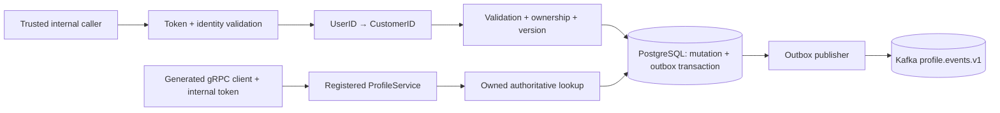

# MS-15 — Implementation hardening (08/10/2026)

Tài liệu này mô tả hành vi đã triển khai sau đợt rà soát. Khi có khác biệt với thiết kế v2.0, dùng tài liệu này và `docs/03_api_specs/profile-service.openapi.yaml` cho integration hiện tại. Contract Customer Profile MVP `0.1.0-candidate` vẫn là đề xuất riêng; đợt sửa này không phê duyệt hoặc tự động triển khai toàn bộ candidate.

## Identity và ownership

- `user_id` là subject của Identity; `customer_profiles.id` là ID hồ sơ độc lập. HTTP resolve bằng `user_id`; không dùng subject trực tiếp làm customer ID.
- HTTP business endpoints yêu cầu `X-Internal-Token`, `X-User-ID`; role dùng `X-User-Role`. Token được đọc từ `PROFILE_INTERNAL_TOKEN`, không có mặc định. Header identity chỉ đáng tin khi caller nội bộ đã xác thực bằng token này.
- Đây là contract **server-to-server**; token không được gửi tới browser. Production cần mạng nội bộ và TLS/mTLS do tầng triển khai cung cấp. Không sửa cấu hình Kong trong đợt này; đội ingress/BFF cần đáp ứng contract đầu vào này trước khi tích hợp.
- Không còn fallback `?customer_id=...`. Address lookup áp dụng ownership trong SQL; cross-customer trả cùng `404` như không tồn tại. Claim lookup cũng giới hạn customer.
- HR endpoints chỉ tồn tại dưới `/api/v1/admin/employees`, yêu cầu `ADMIN`, `HR_MANAGER` hoặc `HR_ADMIN`. Bỏ alias HR dưới customer profile.

## Persistence và concurrency

- CAS profile và event `vn.omama.profile.updated.v1` commit trong cùng transaction. Claim đã xác minh và event claim cũng commit cùng transaction. Không bỏ qua lỗi ghi outbox.
- Create/update/delete/switch address đều khóa hàng customer bằng `SELECT ... FOR UPDATE` trước khi thay đổi child rows. Khóa ổn định này cũng áp dụng được khi chưa có địa chỉ nào.
- Partial unique index giữ giới hạn tối đa một default; application transaction giữ đúng một default nếu còn địa chỉ.
- Xóa default chọn địa chỉ còn lại theo `updated_at DESC, id ASC`. Xóa địa chỉ cuối trả `[]`. Không thay đổi snapshot của đơn hàng đã tạo.
- Address có `version`; update/delete/default HTTP yêu cầu `If-Match: "<version>"`. Thiếu header trả `428`, phiên bản cũ trả `409`, ownership không hợp lệ trả `404`.
- Đổi sang địa chỉ đã là default là no-op; retry cùng intent không tăng version hoặc phát thêm event. Thay đổi default tăng version của các địa chỉ thực sự đổi trạng thái.
- Profile vẫn hỗ trợ `version` trong body cho client cũ; `If-Match` nếu có được ưu tiên. Response profile/address đơn lẻ trả ETag; create address trả Location.
- Email chỉ đọc qua Profile API: bỏ qua việc không gửi email, chấp nhận cùng giá trị, từ chối đổi giá trị. Verification/change-email thuộc Identity.

## Validation

- Tên/người nhận/đường có giới hạn độ dài; phone được normalize về E.164, hỗ trợ số di động Việt Nam.
- Phường phải thuộc tỉnh đã chọn và đúng level. Tên địa giới trả về được lấy từ master data, không tin tên do client gửi.
- Tọa độ phải đi theo cặp và trong giới hạn supported của model. Update address không nhận `is_default`; dùng endpoint chuyên biệt.
- JSON tối đa 64 KiB, không nhận field lạ hoặc nhiều JSON documents. Lỗi hệ thống trả thông điệp chung; chi tiết ghi log server.
- Kết quả đường chưa biết: `UNVERIFIED_NEW_STREET`, `is_consistent=false`, `confidence_score=0`; đây là cảnh báo cho UI, không tự động cấm lưu địa chỉ. Lỗi DB không bị biến thành kết quả “địa chỉ hợp lệ”.
- Fuzzy matching giới hạn input 255 ký tự và có JSON fields `code/name/score`. Tên đường có số như `2 Tháng 9` được bảo toàn.

## Guest claim

`GuestClaimVerifier` phải xác minh OTP/proof còn hạn, chống replay, bind customer/order/phone và đối chiếu đơn guest với Order Service. Khi chưa có adapter thực, endpoint trả `503 CLAIM_VERIFICATION_UNAVAILABLE` và không ghi claim/outbox. Không có bypass development. Đây là giới hạn tích hợp có chủ đích, không phải flow OTP hoàn chỉnh.

## gRPC, cache và events

- Ba RPC trong protobuf được sinh code và đăng ký trên server thật. `GetDeliveryAddress` luôn cần customer ID; có thể bỏ address ID để lấy default. Truy cập sai owner trả `NotFound`; lỗi storage trả `Internal`.
- gRPC yêu cầu metadata `x-internal-token`, giới hạn server deadline 2 giây. Reflection không mở mặc định. Shutdown có giới hạn chờ.
- Response gRPC thêm ward/province codes, optional coordinates, version/customer ID; giữ wire numbers cũ. `common.Address.district` để rỗng với mô hình hai cấp. Loyalty fields vẫn tương thích wire nhưng deprecated, không lấy dữ liệu từ Promotion.
- Profile và checkout address đọc PostgreSQL trực tiếp. Cache PII không dùng làm nguồn authoritative khi chưa có invalidation bền vững; chấp nhận thêm DB load để tránh đọc dữ liệu cũ.
- Cache helper có TTL L1 tối đa 5 giây, không quá TTL L2, deep copy dữ liệu; chỉ populate L1 sau khi ghi L2 thành công, purge khi bắt đầu subscription. Pub/Sub vẫn là best-effort và không được coi là bảo đảm nhất quán.
- Outbox publisher dùng CloudEvents 1.0, stable event ID từ outbox, customer ID làm partition key, retry các record chưa publish. At-least-once; downstream cần dedup theo event ID. Các event address là `address_created`, `address_updated`, `address_deleted`, `default_address_switched` với prefix `vn.omama.profile.*.v1`.
- Payload thay đổi profile/claim chỉ chứa reference và version cần thiết, không phát tên/email/phone sang Kafka. Kiểm toán đầy đủ qua MS-18 chưa nằm trong verification đầu-cuối của service này.

## Migration và kiểm chứng

Migration `000003` bổ sung address version, sửa default của dữ liệu cũ, constraint deleted-not-default và mở rộng gender để lưu `UNSPECIFIED` (11 ký tự). Volume cũ cần chạy migration; init scripts chỉ tự chạy với DB mới. Không thu hẹp lại gender trong down migration để tránh phá dữ liệu hợp lệ.

Xem ADR-004/005/006 và `docs/04_testing/profile-service/03_profile_hardening_verification.md` cho quyết định và bằng chứng. Benchmark lookup giả trước đây không chứng minh SLA network P99 ≤ 5ms.
