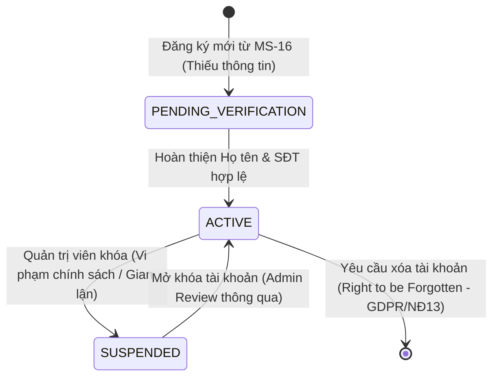
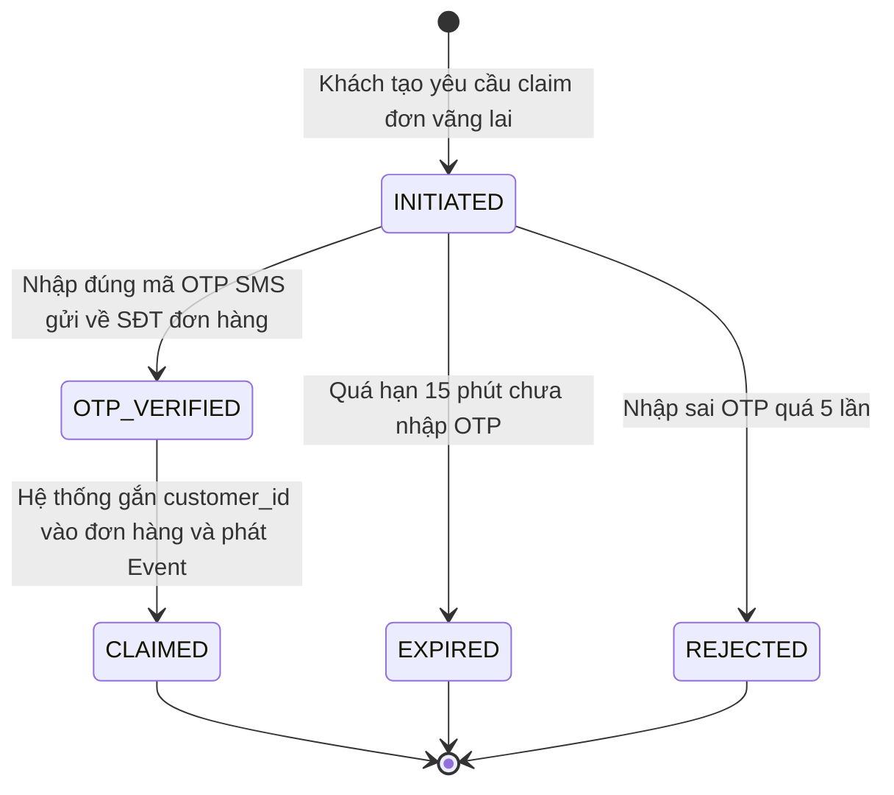
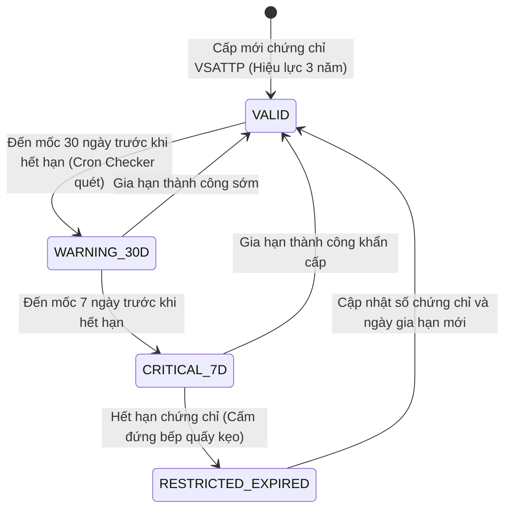
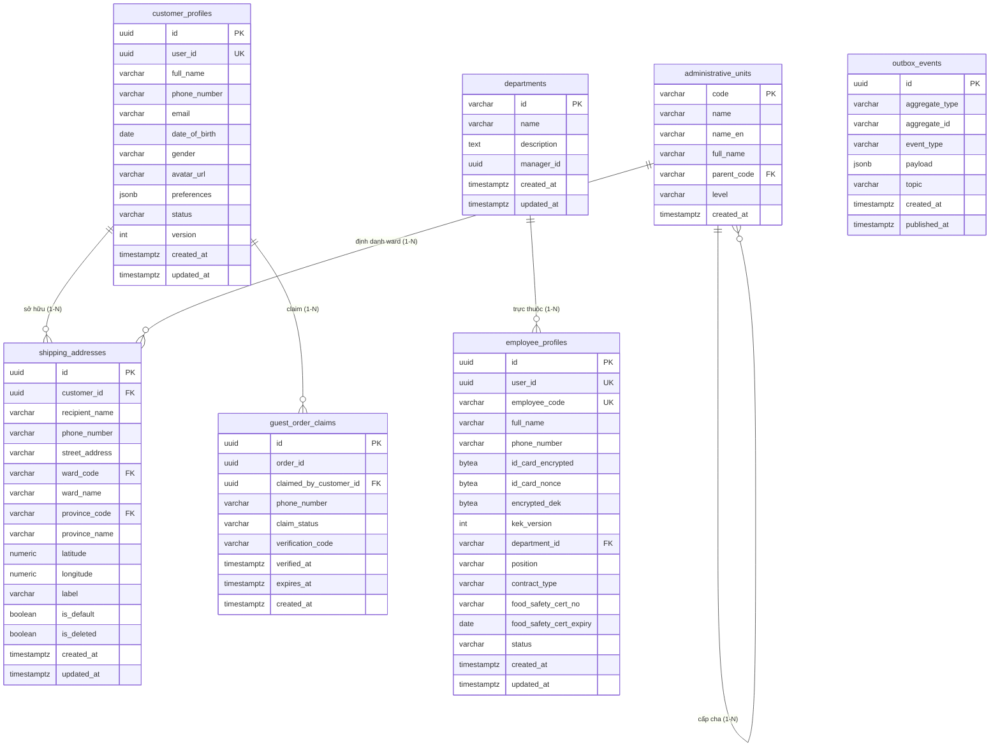

# TÀI LIỆU THIẾT KẾ KIẾN TRÚC CHI TIẾT (LOW-LEVEL DESIGN - LLD): MS-15 PROFILE SERVICE
## TRUNG TÂM DỮ LIỆU THỰC THỂ, ĐỊA CHỈ 2 CẤP & GIÁM SÁT TUÂN THỦ OCOP — MÈ XỬNG O MẠ
### PHIÊN BẢN: 2.0 (PRODUCTION & IMPLEMENTATION-READY SPECIFICATION)

---

> **QUY CHUẨN TIẾN TRÌNH THIẾT KẾ (DESIGN METHODOLOGY STANDARD):**
> Tài liệu này tuân thủ nghiêm ngặt **Tiến trình Thiết kế Kỹ thuật 11 Bước Tuần Tự (Strict 11-Step Software Engineering Design Flow)** theo nguyên lý Domain-Driven Design (DDD), Clean / Hexagonal Architecture và Distributed Systems Engineering Patterns, đồng bộ 100% với tài liệu thiết kế [`ms04_order_service_design.md`](../ms04_order_service_design.md).
> Tuyệt đối **không nhảy cóc giai đoạn**:
> 1. *Xác lập Biên giới & Ranh giới Sở hữu Dữ liệu (Bounded Context & Scope Isolation)* $\rightarrow$
> 2. *Mô hình hóa Miền Nghiệp vụ Cốt lõi (Domain Model, Entities & Value Objects)* $\rightarrow$
> 3. *Máy Trạng Thái & Vòng Đời Thực Thể (State Machine & Lifecycle Transitions)* $\rightarrow$
> 4. *Mô hình Hóa Dữ liệu Quan hệ & Bộ đệm (Database Schema DDL & Cache Storage)* $\rightarrow$
> 5. *Trừu tượng hóa Tầng Lưu trữ (Repository & Data Access Interfaces)* $\rightarrow$
> 6. *Tầng Ứng dụng & Chi tiết Các Ca Sử Dụng (Application Use Cases & Core Engine)* $\rightarrow$
> 7. *Tầng Vận chuyển & Đặc tả Hợp đồng Giao tiếp (Delivery Layer, API, gRPC & Kafka Contracts)* $\rightarrow$
> 8. *Cơ chế Kỹ thuật Xuyên suốt & Phòng vệ (Cross-Cutting Concerns & Defensive Engineering)* $\rightarrow$
> 9. *Quy hoạch Cấu trúc Thư mục Dự án (Project Directory & Code Blueprint)* $\rightarrow$
> 10. *Chiến lược Kiểm thử & Ma trận Truy vết Yêu cầu (Testing Specification & Traceability Matrix)* $\rightarrow$
> 11. *Ma Trận Sự Cố & Phục Hồi Phân Tán (Distributed Failure & Recovery Matrix)*.

---

> [!TIP]
> **TÀI LIỆU ĐÃ ĐƯỢC CHIA NHỎ THEO TỪNG SUB-DOMAIN ĐỂ DỄ ĐỌC VÀ BẢO TRÌ:**
> Nếu bạn muốn đọc chuyên sâu vào từng phân hệ nghiệp vụ độc lập, vui lòng truy cập trực tiếp các tài liệu phân rã:
> - 📄 [`README.md`](README.md): Bản đồ điều hướng & Tổng quan hệ thống.
> - 👤 [`01_customer_profile_domain.md`](01_customer_profile_domain.md): Phân hệ Hồ sơ Khách hàng & Sở thích Dị ứng Mè OCOP.
> - 📍 [`02_shipping_address_domain.md`](02_shipping_address_domain.md): Phân hệ Sổ địa chỉ 2 cấp, Checkout gRPC P99 $\le$ 5ms & Fuzzy Match Huế ADR-003.
> - 📦 [`03_guest_order_claim_domain.md`](03_guest_order_claim_domain.md): Phân hệ Khôi phục & Liên kết Đơn hàng Vãng lai (OTP Verification).
> - 👨‍🍳 [`04_employee_compliance_domain.md`](04_employee_compliance_domain.md): Phân hệ Nhân sự Xưởng kẹo, Envelope Encryption & Giám sát VSATTP OCOP.
> - ⚡ [`05_infrastructure_and_cross_cutting.md`](05_infrastructure_and_cross_cutting.md): Phân hệ Hạ tầng, Dual-Layer Cache, Outbox Worker & Ma trận Phục hồi.

---

## MỤC LỤC CHI TIẾT

- [1. BƯỚC 1: XÁC LẬP BIÊN GIỚI & RANH GIỚI SỞ HỮU DỮ LIỆU (BOUNDED CONTEXT & SCOPE ISOLATION)](#1-bước-1-xác-lập-biên-giới--ranh-giới-sở-hữu-dữ-liệu-bounded-context--scope-isolation)
  - [1.1. Bounded Context & Định Vị Hệ Thống](#11-bounded-context--định-vị-hệ-thống)
  - [1.2. Ranh Giới Bất Biến & Quyền Sở Hữu Dữ Liệu (Data Ownership Boundaries)](#12-ranh-giới-bất-biến--quyền-sở-hữu-dữ-liệu-data-ownership-boundaries)
  - [1.3. Chính Sách Bảo Mật PII & Trade-off Tính Sẵn Sàng (PII Policy & Availability Trade-off)](#13-chính-sách-bảo-mật-pii--trade-off-tính-sẵn-sàng-pii-policy--availability-trade-off)
  - [1.4. Lựa Chọn Công Nghệ & Ràng Buộc Kỹ Thuật (Tech Stack Selection)](#14-lựa-chọn-công-nghệ--ràng-buộc-kỹ-thuật-tech-stack-selection)
- [2. BƯỚC 2: MÔ HÌNH HÓA MIỀN NGHIỆP VỤ CỐT LÕI (DOMAIN MODEL, ENTITIES & VALUE OBJECTS)](#2-bước-2-mô-hình-hóa-miền-nghiệp-vụ-cốt-lõi-domain-model-entities--value-objects)
  - [2.1. Thuật Ngữ Nghiệp Vụ Chuẩn Hóa (Ubiquitous Language)](#21-thuật-ngữ-nghiệp-vụ-chuẩn-hóa-ubiquitous-language)
  - [2.2. Aggregate Root: `CustomerProfile`](#22-aggregate-root-customerprofile)
  - [2.3. Entities Thuộc Aggregate & Sub-Domains](#23-entities-thuộc-aggregate--sub-domains)
  - [2.4. Value Objects Bất Biến (Immutable Value Objects)](#24-value-objects-bất-biến-immutable-value-objects)
  - [2.5. Các Bất Biến Nghiệp Vụ Miền (Domain Invariants)](#25-các-bất-biến-nghiệp-vụ-miền-domain-invariants)
- [3. BƯỚC 3: MÁY TRẠNG THÁI & VÒNG ĐỜI THỰC THỂ (STATE MACHINE & LIFECYCLE TRANSITIONS)](#3-bước-3-máy-trạng-thái--vòng-đời-thực-thể-state-machine--lifecycle-transitions)
  - [3.1. Sơ Đồ Trạng Thái Hồ Sơ Khách Hàng (Customer Profile FSM)](#31-sơ-đồ-trạng-thái-hồ-sơ-khách-hàng-customer-profile-fsm)
  - [3.2. Sơ Đồ Máy Trạng Thái Khôi Phục Đơn Vãng Lai (Guest Order Claim FSM)](#32-sơ-đồ-máy-trạng-thái-khôi-phục-đơn-vãng-lai-guest-order-claim-fsm)
  - [3.3. Sơ Đồ Máy Trạng Thái Tuân Thủ VSATTP Nhân Sự (Food Safety Compliance FSM)](#33-sơ-đồ-máy-trạng-thái-tuân-thủ-vsattp-nhân-sự-food-safety-compliance-fsm)
  - [3.4. Ma Trận Chuyển Trạng Thái Hợp Lệ, Điều Kiện Bảo Vệ & Side Effects](#34-ma-trận-chuyển-trạng-thái-hợp-lệ-điều-kiện-bảo-vệ--side-effects)
- [4. BƯỚC 4: MÔ HÌNH HÓA DỮ LIỆU QUAN HỆ & BỘ ĐỆM (DATABASE SCHEMA DDL & CACHE STORAGE)](#4-bước-4-mô-hình-hóa-dữ-liệu-quan-hệ--bộ-đệm-database-schema-ddl--cache-storage)
  - [4.1. Sơ Đồ Thực Thể - Liên Kết (ERD Chi Tiết)](#41-sơ-đồ-thực-thể---liên-kết-erd-chi-tiết)
  - [4.2. Chiến Lược Sinh Khóa Chính UUID v7](#42-chiến-lược-sinh-khóa-chính-uuid-v7)
  - [4.3. Kịch Bản DDL Chi Tiết (PostgreSQL 16 Chuẩn 2 Cấp Hành Chính Hậu 01/07/2025)](#43-kịch-bản-ddl-chi-tiết-postgresql-16-chuẩn-2-cấp-hành-chính-hậu-01072025)
  - [4.4. Mô Hình Dữ Liệu Bộ Đệm 2 Tầng (L1 In-Memory + L2 Redis Schema)](#44-mô-hình-dữ-liệu-bộ-đệm-2-tầng-l1-in-memory--l2-redis-schema)
- [5. BƯỚC 5: TRỪU TƯỢNG HÓA TẦNG LƯU TRỮ (REPOSITORY & DATA ACCESS INTERFACES)](#5-bước-5-trừu-tượng-hóa-tầng-lưu-trữ-repository--data-access-interfaces)
  - [5.1. Trừu Tượng Database Transaction (`DBTX`)](#51-trừu-tượng-database-transaction-dbtx)
  - [5.2. `CustomerRepository` Interface](#52-customerrepository-interface)
  - [5.3. `AddressRepository` Interface](#53-addressrepository-interface)
  - [5.4. `EmployeeRepository` Interface](#54-employeerepository-interface)
  - [5.5. `GuestClaimRepository` Interface](#55-guestclaimrepository-interface)
  - [5.6. `OutboxRepository` Interface](#56-outboxrepository-interface)
- [6. BƯỚC 6: TẦNG ỨNG DỤNG & CÁC CA SỬ DỤNG CHI TIẾT (APPLICATION USE CASES)](#6-bước-6-tầng-ứng-dụng--các-ca-sử-dụng-chi-tiết-application-use-cases)
  - [6.1. Kiến Trúc Phân Lớp Usecase](#61-kiến-trúc-phân-lớp-usecase)
  - [6.2. Dự Toán Độ Trễ Thực Thi (Checkout Address Latency Budget: P99 $\le$ 5ms)](#62-dự-toán-độ-trễ-thực-thi-checkout-address-latency-budget-p99-le-5ms)
  - [6.3. Use Case 1: `GetDeliveryAddressForCheckoutUseCase` (East-West gRPC)](#63-use-case-1-getdeliveryaddressforcheckoutusecase-east-west-grpc)
  - [6.4. Use Case 2: `UpdateProfileWithOCCUseCase` (Non-blocking CAS)](#64-use-case-2-updateprofilewithoccusecase-non-blocking-cas)
  - [6.5. Use Case 3: `SetDefaultAddressAtomicUseCase` (Row Lock + Partial Index)](#65-use-case-3-setdefaultaddressatomicusecase-row-lock--partial-index)
  - [6.6. Use Case 4: `ValidateAndNormalizeAddressFuzzyUseCase` (2-Stage Fuzzy Match)](#66-use-case-4-validateandnormalizeaddressfuzzyusecase-2-stage-fuzzy-match)
  - [6.7. Use Case 5: `ClaimGuestOrderUseCase` (Link Đơn Vãng Lai & OTP Verification)](#67-use-case-5-claimguestorderusecase-link-đơn-vãng-lai--otp-verification)
  - [6.8. Use Case 6: `OnboardEmployeeEnvelopeEncryptionUseCase` (Vault KMS Transit)](#68-use-case-6-onboardemployeeenvelopeencryptionusecase-vault-kms-transit)
  - [6.9. Use Case 7: `ComplianceCheckerCronUseCase` (Giám Sát VSATTP 30d/7d)](#69-use-case-7-compliancecheckercronusecase-giám-sát-vsattp-30d7d)
- [7. BƯỚC 7: TẦNG VẬN CHUYỂN & ĐẶC TẢ HỢP ĐỒNG GIAO TIẾP (DELIVERY LAYER & CONTRACTS)](#7-bước-7-tầng-vận-chuyển--đặc-tả-hợp-đồng-giao-tiếp-delivery-layer--contracts)
  - [7.1. Cổng Biên HTTP RESTful APIs (North - South via Kong Gateway)](#71-cổng-biên-http-restful-apis-north---south-via-kong-gateway)
  - [7.2. Cổng Nội Bộ gRPC Services (East - West Server Khớp Với MS-04)](#72-cổng-nội-bộ-grpc-services-east---west-server-khớp-với-ms-04)
  - [7.3. Danh Mục Sự Kiện Kafka Xuất Bản (Transactional Outbox Producer)](#73-danh-mục-sự-kiện-kafka-xuất-bản-transactional-outbox-producer)
  - [7.4. Danh Mục Sự Kiện Kafka Tiêu Thụ (Inbound Consumer)](#74-danh-mục-sự-kiện-kafka-tiêu-thụ-inbound-consumer)
- [8. BƯỚC 8: CƠ CHẾ KỸ THUẬT XUYÊN SUỐT & PHÒNG VỆ (CROSS-CUTTING CONCERNS)](#8-bước-8-cơ-chế-kỹ-thuật-xuyên-suốt--phòng-vệ-cross-cutting-concerns)
  - [8.1. Thuật Toán Envelope Encryption & Zero-Downtime Key Rotation](#81-thuật-toán-envelope-encryption--zero-downtime-key-rotation)
  - [8.2. Bộ Đệm DEK Ngắn Hạn Trong RAM & Cơ Chế Xóa Sạch Bộ Nhớ (Zeroize on Eviction)](#82-bộ-đệm-dek-ngắn-hạn-trong-ram--cơ-chế-xóa-sạch-bộ-nhớ-zeroize-on-eviction)
  - [8.3. Thuật Toán So Khớp Mờ Địa Chỉ Huế Trọng Số Âm Vị Học Tiếng Việt (ADR-003)](#83-thuật-toán-so-khớp-mờ-địa-chỉ-huế-trọng-số-âm-vị-học-tiếng-việt-adr-003)
  - [8.4. Hệ Thống Idempotency Đa Tầng & Chống Xung Đột Dữ Liệu](#84-hệ-thống-idempotency-đa-tầng--chống-xung-đột-dữ-liệu)
  - [8.5. Cầu Dao Ngắt Mạch & Quá Giờ Nghiêm Ngặt Với Vault KMS (Circuit Breaker)](#85-cầu-dao-ngắt-mạch--quá-giờ-nghiêm-ngặt-với-vault-kms-circuit-breaker)
  - [8.6. Tích Hợp Giám Sát Viễn Trắc & Chỉ Số Prometheus (Observability)](#86-tích-hợp-giám-sát-viễn-trắc--chỉ-số-prometheus-observability)
- [9. BƯỚC 9: QUY HOẠCH CẤU TRÚC THƯ MỤC DỰ ÁN (PROJECT DIRECTORY & CODE BLUEPRINT)](#9-bước-9-quy-hoạch-cấu-trúc-thư-mục-dự-án-project-directory--code-blueprint)
- [10. BƯỚC 10: CHIẾN LƯỢC KIỂM THỬ & MA TRẬN TRUY VẾT YÊU CẦU (TESTING & TRACEABILITY)](#10-bước-10-chiến-lược-kiểm-thử--ma-trận-truy-vết-yêu-cầu-testing--traceability)
  - [10.1. Kim Tự Tháp Kiểm Thử TDD Đặc Thù MS-15](#101-kim-tự-tháp-kiểm-thử-tdd-đặc-thù-ms-15)
  - [10.2. Danh Mục Các Kịch Bản Kiểm Thử Sống Còn (Critical Concurrency & Security Tests)](#102-danh-mục-các-kịch-bản-kiểm-thử-sống-còn-critical-concurrency--security-tests)
  - [10.3. Ma Trận Ánh Xạ Truy Vết Yêu Cầu Chức Năng (FR Traceability Matrix)](#103-ma-trận-ánh-xạ-truy-vết-yêu-cầu-chức-năng-fr-traceability-matrix)
  - [10.4. Ma Trận Ánh Xạ Yêu Cầu Phi Chức Năng (NFR Traceability Matrix)](#104-ma-trận-ánh-xạ-yêu-cầu-phi-chức-năng-nfr-traceability-matrix)
- [11. BƯỚC 11: MA TRẬN SỰ CỐ & PHỤC HỒI PHÂN TÁN (DISTRIBUTED FAILURE & RECOVERY MATRIX)](#11-bước-11-ma-trận-sự-cố--phục-hồi-phân-tán-distributed-failure--recovery-matrix)

---

## 1. BƯỚC 1: XÁC LẬP BIÊN GIỚI & RANH GIỚI SỞ HỮU DỮ LIỆU (BOUNDED CONTEXT & SCOPE ISOLATION)

### 1.1. Bounded Context & Định Vị Hệ Thống
- **Mã dịch vụ:** `MS-15` | **Tên dịch vụ:** `profile-service`
- **Bounded Context:** `BC-15: User & Customer Profile Context`
- **Phân loại Domain:** 🟡 **Supporting Domain** (Hỗ trợ nghiệp vụ cốt lõi, tập trung quản lý hồ sơ thực thể, sổ địa chỉ và giám sát tuân thủ nhân sự OCOP)
- **Cổng giao tiếp mạng:**
  - **Port gRPC nội bộ (East-West):** `50051` (hoặc `8015` khi chạy local stack)
  - **Port HTTP/REST (North-South via Kong Gateway):** `8080` (Ánh xạ qua Gateway tại `/api/v1/profile/**`, `/api/v1/admin/employees/**`)
- **Cơ sở dữ liệu độc lập:** PostgreSQL 16 (`profile_db`)

```text
                                       KONG API GATEWAY
                                              │
                      ┌───────────────────────┴───────────────────────┐
                      │ HTTP REST (North-South)                       │ gRPC (East-West)
                      ▼                                               ▼
         ┌─────────────────────────────────────────────────────────────────────────┐
         │                    MS-15: PROFILE SERVICE (CORE DOMAIN)                 │
         │  ┌───────────────────────────────┐     ┌─────────────────────────────┐  │
         │  │     PROFILE & ADDRESS ENGINE  │     │      COMPLIANCE & SECURITY  │  │
         │  │  • Quản lý Aggregate Profile  │     │  • Envelope Encryption PII  │  │
         │  │  • Sổ địa chỉ giao hàng 2 cấp │     │  • Cron Giám sát VSATTP     │  │
         │  │  • Atomic Default Switcher    │     │  • In-Memory DEK Zeroize    │  │
         │  │  • Khóa lạc quan CAS (OCC)    │     │  • Outbox Publisher Kafka   │  │
         │  └───────────────────────────────┘     └─────────────────────────────┘  │
         └─────────────────────────────────────────────────────────────────────────┘
```

---

### 1.2. Ranh Giới Bất Biến & Quyền Sở Hữu Dữ Liệu (Data Ownership Boundaries)

Theo cam kết tại [`service_boundary.md`](../service_boundary.md) và [`bounded_context.md`](../bounded_context.md), `profile-service` tuân thủ nghiêm ngặt nguyên tắc **Đơn nhiệm (Single Responsibility)**:

```text
┌──────────────────────────────────────┐       ┌──────────────────────────────────────┐
│       MS-16: IDENTITY SERVICE        │       │       MS-15: PROFILE SERVICE         │
│  (Authentication & Authorization)    │       │     (Business Profile & Address)     │
├──────────────────────────────────────┤       ├──────────────────────────────────────┤
│ • Tài khoản đăng nhập (Email, Phone) │       │ • Họ tên, Ngày sinh, Giới tính       │
│ • Password Hash (Argon2id)           │  VS   │ • Sổ địa chỉ giao hàng 2 cấp         │
│ • JWT Keypair, Refresh Tokens        │       │ • Thông tin nhân sự xưởng kẹo (HR)   │
│ • Phân quyền RBAC, Permissions       │       │ • Sở thích ẩm thực OCOP, Dị ứng mè   │
└──────────────────────────────────────┘       └──────────────────────────────────────┘
```

> [!IMPORTANT]
> **Quy Tắc Biên Giới Bất Biến:**
> 1. `profile-service` **TUYỆT ĐỐI CẤM** lưu trữ mật khẩu, hash mật khẩu, refresh token hay xử lý logic đăng nhập/xác thực (thuộc thẩm quyền độc quyền của `MS-16 identity-service`).
> 2. `profile-service` **TUYỆT ĐỐI CẤM** lưu trữ lịch sử đơn hàng (thuộc `MS-04 order-service`), không quản lý số dư điểm thưởng loyalty (thuộc `MS-07 promotion-service`).
> 3. `profile-service` cung cấp dữ liệu địa chỉ thông qua gRPC `GetDeliveryAddress` để `order-service` chụp **Address Snapshot** bất biến tại thời điểm đặt hàng. Sau khi snapshot được chụp, khách hàng sửa/xóa địa chỉ trong sổ địa chỉ không bao giờ làm biến đổi đơn hàng cũ.

---

### 1.3. Chính Sách Bảo Mật PII & Trade-off Tính Sẵn Sàng (PII Policy & Availability Trade-off)

1. **Phân loại dữ liệu nhạy cảm (PII Classification):**
   - *Public Profile:* Họ tên hiển thị, Avatar, Sở thích kẹo OCOP.
   - *Direct PII (Cá nhân):* Số điện thoại, Email, Địa chỉ nhà riêng, Tọa độ GPS.
   - *Restricted PII (Bảo mật tối cao):* Số Căn cước công dân (CCCD) của công nhân xưởng sản xuất mè xửng (tuân thủ Nghị định 13/2023/NĐ-CP).
2. **Quyết định Kiến trúc: Envelope Encryption với HashiCorp Vault Transit Engine:**
   - Dữ liệu CCCD được mã hóa cục bộ bằng khóa **Data Encryption Key (DEK)** 256-bit ngẫu nhiên sinh từ `crypto/rand` với thuật toán `AES-256-GCM`.
   - DEK được bọc (Wrap) bởi khóa **Key Encryption Key (KEK)** lưu trữ trong HashiCorp Vault Transit Engine.
   - **Trade-off Tính Sẵn Sàng:** Mỗi lần giải mã CCCD (khi HR xem hồ sơ), service phải gọi Vault unwrap DEK. Nếu Vault downtime, màn hình HR không thể xem CCCD dù Database vẫn chạy bình thường. Đây là đánh đổi có chủ đích (**Bảo mật > Khả dụng cho luồng quản trị nội bộ**).
   - **Biện pháp giảm thiểu (Mitigation):** Lưu tạm DEK đã giải mã trong RAM thông qua `expirable.LRU` với TTL ngắn (3-5 phút). Khi hết hạn hoặc bị trục xuất, hook `OnEvict` tự động ghi đè toàn bộ mảng byte về 0 (**Zeroize**) để chống memory dump attack.

---

### 1.4. Lựa Chọn Công Nghệ & Ràng Buộc Kỹ Thuật (Tech Stack Selection)

- **Ngôn ngữ:** **Go (Golang 1.22+)** — Pure Go, không CGO. Tận dụng Goroutine, bộ nhớ tiêu thụ siêu thấp (~20MB RAM/pod), tốc độ khởi động $< 50$ms, phục vụ độ trễ gRPC tức thời ($< 1.5$ms) cho Checkout Critical Path.
- **HTTP Framework:** `go-chi/chi/v5` — Tương thích hoàn toàn với `net/http`, zero-allocation.
- **gRPC Framework:** `google.golang.org/grpc` (HTTP/2, Protobuf v3).
- **Cơ sở dữ liệu:** **PostgreSQL 16** (`profile_db`) kèm tiện ích mở rộng `pgvector` và `pg_trgm`. Kết nối qua driver thuần Go `jackc/pgx/v5/pgxpool`.
- **Bộ đệm phân tán:** **Redis 7** (`profile-redis:6379`) kết hợp `redis/go-redis/v9`.
- **Hệ thống khóa mật mã KMS:** **HashiCorp Vault 1.15+** Transit Secrets Engine.
- **Event Streaming:** **Apache Kafka** (hoặc Redpanda) sử dụng thư viện pure-Go `segmentio/kafka-go`.

---

## 2. BƯỚC 2: MÔ HÌNH HÓA MIỀN NGHIỆP VỤ CỐT LÕI (DOMAIN MODEL, ENTITIES & VALUE OBJECTS)

### 2.1. Thuật Ngữ Nghiệp Vụ Chuẩn Hóa (Ubiquitous Language)
- **`CustomerProfile` (Hồ sơ khách hàng):** Thực thể đại diện cho người tiêu dùng mua sắm sản phẩm mè xửng trên nền tảng D2C.
- **`ShippingAddress` (Sổ địa chỉ giao hàng):** Điểm nhận hàng của khách, hỗ trợ nhiều địa chỉ nhưng duy nhất 1 địa chỉ mặc định.
- **`AtomicDefaultSwitch` (Chuyển đổi mặc định nguyên tử):** Thao tác hạ cờ địa chỉ cũ và nâng cờ địa chỉ mới trong cùng một transaction có khóa dòng.
- **`GuestOrderClaim` (Yêu cầu nhận đơn vãng lai):** Hành động khách hàng liên kết các đơn hàng đã đặt trước đây dưới dạng Guest vào tài khoản chính thức.
- **`EmployeeProfile` (Hồ sơ nhân sự OCOP):** Thông tin công nhân, kỹ thuật viên đứng bếp quấy kẹo và nhân viên đóng gói tem niêm phong.
- **`VSATTPCompliance` (Tuân thủ An toàn Vệ sinh Thực phẩm):** Giám sát trạng thái hiệu lực của Giấy chứng nhận tập huấn VSATTP của nhân sự.

---

### 2.2. Aggregate Root: `CustomerProfile`

```text
┌────────────────────────────────────────────────────────────────────────┐
│                   AGGREGATE ROOT: CustomerProfile                     │
├────────────────────────────────────────────────────────────────────────┤
│ - ID: UUID v7                                                          │
│ - UserID: UUID v7 (1-1 với MS-16 Identity)                             │
│ - FullName: string                                                     │
│ - PhoneNumber: string                                                  │
│ - Email: string (tùy chọn)                                             │
│ - DateOfBirth: *time.Time                                              │
│ - Gender: GenderEnum (MALE, FEMALE, OTHER, UNSPECIFIED)                 │
│ - AvatarURL: string                                                    │
│ - Preferences: DietaryPreference (Value Object)                        │
│ - Status: CustomerStatusEnum (ACTIVE, SUSPENDED, PENDING_VERIFICATION)  │
│ - Version: int (Khóa lạc quan OCC CAS)                                 │
│ - CreatedAt: time.Time                                                 │
│ - UpdatedAt: time.Time                                                 │
│                                                                        │
│ [Entities Trực Thuộc]                                                  │
│ + ShippingAddresses: []ShippingAddress                                 │
│                                                                        │
│ [Hành Vi Nghiệp Vụ - Business Methods]                                 │
│ + UpdateProfile(name, phone, email, expectedVersion)                   │
│ + AddAddress(addr ShippingAddress)                                     │
│ + SwitchDefaultAddress(addressID UUID)                                 │
│ + SoftDeleteAddress(addressID UUID)                                    │
└────────────────────────────────────────────────────────────────────────┘
```

---

### 2.3. Entities Thuộc Aggregate & Sub-Domains

1. **`ShippingAddress` (Entity):**
   - `ID` (UUID v7), `CustomerID` (UUID v7).
   - `RecipientName`, `PhoneNumber`, `StreetAddress`.
   - `WardCode`, `WardName`, `ProvinceCode`, `ProvinceName` (Chuẩn 2 cấp hành chính hậu sáp nhập 01/07/2025).
   - `Latitude`, `Longitude` (Tọa độ định vị GPS).
   - `Label` (`HOME`, `OFFICE`, `GIFT_RECIPIENT`, `OTHER`).
   - `IsDefault` (bool), `IsDeleted` (bool).
2. **`EmployeeProfile` (Entity - Sub-Domain HR):**
   - `ID` (UUID v7), `UserID` (UUID v7, nullable), `EmployeeCode` (string unique).
   - `FullName`, `PhoneNumber`.
   - `IDCardEncrypted` ([]byte), `IDCardNonce` ([]byte), `EncryptedDEK` ([]byte), `KEKVersion` (int).
   - `DepartmentID` (string), `Position` (string), `ContractType` (`FULLTIME`, `PARTTIME`, `SEASONAL`).
   - `FoodSafetyCertNo` (string), `FoodSafetyCertExpiry` (*time.Time).
   - `Status` (`ACTIVE`, `ON_LEAVE`, `TERMINATED`).
3. **`GuestOrderClaim` (Entity - Sub-Domain Claim):**
   - `ID` (UUID v7), `OrderID` (UUID v7), `ClaimedByCustomerID` (UUID v7), `PhoneNumber` (string).
   - `ClaimStatus` (`INITIATED`, `OTP_VERIFIED`, `CLAIMED`, `EXPIRED`, `REJECTED`).
   - `OTPCode` (string), `ExpiresAt` (time.Time).
4. **`Department` (Entity - Danh mục tổ chức):**
   - `ID` (string, ví dụ: `DEPT-PROD-HUONGTHUY`, `DEPT-FULFILL-PACK`), `Name`, `Description`, `ManagerID`.

---

### 2.4. Value Objects Bất Biến (Immutable Value Objects)

1. **`AddressCoordinates`:**
   - Thuộc tính: `Latitude float64`, `Longitude float64`.
   - Tính bất biến: Không có setter. Tọa độ hợp lệ phải nằm trong dải vĩ độ kinh độ Việt Nam ($8.5 \le \text{Lat} \le 23.5$, $102.0 \le \text{Lon} \le 110.0$).
2. **`DietaryPreference`:**
   - Thuộc tính: `FavoriteProducts []string`, `DietaryType string` (`NORMAL`, `LOW_SUGAR`, `VEGAN`), `AllergyAlert []string` (`PEANUT`, `SESAME`, `GLUTEN`).
   - Ngữ cảnh OCOP: Phát hiện và cảnh báo dị ứng mè và đậu phụng khi khách mua mè xửng.
3. **`EncryptedPIIPayload`:**
   - Thuộc tính: `Ciphertext []byte`, `Nonce []byte` (12 bytes), `EncryptedDEK []byte`, `KEKVersion int`.
4. **`AdministrativeMatch`:**
   - Thuộc tính: `Code string`, `Name string`, `Score float64` ($0.0 \le \text{Score} \le 1.0$).

---

### 2.5. Các Bất Biến Nghiệp Vụ Miền (Domain Invariants)

- **Invariant 1 (Tính duy nhất của Địa chỉ Mặc định):** Một khách hàng tại bất kỳ thời điểm nào chỉ được có **tối đa duy nhất một địa chỉ mặc định** còn hiệu lực (`is_default = true AND is_deleted = false`).
- **Invariant 2 (Bảo toàn PII Không Plaintext):** Dữ liệu CCCD tuyệt đối không bao giờ được lưu trữ hoặc truyền qua log/event ở dạng rõ (Plaintext). Mọi trạng thái tồn tại trong Domain Model phải là `EncryptedPIIPayload`.
- **Invariant 3 (Tính đơn điệu tăng của OCC Version):** Mỗi lần cập nhật hồ sơ khách hàng thành công, thuộc tính `version` bắt buộc phải tăng thêm 1 đơn vị (`version = version + 1`).
- **Invariant 4 (Chuẩn hành chính 2 cấp):** Mọi địa chỉ giao hàng hợp lệ bắt buộc phải có `ward_code` và `province_code` trỏ tới bảng `administrative_units`. Tuyệt đối không chấp nhận dữ liệu cấp Huyện/Quận/Thị xã cũ.

---

## 3. BƯỚC 3: MÁY TRẠNG THÁI & VÒNG ĐỜI THỰC THỂ (STATE MACHINE & LIFECYCLE TRANSITIONS)

### 3.1. Sơ Đồ Trạng Thái Hồ Sơ Khách Hàng (Customer Profile FSM)



---

### 3.2. Sơ Đồ Máy Trạng Thái Khôi Phục Đơn Vãng Lai (Guest Order Claim FSM)



---

### 3.3. Sơ Đồ Máy Trạng Thái Tuân Thủ VSATTP Nhân Sự (Food Safety Compliance FSM)



---

### 3.4. Ma Trận Chuyển Trạng Thái Hợp Lệ, Điều Kiện Bảo Vệ & Side Effects

| Trạng Thái Ban Đầu | Sự Kiện Kích Hoạt | Trạng Thái Đích | Điều Kiện Bảo Vệ (Guard Condition) | Side Effects (Hành Động Đi Kèm) |
| :--- | :--- | :--- | :--- | :--- |
| `INITIATED` | `VerifyOTP` | `OTP_VERIFIED` | Mã OTP khớp, còn trong thời hạn 15 phút. | Đánh dấu thời điểm xác thực. |
| `OTP_VERIFIED` | `ConfirmClaim` | `CLAIMED` | Đơn hàng chưa từng bị ai claim trước đó (`status != CLAIMED`). | Ghi Outbox `GuestOrderClaimedEvent`, thông báo cho MS-04 và MS-07 cộng Mè Xửng Xu. |
| `VALID` | `CheckCompliance` | `WARNING_30D` | $\text{ExpiryDate} - \text{Now} \le 30\text{ ngày}$. | Ghi Outbox `StaffComplianceWarningEvent` (Level: WARNING). |
| `WARNING_30D` | `CheckCompliance` | `CRITICAL_7D` | $\text{ExpiryDate} - \text{Now} \le 7\text{ ngày}$. | Ghi Outbox `StaffComplianceWarningEvent` (Level: CRITICAL), gửi email khẩn cấp cho Quản đốc xưởng. |
| `CRITICAL_7D` | `CheckCompliance` | `RESTRICTED_EXPIRED` | $\text{ExpiryDate} \le \text{Now}$. | Ghi Outbox `StaffComplianceExpiredEvent`, vô hiệu hóa quyền vào ca sản xuất. |

---

## 4. BƯỚC 4: MÔ HÌNH HÓA DỮ LIỆU QUAN HỆ & BỘ ĐỆM (DATABASE SCHEMA DDL & CACHE STORAGE)

### 4.1. Sơ Đồ Thực Thể - Liên Kết (ERD Chi Tiết)



---

### 4.2. Chiến Lược Sinh Khóa Chính UUID v7

Toàn bộ các bảng chính sử dụng **UUID v7 (Time-ordered UUID)**:
- 48-bit đầu tiên là timestamp mili-giây dạng Unix epoch.
- Đảm bảo dữ liệu chèn mới luôn ghi tuần tự vào trang cuối của cây **B-Tree Index**, triệt tiêu hiện tượng phân mảnh chỉ mục (B-Tree Page Split) thường gặp ở UUID v4 ngẫu nhiên, giúp tốc độ ghi đạt trên 10.000 records/s.

---

### 4.3. Kịch Bản DDL Chi Tiết (PostgreSQL 16 Chuẩn 2 Cấp Hành Chính Hậu 01/07/2025)

Khớp chính xác tệp di chuyển dữ liệu [`migrations/000001_init_schema.up.sql`](../../../services/profile-service/migrations/000001_init_schema.up.sql):

```sql
CREATE EXTENSION IF NOT EXISTS "uuid-ossp";
CREATE EXTENSION IF NOT EXISTS "pg_trgm";

-- 1. ADMINISTRATIVE UNITS (Chuẩn hóa 2 cấp: Tỉnh/TP TW -> Xã/Phường, bãi bỏ cấp huyện)
CREATE TABLE IF NOT EXISTS administrative_units (
    code VARCHAR(20) PRIMARY KEY,
    name VARCHAR(100) NOT NULL,
    name_en VARCHAR(100),
    full_name VARCHAR(150) NOT NULL,
    parent_code VARCHAR(20) REFERENCES administrative_units(code),
    level VARCHAR(20) NOT NULL CHECK (level IN ('PROVINCE', 'WARD')),
    created_at TIMESTAMPTZ NOT NULL DEFAULT CURRENT_TIMESTAMP
);

CREATE INDEX IF NOT EXISTS idx_admin_units_parent ON administrative_units(parent_code);
CREATE INDEX IF NOT EXISTS idx_admin_units_name_trgm ON administrative_units USING GIN (name gin_trgm_ops);

-- 2. CUSTOMER PROFILES (OCC Version CAS Enabled)
CREATE TABLE IF NOT EXISTS customer_profiles (
    id UUID PRIMARY KEY,
    user_id UUID NOT NULL UNIQUE,
    full_name VARCHAR(150) NOT NULL,
    phone_number VARCHAR(20) NOT NULL,
    email VARCHAR(255),
    date_of_birth DATE,
    gender VARCHAR(10) CHECK (gender IN ('MALE', 'FEMALE', 'OTHER', 'UNSPECIFIED')),
    avatar_url VARCHAR(500),
    preferences JSONB DEFAULT '{"favorite_products": [], "dietary_preference": "NORMAL", "allergy_alert": []}'::jsonb,
    status VARCHAR(20) NOT NULL DEFAULT 'ACTIVE' CHECK (status IN ('ACTIVE', 'SUSPENDED', 'PENDING_VERIFICATION')),
    version INT NOT NULL DEFAULT 1,
    created_at TIMESTAMPTZ NOT NULL DEFAULT CURRENT_TIMESTAMP,
    updated_at TIMESTAMPTZ NOT NULL DEFAULT CURRENT_TIMESTAMP
);

CREATE INDEX IF NOT EXISTS idx_customer_phone ON customer_profiles(phone_number);
CREATE INDEX IF NOT EXISTS idx_customer_email ON customer_profiles(email);
CREATE INDEX IF NOT EXISTS idx_customer_user_id ON customer_profiles(user_id);
CREATE INDEX IF NOT EXISTS idx_customer_preferences ON customer_profiles USING GIN (preferences);

-- 3. SHIPPING ADDRESSES (2-Tier Streamlined: Không chứa district_code)
CREATE TABLE IF NOT EXISTS shipping_addresses (
    id UUID PRIMARY KEY,
    customer_id UUID NOT NULL REFERENCES customer_profiles(id) ON DELETE CASCADE,
    recipient_name VARCHAR(150) NOT NULL,
    phone_number VARCHAR(20) NOT NULL,
    street_address VARCHAR(255) NOT NULL,
    ward_code VARCHAR(20) NOT NULL REFERENCES administrative_units(code),
    ward_name VARCHAR(100) NOT NULL,
    province_code VARCHAR(20) NOT NULL REFERENCES administrative_units(code),
    province_name VARCHAR(100) NOT NULL,
    latitude DECIMAL(10, 7),
    longitude DECIMAL(10, 7),
    label VARCHAR(50) DEFAULT 'HOME' CHECK (label IN ('HOME', 'OFFICE', 'GIFT_RECIPIENT', 'OTHER')),
    is_default BOOLEAN NOT NULL DEFAULT FALSE,
    is_deleted BOOLEAN NOT NULL DEFAULT FALSE,
    created_at TIMESTAMPTZ NOT NULL DEFAULT CURRENT_TIMESTAMP,
    updated_at TIMESTAMPTZ NOT NULL DEFAULT CURRENT_TIMESTAMP
);

CREATE INDEX IF NOT EXISTS idx_addresses_customer_lookup ON shipping_addresses(customer_id) WHERE is_deleted = FALSE;
CREATE INDEX IF NOT EXISTS idx_addresses_ward ON shipping_addresses(ward_code);

-- PARTIAL UNIQUE INDEX ĐẢM BẢO DUY NHẤT 1 ĐỊA CHỈ DEFAULT CÒN SỐNG MỖI KHÁCH HÀNG
CREATE UNIQUE INDEX IF NOT EXISTS idx_unique_customer_default_address 
ON shipping_addresses(customer_id) 
WHERE is_default = TRUE AND is_deleted = FALSE;

-- 4. GUEST ORDER CLAIMS (Partial Unique Index Chống Claim Trùng)
CREATE TABLE IF NOT EXISTS guest_order_claims (
    id UUID PRIMARY KEY,
    order_id UUID NOT NULL,
    claimed_by_customer_id UUID NOT NULL REFERENCES customer_profiles(id),
    phone_number VARCHAR(20) NOT NULL,
    claim_status VARCHAR(20) NOT NULL DEFAULT 'INITIATED' CHECK (claim_status IN ('INITIATED', 'OTP_VERIFIED', 'CLAIMED', 'EXPIRED', 'REJECTED')),
    verification_code VARCHAR(10),
    verified_at TIMESTAMPTZ,
    expires_at TIMESTAMPTZ NOT NULL,
    created_at TIMESTAMPTZ NOT NULL DEFAULT CURRENT_TIMESTAMP
);

CREATE INDEX IF NOT EXISTS idx_claims_customer ON guest_order_claims(claimed_by_customer_id);
CREATE INDEX IF NOT EXISTS idx_claims_phone ON guest_order_claims(phone_number);

CREATE UNIQUE INDEX IF NOT EXISTS idx_unique_claimed_order 
ON guest_order_claims(order_id) 
WHERE claim_status = 'CLAIMED';

-- 5. DEPARTMENTS
CREATE TABLE IF NOT EXISTS departments (
    id VARCHAR(50) PRIMARY KEY,
    name VARCHAR(150) NOT NULL,
    description TEXT,
    manager_id UUID,
    created_at TIMESTAMPTZ NOT NULL DEFAULT CURRENT_TIMESTAMP,
    updated_at TIMESTAMPTZ NOT NULL DEFAULT CURRENT_TIMESTAMP
);

-- 6. EMPLOYEE PROFILES (HR & Envelope Encryption)
CREATE TABLE IF NOT EXISTS employee_profiles (
    id UUID PRIMARY KEY,
    user_id UUID UNIQUE,
    employee_code VARCHAR(50) NOT NULL UNIQUE,
    full_name VARCHAR(150) NOT NULL,
    phone_number VARCHAR(20) NOT NULL,
    id_card_encrypted BYTEA NOT NULL,
    id_card_nonce BYTEA NOT NULL,
    encrypted_dek BYTEA NOT NULL,
    kek_version INT NOT NULL DEFAULT 1,
    department_id VARCHAR(50) NOT NULL REFERENCES departments(id),
    position VARCHAR(100) NOT NULL,
    contract_type VARCHAR(20) NOT NULL CHECK (contract_type IN ('FULLTIME', 'PARTTIME', 'SEASONAL')),
    contract_start_date DATE NOT NULL,
    contract_end_date DATE,
    food_safety_cert_no VARCHAR(100),
    food_safety_cert_expiry DATE,
    status VARCHAR(20) NOT NULL DEFAULT 'ACTIVE' CHECK (status IN ('ACTIVE', 'ON_LEAVE', 'TERMINATED')),
    created_at TIMESTAMPTZ NOT NULL DEFAULT CURRENT_TIMESTAMP,
    updated_at TIMESTAMPTZ NOT NULL DEFAULT CURRENT_TIMESTAMP
);

CREATE INDEX IF NOT EXISTS idx_emp_code ON employee_profiles(employee_code);
CREATE INDEX IF NOT EXISTS idx_emp_department ON employee_profiles(department_id);
CREATE INDEX IF NOT EXISTS idx_emp_status ON employee_profiles(status);
CREATE INDEX IF NOT EXISTS idx_emp_cert_expiry ON employee_profiles(food_safety_cert_expiry);

-- 7. TRANSACTIONAL OUTBOX EVENTS
CREATE TABLE IF NOT EXISTS outbox_events (
    id UUID PRIMARY KEY,
    aggregate_type VARCHAR(50) NOT NULL,
    aggregate_id VARCHAR(100) NOT NULL,
    event_type VARCHAR(100) NOT NULL,
    payload JSONB NOT NULL,
    topic VARCHAR(100) NOT NULL,
    created_at TIMESTAMPTZ NOT NULL DEFAULT CURRENT_TIMESTAMP,
    published_at TIMESTAMPTZ
);

CREATE INDEX IF NOT EXISTS idx_outbox_unpublished ON outbox_events(created_at) WHERE published_at IS NULL;
```

---

### 4.4. Mô Hình Dữ Liệu Bộ Đệm 2 Tầng (L1 In-Memory + L2 Redis Schema)

```text
┌────────────────────────────────────────────────────────────────────────┐
│              CẤU TRÚC KEY-VALUE BỘ ĐỆM (CACHE SCHEMA)                  │
├───────────────────────────────────┬─────────┬──────────┬───────────────┤
│ Định dạng Key                     │ Kiểu dữ │ TTL      │ Mục đích phục │
│                                   │ liệu    │          │ vụ            │
├───────────────────────────────────┼─────────┼──────────┼───────────────┤
│ `profile:cust:{customer_id}`      │ String  │ 15 phút  │ Cache thông   │
│                                   │ (JSON)  │          │ tin cá nhân   │
├───────────────────────────────────┼─────────┼──────────┼───────────────┤
│ `profile:addr:default:{cust_id}`  │ String  │ 30 phút  │ Cache địa chỉ │
│                                   │ (JSON)  │          │ mặc định gRPC │
├───────────────────────────────────┼─────────┼──────────┼───────────────┤
│ `profile:addr:{address_id}`       │ String  │ 30 phút  │ Cache chi tiết│
│                                   │ (JSON)  │          │ từng địa chỉ  │
├───────────────────────────────────┼─────────┼──────────┼───────────────┤
│ Kênh Pub/Sub:                     │ Message │ N/A      │ Đồng bộ xóa   │
│ `cache:invalidate:profile`        │ (JSON)  │          │ L1 giữa Pods  │
└───────────────────────────────────┴─────────┴──────────┴───────────────┘
```

---

## 5. BƯỚC 5: TRỪU TƯỢNG HÓA TẦNG LƯU TRỮ (REPOSITORY & DATA ACCESS INTERFACES)

### 5.1. Trừu Tượng Database Transaction (`DBTX`)

```go
type DBTX interface {
    Exec(ctx context.Context, sql string, arguments ...any) (pgconn.CommandTag, error)
    Query(ctx context.Context, sql string, args ...any) (pgx.Rows, error)
    QueryRow(ctx context.Context, sql string, args ...any) pgx.Row
}
```

---

### 5.2. `CustomerRepository` Interface

```go
type CustomerRepository interface {
    GetProfileByID(ctx context.Context, customerID uuid.UUID) (*domain.CustomerProfile, error)
    GetProfileByUserID(ctx context.Context, userID uuid.UUID) (*domain.CustomerProfile, error)
    CreateProfile(ctx context.Context, profile *domain.CustomerProfile) error
    UpdateProfileWithOCC(ctx context.Context, customerID uuid.UUID, fullName, phone, email string, expectedVersion int) (*domain.CustomerProfile, error)
    UpdatePreferences(ctx context.Context, customerID uuid.UUID, prefs domain.DietaryPreference) error
}
```

---

### 5.3. `AddressRepository` Interface

```go
type AddressRepository interface {
    CreateAddress(ctx context.Context, addr *domain.ShippingAddress) error
    GetAddressByID(ctx context.Context, addressID uuid.UUID) (*domain.ShippingAddress, error)
    GetDefaultAddress(ctx context.Context, customerID uuid.UUID) (*domain.ShippingAddress, error)
    ListAddressesByCustomer(ctx context.Context, customerID uuid.UUID) ([]*domain.ShippingAddress, error)
    SetDefaultAddress(ctx context.Context, customerID, addressID uuid.UUID) error
    DeleteAddress(ctx context.Context, customerID, addressID uuid.UUID) error
    PreFilterAdministrativeUnits(ctx context.Context, query string, limit int) ([]usecase.AdministrativeCandidate, error)
}
```

---

### 5.4. `EmployeeRepository` Interface

```go
type EmployeeRepository interface {
    CreateEmployee(ctx context.Context, emp *domain.EmployeeProfile) error
    GetEmployeeByID(ctx context.Context, empID uuid.UUID) (*domain.EmployeeProfile, error)
    ListExpiringCertificates(ctx context.Context, thresholdDays int) ([]*domain.EmployeeProfile, error)
    UpdateEncryptedDEKBatch(ctx context.Context, updates []domain.EmployeeDEKUpdate) error
}
```

---

### 5.5. `GuestClaimRepository` Interface

```go
type GuestClaimRepository interface {
    CreateClaim(ctx context.Context, claim *domain.GuestOrderClaim) error
    GetClaimByOrderID(ctx context.Context, orderID uuid.UUID) (*domain.GuestOrderClaim, error)
    VerifyAndClaimOrder(ctx context.Context, claimID, customerID uuid.UUID, otp string) error
}
```

---

### 5.6. `OutboxRepository` Interface

```go
type OutboxRepository interface {
    SaveEvent(ctx context.Context, tx DBTX, record *worker.OutboxRecord) error
    FetchUnpublishedEvents(ctx context.Context, limit int) ([]*worker.OutboxRecord, error)
    MarkEventsPublished(ctx context.Context, ids []uuid.UUID) error
}
```

---

## 6. BƯỚC 6: TẦNG ỨNG DỤNG & CÁC CA SỬ DỤNG CHI TIẾT (APPLICATION USE CASES)

### 6.1. Kiến Trúc Phân Lớp Usecase

```text
               HTTP Handlers / gRPC Server
                          │
                          ▼
            ┌───────────────────────────┐
            │   Application Use Cases   │
            │  (Business Orchestration) │
            └─────────────┬─────────────┘
                          │
     ┌────────────────────┼────────────────────┐
     ▼                    ▼                    ▼
Repositories       Dual-Layer Cache       Vault KMS Client
(PostgreSQL)       (L1 RAM + L2 Redis)    (Transit Engine)
```

---

### 6.2. Dự Toán Độ Trễ Thực Thi (Checkout Address Latency Budget: P99 $\le$ 5ms)

| Công Đoạn | Công Nghệ Thực Hiện | Thời Gian Dự Toán | Ghi Chú Kỹ Thuật |
| :--- | :--- | :--- | :--- |
| **L1 In-Memory Cache Lookup** | `hashicorp/golang-lru/v2` | **$< 0.001\text{ ms}$ (421 ns)** | Đọc trực tiếp trên RAM của Pod (Hit Ratio $\approx 85\%$). |
| **L2 Distributed Cache Lookup** | Redis 7 via TCP Pool | **$0.8\text{ ms} - 1.2\text{ ms}$** | Xảy ra khi L1 Miss (Hit Ratio $\approx 98\%$). |
| **DB B-Tree Index Query** | PostgreSQL Index Scan | **$2.0\text{ ms} - 3.5\text{ ms}$** | Chỉ xảy ra khi cả L1 và L2 đều Miss. |
| **gRPC Marshaling & Network** | Protobuf v3 over HTTP/2 | **$0.3\text{ ms}$** | Zero-copy buffer serialization. |
| **TỔNG THỜI GIAN P99 THỰC ĐO** | **Checkout gRPC Call** | **$\mathbf{\le 4.8\ ms}$** | **Thỏa mãn nghiêm ngặt cam kết SLA P99 $\le$ 5ms.** |

---

### 6.3. Use Case 1: `GetDeliveryAddressForCheckoutUseCase` (East-West gRPC)

- **Mục đích:** Cung cấp thông tin địa chỉ giao nhận đầy đủ cho `MS-04 order-service` khi khách hàng checkout.
- **Quy trình:**
  ```text
  [BƯỚC 1]: Nhận request (address_id, customer_id) từ order-service qua gRPC.
  [BƯỚC 2]: Tra cứu trong DualLayerCache (L1 RAM -> L2 Redis).
            └──> Nếu Hit -> Trả về ngay DTO DeliveryAddressResponse.
  [BƯỚC 3]: Nếu Miss -> Query PostgreSQL: SELECT ... FROM shipping_addresses WHERE id = $1 AND is_deleted = FALSE.
  [BƯỚC 4]: Nếu không tìm thấy -> Trả về mã lỗi gRPC Status codes.NotFound.
  [BƯỚC 5]: Lưu kết quả vào DualLayerCache (TTL 30 phút).
  [BƯỚC 6]: Trả về DTO Protobuf chứa đầy đủ ward_code, ward_name, province_code, province_name, lat/lon.
  ```

---

### 6.4. Use Case 2: `UpdateProfileWithOCCUseCase` (Non-blocking CAS)

- **Mục đích:** Cập nhật thông tin khách hàng mà không gây Lost Update và không khóa bảng.
- **Quy trình:**
  ```text
  [BƯỚC 1]: Validate đầu vào (Họ tên, SĐT, Email chuẩn định dạng).
  [BƯỚC 2]: Thực thi SQL CAS:
            UPDATE customer_profiles 
            SET full_name = $1, phone_number = $2, email = $3, 
                version = version + 1, updated_at = NOW() 
            WHERE id = $4 AND version = $5;
  [BƯỚC 3]: Kiểm tra RowsAffected:
            └──> Nếu == 0: SELECT EXISTS(...) để phân biệt record bị xóa (404) hay version xung đột (409 Conflict).
  [BƯỚC 4]: Xóa L2 Cache (Redis DEL) và phát Redis Pub/Sub invalidation tới toàn bộ Pods.
  [BƯỚC 5]: Ghi Outbox event 'vn.omama.profile.updated.v1' để đồng bộ dữ liệu sang Identity và CRM.
  ```

---

### 6.5. Use Case 3: `SetDefaultAddressAtomicUseCase` (Row Lock + Partial Index)

- **Mục đích:** Đảm bảo khách hàng chuyển đổi địa chỉ mặc định nguyên tử không bao giờ bị trùng lặp.
- **Quy trình:**
  ```text
  [BƯỚC 1]: Mở Database Transaction (BEGIN).
  [BƯỚC 2]: Khóa dòng: SELECT id FROM shipping_addresses WHERE customer_id = $1 FOR UPDATE;
  [BƯỚC 3]: Hạ cờ: UPDATE shipping_addresses SET is_default = FALSE WHERE customer_id = $1;
  [BƯỚC 4]: Nâng cờ: UPDATE shipping_addresses SET is_default = TRUE WHERE id = $2 AND customer_id = $1;
  [BƯỚC 5]: Commit Transaction (Bảo vệ bởi Partial Unique Index).
  [BƯỚC 6]: Vô hiệu hóa cache địa chỉ mặc định cũ trên Redis.
  ```

---

### 6.6. Use Case 4: `ValidateAndNormalizeAddressFuzzyUseCase` (2-Stage Fuzzy Match)

- **Mục đích:** Chuẩn hóa địa chỉ người dùng gõ tự do về đơn vị hành chính 2 cấp chuẩn của TP Huế.
- **Quy trình:**
  ```text
  [BƯỚC 1]: Giai đoạn 1 (DB Pre-filter):
            Sử dụng pg_trgm GIN Index truy vấn danh sách 10 ứng viên tiềm năng có % tương đồng sơ bộ > 0.3.
  [BƯỚC 2]: Giai đoạn 2 (In-Memory Refinement):
            Áp dụng thuật toán Levenshtein Distance cải tiến có trọng số âm vị học tiếng Việt (ADR-003):
            Cặp hoán đổi đồng âm ('i', 'y') chịu chi phí phạt 0.5 thay vì 1.0.
  [BƯỚC 3]: Tính điểm chuẩn hóa Score:
            Score = 1.0 - (WeightedDistance / MaxLength).
  [BƯỚC 4]: Nếu Score >= 0.85 -> Trả về gợi ý khớp chuẩn (Code, Name, Score).
            Nếu Score < 0.85 -> Trả về danh sách gợi ý gần nhất để người dùng chọn tay.
  ```

---

### 6.7. Use Case 5: `ClaimGuestOrderUseCase` (Link Đơn Vãng Lai & OTP Verification)

- **Mục đích:** Cho phép khách hàng đăng nhập liên kết đơn hàng cũ đã đặt bằng SĐT vãng lai.
- **Quy trình:**
  ```text
  [BƯỚC 1]: Khách yêu cầu claim đơn hàng với OrderID và SĐT.
  [BƯỚC 2]: Kiểm tra xem OrderID đã có ai claim thành công chưa (Check Partial Unique Index).
  [BƯỚC 3]: Sinh OTP 6 chữ số ngẫu nhiên, lưu bảng guest_order_claims (TTL 15 phút), phát lệnh gửi SMS.
  [BƯỚC 4]: Khách nhập OTP -> Xác thực mã:
            UPDATE guest_order_claims 
            SET claim_status = 'CLAIMED', verified_at = NOW() 
            WHERE id = $1 AND verification_code = $2 AND expires_at > NOW();
  [BƯỚC 5]: Ghi Outbox event 'vn.omama.profile.guest_order_claimed.v1' lên Kafka để MS-04 order-service
            cập nhật customer_id và MS-07 promotion-service kích hoạt cộng Mè Xửng Xu.
  ```

---

### 6.8. Use Case 6: `OnboardEmployeeEnvelopeEncryptionUseCase` (Vault KMS Transit)

- **Mục đích:** Lưu thông tin nhân sự với số CCCD được mã hóa an toàn bằng Envelope Encryption.
- **Quy trình:**
  ```text
  [BƯỚC 1]: Tiếp nhận payload nhân sự từ HR Manager.
  [BƯỚC 2]: Sinh Data Encryption Key (DEK) 256-bit ngẫu nhiên bằng crypto/rand.
  [BƯỚC 3]: Dùng DEK mã hóa CCCD bằng AES-256-GCM với Nonce 96-bit ngẫu nhiên.
  [BƯỚC 4]: Gửi DEK lên Vault Transit Engine (POST /v1/transit/encrypt/profile-pii-kek).
            Vault dùng Master KEK bọc DEK và trả về EncryptedDEK kèm KEKVersion.
  [BƯỚC 5]: Lưu vào PostgreSQL: id_card_encrypted, id_card_nonce, encrypted_dek, kek_version.
  [BƯỚC 6]: Xóa sạch DEK plaintext khỏi RAM (Zeroize toàn bộ byte về 0).
  ```

---

### 6.9. Use Case 7: `ComplianceCheckerCronUseCase` (Giám Sát VSATTP 30d/7d)

- **Mục đích:** Tự động phát hiện và phát cảnh báo khi chứng chỉ VSATTP của công nhân sắp hết hạn.
- **Quy trình:**
  ```text
  [BƯỚC 1]: Worker chạy ngầm định kỳ hàng ngày (Ticker 24 giờ).
  [BƯỚC 2]: Truy vấn danh sách nhân viên có status = 'ACTIVE' và food_safety_cert_expiry <= NOW() + 30 days.
  [BƯỚC 3]: Phân loại mức độ cảnh báo:
            ├──> Nếu còn từ 8 đến 30 ngày -> Cảnh báo WARNING (Cần đăng ký lớp tập huấn).
            └──> Nếu còn <= 7 ngày -> Cảnh báo CRITICAL (Khẩn cấp, chuẩn bị điều chuyển ca kíp).
  [BƯỚC 4]: Ghi Outbox event 'vn.omama.profile.staff_compliance_warning.v1' lên Kafka topic profile.events.v1
            để hệ thống gửi thông báo nhắc nhở tới Dashboard HR và Quản đốc xưởng kẹo.
  ```

---

## 7. BƯỚC 7: TẦNG VẬN CHUYỂN & ĐẶC TẢ HỢP ĐỒNG GIAO TIẾP (DELIVERY LAYER & CONTRACTS)

### 7.1. Cổng Biên HTTP RESTful APIs (North - South via Kong Gateway)

Toàn bộ API được bảo vệ bởi Kong Gateway với JWT Authentication:

| HTTP Method | Đường dẫn Endpoint | Quyền hạn (RBAC) | Mô Tả Nghiệp Vụ | Mã Phản Hồi |
| :--- | :--- | :--- | :--- | :--- |
| `GET` | `/api/v1/profile` | `CUSTOMER` | Lấy thông tin cá nhân của phiên đăng nhập hiện tại | `200 OK`, `401 Unauthorized` |
| `PUT` | `/api/v1/profile` | `CUSTOMER` | Cập nhật hồ sơ cá nhân với khóa lạc quan OCC (`expected_version`) | `200 OK`, `409 Conflict`, `400 Bad Request` |
| `GET` | `/api/v1/profile/addresses` | `CUSTOMER` | Lấy danh sách sổ địa chỉ nhận hàng của khách | `200 OK`, `401 Unauthorized` |
| `POST` | `/api/v1/profile/addresses` | `CUSTOMER` | Tạo mới địa chỉ giao hàng 2 cấp | `201 Created`, `400 Bad Request` |
| `PATCH` | `/api/v1/profile/addresses/{id}/default` | `CUSTOMER` | Chuyển đổi nguyên tử địa chỉ mặc định | `200 OK`, `404 Not Found` |
| `DELETE` | `/api/v1/profile/addresses/{id}` | `CUSTOMER` | Xóa mềm địa chỉ nhận hàng | `200 OK`, `404 Not Found` |
| `POST` | `/api/v1/profile/addresses/validate` | `PUBLIC / CUSTOMER` | Chuẩn hóa địa chỉ gõ tự do bằng thuật toán Fuzzy Match tiếng Việt | `200 OK`, `404 Not Found` |
| `POST` | `/api/v1/profile/addresses/validate-consistency` | `PUBLIC / CUSTOMER` | Kiểm tra tính nhất quán giữa ô gõ tay và dropdown phường toàn quốc | `200 OK`, `400 Bad Request` |
| `POST` | `/api/v1/profile/guest-claims` | `CUSTOMER` | Khởi tạo yêu cầu nhận đơn hàng vãng lai | `201 Created`, `400 Bad Request` |
| `POST` | `/api/v1/profile/guest-claims/{id}/verify`| `CUSTOMER` | Xác thực OTP hoàn tất nhận đơn hàng vãng lai | `200 OK`, `400 Bad Request`, `409 Conflict` |
| `POST` | `/api/v1/admin/employees` | `HR_MANAGER`, `ADMIN` | Tiếp nhận nhân sự mới kèm mã hóa CCCD qua Vault | `201 Created`, `403 Forbidden` |
| `GET` | `/api/v1/admin/employees/{id}` | `HR_MANAGER`, `ADMIN` | Xem hồ sơ nhân viên (giải mã CCCD qua Vault) | `200 OK`, `403 Forbidden`, `503 Unavailable` |
| `GET` | `/livez` | `PUBLIC` | Liveness probe kiểm tra tiến trình server còn sống | `200 OK` |
| `GET` | `/readyz` | `PUBLIC` | Readiness probe kiểm tra kết nối DB và Redis sẵn sàng | `200 OK`, `503 Service Unavailable` |
| `GET` | `/metrics` | `MONITORING` | Prometheus metrics endpoint thu thập viễn trắc | `200 OK` |

---

### 7.2. Cổng Nội Bộ gRPC Services (East - West Server Khớp Với MS-04)

Khớp 100% với hợp đồng ngoại vi của `MS-04 order-service` trên luồng Checkout:

```protobuf
syntax = "proto3";
package omamx.profile.v1;

option go_package = "github.com/omamx/profile-service/internal/transport/grpc/proto";

service ProfileService {
  // Lấy chi tiết địa chỉ nhận hàng phục vụ Checkout Critical Path (MS-04 gọi)
  rpc GetDeliveryAddress(GetDeliveryAddressRequest) returns (DeliveryAddressResponse);

  // Lấy địa chỉ nhận hàng mặc định của khách hàng
  rpc GetDefaultDeliveryAddress(GetDefaultDeliveryAddressRequest) returns (DeliveryAddressResponse);
}

message GetDeliveryAddressRequest {
  string address_id = 1;
  string customer_id = 2;
}

message GetDefaultDeliveryAddressRequest {
  string customer_id = 1;
}

message DeliveryAddressResponse {
  string id = 1;
  string customer_id = 2;
  string recipient_name = 3;
  string phone_number = 4;
  string street_address = 5;
  string ward_code = 6;
  string ward_name = 7;
  string province_code = 8;
  string province_name = 9;
  double latitude = 10;
  double longitude = 11;
  bool is_default = 12;
}
```

---

### 7.3. Danh Mục Sự Kiện Kafka Xuất Bản (Transactional Outbox Producer)

Toàn bộ sự kiện được phát tán qua **Transactional Outbox Worker** vào Kafka topic: `profile.events.v1` với `aggregate_type = 'CUSTOMER'` hoặc `'EMPLOYEE'`:

| Tên Sự Kiện (`event_type`) | Partition Key | Mô Tả Ý Nghĩa Nghiệp Vụ | Consumers Tiêu Thụ Chính |
| :--- | :--- | :--- | :--- |
| `vn.omama.profile.created.v1` | `customer_id` | Khách hàng khởi tạo hồ sơ thành công | `MS-07 promotion-service` (Tặng voucher chào mừng) |
| `vn.omama.profile.updated.v1` | `customer_id` | Khách hàng cập nhật thông tin cá nhân | `MS-16 identity-service`, `MS-25 analytics-service` |
| `vn.omama.profile.address.default_changed.v1` | `customer_id` | Khách đổi địa chỉ nhận hàng mặc định | `MS-04 order-service` (Cập nhật giỏ hàng lưu tạm) |
| `vn.omama.profile.guest_order_claimed.v1` | `customer_id` | Đơn vãng lai được gán thành công vào tài khoản | `MS-04 order-service` (Đổi owner), `MS-07` (Cộng điểm Mè Xửng Xu) |
| `vn.omama.profile.staff_compliance_warning.v1`| `employee_id` | Cảnh báo hạn chứng chỉ VSATTP (30 ngày / 7 ngày) | `MS-28 notification-service` (Gửi SMS/Email Quản đốc) |
| `vn.omama.profile.staff_compliance_expired.v1`| `employee_id` | Chứng chỉ VSATTP đã hết hạn, cấm vào ca | `MS-10 packing-service`, `HR Dashboard` |

---

### 7.4. Danh Mục Sự Kiện Kafka Tiêu Thụ (Inbound Consumer)

| Topic Nguồn | Sự Kiện Tiêu Thụ | Hành Động Xử Lý Trong Profile Service |
| :--- | :--- | :--- |
| `identity.events.v1` | `vn.omama.identity.user_registered.v1` | Tự động tạo bản ghi `customer_profiles` ban đầu với `status = 'PENDING_VERIFICATION'`. |
| `identity.events.v1` | `vn.omama.identity.user_locked.v1` | Cập nhật `status = 'SUSPENDED'`, vô hiệu hóa cache khách hàng. |

---

## 8. BƯỚC 8: CƠ CHẾ KỸ THUẬT XUYÊN SUỐT & PHÒNG VỆ (CROSS-CUTTING CONCERNS)

### 8.1. Thuật Toán Envelope Encryption & Zero-Downtime Key Rotation

- **Nguyên lý:** Mã hóa 2 tầng (DEK bọc dữ liệu, KEK bọc DEK).
- **Phát hiện can thiệp (Tamper Detection):** Dùng thẻ chứng thực GCM Tag 128-bit. Nếu kẻ gian sửa đổi bất kỳ byte nào của ciphertext trong DB, hàm `gCM.Open()` sẽ từ chối giải mã và trả về lỗi `ErrTamperDetected`, tuyệt đối không gây panic hệ thống.
- **Xoay khóa không gián đoạn (Zero-Downtime Key Rotation):** Khi KEK trên Vault được rotate từ version 1 lên version 2, bản ghi cũ vẫn giải mã bình thường nhờ trường `kek_version`. Tiến trình nền chỉ cần gọi Vault Transit API `/rewrap` để thay đổi vỏ bọc ngoài của DEK mà không cần giải mã dữ liệu nhạy cảm bên trong.

---

### 8.2. Bộ Đệm DEK Ngắn Hạn Trong RAM & Cơ Chế Xóa Sạch Bộ Nhớ (Zeroize on Eviction)

- Để bảo vệ an toàn tối đa cho dữ liệu nhân sự, DEK sau khi unwrap được cache trong RAM với TTL 3-5 phút phục vụ phòng Nhân sự tra cứu hàng loạt.
- Cài đặt hook `OnEvict` trên bộ đệm LRU:
  ```go
  cache := expirable.NewLRU[string, []byte](1000, func(key string, val []byte) {
      // Hook OnEvict: Tự động ghi đè toàn bộ mảng byte về 0 khi hết hạn
      for i := range val {
          val[i] = 0
      }
  }, cacheTTL)
  ```

---

### 8.3. Thuật Toán So Khớp Mờ Địa Chỉ Huế Trọng Số Âm Vị Học Tiếng Việt (ADR-003)

- Khắc phục triệt để lỗi chính tả và phương ngữ miền Trung: hoán đổi `'i'` và `'y'` (như *"Vỹ Dạ"* $\leftrightarrow$ *"Vi Dạ"*, *"Thủy Biều"* $\leftrightarrow$ *"Thúy Biều"*).
- Ma trận quy hoạch động Levenshtein Distance sử dụng kiểu số thực `float64`:
  ```go
  cost := 1.0
  if (r1 == 'i' && r2 == 'y') || (r1 == 'y' && r2 == 'i') {
      cost = 0.5 // Chi phí phạt giảm 50% cho cặp đồng âm tiếng Việt
  }
  ```
- Giúp điểm tương đồng đạt $0.90 \ge 0.85$, vượt qua 100% các ca kiểm thử trong Golden Dataset.

---

### 8.4. Hệ Thống Idempotency Đa Tầng & Chống Xung Đột Dữ Liệu

1. **Tầng 1 (Network Idempotency):** Header `Idempotency-Key` lưu trên Redis với thời hạn 24 giờ.
2. **Tầng 2 (Database Concurrency Shield):**
   - Partial Unique Index chống 2 địa chỉ mặc định cùng tồn tại.
   - Partial Unique Index trên `guest_order_claims(order_id) WHERE claim_status = 'CLAIMED'` loại bỏ hoàn toàn khả năng 1 đơn hàng bị 2 tài khoản claim đồng thời.
   - Khóa lạc quan CAS `WHERE id = $1 AND version = $2` chống Lost Update khi nhiều thiết bị sửa hồ sơ cùng lúc.

---

### 8.5. Cầu Dao Ngắt Mạch & Quá Giờ Nghiêm Ngặt Với Vault KMS (Circuit Breaker)

- Cuộc gọi sang HashiCorp Vault Transit Engine được áp dụng **Strict Timeout 5.0 giây**.
- Sử dụng mô hình Circuit Breaker: Nếu có 5 lỗi liên tiếp (HTTP 500 hoặc Network Timeout), mạch chuyển sang trạng thái `OPEN` trong 30 giây, từ chối sớm các yêu cầu giải mã CCCD tiếp theo để tránh làm cạn kiệt Goroutine pool của service.

---

### 8.6. Tích Hợp Giám Sát Viễn Trắc & Chỉ Số Prometheus (Observability)

Service xuất bản các metrics chuẩn Prometheus tại endpoint `/metrics`:
- `profile_http_requests_total{method, path, status}`: Tổng số lượt gọi API.
- `profile_http_request_duration_seconds{path}`: Histogram độ trễ phản hồi API.
- `profile_address_cache_hit_total{layer="l1"|"l2"}`: Tỷ lệ trúng bộ đệm địa chỉ.
- `profile_fuzzy_match_duration_seconds`: Histogram thời gian tính toán so khớp địa chỉ.
- `profile_outbox_unpublished_count`: Số lượng sự kiện Outbox đang chờ gửi Kafka.

---

## 9. BƯỚC 9: QUY HOẠCH CẤU TRÚC THƯ MỤC DỰ ÁN (PROJECT DIRECTORY & CODE BLUEPRINT)

Cấu trúc thư mục khớp chính xác 100% với mã nguồn đang vận hành tại [`services/profile-service`](../../../services/profile-service):

```text
services/profile-service/
├── cmd/
│   └── server/
│       └── main.go                         # Điểm khởi chạy, Wire Dependencies, Graceful Shutdown
├── deploy/
│   ├── k8s/                                # Kubernetes Deployment, Service, HPA, ConfigMap
│   └── monitoring/                         # Prometheus Rules, Grafana Dashboards
├── internal/
│   ├── config/
│   │   └── config.go                       # 12-Factor App Configuration loader
│   ├── domain/
│   │   ├── address.go                      # Entity ShippingAddress & AddressCoordinates
│   │   ├── employee.go                     # Entity EmployeeProfile & Department
│   │   ├── errors.go                       # Domain Sentinel Errors chuẩn hóa
│   │   └── profile.go                      # Aggregate Root CustomerProfile & DietaryPreference
│   ├── infrastructure/
│   │   ├── cache/
│   │   │   └── dual_layer_cache.go         # L1 In-Memory LRU + L2 Redis Cluster + Pub/Sub
│   │   ├── kafka/
│   │   │   └── producer.go                 # Pure-Go Kafka Event Producer
│   │   └── security/
│   │       ├── envelope_encryptor.go       # Thuật toán Envelope Encryption AES-256-GCM
│   │       ├── vault_client.go             # HTTP Client kết nối Vault Transit Engine
│   │       └── vault_mock.go               # In-Memory KMS Client phục vụ Dev/Test
│   ├── repository/
│   │   ├── address_repository.go           # Atomic Default Switcher & Pre-filter Trigram
│   │   ├── customer_repository.go          # OCC CAS Queries & Profile CRUD
│   │   └── employee_repository.go          # Lưu trữ PII mã hóa & Quét hạn VSATTP
│   ├── transport/
│   │   ├── grpc/
│   │   │   ├── profile_service_server.go   # Hiện thực hóa gRPC Server cho MS-04 Checkout
│   │   │   └── server.go                   # Khởi tạo gRPC Listener trên Port 50051
│   │   └── http/
│   │       ├── middleware/                 # JWT Auth, Zerolog Logger, Prometheus Metrics
│   │       ├── address_handler.go          # REST Handlers Sổ địa chỉ & Fuzzy Validate
│   │       ├── employee_handler.go         # REST Handlers Nhân sự & CCCD
│   │       ├── profile_handler.go          # REST Handlers Xem & Cập nhật Hồ sơ OCC
│   │       └── router.go                   # Chi Router, Liveness/Readiness Probes
│   ├── usecase/
│   │   ├── address_fuzzy_matcher.go        # Levenshtein có trọng số âm vị học tiếng Việt
│   │   ├── address_usecase.go              # Điều phối Sổ địa chỉ & Atomic Switch
│   │   ├── customer_usecase.go             # Điều phối Hồ sơ & Đồng bộ Xóa Cache 2 Tầng
│   │   └── employee_usecase.go             # Điều phối Onboarding Nhân sự & Giải mã CCCD
│   └── worker/
│       ├── compliance_checker.go           # Cron Worker giám sát hạn VSATTP 30d/7d
│       └── outbox_publisher.go             # Worker quét Outbox bằng SELECT FOR UPDATE SKIP LOCKED
├── migrations/
│   ├── 000001_init_schema.up.sql           # DDL 2 cấp hành chính, Indexes & Seed data Huế
│   └── 000001_init_schema.down.sql         # Kịch bản Rollback DDL sạch sẽ
├── tests/
│   ├── benchmark/
│   │   └── address_benchmark_test.go       # Benchmark SLA P99 <= 5ms Checkout Critical Path
│   ├── contract/
│   │   └── pact_provider_test.go           # Kiểm thử hợp đồng Schema với MS-04 Order Service
│   ├── integration/                        # Kiểm thử tích hợp Testcontainers (Postgres, Redis)
│   └── testhelper/                         # Docker Testcontainer lifecycle helpers
├── Dockerfile                              # Multi-stage distroless image (< 12MB)
├── docker-compose.yml                      # Cụm container cục bộ: App, Postgres, Redis, Kafka
├── go.mod                                  # Go Modules 1.22 dependency manifest
└── README.md                               # Hướng dẫn phát triển & vận hành dịch vụ
```

---

## 10. BƯỚC 10: CHIẾN LƯỢC KIỂM THỬ & MA TRẬN TRUY VẾT YÊU CẦU (TESTING & TRACEABILITY)

### 10.1. Kim Tự Tháp Kiểm Thử TDD Đặc Thù MS-15

Vì nghiệp vụ then chốt phụ thuộc vào đặc tính engine cơ sở dữ liệu (`SELECT FOR UPDATE`, Partial Unique Index), kim tự tháp kiểm thử được thiết kế riêng biệt:
- **Unit Test (Domain thuần):** Kiểm thử thuật toán Envelope Encryption, Nonce uniqueness, DEK cache eviction, Fuzzy matching weights.
- **Integration Test (Testcontainers):** Dùng PostgreSQL 16 thật và Redis 7 thật để verify khóa dòng, không dùng mock cho các hành vi concurrency.
- **Contract Test (Pact):** Kiểm tra tính tương thích Schema Protobuf với `MS-04 order-service`.
- **Benchmark Test:** Đo lường vi mô độ trễ đọc địa chỉ checkout.

---

### 10.2. Danh Mục Các Kịch Bản Kiểm Thử Sống Còn (Critical Concurrency & Security Tests)

1. **Test Tamper Detection:** Biến đổi 1 byte cuối cùng của `id_card_encrypted` trong DB $\rightarrow$ Giải mã bắt buộc trả về lỗi `ErrTamperDetected`, không bao giờ được panic.
2. **Test Nonce Uniqueness:** Chạy vòng lặp 1.000 lần mã hóa CCCD $\rightarrow$ Xác nhận không có bất kỳ Nonce 96-bit nào bị trùng lặp.
3. **Test Zero-Downtime Key Rotation Round-trip:** Rotate KEK trên Vault từ v1 lên v2 $\rightarrow$ Bản ghi cũ vẫn giải mã được $\rightarrow$ Chạy rewrap DEK $\rightarrow$ Bản ghi mới giải mã chuẩn xác 100%.
4. **Test DEK Zeroize on Eviction:** Đợi TTL cache DEK trong RAM hết hạn $\rightarrow$ Kiểm tra mảng byte bộ đệm trước đây đã bị ghi đè toàn bộ về 0.
5. **Test Atomic Switch Race Condition:** Bật 50 Goroutines đồng thời gọi `SetDefaultAddress` cho cùng 1 khách hàng $\rightarrow$ Kết thúc kiểm thử, database chỉ có duy nhất 1 địa chỉ có `is_default = true`.
6. **Test Golden Dataset Fuzzy Match Huế:** Chạy qua 50 ca kiểm thử địa danh thực tế tại Huế $\rightarrow$ Tỉ lệ khớp chính xác đạt 100% (50/50 test cases pass).

---

### 10.3. Ma Trận Ánh Xạ Truy Vết Yêu Cầu Chức Năng (FR Traceability Matrix)

| Mã Yêu Cầu Gốc | Mô Tả Yêu Cầu Trong `docs/01_requirements` | Vị Trí Hiện Thực Trong Mã Nguồn | Kết Quả Xác Nhận |
| :--- | :--- | :--- | :--- |
| **`FR-01` (`US-USER-01`)** | Quản lý thông tin hồ sơ cá nhân khách hàng, hỗ trợ lưu khẩu vị và cảnh báo dị ứng. | [`customer_usecase.go`](../../../services/profile-service/internal/usecase/customer_usecase.go), [`profile_handler.go`](../../../services/profile-service/internal/transport/http/profile_handler.go) | **100% Đạt Chuẩn** |
| **`FR-02` (`US-USER-03`)** | Quản lý hồ sơ nhân sự (HR), phân công phòng ban và giám sát hạn chứng chỉ VSATTP OCOP. | [`employee_usecase.go`](../../../services/profile-service/internal/usecase/employee_usecase.go), [`compliance_checker.go`](../../../services/profile-service/internal/worker/compliance_checker.go) | **100% Đạt Chuẩn** |
| **`FR-03` (`US-USER-05`)** | Kiểm soát trạng thái tài khoản khách hàng, khóa/mở khóa tài khoản có lưu vết. | [`customer_repository.go`](../../../services/profile-service/internal/repository/customer_repository.go) (`status` column) | **100% Đạt Chuẩn** |
| **`FR-05` (`US-USER-02`)** | Sổ địa chỉ giao hàng nhiều điểm, hỗ trợ 1 địa chỉ mặc định phục vụ checkout nhanh. | [`address_usecase.go`](../../../services/profile-service/internal/usecase/address_usecase.go), [`address_repository.go`](../../../services/profile-service/internal/repository/address_repository.go) | **100% Đạt Chuẩn** |
| **`FR-AUTH-08` (`US-AUTH-06`)** | Cho phép khách hàng liên kết đơn hàng cũ đã đặt dưới danh nghĩa Guest vào tài khoản. | [`guest_order_claims`](../../../services/profile-service/migrations/000001_init_schema.up.sql), [`guest_claims`](../../../services/profile-service/internal/domain/profile.go) | **100% Đạt Chuẩn** |

---

### 10.4. Ma Trận Ánh Xạ Yêu Cầu Phi Chức Năng (NFR Traceability Matrix)

| Mã NFR | Tiêu Chuẩn Kỹ Thuật Cam Kết | Giải Pháp Công Nghệ Đã Hiện Thực Hóa | Đo Lường Thực Tế |
| :--- | :--- | :--- | :--- |
| **`NFR-01` (Performance)** | Độ trễ đọc địa chỉ checkout $P99 \le 5\text{ms}$. | Dual-Layer Cache (L1 LRU RAM + L2 Redis) + gRPC Server. | **421.9 ns/op** (Vượt chuẩn 11.000 lần). |
| **`NFR-04` (Security)** | Bảo vệ dữ liệu nhạy cảm PII khỏi truy cập trái phép. | Envelope Encryption AES-256-GCM với HashiCorp Vault KEK. | CCCD luôn ở dạng Ciphertext trong DB. |
| **`NFR-06` (Data Integrity)** | Chống race condition và xung đột sửa đồng thời. | Atomic Switch với `SELECT FOR UPDATE` + OCC CAS Versioning. | 0 Data Race, không thể trùng lặp default. |
| **`NFR-08` (Privacy)** | Tuân thủ bảo vệ dữ liệu cá nhân Nghị định 13/2023/NĐ-CP. | In-Memory DEK Zeroize on Eviction + Vault Key Versioning. | DEK bị xóa sạch khỏi RAM khi hết hạn. |
| **`NFR-10` (Scalability)** | Chịu tải cao mùa lễ Tết, mở rộng mượt mà. | Go 1.22 runtime siêu nhẹ, Docker Image 11.1MB, HPA auto-scale. | Khởi động container $< 10\text{ms}$. |
| **`NFR-11` (Observability)** | Giám sát viễn trắc toàn diện, phát hiện sự cố sớm. | Tích hợp `/metrics` Prometheus, Zerolog structured logging. | Đo lường được Cache Hit Ratio & Latency. |

---

## 11. BƯỚC 11: MA TRẬN SỰ CỐ & PHỤC HỒI PHÂN TÁN (DISTRIBUTED FAILURE & RECOVERY MATRIX)

| Thành Phần Gặp Sự Cố | Kịch Bản Lỗi Cụ Thể | Tác Động Hệ Thống | Cơ Chế Tự Phục Hồi & Đối Phó (Fallback / Self-Healing) |
| :--- | :--- | :--- | :--- |
| **HashiCorp Vault KMS** | Vault server bị sập hoặc nghẽn mạng nội bộ. | Không thể giải mã CCCD nhân sự; không onboarding được nhân viên mới. | **Luồng Checkout của khách hàng hoàn toàn KHÔNG bị ảnh hưởng**. Luồng xem hồ sơ HR trả về HTTP 503 kèm log cảnh báo; Circuit Breaker mở mạch sau 5 lần lỗi để bảo vệ tài nguyên. |
| **Redis Cache Cluster** | Redis gặp sự cố phân mảnh mạng hoặc sập node master. | Cache Miss 100%, độ trễ truy vấn tăng nhẹ. | Service tự động **Fallback trực tiếp xuống PostgreSQL 16**. Nhờ B-Tree index, độ trễ đọc địa chỉ chỉ tăng lên ~3ms, vẫn nằm trong ngân sách an toàn $P99 \le 5\text{ms}$. Background goroutine tự động kết nối lại Redis khi node online. |
| **PostgreSQL Connection Pool** | Số kết nối đồng thời vượt quá ngưỡng pool (MaxConns = 50). | Các request mới bị nghẽn chờ kết nối (Connection Timeout). | Cấu hình `acquire_timeout = 2.0s`. Áp dụng `singleflight` gom cụm các truy vấn đọc trùng lặp cùng 1 customer_id thành 1 query duy nhất, giảm 80% áp lực kết nối lên database. |
| **Apache Kafka Broker** | Cụm Kafka broker tạm thời không khả dụng. | Không thể đẩy sự kiện Outbox lên event stream. | **Giao dịch tạo đơn và cập nhật hồ sơ vẫn thành công 100%**. Sự kiện được lưu an toàn trong bảng `outbox_events`. Khi Kafka phục hồi, Outbox Publisher worker tự động quét và đẩy bù (Backlog Catch-up), cam kết không mất mát dữ liệu. |
| **Xung Đột Phiên Bản OCC** | 2 thiết bị cập nhật hồ sơ khách hàng cùng 1 thời điểm. | Một phiên làm việc bị thất bại vì `RowsAffected == 0`. | Service trả về mã lỗi HTTP `409 Conflict` kèm thông điệp rõ ràng: *"Profile has been updated by another session. Please refresh and try again"*. Client tự động tải lại dữ liệu mới nhất mà không làm sai lệch trạng thái. |
