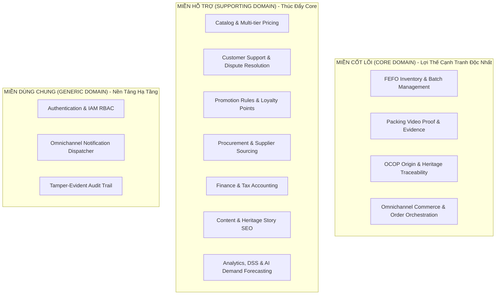
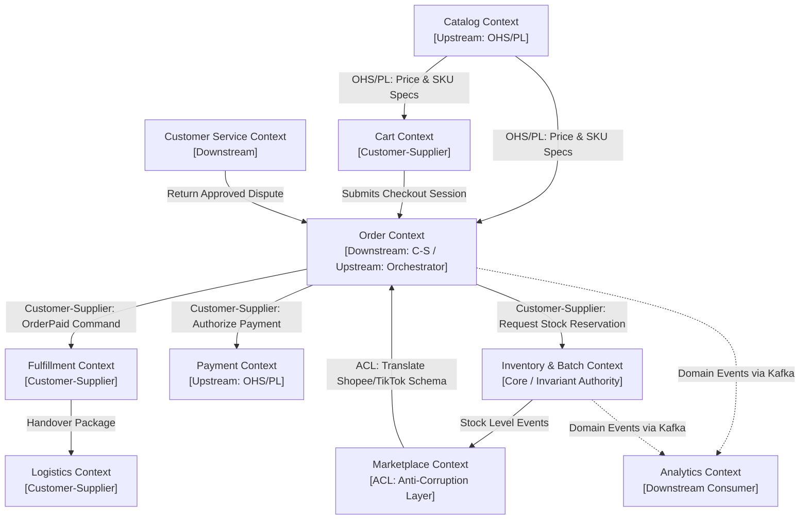
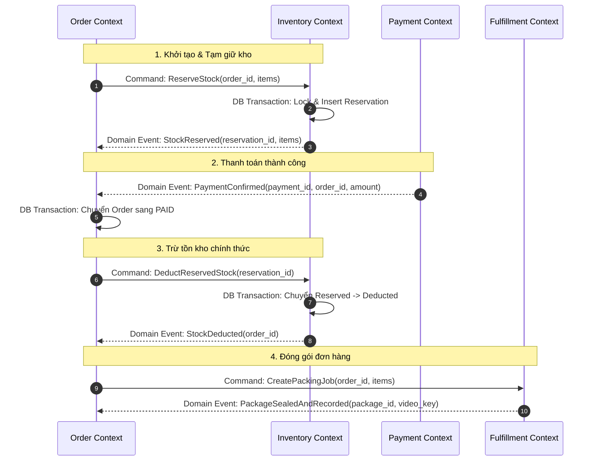
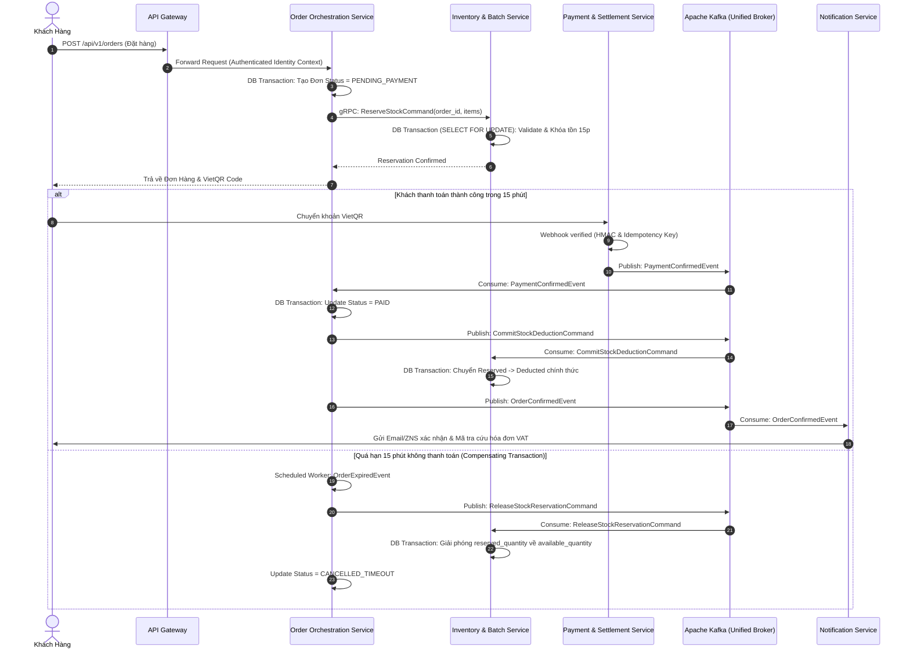
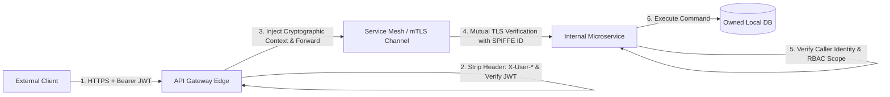
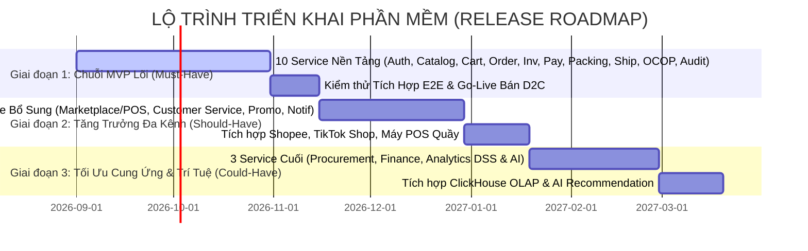

# KIẾN TRÚC HỆ THỐNG TỔNG THỂ (SYSTEM DESIGN DOCUMENT)
## HỆ SINH THÁI THƯƠNG MẠI ĐIỆN TỬ ĐA KÊNH & CHUỖI CUNG ỨNG ĐẶC SẢN OCOP HUẾ (MÈ XỬNG O MẠ)

---

## MỤC LỤC CHI TIẾT
1. [Bối Cảnh Kinh Doanh & Động Lực Kiến Trúc (Business Context & Architectural Drivers)](#1-bối-cảnh-kinh-doanh--động-lực-kiến-trúc-business-context--architectural-drivers)
2. [Tác Nhân & Quy Trình Nghiệp Vụ Cốt Lõi (Actors & Core Business Processes)](#2-tác-nhân--quy-trình-nghiệp-vụ-cốt-lõi-actors--core-business-processes)
3. [Bản Đồ Năng Lực Nghiệp Vụ (Business Capability Map)](#3-bản-đồ-năng-lực-nghiệp-vụ-business-capability-map)
4. [Khám Phá Miền Nghiệp Vụ (Domain Discovery & Subdomains)](#4-khám-phá-miền-nghiệp-vụ-domain-discovery--subdomains)
5. [Phân Loại Miền Nghiệp Vụ (Core, Supporting, Generic Classification)](#5-phân-loại-miền-nghiệp-vụ-core-supporting-generic-classification)
6. [Khám Phá Ngữ Cảnh Giới Hạn & Ngôn Ngữ Phổ Quát (Bounded Context Discovery)](#6-khám-phá-ngữ-cảnh-giới-hạn--ngôn-ngữ-phổ-quát-bounded-context-discovery)
7. [Mô Hình Miền, Cụm Thực Thể & Bất Biến Nghiệp Vụ (Domain Model & Aggregates)](#7-mô-hình-miền-cụm-thực-thể--bất-biến-nghiệp-vụ-domain-model--aggregates)
8. [Bản Đồ Ngữ Cảnh Chiến Lược (Strategic Context Mapping)](#8-bản-đồ-ngữ-cảnh-chiến-lược-strategic-context-mapping)
9. [Sự Kiện Miền & Lệnh Nghiệp Vụ (Domain Events & Commands)](#9-sự-kiện-miền--lệnh-nghiệp-vụ-domain-events--commands)
10. [Từ Bounded Context Tới Ranh Giới Microservice (Service Boundary Evaluation & Catalog)](#10-từ-bounded-context-tới-ranh-giới-microservice-service-boundary-evaluation--catalog)
11. [Quyền Sở Hữu Dữ Liệu & Ranh Giới Bất Khả Xâm Phạm (Data Ownership & Polyglot Persistence)](#11-quyền-sở-hữu-dữ-liệu--ranh-giới-bất-khả-xâm-phạm-data-ownership--polyglot-persistence)
12. [Kiến Trúc Tương Tác & Trục Truyền Thông Kafka (Service Communication Architecture)](#12-kiến-trúc-tương-tác--trục-truyền-thông-kafka-service-communication-architecture)
13. [Giao Dịch Phân Tán & 6 Luồng Saga Trọng Yếu (Distributed Transactions & Saga)](#13-giao-dịch-phân-tán--6-luồng-saga-trọng-yếu-distributed-transactions--saga)
14. [Sơ Đồ Kiến Trúc Hệ Thống Tổng Thể (System Architecture Diagram)](#14-sơ-đồ-kiến-trúc-hệ-thống-tổng-thể-system-architecture-diagram)
15. [Kiến Trúc Bảo Mật Zero-Trust & Định Danh mTLS (Security Architecture)](#15-kiến-trúc-bảo-mật-zero-trust--định-danh-mtls-security-architecture)
16. [Tính Toàn Vẹn Kiểm Toán Bất Biến (Audit Trail & Hash Chain)](#16-tính-toàn-vẹn-kiểm-toán-bất-biến-audit-trail--hash-chain)
17. [Ma Trận Ánh Xạ NFR Sang Quyết Định Kỹ Thuật (Traceability Matrix)](#17-ma-trận-ánh-xạ-nfr-sang-quyết-định-kỹ-thuật-traceability-matrix)
18. [Hạ Tầng Triển Khai & Vận Hành (Deployment Infrastructure)](#18-hạ-tầng-triển-khai--vận-hành-deployment-infrastructure)
19. [Khả Năng Quan Sát & CI/CD Pipeline (Observability & CI/CD)](#19-khả-năng-quan-sát--cicd-pipeline-observability--cicd)
20. [Đánh Đổi Kiến Trúc & Biện Pháp Giảm Thiểu (Architectural Trade-offs & Mitigations)](#20-đánh-đổi-kiến-trúc--biện-pháp-giảm-thiểu-architectural-trade-offs--mitigations)
21. [Lộ Trình Triển Khai Phát Triển (Release Roadmap)](#21-lộ-trình-triển-khai-phát-triển-release-roadmap)

---

## 1. BỐI CẢNH KINH DOANH & ĐỘNG LỰC KIẾN TRÚC (BUSINESS CONTEXT & ARCHITECTURAL DRIVERS)

### 1.1. Bối Cảnh & Mục Tiêu Kinh Doanh (Business Goals)
Mè Xửng O Mạ là thương hiệu sản xuất và kinh doanh đặc sản truyền thống Huế đạt chuẩn OCOP. Doanh nghiệp mở rộng quy mô từ xưởng thủ công sang chuỗi cung ứng hiện đại đa kênh nhằm thực hiện các mục tiêu chiến lược:
1. **Thương mại D2C Trực Tuyến:** Trực tiếp phục vụ khách du lịch và người tiêu dùng trên toàn quốc qua Website và Native Mobile App.
2. **Khai Thác Bán Hàng Đa Kênh (Omnichannel):** Tiếp nhận đơn hàng và tiêu thụ từ Sàn TMĐT (Shopee, TikTok Shop) kết hợp Quầy bán lẻ Offline (POS tại xưởng, đại lý phân phối).
3. **Thị Trường B2B & Hộp Quà Doanh Nghiệp:** Cung ứng đơn hàng số lượng lớn, hỗ trợ thiết kế in ấn logo doanh nghiệp và chính sách thanh toán công nợ B2B.
4. **Quản Lý Tồn Kho & Chuỗi Cung Ứng Thực Phẩm An Toàn:** Kiểm soát vòng đời nguyên liệu (mè, đậu phộng, đường mạch nha), theo dõi chặt chẽ Lô (Batch), Ngày sản xuất - Hạn sử dụng (NSX - HSD) theo cơ chế **FEFO (First Expired, First Out)**.
5. **Đóng Gói Minh Bạch & Triệt Tiêu Khiếu Nại Ảo:** Tự động hóa công đoạn dán tem niêm phong kiện hàng và quay Video Đóng Gói (Packing Video) làm bằng chứng giải quyết khiếu nại vỡ nát/thiếu hàng.
6. **Số Hóa Di Sản & Minh Bạch Nguồn Gốc OCOP:** Cung cấp mã QR Story cho từng lô hàng, cho phép người tiêu dùng truy xuất nguồn gốc nguyên liệu đạt chuẩn OCOP.
7. **Trợ Lý Thông Minh Hỗ Trợ Quyết Định (DSS & AI):** Dự báo nhu cầu nhập kho mùa cao điểm Tết, phân nhóm khách hàng RFM và tối ưu hóa chính sách chiết khấu.

### 1.2. Ràng Buộc Nghiệp Vụ Cốt Lõi (Business Constraints)
- **BR-ANTI-OVERSELLING:** Tuyệt đối không được bán vượt quá tồn kho khả dụng khi phát sinh giao dịch đồng thời từ Website, Sàn TMĐT và Quầy POS.
- **BR-FEFO:** Bắt buộc ưu tiên xuất các lô hàng có hạn sử dụng gần hơn trước; cấm xuất bán hoặc đóng gói sản phẩm đã hết hạn.
- **BR-VIETQR-AUTOMATION:** Tự động hóa đối soát thanh toán chuyển khoản qua VietQR, xử lý webhook bất đồng bộ kèm kiểm tra tính toàn vẹn (Idempotency Key & HMAC).
- **BR-3PL-INTEGRATION:** Tự động đẩy vận đơn và đồng bộ lộ trình theo thời gian thực với các đơn vị vận chuyển (GHN, ViettelPost).
- **BR-MEDIA-PRIVACY:** Video đóng gói là dữ liệu nội bộ nhạy cảm, tuyệt đối không công khai URL trực tiếp; chỉ cấp quyền xem có thời hạn (Pre-signed URL TTL 15 phút).
- **BR-AUDIT-INTEGRITY:** Mọi thao tác duyệt giá, xuất nhập kho, thay đổi trạng thái đơn và phân quyền nhân sự phải được ghi nhận kiểm toán bất biến (Tamper-evident Hash Chain).

---

## 2. TÁC NHÂN & QUY TRÌNH NGHIỆP VỤ CỐT LÕI (ACTORS & CORE BUSINESS PROCESSES)

### 2.1. Phân Loại Tác Nhân Hệ Thống (Actors)
- **Khách hàng bên ngoài:** Guest Customer (ACT-01), Registered Customer (ACT-02), B2B Corporate Client (ACT-03), Marketplace Customer (ACT-04), Offline Store Customer (ACT-05).
- **Nhân sự vận hành nội bộ:** Warehouse Staff (ACT-06), Packing Staff (ACT-07), Delivery Staff (ACT-08), Marketplace Operator (ACT-09), Offline Sales Staff (ACT-10), Customer Service Agent (ACT-11), Sales Manager (ACT-12), Content & SEO Manager (ACT-13), Marketing Staff (ACT-14), Supply Manager (ACT-15), Executive / Board of Directors (ACT-16), System Admin (ACT-17), Auditor (ACT-18), Accountant / Finance Staff (ACT-19).
- **Hệ thống đối tác tích hợp (External Partners):** Payment Gateway (EXT-01), VietQR/Bank (EXT-02), 3PL Logistics GHN/ViettelPost (EXT-03), Shopee/TikTok Partner API (EXT-04), Identity Providers (EXT-05), Notification Provider (EXT-06), S3/MinIO Storage (EXT-09), Tax/E-Invoice Provider (EXT-11).

### 2.2. Các Quy Trình Nghiệp Vụ Đầu-Cuối (End-to-End Business Processes)

#### A. Quy Trình Mua Sắm D2C & Đóng Gói (Order-to-Delivery Process)
```text
Khách duyệt hàng -> Thêm Giỏ -> Chọn Địa chỉ & Voucher -> Bấm Đặt Hàng (Pending Payment)
         │
         ├──> [Inventory DB Transaction]: Tạm giữ Tồn kho Khả dụng (TTL 15 phút)
         │
         ├──> Quét mã VietQR -> Webhook Xác nhận Thanh toán Thành công (Order Paid)
         │
         ├──> Trừ tồn kho chính thức theo Lô FEFO -> In Phiếu Xuất Kho & Tem Niêm Phong
         │
         ├──> Thủ kho lấy hàng -> Nhân viên đóng gói quay Video Bằng Chứng -> Gắn Mã Kiện
         │
         └──> Đẩy đơn sang 3PL (GHN/ViettelPost) -> Đồng bộ Lộ trình -> Giao Hàng Thành Công
```

#### B. Quy Trình Khiếu Nại, Kiểm Định & Hoàn Tiền (Return & Inspection Process)
```text
Khách gửi Ticket khiếu nại (Kèm ảnh vỡ) -> CSKH đối chiếu Packing Video tại xưởng
         │
         ├──> Sales Manager phê duyệt Yêu cầu Đổi/Trả (Return Approved)
         │
         ├──> Khách gửi hàng hoàn về xưởng -> Thủ kho tiếp nhận kiện hàng hoàn
         │
         ├──> [Kiểm định Chất lượng]: Phân loại Hàng nguyên vẹn (Restock) hoặc Hàng vỡ (Quarantine/Destroy)
         │
         └──> Kích hoạt Refund Engine hoàn tiền về tài khoản gốc -> Kế toán ghi giảm doanh thu & VAT
```

#### C. Quy Trình Đồng Bộ Hai Chiều Sàn TMĐT (Marketplace Two-Way Sync Process)
```text
[Chiều Inbound]: Đơn Shopee/TikTok mới -> Webhook Sàn -> Bắt đơn, Chuẩn hóa mã SKU nội bộ
         │
         └──> Khóa/Trừ ngay Tồn kho khả dụng dùng chung (Ngăn chặn Overselling)
[Chiều Outbound]: Đơn phát sinh tại Web D2C / POS Quầy -> Tồn kho khả dụng thay đổi
         │
         └──> Phát sự kiện thay đổi tồn -> Gọi Partner API cập nhật số lượng khả dụng lên Shopee & TikTok
```

---

## 3. BẢN ĐỒ NĂNG LỰC NGHIỆP VỤ (BUSINESS CAPABILITY MAP)

Bản đồ năng lực trả lời câu hỏi cốt lõi: *"Hệ sinh thái Mè Xửng O Mạ phải có khả năng làm được những gì để tạo ra giá trị?"* trước khi xác định bất kỳ domain hay giải pháp kỹ thuật nào:

```text
HỆ SINH THÁI MÈ XỬNG O MẠ — BẢN ĐỒ NĂNG LỰC DOANH NGHIỆP
│
├── 1. COMMERCE CAPABILITIES (NĂNG LỰC THƯƠNG MẠI)
│   ├── Product & Catalog Discovery (Quản lý thông tin sản phẩm, biến thể, hình ảnh, bài viết)
│   ├── Multi-tier Pricing & Promotion Rule (Giá niêm yết, giá khuyến mãi, bảng giá sỉ B2B)
│   ├── Cart & Checkout Experience (Giỏ hàng, session mua sắm, voucher, thiệp quà tặng)
│   ├── Order Lifecycle Orchestration (Khởi tạo, hủy, chuyển đổi trạng thái đơn hàng)
│   └── B2B Corporate Gifting (Báo giá đơn sỉ, in ấn logo thương hiệu, hợp đồng công nợ)
│
├── 2. SUPPLY CHAIN & FULFILLMENT CAPABILITIES (NĂNG LỰC CHUỖI CUNG ỨNG)
│   ├── Procurement & Sourcing (Quản lý hồ sơ nhà cung ứng OCOP, phát hành PO mua nguyên liệu)
│   ├── Raw Material & Quality Intake (Nghiệm thu nguyên liệu mè, đậu phộng, đường mạch nha)
│   ├── Batch & Expiry Tracking (Quản lý Lô sản xuất, ngày sản xuất, hạn sử dụng)
│   ├── FEFO Stock Allocation (Tự động chỉ định xuất các Lô có hạn sử dụng gần nhất trước)
│   ├── Anti-Overselling Concurrency Protection (Bảo vệ tồn kho khả dụng không bị âm)
│   ├── Packing Verification & Evidence (Đóng gói đơn hàng, gắn tem niêm phong, lưu video bằng chứng)
│   └── Carrier Routing & Tracking (Đẩy vận đơn 3PL, đối soát giao vận, tracking lộ trình)
│
├── 3. CHANNEL MANAGEMENT CAPABILITIES (NĂNG LỰC PHÂN PHỐI ĐA KÊNH)
│   ├── D2C Web & Mobile Experience (Kênh bán hàng trực tiếp tới người tiêu dùng)
│   ├── Marketplace Inbound & Outbound Sync (Đồng bộ đơn hàng, kho và giá với Shopee, TikTok Shop)
│   └── Offline POS Retail Operations (Quét mã vạch, in hóa đơn quầy, quản lý ca thu ngân tại điểm bán)
│
├── 4. CUSTOMER ENGAGEMENT CAPABILITIES (NĂNG LỰC KHÁCH HÀNG & GIỮ CHÂN)
│   ├── Dispute & Return Management (Tiếp nhận khiếu nại, đối chiếu video, xử lý đổi trả)
│   ├── Verified Product Reviews (Đánh giá sản phẩm đã xác thực mua hàng, trả lời phản hồi)
│   ├── Coupon & Discount Allocation (Áp dụng mã giảm giá, kiểm soát hạn mức coupon)
│   └── Loyalty Points & Reordering (Tích lũy điểm thưởng thành viên, hỗ trợ đặt lại đơn nhanh)
│
├── 5. HERITAGE & TRACEABILITY CAPABILITIES (NĂNG LỰC TRUYỀN THÔNG DI SẢN OCOP)
│   ├── OCOP Origin & Supply Chain Traceability (Số hóa vùng trồng nguyên liệu, phát hành mã QR Story)
│   └── Heritage Storytelling & Content SEO (Quản lý bài viết văn hóa Huế, tối ưu hóa công cụ tìm kiếm)
│
├── 6. FINANCIAL COMPLIANCE CAPABILITIES (NĂNG LỰC TÀI CHÍNH & TUÂN THỦ)
│   ├── Automated Payment Processing (Xử lý thanh toán VietQR, kiểm tra tính toàn vẹn giao dịch)
│   ├── Multi-channel Settlement & General Ledger (Đối soát công nợ 3PL, phí sàn TMĐT, sổ cái kế toán)
│   └── Electronic VAT Invoicing (Kết nối phần mềm hóa đơn điện tử cho doanh nghiệp và cá nhân)
│
├── 7. ENTERPRISE INTELLIGENCE CAPABILITIES (NĂNG LỰC PHÂN TÍCH & TRỢ LÝ RA QUYẾT ĐỊNH)
│   ├── Operational BI & Dashboards (Báo cáo doanh thu, sản phẩm bán chạy, tồn kho thời gian thực)
│   ├── Seasonal Demand Forecasting (Dự báo nhu cầu tiêu thụ và kế hoạch sản xuất vụ Tết)
│   ├── Customer RFM Segmentation (Phân nhóm khách hàng trung thành, tiềm năng, nguy cơ rời bỏ)
│   └── AI Discovery & Recommendation (Trợ lý gợi ý hộp quà Tết theo sở thích và ngân sách)
│
└── 8. CROSS-CUTTING SECURITY & INFRASTRUCTURE (NĂNG LỰC HẠ TẦNG DÙNG CHUNG)
    ├── Identity & Access Management (Xác thực người dùng, bảo mật 2FA, phân quyền RBAC nhân sự)
    ├── Omnichannel Notification Dispatcher (Hàng đợi gửi Email, SMS Brandname, ZNS, Push FCM)
    └── Tamper-Evident Audit Trail (Lưu vết thao tác nhạy cảm, chuỗi băm mật mã chống chỉnh sửa)
```

---

## 4. KHÁM PHÁ MIỀN NGHIỆP VỤ (DOMAIN DISCOVERY & SUBDOMAINS)

Từ Bản đồ Năng lực Nghiệp vụ (Capabilities), chúng ta thiết lập chuỗi ánh xạ suy luận chặt chẽ:
$$\text{Business Goals} \longrightarrow \text{Business Processes} \longrightarrow \text{Capabilities} \longrightarrow \text{Domains \& Subdomains}$$

| Năng Lực Nghiệp Vụ (Capabilities) | Miền Nghiệp Vụ (Domain) | Miền Con (Subdomain) |
|---|---|---|
| Product Discovery, Multi-tier Pricing | Commerce | **Catalog & Pricing Subdomain** |
| Cart & Checkout Experience, Gifting | Commerce | **Cart & Checkout Subdomain** |
| Order Lifecycle, B2B Corporate Gifting | Commerce | **Order Orchestration Subdomain** |
| Batch Tracking, FEFO Allocation, Anti-overselling | Supply Chain | **Inventory & Batch Subdomain** |
| Packing Verification, Evidence Storage | Supply Chain | **Fulfillment & Packing Video Subdomain** |
| Carrier Routing, 3PL Integration | Supply Chain | **Shipping & Logistics Subdomain** |
| Marketplace Sync, Offline POS Operations | Channel Management | **Marketplace & Offline POS Subdomain** |
| Dispute Resolution, Verified Reviews | Customer Engagement | **Customer Care & Review Subdomain** |
| Promotion Rules, Loyalty Points | Customer Engagement | **Promotion & Loyalty Subdomain** |
| OCOP Origin Traceability, Heritage SEO | Heritage & Media | **Content & OCOP Traceability Subdomain** |
| Sourcing, Raw Material Quality Intake | Sourcing & Supply | **Procurement & Supplier Subdomain** |
| Payment Processing, Settlement & VAT | Finance & Treasury | **Payment & Settlement Subdomain**, **Finance Subdomain** |
| Operational BI, Forecasting, AI Recommendation | Enterprise Intelligence | **Analytics, DSS & AI Subdomain** |
| Identity Management, RBAC | Enterprise Platform | **Auth & IAM Subdomain** |
| Multi-channel Notification Dispatch | Enterprise Platform | **Notification Subdomain** |
| Tamper-evident Audit Compliance | Enterprise Platform | **Audit Log Subdomain** |

---

## 5. PHÂN LOẠI MIỀN NGHIỆP VỤ (CORE, SUPPORTING, GENERIC CLASSIFICATION)

Theo chuẩn Strategic DDD, **Core Domain** không đơn thuần là thứ tạo ra doanh thu, mà là nơi doanh nghiệp sở hữu **logic nghiệp vụ đặc thù, độc nhất, tạo ra lợi thế cạnh tranh cốt lõi mà không thể mua được từ phần mềm thương mại đại trà**.



#### Ma Trận Chiến Lược Đánh Giá Miền Nghiệp Vụ (DDD Strategic Matrix):

| Phân Loại Miền | Miền Con (Subdomain) | Độ Phức Tạp Nghiệp Vụ | Giá Trị Cạnh Tranh | Chiến Lược Xây Dựng / Sở Hữu (Sourcing) |
|---|---|:---:|:---:|---|
| **Core Domain** | **FEFO Inventory & Batch** | Rất Cao | Tối Thượng | **Tự xây dựng độc quyền (Custom Build)**: Kiểm soát date < 45 ngày, phân bổ lô theo FEFO, chống overselling đa kênh. |
| **Core Domain** | **Packing Video Proof** | Cao | Rất Cao | **Tự xây dựng độc quyền (Custom Build)**: Tích hợp camera xưởng, tem niêm phong, cấp Pre-signed URL bảo mật triệt tiêu gian lận. |
| **Core Domain** | **OCOP Origin Traceability**| Trung Bình | Rất Cao | **Tự xây dựng độc quyền (Custom Build)**: Số hóa câu chuyện làng nghề Quảng Điền, mã QR Story minh bạch nguồn gốc. |
| **Core Domain** | **Order Orchestration** | Rất Cao | Rất Cao | **Tự xây dựng độc quyền (Custom Build)**: Điều phối Saga, tích hợp B2B đơn sỉ in logo quà Tết. |
| **Supporting** | **Catalog & Pricing** | Trung Bình | Cao | **Tự phát triển**: Quản lý biến thể SKU, giá sỉ/lẻ, tích hợp Elasticsearch tìm kiếm. |
| **Supporting** | **Customer Support** | Trung Bình | Trung Bình | **Tự phát triển / Tích hợp**: Xử lý ticket khiếu nại, chat log, verified reviews. |
| **Supporting** | **Promotion & Loyalty** | Trung Bình | Trung Bình | **Tự phát triển**: Thiết lập voucher, combo giỏ quà Tết, điểm thưởng thành viên. |
| **Supporting** | **Procurement & Sourcing**| Trung Bình | Trung Bình | **Tự phát triển**: Lập PO mua nguyên liệu mè, đậu phộng từ nông dân OCOP. |
| **Supporting** | **Finance & Accounting** | Trung Bình | Trung Bình | **Tự phát triển + Tích hợp**: Đối soát công nợ, xuất hóa đơn điện tử VAT. |
| **Supporting** | **Content & SEO** | Thấp | Trung Bình | **Tự phát triển (Headless CMS)**: Bài viết văn hóa ẩm thực Huế chuẩn SEO. |
| **Strategic Data**| **Analytics, DSS & AI** | Rất Cao | Cao | **Tự phát triển (Data Platform)**: Kho OLAP ClickHouse, phân nhóm RFM, gợi ý quà thông minh. |
| **Generic** | **Auth & IAM** | Thấp | Thấp | **Sử dụng chuẩn công nghiệp**: OAuth2, JWT, Spring Security / Keycloak RBAC. |
| **Generic** | **Notification Service** | Thấp | Thấp | **Sử dụng dịch vụ thứ 3**: SendGrid (Email), Zalo ZNS, SMS Brandname, Firebase FCM. |
| **Generic** | **Audit Log Service** | Trung Bình | Thấp | **Tự phát triển chuẩn**: Kafka Event Stream + PostgreSQL Append-Only + HMAC-SHA256. |


1. **Miền Cốt Lõi (Core Domains):**
   - `Inventory, Batch & FEFO`: Bài toán đặc thù của đặc sản truyền thống (hạn dùng ngắn, phụ thuộc mùa vụ mè/đậu). Hệ thống kiểm soát từng Lô (Batch), chống bán vượt đa kênh và điều phối xuất kho theo nguyên tắc FEFO.
   - `Packing & Video Verification`: Camera tự động ghi lại thao tác đóng gói và niêm phong hộp mè xửng, liên kết trực tiếp với mã kiện để triệt tiêu gian lận khiếu nại vỡ nát khi vận chuyển xa.
   - `OCOP Origin Traceability`: Số hóa hành trình nguyên liệu từ làng nghề truyền thống Quảng Điền đến sản phẩm đóng gói, tạo niềm tin thương hiệu vững chắc.
   - `Omnichannel Commerce & Order Orchestration`: Tiếp nhận, chuẩn hóa và điều phối luồng đơn hàng từ Web D2C, Sàn TMĐT và Quầy POS, kết hợp giải pháp hộp quà Tết B2B.
2. **Miền Hỗ Trợ (Supporting Domains):**
   - `Procurement & Supplier`, `Customer Service & Reviews`, `Promotion & Loyalty`, `Finance & VAT Accounting`, `Content & SEO`, `Analytics, DSS & AI` (năng lực phân tích dữ liệu chiến lược phục vụ Core).
3. **Miền Dùng Chung (Generic Domains):**
   - `Auth & IAM`, `Omnichannel Notification`, `Immutable Audit Compliance` (thành phần tiêu chuẩn của phần mềm doanh nghiệp).

---

## 6. KHÁM PHÁ NGỮ CẢNH GIỚI HẠN & NGÔN NGỮ PHỔ QUÁT (BOUNDED CONTEXT DISCOVERY)

Ranh giới Bounded Context được phát hiện dựa trên sự phân tách ngữ nghĩa trong **Ngôn Ngữ Phổ Quát (Ubiquitous Language)**. Khi cùng một danh từ nghiệp vụ nhưng lại mang thuộc tính, hành vi và bất biến khác nhau trong các quy trình khác nhau, đó là tín hiệu bắt buộc phải phân tách Context:

| Khái Niệm Nghiệp Vụ | Trong Catalog Context | Trong Inventory Context | Trong Fulfillment Context | Trong Finance Context |
|---|---|---|---|---|
| **Sản phẩm (Product)** | Thông tin tiếp thị, mô tả thành phần, hình ảnh, bài viết di sản, giá niêm yết. | Mã SKU vật lý, Lô (Batch), Ngày sản xuất, Hạn sử dụng, Số lượng khả dụng / tạm giữ. | Kiện hàng đóng gói, kích thước 3 chiều (D x R x C), khối lượng tính cước, tem niêm phong. | Mã định danh tài sản hàng hóa, giá vốn bình quân gia quyền (COGS), thuế suất GTGT. |
| **Giá (Price)** | Giá niêm yết công khai, giá gạch bỏ, bảng giá sỉ theo số lượng. | — (Không quan tâm giá) | — (Không quan tâm giá) | Doanh thu thực thu sau voucher sàn, chiết khấu thương mại, giá vốn hàng bán. |
| **Đơn hàng (Order)** | Giỏ hàng tạm thời, danh sách sản phẩm chờ thanh toán. | Lệnh tạm giữ tồn kho (Stock Reservation), Lệnh xuất kho (Picking List). | Lệnh đóng gói kiện hàng (Packing Job), Phiếu giao vận (Waybill), Video liên kết. | Giao dịch phát sinh doanh thu, Công nợ phải thu (Accounts Receivable). |
| **Khách hàng (Customer)** | Người xem danh mục, thông tin tài khoản mua hàng. | — | Địa chỉ người nhận, ghi chú giao hàng kín đáo (quà tặng gửi hộ). | Mã số thuế doanh nghiệp (B2B), thông tin người nộp thuế, lịch sử đối soát. |

---

## 7. MÔ HÌNH MIỀN, CỤM THỰC THỂ & BẤT BIẾN NGHIỆP VỤ (DOMAIN MODEL & AGGREGATES)

Trong mỗi Bounded Context, logic nghiệp vụ được bảo vệ bởi các **Cụm Thực Thể (Aggregates)**. Mỗi Aggregate có một **Gốc Cụm (Aggregate Root)** chịu trách nhiệm thực thi các **Quy tắc Bất biến (Business Invariants)** bên trong ranh giới giao dịch cục bộ:

### 7.1. Inventory & Batch Context
```text
Aggregate Root: InventoryItem
├── Value Object: SKU (e.g. "MX-ME-DEN-250G")
├── Value Object: WarehouseLocation (Zone, Shelf)
├── Entity: Batch
│   ├── Attribute: batch_id (UUID)
│   ├── Attribute: batch_code (String, e.g. "LOT-MXM-20260905")
│   ├── Attribute: manufacturing_date (Date)
│   ├── Attribute: expiry_date (Date)
│   ├── Attribute: physical_quantity (Integer)
│   └── Attribute: reserved_quantity (Integer)
└── Business Invariants (Bất biến nghiệp vụ bắt buộc):
    ├── available_quantity = physical_quantity - reserved_quantity
    ├── available_quantity LUÔN LUÔN >= 0 (Tuyệt đối không có tồn kho âm)
    ├── expired_batch (expiry_date <= CURRENT_DATE) BỊ CẤM phân bổ xuất kho
    └── Phân bổ xuất kho tự động sắp xếp theo expiry_date ASC (Nguyên tắc FEFO)

Aggregate Root: StockReservation
├── Attribute: reservation_id (UUID)
├── Attribute: order_id (UUID)
├── Attribute: sku (Value Object)
├── Attribute: reserved_quantity (Integer)
├── Attribute: status (RESERVED, COMMITTED, EXPIRED, CANCELLED)
├── Attribute: expires_at (Timestamp - TTL 15 phút)
└── Business Invariants:
    └── Một reservation quá hạn (expires_at < NOW) phải giải phóng reserved_quantity về available_quantity
```

### 7.2. Order Context
```text
Aggregate Root: CustomerOrder
├── Value Object: OrderId (UUID)
├── Value Object: CustomerInfo (customer_id, shipping_address, phone_masked)
├── Entity: OrderLineItem (sku, quantity, unit_price, discount_amount)
├── Value Object: PaymentSummary (subtotal, shipping_fee, voucher_discount, final_total)
├── Value Object: OrderStatus (Enum: PENDING_PAYMENT, PAID, PACKING, SHIPPING, DELIVERED, CANCELLED)
└── Business Invariants:
    ├── final_total = subtotal + shipping_fee - voucher_discount (>= 0)
    ├── Chỉ được chuyển sang trạng thái PAID khi nhận sự kiện thanh toán hợp lệ
    └── Chỉ cho phép khách hàng tự hủy khi trạng thái còn là PENDING_PAYMENT
```

### 7.3. Fulfillment & Packing Context
```text
Aggregate Root: FulfillmentPackage
├── Value Object: PackageDimensions (Length, Width, Height, WeightInGrams)
├── Value Object: SealTagNumber (Mã niêm phong vật lý)
├── Entity: PackingEvidence
│   ├── Attribute: evidence_id (UUID)
│   ├── Attribute: video_s3_key (String, e.g. "videos/2026/09/pkg_9876.mp4")
│   ├── Attribute: video_duration_seconds (Integer)
│   ├── Attribute: recorded_by_staff_id (UUID)
│   └── Attribute: recorded_at (Timestamp)
└── Business Invariants:
    ├── Đơn hàng bắt buộc quay video chỉ được sang READY_TO_SHIP khi đã liên kết video_s3_key hợp lệ
    └── Video đóng gói là tài sản riêng tư; chỉ cấp phát Pre-signed URL có TTL tối đa 15 phút
```

---

## 8. BẢN ĐỒ NGỮ CẢNH CHIẾN LƯỢC (STRATEGIC CONTEXT MAPPING)

Bản đồ thể hiện quan hệ phụ thuộc ngữ cảnh nghiệp vụ thuần túy bằng các mẫu thiết kế DDD chiến lược:
- **OHS (Open Host Service) / PL (Published Language):** Context thượng nguồn cung cấp giao diện chuẩn hóa.
- **ACL (Anti-Corruption Layer):** Tầng chống tha hóa giúp cách ly mô hình nội bộ khỏi schema dị biệt bên ngoài.
- **Customer-Supplier (C-S):** Quan hệ khách hàng - nhà cung ứng giữa các context nội bộ.
- **Downstream Consumer:** Ngữ cảnh chỉ đọc luồng sự kiện mà không can thiệp ngược lại giao dịch.



---

## 9. SỰ KIỆN MIỀN & LỆNH NGHIỆP VỤ (DOMAIN EVENTS & COMMANDS)

Để loại bỏ hiện tượng bùng nổ sự kiện (Event Explosion), **chỉ những thay đổi trạng thái có ý nghĩa đối với các Bounded Context khác mới được phát hành thành Domain Event** thông qua trục Apache Kafka.



### Danh Mục Các Domain Events Trọng Yếu:
1. `OrderPlacedEvent`: Phát khi khách xác nhận đặt đơn hàng trên Web/App.
2. `StockReservedEvent`: Phát khi Inventory Context tạm giữ thành công tồn kho theo lô.
3. `PaymentConfirmedEvent`: Phát khi Payment Context xác thực tiền vào tài khoản VietQR.
4. `StockDeductedEvent`: Phát khi Inventory Context trừ chính thức số lượng khả dụng.
5. `StockReservationExpiredEvent`: Phát khi hết hạn 15 phút chưa thanh toán $\rightarrow$ Kích hoạt bù trừ hoàn lại tồn kho.
6. `ReturnApprovedEvent`: Phát khi CSKH duyệt khiếu nại đổi trả hàng.
7. `GoodsInspectedEvent`: Phát khi thủ kho kiểm định chất lượng hàng hoàn (phân loại Restock hoặc Quarantine).
8. `StockLevelChangedEvent`: Phát khi có biến động tồn kho $\rightarrow$ Marketplace ACL đồng bộ lên Shopee/TikTok.

---

## 10. TỪ BOUNDED CONTEXT TỚI RANH GIỚI MICROSERVICE (SERVICE BOUNDARY EVALUATION & CATALOG)

### 10.1. Khung Thẩm Định Độc Lập Ranh Giới Dịch Vụ
Một Bounded Context không bắt buộc phải tương ứng 1-1 với một Microservice. Quyết định triển khai một Bounded Context thành một Microservice độc lập (Deployable Unit) được thẩm định qua 6 tiêu chí kỹ thuật khắt khe:

```text
Bounded Context Candidate
        │
        ├── 1. Business Cohesion (Tính gắn kết nội tại của mô hình nghiệp vụ)
        ├── 2. Data Ownership (Quyền sở hữu mô hình dữ liệu độc quyền)
        ├── 3. Change Coupling (Mức độ độc lập khi sửa đổi mã nguồn)
        ├── 4. Scalability Characteristics (Đặc tính co giãn theo tải)
        ├── 5. Failure Isolation (Khả năng cách ly khi gặp sự cố)
        └── 6. Team Ownership (Trách nhiệm của nhóm phát triển)
        │
        ▼
Quyết Định Triển Khai Microservice Độc Lập
```

### 10.2. Bảng Đánh Giá 17 Ứng Viên Dịch Vụ (Service Boundary Evaluation)

| Microservice Ứng Viên | Cohesion | Data Ownership | Scalability | Failure Isolation | Quyết Định & Lý Do Kiến Trúc |
|---|:---:|:---:|:---:|:---:|---|
| **1. Auth & IAM** | Rất cao | PostgreSQL + Redis (Token) | Cao (Scale theo auth requests) | Cực cao (Không sập core nghiệp vụ) | **Microservice độc lập**: Bảo vệ PII, quản lý RBAC tập trung cho toàn hệ sinh thái. |
| **2. Catalog & Pricing** | Cao | PostgreSQL + Elasticsearch | Rất cao (Tải xem hàng mùa Tết lớn) | Cao (Đọc qua cache khi DB nghẽn) | **Microservice độc lập**: Đọc nhiều (Read-heavy), tách biệt để co giãn độc lập. |
| **3. Cart & Checkout** | Rất cao | Redis (TTL In-Memory) | Cực cao (Thêm/xóa giỏ liên tục) | Cao (Không ảnh hưởng Order DB) | **Microservice độc lập**: Tần suất ghi cao, độ trễ cực thấp (< 5ms), quản lý session. |
| **4. Order Orchestration** | Rất cao | PostgreSQL (ACID Orders) | Cao (Tạo đơn phân tán) | Cực cao (Cô lập giao dịch đơn) | **Microservice độc lập**: Làm Process Manager cho toàn bộ các luồng Saga phân tán. |
| **5. Inventory & Batch** | Cực cao | PostgreSQL + Redis (Cache) | Rất cao (Truy vấn tồn đa kênh) | Tuyệt đối (Bảo vệ kho không âm) | **Microservice độc lập**: Bảo vệ bất biến nghiệp vụ tồn kho và điều phối xuất hàng FEFO. |
| **6. Payment & Settlement** | Rất cao | PostgreSQL (Payments, Keys) | Cao (Đột biến giờ Flash Sale) | Tuyệt đối (Cô lập giao dịch tiền tệ) | **Microservice độc lập**: Tích hợp VietQR, bảo vệ Idempotency, đối soát tài chính an toàn. |
| **7. Fulfillment & Video** | Cao | PostgreSQL + AWS S3/MinIO | Trung bình (Tải upload video xưởng) | Cao (Lưu trữ video độc lập) | **Microservice độc lập**: Quản lý Blob video dung lượng lớn và cấp Pre-signed URL bảo mật. |
| **8. Shipping & Logistics** | Cao | PostgreSQL (Waybills) | Trung bình (Đẩy đơn sang 3PL) | Cao (3PL lỗi không nghẽn kho) | **Microservice độc lập**: Đóng gói tích hợp API bên ngoài (GHN, ViettelPost). |
| **9. Marketplace & POS** | Rất cao | PostgreSQL (SKU Mapping) | Cao (Webhook sàn đổ về liên tục) | Rất cao (Sàn sập không ảnh hưởng Web) | **Microservice độc lập**: Đóng vai trò ACL chống tha hóa mô hình dữ liệu nội bộ. |
| **10. Customer Service** | Cao | MongoDB (Chat/Ticket Threads) | Trung bình (Hỗ trợ sau bán hàng) | Cao (Khiếu nại không ảnh hưởng mua hàng) | **Microservice độc lập**: Dữ liệu phi cấu trúc, quản lý Verified Review và đối chiếu khiếu nại. |
| **11. Promotion & Loyalty** | Cao | PostgreSQL + Redis (Voucher) | Rất cao (Xác thực voucher mùa sale) | Cao (Voucher lỗi không chặn mua hàng) | **Microservice độc lập**: Tính toán logic combo quà tặng Tết và điểm thưởng thành viên. |
| **12. Content & OCOP** | Cao | PostgreSQL (Heritage/CMS) | Trung bình (Đọc bài viết di sản) | Cao (Cache CDN toàn bộ) | **Microservice độc lập**: Phục vụ SEO/SSR và cung cấp dữ liệu QR Story OCOP minh bạch. |
| **13. Notification Service** | Rất cao | Redis Queue / Kafka | Cao (Hàng đợi gửi tin nhắn đa luồng) | Cực cao (Lỗi SMS/Email không ảnh hưởng DB) | **Microservice độc lập**: Trục thông báo phân tán qua Email, SMS, ZNS, Push FCM. |
| **14. Procurement & Supplier**| Cao | PostgreSQL (POs, Vendors) | Thấp (Tần suất nội bộ xưởng) | Cao (Tách biệt hoàn toàn luồng B2C) | **Microservice độc lập**: Quản lý hồ sơ nhà cung ứng OCOP và nghiệm thu nông sản đầu vào. |
| **15. Finance & Accounting** | Rất cao | PostgreSQL Data Mart | Thấp (Chạy đối soát định kỳ) | Tuyệt đối (Bảo vệ sổ cái kế toán) | **Microservice độc lập**: Hạch toán doanh thu, thuế GTGT và tích hợp hóa đơn điện tử. |
| **16. Analytics, DSS & AI** | Rất cao | ClickHouse (OLAP) + Mongo | Rất cao (Xử lý dữ liệu lớn) | Tuyệt đối (Không chiếm CPU của OLTP) | **Microservice độc lập**: Phân tích dữ liệu lớn, chạy mô hình RFM và trợ lý AI gợi ý quà. |
| **17. Audit Log Service** | Tuyệt đối | PostgreSQL (Append-Only) | Rất cao (Ghi nhận mọi thao tác) | Tuyệt đối (Consumer-Only an toàn) | **Microservice độc lập**: Lưu vết kiểm toán bất biến theo chuỗi băm HMAC-SHA256. |

---

## 11. QUYỀN SỞ HỮU DỮ LIỆU & RANH GIỚI BẤT KHẢ XÂM PHẠM (DATA OWNERSHIP & POLYGLOT PERSISTENCE)

Hệ thống tuân thủ triệt để nguyên tắc **Database per Service (Shared-Nothing Architecture)**:
- Mỗi Microservice toàn quyền sở hữu cơ sở dữ liệu riêng biệt.
- Không chia sẻ schema, không mở port cho service khác đọc/ghi trực tiếp vào DB nội bộ.
- Mọi tương tác xuyên ranh giới bắt buộc phải thông qua gRPC API hoặc sự kiện Kafka.

```text
┌──────────────────────────────────────┐     ┌──────────────────────────────────────┐
│        Order Orchestration           │     │          Inventory & Batch           │
│              Service                 │     │               Service                │
│                 │                    │     │                  │                   │
│                 ▼                    │     │                  ▼                   │
│         ┌───────────────┐            │     │          ┌───────────────┐           │
│         │   Order DB    │            │     │          │ Inventory DB  │           │
│         │ (PostgreSQL)  │            │     │          │ (PostgreSQL)  │           │
│         └───────────────┘            │     │          └───────────────┘           │
└─────────────────┬────────────────────┘     └──────────────────┬───────────────────┘
                  │                                             │
                  │            RANH GIỚI BẤT KHẢ XÂM PHẠM       │
                  └─────────────── X X X X X X X X ─────────────┘
                     (CẤM TUYỆT ĐỐI TRUY CẬP TRỰC TIẾP DB NHAU)
```

---

## 12. KIẾN TRÚC TƯƠNG TÁC HYBRID & TRỤC TRUYỀN THÔNG KAFKA (HYBRID COMMUNICATION ARCHITECTURE)

Trong hệ thống Microservices thực tế, không thể áp dụng cực đoan 100% Asynchronous (làm vỡ vụn trải nghiệm người dùng checkout và phức tạp hóa state machine không cần thiết), và cũng tuyệt đối cấm kỵ 100% Synchronous (biến hệ thống thành **Distributed Monolith**, liên kết quá chặt gây sụp đổ dây chuyền Cascading Failure).

Hệ sinh thái Mè Xửng O Mạ áp dụng mô hình **Kiến Trúc Tương Tác Lai (Hybrid Communication Architecture)** dựa trên ngữ nghĩa tương tác nghiệp vụ (**Interaction Semantics**):

```text
                               COMMUNICATION ARCHITECTURE
                                            │
                  ┌─────────────────────────┴─────────────────────────┐
                  ▼                                                   ▼
            SYNCHRONOUS                                         ASYNCHRONOUS
                  │                                                   │
        Need Immediate Result                               Eventual Consistency OK
        (Transaction Critical Path)                         (Downstream Side-effects / Workflows)
                  │                                                   │
             gRPC / REST                                         Apache Kafka
                  │                                                   │
    • Cart -> Catalog (Validate Price)                  • OrderPaid -> Notification (Email/SMS)
    • Order -> Inventory (Reserve Stock)                • OrderPaid -> Analytics (ClickHouse)
    • Order -> Payment (Authorize VietQR)               • OrderPaid -> Audit Log (Hash Chain)
    • Order Inbound -> Inventory (Reserve Pool)         • OrderPaid -> Fulfillment (Pack Job ACK)
```

---

### 12.1. Nguyên Tắc Phân Định Đồng Bộ vs Bất Đồng Bộ (Communication Principles)
1. **Giao tiếp Đồng bộ (Synchronous) - Chỉ dùng trên Critical Path:**
   - Áp dụng khi Client đang trực tiếp chờ phản hồi kết quả để hoàn tất giao dịch (User-facing blocking flow).
   - Áp dụng khi một hành động sau phụ thuộc 100% vào kết quả của hành động trước và không thể suy đoán (ví dụ: Không thể hoàn tất tạo đơn PENDING nếu chưa biết tồn kho có tạm giữ thành công hay không).
2. **Giao tiếp Bất đồng bộ (Asynchronous) - Trục xương sống cho Side-effects & Decoupling:**
   - Áp dụng cho mọi tác vụ xử lý hậu kỳ (Side-effects), thông báo, kiểm toán, và phân tích dữ liệu.
   - Cho phép các dịch vụ hạ nguồn tạm thời ngừng hoạt động (ví dụ: Notification Service hoặc Analytics Service bảo trì) mà luồng mua sắm cốt lõi vẫn diễn ra bình thường, tin nhắn được giữ an toàn trên Kafka để xử lý bù sau (Temporal Decoupling).

---

### 12.2. Giao Tiếp Đồng Bộ (Synchronous Interaction on Critical Path)
- **North-South (Client $\rightarrow$ API Gateway):**
  - Web D2C, POS Offline và Web Admin CMS giao tiếp qua **RESTful API (JSON over HTTPS)**.
  - Native Mobile App giao tiếp qua **GraphQL BFF Endpoint** để gộp nhiều truy vấn danh mục, banner, thông báo trong một round-trip duy nhất trên mạng di động.
- **East-West (Service $\rightarrow$ Service via gRPC):**
  - Sử dụng **gRPC (HTTP/2 Protocol Buffers)** với payload nhị phân siêu nhẹ và tốc độ tuần tự hóa cực cao.
- **Cơ Chế Phòng Vệ Tránh Sụp Đổ Dây Chuyền (Cascading Failure Prevention):**
  > [!CAUTION]
  > **Circuit Breaker tại tầng Order Orchestration Service (Không chỉ ở Gateway):**
  > Khi `Order Service` gọi gRPC sang `Inventory Service` hoặc `Payment Service`, nếu phụ thuộc đồng bộ mà không có cơ chế tự ngắt, sự cố tại Inventory DB sẽ kéo sập toàn bộ thread/connection pool của Order Service chỉ trong vài giây. Do đó, hệ thống bắt buộc áp dụng:
  > 1. **Strict Timeout ngắn:** Mọi lời gọi gRPC trên critical path có timeout tối đa **2.0 giây**.
  > 2. **Giới hạn Retry:** Tối đa **1 lần retry** (với Exponential Backoff), tuyệt đối không retry vô hạn vì sẽ gây giữ khóa phân tán quá hạn TTL.
  > 3. **Circuit Breaker nội bộ (Resilience4j / Envoy):** Nếu tỷ lệ lỗi của Inventory Service vượt quá 50% trong 10 giây, Breaker lập tức mở (OPEN). `Order Service` trả ngay lỗi nhanh *"Hệ thống tạm thời bận, vui lòng thử lại sau"* (Fast Failure) thay vì bắt khách hàng chờ đợi 30 giây rồi mới sập.

---

### 12.3. Giao Tiếp Bất Đồng Bộ (Asynchronous Event-Driven via Apache Kafka)

#### A. Phân Biệt Rành Mạch Event vs Command
- **Domain Event (Sự kiện miền):** Mang ý nghĩa *"Một việc đã xảy ra trong quá khứ"* (ví dụ: `OrderPaidEvent`, `StockReservedEvent`). Sự kiện mang tính thông báo, dịch vụ phát hành không quan tâm ai sẽ tiêu thụ nó.
- **Asynchronous Command (Lệnh bất đồng bộ):** Mang ý nghĩa *"Yêu cầu một dịch vụ khác thực thi hành động cụ thể"* (ví dụ: `ReleaseStockReservationCommand`, `DispatchNotificationCommand`). Lệnh này hướng đích rõ ràng tới một consumer cụ thể thông qua Kafka Topic riêng.

#### B. Chiến Lược Hàng Đợi Chết (Dead Letter Queue - DLQ & Re-drive Policy)
Khi một Asynchronous Consumer gặp lỗi không thể xử lý (ví dụ: `Notification Service` gọi sang SendGrid/Zalo ZNS bị lỗi 503 mạng kéo dài, hoặc payload tin nhắn bị lỗi cú pháp poison pill):
1. **Retry Topic:** Tin nhắn được đẩy sang retry topic với cơ chế giãn cách lũy tiến (10s, 30s, 2 phút, 10 phút, tối đa 5 lần).
2. **Dead Letter Queue (DLQ):** Nếu sau 5 lần retry vẫn thất bại, tin nhắn **không bao giờ bị xóa bỏ** mà tự động đẩy vào `dlq.notifications` hoặc `dlq.orders`.
3. **Re-drive & Tra Soát:** Kỹ sư vận hành được cảnh báo qua Slack/Telegram và có thể kích hoạt API Re-drive phát lại tin nhắn sau khi đối tác thứ 3 phục hồi, đảm bảo 0% mất mát giao dịch nghiệp vụ.

---

### 12.4. Ma Trận Quyết Định Giao Tiếp Hệ Thống (Communication Decision Matrix)

Bảng phân định chuẩn hóa mọi luồng tương tác giữa các service, chứng minh tính có căn cứ của từng quyết định:

| Luồng Tương Tác Giữa Các Dịch Vụ | Mô Thức | Giao Thức / Trục | Lý Do Thiết Kế Kiến Trúc & Ràng Buộc Nghiệp Vụ |
|---|:---:|:---:|---|
| **Client $\rightarrow$ API Gateway (Mobile)** | Đồng bộ | GraphQL BFF | Gom nhiều query màn hình home/catalog trong 1 round-trip di động. |
| **Client $\rightarrow$ API Gateway (Web/POS)** | Đồng bộ | RESTful HTTPS | Chuẩn hóa tài nguyên CRUD, dễ cache CDN và tương thích POS quầy. |
| **Cart $\rightarrow$ Catalog** | Đồng bộ | gRPC | Xác thực giá và tình trạng kinh doanh tức thời khi user mở giỏ hàng. |
| **Order $\rightarrow$ Inventory (D2C Checkout)** | Đồng bộ | gRPC Command | **Critical Path**: Cần câu trả lời ngay để quyết định tạo đơn PENDING (Timeout 2s, Max 1 Retry, Circuit Breaker). |
| **Order $\rightarrow$ Payment (Init VietQR)** | Đồng bộ | gRPC Command | Khởi tạo mã thanh toán VietQR động và đăng ký Idempotency Key tức thì. |
| **Payment Webhook $\rightarrow$ Order** | Bất đồng bộ | Kafka Event | Webhook ngân hàng bắn vào, Payment xử lý HMAC rồi phát `PaymentConfirmedEvent` lên Kafka. |
| **Order $\rightarrow$ Inventory (Commit Deduct)** | Bất đồng bộ | Kafka Command | Sau khi Paid, lệnh trừ kho chính thức chuyển qua Kafka, Inventory xử lý tin cậy qua Idempotent Consumer. |
| **Order $\rightarrow$ Fulfillment (Packing Job)** | Bất đồng bộ có ACK | Kafka Saga | **FEFO Nuance**: Phát lệnh đóng gói, Order chờ `PackingJobAcceptedEvent` trước khi sang `PROCESSING`. |
| **Order $\rightarrow$ Notification** | Bất đồng bộ | Kafka Event | Side-effect không quan trọng: SendGrid/ZNS lỗi không được phép làm nghẽn đơn hàng; có DLQ retry. |
| **Order $\rightarrow$ Analytics & AI** | Bất đồng bộ | Kafka Event | Stream sự kiện sang ClickHouse; phân tích dữ liệu lớn hoàn toàn tách biệt khỏi giao dịch OLTP. |
| **Order $\rightarrow$ Audit Log** | Bất đồng bộ | Kafka Event | Lưu vết bất biến kiểm toán theo chuỗi băm; Audit Service chạy Consumer-Only để cách ly an ninh. |
| **Marketplace Webhook $\rightarrow$ Order** | Bất đồng bộ | Kafka Event | Webhook Shopee/TikTok nhận vào nhanh, đẩy qua Kafka để xử lý tuần tự chống quá tải mạng. |
| **Order $\rightarrow$ Inventory (Marketplace)** | Đồng bộ | gRPC Command | **Anti-overselling Nuance**: Khi bóc đơn sàn từ Kafka, Order phải gọi sync gRPC khóa tồn kho dùng chung. |
| **Inventory $\rightarrow$ Marketplace (Outbound)** | Bất đồng bộ | Kafka Event | Khi tồn kho Web/POS đổi, phát event lên Kafka để worker gọi Partner API cập nhật lên sàn. |

---

### 12.5. Hai Đặc Thù Nghiệp Vụ Sống Còn Của Mè Xửng O Mạ (Domain Nuances)

#### Nuance 1: Đơn Hàng Sang Đóng Gói (Order $\rightarrow$ Fulfillment) Cần State Machine ACK
- **Vấn đề:** Mè Xửng là mặt hàng thực phẩm có HSD (Date ngắn dưới 45 ngày). Việc xuất kho tuân thủ nghiêm ngặt nguyên tắc **FEFO (First Expired, First Out)**. Nếu coi `Order` $\rightarrow$ `Fulfillment` là async dạng "bắn rồi quên" (Fire-and-forget), `Order Service` chuyển ngay trạng thái đơn sang `PROCESSING`, trong khi nhân viên xưởng chưa nhận việc hoặc hệ thống in tem lỗi. Hậu quả là các đơn hàng tiếp theo có thể bị phân bổ nhầm Lô (Batch) hoặc trừ kho ảo.
- **Giải pháp Kiến trúc:**
  - `Order Service` phát sự kiện `CreatePackingJobCommand` lên Kafka topic `fulfillment-jobs`.
  - `Fulfillment Service` nhận lệnh, phân bổ công việc cho nhân viên đóng gói cụ thể, gán mã Lô FEFO chính thức và phát lại sự kiện `PackingJobAcceptedEvent`.
  - `Order Orchestration Service` (đóng vai trò Saga State Machine) tiêu thụ sự kiện này rồi mới chính thức chuyển trạng thái đơn hàng từ `PAID` sang `PROCESSING`. Đây là mô hình **Asynchronous Saga with Two-Way State Handshake**.

#### Nuance 2: Đồng Bộ Đơn Sàn (Marketplace Inbound) Kết Hợp Sync Reservation
- **Vấn đề:** Đơn hàng từ Shopee/TikTok Shop đổ về qua Webhook là luồng bất đồng bộ. Tuy nhiên, doanh nghiệp Mè Xửng O Mạ sử dụng **một kho tồn dùng chung (Shared Inventory Pool)** cho cả Website D2C, POS Quầy và Sàn TMĐT để tối ưu vốn lưu động. Nếu việc trừ tồn kho đơn sàn cũng xử lý async chậm chạp, đơn hàng trên Web D2C có thể bán mất số lượng mà khách trên sàn vừa đặt $\rightarrow$ Dẫn đến vi phạm bán vượt (Over-selling) và bị sàn TMĐT phạt nặng.
- **Giải pháp Kiến trúc:**
  - Tiếp nhận đơn từ Sàn là **Asynchronous Event Ingestion** (bảo vệ hệ thống không bị nghẽn khi sàn Flash Sale).
  - Nhưng ngay khi Consumer của `Order Orchestration Service` nhặt đơn sàn ra khỏi Kafka để xử lý, nó **bắt buộc phải thực hiện lời gọi Synchronous gRPC Command (`ReserveStock`) sang `Inventory Service`** để khóa tồn tức thì bằng DB Transaction (`SELECT ... FOR UPDATE`).
  - Chỉ khi gRPC xác nhận khóa tồn thành công, đơn hàng mới được tạo chính thức. Nếu tồn kho dùng chung đã hết, đơn sàn lập tức bị đẩy vào luồng xử lý ngoại lệ (Out-of-stock Escalation).

---

## 13. GIAO DỊCH PHÂN TÁN & 6 LUỒNG SAGA TRỌNG YẾU (DISTRIBUTED TRANSACTIONS & SAGA)

Hệ thống áp dụng mô hình **Saga Orchestration** do `Order Orchestration Service` làm Process Manager, phối hợp nhịp nhàng giữa **Synchronous gRPC Commands (trên Critical Path có Circuit Breaker)** và **Asynchronous Kafka Events (cho Downstream Handshakes & Compensations)**.

### 13.1. Luồng Đặt Hàng & Thanh Toán Chuẩn (Checkout Saga - FR-05, FR-06, FR-07)
> [!IMPORTANT]
> **Ràng Buộc Kỹ Thuật Về Nguồn Chân Lý Tồn Kho (Single Source of Truth):**
> Cơ chế phân tán Redis Redlock chỉ đóng vai trò hỗ trợ kiểm soát tranh chấp luồng (Concurrency Rate-limiting & Fast Rejection). **Toàn bộ tính đúng đắn bất biến của số lượng tồn kho khả dụng bắt buộc phải được bảo vệ tại ranh giới Database Transaction của Inventory Service** (sử dụng câu lệnh `SELECT ... FOR UPDATE` trên bảng `inventory_items` và tạo bản ghi trong bảng `stock_reservations` với thời hạn TTL 15 phút).



### 13.2. Luồng Khiếu Nại, Kiểm Định & Hoàn Tiền (Refund Saga - FR-06, FR-15)
1. **Bước 1 (Thẩm định):** Khách gửi ticket khiếu nại kèm ảnh sản phẩm vỡ. CSKH tra cứu Packing Video để xác minh. Sau khi Sales Manager duyệt $\rightarrow$ `Customer Service Service` phát sự kiện `ReturnApprovedEvent` lên Kafka.
2. **Bước 2 (Tiếp nhận):** Khách gửi hàng hoàn về xưởng. Thủ kho quét mã vận đơn hoàn $\rightarrow$ Phát sự kiện `ReturnShipmentReceivedEvent`.
3. **Bước 3 (Kiểm định Chất lượng - Quality Inspection):** Chuyên viên kiểm định đánh giá:
   - Nếu hàng còn nguyên seal, chưa bóc $\rightarrow$ Nhập kho cách ly kiểm định rồi nhập lại tồn kho khả dụng (`Restock`).
   - Nếu hàng vỡ nát, hỏng hóc $\rightarrow$ Nhập biên bản phế phẩm tiêu hủy (`Quarantine / Destroy`).
   - Phát sự kiện `GoodsInspectionCompletedEvent(is_refund_eligible = true)`.
4. **Bước 4 (Kích hoạt Hoàn tiền):** `Payment & Settlement Service` bắt sự kiện từ Kafka, gọi Refund API ngân hàng/cổng thanh toán để hoàn tiền về tài khoản gốc của khách $\rightarrow$ Phát sự kiện `RefundCompletedEvent`.
5. **Bước 5 (Hạch toán):** `Finance & Accounting Service` bắt sự kiện để ghi giảm trừ doanh thu và đối soát thuế VAT.
6. **Compensating (Bù trừ sự cố):** Nếu Refund API ngân hàng báo lỗi $\rightarrow$ Phát `RefundFailedEvent` $\rightarrow$ `Customer Service Service` tự động chuyển ticket sang trạng thái `Cần tra soát thủ công` và gửi cảnh báo khẩn tới Kế toán trưởng.

### 13.3. Luồng Đồng Bộ Hai Chiều Sàn TMĐT (Marketplace Saga - FR-13)
- **Chiều Inbound (Đơn từ Sàn về):**
  - Khách mua hàng trên Shopee/TikTok $\rightarrow$ Sàn bắn Webhook.
  - `Marketplace & Offline POS Service` (Tầng ACL) tiếp nhận, kiểm tra chữ ký số và chuẩn hóa dữ liệu dị biệt.
  - Hệ thống phát `MarketplaceOrderImportedEvent` lên Kafka.
  - `Order Orchestration Service` tạo đơn nội bộ với mã tham chiếu sàn, sau đó gửi lệnh sang `Inventory Service` để **trừ ngay tồn kho khả dụng dùng chung**, ngăn chặn triệt để tình trạng bán vượt trên Website và POS.
- **Chiều Outbound (Cập nhật Tồn kho lên Sàn):**
  - Bất kỳ khi nào có giao dịch mua thành công tại Web D2C hoặc POS quầy $\rightarrow$ `Inventory Service` phát sự kiện `StockLevelChangedEvent(sku, new_available_qty)` lên Kafka.
  - `Marketplace & Offline POS Service` tiêu thụ sự kiện, định dạng payload theo chuẩn Open API của từng sàn và gọi API cập nhật tồn kho mới lên Shopee Partner API và TikTok Shop Partner API.

### 13.4. Luồng Mua Hàng Nhập Kho (Procurement Saga - FR-29)
1. `Procurement & Supplier Service` lập Đơn đặt mua (PO) gửi Hợp tác xã/Hộ nông dân OCOP.
2. Khi xe chở nguyên liệu mè/đậu về tới xưởng, thủ kho cân đo, kiểm tra độ ẩm và xác nhận số lượng thực nhận $\rightarrow$ Phát sự kiện `GoodsReceivedEvent` lên Kafka (kèm mã PO, số lượng, NSX, HSD của từng lô).
3. `Inventory & Batch Service` bắt sự kiện $\rightarrow$ tự động khởi tạo mã Lô/Batch mới và cộng số lượng nguyên vật liệu vào kho xưởng.
4. `Finance & Accounting Service` bắt sự kiện $\rightarrow$ tự động ghi nhận bút toán công nợ phải trả Nhà cung cấp (Accounts Payable).

### 13.5. Luồng Báo Giá Doanh Nghiệp & Đơn Sỉ B2B (FR-19)
1. Khách hàng doanh nghiệp gửi yêu cầu báo giá hộp quà Tết Mè Xửng kèm file thiết kế logo thương hiệu $\rightarrow$ Phân hệ B2B trong `Order Orchestration Service` tạo bản ghi `Quotation`.
2. Giám đốc Kinh doanh (Sales Manager) xét duyệt mức chiết khấu và chính sách công nợ $\rightarrow$ Phát sự kiện `QuotationApprovedEvent`.
3. Khách hàng doanh nghiệp bấm chấp thuận $\rightarrow$ Hệ thống chuyển đổi `Quotation` thành Đơn hàng chính thức (`Official B2B Order`).
4. Chuyển sang luồng quản lý công nợ trả sau do `Finance & Accounting Service` kiểm soát và kích hoạt quy trình xuất hóa đơn điện tử VAT.

### 13.6. Luồng Cảnh Báo Cận Hạn & Điều Phối FEFO (FR-09)
1. `Inventory & Batch Service` chạy Scheduled Job hằng đêm rà soát toàn bộ các Lô hàng có HSD cận kề ngưỡng rủi ro (dưới 45 ngày đối với Mè Xửng truyền thống) $\rightarrow$ Phát sự kiện `ExpiryWarningEvent` lên Kafka.
2. `Notification Service` gửi cảnh báo thời gian thực trên Web Admin cho Thủ kho và Quản lý chuỗi cung ứng.
3. `Promotion & Marketing Service` bắt sự kiện để tự động đề xuất tạo chiến dịch Flash Sale hoặc mã giảm giá đẩy nhanh lượng hàng cận date theo nguyên tắc FEFO.

---

## 14. SƠ ĐỒ KIẾN TRÚC HỆ THỐNG TỔNG THỂ (SYSTEM ARCHITECTURE DIAGRAM)

Sơ đồ thể hiện trực quan **quyền sở hữu cơ sở dữ liệu độc quyền (Owned Database)** của từng dịch vụ, ký hiệu ranh giới cấm truy cập trực tiếp (`──X──>`) và trục truyền thông duy nhất **Apache Kafka**:

```text
                            ┌────────────────────────────────────────────────────────┐
                            │   CLIENTS: Web D2C · Mobile App · POS · Web Admin CMS  │
                            └───────────────────────────┬────────────────────────────┘
                                                        │ HTTPS (REST / GraphQL)
                            ┌───────────────────────────▼────────────────────────────┐
                            │            API GATEWAY (BFF / Reverse Proxy)           │
                            │  JWT Verify · Strip Headers · Rate Limit · mTLS Edge   │
                            └───┬─────────┬─────────┬─────────┬─────────┬────────┬───┘
                                │ gRPC / REST (Đồng bộ nội bộ - East/West)   │
        ┌───────────────────────┼─────────┼─────────┼─────────┼─────────┼────────┼───────────────────────┐
        ▼                       ▼         ▼         ▼         ▼         ▼        ▼                       ▼
   Auth & IAM              Catalog &   Cart &    Order      Inventory Payment & Content &            Procurement
     Service               Pricing     Checkout  Orchestr.  & Batch   Settlement OCOP Trace.         & Supplier
        │                       │         │         │         │         │        │                       │
        ▼                       ▼         ▼         ▼         ▼         ▼        ▼                       ▼
   ┌─────────┐             ┌─────────┐┌───────┐┌─────────┐┌─────────┐┌─────────┐┌─────────┐            ┌─────────┐
   │ Auth DB │             │CatalogDB││Cart DB││Order DB ││ Inv DB  ││Pay DB   ││ OCOP DB │            │Vendor DB│
   │ [PG +   │             │ [PG +   ││[Redis]││ [PG]    ││ [PG +   ││ [PG]    ││  [PG]   │            │  [PG]   │
   │  Redis] │             │Elastic] ││       ││         ││  Redis] ││         ││         │            │         │
   └─────────┘             └─────────┘└───────┘└─────────┘└─────────┘└─────────┘└─────────┘            └─────────┘
        │                       │         │         │         │         │        │                       │
        │                       └─── X ───┴─── X ───┴─── X ───┴─── X ───┴─── X ──┴─── X ─────────────────┘
        │                                 (CẤM TRUY CẬP TRỰC TIẾP DB XUYÊN DỊCH VỤ)
        │
        └────────────────────────────────────────────┬─────────────────────────────────────────────────┐
                                                     ▼                                                 ▼
                              ┌────────────────────────────────────────────────────────────────────────┐
                              │            APACHE KAFKA (Unified Distributed Event Streaming)          │
                              │  Saga Orchestration · Transactional Outbox · Analytics · Audit Stream  │
                              └──┬───────┬───────┬───────┬───────┬───────┬────────┬───────────────────┘
                                 ▼       ▼       ▼       ▼       ▼       ▼        ▼
                            Fulfillment Shipping Market- Customer Promo  Notif.   Analytics,  Finance & Audit
                            & Packing   & Logis- place & Service  &      Service  DSS & AI    Account.  Log
                            Video       tics     POS     & Review Mktg   [Redis]  Service     Service   Service
                                │         │        │         │       │               │           │         │
                                ▼         ▼        ▼         ▼       ▼               ▼           ▼         ▼
                            ┌─────────┐┌───────┐┌─────┐   ┌─────┐┌───────┐     ┌───────────┐ ┌───────┐ ┌───────┐
                            │ Fulfill ││Ship DB││ POS │   │ CS  ││PromoDB│     │ClickHouse │ │Finance│ │ Audit │
                            │ DB [PG] ││ [PG]  ││ DB  │   │ DB  ││ [PG + │     │ (OLAP) +  │ │  DB   │ │  DB   │
                            │ + S3    ││       ││ [PG]│   │[Mon-││ Redis]│     │  MongoDB  │ │ [PG]  │ │[PG Ap-│
                            │ Storage ││       ││     │   │ go] ││       │     │(Clickstrm)│ │       │ │ pend] │
                            └─────────┘└───────┘└─────┘   └─────┘└───────┘     └───────────┘ └───────┘ └───────┘
                                 │        │        │
                                 ▼        ▼        ▼
                            [EXT-09 S3] [EXT-03] [EXT-04]
```

---

## 15. KIẾN TRÚC BẢO MẬT ZERO-TRUST & ĐỊNH DANH mTLS (SECURITY ARCHITECTURE)

Hệ thống loại bỏ hoàn toàn cơ chế "tin cậy mù quáng HTTP Header", áp dụng triệt để mô hình **Zero Trust**:



### 15.1. Cơ Chế Chống Giả Mạo Header Nhận Dạng (Identity Spoofing Prevention)
1. **Network Firewall & Ingress Boundary:** Toàn bộ Microservice nằm trong mạng con riêng tư (Private Subnet). Các Client bên ngoài không thể kết nối trực tiếp tới bất kỳ service nào ngoài API Gateway.
2. **Gateway Strip Headers:** Ngay tại cổng vào của API Gateway, toàn bộ các header bắt đầu bằng `X-User-*` hoặc `X-Internal-*` do Client gửi lên đều bị xóa sạch (**Strip Headers**) trước khi tiến hành xác thực JWT.
3. **Mutual TLS (mTLS) with SPIFFE/SPIRE:** Kênh truyền giữa API Gateway và các Microservice nội bộ được mã hóa hai chiều bằng mTLS. Mỗi service sở hữu một chứng chỉ X.509 định danh mã hóa (Service Identity).
4. **Trusted Gateway Context Verification:** Dịch vụ nội bộ chỉ tin cậy và phân giải các header nhận dạng người dùng (`X-User-Id`, `X-User-Permissions`) nếu và chỉ nếu kết nối mTLS đến từ nguồn định danh được ủy quyền của API Gateway hoặc Service Mesh Ingress.

### 15.2. Kiểm Soát Quyền Truy Cập Video Đóng Gói (NFR-09, BR-PACK-05)
- Video đóng gói được lưu trữ tại Private Cloud Storage Bucket (AWS S3 hoặc MinIO On-Premise) với chính sách cấm truy cập công khai tuyệt đối (`Block Public Access = True`).
- Khi Nhân viên CSKH hoặc Khách hàng cần xem video bằng chứng đối chiếu khiếu nại, Client phải gửi request tới `Fulfillment & Packing Video Service` để xin cấp **Pre-signed URL**.
- Hệ thống kiểm tra nghiêm ngặt:
  - Nếu là Khách hàng: `customer_id` trong Token phải trùng khớp với người đặt đơn hàng đó.
  - Nếu là Nhân viên: Token phải chứa quyền `VIEW_PACKING_VIDEO`.
- Pre-signed URL được ký bằng khóa bí mật với thời hạn hiệu lực cực ngắn (**TTL đúng 15 phút**), sau thời gian này liên kết sẽ tự động vô hiệu hóa.

---

## 16. TÍNH TOÀN VẸN KIỂM TOÁN BẤT BIẾN (AUDIT TRAIL & HASH CHAIN)

Để đáp ứng quy chuẩn kiểm toán an ninh khắt khe (NFR-07, BR-AUDIT) và loại bỏ rủi ro nhân viên cấu kết chỉnh sửa dữ liệu giá, tồn kho hoặc hủy hóa đơn:

### 16.1. Kiến Trúc Consumer-Only Độc Lập
`Audit Log Service` hoạt động ở chế độ **Consumer-Only** thông qua Kafka Event Stream. Tuyệt đối không có bất kỳ service nghiệp vụ nào được cấp quyền kết nối mạng trực tiếp tới Database của Audit Log Service.

### 16.2. Cơ Chế Chuỗi Băm Mật Mã Bất Biến (Tamper-Evident Hash Chain)
- Bảng `audit_logs` được cấu hình **Append-Only** (nghiêm cấm quyền UPDATE và DELETE tại tầng phân quyền PostgreSQL User).
- Mỗi bản ghi kiểm toán được gắn liền với chữ ký số mật mã theo công thức toán học:
  $$\text{Record Hash}_i = \text{HMAC-SHA256}\Big(\text{Data Payload}_i + \text{Record Hash}_{i-1}, \text{Secret Key}\Big)$$
- Trong đó:
  - $\text{Data Payload}_i$ bao gồm: `log_id`, `actor_id`, `action`, `resource_type`, `resource_id`, `before_state`, `after_state`, `ip_address`, `timestamp`.
  - $\text{Record Hash}_{i-1}$ là giá trị băm của bản ghi liền trước (khởi đầu bằng Genesis Hash).
  - $\text{Secret Key}$ được quản lý an toàn bởi hệ thống quản lý khóa độc lập (AWS KMS / HashiCorp Vault).

```text
┌─────────────────────────┐       ┌─────────────────────────┐       ┌─────────────────────────┐
│       Record #101       │       │       Record #102       │       │       Record #103       │
│  Payload: Price Changed │       │  Payload: Stock Deducted│       │  Payload: Role Updated  │
│  Prev_Hash: 00a8f...    │       │  Prev_Hash: 9b2e1...    │       │  Prev_Hash: 4f7c3...    │
│  Hash: 9b2e1... ────────┼──────>│  Hash: 4f7c3... ────────┼──────>│  Hash: e81d9...         │
└─────────────────────────┘       └─────────────────────────┘       └─────────────────────────┘
```

> [!NOTE]
> **Khả năng phát hiện can thiệp (Tamper-Evident):** Hệ thống không tuyên bố "chống can thiệp tuyệt đối", mà đảm bảo **phát hiện can thiệp ngay tức thì**. Một Scheduled Auditor Worker chạy định kỳ để duyệt kiểm tra tính liên tục của chuỗi hash. Nếu bất kỳ bản ghi nào trong quá khứ bị chỉnh sửa hoặc xóa trực tiếp trong database, toàn bộ chuỗi hash phía sau sẽ bị gãy và hệ thống lập tức kích hoạt cảnh báo an ninh tới Ban Giám Đốc.

---

## 17. MA TRẬN ÁNH XẠ NFR SANG QUYẾT ĐỊNH KỸ THUẬT (TRACEABILITY MATRIX)

Ma trận chứng minh nguồn gốc kỹ thuật từ yêu cầu phi chức năng (NFR) sang quyết định kiến trúc:

| Mã NFR | Tên Yêu Cầu Phi Chức Năng | Chỉ Số Mục Tiêu (SLO/SLA) | Quyết Định Thiết Kế Kiến Trúc Tương Ứng | Thành Phần Kỹ Thuật Đảm Nhiệm |
|---|---|---|---|---|
| **NFR-01** | Performance | P95 Response Time < 200ms cho duyệt trang và giỏ hàng | In-memory caching cho phiên giỏ hàng; Full-text index cho danh mục; CDN cho hình ảnh tĩnh | Redis Cluster, Elasticsearch, Cloudflare CDN |
| **NFR-02** | Mobile First | Giảm 60% dữ liệu truyền tải mạng di động | BFF GraphQL Gateway gom cụm truy vấn màn hình trang chủ trong 1 round-trip | GraphQL BFF Pods tại Kubernetes Edge |
| **NFR-03** | High Availability | 99.9% Uptime trong 2 tháng cao điểm Tết | Stateless Microservices tự động co giãn theo tải; Database Master-Replica tự động Failover | Kubernetes HPA, AWS RDS Multi-AZ, Read Replicas |
| **NFR-04** | Security | Chống rò rỉ dữ liệu mạng nội bộ | Mã hóa toàn diện đường truyền mTLS nội bộ; xác thực tập trung JWT tại Gateway | Service Mesh Istio / Envoy, Kong API Gateway |
| **NFR-05** | Authorization | Phân quyền chi tiết tới cấp API | RBAC dựa trên Permission Context đính kèm trong request header đã xác thực | Auth & IAM Service, Enforcer Middleware |
| **NFR-06** | Data Integrity | Không xảy ra lỗi bán vượt (Anti-overselling) | Nguồn chân lý: DB Transaction `SELECT FOR UPDATE` tại Inventory DB; Redis hỗ trợ kiểm soát tranh chấp luồng; Kafka Outbox đảm bảo đồng bộ đa kênh | PostgreSQL Local Transaction, Redis Concurrency Assist, Debezium CDC |
| **NFR-07** | Audit Integrity | Phát hiện 100% các hành vi sửa/xóa log | Dịch vụ kiểm toán độc lập Consumer-only; lưu trữ Append-only; HMAC-SHA256 Hash Chain | Audit Log Service, Apache Kafka, PostgreSQL |
| **NFR-08** | Data Privacy | Bảo vệ thông tin nhận dạng cá nhân | Phân tách bảng PII; mã hóa dữ liệu ở trạng thái nghỉ bằng chuẩn AES-256; che mờ dữ liệu CSKH | PostgreSQL pgcrypto (AES-256), Frontend Data Masking |
| **NFR-09** | Media Security | 0% video bị truy cập công khai | Chặn hoàn toàn public access S3/MinIO; cấp Pre-signed URL tạm thời có TTL 15 phút | S3 Bucket Policy, Fulfillment Video Service |
| **NFR-10** | Scalability | Xử lý báo cáo OLAP không nghẽn OLTP | Tách biệt hoàn toàn hệ thống phân tích dữ liệu lớn sang CSDL dạng cột chuyên dụng | Apache Kafka, ClickHouse OLAP, MongoDB Clickstream |
| **NFR-11** | Observability | MTTR < 15 phút khi có sự cố phân tán | Distributed Tracing gán Trace-ID xuyên suốt Gateway, gRPC và Message Broker | OpenTelemetry, Jaeger UI, Prometheus & Grafana |

---

## 18. HẠ TẦNG TRIỂN KHAI & VẬN HÀNH (DEPLOYMENT INFRASTRUCTURE)

```text
                                 INTERNET
                                    │
                                    ▼
                         [Cloudflare WAF / CDN]
                                    │ (HTTPS)
                                    ▼
                       [Ingress Controller (NGINX)]
                       (SSL Termination & Cert-Manager)
                                    │
            ┌───────────────────────┴───────────────────────┐
            │         KUBERNETES CLUSTER (Production)       │
            │                                               │
            │  ┌─────────────────────────────────────────┐  │
            │  │        API Gateway BFF Pods (x4)        │  │
            │  └────────────────────┬────────────────────┘  │
            │                       │ (mTLS via Mesh)       │
            │  ┌────────────────────▼────────────────────┐  │
            │  │         Core Microservices Pods         │  │
            │  │  (Auth, Catalog, Cart, Order, Inv...)   │  │
            │  └────────────────────┬────────────────────┘  │
            │                       │                       │
            │  ┌────────────────────▼────────────────────┐  │
            │  │       Background Workers & Consumers    │  │
            │  │   (Kafka Listeners, Outbox Relays, CDC) │  │
            │  └─────────────────────────────────────────┘  │
            └───────────────────────┬───────────────────────┘
                                    │
          ┌─────────────────────────┼─────────────────────────┐
          ▼                         ▼                         ▼
   [Managed PostgreSQL]     [Managed Redis]           [Managed Apache Kafka]
   (Multi-AZ Master/Replica)(ElastiCache Cluster)     (Multi-Broker Kafka Cluster)
```

1. **Kubernetes Cụm Đa Vùng (Multi-Zone EKS/GKE):** Triển khai toàn bộ 17 Microservices dưới dạng các Docker Container gọn nhẹ (Multi-stage build tối ưu kích thước < 50MB).
2. **Horizontal Pod Autoscaler (HPA):** Tự động điều chỉnh số lượng Pods từ 2 lên 10 cho `Cart`, `Catalog` và `Order` khi chỉ số CPU vượt ngưỡng 70% hoặc RPS tăng vọt trong giờ vàng Flash Sale mùa Tết.
3. **Môi Trường Cách Ly (Namespace Separation):** Tách biệt rõ ràng các Namespace: `dev`, `staging`, `prod` kèm chính sách NetworkPolicy kiểm soát chặt chẽ luồng mạng giữa các pod.

---

## 19. KHẢ NĂNG QUAN SÁT & CI/CD PIPELINE (OBSERVABILITY & CI/CD)

### 19.1. Bộ Công Cụ Giám Sát Phân Tán (Observability Stack)
- **OpenTelemetry Collector:** Tự động thu thập Span và gán mã định danh duy nhất (`Trace-ID`) ngay từ API Gateway, sau đó truyền tải đồng bộ xuyên suốt các lời gọi HTTP, gRPC và tin nhắn Kafka.
- **Jaeger Tracing UI:** Cho phép kỹ sư vận hành tra cứu một `Trace-ID` để hiển thị toàn bộ cây tiến trình (Span Waterfall), phát hiện chính xác microservice gây trễ hoặc gặp sự cố (ví dụ: phát hiện lỗi 500 do Bank Timeout tại Payment Service chỉ trong 30 giây).
- **Prometheus & Grafana:** Thu thập số liệu thời gian thực (Metrics: RPS, Error Rate, Latency P95, Consumer Lag). Kích hoạt thông báo khẩn cấp tới Telegram/Slack của đội ngũ kỹ thuật khi tỷ lệ lỗi vượt quá 1%.

### 19.2. Quy Trình Tích Hợp & Triển Khai Liên Tục (CI/CD Pipeline)
```text
[Developer Git Push]
         │
         ▼
[GitHub Actions Workflow]
  ├── Bước 1: Lint & Static Code Analysis (SonarQube, Prettier, ESLint)
  ├── Bước 2: Chạy Unit Tests & Đạt chỉ tiêu độ bao phủ (Code Coverage >= 75%)
  ├── Bước 3: Pact Contract Testing (Đảm bảo tính tương thích hợp đồng API giữa Gateway & Services)
  ├── Bước 4: Build Docker Image đa tầng (Multi-stage Build) & Quét lỗ hổng an ninh (Trivy Scan)
  └── Bước 5: Đẩy Image lên Private Container Registry (Harbor / AWS ECR)
         │
         ▼
[ArgoCD / GitOps Kubernetes Deployment]
  └── Triển khai Rolling Update / Zero-Downtime Deployment vào Kubernetes Cluster
```

---

## 20. ĐÁNH ĐỔI KIẾN TRÚC & BIỆN PHÁP GIẢM THIỂU (ARCHITECTURAL TRADE-OFFS & MITIGATIONS)

Không có kiến trúc phần mềm nào hoàn hảo; mọi quyết định kiến trúc đều là sự đánh đổi có tính toán (Architectural Trade-offs) nhằm tối ưu hóa các mục tiêu sống còn của doanh nghiệp:

| Quyết Định Kiến Trúc | Lợi Ích Đạt Được (Pros) | Chi Phí Đánh Đổi & Thách Thức (Cons) | Biện Pháp Giảm Thiểu & Hóa Giải (Mitigations) |
|---|---|---|---|
| **Database per Service (Shared-Nothing)** | • Phân tách độc lập hoàn toàn ranh giới dữ liệu.<br>• Tự do mở rộng và lựa chọn CSDL tối ưu (Polyglot Persistence).<br>• Sự cố tại một DB không gây mất tính sẵn sàng của toàn hệ thống. | • Không thể dùng SQL JOIN xuyên dịch vụ.<br>• Không có khóa ngoại (Foreign Key) cứng bảo vệ tính toàn vẹn.<br>• Dữ liệu bị trùng lặp có kiểm soát. | • Sử dụng **Domain Events** để đồng bộ dữ liệu phi chuẩn hóa cần thiết.<br>• Áp dụng mô hình **CQRS** và kho dữ liệu phân tích tập trung (`ClickHouse`) để phục vụ các truy vấn tổng hợp phức tạp. |
| **Saga Orchestration thay vì 2PC** | • Không duy trì khóa tài nguyên CSDL dài hạn (Zero long-lived database locks).<br>• Tối ưu thông lượng và tính sẵn sàng cao (High Throughput & High Availability). | • Hệ thống rơi vào trạng thái nhất quán cuối cùng (**Eventual Consistency**).<br>• Phải phát triển thêm logic giao dịch bù trừ (**Compensating Transactions**). | • Quản lý tập trung trạng thái qua `Order Orchestration Service` (Process Manager).<br>• Thiết lập thời gian khóa tạm có thời hạn (TTL 15 phút) để tự giải phóng tồn kho khi hết hạn. |
| **Transactional Outbox & Idempotent Consumer** | • Đảm bảo độ tin cậy gửi nhận At-Least-Once Delivery mà không mất event.<br>• Khắc phục sự cố mạng sập khi vừa ghi DB xong. | • Tốn thêm độ trễ xử lý (Polling / CDC Lag).<br>• Tốn dung lượng lưu trữ cho bảng `outbox_events` và `processed_events`. | • Sử dụng **Debezium CDC** đọc trực tiếp WAL/Binlog của PostgreSQL để giảm thiểu độ trễ xuống mili-giây.<br>• Thiết lập Cron Job tự động dọn dẹp các sự kiện đã xử lý quá 30 ngày. |
| **Chuẩn Hóa Duy Nhất Apache Kafka** | • Đồng nhất một trục truyền thông phân tán cho cả Transactional Saga, Outbox, Analytics và Audit.<br>• Giảm phân mảnh công nghệ và tối ưu vận hành DevOps. | • Kafka đòi hỏi cấu hình quản trị Partition, Consumer Group và Replication Factor phức tạp hơn các hàng đợi đơn giản. | • Sử dụng Managed Kafka Service (AWS MSK hoặc Confluent Cloud) và cấu hình chuẩn hóa Topic Templates. |
| **BFF & Polyglot Persistence** | • Tối ưu payload cho từng client (Web nhẹ tải, Mobile gom query GraphQL).<br>• Tối ưu công nghệ lưu trữ theo đúng bản chất dữ liệu (Redis, Mongo, ClickHouse, S3). | • Đội ngũ phát triển phải thành thạo nhiều công nghệ CSDL khác nhau. | • Đóng gói chuẩn hóa môi trường phát triển bằng Docker Compose và Terraform IaC.<br>• Tập trung năng lực bảo trì vào 2 CSDL chính là PostgreSQL và Redis. |
| **Audit Log Hash Chain (HMAC-SHA256)** | • Đảm bảo tính bất biến, phát hiện ngay lập tức mọi hành vi sửa/xóa trộm dữ liệu nội bộ. | • Tiêu tốn thêm tài nguyên tính toán hash liên tục trên mỗi giao dịch ghi. | • Chuyển `Audit Log Service` sang mô hình hoàn toàn bất đồng bộ (Consumer-Only qua Kafka), không ảnh hưởng tới thời gian phản hồi của khách hàng. |

---

## 21. LỘ TRÌNH TRIỂN KHAI PHÁT TRIỂN (RELEASE ROADMAP)

Lộ trình phát triển được phân kỳ thành 3 giai đoạn rõ ràng nhằm đảm bảo đưa giá trị kinh doanh vào vận hành sớm nhất (Time-to-Market):



1. **Giai đoạn 1 (Chuỗi MVP v1.0 $\rightarrow$ v1.2 - Must Have):**
   - **Phạm vi triển khai (10 Services):** `Auth & IAM`, `Catalog & Pricing`, `Cart & Checkout`, `Order Orchestration`, `Inventory & Batch`, `Payment & Settlement`, `Fulfillment & Packing Video`, `Shipping & Logistics`, `Content & OCOP Traceability`, `Audit Log Service`.
   - **Mục tiêu kinh doanh:** Vận hành luồng bán hàng D2C trực tiếp hoàn chỉnh trên Website/Mobile App: Khách đặt hàng, thanh toán VietQR tự động, khóa tồn kho theo Lô/HSD (FEFO), đóng gói có camera lưu video đối chứng và quét QR Story OCOP.
2. **Giai đoạn 2 (Mở Rộng Đa Kênh & Tăng Trưởng - Should Have):**
   - **Phạm vi triển khai (4 Services):** `Marketplace & Offline POS`, `Customer Service & Reviews`, `Promotion & Marketing`, `Notification Service`.
   - **Mục tiêu kinh doanh:** Đồng bộ đơn hàng và tồn kho 2 chiều với Shopee, TikTok Shop, vận hành điểm bán Offline POS tại xưởng và chăm sóc khách hàng đa kênh. Kết nối hoàn toàn qua Message Broker mà không làm thay đổi hay gián đoạn mã nguồn của 10 service lõi đã go-live.
3. **Giai đoạn 3 (Tối Ưu Cung Ứng, Tài Chính & Trợ Lý DSS/AI - Could Have):**
   - **Phạm vi triển khai (3 Services):** `Procurement & Supplier`, `Finance & Accounting`, `Analytics, DSS & AI Service`.
   - **Mục tiêu kinh doanh:** Hoàn thiện chuỗi cung ứng nông sản OCOP từ nông dân, tự động hóa sổ cái kế toán và xuất hóa đơn VAT, tích hợp kho dữ liệu ClickHouse và trợ lý AI dự báo nhu cầu thị trường vụ mùa Tết.
