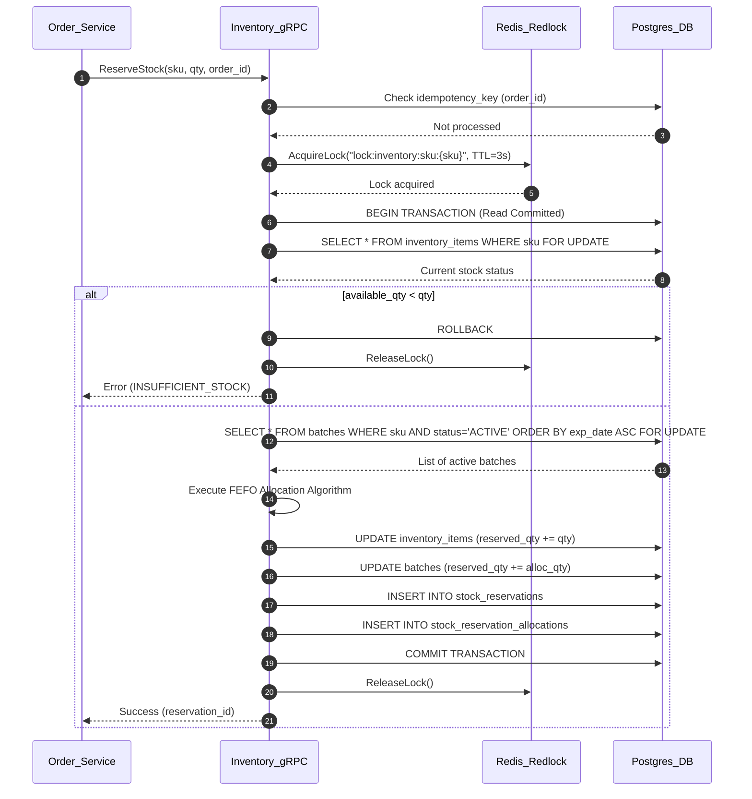
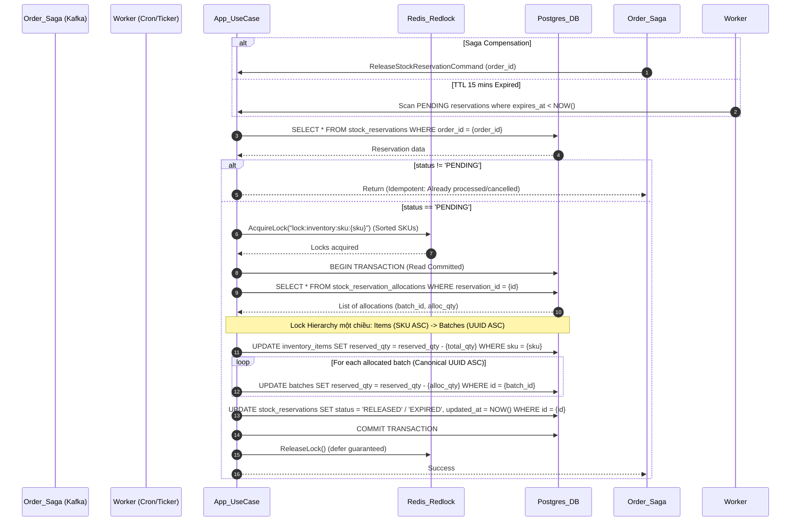
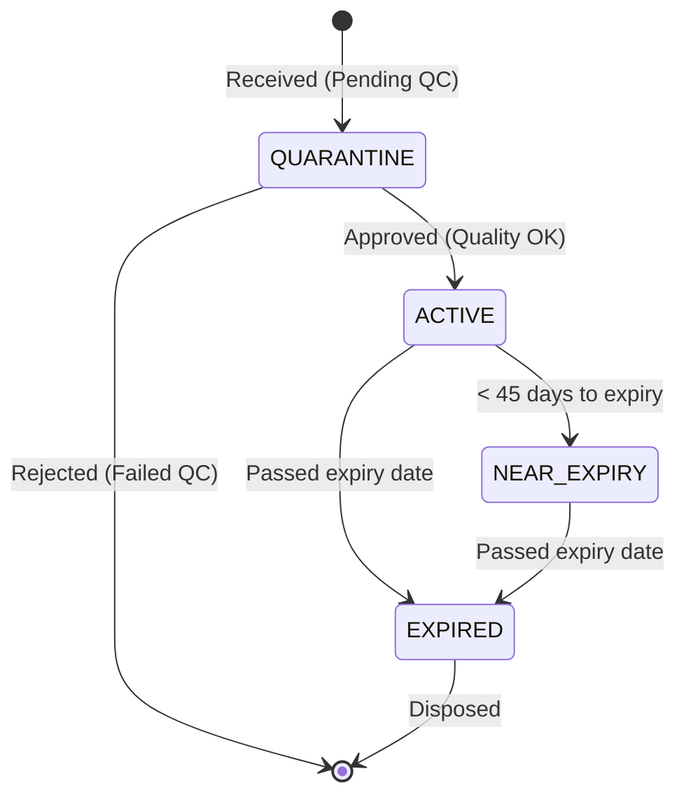
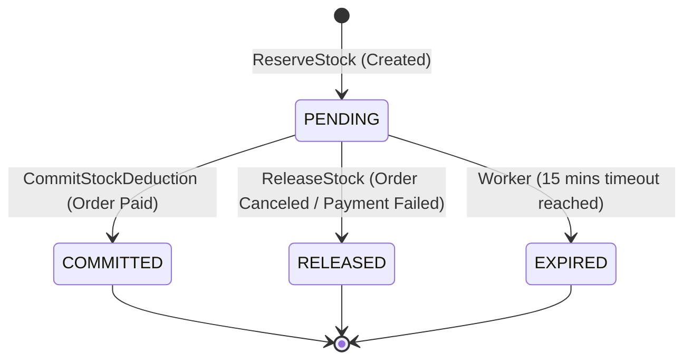

# Thiết kế Kiến trúc Dịch vụ Kho hàng (Inventory Service)

## 1. Mục tiêu và Ràng buộc hệ thống
- **Vai trò:** Dịch vụ cốt lõi (Core Domain), nằm trên Critical Path của luồng Thanh toán (Checkout).
- **Yêu cầu phi chức năng:** 
  - SLA: 99.99%.
  - Độ trễ (Latency): < 50ms cho các API gRPC nội bộ.
  - Đồng thời (Concurrency): Chịu tải cao, chống hiện tượng đua (Race Condition) và bán lố (Overselling) trong các dịp Flash Sale.
  - Tính nhất quán dữ liệu (Consistency): Đảm bảo giao dịch ACID tuyệt đối trong CSDL.

## 2. Quyết định Công nghệ & Ngôn ngữ (Tech Stack)

### 2.1. Ngôn ngữ lập trình: Go (Golang)
- **Lý do chọn Go:**
  - **Hiệu suất và Độ trễ cực thấp:** Go là ngôn ngữ biên dịch trực tiếp ra mã máy, không có máy ảo cồng kềnh như Java, thời gian khởi động nhanh và độ trễ dọn rác (GC pause) cực nhỏ, dễ dàng đáp ứng SLA < 50ms.
  - **Xử lý đồng thời (Concurrency) xuất sắc:** Với `goroutines` nhẹ và `channels`, Go xử lý hàng chục nghìn connection và luồng logic đồng thời rất hiệu quả.
  - **Tương thích hoàn hảo với gRPC:** Go được Google hỗ trợ sâu sắc về gRPC/Protobuf, code sinh ra cực kỳ nhẹ và tối ưu.

### 2.2. Cơ sở dữ liệu: PostgreSQL
- **Lý do chọn PostgreSQL:**
  - Hỗ trợ ACID Transactions nghiêm ngặt.
  - Hỗ trợ cơ chế khóa bản ghi `SELECT ... FOR UPDATE` mạnh mẽ để chống Over-selling ở tầng Database.
  - Hiệu suất truy vấn phức tạp (như FEFO) rất tốt, Indexing thông minh.

### 2.3. Caching & Distributed Lock: Redis
- Cung cấp cơ chế **Redlock** (thông qua thư viện như `redsync`) để tạo Distributed Lock chặn Race Condition trước khi chạm vào CSDL.
- Phục vụ Cache thông tin tồn kho `Q_avail` với tốc độ truy xuất < 1ms.

### 2.4. Message Broker: Apache Kafka
- Giải quyết bài toán Saga Pattern và Event-Driven Communication, đảm bảo các logic Asynchronous (trừ tiền, giải phóng tồn kho) đáng tin cậy.

## 3. Kiến trúc nội bộ: Clean Architecture / Hexagonal Architecture
Service được thiết kế theo tư tưởng **Clean Architecture** kết hợp **Domain-Driven Design (DDD)**. Nguyên tắc Inversion of Control (IoC) và Dependency Injection (DI) được áp dụng triệt để để tách biệt logic nghiệp vụ khỏi công nghệ cơ sở hạ tầng.

### 3.1. Cấu trúc thư mục (Directory Structure)
```text
inventory-service/
├── cmd/
│   └── server/             # Điểm vào (Entrypoint), khởi tạo gRPC server, DI container.
├── internal/
│   ├── domain/             # Tầng Core (Entities, Value Objects, Domain Services).
│   │   ├── entity/         # Các struct Batch, InventoryItem, StockReservation.
│   │   └── service/        # Các thuật toán nghiệp vụ (ví dụ: feco_allocator.go).
│   ├── application/        # Tầng Use-Cases (Logic điều phối).
│   │   ├── command/        # CQRS: Các logic thay đổi trạng thái (Reserve, Release).
│   │   ├── query/          # CQRS: Các logic lấy dữ liệu đọc (GetStock).
│   │   └── port/           # Interfaces (Repository, Broker, Cache, Lock).
│   ├── infrastructure/     # Tầng Hạ tầng (Implementations của Port).
│   │   ├── postgres/       # SQL queries, Transaction manager.
│   │   ├── redis/          # Distributed lock, Cache.
│   │   └── kafka/          # Message producers/consumers.
│   └── presentation/       # Tầng Giao tiếp.
│       ├── grpc/           # Các gRPC Handlers, Protobuf mapping.
│       └── event_handler/  # Nhận sự kiện từ Kafka.
├── pkg/                    # Các package dùng chung (Logger, Errors, Utils).
├── proto/                  # Định nghĩa Protobuf (.proto).
└── docs/                   # Tài liệu.
```

### 3.2. Sơ đồ Luồng Nghiệp vụ (Mermaid Diagrams)

#### Sơ đồ Tuần tự: Luồng gRPC ReserveStock (Giữ chỗ Tồn kho)


#### Sơ đồ Tuần tự: Luồng Saga Release / Cron Worker Hết hạn (Đã Tối ưu & Chuẩn hóa)



#### Sơ đồ Trạng thái: Vòng đời của Lô hàng (Batch Lifecycle)


#### Sơ đồ Trạng thái: Vòng đời của Phiếu Giữ chỗ (Reservation Lifecycle)

