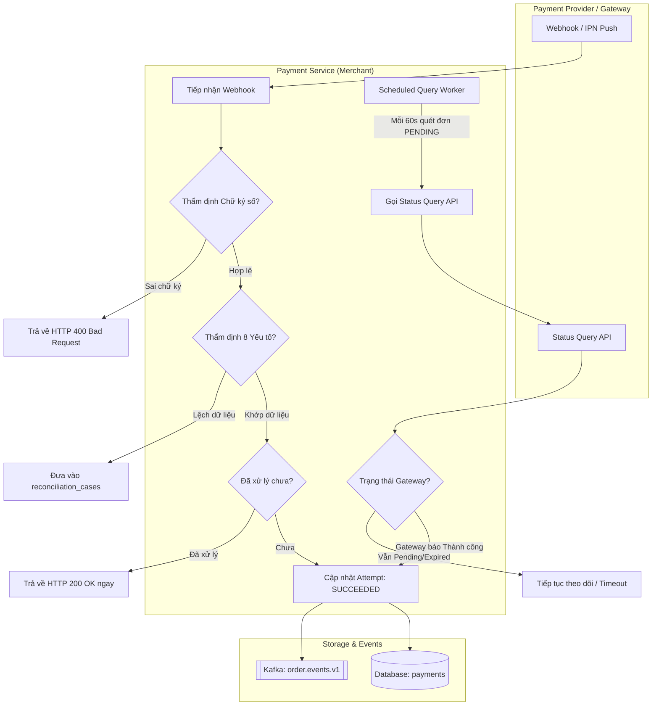
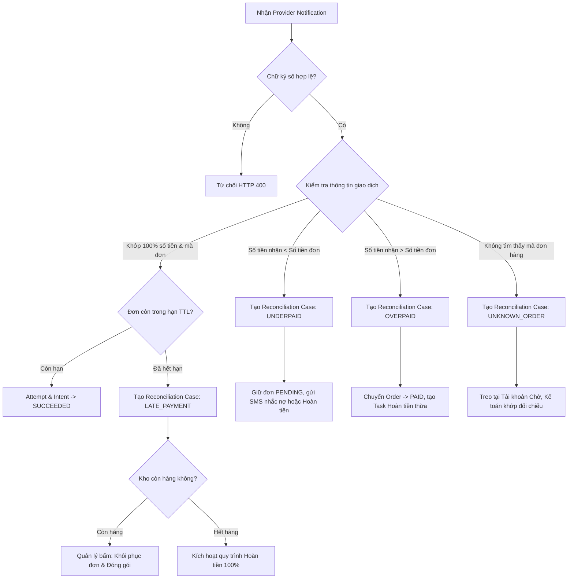
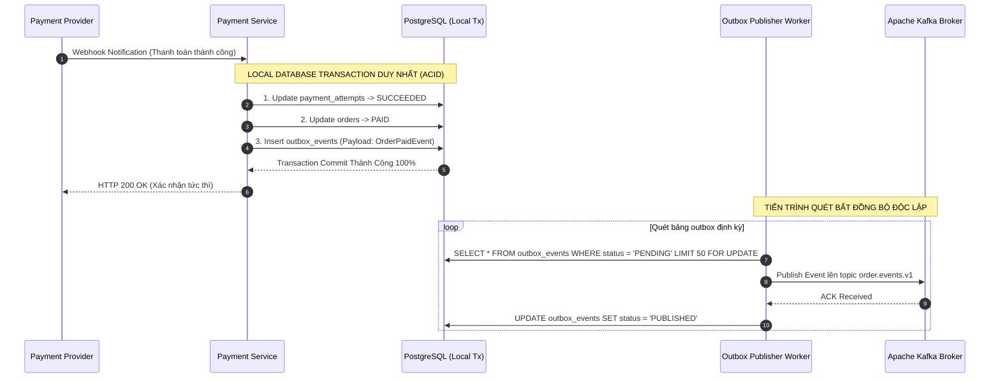

# KIẾN TRÚC TÍCH HỢP THANH TOÁN, CHUẨN QR CODE & HỆ THỐNG GIAO DỊCH TÀI CHÍNH
## (PAYMENT INTEGRATION ARCHITECTURE, QR SPECIFICATION & FINANCIAL TRANSACTION GUIDE)

### HỆ SINH THÁI THƯƠNG MẠI ĐIỆN TỬ ĐA KÊNH & CHUỖI CUNG ỨNG ĐẶC SẢN OCOP HUẾ (MÈ XỬNG O MẠ)

---

## KHUNG CHUẨN PHÂN LOẠI THÔNG TIN (INFORMATION CLASSIFICATION FRAMEWORK)

Để đảm bảo tính nghiêm cẩn của tài liệu kiến trúc kỹ thuật cấp doanh nghiệp và tránh tình trạng tài liệu bị lỗi thời khi các nhà cung cấp bên ngoài thay đổi chính sách, toàn bộ nội dung trong tài liệu này được phân định rõ ràng theo 5 nhóm thông tin:

* `[FACT]`: Năng lực kỹ thuật, đặc tả giao thức, tiêu chuẩn quốc tế đã được công bố chính thức và kiểm chứng (vd: Chuẩn EMVCo, RFC 2104 HMAC, ISO 4217, W3C Trace Context).
* `[ASSUMPTION]`: Giả định hoặc dự báo nghiệp vụ của dự án O Mạ, cần được thẩm định lại bằng số liệu thực tế sau 3–6 tháng vận hành Production (vd: Dự báo tỷ trọng phân bổ các kênh thanh toán ban đầu).
* `[DECISION]`: Quyết định kiến trúc hoặc nghiệp vụ do Đội ngũ Kỹ thuật & Nghiệp vụ O Mạ ban hành (Architectural Decision Records - ADR).
* `[CONSTRAINT]`: Ràng buộc pháp lý, quy định của Ngân hàng Nhà nước Việt Nam hoặc tiêu chuẩn an ninh thông tin bắt buộc phải tuân thủ (vd: Nghị định 13/2023/NĐ-CP, Thông tư NHNN, PCI DSS).
* `[PROVIDER-SPECIFIC]`: Các chi tiết phụ thuộc hợp đồng thương mại, biểu phí, thuật toán ký số, hoặc chu kỳ quyết toán của từng cổng thanh toán cụ thể — **Bắt buộc phải đối chiếu lại với tài liệu chính thức của Provider tại thời điểm ký kết/triển khai**.

---

## MỤC LỤC TỔNG QUAN

1. [Chương 1: Nền Tảng Lý Thuyết Cốt Lõi Về Thanh Toán Điện Tử](#1-nền-tảng-lý-thuyết-cốt-lõi-về-thanh-toán-điện-tử)
   - 1.1. Payment API & Tầng Trừu Tượng (Payment Intent vs. Payment Attempt)
   - 1.2. Mẫu Thiết Kế Payment Provider Adapter Pattern
   - 1.3. Sandbox Environment & Ma Trận Kiểm Thử Kỹ Thuật
   - 1.4. Cơ Chế Xác Nhận Thanh Toán: Provider Notification + Active Status Verification
   - 1.5. Quản Lý Tính Idempotency Bền Vững (Durable Idempotency & Database Constraint)
   - 1.6. Chữ Ký Số: Nguyên Lý Bảo Vệ Toàn Vẹn & Phân Tách Theo Nhà Cung Cấp
   - 1.7. Tuân Thủ An Ninh Thẻ (PCI DSS v4.0.1) & Chiến Lược Thu Hẹp Phạm Vi (PCI Scope Reduction)
   - 1.8. Logging Chuẩn Thanh Toán & Kiến Trúc Ba Mặt Phẳng Độc Lập
2. [Chương 2: Phân Tích Kỹ Thuật Chuyên Sâu Về Chuẩn QR Code Thanh Toán](#2-phân-tích-kỹ-thuật-chuyên-sâu-về-chuẩn-qr-code-thanh-toán)
   - 2.1. Mô Hình Phân Tầng Kỹ Thuật: EMVCo ≠ Payment Network ≠ Bank ≠ PSP ≠ VietQR
   - 2.2. Phân Định Rạch Ròi Các Khái Niệm Xung Quanh QR Code
   - 2.3. Đánh Giá Khách Quan Về Rủi Ro Trong Thanh Toán QR
   - 2.4. Phân Tầng Dịch Chuyển Giao Dịch & Khái Niệm Provider Callback
   - 2.5. Xử Lý Các Ngoại Lệ Nghiệp Vụ QR (Edge Cases & Reconciliation Cases)
   - 2.6. Cơ Chế Lan Truyền Trạng Thái Phía Client (Near-Real-Time Payment UX & SLOs)
3. [Chương 3: Máy Trạng Thái Thanh Toán & Vòng Đời Giao Dịch Nâng Cao](#3-máy-trạng-thái-thanh-toán--vòng-đời-giao-dịch-nâng-cao)
   - 3.1. Phân Định Khái Niệm: Confirmation ≠ Settlement ≠ Reconciliation
   - 3.2. Payment State Machine Độc Lập (Tách Biệt Khỏi Order State Machine)
   - 3.3. Vòng Đời Thanh Toán Mở Rộng Ngoài Khâu Cấp Phép (Chargeback & Dispute)
   - 3.4. Phân Hệ Đối Soát Tài Chính Độc Lập (Reconciliation Subsystem)
   - 3.5. Transactional Outbox Pattern Trong Xử Lý Sự Kiện Thanh Toán
   - 3.6. Ma Trận Xử Lý Lỗi Phân Tán (Distributed Failure Matrix)
4. [Chương 4: Đánh Giá Các Nhà Cung Cấp & Chiến Lược Thanh Toán Của O Mạ](#4-đánh-giá-các-nhà-cung-cấp--chiến-lược-thanh-toán-của-o-mạ)
   - 4.1. Ma Trận Năng Lực Các Nhà Cung Cấp (Provider Capability Matrix)
   - 4.2. Quyết Định Kiến Trúc: ADR-PAY-001 — Chiến Lược Trả Trước (Prepaid-First / 100% Cashless)
   - 4.3. Cơ Cấu Phương Thức Thanh Toán Lựa Chọn (Hypothesis & Decision)
5. [Chương 5: An Ninh Thanh Toán & Phòng Chống Gian Lận (Payment Security & Fraud Prevention)](#5-an-ninh-thanh-toán--phòng-chống-gian-lận-payment-security--fraud-prevention)
   - 5.1. 13 Tầng Kiểm Soát An Ninh Toàn Diện
   - 5.2. Quy Tắc: Webhook Signature Valid ≠ Transaction Valid (Bộ Lọc 8 Yếu Tố)
6. [Chương 6: Mô Hình Dữ Liệu Chuẩn Hóa Phân Hệ Thanh Toán (Data Models)](#6-mô-hình-dữ-liệu-chuẩn-hóa-phân-hệ-thanh-toán-data-models)
7. [Chương 7: Đánh Giá Thiếu Sót Trong Doc Dự Án & Đề Xuất Bổ Sung](#7-đánh-giá-thiếu-sót-trong-doc-dự-án--đề-xuất-bổ-sung)

---

## 1. NỀN TẢNG LÝ THUYẾT CỐT LÕI VỀ THANH TOÁN ĐIỆN TỬ

### 1.1. Payment API & Tầng Trừu Tượng (Payment Intent vs. Payment Attempt)

Một sai lầm phổ biến trong thiết kế kiến trúc thanh toán là **đồng nhất Đơn hàng (Order) với Thanh toán (Payment)** (quan hệ 1:1 gượng ép). Trong thực tế thương mại điện tử, một đơn hàng có thể trải qua nhiều lần thử thanh toán bất thành qua các cổng khác nhau trước khi thành công.

Hệ thống Mè Xửng O Mạ thiết lập mô hình trừu tượng 3 cấp độ:

```text
  [ Order ] (Aggregate Root - Quản lý giỏ hàng, giao vận, vòng đời mua sắm)
      │
      └── [ Payment Intent ] (Ý định thanh toán: Khóa tổng tiền, đơn vị tiền tệ, hạn mức)
              │
              ├── [ Payment Attempt #1 ] (Provider: VNPay Card ──► FAILED: Sai OTP)
              │
              ├── [ Payment Attempt #2 ] (Provider: VietQR ──────► EXPIRED: Quá 15 phút)
              │
              └── [ Payment Attempt #3 ] (Provider: MoMo ────────► SUCCEEDED: Hoàn tất)
```

* **Order (`orders`):** Đại diện cho hợp đồng mua bán sản phẩm giữa khách hàng và xưởng O Mạ.
* **Payment Intent (`payment_intents`):** Thể hiện ý định hoàn tất nghĩa vụ tài chính cho đơn hàng. Payment Intent sở hữu số tiền phải thu cố định (`amount`), đơn vị tiền tệ (`currency`), và trạng thái tổng quát.
* **Payment Attempt (`payment_attempts`):** Đại diện cho một lần khách hàng tương tác với một phương thức thanh toán cụ thể. Mỗi Attempt có mã định danh duy nhất (`attempt_id`), thời gian bắt đầu, thời gian hết hạn, và liên kết trực tiếp với một Provider Transaction.

---

### 1.2. Mẫu Thiết Kế Payment Provider Adapter Pattern

Để ngăn chặn việc logic nghiệp vụ riêng biệt của từng cổng thanh toán (VNPay, MoMo, PayOS, Stripe) rò rỉ vào dịch vụ lõi `order-service`, kiến trúc hệ thống áp dụng mẫu thiết kế **Ports & Adapters (Hexagonal Architecture)**:

```text
                           [ Order Service / Domain ]
                                       │
                                       ▼
                   ┌───────────────────────────────────────┐
                   │        Payment Service Core           │
                   └───────────────────┬───────────────────┘
                                       │ calls
                                       ▼
                   ┌───────────────────────────────────────┐
                   │      <<interface>> PaymentPort        │
                   ├───────────────────────────────────────┤
                   │ + createPayment(intent): AttemptResult│
                   │ + verifyNotification(raw): EventResult│
                   │ + queryStatus(attemptId): TxStatus    │
                   │ + refund(refundReq): RefundResult     │
                   │ + cancel(attemptId): CancelResult     │
                   └───────────────────┬───────────────────┘
                                       │ implements
         ┌─────────────────────────────┼─────────────────────────────┐
         ▼                             ▼                             ▼
┌───────────────────┐         ┌───────────────────┐         ┌───────────────────┐
│  VietQR Adapter   │         │   VNPay Adapter   │         │   MoMo Adapter    │
│ (PayOS/OpenBank)  │         │  (VPC Gateway)    │         │ (All-in-One SDK)  │
└─────────┬─────────┘         └─────────┬─────────┘         └─────────┬─────────┘
          │ calls                       │ calls                       │ calls
          ▼                             ▼                             ▼
  [ PayOS / Napas ]             [ VNPay Gateway ]             [ MoMo Platform ]
```

---

### 1.3. Sandbox Environment & Ma Trận Kiểm Thử Kỹ Thuật

`[FACT]` **Sandbox** là môi trường cô lập logic do các tổ chức trung gian thanh toán (PSP) cung cấp, cho phép mô phỏng hành vi giao dịch mà không làm phát sinh luồng tiền thật.

#### Ma Trận Kiểm Thử Bắt Buộc Trước Khi Go-Live
| # | Kịch Bản Kiểm Thử | Trạng Thái Giả Lập | Kết Quả Mong Đợi Tại Payment Service |
| :-: | :--- | :--- | :--- |
| 1 | **Happy Path** | Giao dịch thành công, OTP hợp lệ | Attempt `SUCCEEDED`, Intent `SUCCEEDED`, phát Kafka Event `OrderPaidEvent`. |
| 2 | **Insufficient Funds** | Số dư tài khoản/thẻ không đủ | Attempt `FAILED`, Intent giữ `REQUIRES_ACTION`, cho phép khách tạo Attempt mới. |
| 3 | **Authentication Failure**| Khách nhập sai OTP quá 3 lần | Attempt `FAILED` kèm mã lỗi chi tiết từ Provider. |
| 4 | **Expired Session** | Không thanh toán trong thời hạn TTL | Attempt `EXPIRED`, kích hoạt Saga Orchestrator đền bù nhả kho. |
| 5 | **Duplicate Webhook** | Provider bắn lặp 1 payload 5 lần | Nhờ Durable Idempotency, chỉ ghi nhận 1 lần, 5 lần đều trả HTTP 200 OK. |
| 6 | **Webhook Out of Order** | Khách query trạng thái trước khi webhook tới | Cơ chế Query API chủ động cập nhật trạng thái; webhook tới sau được bỏ qua an toàn. |

---

### 1.4. Cơ Chế Xác Nhận Thanh Toán: Provider Notification + Active Status Verification

`[PRINCIPLE]` **Không tuyệt đối hóa Webhook là nguồn tin cậy duy nhất.**

Trong môi trường phân tán thực tế, Webhook có thể gặp các sự cố: mạng giật làm rơi gói tin (packet drop), hệ thống gateway đối tác trì hoãn hàng giờ (delivery delay), hoặc đối tác gặp sự cố sập cụm dispatcher.

Do đó, kiến trúc chuẩn mực được định nghĩa là:
$$\mathbf{Provider\text{-}Authorized\ Server\ Notification\ +\ Active\ Status\ Verification\ =\ Payment\ Confirmation\ Mechanism}$$



---

### 1.5. Quản Lý Tính Idempotency Bền Vững (Durable Idempotency & Database Constraint)

`[DECISION]` **Không đồng nhất Idempotency chỉ với bộ nhớ đệm Redis.**

Redis có thể gặp sự cố mất dữ liệu khi restart, evict key khi đầy bộ nhớ, hoặc rớt kết nối mạng. Đối với các giao dịch tài chính, **Cơ sở dữ liệu quan hệ (PostgreSQL) với Ràng buộc Duy nhất (Unique Constraints) mới là chốt chặn bất khả xâm phạm cuối cùng**.

Kiến trúc Idempotency 3 lớp:
1. **Lớp 1 (Network Cache & Lock - Redis):**
   * Sử dụng khóa phân tán `SET payment_lock:{attempt_id} {uuid} NX EX 30` để ngăn 2 tiến trình xử lý cùng 1 webhook đồng thời.
2. **Lớp 2 (Database Unique Constraint - PostgreSQL Durable Record):**
   ```sql
   -- Chống ghi trùng giao dịch từ phía Provider
   CREATE UNIQUE INDEX uq_provider_tx ON provider_transactions (provider_id, provider_transaction_id);

   -- Chống gửi lặp yêu cầu thanh toán từ Client
   CREATE UNIQUE INDEX uq_idempotency_key ON payment_attempts (merchant_id, idempotency_key);
   ```
3. **Lớp 3 (Business State Check):**
   * Nếu giao dịch đã ở trạng thái `SUCCEEDED`, các sự kiện đến sau lập tức trả về kết quả thành công đã lưu mà không thực thi lại bất kỳ tác vụ tài chính nào.

---

### 1.6. Chữ Ký Số: Nguyên Lý Bảo Vệ Toàn Vẹn & Phân Tách Theo Nhà Cung Cấp

`[FACT]` **Mục đích kỹ thuật:** Chữ ký số (Payment Signature) bảo đảm 2 mục tiêu:
1. **Data Integrity (Tính toàn vẹn):** Dữ liệu không bị sửa đổi trên đường truyền (ví dụ hacker sửa `amount` từ 345.000đ thành 1.000đ).
2. **Origin Authentication (Xác thực nguồn gốc):** Gói tin thực sự do chính Cổng thanh toán phát sinh chứ không phải kẻ giả mạo.

`[PROVIDER-SPECIFIC]` **Hiện thực hóa phụ thuộc vào từng nhà cung cấp:**
* **VNPay:** Sử dụng thuật toán băm HMAC-SHA512 trên chuỗi URL-encoded gồm các tham số sắp xếp theo thứ tự từ điển A-Z (bỏ trường `vnp_SecureHash`).
* **MoMo:** Sử dụng thuật toán HMAC-SHA256 trên chuỗi raw text được định dạng theo cấu trúc cố định do MoMo quy định: `accessKey=$&amount=$&extraData=$&message=$&orderId=$...`.
* **Stripe:** Sử dụng header `Stripe-Signature` gồm Timestamp ($t$) và Chữ ký ($v1$), yêu cầu ghép $t$ với raw body JSON trước khi băm để chống tấn công phát lại (Replay Attack).
* **Open Banking / Ngân hàng Doanh nghiệp:** Nhiều ngân hàng sử dụng cặp khóa bất đối xứng RSA-SHA256 (Private Key của ngân hàng ký, Merchant dùng Public Key của ngân hàng để verify).

---

### 1.7. Tuân Thủ An Ninh Thẻ (PCI DSS v4.0.1) & Chiến Lược Thu Hẹp Phạm Vi (PCI Scope Reduction)

`[CONSTRAINT]` Tiêu chuẩn **PCI DSS (Payment Card Industry Data Security Standard) v4.0.1** quy định bắt buộc đối với mọi tổ chức lưu trữ, xử lý hoặc truyền tải dữ liệu chủ thẻ (Cardholder Data - CHD).

#### Phân Biệt Thuật Ngữ Kỹ Thuật
* **Masking (Che dấu):** Chỉ áp dụng khi **hiển thị** (Display) cho nhân viên hoặc khách hàng xem (ví dụ: chỉ hiện 6 số đầu và 4 số cuối: `4111 11** **** 1111`).
* **Truncation (Cắt ngắn):** Cơ chế kỹ thuật làm cho số PAN vĩnh viễn không thể khôi phục được khi **lưu trữ** trong cơ sở dữ liệu nếu không dùng mã hóa.
* **Sensitive Authentication Data (SAD):** Bao gồm mã **CVV/CVC, dữ liệu từ dải từ, mã PIN**. Quy định bất khả kháng: **TUYỆT ĐỐI CẤM LƯU TRỮ SAD SAU KHI CẤP PHÉP (AUTHORIZATION), KỂ CẢ DƯỚI DẠNG MÃ HÓA**.

```text
                           CHIẾN LƯỢC THU HẸP PHẠM VI PCI DSS
                           
   MÔ HÌNH 1: DIRECT CARD HANDLING (TỰ XỬ LÝ)        MÔ HÌNH 2: TOKENIZATION / HOSTED CHECKOUT
   
    [Browser] ──Raw Card Data──► [Merchant API]       [Browser] ──Raw Card Data──► [Stripe/VNPay]
                                        │                                                 │
                                        ▼                                                 ▼
                             [Merchant Database]      [Browser] ◄────Token Only───── [Stripe/VNPay]
                                                                            │
      Phạm vi PCI: Cực kỳ rộng (CDE toàn bộ)                        ▼
      Đánh giá: SAQ D / Kiểm toán ROC tốn kém         [Merchant API] ──Token Only──► Charge API
      Rủi ro: Rất cao khi máy chủ bị lộ lọt           Phạm vi PCI: Thu hẹp tối đa (SAQ A / SAQ A-EP)
```

`[DECISION]` **Hệ thống O Mạ lựa chọn mô hình Hosted Checkout & Tokenization:** Hệ thống tuyệt đối không xây dựng form hứng số thẻ thô trên máy chủ nội bộ. Toàn bộ thông tin thẻ do Cổng thanh toán (VNPay / Stripe) tiếp nhận qua iFrame bảo mật, máy chủ O Mạ chỉ nhận Token thanh toán.

---

### 1.8. Logging Chuẩn Thanh Toán & Kiến Trúc Ba Mặt Phẳng Độc Lập

`[DECISION]` Tuân thủ nguyên lý kiến trúc toàn hệ thống:
$$\mathbf{Business\ Event\ \neq\ Audit\ Event\ \neq\ Telemetry\ Signals}$$

1. **Telemetry Signals (OpenTelemetry):**
   * Mọi request thanh toán được gán W3C `traceparent`.
   * Ghi log kỹ thuật phi chặn (non-blocking) qua OTLP gRPC 4317 tới OTel Collector.
   * Log được làm sạch: Tuyệt đối không log CVV, OTP, API Secret Key, và tự động làm mờ PAN/PII.
2. **Audit Plane (Bằng chứng kiểm toán pháp lý):**
   * Mọi thay đổi trạng thái tài chính (thanh toán thành công, hoàn tiền, đối soát sai lệch) được gửi tới Topic Kafka `audit.events.v1`.
   * `MS-18 Audit Service` ghi nhận vào kho lưu trữ Append-Only với cấu trúc Hash Chain SHA-256:
     $$\text{Hash}_N = \text{SHA-256}(\text{Hash}_{N-1} + \text{Actor} + \text{Action} + \text{Payload} + \text{Timestamp})$$
   * Định kỳ neo Merkle Root lên dịch vụ lưu trữ chống ghi đè AWS S3 Object Lock (WORM).

---

## 2. PHÂN TÍCH KỸ THUẬT CHUYÊN SÂU VỀ CHUẨN QR CODE THANH TOÁN

### 2.1. Mô Hình Phân Tầng Kỹ Thuật: EMVCo ≠ Payment Network ≠ Bank ≠ PSP ≠ VietQR

`[FACT]` Chuẩn thanh toán QR không phải là một thực thể đơn nhất mà là một **kiến trúc phân tầng kỹ thuật (Layered Technical Architecture)**:

```text
               KIẾN TRÚC PHÂN TẦNG THANH TOÁN QR CODE
               
┌────────────────────────────────────────────────────────────────────────┐
│ 1. SPECIFICATION LAYER (Chuẩn Dữ Liệu Quốc Tế)                         │
│    - EMVCo QR Code Specification for Payment Systems                   │
│    - Phân tách: Merchant-Presented Mode (MPM) vs Consumer Mode (CPM)   │
└───────────────────────────────────┬────────────────────────────────────┘
                                    │ defines format
                                    ▼
┌────────────────────────────────────────────────────────────────────────┐
│ 2. DATA ENCODING & PAYLOAD LAYER                                       │
│    - Cấu trúc chuỗi ký tự TLV (Tag-Length-Value: Tag 00 đến Tag 63)   │
│    - Mã kiểm tra toàn vẹn chuỗi CRC-16 (CCITT-FALSE)                   │
└───────────────────────────────────┬────────────────────────────────────┘
                                    │ contextualized by
                                    ▼
┌────────────────────────────────────────────────────────────────────────┐
│ 3. DOMESTIC SCHEME & ECOSYSTEM LAYER                                   │
│    - VietQR Specification (Do NAPAS & Ngân hàng Nhà nước ban hành)     │
│    - Quy chuẩn hóa: Tag 38 (GUID A000000727), Mã ngân hàng (BIN)      │
│    - Quy chuẩn hóa: Ref ID (Mã tham chiếu đơn hàng) và chuẩn đối soát   │
└───────────────────────────────────┬────────────────────────────────────┘
                                    │ routed through
                                    ▼
┌────────────────────────────────────────────────────────────────────────┐
│ 4. PAYMENT NETWORK LAYER                                               │
│    - Mạng chuyển mạch tài chính quốc gia NAPAS (Napas 247)             │
│    - Mạng thanh toán quốc tế: Visa QR, Mastercard QR                   │
└───────────────────────────────────┬────────────────────────────────────┘
                                    │ executed by
                                    ▼
┌────────────────────────────────────────────────────────────────────────┐
│ 5. PROCESSING & SETTLEMENT LAYER (Xử Lý & Quyết Toán)                 │
│    - Ngân hàng phát hành (Issuing Bank) & Ngân hàng thụ hưởng (Acquirer)│
│    - Các tổ chức trung gian thanh toán (PSP / PayOS / Casso)           │
└────────────────────────────────────────────────────────────────────────┘
```

---

### 2.2. Phân Định Rạch Ròi Các Khái Niệm Xung Quanh QR Code

`[FACT]` Không được đồng nhất các khái niệm độc lập vào trong một thuật ngữ chung:

| Khái Niệm | Bản Chất & Ý Nghĩa Kỹ Thuật Độc Lập |
| :--- | :--- |
| **Static QR (QR Tĩnh)** | Chuỗi QR Payload có cấu trúc cố định, **có thể tái sử dụng vô hạn lần** (thường in trên mica dán tại quầy, chỉ mã hóa tài khoản nhận). |
| **Dynamic QR (QR Động)** | Chuỗi QR Payload được **sinh riêng biệt cho một giao dịch / ngữ cảnh cụ thể** (Contextualized payload), mang mã định danh giao dịch duy nhất. |
| **Fixed Amount** | Thuộc tính dữ liệu: Số tiền thanh toán (`Tag 54`) đã được tính toán và nhúng sẵn vào payload (App quét mã sẽ tự điền số tiền). |
| **Dynamic Amount** | Thuộc tính dữ liệu: Chuỗi QR không nhúng `Tag 54`, người thanh toán tự nhập số tiền trên giao diện ứng dụng. |
| **TTL (Time-To-Live)** | **Quy tắc nghiệp vụ của Hệ thống Bán hàng (Merchant Business Rule)**: Thời hạn có hiệu lực của phiên thanh toán (ví dụ: 15 phút của O Mạ khớp với Reservation), **không phải là thuộc tính phổ quát của Dynamic QR**. |
| **Provider Notification** | Cơ chế giao tiếp kỹ thuật (Webhook / IPN / Socket) giữa PSP và Merchant để truyền tin trạng thái giao dịch. |
| **Reconciliation** | Cơ chế đối soát số liệu định kỳ giữa sổ cái nội bộ và sao kê quyết toán từ ngân hàng/PSP. |

---

### 2.3. Đánh Giá Khách Quan Về Rủi Ro Trong Thanh Toán QR

`[FACT]` **Không có bất kỳ phương thức thanh toán nào có rủi ro bằng 0% (Zero Risk).**

Mặc dù Dynamic QR nhúng sẵn số tiền và mã đơn giúp **giảm thiểu đáng kể sai sót nhập liệu thủ công của người dùng**, hệ thống vẫn đối mặt với các rủi ro vận hành và công nghệ sau:

1. **Khách hàng thanh toán muộn (Late Payment):** Người dùng chuyển tiền sau khi phiên checkout và lệnh tạm giữ tồn kho 15 phút đã hết hạn hủy đơn.
2. **Khách hàng chuyển tiền trùng lặp (Duplicate Payment):** Ứng dụng ngân hàng chập chờn khiến người dùng bấm chuyển tiền 2 lần.
3. **Thanh toán sai lệch nội dung:** Người dùng quét mã trên ứng dụng ngân hàng cũ không tự động khóa trường nội dung, tự ý xóa mã đơn `OMAMX...` để nhập lời chúc.
4. **Sự cố nghẽn mạch chuyển mạch:** Mạng lưới NAPAS hoặc cổng ngân hàng bảo trì định kỳ làm gián đoạn việc cập nhật biến động số dư.
5. **Rơi rớt hoặc chậm trễ Webhook:** Giao dịch thành công tại ngân hàng nhưng thông báo notification về hệ thống O Mạ bị thất lạc hoặc trễ hàng giờ.
6. **Lỗi quy trình hoàn tiền (Refund Failure):** Việc hoàn tiền qua tài khoản ngân hàng phức tạp hơn hủy giao dịch thẻ tín dụng do không thể tự động trích nợ ngược lại từ tài khoản người dùng nếu không có thỏa thuận thu hộ/chi hộ.

---

### 2.4. Phân Tầng Dịch Chuyển Giao Dịch & Khái Niệm Provider Callback

`[FACT]` Trong triển khai thực tế, Merchant **hiếm khi nhận Webhook trực tiếp từ Core Banking của Ngân hàng** (trừ trường hợp doanh nghiệp lớn kết nối kênh Direct Corporate Host-to-Host).

Chuỗi hành trình gói tin diễn ra qua các thực thể sau:

```text
[ Khách hàng dùng Mobile Banking quét VietQR ]
                     │
                     ▼
       [ Ngân hàng phát hành (Issuer) ]
                     │
                     ▼ (Hệ thống Napas 247)
       [ Ngân hàng thụ hưởng (Acquirer) ]
                     │
                     ▼ (Open Banking API / Biến động số dư)
       [ Đơn vị cung cấp giải pháp thu hộ (PSP / PayOS) ]
                     │
                     ▼ (Provider Callback kèm HMAC Signature)
       [ API Gateway của Merchant (Kong) ]
                     │
                     ▼
       [ Payment Service của O Mạ ]
```

*Thuật ngữ chuẩn hóa:* Sử dụng **Provider Callback / Notification** thay vì gọi chung là "Bank Webhook".

---

### 2.5. Xử Lý Các Ngoại Lệ Nghiệp Vụ QR (Edge Cases & Reconciliation Cases)



---

### 2.6. Cơ Chế Lan Truyền Trạng Thái Phía Client (Near-Real-Time Payment UX & SLOs)

`[DECISION]` Để mang lại trải nghiệm khách hàng mượt mà khi quét QR bằng điện thoại mà không cần tải lại trang Web, hệ thống sử dụng cơ chế **WebSocket Server-to-Client qua API Gateway** kết hợp Redis Pub/Sub.

`[CONSTRAINT]` Không cam kết các chỉ số độ trễ tuyệt đối không thực tế (như $< 50$ms qua Internet). Thay vào đó, hệ thống cam kết mục tiêu mức độ dịch vụ (**Service Level Objectives - SLOs**) được đo lường bằng OpenTelemetry:

* **SLO-PAY-01 (Độ trễ lan truyền trạng thái):**
  * $P95 < 2.0$ giây (từ khi Payment Service tiếp nhận Webhook hợp lệ đến khi Client nhận tín hiệu WebSocket).
  * $P99 < 5.0$ giây.
* **Cơ chế dự phòng (Client Fallback):**
  * Nếu kết nối WebSocket bị gián đoạn, Web Client tự động chuyển sang cơ chế **Smart Polling** (`GET /api/v1/orders/{id}/payment-status` mỗi 3 giây, tự động dừng sau 15 phút hoặc khi nhận được trạng thái cuối cùng).

---

## 3. MÁY TRẠNG THÁI THANH TOÁN & VÒNG ĐỜI GIAO DỊCH NÂNG CAO

### 3.1. Phân Định Khái Niệm: Confirmation ≠ Settlement ≠ Reconciliation

Để quản trị tài chính minh bạch, hệ sinh thái O Mạ phân tách rạch ròi 3 khái niệm:

1. **Payment Confirmation (Xác nhận giao dịch thanh toán):**
   * Diễn ra theo thời gian thực (Real-time).
   * Là sự kiện Cổng thanh toán hoặc Ngân hàng gửi bằng chứng điện tử xác nhận khách hàng đã hoàn tất việc chuyển tiền/trừ tiền thành công. Cho phép xưởng kích hoạt đóng gói kẹo.
2. **Settlement (Quyết toán / Thanh khoản dòng tiền):**
   * Diễn ra theo chu kỳ thanh khoản ($T+0$, $T+1$, hoặc hàng tuần tùy hợp đồng PSP).
   * Là thời điểm dòng tiền thực tế được chuyển từ tài khoản trung gian của Cổng thanh toán về tài khoản ngân hàng chính thức của Doanh nghiệp O Mạ.
3. **Reconciliation (Đối soát sổ sách):**
   * Diễn ra định kỳ cuối ngày ($T+1$ lúc 02:00 AM) hoặc cuối tháng.
   * Là tiến trình đối chiếu giữa: **Sổ cái CSDL nội bộ (Internal Ledger)** $\longleftrightarrow$ **Báo cáo quyết toán của Cổng thanh toán (Settlement Report)** $\longleftrightarrow$ **Sao kê tài khoản ngân hàng thực tế (Bank Statement MT940/CAMT.053)** nhằm phát hiện chênh lệch phí, giao dịch treo hoặc thất thoát.

---

### 3.2. Payment State Machine Độc Lập (Tách Biệt Khỏi Order State Machine)

`[DECISION]` Trạng thái Đơn hàng (`order_status`) phản ánh vòng đời thương mại (Mua $\to$ Đóng gói $\to$ Giao hàng). Trạng thái Thanh toán (`payment_intent_status`) phản ánh vòng đời tài chính độc lập:

```mermaid
stateDiagram-v2
    title Máy Trạng Thái Thanh Toán Độc Lập (Payment Intent Lifecycle)

    [*] --> CREATED : Khách bấm Checkout
    
    CREATED --> REQUIRES_ACTION : Sinh Payment Attempt (Cấp QR / Redirect URL)
    
    state REQUIRES_ACTION {
        [*] --> AwaitingCustomer
        AwaitingCustomer --> AttemptProcessing : Khách quét mã / Quẹt thẻ
    }

    AttemptProcessing --> PROCESSING : Provider xác nhận đang hạch toán
    
    PROCESSING --> SUCCEEDED : Nhận Provider Confirmation hợp lệ
    PROCESSING --> FAILED : Giao dịch bị từ chối / Lỗi thẻ
    
    REQUIRES_ACTION --> EXPIRED : Hết hạn TTL 15 phút
    REQUIRES_ACTION --> CANCELLED : Khách chủ động bấm Đổi phương thức
    
    state SUCCEEDED {
        [*] --> NormalPaid
        NormalPaid --> REFUND_PENDING : Kích hoạt yêu cầu hoàn tiền (CSKH/Hủy đơn)
    }

    REFUND_PENDING --> REFUNDED : Provider xác nhận hoàn tiền thành công
    REFUND_PENDING --> REFUNDED_FAILED : Cổng từ chối hoàn tiền (Hết hạn mức/Lỗi mạng)

    SUCCEEDED --> [*]
    FAILED --> REQUIRES_ACTION : Tạo Attempt mới thử lại
    FAILED --> [*] : Quá số lần thử lại
    EXPIRED --> [*]
    CANCELLED --> [*]
    REFUNDED --> [*]
```



---

### 3.3. Vòng Đời Thanh Toán Mở Rộng Ngoài Khâu Cấp Phép (Chargeback & Dispute)

`[FACT]` Khi hệ thống chấp nhận các kênh thanh toán quốc tế và thẻ tín dụng (Visa, Mastercard, JCB), phân hệ thanh toán phải sẵn sàng xử lý các trạng thái tài chính phát sinh sau giao dịch:

```text
               VÒNG ĐỜI GIAO DỊCH THẺ TOÀN DIỆN
               
[ 1. Authorization ] (Tạm giữ hạn mức trên thẻ của khách)
         │
         ▼
[ 2. Capture ] (Khấu trừ tiền thực tế, thường diễn ra ngay hoặc sau đóng gói)
         │
         ▼
[ 3. Settlement ] (Cổng thanh toán quyết toán tiền về tài khoản Merchant)
         │
         ├────────────────────────────────┬───────────────────────────────┐
         ▼                                ▼                               ▼
   [ 4. Refund ]                   [ 5. Reversal ]               [ 6. Chargeback ]
   (Merchant chủ động             (Giao dịch bị đảo               (Khách khiếu nại
    hoàn trả cho khách)            ngay trong ngày)                qua Ngân hàng phát hành)
                                                                          │
                                                                          ▼
                                                                  [ 7. Dispute Case ]
                                                                          │
                                  ┌───────────────────────────────────────┴───────────────────┐
                                  ▼                                                           ▼
                        [ 8. Representment ]                                            [ Accept Loss ]
                      (Merchant nộp bằng chứng                                        (Chấp nhận mất tiền
                       video đóng gói seal O Mạ)                                       + chịu phí phạt)
                                  │
                                  ▼
                        [ Dispute Won / Lost ]
```

---

### 3.4. Phân Hệ Đối Soát Tài Chính Độc Lập (Reconciliation Subsystem)

```text
                KIẾN TRÚC PHÂN HỆ ĐỐI SOÁT TỰ ĐỘNG (MS-09)
                
   [ Bảng payment_attempts ]          [ Settlement Report CSV / API ]
       (Dữ liệu nội bộ)                       (Dữ liệu đối tác)
              │                                      │
              └──────────────────┬───────────────────┘
                                 │ Scheduled Job 02:00 AM
                                 ▼
                     [ Reconciliation Engine ]
                                 │
                 ┌───────────────┴───────────────┐
                 ▼                               ▼
         [ Status: MATCHED ]             [ Status: EXCEPTION ]
         - Khớp mã đơn                   - Lệch số tiền (Under/Over)
         - Khớp số tiền                  - Lệch ngày ghi nhận (Timing)
         - Khớp biểu phí                 - Giao dịch mồ côi (Unknown)
                 │                               │
                 ▼                               ▼
       Ghi nhận sổ cái A/R             Tạo Reconciliation Ticket
       Xuất Hóa đơn VAT               Gửi Cảnh Báo Sang Kế Toán
```

---

### 3.5. Transactional Outbox Pattern Trong Xử Lý Sự Kiện Thanh Toán

`[DECISION]` **Giải quyết triệt để vấn đề mất tính nhất quán giữa Cơ sở dữ liệu và Kafka.**

Nếu hệ thống cập nhật CSDL `Order -> PAID` thành công nhưng mạng tới Apache Kafka bị đứt, sự kiện `OrderPaidEvent` sẽ không bao giờ được phát đi, khiến xưởng không bao giờ nhận được lệnh đóng gói kẹo!



---

### 3.6. Ma Trận Xử Lý Lỗi Phân Tán (Distributed Failure Matrix)

| Tình Huống Sự Cố | Trạng Thái Payment | Trạng Thái Order | Hành Động Phục Hồi Tự Động (Recovery Strategy) |
| :--- | :---: | :---: | :--- |
| **Gateway Timeout lúc tạo phiên** | `FAILED` | `DRAFT` | Báo lỗi thân thiện cho Client, cho phép đổi phương thức hoặc thử lại. |
| **Provider Webhook bị rớt/chậm** | `PROCESSING` | `PENDING_PAYMENT` | Scheduled Query Worker chủ động gọi Query Status API sau 5m, 10m, 15m. |
| **Provider gửi Webhook lặp 5 lần** | `SUCCEEDED` | `PAID` | Unique Constraint chặn đứng tại CSDL, trả HTTP 200 bỏ qua gói tin lặp. |
| **Lỗi DB Commit khi nhận Webhook** | `UNKNOWN` | `PENDING_PAYMENT` | Rollback transaction, trả HTTP 500 để Gateway tự động retry lại sau 1 phút. |
| **Kafka Broker tạm thời sập** | `SUCCEEDED` | `PAID` | Bản ghi Outbox vẫn nằm an toàn trong PostgreSQL, worker sẽ đẩy bù khi Kafka sống lại. |
| **Khách trả tiền sau khi hết hạn 15m** | `SUCCEEDED` | `CANCELLED_TIMEOUT` | Tạo bản ghi `reconciliation_cases` (LATE_PAYMENT), báo quản lý kiểm kho hoàn tiền/khôi phục. |

---

## 4. ĐÁNH GIÁ CÁC NHÀ CUNG CẤP & CHIẾN LƯỢC THANH TOÁN CỦA O MẠ

### 4.1. Ma Trận Năng Lực Các Nhà Cung Cấp (Provider Capability Matrix)

`[FACT]` Dưới đây là bảng đánh giá năng lực tích hợp kỹ thuật dựa trên tài liệu chính thức của các đơn vị:

| Năng Lực Kỹ Thuật | VietQR (PayOS / OpenBank) | VNPay Gateway | MoMo Platform | Stripe |
| :--- | :---: | :---: | :---: | :---: |
| **Redirect Checkout Page** | Có | Có | Có | Có |
| **Dynamic QR Code (EMVCo)** | **Rất mạnh (Lõi)** | Có (VNPay-QR) | Có (MoMo QR) | Cung cấp qua đối tác |
| **Thẻ ATM Nội Địa (NAPAS)** | Chuyển khoản | **Rất mạnh** | Hỗ trợ qua cổng thẻ | Không hỗ trợ |
| **Thẻ Quốc Tế (Visa/Master/JCB)**| Không | **Có hỗ trợ** | **Có hỗ trợ** | **Rất mạnh (Toàn cầu)** |
| **Server-to-Server Webhook** | Có (HMAC) | Có (HMAC-SHA512) | Có (HMAC-SHA256) | Có (Timestamped HMAC) |
| **Status Query API** | Có | Có | Có | Có |
| **Refund API Tự Động** | Hạn chế (Tùy ngân hàng)| Có | **Có (Rất mạnh)** | **Có (Rất mạnh)** |
| **Recurring Billing (Định kỳ)** | Không | Phụ thuộc thỏa thuận| Có | Rất mạnh |
| **Pháp nhân & Thẻ nội địa VN** | **100% Nội địa** | **100% Nội địa** | **100% Nội địa** | Yêu cầu pháp nhân ngoại |

---

### 4.2. Quyết Định Kiến Trúc: ADR-PAY-001 — Chiến Lược Trả Trước (Prepaid-First / 100% Cashless)

```text
ADR-PAY-001: Lựa Chọn Mô Hình Thanh Toán Trả Trước 100% (Loại Bỏ COD)
─────────────────────────────────────────────────────────────────────────────
Trạng Thái: APPROVED (Đã Phê Duyệt Kiến Trúc)
Ngày Quyết Định: 2026-09-29
Người Đề Xuất: Principal Architect & Domain Lead

Bối Cảnh (Context):
- Sản phẩm của O Mạ là kẹo mè xửng OCOP Huế truyền thống có tính chất giòn, dễ vỡ khi vận chuyển va đập nhiều lần.
- Hình thức COD truyền thống trong ngành hàng thực phẩm luôn gánh chịu tỷ lệ hoàn hàng từ 5% - 10% do khách đổi ý, bom hàng hoặc shipper không thu được tiền.
- Quy trình đối soát tiền mặt COD với 3PL (GHN, ViettelPost) phức tạp, giam vốn lưu động từ 7 đến 14 ngày, kèm phí thu hộ 1% - 1.5%.

Quyết Định (Decision):
- Hệ thống O Mạ chuyển dịch toàn diện sang mô hình 100% PREPAID (Trả trước toàn bộ), loại bỏ hoàn toàn phương thức COD.
- Đơn hàng chỉ được chuyển sang bộ phận xưởng Hương Thủy đóng gói niêm phong (PROCESSING) khi và chỉ khi nhận được xác nhận thanh toán hợp lệ (PAID).

Lợi Ích Đạt Được (Rationale):
1. Triệt tiêu hoàn toàn rủi ro bom hàng và hư hao sản phẩm kẹo do chuyển hoàn.
2. Đơn giản hóa toàn bộ Máy trạng thái đơn hàng (Order State Machine), loại bỏ các nhánh logic phức tạp về công nợ COD.
3. Tương thích hoàn hảo với nghiệp vụ Gifting (EPIC 26): Người mua trả tiền trước, người nhận chỉ nhận quà mà không bị thu tiền.
4. Xóa bỏ hoàn toàn chi phí thu tiền hộ và thủ tục đối soát tiền mặt với bưu tá.

Rủi Ro & Biện Pháp Giảm Thiểu (Trade-offs & Mitigations):
- Rủi ro: Có thể làm giảm tỷ lệ chuyển đổi ban đầu đối với tệp khách hàng lớn tuổi chỉ quen dùng tiền mặt.
- Biện pháp:
  + Triển khai VietQR Dynamic siêu mượt (chỉ cần quét là thanh toán, không cần nhập liệu).
  + Xây dựng uy tín thương hiệu thông qua phân hệ minh bạch OCOP Heritage (MS-03) và video quay cận cảnh quy trình đóng gói dán tem Seal O Mạ gửi cho khách trước khi gửi hàng.
```

---

### 4.3. Cơ Cấu Phương Thức Thanh Toán Lựa Chọn (Hypothesis & Decision)

```text
               CƠ CẤU PHƯƠNG THỨC THANH TOÁN (PREPAID-FIRST MIX)
               
                    ┌─────────────────────────────────────────┐
                    │       HỆ SINH THÁI MÈ XỬNG O MẠ         │
                    └────────────────────┬────────────────────┘
                                         │
         ┌───────────────────────────────┼───────────────────────────────┐
         ▼                               ▼                               ▼
 ┌───────────────────────┐       ┌───────────────────────┐       ┌───────────────────────┐
 │   PHƯƠNG THỨC CHÍNH   │       │ PHƯƠNG THỨC PHỤ TRỢ 1 │       │ PHƯƠNG THỨC PHỤ TRỢ 2 │
 │    VIETQR DYNAMIC     │       │   CỔNG THẺ ĐA NĂNG    │       │      VÍ ĐIỆN TỬ       │
 │(PayOS / Open Banking) │       │(VNPay Gateway/OnePay) │       │   (MoMo / ZaloPay)    │
 └───────────┬───────────┘       └───────────┬───────────┘       └───────────┬───────────┘
             │                               │                               │
     [ASSUMPTION]                    [ASSUMPTION]                    [ASSUMPTION]
     Kỳ vọng: 65% – 70%              Kỳ vọng: 20% – 25%              Kỳ vọng: 10% – 15%
     Phí: [PROVIDER-SPECIFIC]        Phí: [PROVIDER-SPECIFIC]        Phí: [PROVIDER-SPECIFIC]
     Tiền về: T+0                    Quyết toán: T+1                 Quyết toán: T+1
```

* **Phương Thức Chính — VietQR Dynamic:**
  * `[DECISION]` Tuyến thanh toán ưu tiên số 1, áp dụng cho toàn bộ Website D2C và quầy bán lẻ POS tại xưởng.
  * *Lý do:* Tối ưu dòng tiền tức thì (T+0), phí dịch vụ cực thấp giúp bảo toàn biên lợi nhuận sản phẩm nông sản OCOP, tự động hóa khớp đơn 100% mà không phụ thuộc vào việc nhân viên đọc sao kê thủ công.
* **Phương Thức Phụ Trợ 1 — Cổng Thanh Toán Thẻ Đa Năng (VNPay Gateway / OnePay):**
  * `[DECISION]` Tiếp nhận thanh toán cho khách hàng dùng thẻ ATM nội địa (Napas) và thẻ tín dụng/ghi nợ quốc tế (Visa, Mastercard, JCB).
  * *Lý do:* Phục vụ đơn hàng quà tặng doanh nghiệp B2B trị giá lớn (kế toán dùng thẻ tín dụng công ty), phục vụ kiều bào xa xứ mua quà Tết từ nước ngoài, và hỗ trợ khách hàng thao tác trên máy tính để bàn không tiện quét mã QR.
* **Phương Thức Phụ Trợ 2 — Ví Điện Tử (MoMo / ZaloPay):**
  * `[DECISION]` Tiếp nhận thanh toán 1-chạm (App-to-App) trên thiết bị di động.
  * *Lý do:* Tối ưu trải nghiệm cho tập khách hàng trẻ (Gen Z, Mobile Shoppers), tận dụng các chiến dịch voucher đồng tài trợ của đối tác ví.

---

## 5. AN NINH THANH TOÁN & PHÒNG CHỐNG GIAN LẬN (PAYMENT SECURITY & FRAUD PREVENTION)

### 5.1. 13 Tầng Kiểm Soát An Ninh Toàn Diện

```text
  [ 1. Transport Security ] ──► Bắt buộc TLS 1.3, HSTS Preload, cấm HTTP trần.
  [ 2. API Authentication ] ──► API Key, Bearer JWT có chữ ký điện tử.
  [ 3. RBAC & Principle of Least Privilege ] ──► Phân quyền chặt chẽ giữa CSKH và Kế toán.
  [ 4. Signature Verification ] ──► Kiểm tra chữ ký HMAC/RSA trên 100% gói tin gửi/nhận.
  [ 5. Webhook Replay Protection ] ──► Bắt buộc kiểm tra Timestamp (cửa sổ hợp lệ: ±300s).
  [ 6. Durable Idempotency ] ──► Unique constraint CSDL chặn đứng xử lý trùng lặp.
  [ 7. Amount & Currency Integrity ] ──► Bắt buộc đối chiếu số tiền tính từ CSDL nội bộ.
  [ 8. Merchant & Order Binding ] ──► Kiểm tra đúng Merchant ID và Order ID thuộc về O Mạ.
  [ 9. Rate Limiting ] ──► Giới hạn 5 lần thử checkout/phút cho mỗi IP/User để chống brute-force.
  [ 10. Network & IP Whitelisting ] ──► Chỉ chấp nhận webhook từ dải IP chính thức của Provider.
  [ 11. 3-D Secure 2.0 (EMV 3DS) ] ──► Xác thực đa yếu tố bắt buộc đối với mọi giao dịch thẻ quốc tế.
  [ 12. Tokenization & Scope Reduction ] ──► Tuyệt đối không lưu PAN/CVV, chỉ lưu Payment Token.
  [ 13. Fraud & Anomaly Detection ] ──► Cảnh báo tự động các giao dịch bất thường (vượt hạn mức, đổi IP).
```

---

### 5.2. Quy Tắc: Webhook Signature Valid ≠ Transaction Valid (Bộ Lọc 8 Yếu Tố)

`[PRINCIPLE]` **Chữ ký số hợp lệ chỉ chứng minh gói tin không bị sửa đổi trên đường truyền; nó KHÔNG chứng minh giao dịch thanh toán đó hợp lệ với đơn hàng!**

Kẻ gian có thể thực hiện thanh toán cho một đơn hàng 1.000đ khác của chính hắn, lấy payload webhook có chữ ký xịn từ Gateway, rồi gửi vào endpoint của một đơn hàng 345.000đ của O Mạ.

Do đó, tiến trình thẩm định Webhook bắt buộc phải vượt qua **Bộ Lọc 8 Yếu Tố**:

```text
               BỘ LỌC 8 YẾU TỐ THẨM ĐỊNH WEBHOOK BẮT BUỘC
               
  1. Signature Check        ──► Chữ ký số HMAC/RSA khớp chính xác 100%.
  2. Timestamp Window       ──► Thời điểm gửi tin nằm trong khoảng ±5 phút (Chống Replay).
  3. Merchant ID Check      ──► Đúng tài khoản Merchant của O Mạ được cấp phép.
  4. Order ID Existence     ──► Mã đơn hàng tồn tại hợp lệ trong hệ thống.
  5. Currency Match         ──► Đúng đơn vị tiền tệ yêu cầu (VND = 704).
  6. Exact Amount Match     ──► Số tiền nhận được PHẢI BẰNG CHÍNH XÁC số tiền phải thu.
  7. Provider Tx ID Check   ──► Mã giao dịch phía đối tác chưa từng được ghi nhận trước đó.
  8. Transaction Status     ──► Mã trạng thái phản hồi từ đối tác biểu thị thành công ('00', 'SUCCESS').
```

---

## 6. MÔ HÌNH DỮ LIỆU CHUẨN HÓA PHÂN HỆ THANH TOÁN (DATA MODELS)

Hệ thống thiết lập cơ sở dữ liệu quan hệ chặt chẽ, chuẩn hóa phân định giữa các thực thể:

```sql
-- 1. BẢNG Ý ĐỊNH THANH TOÁN (PAYMENT INTENTS)
CREATE TABLE payment_intents (
    intent_id VARCHAR(64) PRIMARY KEY,
    order_id VARCHAR(64) NOT NULL REFERENCES orders(order_id),
    amount BIGINT NOT NULL, -- Đơn vị: Đồng (VND), cấm dùng float
    currency VARCHAR(3) DEFAULT 'VND',
    status VARCHAR(32) NOT NULL, -- CREATED, REQUIRES_ACTION, PROCESSING, SUCCEEDED, FAILED, EXPIRED, CANCELLED
    created_at TIMESTAMPTZ DEFAULT CURRENT_TIMESTAMP,
    updated_at TIMESTAMPTZ DEFAULT CURRENT_TIMESTAMP
);

-- 2. BẢNG CÁC LẦN THỬ THANH TOÁN (PAYMENT ATTEMPTS)
CREATE TABLE payment_attempts (
    attempt_id VARCHAR(64) PRIMARY KEY,
    intent_id VARCHAR(64) NOT NULL REFERENCES payment_intents(intent_id),
    merchant_id VARCHAR(64) NOT NULL,
    idempotency_key VARCHAR(128) NOT NULL,
    provider_id VARCHAR(32) NOT NULL, -- VIETQR_PAYOS, VNPAY, MOMO, STRIPE
    payment_method VARCHAR(32) NOT NULL, -- QR, CARD_DOMESTIC, CARD_INTL, WALLET
    amount BIGINT NOT NULL,
    status VARCHAR(32) NOT NULL, -- INITIATED, PENDING, SUCCEEDED, FAILED, EXPIRED
    qr_payload TEXT, -- Chuỗi TLV nếu là VietQR
    payment_url TEXT, -- Redirect URL nếu là Cổng thẻ
    expires_at TIMESTAMPTZ NOT NULL, -- Thời hạn hiệu lực (TTL 15m)
    created_at TIMESTAMPTZ DEFAULT CURRENT_TIMESTAMP,
    CONSTRAINT uq_attempt_idempotency UNIQUE (merchant_id, idempotency_key)
);

-- 3. BẢNG GIAO DỊCH THỰC TẾ PHÍA PROVIDER (PROVIDER TRANSACTIONS)
CREATE TABLE provider_transactions (
    transaction_id VARCHAR(64) PRIMARY KEY,
    attempt_id VARCHAR(64) NOT NULL REFERENCES payment_attempts(attempt_id),
    provider_id VARCHAR(32) NOT NULL,
    provider_transaction_id VARCHAR(128) NOT NULL, -- Mã giao dịch bên Ngân hàng/Gateway
    raw_payload JSONB NOT NULL, -- Dữ liệu gốc nhận được (đã được làm sạch PII)
    amount_received BIGINT NOT NULL,
    fee_deducted BIGINT DEFAULT 0,
    signature_verified BOOLEAN NOT NULL DEFAULT FALSE,
    bank_code VARCHAR(32),
    settlement_status VARCHAR(32) DEFAULT 'UNSETTLED', -- UNSETTLED, SETTLED
    settled_at TIMESTAMPTZ,
    created_at TIMESTAMPTZ DEFAULT CURRENT_TIMESTAMP,
    CONSTRAINT uq_provider_tx UNIQUE (provider_id, provider_transaction_id)
);

-- 4. BẢNG XỬ LÝ NGOẠI LỆ ĐỐI SOÁT (RECONCILIATION CASES)
CREATE TABLE reconciliation_cases (
    case_id VARCHAR(64) PRIMARY KEY,
    order_id VARCHAR(64),
    provider_transaction_id VARCHAR(128),
    case_type VARCHAR(32) NOT NULL, -- UNDERPAID, OVERPAID, LATE_PAYMENT, UNKNOWN_ORDER, TIMING_MISMATCH
    expected_amount BIGINT NOT NULL,
    actual_amount BIGINT NOT NULL,
    status VARCHAR(32) DEFAULT 'PENDING_REVIEW', -- PENDING_REVIEW, RESOLVED_REFUNDED, RESOLVED_ACCEPTED, RESOLVED_MANUAL
    resolution_notes TEXT,
    resolved_by VARCHAR(64),
    created_at TIMESTAMPTZ DEFAULT CURRENT_TIMESTAMP,
    resolved_at TIMESTAMPTZ
);

-- 5. BẢNG SỰ KIỆN OUTBOX (TRANSACTIONAL OUTBOX)
CREATE TABLE outbox_events (
    event_id UUID PRIMARY KEY DEFAULT gen_random_uuid(),
    aggregate_type VARCHAR(64) NOT NULL, -- Order, Payment
    aggregate_id VARCHAR(64) NOT NULL,
    event_type VARCHAR(64) NOT NULL, -- vn.omama.order.paid.v1
    payload JSONB NOT NULL,
    status VARCHAR(16) DEFAULT 'PENDING', -- PENDING, PUBLISHED, FAILED
    retry_count INT DEFAULT 0,
    created_at TIMESTAMPTZ DEFAULT CURRENT_TIMESTAMP,
    published_at TIMESTAMPTZ
);
```

---

---

## TỔNG KẾT
Tài liệu kiến trúc này chuẩn hóa toàn bộ nền tảng lý thuyết và thực tiễn triển khai phân hệ thanh toán cho Hệ sinh thái Mè Xửng O Mạ. Bằng việc phân định rạch ròi các khái niệm, thiết lập các bộ lọc an ninh đa tầng, áp dụng mẫu thiết kế Adapter và Transactional Outbox Pattern, hệ thống đảm bảo đạt được tính toàn vẹn dữ liệu tài chính tuyệt đối, độ tin cậy vận hành cao và khả năng mở rộng linh hoạt trong tương lai.
