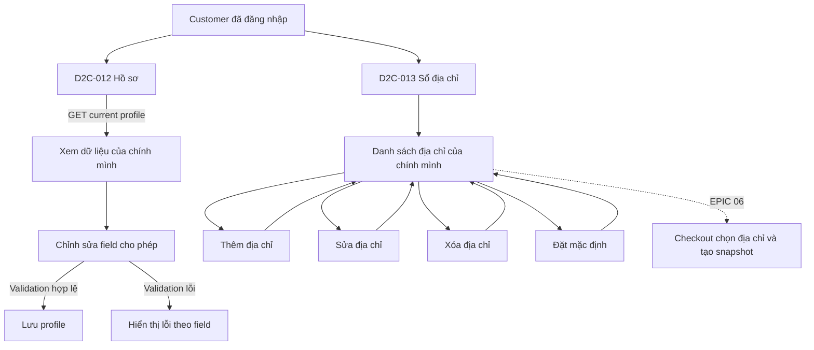

# Customer Profile & Address Book — Scope & Traceability

> Trạng thái: Baseline v0.2 — UI approved; OpenAPI candidate proposed
> Ngày lập: 2026-09-25
> Vertical slice: Customer Profile & Address Book
> Ứng dụng đích: `apps/web-user`

## 1. Nguồn và mục tiêu

Slice này triển khai phần Customer MVP của `EPIC 02 — Customer & Employee Profile`:

- `US-USER-01`, `FR-USER-01..03`, `FR-USER-10`, `UC-USER-01`: khách đã xác thực xem và cập nhật hồ sơ của chính mình.
- `US-USER-02`, `FR-USER-04..05`, `FR-USER-10`, `UC-USER-02`: khách quản lý nhiều địa chỉ nhận hàng và chọn địa chỉ mặc định.
- Visual reference: D2C-012 Hồ sơ cá nhân và D2C-013 Sổ địa chỉ.

HTML/screenshot Stitch chỉ là tham chiếu trình bày. EPIC 02 và các quyết định dưới đây là nguồn sự thật cho field, policy và release scope.

## 2. Phạm vi

### In scope

- Hiển thị hồ sơ của Customer hiện tại.
- Cập nhật họ tên, số điện thoại, ngày sinh và giới tính.
- Hiển thị email đã xác minh ở chế độ chỉ đọc.
- Validation client và mapping lỗi field từ API.
- Hiển thị danh sách địa chỉ của Customer hiện tại.
- Thêm, sửa, xóa địa chỉ và đặt một địa chỉ làm mặc định.
- Dữ liệu địa chỉ đủ để Checkout dùng về sau: người nhận, số điện thoại, phân loại, mã/tên đơn vị hành chính, địa chỉ chi tiết và ghi chú giao hàng.
- Loading, empty, success, validation, unauthorized, forbidden, conflict, server error, offline và slow response.
- Responsive và accessibility cơ bản cho D2C-012/D2C-013.

### Out of scope

- Hồ sơ nhân sự và trạng thái tài khoản Customer — Giai đoạn 2 của EPIC 02.
- Đổi email hoặc xác minh lại email/số điện thoại — cần review chung với Authentication.
- Avatar upload, Loyalty/VIP/điểm thưởng — EPIC 17.
- Khẩu vị, gợi ý cá nhân hóa, kiểu đóng gói — chưa có requirement MVP tương ứng.
- Đổi mật khẩu, 2FA và quản lý phiên — EPIC 01/22/23.
- Danh sách đơn hàng, hậu mãi, đánh giá và thông báo — các epic tương ứng.
- Tính phí vận chuyển, kiểm tra vùng phục vụ và tạo snapshot đơn hàng — EPIC 06.

## 3. Quyết định triển khai MVP

| ID | Quyết định | Lý do |
| --- | --- | --- |
| `PROFILE-OD-01` | Hồ sơ dùng `fullName` bắt buộc; `phone`, `dateOfBirth`, `gender` là tùy chọn. | Cho phép hồ sơ tối thiểu sau đăng ký chỉ có display name/email; Checkout có thể yêu cầu recipient riêng. |
| `PROFILE-OD-02` | `email` chỉ đọc trong slice này. | EPIC chưa chốt xác minh lại khi đổi email; không tạo đường vòng quanh Auth. |
| `PROFILE-OD-03` | `dateOfBirth` không được ở tương lai; chưa áp dụng giới hạn tuổi. | Requirement không quy định độ tuổi tối thiểu. |
| `PROFILE-OD-04` | `gender` nhận `MALE`, `FEMALE`, `OTHER`, `PREFER_NOT_TO_SAY` hoặc `null`. | Không bắt buộc cung cấp dữ liệu nhạy cảm và có lựa chọn riêng tư. |
| `PROFILE-OD-05` | Phone được gửi ở dạng đã loại khoảng trắng/dấu phân cách; backend là nơi normalize/canonicalize. | Tránh frontend tự định nghĩa format lưu trữ cuối cùng. |
| `ADDRESS-OD-01` | Mỗi Customer có tối đa một địa chỉ mặc định; địa chỉ đầu tiên tự động là mặc định. | Đảm bảo Checkout luôn có lựa chọn ưu tiên rõ ràng. |
| `ADDRESS-OD-02` | Đặt địa chỉ khác làm mặc định là thao tác nguyên tử. | Không để trạng thái đồng thời có hai địa chỉ mặc định. |
| `ADDRESS-OD-03` | Có thể sửa/xóa địa chỉ đã từng dùng; Order lưu snapshot riêng và không thay đổi theo Address Book. | Tuân thủ `FR-USER-05` và bảo toàn lịch sử đơn hàng. |
| `ADDRESS-OD-04` | Nếu xóa địa chỉ mặc định khi còn địa chỉ khác, server chọn địa chỉ còn lại cập nhật gần nhất làm mặc định và trả danh sách mới. | Duy trì invariant mà không bắt người dùng thao tác hai bước. |
| `ADDRESS-OD-05` | `HOME`, `OFFICE`, `GIFT`, `OTHER` là nhãn phục vụ UI, không làm thay đổi nghiệp vụ vận chuyển. | Bám mục đích đa điểm của `US-USER-02` nhưng không suy diễn rule shipping. |
| `ADDRESS-OD-06` | Đơn vị hành chính được lưu bằng code ổn định kèm tên hiển thị snapshot; contract cuối cần thống nhất nguồn mã với Checkout/Shipping. | Tránh phụ thuộc text tự do và vẫn chịu được thay đổi danh mục. |

## 4. User flow

## 5. Traceability

| User Story | FR | Screen | Hành vi phải chứng minh | Test level |
| --- | --- | --- | --- | --- |
| `US-USER-01` | `FR-USER-01..03`, `10` | D2C-012 | Chỉ tải/sửa profile hiện tại; validation không ghi dữ liệu sai; save hợp lệ cập nhật UI. | Unit + component/manual + API mock |
| `US-USER-02` | `FR-USER-04`, `10` | D2C-013 | Danh sách chỉ thuộc current Customer; thêm/sửa/xóa/default hoạt động và giữ invariant. | Unit + component/manual + API mock |
| `US-USER-02` | `FR-USER-05` | D2C-013 → Checkout | Address trả đủ dữ liệu cho Checkout; thay đổi Address Book không đổi Order snapshot. | Contract + E2E integration ở EPIC 06 |

## 6. Exit criteria trước API Contract

- Mockoon có happy path và các lỗi UI cần phân biệt.
- UI hoàn thành D2C-012/D2C-013 bằng cùng service interface.
- Validation unit test, lint, typecheck và build pass.
- Người dùng đã duyệt giao diện D2C-012/D2C-013 ngày 2026-09-25.
- OpenAPI candidate đã được lập tại `../03_api_specs/customer-profile-mvp.openapi.yaml`; trạng thái vẫn là `PROPOSED` cho đến khi Backend/Architecture/Security review.
