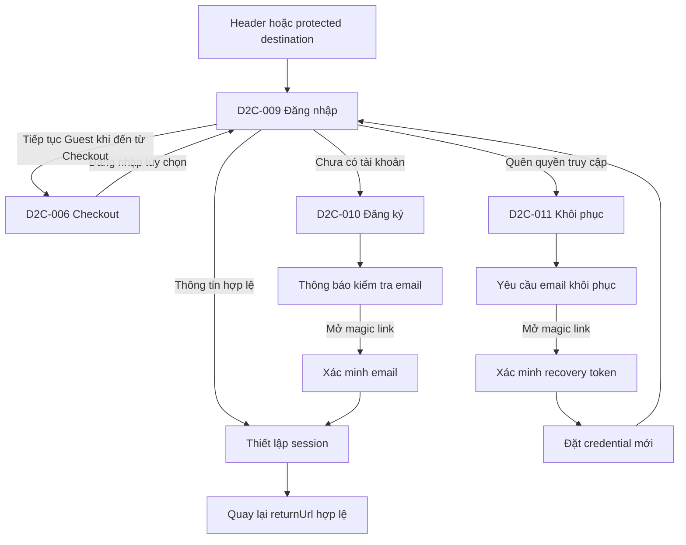

# UI Web Scope & Traceability

> Trạng thái: Baseline v0.2 — Product decisions approved
> Ngày lập: 2026-09-24
> Vertical slice: Authentication MVP
> Ứng dụng đích: `apps/web-user`

## 1. Mục đích

Tài liệu này chốt phạm vi làm việc ban đầu và thiết lập traceability hai chiều giữa release, User Story, Functional Requirement, Use Case, màn hình và kết quả cần kiểm thử.

Đây là baseline đã được Product chấp thuận để team tiếp tục tạo Mock API và UI. Tên endpoint, HTTP status và chi tiết triển khai backend vẫn là candidate cho đến khi Backend/Architecture review.

## 2. Working assumptions cần xác nhận

| ID | Working assumption | Lý do | Nếu thay đổi |
| --- | --- | --- | --- |
| `AUTH-AS-01` | Task UI hiện tại tập trung vào Web D2C trong `apps/web-user`, chưa bao gồm Web Admin. | Thư mục design hiện có 29 màn `D2C-*` và chưa có artifact thiết kế Admin tương ứng. | Phải tách thêm scope, layout và permission model cho `apps/web-admin`. |
| `AUTH-AS-02` | Slice đầu tiên dùng phạm vi MVP v1.0 của EPIC 01. | EPIC 01 đánh dấu `US-AUTH-01`, `02`, `03`, `05` là MVP. | Social Login và Link Guest Order phải được bổ sung nếu release scope mở rộng. |
| `AUTH-AS-03` | Ba màn được implement trong slice là D2C-009, D2C-010 và D2C-011; D2C-006 chỉ là integration point để bảo đảm Guest Checkout không bị chặn. | Guest Checkout thuộc EPIC 01 nhưng phần form/order chính thuộc EPIC 06. | Nếu nhận luôn Checkout, cần phân tích thêm EPIC 05, 06, 07 và các dependency tồn kho/vận chuyển/thanh toán. |
| `AUTH-AS-04` | HTML và screenshot Stitch là visual reference, không phải source of truth cho field, policy hoặc release scope. | Các quyết định Product được ghi tại Mục 7, không suy ra trực tiếp từ nội dung do Stitch tạo. | Thay đổi thiết kế không tự động thay đổi business rule/API contract. |

## 3. Phạm vi slice Authentication MVP

### 3.1. In scope

- Đăng nhập Customer bằng email và mật khẩu.
- Thiết lập, kiểm tra và kết thúc phiên đăng nhập.
- Giữ `returnUrl` hợp lệ và trạng thái giỏ hàng khi đăng nhập từ một hành trình đang dở.
- Đăng ký Customer, chống trùng email và bắt buộc xác minh email trước khi account `ACTIVE`.
- Khởi tạo và hoàn tất khôi phục quyền truy cập bằng email magic link.
- Thông báo chống account enumeration tại login/recovery.
- Trạng thái loading, validation, invalid credential, restricted account, expired/used recovery request, rate limit, provider failure, server error và offline.
- Điểm nối từ Login trở lại Checkout với lựa chọn tiếp tục Guest.
- Responsive và accessibility cơ bản cho D2C-009/010/011.

### 3.2. Out of scope của slice

- Social Login — `US-AUTH-04`, Giai đoạn 2.
- Liên kết Guest Order — `US-AUTH-06`, Giai đoạn 2.
- Tạo/khóa tài khoản nhân viên, RBAC và 2FA Admin — EPIC 22.
- Hồ sơ Customer và sổ địa chỉ — EPIC 02, ngoại trừ điều hướng sau đăng nhập.
- Logic giỏ hàng, shipping, reservation, payment và tạo Order — EPIC 05/06/07.
- Tích hợp thật với Email Provider; trong slice này chỉ mô phỏng response phía API. SMS/Zalo/Identity Provider ngoài MVP.
- Chi tiết triển khai Argon2id, token signing/hashing, Redis và CSRF thuộc Backend/Architecture nhưng phải tuân theo baseline ở Mục 7.

### 3.3. Không được suy diễn từ thiết kế Stitch

Các chi tiết sau đang xuất hiện trong screenshot nhưng **không thuộc baseline đã duyệt**:

- Bắt buộc đồng thời họ tên, số điện thoại, email, ngày sinh và sở thích ăn uống khi đăng ký.
- Mật khẩu chỉ tối thiểu 8 ký tự. Baseline thực tế là 15–128 ký tự và có đủ chữ hoa, chữ thường, số, ký tự đặc biệt.
- OTP luôn gồm 6 chữ số.
- OTP/countdown trong UI. MVP sử dụng email magic link; cooldown gửi lại 60 giây vẫn áp dụng phía server/UI.
- SMS/Zalo là kênh xác minh MVP.
- Google/Zalo/OTP Login thuộc MVP.
- Tặng điểm ngay sau đăng ký.

UI phải lấy baseline tại Mục 7 và không hard-code các nội dung Stitch trái với baseline.

## 4. User flow cấp slice

Quy tắc điều hướng:

- `returnUrl` chỉ chấp nhận đường dẫn nội bộ nằm trong allowlist/routing policy, không chuyển hướng tùy ý sang domain ngoài.
- Thất bại đăng nhập không làm mất giỏ hàng hoặc intended destination.
- Checkout không được chuyển hướng bắt buộc sang Login nếu người dùng chọn Guest.
- D2C-010 không tự liên kết Guest Order sau khi đăng ký.

## 5. Traceability matrix

| Release | User Story | FR | Use Case | Screen/integration | Hành vi cần chứng minh | Test level dự kiến |
| --- | --- | --- | --- | --- | --- | --- |
| MVP v1.0 | `US-AUTH-01` Guest Checkout | `FR-AUTH-01`, `FR-AUTH-02`, `FR-AUTH-09`, `FR-01` | `UC-AUTH-01` | D2C-006 ↔ D2C-009 | Guest tiếp tục checkout không cần account; login là tùy chọn; cart/checkout context không mất. | Component + E2E integration |
| MVP v1.0 | `US-AUTH-02` Customer Registration | `FR-AUTH-03`, `FR-01` | `UC-AUTH-02` | D2C-010 | Tạo Customer từ dữ liệu hợp lệ; không tạo trùng; field error ánh xạ đúng; verification chỉ xuất hiện khi policy yêu cầu. | Component + API mock + E2E |
| MVP v1.0 | `US-AUTH-03` Login | `FR-AUTH-04`, `FR-AUTH-05`, `FR-01` | `UC-AUTH-03`, `UC-AUTH-06` | D2C-009 và protected routes | Login đúng thiết lập session; login sai không thiết lập session; logout kết thúc session; không truy cập chéo dữ liệu Customer. | Unit + component + E2E + contract |
| MVP v1.0 | `US-AUTH-05` Password Recovery | `FR-AUTH-06`, `FR-01` | `UC-AUTH-05` | D2C-011 | Request luôn phản hồi trung tính; request hợp lệ cho phép reset; invalid/expired/used bị từ chối; rate limit/provider error được xử lý. | Component + API mock + E2E |
| Giai đoạn 2 | `US-AUTH-04` Social Login | `FR-AUTH-07`, `FR-01` | `UC-AUTH-04` | D2C-009 conditional UI | Chỉ hiển thị provider đã bật; không tạo trùng identity. Không implement trong slice này. | Deferred |
| Giai đoạn 2 | `US-AUTH-06` Link Guest Order | `FR-AUTH-08`, `FR-01` | `UC-AUTH-07` | D2C-010/Order flow riêng | Chỉ link khi chứng minh ownership; không link trùng. Không implement trong slice này. | Deferred |

## 6. Screen/state coverage

| Screen | Required states trong slice | Deferred/conditional |
| --- | --- | --- |
| D2C-009 Login | initial, client validation, submitting, success redirect, invalid credential, account restricted, rate limited, server error, offline | Social provider states; chỉ bật khi Giai đoạn 2 được duyệt |
| D2C-010 Registration | initial, client validation, submitting, duplicate/generic unavailable email, verification email pending, link invalid/expired/used, delivery failed, verified + auto-login, server error, offline | Guest Order linking; loyalty reward; phone/date of birth/preferences |
| D2C-011 Recovery | request initial, requesting, neutral sent, link invalid/expired/used, resend limited, provider failure, setting new password, success back to Login, server error, offline | SMS/Zalo/OTP recovery |
| D2C-006 integration | Guest continuation visible và hoạt động; optional login giữ checkout context | Toàn bộ checkout implementation thuộc slice Commerce |

## 7. Approved decisions

| ID | Quyết định đã chốt | Trạng thái | Ghi chú triển khai |
| --- | --- | --- | --- |
| `AUTH-OD-01` | Email là identifier duy nhất của Auth MVP. | **DECIDED** | Normalize để so sánh unique không phân biệt hoa thường; lưu giá trị hiển thị phù hợp. Phone thuộc Checkout/Profile. |
| `AUTH-OD-02` | Registration bắt buộc `displayName`, `email`, `password` và chấp nhận phiên bản điều khoản. | **DECIDED** | `passwordConfirmation` chỉ ở client. Không lấy ngày sinh/preferences/phone trong Auth MVP. |
| `AUTH-OD-03` | Account khởi tạo ở `PENDING_VERIFICATION`; chỉ chuyển `ACTIVE` sau khi xác minh email. | **DECIDED** | Guest Checkout không bị ảnh hưởng. |
| `AUTH-OD-04` | Registration verification và recovery dùng email magic link. | **DECIDED** | Không dùng SMS/Zalo/OTP trong MVP; email không được mô tả là MFA. |
| `AUTH-OD-05` | Password dài 15–128 Unicode code point và phải có ít nhất một chữ hoa, chữ thường, chữ số, ký tự đặc biệt. | **DECIDED** | Validation Unicode-aware; khoảng trắng không được tính là ký tự đặc biệt. Cho phép paste/autofill. Không bắt đổi định kỳ. Đây là Product rule chủ động, không phải yêu cầu NIST. |
| `AUTH-OD-05A` | Verification link sống 24 giờ; recovery link sống 15 phút; đều single-use. Cooldown gửi lại 60 giây; tối đa 3 lần/15 phút và 5 lần/giờ theo email/IP. | **DECIDED** | Resend làm mất hiệu lực link cũ. Rate limit cuối cùng cần Security load-test/tuning. |
| `AUTH-OD-06` | Browser dùng opaque `Secure`, `HttpOnly`, `SameSite=Lax`, `__Host-` cookie qua BFF/API Gateway; JWT/refresh token không lộ cho JavaScript. | **DECIDED** | Không dùng `localStorage`/`sessionStorage`; state-changing request có CSRF/Origin protection. |
| `AUTH-OD-07` | Xác minh đăng ký thành công thì auto-login và về `returnUrl`; reset mật khẩu thì không auto-login. | **DECIDED** | Reset thu hồi toàn bộ session và quay về Login. |
| `AUTH-OD-08` | `rememberMe` thuộc MVP và mặc định tắt. | **DECIDED** | Tắt: session cookie/server session tối đa 24 giờ. Bật: persistent session tối đa 30 ngày. |
| `AUTH-OD-09` | UI chỉ hiển thị lỗi chung `ACCOUNT_UNAVAILABLE`. | **DECIDED** | Không tiết lộ suspended/banned/internal-review reason. |
| `AUTH-OD-10` | `returnUrl` chỉ là relative internal path bắt đầu bằng một `/`; từ chối protocol, hostname và `//`. | **DECIDED** | Route vẫn phải qua auth/authorization check sau redirect. |

## 8. Entry/exit criteria của slice

### Ready for Mock

- Các quyết định tại Mục 7 được phản ánh trong request/response và scenario mock.
- Mỗi capability có request/response/error tối thiểu trong `DATA_API_MATRIX.md`.
- Scenario không chứa dữ liệu production hoặc credential thật.

### Ready for UI implementation

- Design token và shared form components đã có implementation plan.
- Mockoon environment chạy được bằng file commit trong repository.
- UI copy cho error/security đã được Product/Security review ở mức cần thiết.

### Ready for API Contract review

- UI hoàn thành happy path và các state chính bằng mock.
- Những field thực sự được UI sử dụng đã được ghi nhận; field mock thừa đã loại bỏ.
- OpenAPI candidate có example và error mapping khớp với matrix.

### Done khi chuyển sang API thật

- Contract được Backend và Architecture chấp thuận.
- Contract test và E2E Auth pass với API Gateway.
- Mock vẫn chạy độc lập cho local development/regression.
- Không còn component gọi URL Mockoon trực tiếp hoặc chứa credential/token mẫu.
