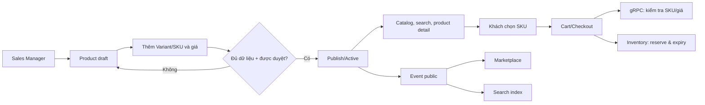

# Phân tích Catalog & Product — `catalog-service`

> Phạm vi: tổng hợp yêu cầu, ranh giới nghiệp vụ, dữ liệu, giao tiếp liên dịch vụ và các quyết định còn mở cho Catalog & Pricing / Product Discovery của dự án Mè Xửng O Mạ.
>
> Trạng thái repository tại thời điểm phân tích: `services/catalog-service/src` chỉ có `.gitkeep`; chưa có mã nguồn, migration, OpenAPI/proto hay test. Vì vậy đây là tài liệu đầu vào để thiết kế/triển khai, không phải mô tả hành vi đã chạy.

## 1. Kết luận ngắn

`catalog-service` là **nguồn sự thật (SSOT) cho dữ liệu thương mại của Product**: danh mục, Product mẹ, Variant/SKU, ảnh tham chiếu, giá niêm yết theo SKU/kênh, trạng thái bán và quy trình duyệt để công khai. Nó đồng thời phục vụ Product Discovery: danh sách, tìm kiếm, lọc và trang chi tiết.

SKU—not Product—là đơn vị khách chọn để mua và là cấp quản lý giá, khối lượng, quy cách và tồn. Catalog **không** sở hữu số tồn, Batch/Lot, NSX/HSD thực tế của lô, reservation, Order, SEO metadata, nội dung biên tập, hồ sơ OCOP hay doanh số/bán chạy. Các dữ liệu này phải được tham chiếu/đồng bộ từ service sở hữu thay vì sao chép thành nguồn sự thật thứ hai.

MVP v1.0 cần hoàn tất Product/SKU cơ bản và Discovery (`US-DISC-01..03`, `US-PROD-01..06`). Giá đa kênh, sản phẩm nổi bật/câu chuyện thương hiệu thuộc giai đoạn 2; AI search/recommendation thuộc giai đoạn 3. Một số tài liệu kiến trúc hiện chưa nhất quán về broker, tên event, tên database, và chủ sở hữu media/NSX-HSD; các điểm này được ghi riêng ở mục 15 và cần chốt trước khi phát triển.

## 2. Tài liệu đã đối chiếu

| Nhóm | Tài liệu | Nội dung dùng trong phân tích |
| --- | --- | --- |
| Backlog gốc | `docs/01_requirements/01_Product_Backlog.md` | BR-PROD-01..04; US của EPIC 03, 04; mức ưu tiên. |
| Đặc tả Epic | `docs/01_requirements/epics/EPIC_03_Product_Discovery.md` | Discovery, search/filter, đề xuất, AI, phụ thuộc và các điểm cần chốt. |
| Đặc tả Epic | `docs/01_requirements/epics/EPIC_04_Product_SKU.md` | Product/SKU/giá/trạng thái, acceptance criteria, FR-PROD-01..12. Đây là nguồn chi tiết chính. |
| FR/NFR & kế hoạch | `04_Functional_Requirements.md`, `03_Non_Functional_Requirements.md`, `02_Sprint_Planning.md` | FR-04, FR-31, ràng buộc chất lượng và lộ trình phát hành. |
| Use case | `use_case_specification.md` | UC-DISC-01..04, UC-AI-01..02, UC-PROD-01..05 và use case media. |
| Kiến trúc miền | `docs/02_architecture/domain_design.md`, `bounded_context.md` | Domain 5/BC-05, aggregate, ubiquitous language, context map và event catalog. |
| Ranh giới service | `docs/02_architecture/service_boundary.md` | MS-05, datastore dự kiến, API và event được công bố/tiêu thụ. |
| Kiến trúc hệ thống | `high_level_design.md`, `system_design.md` | REST/gRPC/Kafka, timeout, retry, circuit breaker, nguyên tắc async. |
| Epic liên quan | EPIC 09, 12, 15, 19, 20, 22, 23 | Ranh giới với Inventory, Marketplace, Review, OCOP, SEO/Content, RBAC và Audit. |
| Hạ tầng | `infra/scripts/init-databases.sql`, `infra/docker/docker-compose.infra.yml` | Database được khởi tạo và broker/object storage thực tế trong compose. |

Tài liệu `docs/03_api_specs` được README mô tả nhưng chưa tồn tại trong workspace; không có contract chính thức để kiểm chứng payload, mã lỗi hay phiên bản API/event.

## 3. Phạm vi nghiệp vụ và lộ trình

### 3.1. Trong phạm vi của Catalog & Pricing

| Năng lực | Cấp dữ liệu | Phát hành |
| --- | --- | --- |
| Category có cấu trúc phân cấp; duyệt danh mục | Product/Category | MVP |
| Tạo, sửa Product mẹ: tên, mô tả, thành phần, bảo quản, ảnh | Product | MVP |
| Tạo/sửa Variant và SKU duy nhất: khối lượng, hương vị, quy cách | SKU | MVP |
| Chọn SKU trước khi thêm giỏ; hiển thị thông tin SKU | Product + SKU | MVP |
| Giá niêm yết theo SKU | SKU | MVP |
| Listing status và approval/publication | Product, cần chính sách rõ cho SKU | MVP |
| Catalog công khai, tìm kiếm từ khóa, lọc kết hợp | Read model | MVP |
| Giá theo Website/Shopee/TikTok/POS/B2B | SKU + channel | Giai đoạn 2 |
| Bán chạy/gợi ý chung; câu chuyện thương hiệu | Read model/Content tham chiếu | Giai đoạn 2 |
| AI search assistant, recommendation cá nhân hóa | Read-only discovery | Giai đoạn 3 |

### 3.2. Ngoài phạm vi / chỉ tham chiếu

| Dữ liệu hoặc quy trình | Chủ sở hữu | Cách Catalog dùng |
| --- | --- | --- |
| Tồn vật lý, available/reserved, Batch, FEFO, NSX/HSD thực tế | Inventory & Batch / EPIC 09 | Tra cứu khả năng bán; không tự ghi/suy diễn. |
| Cart, checkout, price snapshot, Order lifecycle | Order / EPIC 05–08 | Nhận `sku_id` cụ thể; Order gọi kiểm tra giá tại checkout. |
| Đồng bộ listing, external SKU mapping, order/settlement sàn | Marketplace / EPIC 12 | Cấp Product/SKU/giá/trạng thái đã duyệt; Marketplace sở hữu mapping và trạng thái sync. |
| Review gốc, verified status, review media | Care/Review / EPIC 15 | Nhận event để cập nhật số liệu rating hiển thị. |
| QR, chứng nhận, nguồn gốc | Traceability / EPIC 19 | Nhận event để gắn badge/trạng thái trình bày. |
| Article, SEO metadata, slug/canonical/sitemap | Content & SEO / EPIC 20 | Catalog là nguồn Product; không sửa metadata SEO. |
| Doanh thu, tiêu chí bestseller, recommendation model | Analytics/DSS / EPIC 25 | Chỉ hiển thị kết quả đã duyệt, không tự tính từ Order. |
| Permission, Audit Log | Administration/Identity và Audit / EPIC 22–23 | Kiểm tra quyền; phát hành audit evidence cho hành vi quan trọng. |

## 4. Traceability: rule, FR, user story và release

### 4.1. Quy tắc cốt lõi

| Mã | Quy tắc | Hệ quả kỹ thuật/nghiệp vụ cho service |
| --- | --- | --- |
| BR-PROD-01 | Một Product có thể có nhiều Variant/SKU. | `Product` là aggregate root; SKU thuộc đúng một Product. |
| BR-PROD-02 | Giá, khối lượng, quy cách đóng gói và tồn kho quản lý theo SKU. | Không lưu một giá/tồn có thể mua duy nhất tại Product; request mua phải định danh SKU. |
| BR-PROD-03 | Thực phẩm có NSX/HSD phù hợp. | Phải kiểm tra dữ liệu bắt buộc trước công khai; Batch thực tế vẫn là Inventory SSOT. |
| BR-PROD-04 | Thông tin hiển thị cho khách phải được quản lý và phê duyệt. | Create/update không tự public; mọi public query phải lọc approval + listing status. |
| BR-BATCH-05 | Hàng hết hạn không được tiếp tục bán. | Catalog không đánh dấu “có thể mua” chỉ từ Product; khả năng bán cần Inventory. |
| BR-ORDER-02 | Không xác nhận đơn vượt tồn khả dụng. | Validation catalog không thay `ReserveStock`; Checkout gọi Inventory nguyên tử. |
| BR-AUDIT-01 | Thao tác quan trọng phải ghi Audit. | Giá, SKU, status, approval và thay đổi quan trọng phải có event/audit payload. |

### 4.2. Requirements cấp service

| Nhóm | Requirement | Tóm tắt thực thi |
| --- | --- | --- |
| FR-04 | Product & SKU | Quản lý Product, Category, Variant, SKU và duyệt giá đa kênh. |
| FR-31 | Product Discovery & AI | Search, filter nâng cao, engine gợi ý. |
| FR-PROD-01..02 | Product hợp lệ | Tạo/cập nhật và kiểm tra dữ liệu bắt buộc trước lưu/công khai. |
| FR-PROD-03..05 | SKU | Nhiều SKU, thuộc tính nhận diện không nhầm lẫn, bắt buộc chọn SKU khi cần. |
| FR-PROD-06 | Food information | Chỉ hiển thị thành phần, khối lượng, NSX/HSD, bảo quản được phép công khai. |
| FR-PROD-07,10,11 | Pricing | Giá độc lập theo SKU; channel price; Order lịch sử giữ snapshot. |
| FR-PROD-08..09 | Sellability | Status kiểm soát thêm mới vào giỏ/checkout; tồn/hết hạn từ EPIC 09. |
| FR-PROD-12 | Governance | RBAC và audit thay đổi Product/SKU/price/status. |
| FR-DISC-01..06 | Discovery MVP | Catalog public, category, keyword, filter kết hợp, đọc thuộc tính SKU, không quảng bá hàng không bán được. |
| FR-DISC-07..08 | Discovery phase 2 | Bestseller/gợi ý chung hợp lệ; Content đã xuất bản. |
| FR-DISC-09..11 | AI phase 3 | AI chỉ gợi ý public catalog, có fallback, không được mutate nghiệp vụ/tự thêm giỏ. |

## 5. Actor và phân quyền

| Actor | Quyền/cách dùng Catalog | Không được suy ra tự động |
| --- | --- | --- |
| Guest Customer (ACT-01) | Xem Product/SKU công khai, search/filter, chọn SKU. | Xem draft, dữ liệu Batch riêng, thao tác quản trị. |
| Registered Customer (ACT-02) | Như Guest; nhận recommendation nếu consent/dữ liệu hợp lệ. | Tự thêm hàng bởi AI; truy cập dữ liệu hành vi của người khác. |
| Sales Manager (ACT-12) | Tạo/sửa Product, SKU, giá, trạng thái theo permission. | Mọi thao tác đều được phép chỉ vì có chức danh; approval workflow còn cần chốt. |
| Marketplace Operator (ACT-09) | Dùng dữ liệu giá/kênh đã duyệt trong EPIC 12. | Sửa catalog gốc hoặc tự suy đoán SKU mapping. |
| Offline Sales Staff (ACT-10) | Áp dụng giá Offline hiệu lực. | Sửa price policy. |
| B2B Customer (ACT-03) | Nhận giá/chính sách B2B qua EPIC 18. | Sửa catalog hoặc price policy. |
| Content Manager (ACT-13) | Tham chiếu Product đã public để viết/SEO. | Sửa thương mại Product/SKU/price/status. |

Tất cả admin API phải được Gateway/Identity truyền trusted identity context; service vẫn kiểm tra permission ứng với action. Quyền tối thiểu nên tách `catalog.product.create/update`, `catalog.sku.manage`, `catalog.price.manage`, `catalog.product.submit`, `catalog.product.approve/publish`, `catalog.product.suspend/archive`, `catalog.media.manage`. Đây là **đề xuất thiết kế**, không phải permission matrix đã chốt.

## 6. Mô hình miền và sở hữu dữ liệu

### 6.1. Ubiquitous language

- **Parent Product**: đơn vị giới thiệu/marketing, có tên, mô tả, thành phần, bảo quản, category, media.
- **Product Variant / SKU**: lựa chọn thương mại cụ thể theo khối lượng, hương vị và quy cách; khách chọn SKU để mua.
- **Channel Price**: giá của một SKU cho một sales channel.
- **Listing Status**: `ACTIVE`, `SUSPENDED`, `ARCHIVED` theo BC-05.
- **Approval Status**: `DRAFT`, `PENDING`, `APPROVED` theo BC-05. Ý nghĩa chuyển trạng thái và actor duyệt chưa được xác định đầy đủ.
- **Sellability**: kết quả tổng hợp status/approval của Catalog và availability/expiry của Inventory; không phải một số tồn do Catalog sở hữu.

### 6.2. Aggregate được nêu trong kiến trúc

```text
Product (aggregate root)
├── product_id
├── name, description, ingredients, storage_guide
├── images[] -> ProductImage (S3 object key/reference)
├── category_id -> Category
├── variants[]
│   ├── variant_id
│   ├── sku (unique)
│   ├── weight, flavor, packaging
│   └── prices[]
│       ├── channel
│       └── price (Money)
├── listing_status
├── approval_status
└── approved_by
```

`categories`, `product_variants`, `channel_prices`, `product_images` cũng được service boundary liệt kê là dữ liệu MS-05 sở hữu. Category hỗ trợ hierarchy, nhưng đặc tả chưa chốt cây danh mục, đa-gán category, thứ tự hiển thị hay soft delete.

### 6.3. Invariant cần enforce

1. SKU là duy nhất theo chính sách toàn catalog; không cho create/update gây trùng hoặc mơ hồ.
2. Variant chỉ tồn tại trong một Product; sửa Variant không vô tình đổi Product khác.
3. Weight/flavor/packaging/price thuộc SKU, không dùng dữ liệu Product để ghi đè SKU đã chọn.
4. Public read chỉ trả Product/SKU đủ điều kiện approval và listing; SKU suspended/hết khả năng bán không thể hoàn tất mua.
5. Giá hợp lệ phải gắn đúng SKU và channel; update một SKU không tác động SKU khác.
6. Archive/suspend không được sửa hồi tố order đã phát sinh; Order lưu snapshot riêng.
7. Dữ liệu public về thực phẩm phải đầy đủ/đã duyệt; không suy ra Batch sẽ xuất thực tế từ mô tả catalog.

### 6.4. Mô hình dữ liệu vật lý đề xuất

Thiết kế dưới đây là suy luận triển khai từ aggregate và data ownership, chưa phải schema được phê duyệt:

| Bảng | Khóa/chỉ mục quan trọng | Trường chính |
| --- | --- | --- |
| `categories` | `id`, `parent_id`, unique sibling slug/code | name, description, position, active/public status. |
| `products` | `id`, unique slug/code nếu được chốt, `(approval_status, listing_status)` | name, description, ingredients, storage guide, category/reference, approval metadata, version/timestamps. |
| `product_variants` | `id`, unique `sku`, index `product_id` | weight + unit, flavor, packaging, variant listing status. |
| `channel_prices` | unique `(variant_id, channel, effective_from)` hoặc rule hiệu lực tương đương | amount, currency, tax policy, effective_from/to, status/version. |
| `product_images` | index `(product_id, position)` | object key, alt text, role (cover/gallery), position, media status. |
| `product_categories` | chỉ cần khi Product đa-category được chốt | product/category relation và display position. |
| `outbox_events` | unique event id, aggregate/version | event type, payload, occurred_at, publish status. |

Không nên đặt `stock_quantity`, `batch_no`, `available_qty`, batch-level NSX/HSD hay external marketplace mapping vào các bảng catalog như nguồn chuẩn. Nếu cache read model các trường đó, phải ghi rõ `source`, `observed_at`/version và cơ chế invalidation.

## 7. Luồng nghiệp vụ chính



### 7.1. Quản trị Product/SKU

1. Sales Manager có quyền tạo Product ở `DRAFT` với các trường bắt buộc.
2. Thêm SKU/Variant, đảm bảo mã SKU/thuộc tính nhận diện hợp lệ; cấu hình giá cơ bản (và channel price ở giai đoạn 2).
3. Kiểm tra thông tin thực phẩm cần public và điều kiện approval.
4. Submit/approve/publish theo workflow cần chốt. Chỉ khi `APPROVED` và `ACTIVE` thì public query/index/listing được nhìn thấy.
5. Sửa nội dung, SKU, giá hoặc trạng thái phải được kiểm soát quyền, lưu audit evidence và cập nhật projection/index/event tương ứng.

### 7.2. Khám phá và mua

- Danh mục/search/filter chỉ trả Product public. Khi filter theo giá, khối lượng hay availability, predicate thực tế ở SKU; UI cần diễn giải rõ Product được trả về vì có **ít nhất một** SKU khớp.
- Nếu Product nhiều SKU, hành động mua buộc khách chọn SKU; không tự chọn một SKU mặc định mơ hồ.
- Detail phải đổi weight/flavor/packaging/price theo SKU đã chọn.
- SKU suspended, stock bằng 0 hoặc chỉ còn Batch hết hạn không thể hoàn tất mua. Catalog có thể hiển thị trạng thái, nhưng Inventory là authority cho availability/expiry.
- Cart/Checkout phải xác thực lại SKU và giá; giá trong Order sau khi đặt là snapshot và không thay đổi khi Catalog sửa sau đó.

### 7.3. Trạng thái: điểm cần định nghĩa kỹ hơn

Tài liệu có hai trục `approval_status` và `listing_status`, nhưng không mô tả state machine. State machine tối thiểu nên được PO xác nhận trước khi code:

```text
DRAFT -> PENDING -> APPROVED -> ACTIVE
                 \-> REJECTED -> DRAFT
ACTIVE -> SUSPENDED -> ACTIVE
ACTIVE/SUSPENDED -> ARCHIVED (không khôi phục nếu chính sách cấm)
```

Đây là đề xuất minh họa. Cần quyết định: approval cấp Product hay SKU/price; product `ACTIVE` mà một SKU `SUSPENDED` có được không; hành vi khi Product/SKU bị suspend đối với cart đang tồn tại; và publish lại sau update có cần duyệt lại không.

## 8. Product Discovery

### 8.1. Chức năng MVP

| Hành vi | Tiêu chí quan trọng |
| --- | --- |
| Danh sách/danh mục | Chỉ Product public, có trạng thái empty và đường quay lại. |
| Keyword search | Từ khóa hợp lệ; no-result rõ; cần chốt có search name/SKU/ingredients/synonym và xử lý tiếng Việt dấu/không dấu. |
| Lọc | Price, weight, product type/category, rating, in-stock; kết hợp theo AND; biểu diễn filter đang áp dụng và bỏ từng/tất cả filter. |
| Product detail | Product public; SKU selection; food information công khai; giá của SKU; trạng thái không mua được rõ ràng. |

Rating phụ thuộc EPIC 15 (giai đoạn 2). MVP cần chốt ẩn filter rating, disable hay hiển thị “chưa có đánh giá”. `in-stock` cũng là field derived từ Inventory, không thể chỉ đánh dấu từ Catalog.

### 8.2. Giai đoạn sau

- Bestseller/gợi ý chung chỉ hiển thị Product còn public và purchasable; thuật toán, cửa sổ thời gian, approval policy do Analytics/PO chốt.
- Câu chuyện thương hiệu lấy Content đã publish, không public draft/hidden Content.
- AI search và personalized recommendation chỉ đọc tập Product public/hợp lệ, có fallback sang search/filter truyền thống, tuân thủ privacy/consent; AI không có quyền mutation hoặc tạo cart/order.

### 8.3. Read model và tìm kiếm

Architecture chỉ định PostgreSQL cho master data, Elasticsearch cho full-text/filter/sort và Redis cache `catalog:product:*`. Luồng write cần theo transactional outbox/projection để tránh Product đã publish nhưng index/cache sai lệch. Điều này là khuyến nghị triển khai phù hợp với kiến trúc event-driven; tài liệu chưa quy định outbox hay SLA đồng bộ index.

Public detail phải có fallback an toàn khi search index/cache lag: đọc master hoặc ẩn kết quả chưa đạt điều kiện public, tuyệt đối không trả draft/price chưa duyệt. Invalidation cần xảy ra khi Product/SKU/price/status/approval/media thay đổi; availability cache từ Inventory phải kèm TTL/version.

## 9. API và contract cần có

### 9.1. Contract được kiến trúc nêu trực tiếp

| Loại | Contract | Mục đích |
| --- | --- | --- |
| REST public | `GET /api/v1/products` | Danh sách, pagination, filter. |
| REST public | `GET /api/v1/products/{product_id}` | Chi tiết Product và các SKU public. |
| REST public | `GET /api/v1/products/search?q=...` | Full-text search. |
| REST public | `GET /api/v1/categories` | Danh mục. |
| REST public | `GET /api/v1/products/recommended` | Recommendation/đề xuất. |
| gRPC | `GetProductPrice` | Order kiểm tra giá checkout, timeout 2s. |
| gRPC | `ValidateProductAvailability` | Được service boundary liệt kê; cần tránh trùng authority với Inventory. |
| REST admin | `POST /api/v1/admin/products`, `PUT /api/v1/admin/products/{id}` | Tạo/cập nhật Product. |
| REST admin | `POST /api/v1/admin/products/{id}/approve` | Approve/publish theo tài liệu. |
| REST admin | `PUT /api/v1/admin/products/{id}/prices` | Sửa price table. |

High-level design còn nêu các tên `ValidatePriceAndSKU`, `GetProductDetail`, `GetProductPrice`, trong khi service boundary nêu `GetProductPrice`, `ValidateProductAvailability`. Chưa có `.proto`/OpenAPI, nên **không được xem đây là signature cuối**.

### 9.2. Hợp đồng đề xuất tối thiểu cho checkout

`GetProductPrice`/`ValidatePriceAndSKU` nên nhận `sku_id` hoặc canonical SKU, `channel`, `currency`, thời điểm áp dụng và correlation id; trả về ít nhất Product/SKU identity, listing/approval result, unit price, currency/tax basis, price version/effective window và reason code nếu không hợp lệ. Không trả hay quyết định số tồn cuối cùng.

`Inventory.ReserveStock` mới là quyết định nguyên tử cuối cùng về sellability/tồn/hạn. Nếu Catalog cung cấp `ValidateProductAvailability`, nó chỉ nên là read hint/projection hoặc đổi tên rõ để tránh caller hiểu nhầm đó là reservation guarantee.

### 9.3. Quy ước API cần quyết định

- Phân trang/cursor, sort mặc định, giới hạn filter/query search và `include` fields.
- Public identifier: UUID, slug, SKU hay kết hợp; `GET /products/{product_id}` hiện nêu id, SEO slug thuộc Content.
- Error format và mã nghiệp vụ: SKU không tồn tại, Product chưa public, SKU suspended, channel price thiếu/hết hiệu lực, version conflict.
- Idempotency cho create/update/approve/price update; optimistic locking/version cho concurrent admin edits.
- Quy tắc media upload: presigned URL hay proxy, scan/validation, lifecycle/xóa reference.

## 10. Tích hợp liên dịch vụ

### 10.1. Đồng bộ (critical path)

Catalog là upstream/OHS Published Language cho Order. Context map quy định gRPC sync với timeout 2 giây, tối đa một retry và circuit breaker cho critical path. Synchronous query chỉ dành cho caller đang cần kết quả tức thời; side effect không được chặn checkout.

| Đối tác | Catalog cấp/nhận | Lưu ý |
| --- | --- | --- |
| Order/Cart/Checkout | SKU hợp lệ, public/listing status, giá hiệu lực | Order giữ snapshot; Catalog không reserve stock. |
| Inventory | Nguồn SKU/thuộc tính bán | Inventory quản lý qty/Batch/expiry; Catalog có thể dùng projection read-only. |
| Mobile BFF/Analytics | Product detail read query | Không mở quyền admin hay lộ draft. |

### 10.2. Event được công bố

| Topic theo service boundary | Event | Consumer / tác dụng |
| --- | --- | --- |
| `catalog.product.published` | `ProductPublishedEvent` | Marketplace/channel và Elasticsearch indexer đồng bộ Product public. |
| `catalog.price.changed` | `PriceChangedEvent` | Order (validate cart), Marketplace, Audit. |
| `catalog.product.suspended` | `ProductSuspendedEvent` | Order validate lại cart. |

Event catalog trong `bounded_context.md` chỉ có hai event đầu. Khi triển khai cần quyết định schema version, key (khuyến nghị `product_id` hay `sku_id` tùy event), idempotency id, aggregate version, occurred_at, actor/correlation id và dữ liệu tối thiểu. Không nên phát full entity hoặc PII không cần thiết.

### 10.3. Event được tiêu thụ

| Topic/event | Nguồn | Hành động Catalog nêu trong service boundary |
| --- | --- | --- |
| `ocop.traceability.published` / `TraceabilityPublishedEvent` | Traceability | Gắn badge OCOP vào product display. |
| `care.review.submitted` / `ReviewSubmittedEvent` | Care | Cập nhật average rating trên Product. |
| `inventory.stock.changed` / `StockLevelChangedEvent` | Inventory | High-level design nêu làm mới cache tồn Redis; service boundary MS-05 lại không liệt kê event này. |

Consumer phải idempotent và phân biệt dữ liệu source với projection. Rating/badge/availability cache không được trở thành record gốc thay thế Review/Traceability/Inventory.

### 10.4. Các luồng kênh và nội dung

- Marketplace dùng Product/SKU, giá kênh, status được Catalog cấp; external listing/line item phải mapping xác định về internal SKU, không fuzzy-match theo tên.
- Content/SEO tham chiếu Product; metadata không thể làm Product public trước workflow Catalog hay sửa price/SKU/status.
- Traceability liên kết đúng Product/SKU/Batch; QR cấp Product/SKU/Batch phải hiển thị rõ scope. Catalog chỉ hiển thị badge sau sự kiện đã publish.
- Review tham chiếu Product/SKU đã mua; Catalog chỉ aggregate display rating theo policy phải chốt (review hidden/withdrawn ảnh hưởng thế nào).

## 11. Media và thông tin thực phẩm

README và service boundary nói Catalog quản lý `product_images` bằng MinIO/S3 keys; Use Case UC-PROD-06 còn nêu tải/tối ưu ảnh/video Product. Tuy vậy EPIC 20 nói Content sở hữu **Content Media Reference** và không sở hữu file vật lý; object storage (`EXT-09`) giữ file. Suy ra Catalog nên sở hữu **reference/metadata liên kết Product**, không sở hữu object bytes hay Content media references.

Quy tắc tối thiểu đề xuất:

- Lưu object key, media type, alt text, thứ tự, cover/gallery, trạng thái scan/approval; dùng bucket/prefix và IAM/presigned URL tách public/private.
- Không hard-delete object ngay khi bỏ reference nếu còn Content/Review dùng chung; cần reference counting hoặc lifecycle policy.
- Validate type/size/dimension, chống file độc hại và giữ audit khi thay media public.
- `ingredients`, `storage_guide` thuộc Product; `weight` thuộc SKU.
- NSX/HSD public cần chỉ rõ là thông tin nhãn Product/SKU hay Batch được cấp cho hàng xuất. Với Batch thực tế, EPIC 09 là SSOT và catalog không được hứa một ngày cụ thể không thể đảm bảo.

## 12. NFR áp dụng cho Catalog

| NFR | Áp dụng thực tế |
| --- | --- |
| NFR-01 Performance | Product list/detail/search/filter phải có response phù hợp; cache/index chỉ là tối ưu, không phá publication policy. Chưa có SLO/P95 số cụ thể. |
| NFR-02 Mobile first | Filter, SKU selector, image và empty state dùng tốt trên mobile/web/app. |
| NFR-03 Availability | Catalog public cần chịu peak Tết/mùa quà; read cache, graceful degradation khi recommendation/search phụ trợ lỗi. |
| NFR-04/05 Security & authorization | Không lộ draft, internal media, price policy/permission trái quyền; xác thực admin action. |
| NFR-06 Integrity | Giá/SKU/channel cần version/concurrency control; Inventory mới xử lý anti-overselling. |
| NFR-07 Audit integrity | Audit evidence cho thay đổi quan trọng, không dùng log/tracing thay Audit. |
| NFR-08 Privacy | AI/recommendation chỉ dùng hành vi được phép; event giảm PII. |
| NFR-09 Media security | Media public/private và presigned access theo policy; packing video không thuộc Catalog. |
| NFR-10 Scalability | PostgreSQL master, Elasticsearch read/search, Redis cache theo kiến trúc; có invalidation/TTL. |
| NFR-11 Observability | Health check PostgreSQL/search/cache/broker/object store, metrics latency/error/cache-hit/index lag, trace/correlation id; log không thay business/audit event. |

## 13. Chiến lược kiểm thử cần có

### Unit/domain

- Không cho SKU trùng, giá âm/không hợp lệ, price channel/effective window chồng lấn theo policy.
- Product nhiều SKU; giá/thuộc tính SKU độc lập; update không cross-product.
- Public predicate chặn draft/pending/rejected/suspended/archived đúng state machine.
- Chọn SKU bắt buộc khi Product có nhiều Variant; không mặc định sai.
- Concurrent admin update phải phát hiện version conflict hoặc áp dụng idempotency.

### Integration/contract

- Contract REST public/admin và gRPC checkout; verify timeout/circuit-breaker behavior từ caller.
- Outbox/event producer phát đúng một event logic khi retry; consumer idempotent với review/OCOP/stock event.
- Product publish/suspend/price change cập nhật index/cache, không lộ dữ liệu cũ hoặc draft khi projection lag.
- Inventory unavailable/expired khiến UI/checkout không mua được nhưng Catalog không ghi giảm stock.
- Marketplace mapping chỉ chấp nhận exact internal SKU; Order historical price không đổi sau price change.

### E2E/acceptance

- Các scenario Gherkin của US-PROD-01..07 và US-DISC-01..05 phải được chuyển thành test.
- Search tiếng Việt có/không dấu, query rỗng, no-result, combined filters, empty category.
- Guest/Customer chỉ xem public; Sales Manager đúng permission được sửa; actor thiếu quyền không đổi price/status.
- AI fallback và privacy; AI không mutation/cart/order.
- Audit kiểm tra who/what/when/object/before/after/reason khi catalog action yêu cầu.

## 14. Thứ tự triển khai khuyến nghị

1. Chốt các quyết định mục 15; tạo API/proto/event schemas có version trước khi code consumer.
2. Khởi tạo `om_catalog_db` + migration Product/Category/SKU/price/media, unique/index/concurrency fields và transactional outbox.
3. Xây domain/application admin: Product, SKU, base price, status/approval, RBAC/audit evidence.
4. Xây public Product detail/category/list/filter; chỉ public record đạt policy; làm UI SKU selection.
5. Xây gRPC `GetProductPrice`/SKU validation và contract test với Order; tích hợp Inventory theo ranh giới read vs reserve.
6. Bổ sung indexer/cache/media flow, metrics/tracing/health checks và E2E MVP.
7. Giai đoạn 2: channel pricing, marketplace contracts, review aggregate, OCOP badge, Content links/bestseller.
8. Giai đoạn 3: analytics-backed recommendation và AI với consent/fallback/guardrail.

## 15. Mâu thuẫn, thiếu sót và quyết định cần chốt

| Ưu tiên | Vấn đề quan sát được | Tác động | Quyết định cần có |
| --- | --- | --- | --- |
| Blocker | Architecture nói Kafka cho domain event; compose hiện chỉ chạy RabbitMQ. | Không thể chọn client/topic/DLQ/consumer semantics đúng. | Chọn Kafka, RabbitMQ, hay cập nhật hạ tầng/tài liệu; định nghĩa broker convention duy nhất. |
| Blocker | DB kiến trúc ghi `catalog_db`, script tạo `om_catalog_db`. | App config/migration có thể dùng sai DB. | Chuẩn hóa tên database. |
| Blocker | `ProductPublishedEvent`/`PriceChangedEvent` khác với `ProductCreatedEvent`/`ProductPriceChangedEvent` trong high-level design. | Consumer và schema không tương thích. | Chốt event catalog, naming, topic và payload/version; tạo package contract. |
| Blocker | gRPC names mâu thuẫn: `GetProductPrice`, `ValidateProductAvailability`, `ValidatePriceAndSKU`, `GetProductDetail`. | Order/Channel không có interface chắc chắn. | Chốt `.proto`, SLA/error codes và authority; loại/đổi tên availability validation nếu gây hiểu nhầm reservation. |
| High | EPIC 04 coi NSX/HSD là catalog information bắt buộc để public, nhưng EPIC 09 sở hữu Batch/NSX/HSD thực tế. | Có thể hiển thị thông tin sai lô xuất. | Xác định field nhãn Product/SKU so với Batch actual, policy public và precedence. |
| High | Product aggregate chỉ có `category_id`; discovery nói có thể nhiều category và category hierarchy. | Schema/API/filter chưa quyết định. | Chốt one-to-many hay many-to-many, taxonomy, order, lifecycle category. |
| High | Approval/Listing state nêu trạng thái nhưng chưa có transition/actor/level áp dụng. | Có thể public sai hoặc chặn sale không chủ đích. | Chốt state machine Product/SKU/price, separation of duties, republish policy, cart behavior. |
| High | Price policy chưa chốt currency, tax/fee, effective date, precedence với promotion/B2B quote. | Hiển thị/checkout sai giá. | Chốt price model và precedence; Order snapshot source/version. |
| Medium | Review rating và stock availability là cache/projection nhưng event/policy chưa đầy đủ. | Filter/sort sai hoặc stale. | Chốt formula, status review được tính, freshness/TTL và fallback. |
| Medium | Service boundary nói catalog quản lý product images; EPIC 20 quản lý Content Media Reference; use case nói video product. | Ownership file/reference/access có thể chồng. | Chốt media model/bucket/prefix/approval/lifecycle và quyền public. |
| Medium | Search requirements chưa chốt Vietnamese normalization, fields, synonym, ranking/sort. | Discovery quality và index design mơ hồ. | Chốt relevance/filter semantics, pagination, query guardrails, SLO. |
| Medium | API specs, proto, migration, source và test chưa tồn tại. | Không thể contract-test/estimate chính xác. | Tạo artifacts versioned trước implementation. |
| Low | Requirement release có lệch: EPIC 20 tự ghi MVP dù Sprint Plan xếp Content/SEO giai đoạn 2. | Catalog integration timeline mơ hồ. | Product Owner xác nhận release source of truth. |

## 16. Checklist Definition of Done cho MVP catalog

- [ ] Có schema/migration `om_catalog_db` đã chốt; không dùng database chung với service khác.
- [ ] Product, Category, SKU, base price, media reference, approval/listing status hoạt động cùng validation/invariant.
- [ ] Public APIs không trả draft/pending/rejected/suspended/archived trái chính sách.
- [ ] Khách chọn SKU rõ ràng; giá/khối lượng/quy cách đúng SKU.
- [ ] Search/filter/category có pagination, empty state và policy SKU-level rõ ràng.
- [ ] Contract gRPC với Order có timeout/error/idempotency behavior được test.
- [ ] Inventory remains SSOT cho stock/Batch/expiry; không dùng Catalog validation thay reservation.
- [ ] Publish/price/suspend events, outbox và consumer idempotency có contract test.
- [ ] Price/SKU/status/approval thay đổi được RBAC và audit theo catalog audit đã chốt.
- [ ] MinIO/S3 media access, cache/index invalidation, observability và health checks được kiểm thử.
- [ ] Unit, integration, contract và E2E cover acceptance criteria MVP.

## 17. Nguồn tham chiếu ưu tiên khi cập nhật

Khi một rule thay đổi, cập nhật theo thứ tự: Product Backlog → Epic 03/04 → FR/Sprint Plan → Use Cases → Domain/Bounded Context → Service Boundary/API/Event contracts → implementation/test. `docs/01_requirements/README.md` yêu cầu thay đổi lớn ở luồng nghiệp vụ phải đồng bộ trở lại Product Backlog và Sprint Planning.
